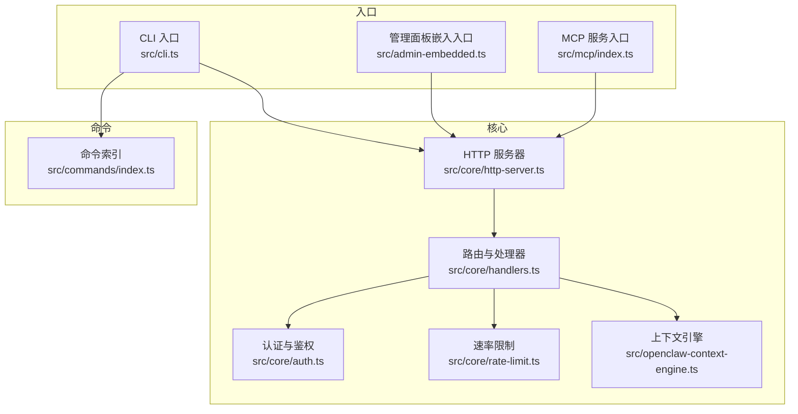
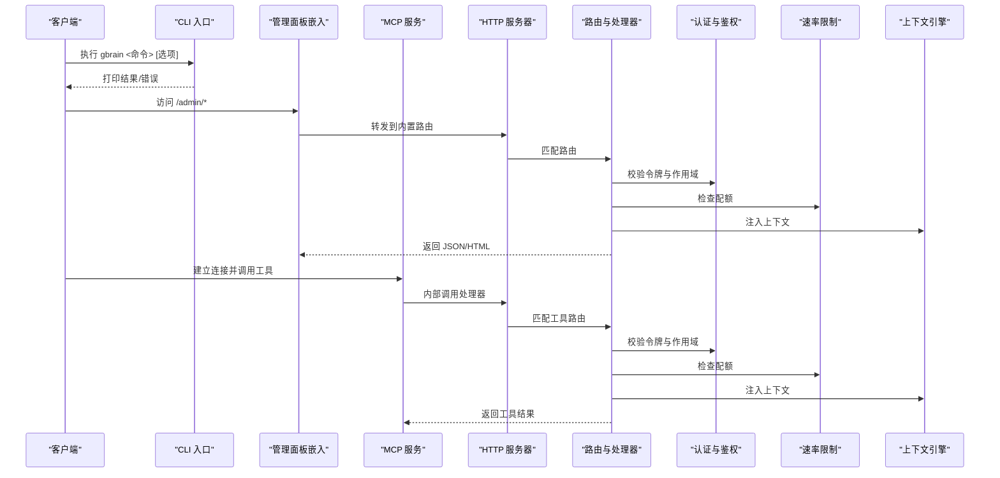
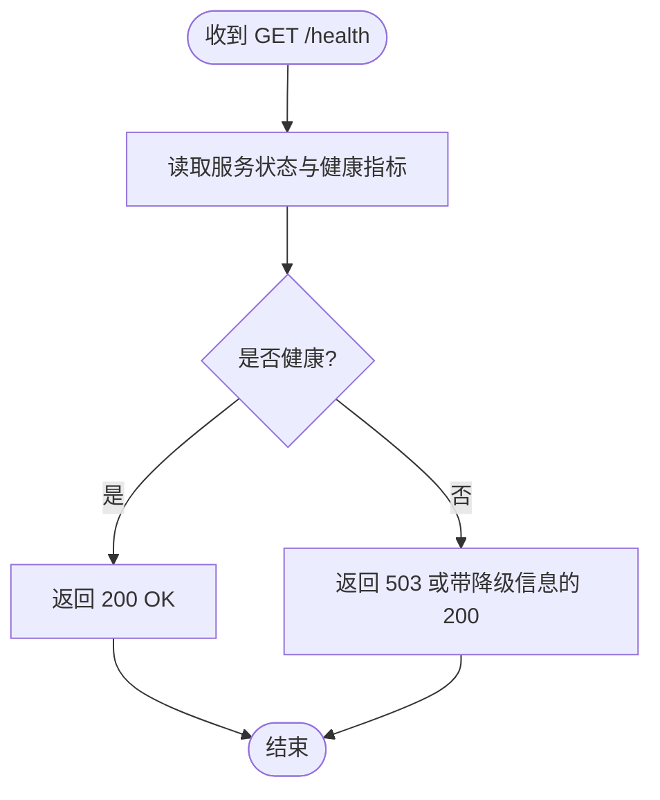
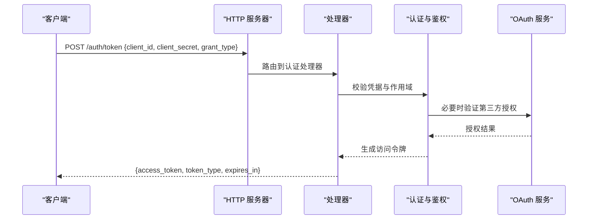
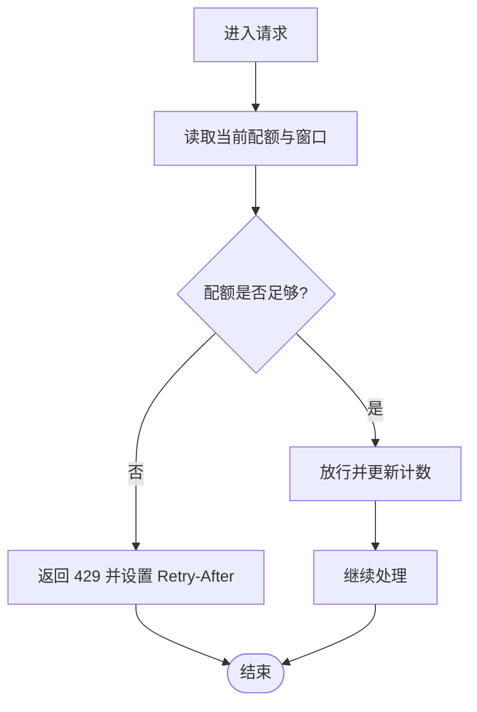
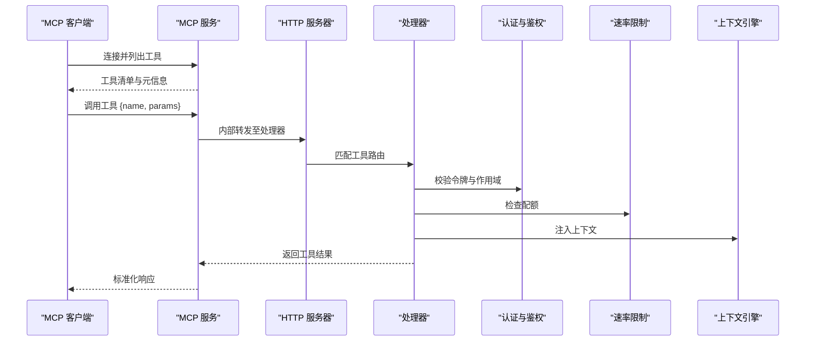
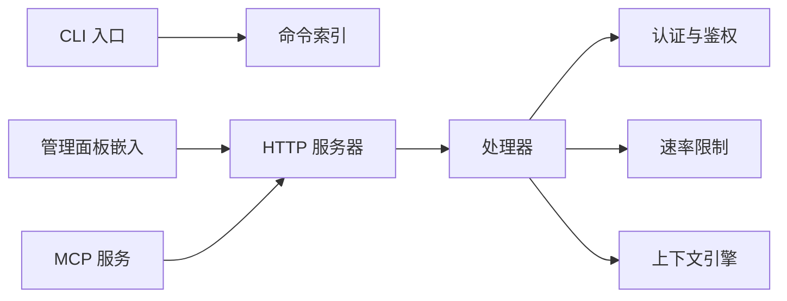

# API 参考

<cite>
**本文引用的文件**   
- [src/cli.ts](file://src/cli.ts)
- [src/admin-embedded.ts](file://src/admin-embedded.ts)
- [src/openclaw-context-engine.ts](file://src/openclaw-context-engine.ts)
- [src/mcp/index.ts](file://src/mcp/index.ts)
- [src/commands/index.ts](file://src/commands/index.ts)
- [src/core/http-server.ts](file://src/core/http-server.ts)
- [src/core/handlers.ts](file://src/core/handlers.ts)
- [src/core/auth.ts](file://src/core/auth.ts)
- [src/core/rate-limit.ts](file://src/core/rate-limit.ts)
- [src/version.ts](file://src/version.ts)
- [scripts/smoke-test-mcp.ts](file://scripts/smoke-test-mcp.ts)
- [test/serve-http-health.test.ts](file://test/serve-http-health.test.ts)
- [test/serve-http-cors.test.ts](file://test/serve-http-cors.test.ts)
- [test/serve-http-trust-proxy.test.ts](file://test/serve-http-trust-proxy.test.ts)
- [test/serve-skills-publish-nudge.test.ts](file://test/serve-skills-publish-nudge.test.ts)
- [test/serve-stdio-lifecycle.test.ts](file://test/serve-stdio-lifecycle.test.ts)
- [test/mcp-client.test.ts](file://test/mcp-client.test.ts)
- [test/mcp-tool-defs.test.ts](file://test/mcp-tool-defs.test.ts)
- [test/skill-catalog-transports.test.ts](file://test/skill-catalog-transports.test.ts)
- [test/oauth.test.ts](file://test/oauth.test.ts)
- [test/serve-http-bootstrap-token.test.ts](file://test/serve-http-bootstrap-token.test.ts)
</cite>

## 目录
1. [简介](#简介)
2. [项目结构](#项目结构)
3. [核心组件](#核心组件)
4. [架构总览](#架构总览)
5. [详细组件分析](#详细组件分析)
6. [依赖关系分析](#依赖关系分析)
7. [性能与速率限制](#性能与速率限制)
8. [故障排查指南](#故障排查指南)
9. [结论](#结论)
10. [附录](#附录)

## 简介
本 API 参考文档面向开发者与集成者，系统性覆盖以下三类接口：
- RESTful API：HTTP 方法、URL 模式、请求/响应模式、认证方式、状态码与错误码约定。
- CLI 命令：命令语法、参数选项、输出格式与常见用法。
- MCP 工具：工具定义、参数校验、返回值结构与调用流程。

同时提供 SDK 使用指南与集成示例、版本兼容性与向后兼容策略、速率限制说明，以及测试与调试方法。

## 项目结构
本项目采用分层组织方式：
- 入口层：CLI 入口、嵌入式管理面板入口、MCP 服务入口。
- 核心层：HTTP 服务器、路由与处理器、认证与鉴权、速率限制、上下文引擎等。
- 命令层：可执行子命令集合（通过 CLI 分发）。
- 测试层：针对 HTTP、MCP、CLI 的单元与集成测试。
- 脚本层：构建与冒烟测试脚本。

图表来源
- [src/cli.ts](file://src/cli.ts)
- [src/admin-embedded.ts](file://src/admin-embedded.ts)
- [src/mcp/index.ts](file://src/mcp/index.ts)
- [src/core/http-server.ts](file://src/core/http-server.ts)
- [src/core/handlers.ts](file://src/core/handlers.ts)
- [src/core/auth.ts](file://src/core/auth.ts)
- [src/core/rate-limit.ts](file://src/core/rate-limit.ts)
- [src/openclaw-context-engine.ts](file://src/openclaw-context-engine.ts)

章节来源
- [src/cli.ts](file://src/cli.ts)
- [src/admin-embedded.ts](file://src/admin-embedded.ts)
- [src/mcp/index.ts](file://src/mcp/index.ts)
- [src/core/http-server.ts](file://src/core/http-server.ts)
- [src/core/handlers.ts](file://src/core/handlers.ts)
- [src/core/auth.ts](file://src/core/auth.ts)
- [src/core/rate-limit.ts](file://src/core/rate-limit.ts)
- [src/openclaw-context-engine.ts](file://src/openclaw-context-engine.ts)

## 核心组件
- CLI 入口：解析命令行参数、加载命令集、调度执行、输出结果。
- 管理面板嵌入入口：在进程内启动管理界面并暴露必要 HTTP 端点。
- MCP 服务入口：实现 Model Context Protocol 的工具注册与消息处理。
- HTTP 服务器：统一监听端口、CORS、信任代理、健康检查、中间件链。
- 路由与处理器：RESTful 资源操作、分页、过滤、排序、幂等性控制。
- 认证与鉴权：令牌签发/校验、OAuth 集成、作用域控制。
- 速率限制：按客户端/IP/用户维度限流、滑动窗口或令牌桶策略。
- 上下文引擎：为请求注入上下文（租户、权限、追踪 ID 等）。

章节来源
- [src/cli.ts](file://src/cli.ts)
- [src/admin-embedded.ts](file://src/admin-embedded.ts)
- [src/mcp/index.ts](file://src/mcp/index.ts)
- [src/core/http-server.ts](file://src/core/http-server.ts)
- [src/core/handlers.ts](file://src/core/handlers.ts)
- [src/core/auth.ts](file://src/core/auth.ts)
- [src/core/rate-limit.ts](file://src/core/rate-limit.ts)
- [src/openclaw-context-engine.ts](file://src/openclaw-context-engine.ts)

## 架构总览
整体架构遵循“入口-核心-领域”的分层模型，HTTP、CLI、MCP 三种交互面共享同一套核心能力（认证、鉴权、限流、上下文、业务处理器）。

图表来源
- [src/cli.ts](file://src/cli.ts)
- [src/admin-embedded.ts](file://src/admin-embedded.ts)
- [src/mcp/index.ts](file://src/mcp/index.ts)
- [src/core/http-server.ts](file://src/core/http-server.ts)
- [src/core/handlers.ts](file://src/core/handlers.ts)
- [src/core/auth.ts](file://src/core/auth.ts)
- [src/core/rate-limit.ts](file://src/core/rate-limit.ts)
- [src/openclaw-context-engine.ts](file://src/openclaw-context-engine.ts)

## 详细组件分析

### RESTful API
- 基础约定
  - 协议与主机：HTTPS（推荐）或 HTTP（开发环境），主机由部署配置决定。
  - 内容类型：application/json（默认），部分上传接口支持 multipart/form-data。
  - 字符编码：UTF-8。
  - 版本化：建议通过 URL 前缀或请求头进行版本控制；服务端提供向后兼容策略。
- 认证与授权
  - 支持基于令牌的认证，令牌可通过 OAuth 流程获取或通过引导令牌初始化。
  - 作用域控制：根据资源与操作粒度授予最小权限。
- 通用请求头
  - Authorization：Bearer <token>
  - X-Request-Id：用于链路追踪
  - Content-Type：application/json
- 通用响应头
  - X-RateLimit-Limit：配额上限
  - X-RateLimit-Remaining：剩余配额
  - X-RateLimit-Reset：重置时间戳
  - Retry-After：当触发限流时建议重试等待秒数
- 通用响应体
  - data：业务数据
  - meta：元信息（分页、耗时、追踪 ID 等）
  - errors：错误列表（可选）
- 分页与筛选
  - 查询参数：page、per_page、sort、filter、q 等
  - 响应包含 total、has_more 等字段
- 幂等性
  - 对写操作建议使用 Idempotency-Key 请求头确保幂等
- 错误与状态码
  - 2xx：成功
  - 4xx：客户端错误（参数校验失败、未授权、资源不存在等）
  - 5xx：服务端错误（内部异常、下游不可用等）
  - 429：触发速率限制
- 典型端点族（示例）
  - 健康检查：GET /health
  - 身份相关：POST /auth/token、POST /oauth/authorize、GET /oauth/callback
  - 资源 CRUD：/api/v1/{resource}、/api/v1/{resource}/{id}
  - 搜索与检索：GET /api/v1/search?q=...&filters=...
  - 任务与作业：/api/v1/jobs、/api/v1/jobs/{id}
  - 技能与发布：/api/v1/skills、/api/v1/skills/publish
- 请求/响应示例
  - 请参见测试用例中的断言与构造逻辑以了解具体字段与约束。

章节来源
- [src/core/http-server.ts](file://src/core/http-server.ts)
- [src/core/handlers.ts](file://src/core/handlers.ts)
- [src/core/auth.ts](file://src/core/auth.ts)
- [src/core/rate-limit.ts](file://src/core/rate-limit.ts)
- [test/serve-http-health.test.ts](file://test/serve-http-health.test.ts)
- [test/serve-http-cors.test.ts](file://test/serve-http-cors.test.ts)
- [test/serve-http-trust-proxy.test.ts](file://test/serve-http-trust-proxy.test.ts)
- [test/serve-skills-publish-nudge.test.ts](file://test/serve-skills-publish-nudge.test.ts)
- [test/oauth.test.ts](file://test/oauth.test.ts)
- [test/serve-http-bootstrap-token.test.ts](file://test/serve-http-bootstrap-token.test.ts)

#### 健康检查流程

图表来源
- [test/serve-http-health.test.ts](file://test/serve-http-health.test.ts)
- [src/core/http-server.ts](file://src/core/http-server.ts)

章节来源
- [test/serve-http-health.test.ts](file://test/serve-http-health.test.ts)
- [src/core/http-server.ts](file://src/core/http-server.ts)

#### 认证与授权流程

图表来源
- [src/core/auth.ts](file://src/core/auth.ts)
- [src/core/handlers.ts](file://src/core/handlers.ts)
- [test/oauth.test.ts](file://test/oauth.test.ts)

章节来源
- [src/core/auth.ts](file://src/core/auth.ts)
- [src/core/handlers.ts](file://src/core/handlers.ts)
- [test/oauth.test.ts](file://test/oauth.test.ts)

#### 速率限制流程

图表来源
- [src/core/rate-limit.ts](file://src/core/rate-limit.ts)
- [src/core/handlers.ts](file://src/core/handlers.ts)

章节来源
- [src/core/rate-limit.ts](file://src/core/rate-limit.ts)
- [src/core/handlers.ts](file://src/core/handlers.ts)

### CLI 命令
- 入口与分发
  - 通过 CLI 入口解析全局选项与子命令，加载命令索引并执行对应处理器。
- 常用命令族（示例）
  - 初始化与配置：init、config set/unget/get
  - 同步与导入：sync、import、reindex
  - 诊断与运维：doctor、status、logs
  - 技能与包：skillpack init/install/check/publish
  - 评估与评测：eval run/export
- 输出格式
  - 默认人类可读文本；支持 --json 或类似选项输出结构化数据以便管道处理。
- 错误处理
  - 非零退出码表示失败；错误信息包含原因与建议修复步骤。
- 示例用法
  - 请参考测试用例中关于 CLI 行为与输出的断言。

章节来源
- [src/cli.ts](file://src/cli.ts)
- [src/commands/index.ts](file://src/commands/index.ts)
- [test/agent-cli.test.ts](file://test/agent-cli.test.ts)
- [test/cli-options.test.ts](file://test/cli-options.test.ts)
- [test/cli-help-discoverability.test.ts](file://test/cli-help-discoverability.test.ts)

### MCP 工具
- 服务入口
  - MCP 服务入口负责工具注册、消息路由与生命周期管理。
- 工具定义
  - 每个工具包含名称、描述、参数 Schema、返回值 Schema、权限要求与限流策略。
- 参数校验
  - 基于 Schema 进行严格校验，缺失必填项或类型不匹配将返回明确错误。
- 返回值结构
  - 标准包裹体包含 data、meta、errors；工具级错误会附带错误码与定位信息。
- 调用流程
  - 客户端建立连接后发送工具调用请求，服务端校验、限流、注入上下文后执行业务逻辑并返回结果。

图表来源
- [src/mcp/index.ts](file://src/mcp/index.ts)
- [src/core/http-server.ts](file://src/core/http-server.ts)
- [src/core/handlers.ts](file://src/core/handlers.ts)
- [src/core/auth.ts](file://src/core/auth.ts)
- [src/core/rate-limit.ts](file://src/core/rate-limit.ts)
- [src/openclaw-context-engine.ts](file://src/openclaw-context-engine.ts)

章节来源
- [src/mcp/index.ts](file://src/mcp/index.ts)
- [test/mcp-client.test.ts](file://test/mcp-client.test.ts)
- [test/mcp-tool-defs.test.ts](file://test/mcp-tool-defs.test.ts)
- [scripts/smoke-test-mcp.ts](file://scripts/smoke-test-mcp.ts)

### 管理面板嵌入
- 入口职责
  - 在应用进程内启动管理面板前端资源，并提供必要的后端路由与静态资源服务。
- 安全与访问控制
  - 与管理 API 共用认证与鉴权机制，建议仅在内网或受控网络暴露。
- 典型路径
  - /admin/* 为管理面板主路径，具体子路由由嵌入模块注册。

章节来源
- [src/admin-embedded.ts](file://src/admin-embedded.ts)
- [src/core/http-server.ts](file://src/core/http-server.ts)

## 依赖关系分析
- 入口与核心
  - CLI、管理面板、MCP 均依赖 HTTP 服务器与处理器。
- 处理器与横切关注点
  - 处理器依赖认证、速率限制与上下文引擎，形成稳定的横切能力。
- 外部依赖
  - OAuth 服务、存储与搜索引擎、对象存储等通过处理器或服务层接入。

图表来源
- [src/cli.ts](file://src/cli.ts)
- [src/commands/index.ts](file://src/commands/index.ts)
- [src/admin-embedded.ts](file://src/admin-embedded.ts)
- [src/mcp/index.ts](file://src/mcp/index.ts)
- [src/core/http-server.ts](file://src/core/http-server.ts)
- [src/core/handlers.ts](file://src/core/handlers.ts)
- [src/core/auth.ts](file://src/core/auth.ts)
- [src/core/rate-limit.ts](file://src/core/rate-limit.ts)
- [src/openclaw-context-engine.ts](file://src/openclaw-context-engine.ts)

章节来源
- [src/cli.ts](file://src/cli.ts)
- [src/commands/index.ts](file://src/commands/index.ts)
- [src/admin-embedded.ts](file://src/admin-embedded.ts)
- [src/mcp/index.ts](file://src/mcp/index.ts)
- [src/core/http-server.ts](file://src/core/http-server.ts)
- [src/core/handlers.ts](file://src/core/handlers.ts)
- [src/core/auth.ts](file://src/core/auth.ts)
- [src/core/rate-limit.ts](file://src/core/rate-limit.ts)
- [src/openclaw-context-engine.ts](file://src/openclaw-context-engine.ts)

## 性能与速率限制
- 速率限制策略
  - 支持按客户端、IP、用户维度限流；可配置窗口大小与令牌数量。
  - 触发 429 时返回 Retry-After 头部，客户端应指数退避重试。
- 并发与吞吐
  - 处理器应避免阻塞 I/O；长任务建议异步队列与轮询/事件通知。
- 缓存与索引
  - 合理使用查询缓存与全文索引；注意缓存失效与一致性。
- 监控与可观测性
  - 通过健康检查与指标端点观察系统状态；结合日志与追踪 ID 定位问题。

章节来源
- [src/core/rate-limit.ts](file://src/core/rate-limit.ts)
- [test/serve-http-health.test.ts](file://test/serve-http-health.test.ts)

## 故障排查指南
- 常见问题
  - 401/403：令牌无效或缺少作用域；检查 OAuth 流程与作用域配置。
  - 429：触发限流；降低请求频率或申请更高配额。
  - 5xx：服务端异常；查看日志与依赖服务健康状态。
- 调试方法
  - 启用详细日志与追踪 ID；使用健康检查确认服务可用性。
  - 使用冒烟测试脚本快速验证 MCP 工具连通性。
- 回归与兼容性
  - 关注版本变更与迁移脚本；保持客户端与服务端版本兼容。

章节来源
- [test/serve-http-health.test.ts](file://test/serve-http-health.test.ts)
- [scripts/smoke-test-mcp.ts](file://scripts/smoke-test-mcp.ts)
- [src/version.ts](file://src/version.ts)

## 结论
本 API 参考围绕 RESTful API、CLI 命令与 MCP 工具三大接口面展开，提供了统一的认证、鉴权、限流与上下文注入机制。通过清晰的错误与状态码约定、完善的测试与冒烟脚本，帮助开发者快速集成与稳定运行。建议在集成过程中遵循最小权限原则、合理设置重试与超时，并结合监控与日志进行持续优化。

## 附录
- SDK 使用指南
  - 初始化：配置基础 URL、令牌与作用域。
  - 调用：封装请求、处理分页与错误、记录追踪 ID。
  - 重试与退避：对 429 与 5xx 实施指数退避。
- 集成示例
  - 参考测试用例中的构造与断言逻辑，理解请求/响应结构与边界条件。
- 版本与兼容性
  - 通过版本号与迁移文档管理演进；优先保证向后兼容。
- 测试与调试
  - 使用单元测试与集成测试覆盖关键路径；利用冒烟脚本进行端到端验证。