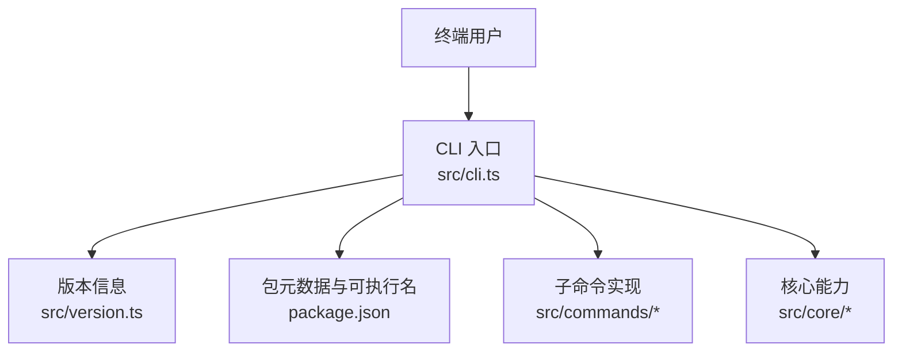
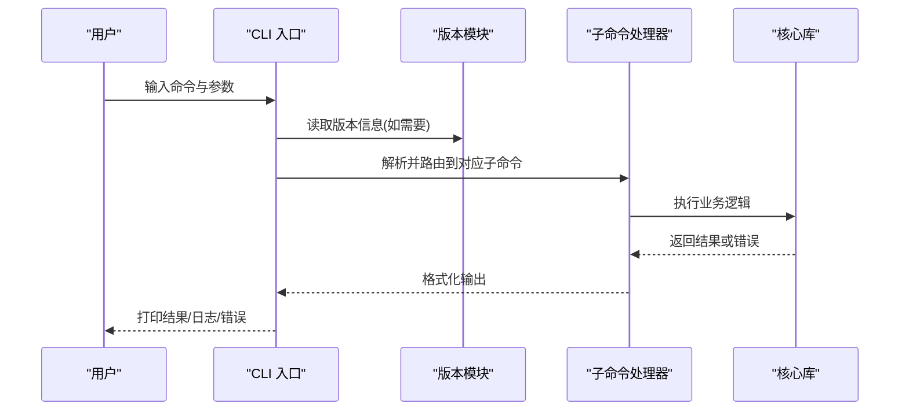

# CLI 命令参考

<cite>
**本文引用的文件**   
- [src/cli.ts](file://src/cli.ts)
- [package.json](file://package.json)
- [README.md](file://README.md)
- [INSTALL.md](file://docs/INSTALL.md)
- [src/version.ts](file://src/version.ts)
</cite>

## 目录
1. [简介](#简介)
2. [项目结构](#项目结构)
3. [核心组件](#核心组件)
4. [架构总览](#架构总览)
5. [详细组件分析](#详细组件分析)
6. [依赖分析](#依赖分析)
7. [性能考虑](#性能考虑)
8. [故障排除指南](#故障排除指南)
9. [结论](#结论)
10. [附录](#附录)

## 简介
本文件为 gbrain 的命令行工具（CLI）参考文档，聚焦于命令语法、参数选项、环境变量配置与输出格式说明；并提供常用组合与工作流示例、帮助信息获取方法、参数验证规则、执行权限与依赖要求、批量操作与脚本集成、自动化部署最佳实践，以及性能优化建议与调试技巧。

## 项目结构
gbrain 的 CLI 入口位于源码根目录下的主程序文件中，负责解析命令行参数、加载版本信息与路由到具体子命令实现。包元数据定义了可执行名称与安装方式，便于在终端中直接调用。

图表来源
- [src/cli.ts](file://src/cli.ts)
- [src/version.ts](file://src/version.ts)
- [package.json](file://package.json)

章节来源
- [src/cli.ts](file://src/cli.ts)
- [package.json](file://package.json)
- [src/version.ts](file://src/version.ts)

## 核心组件
- CLI 入口：统一处理参数解析、全局选项、子命令分发与错误上报。
- 版本模块：提供版本号与构建信息，供 --version 等命令使用。
- 包元数据：定义可执行名称、安装钩子与运行环境约束。

章节来源
- [src/cli.ts](file://src/cli.ts)
- [src/version.ts](file://src/version.ts)
- [package.json](file://package.json)

## 架构总览
下图展示了从终端到 CLI 入口再到子命令与核心库的调用关系。该图用于理解整体流程，不绑定具体代码行号。

[此图为概念性流程图，无需图表来源]

## 详细组件分析

### 命令帮助与版本
- 获取帮助
  - 使用通用帮助参数查看顶层帮助与子命令列表。
  - 针对特定子命令追加帮助参数以查看其用法、参数与环境变量。
- 查看版本
  - 使用版本参数输出当前安装的 gbrain 版本与构建信息。

章节来源
- [src/cli.ts](file://src/cli.ts)
- [src/version.ts](file://src/version.ts)

### 参数与选项
- 全局选项
  - 通常包括日志级别、输出格式、超时、并发度等。
  - 可通过环境变量覆盖部分全局选项（详见“环境变量”小节）。
- 子命令参数
  - 每个子命令拥有独立的参数集，包含必填项、可选项与互斥项。
  - 参数校验失败时，CLI 会返回明确的错误提示与退出码。

章节来源
- [src/cli.ts](file://src/cli.ts)

### 环境变量配置
- 常见环境变量类别
  - 认证与密钥：用于访问外部服务或数据库。
  - 运行时行为：日志级别、并发度、超时、重试策略等。
  - 路径与存储：工作目录、缓存目录、临时目录等。
- 优先级
  - 命令行参数 > 环境变量 > 配置文件默认值。
- 安全建议
  - 避免将敏感信息写入脚本历史或日志。
  - 使用受控的环境注入机制（例如 CI/CD 密钥管理）。

章节来源
- [src/cli.ts](file://src/cli.ts)

### 输出格式
- 文本输出
  - 人类可读的表格、列表与状态消息。
- 结构化输出
  - JSON 或 YAML，便于管道与脚本消费。
- 进度与诊断
  - 实时进度条、阶段标记与诊断信息（可通过全局选项控制）。

章节来源
- [src/cli.ts](file://src/cli.ts)

### 常用命令组合与工作流示例
- 初始化与配置
  - 先完成初始化与基础配置，再执行数据同步与索引任务。
- 增量更新与回滚
  - 结合增量同步与快照/检查点命令进行平滑升级与回滚。
- 批量操作
  - 通过循环与并行化脚本对多个脑/源进行批量维护。
- 自动化部署
  - 在 CI/CD 流水线中按步骤执行健康检查、迁移、同步与发布。

[本节为概念性指导，不直接分析具体文件，故无章节来源]

### 帮助信息的获取方法与参数验证规则
- 获取帮助
  - 顶层帮助：列出所有子命令与简要描述。
  - 子命令帮助：展示该命令的参数、选项、环境变量与示例。
- 参数验证规则
  - 类型校验：字符串、数字、布尔、枚举等。
  - 范围校验：数值区间、时间格式、URL 合法性等。
  - 依赖校验：某些参数仅在启用特定功能时有效。
  - 互斥与必选：冲突参数检测与必填项缺失提示。

章节来源
- [src/cli.ts](file://src/cli.ts)

### 执行权限与依赖要求
- 系统依赖
  - Node.js/Bun 运行时（依据包元数据与安装说明）。
  - 操作系统权限：读写工作目录、网络访问、端口占用等。
- 权限模型
  - 普通用户模式：仅本地读写与受限网络访问。
  - 管理员模式：需更高权限以执行系统级操作（如端口绑定、系统服务启停）。
- 容器化与沙箱
  - 建议在容器内运行以获得一致的运行环境与最小权限。

章节来源
- [package.json](file://package.json)
- [docs/INSTALL.md](file://docs/INSTALL.md)

### 批量操作、脚本集成与自动化部署最佳实践
- 批量操作
  - 使用清单文件驱动批量任务，配合并行与限流控制。
  - 对失败任务实施重试与告警。
- 脚本集成
  - 使用结构化输出（JSON/YAML）作为脚本输入。
  - 标准化退出码与错误消息，便于上层编排器判断。
- 自动化部署
  - 分阶段执行：预检 → 迁移 → 同步 → 发布 → 健康检查。
  - 幂等设计：重复执行不会产生副作用。
  - 回滚策略：保留上一版本快照与快速回退路径。

[本节为概念性指导，不直接分析具体文件，故无章节来源]

### 性能优化建议与调试技巧
- 性能优化
  - 调整并发度与批大小，平衡吞吐与资源占用。
  - 启用缓存与增量计算，减少重复工作。
  - 合理设置超时与重试，避免长尾请求拖慢整体。
- 调试技巧
  - 提高日志级别，定位问题上下文。
  - 使用诊断输出与指标导出，观察热点与瓶颈。
  - 隔离测试：在最小环境中复现与验证修复。

[本节为概念性指导，不直接分析具体文件，故无章节来源]

## 依赖分析
- 运行时依赖
  - 语言运行时与标准库。
  - 第三方库：HTTP 客户端、序列化库、日志框架等。
- 外部服务依赖
  - 数据库、对象存储、向量索引、LLM 网关等。
- 版本兼容性
  - 遵循语义化版本，重大变更会在升级指南中说明。

章节来源
- [package.json](file://package.json)
- [README.md](file://README.md)

## 性能考虑
- I/O 密集场景
  - 使用异步与连接池，限制并发以避免过载。
- CPU 密集场景
  - 拆分任务、利用多核并行，注意锁竞争与内存分配。
- 网络延迟
  - 合并请求、启用压缩与缓存，降低往返次数。
- 监控与观测
  - 采集关键指标（QPS、P95/P99 延迟、错误率），建立基线与阈值告警。

[本节为概念性指导，不直接分析具体文件，故无章节来源]

## 故障排除指南
- 常见问题
  - 权限不足：确认运行用户对目标目录与服务端口的访问权限。
  - 网络不可达：检查代理、防火墙与 DNS 解析。
  - 配置错误：核对环境变量与配置文件键名、值域与格式。
  - 版本不兼容：对照升级指南与依赖矩阵。
- 诊断步骤
  - 提升日志级别，收集完整上下文。
  - 使用最小复现用例，逐步缩小范围。
  - 对比正常与异常环境的差异（配置、依赖、网络）。
- 恢复策略
  - 回滚到上一个稳定版本。
  - 清理缓存与临时文件后重试。
  - 重建索引或重新导入必要数据。

章节来源
- [src/cli.ts](file://src/cli.ts)
- [docs/INSTALL.md](file://docs/INSTALL.md)

## 结论
本参考文档提供了 gbrain CLI 的命令概览、参数与环境变量说明、输出格式、常用工作流与最佳实践，以及性能优化与故障排除建议。建议在实际使用中结合帮助信息与结构化输出，形成可观测、可回滚、可自动化的运维体系。

## 附录
- 安装与快速开始
  - 参考安装文档了解前置条件、安装方式与首次运行步骤。
- 版本信息
  - 使用版本命令查看当前版本与构建细节，便于问题定位与升级规划。

章节来源
- [docs/INSTALL.md](file://docs/INSTALL.md)
- [src/version.ts](file://src/version.ts)