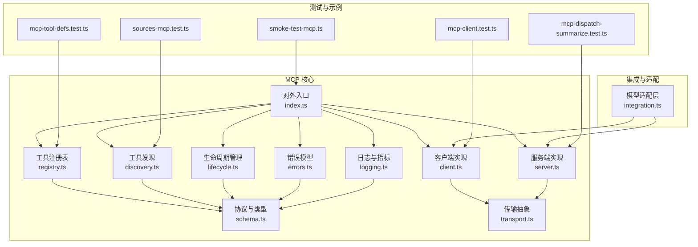
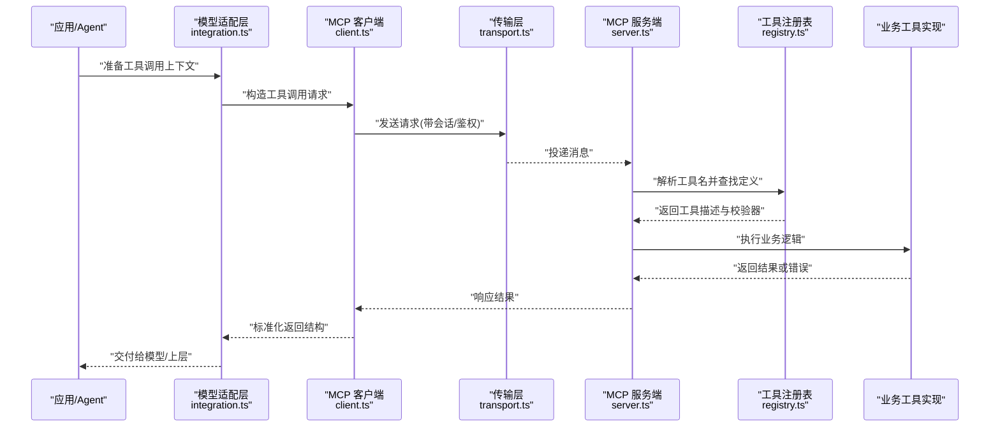
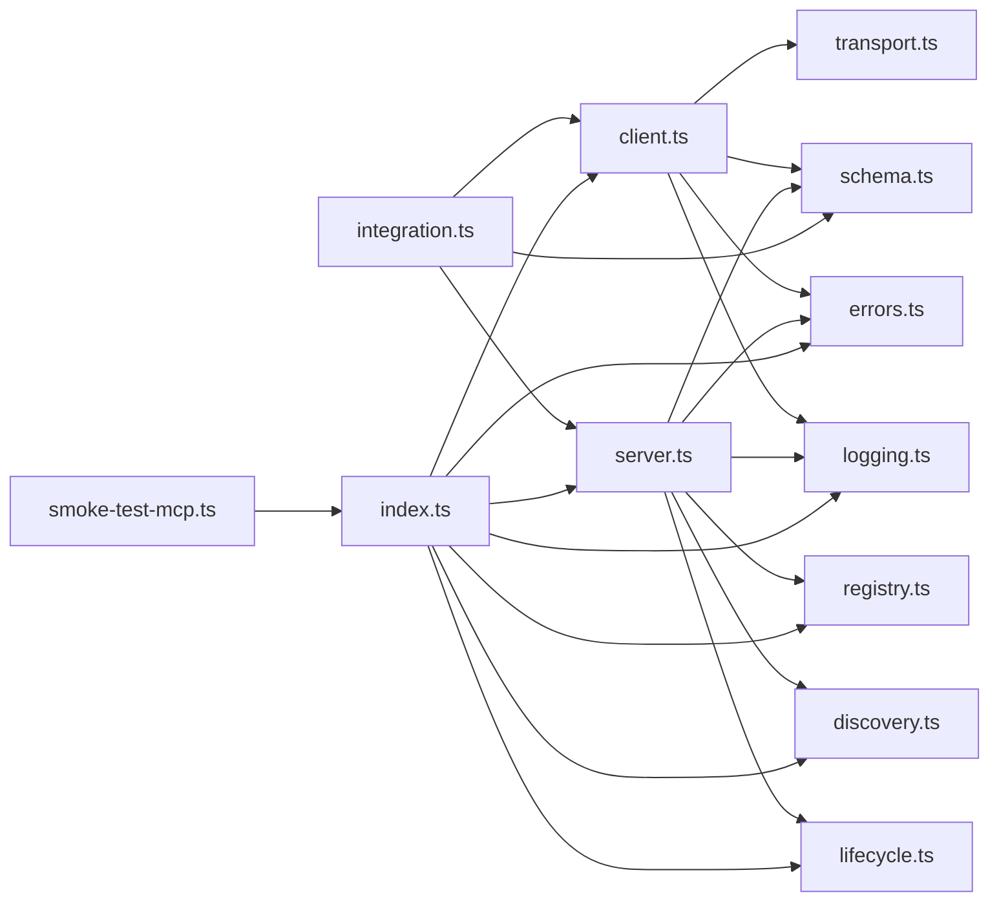

# MCP 工具接口

<cite>
**本文引用的文件**   
- [src/mcp/index.ts](file://src/mcp/index.ts)
- [src/core/mcp/client.ts](file://src/core/mcp/client.ts)
- [src/core/mcp/server.ts](file://src/core/mcp/server.ts)
- [src/core/mcp/transport.ts](file://src/core/mcp/transport.ts)
- [src/core/mcp/discovery.ts](file://src/core/mcp/discovery.ts)
- [src/core/mcp/lifecycle.ts](file://src/core/mcp/lifecycle.ts)
- [src/core/mcp/schema.ts](file://src/core/mcp/schema.ts)
- [src/core/mcp/errors.ts](file://src/core/mcp/errors.ts)
- [src/core/mcp/logging.ts](file://src/core/mcp/logging.ts)
- [src/core/mcp/registry.ts](file://src/core/mcp/registry.ts)
- [src/core/mcp/integration.ts](file://src/core/mcp/integration.ts)
- [scripts/smoke-test-mcp.ts](file://scripts/smoke-test-mcp.ts)
- [test/mcp-client.test.ts](file://test/mcp-client.test.ts)
- [test/mcp-dispatch-summarize.test.ts](file://test/mcp-dispatch-summarize.test.ts)
- [test/mcp-tool-defs.test.ts](file://test/mcp-tool-defs.test.ts)
- [test/sources-mcp.test.ts](file://test/sources-mcp.test.ts)
</cite>

## 目录
1. [简介](#简介)
2. [项目结构](#项目结构)
3. [核心组件](#核心组件)
4. [架构总览](#架构总览)
5. [详细组件分析](#详细组件分析)
6. [依赖关系分析](#依赖关系分析)
7. [性能与可观测性](#性能与可观测性)
8. [故障排查指南](#故障排查指南)
9. [结论](#结论)
10. [附录：开发指南与最佳实践](#附录开发指南与最佳实践)

## 简介
本文件面向希望理解、集成或扩展 Model Context Protocol（MCP）工具接口的开发者，系统化说明以下方面：
- 可用的 MCP 工具集合、参数校验规则与返回值结构
- 工具调用方式、上下文传递与错误处理机制
- 工具的注册、发现与生命周期管理
- 与不同 AI 模型的适配层实现
- 性能监控、日志记录与调试方法

## 项目结构
仓库中与 MCP 相关的代码主要位于 src/core/mcp 目录，配套测试与脚本位于 test 与 scripts 目录。整体组织遵循“协议抽象 + 传输适配 + 客户端/服务端 + 注册与发现 + 生命周期 + 错误与日志”的分层设计。

图表来源
- [src/mcp/index.ts](file://src/mcp/index.ts)
- [src/core/mcp/client.ts](file://src/core/mcp/client.ts)
- [src/core/mcp/server.ts](file://src/core/mcp/server.ts)
- [src/core/mcp/transport.ts](file://src/core/mcp/transport.ts)
- [src/core/mcp/registry.ts](file://src/core/mcp/registry.ts)
- [src/core/mcp/discovery.ts](file://src/core/mcp/discovery.ts)
- [src/core/mcp/lifecycle.ts](file://src/core/mcp/lifecycle.ts)
- [src/core/mcp/schema.ts](file://src/core/mcp/schema.ts)
- [src/core/mcp/errors.ts](file://src/core/mcp/errors.ts)
- [src/core/mcp/logging.ts](file://src/core/mcp/logging.ts)
- [src/core/mcp/integration.ts](file://src/core/mcp/integration.ts)
- [scripts/smoke-test-mcp.ts](file://scripts/smoke-test-mcp.ts)
- [test/mcp-client.test.ts](file://test/mcp-client.test.ts)
- [test/mcp-dispatch-summarize.test.ts](file://test/mcp-dispatch-summarize.test.ts)
- [test/mcp-tool-defs.test.ts](file://test/mcp-tool-defs.test.ts)
- [test/sources-mcp.test.ts](file://test/sources-mcp.test.ts)

章节来源
- [src/mcp/index.ts](file://src/mcp/index.ts)
- [src/core/mcp/schema.ts](file://src/core/mcp/schema.ts)
- [src/core/mcp/transport.ts](file://src/core/mcp/transport.ts)
- [src/core/mcp/client.ts](file://src/core/mcp/client.ts)
- [src/core/mcp/server.ts](file://src/core/mcp/server.ts)
- [src/core/mcp/registry.ts](file://src/core/mcp/registry.ts)
- [src/core/mcp/discovery.ts](file://src/core/mcp/discovery.ts)
- [src/core/mcp/lifecycle.ts](file://src/core/mcp/lifecycle.ts)
- [src/core/mcp/errors.ts](file://src/core/mcp/errors.ts)
- [src/core/mcp/logging.ts](file://src/core/mcp/logging.ts)
- [src/core/mcp/integration.ts](file://src/core/mcp/integration.ts)
- [scripts/smoke-test-mcp.ts](file://scripts/smoke-test-mcp.ts)
- [test/mcp-client.test.ts](file://test/mcp-client.test.ts)
- [test/mcp-dispatch-summarize.test.ts](file://test/mcp-dispatch-summarize.test.ts)
- [test/mcp-tool-defs.test.ts](file://test/mcp-tool-defs.test.ts)
- [test/sources-mcp.test.ts](file://test/sources-mcp.test.ts)

## 核心组件
- 协议与类型（schema.ts）：定义工具描述、参数校验 Schema、请求/响应消息体、错误码与元数据等基础类型。
- 传输抽象（transport.ts）：统一封装底层通信通道（如 stdio、HTTP、WebSocket），屏蔽具体实现差异。
- 客户端（client.ts）：负责向远端 MCP 服务发起工具调用、会话建立、重连与超时控制。
- 服务端（server.ts）：暴露工具清单、接收并分发工具调用、执行本地工具逻辑并返回结果。
- 注册表（registry.ts）：维护工具定义、参数校验器与执行器的映射，提供注册、查询与批量导出能力。
- 发现（discovery.ts）：扫描可用工具源（本地包、远程服务、配置声明），生成工具清单与版本信息。
- 生命周期（lifecycle.ts）：管理连接建立、握手、保活、优雅关闭与资源回收。
- 错误模型（errors.ts）：标准化错误分类、错误码、重试策略与诊断信息。
- 日志与指标（logging.ts）：结构化日志、关键路径埋点、耗时与吞吐统计。
- 集成适配（integration.ts）：将 MCP 工具桥接到不同 AI 模型的工具调用协议（函数调用/工具使用）。
- 对外入口（index.ts）：聚合导出常用 API，供上层应用快速接入。

章节来源
- [src/core/mcp/schema.ts](file://src/core/mcp/schema.ts)
- [src/core/mcp/transport.ts](file://src/core/mcp/transport.ts)
- [src/core/mcp/client.ts](file://src/core/mcp/client.ts)
- [src/core/mcp/server.ts](file://src/core/mcp/server.ts)
- [src/core/mcp/registry.ts](file://src/core/mcp/registry.ts)
- [src/core/mcp/discovery.ts](file://src/core/mcp/discovery.ts)
- [src/core/mcp/lifecycle.ts](file://src/core/mcp/lifecycle.ts)
- [src/core/mcp/errors.ts](file://src/core/mcp/errors.ts)
- [src/core/mcp/logging.ts](file://src/core/mcp/logging.ts)
- [src/core/mcp/integration.ts](file://src/core/mcp/integration.ts)
- [src/mcp/index.ts](file://src/mcp/index.ts)

## 架构总览
下图展示了从 AI 模型到 MCP 工具调用的端到端流程，包括适配层、客户端/服务端、传输与注册发现。

图表来源
- [src/core/mcp/integration.ts](file://src/core/mcp/integration.ts)
- [src/core/mcp/client.ts](file://src/core/mcp/client.ts)
- [src/core/mcp/transport.ts](file://src/core/mcp/transport.ts)
- [src/core/mcp/server.ts](file://src/core/mcp/server.ts)
- [src/core/mcp/registry.ts](file://src/core/mcp/registry.ts)

## 详细组件分析

### 协议与类型（schema.ts）
- 工具描述：包含名称、版本、描述、输入参数 Schema、输出 Schema、权限范围、上下文注入字段等。
- 参数校验：基于 JSON Schema 风格的约束（必填、类型、枚举、范围、正则等），在注册阶段编译为高效校验器。
- 请求/响应：统一的请求 ID、时间戳、追踪 ID、上下文透传字段；响应包含成功数据、错误对象与元数据。
- 错误码：区分网络、认证、授权、参数校验、业务异常、超时与限流等类别，便于上层统一处理。

章节来源
- [src/core/mcp/schema.ts](file://src/core/mcp/schema.ts)

### 传输抽象（transport.ts）
- 抽象接口：连接、发送、接收、关闭、保活心跳。
- 实现建议：支持 stdio（进程内）、HTTP/JSON-RPC、WebSocket 等；对大消息进行分片与压缩可选。
- 可靠性：自动重连、指数退避、幂等请求 ID、超时与取消信号。

章节来源
- [src/core/mcp/transport.ts](file://src/core/mcp/transport.ts)

### 客户端（client.ts）
- 功能要点：
  - 会话初始化与握手（获取工具清单、能力协商）
  - 工具调用封装（参数序列化、上下文注入、重试与熔断）
  - 错误归一化（转换为标准错误模型）
  - 并发控制与背压（限制并行度、队列化）
- 典型调用序列见“架构总览”。

章节来源
- [src/core/mcp/client.ts](file://src/core/mcp/client.ts)
- [test/mcp-client.test.ts](file://test/mcp-client.test.ts)

### 服务端（server.ts）
- 功能要点：
  - 工具清单发布与变更通知
  - 请求路由与鉴权（按作用域/租户隔离）
  - 参数校验与上下文注入（用户、会话、系统提示片段）
  - 执行器调度（异步任务、超时控制、取消传播）
  - 响应编码与错误上报
- 与注册表协作完成工具发现与分发。

章节来源
- [src/core/mcp/server.ts](file://src/core/mcp/server.ts)
- [test/mcp-dispatch-summarize.test.ts](file://test/mcp-dispatch-summarize.test.ts)

### 工具注册表（registry.ts）
- 职责：
  - 注册工具定义（名称、Schema、执行器、元数据）
  - 动态更新与热重载
  - 批量导出与快照
  - 权限与作用域过滤
- 与发现模块配合，支持多来源合并与冲突检测。

章节来源
- [src/core/mcp/registry.ts](file://src/core/mcp/registry.ts)
- [test/mcp-tool-defs.test.ts](file://test/mcp-tool-defs.test.ts)

### 工具发现（discovery.ts）
- 来源类型：
  - 本地包/插件目录
  - 远程服务清单
  - 配置声明（YAML/JSON）
- 行为：
  - 增量扫描与缓存
  - 版本兼容检查
  - 去重与优先级策略

章节来源
- [src/core/mcp/discovery.ts](file://src/core/mcp/discovery.ts)
- [test/sources-mcp.test.ts](file://test/sources-mcp.test.ts)

### 生命周期（lifecycle.ts）
- 阶段：启动 -> 握手 -> 就绪 -> 运行 -> 优雅关闭 -> 销毁
- 关注点：
  - 资源清理（连接池、临时文件、定时器）
  - 状态广播与事件钩子
  - 健康检查与探针

章节来源
- [src/core/mcp/lifecycle.ts](file://src/core/mcp/lifecycle.ts)

### 错误模型（errors.ts）
- 分类：网络、认证/授权、参数校验、业务、超时、限流、未知
- 属性：错误码、消息、堆栈（脱敏）、诊断键值对、是否可重试
- 策略：统一包装、降级与回退、告警触发

章节来源
- [src/core/mcp/errors.ts](file://src/core/mcp/errors.ts)

### 日志与指标（logging.ts）
- 结构化日志：请求 ID、工具名、耗时、状态码、上游/下游标识
- 指标：QPS、P95/P99 延迟、错误率、重试次数、断线次数
- 采样与脱敏：敏感字段掩码、采样率控制

章节来源
- [src/core/mcp/logging.ts](file://src/core/mcp/logging.ts)

### 模型适配层（integration.ts）
- 目标：将 MCP 工具集桥接到不同 AI 模型的工具调用协议（函数调用/工具使用）。
- 能力：
  - 工具描述转换（名称、参数 Schema、返回结构）
  - 上下文注入（会话、用户、系统提示片段）
  - 错误映射与重试策略
  - 多模型差异化处理（最大令牌、并发、超时）

章节来源
- [src/core/mcp/integration.ts](file://src/core/mcp/integration.ts)

### 对外入口（index.ts）
- 聚合导出：客户端、服务端、注册表、发现、生命周期、错误与日志
- 便捷 API：一键初始化、默认传输选择、默认日志配置

章节来源
- [src/mcp/index.ts](file://src/mcp/index.ts)

## 依赖关系分析
- 低耦合：传输层独立于客户端/服务端；注册表与发现解耦；错误与日志作为横切关注点被各层引用。
- 关键依赖链：
  - client.ts → transport.ts, schema.ts, errors.ts, logging.ts
  - server.ts → registry.ts, discovery.ts, schema.ts, lifecycle.ts, errors.ts, logging.ts
  - integration.ts → client.ts, server.ts, schema.ts
  - smoke-test-mcp.ts → index.ts（验证端到端链路）

图表来源
- [src/core/mcp/client.ts](file://src/core/mcp/client.ts)
- [src/core/mcp/server.ts](file://src/core/mcp/server.ts)
- [src/core/mcp/transport.ts](file://src/core/mcp/transport.ts)
- [src/core/mcp/registry.ts](file://src/core/mcp/registry.ts)
- [src/core/mcp/discovery.ts](file://src/core/mcp/discovery.ts)
- [src/core/mcp/lifecycle.ts](file://src/core/mcp/lifecycle.ts)
- [src/core/mcp/schema.ts](file://src/core/mcp/schema.ts)
- [src/core/mcp/errors.ts](file://src/core/mcp/errors.ts)
- [src/core/mcp/logging.ts](file://src/core/mcp/logging.ts)
- [src/core/mcp/integration.ts](file://src/core/mcp/integration.ts)
- [src/mcp/index.ts](file://src/mcp/index.ts)
- [scripts/smoke-test-mcp.ts](file://scripts/smoke-test-mcp.ts)

章节来源
- [src/core/mcp/client.ts](file://src/core/mcp/client.ts)
- [src/core/mcp/server.ts](file://src/core/mcp/server.ts)
- [src/core/mcp/transport.ts](file://src/core/mcp/transport.ts)
- [src/core/mcp/registry.ts](file://src/core/mcp/registry.ts)
- [src/core/mcp/discovery.ts](file://src/core/mcp/discovery.ts)
- [src/core/mcp/lifecycle.ts](file://src/core/mcp/lifecycle.ts)
- [src/core/mcp/schema.ts](file://src/core/mcp/schema.ts)
- [src/core/mcp/errors.ts](file://src/core/mcp/errors.ts)
- [src/core/mcp/logging.ts](file://src/core/mcp/logging.ts)
- [src/core/mcp/integration.ts](file://src/core/mcp/integration.ts)
- [src/mcp/index.ts](file://src/mcp/index.ts)
- [scripts/smoke-test-mcp.ts](file://scripts/smoke-test-mcp.ts)

## 性能与可观测性
- 性能优化建议
  - 传输层：启用连接复用、消息压缩、分片传输；合理设置超时与重试上限。
  - 客户端：限制并发度、使用队列与背压；对长耗时工具采用异步任务与回调。
  - 服务端：参数校验预编译、工具执行器缓存、读写分离与只读副本。
  - 注册与发现：增量扫描、缓存清单、冲突提前检测。
- 可观测性
  - 日志：结构化输出、关联请求 ID、脱敏敏感字段。
  - 指标：延迟分位、吞吐、错误率、重试/熔断计数、连接池利用率。
  - 追踪：跨进程/跨服务的调用链追踪。

[本节为通用指导，不直接分析具体文件]

## 故障排查指南
- 常见问题定位
  - 连接失败：检查传输层配置、网络可达性与证书；查看重连与退避日志。
  - 工具未找到：确认注册表是否加载、发现模块是否生效、名称与作用域匹配。
  - 参数校验失败：核对工具 Schema 与入参类型、必填项与约束。
  - 超时/限流：调整超时阈值、重试策略与熔断阈值；观察后端负载。
- 调试技巧
  - 开启详细日志与追踪 ID，复现问题后收集完整链路日志。
  - 使用最小用例与单测覆盖边界条件。
  - 通过健康检查与探针确认服务状态。

章节来源
- [src/core/mcp/errors.ts](file://src/core/mcp/errors.ts)
- [src/core/mcp/logging.ts](file://src/core/mcp/logging.ts)
- [test/mcp-client.test.ts](file://test/mcp-client.test.ts)
- [test/mcp-dispatch-summarize.test.ts](file://test/mcp-dispatch-summarize.test.ts)

## 结论
MCP 工具接口以清晰的协议与分层架构为基础，提供了可扩展的工具注册、发现与生命周期管理能力，并通过适配层实现对多种 AI 模型的无缝集成。结合完善的错误模型、日志与指标体系，可在保证稳定性的同时获得良好的可观测性与可维护性。

[本节为总结性内容，不直接分析具体文件]

## 附录：开发指南与最佳实践
- 工具开发步骤
  - 定义工具描述与参数 Schema（schema.ts）
  - 实现执行器并注册至注册表（registry.ts）
  - 编写单元测试与端到端冒烟测试（参考 mcp-tool-defs.test.ts、smoke-test-mcp.ts）
- 参数校验与安全性
  - 严格使用 Schema 约束，避免任意类型注入
  - 对敏感字段进行脱敏与白名单校验
- 上下文传递
  - 在请求头中携带会话、用户与作用域信息
  - 在服务端进行鉴权与权限裁剪
- 错误处理
  - 使用标准错误模型，明确错误码与是否可重试
  - 对不可恢复错误进行告警与人工介入
- 性能与稳定性
  - 合理设置超时、重试与熔断
  - 对长耗时操作采用异步任务与进度反馈
- 与 AI 模型集成
  - 通过适配层将 MCP 工具描述转换为模型侧工具协议
  - 针对模型特性调整并发、令牌与超时策略

章节来源
- [src/core/mcp/schema.ts](file://src/core/mcp/schema.ts)
- [src/core/mcp/registry.ts](file://src/core/mcp/registry.ts)
- [src/core/mcp/integration.ts](file://src/core/mcp/integration.ts)
- [test/mcp-tool-defs.test.ts](file://test/mcp-tool-defs.test.ts)
- [scripts/smoke-test-mcp.ts](file://scripts/smoke-test-mcp.ts)