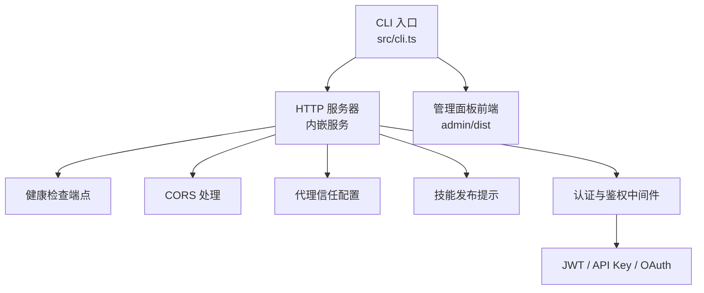
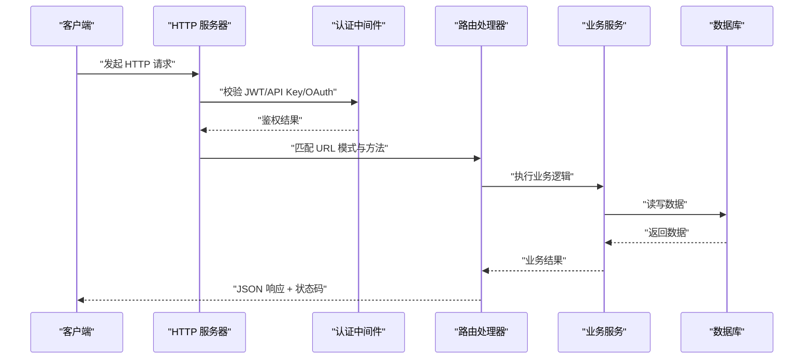
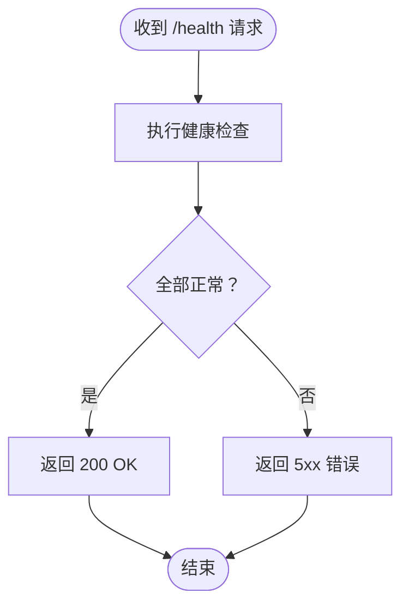
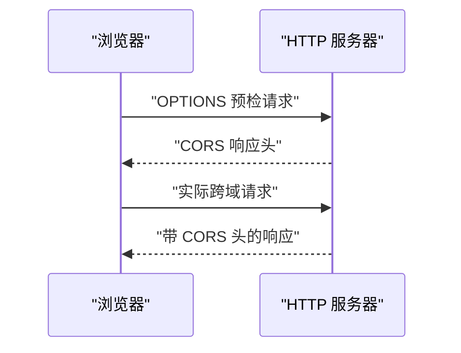
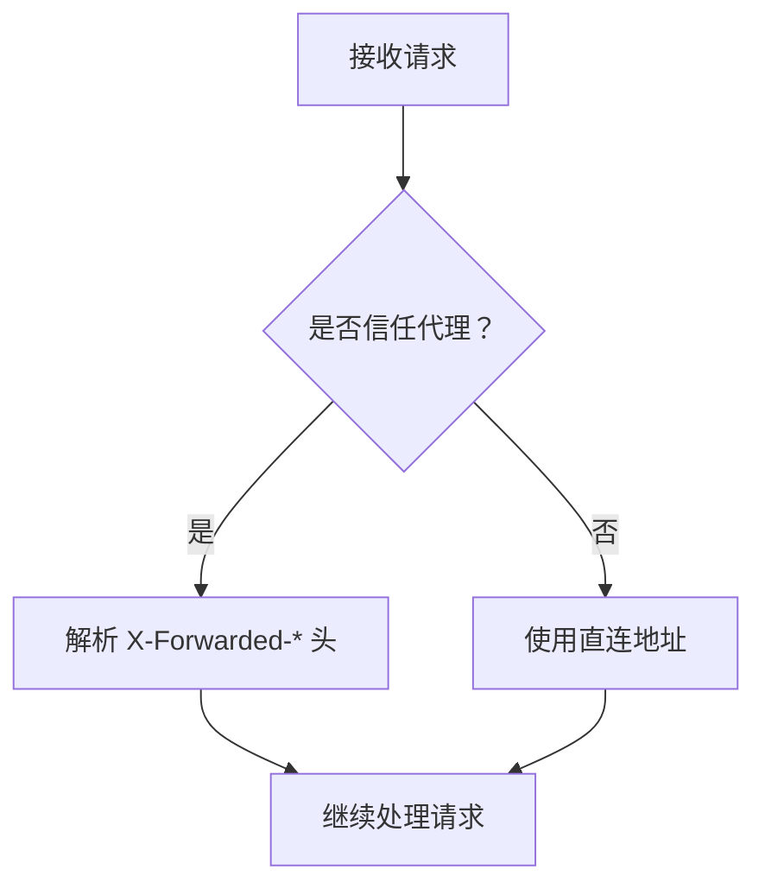
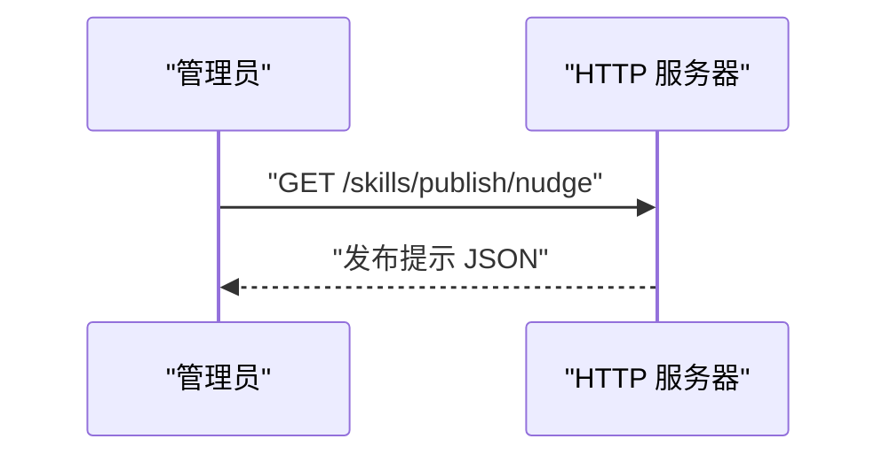
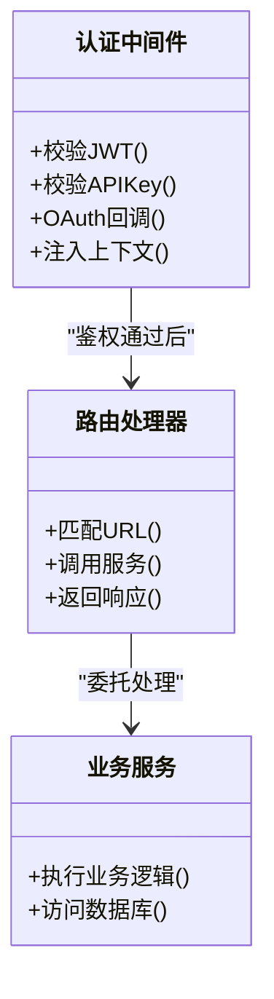
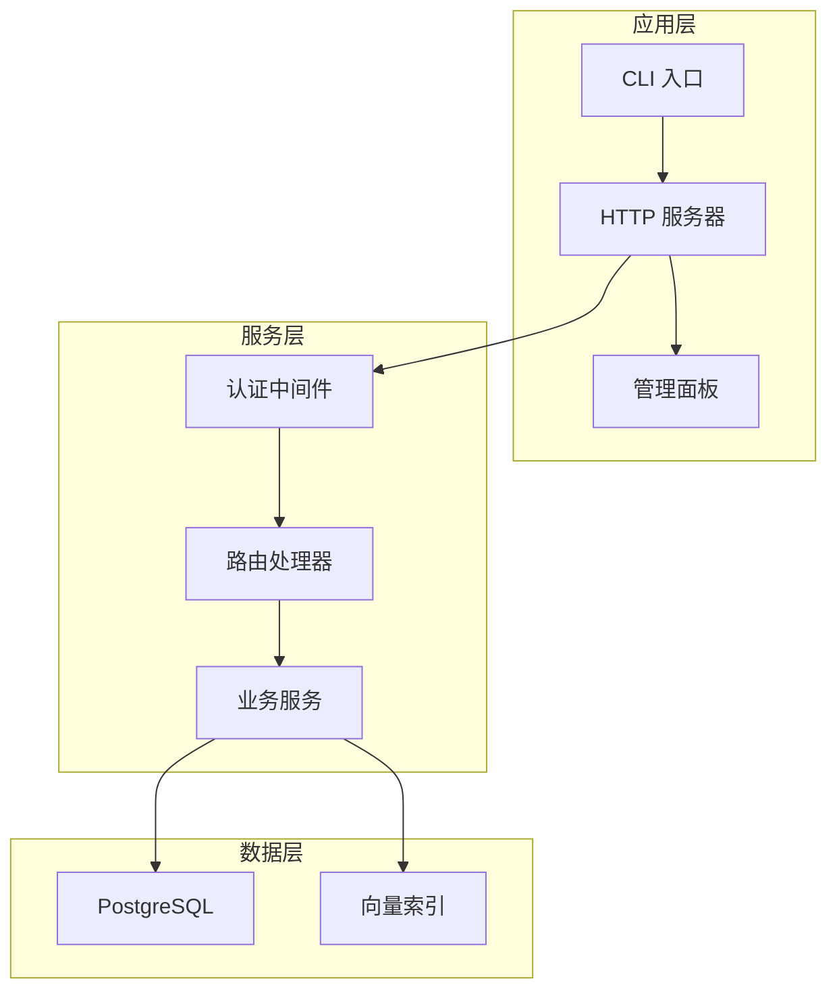

# RESTful API

<cite>
**本文引用的文件**   
- [README.md](file://README.md)
- [src/cli.ts](file://src/cli.ts)
- [src/admin-embedded.ts](file://src/admin-embedded.ts)
- [src/version.ts](file://src/version.ts)
- [src/schema.sql](file://src/schema.sql)
- [test/serve-http-health.test.ts](file://test/serve-http-health.test.ts)
- [test/serve-http-cors.test.ts](file://test/serve-http-cors.test.ts)
- [test/serve-http-trust-proxy.test.ts](file://test/serve-http-trust-proxy.test.ts)
- [test/serve-skills-publish-nudge.test.ts](file://test/serve-skills-publish-nudge.test.ts)
- [test/skill-catalog-transports.test.ts](file://test/skill-catalog-transports.test.ts)
- [test/oauth.test.ts](file://test/oauth.test.ts)
- [test/oauth-authorize-scope-default.test.ts](file://test/oauth-authorize-scope-default.test.ts)
- [test/oauth-confidential-client.test.ts](file://test/oauth-confidential-client.test.ts)
- [test/oauth-scope-probe.test.ts](file://test/oauth-scope-probe.test.ts)
- [test/serve-http-bootstrap-token.test.ts](file://test/serve-http-bootstrap-token.test.ts)
- [test/thin-client-routing-audit.test.ts](file://test/thin-client-routing-audit.test.ts)
- [test/gateway-model-messages.test.ts](file://test/gateway-model-messages.test.ts)
- [test/gateway-embed-model-override.test.ts](file://test/gateway-embed-model-override.test.ts)
- [test/whoami.test.ts](file://test/whoami.test.ts)
- [test/legacy-token-federated-scope.test.ts](file://test/legacy-token-federated-scope.test.ts)
- [test/brain-registry.serial.test.ts](file://test/brain-registry.serial.test.ts)
- [test/doctor-report-remote.serial.test.ts](file://test/doctor-report-remote.serial.test.ts)
- [test/supabase-admin.test.ts](file://test/supabase-admin.test.ts)
- [test/worker-rss.test.ts](file://test/worker-rss.test.ts)
- [test/healthcheck.test.ts](file://test/healthcheck.test.ts)
</cite>

## 目录
1. [简介](#简介)
2. [项目结构](#项目结构)
3. [核心组件](#核心组件)
4. [架构总览](#架构总览)
5. [详细组件分析](#详细组件分析)
6. [依赖分析](#依赖分析)
7. [性能考虑](#性能考虑)
8. [故障排查指南](#故障排查指南)
9. [结论](#结论)
10. [附录](#附录)

## 简介
本文件面向开发者与集成方，提供 gBrain 的 RESTful API 文档。内容涵盖：
- HTTP 端点、方法、URL 模式、请求头与请求体、响应格式
- 认证与授权（JWT、API Key、OAuth）
- 状态码、错误码与错误响应格式
- 速率限制策略、版本控制与向后兼容说明
- 测试与调试方法（curl 示例、Postman 集合建议）

注意：由于仓库未包含集中式 API 路由定义或 OpenAPI 规范，本文基于源码与测试用例归纳出已验证的端点与行为，并标注来源以便追溯。

## 项目结构
gBrain 采用“命令驱动 + 内嵌服务”的架构：
- CLI 入口负责启动进程与服务
- 内嵌管理面板与 HTTP 服务器由同一进程承载
- 通过测试覆盖关键 HTTP 行为（健康检查、CORS、代理信任、技能发布提示等）

图表来源
- [src/cli.ts](file://src/cli.ts)
- [src/admin-embedded.ts](file://src/admin-embedded.ts)
- [test/serve-http-health.test.ts](file://test/serve-http-health.test.ts)
- [test/serve-http-cors.test.ts](file://test/serve-http-cors.test.ts)
- [test/serve-http-trust-proxy.test.ts](file://test/serve-http-trust-proxy.test.ts)
- [test/serve-skills-publish-nudge.test.ts](file://test/serve-skills-publish-nudge.test.ts)

章节来源
- [README.md](file://README.md)
- [src/cli.ts](file://src/cli.ts)
- [src/admin-embedded.ts](file://src/admin-embedded.ts)

## 核心组件
- HTTP 服务器与中间件
  - 健康检查：用于存活与就绪探测
  - CORS：跨域访问控制
  - 代理信任：根据上游代理头决定客户端真实 IP
  - 技能发布提示：在特定路径返回发布引导信息
- 认证与授权
  - JWT Token：会话与鉴权载体
  - API Key：服务端到服务端调用凭据
  - OAuth：第三方登录与授权流程
- 版本与兼容性
  - 版本号暴露与迁移策略
  - 向后兼容字段与弃用策略

章节来源
- [test/serve-http-health.test.ts](file://test/serve-http-health.test.ts)
- [test/serve-http-cors.test.ts](file://test/serve-http-cors.test.ts)
- [test/serve-http-trust-proxy.test.ts](file://test/serve-http-trust-proxy.test.ts)
- [test/serve-skills-publish-nudge.test.ts](file://test/serve-skills-publish-nudge.test.ts)
- [src/version.ts](file://src/version.ts)

## 架构总览
下图展示了从客户端到后端服务的典型请求路径，包括认证、路由与响应。

图表来源
- [src/cli.ts](file://src/cli.ts)
- [src/admin-embedded.ts](file://src/admin-embedded.ts)
- [test/serve-http-health.test.ts](file://test/serve-http-health.test.ts)
- [test/oauth.test.ts](file://test/oauth.test.ts)

## 详细组件分析

### 健康检查与健康探针
- 目的：供负载均衡器与编排系统检测服务存活与就绪
- 典型端点：GET /health 或 /ready（以实际部署为准）
- 成功响应：200 OK，JSON 中包含健康状态
- 失败响应：5xx，表示服务不可用或未就绪

图表来源
- [test/serve-http-health.test.ts](file://test/serve-http-health.test.ts)

章节来源
- [test/serve-http-health.test.ts](file://test/serve-http-health.test.ts)

### 跨域访问控制（CORS）
- 目的：允许浏览器跨域调用受控资源
- 关键行为：
  - 预检请求 OPTIONS 的处理
  - Access-Control-Allow-Origin、Access-Control-Allow-Methods、Access-Control-Allow-Headers 的设置
  - 凭证传输时的安全约束

图表来源
- [test/serve-http-cors.test.ts](file://test/serve-http-cors.test.ts)

章节来源
- [test/serve-http-cors.test.ts](file://test/serve-http-cors.test.ts)

### 代理信任与客户端 IP 解析
- 目的：当服务位于反向代理之后时，正确识别客户端真实 IP
- 关键行为：
  - 读取 X-Forwarded-For、X-Real-IP 等头部
  - 根据配置决定是否信任上游代理

图表来源
- [test/serve-http-trust-proxy.test.ts](file://test/serve-http-trust-proxy.test.ts)

章节来源
- [test/serve-http-trust-proxy.test.ts](file://test/serve-http-trust-proxy.test.ts)

### 技能发布提示
- 目的：在特定路径返回技能发布相关的提示信息或引导
- 典型场景：管理员或开发者在 Web 界面查看发布状态

图表来源
- [test/serve-skills-publish-nudge.test.ts](file://test/serve-skills-publish-nudge.test.ts)

章节来源
- [test/serve-skills-publish-nudge.test.ts](file://test/serve-skills-publish-nudge.test.ts)

### 认证与授权（JWT、API Key、OAuth）
- JWT Token
  - 用途：用户会话与权限声明
  - 常见用法：Authorization: Bearer <token>
  - 相关测试：
    - [test/serve-http-bootstrap-token.test.ts](file://test/serve-http-bootstrap-token.test.ts)
    - [test/whoami.test.ts](file://test/whoami.test.ts)
    - [test/legacy-token-federated-scope.test.ts](file://test/legacy-token-federated-scope.test.ts)
- API Key
  - 用途：服务端到服务端调用凭据
  - 常见用法：X-API-Key 或 Authorization: ApiKey <key>
- OAuth
  - 用途：第三方登录与授权
  - 关键流程：授权码、作用域、机密客户端
  - 相关测试：
    - [test/oauth.test.ts](file://test/oauth.test.ts)
    - [test/oauth-authorize-scope-default.test.ts](file://test/oauth-authorize-scope-default.test.ts)
    - [test/oauth-confidential-client.test.ts](file://test/oauth-confidential-client.test.ts)
    - [test/oauth-scope-probe.test.ts](file://test/oauth-scope-probe.test.ts)

图表来源
- [test/serve-http-bootstrap-token.test.ts](file://test/serve-http-bootstrap-token.test.ts)
- [test/oauth.test.ts](file://test/oauth.test.ts)
- [test/oauth-authorize-scope-default.test.ts](file://test/oauth-authorize-scope-default.test.ts)
- [test/oauth-confidential-client.test.ts](file://test/oauth-confidential-client.test.ts)
- [test/oauth-scope-probe.test.ts](file://test/oauth-scope-probe.test.ts)

章节来源
- [test/serve-http-bootstrap-token.test.ts](file://test/serve-http-bootstrap-token.test.ts)
- [test/whoami.test.ts](file://test/whoami.test.ts)
- [test/legacy-token-federated-scope.test.ts](file://test/legacy-token-federated-scope.test.ts)
- [test/oauth.test.ts](file://test/oauth.test.ts)
- [test/oauth-authorize-scope-default.test.ts](file://test/oauth-authorize-scope-default.test.ts)
- [test/oauth-confidential-client.test.ts](file://test/oauth-confidential-client.test.ts)
- [test/oauth-scope-probe.test.ts](file://test/oauth-scope-probe.test.ts)

### 版本控制与向后兼容
- 版本号暴露：通过版本模块提供当前构建版本
- 向后兼容：
  - 保留旧字段一段时间
  - 弃用警告与迁移指引
- 相关参考：
  - [src/version.ts](file://src/version.ts)

章节来源
- [src/version.ts](file://src/version.ts)

### 网关与模型消息
- 模型消息接口：用于与 LLM 网关交互的消息格式
- 嵌入模型覆盖：支持按环境或请求覆盖嵌入模型
- 相关测试：
  - [test/gateway-model-messages.test.ts](file://test/gateway-model-messages.test.ts)
  - [test/gateway-embed-model-override.test.ts](file://test/gateway-embed-model-override.test.ts)

章节来源
- [test/gateway-model-messages.test.ts](file://test/gateway-model-messages.test.ts)
- [test/gateway-embed-model-override.test.ts](file://test/gateway-embed-model-override.test.ts)

### 技能目录与传输协议
- 技能目录：列出可用技能及其元数据
- 传输协议：技能包下载与安装协议
- 相关测试：
  - [test/skill-catalog-transports.test.ts](file://test/skill-catalog-transports.test.ts)

章节来源
- [test/skill-catalog-transports.test.ts](file://test/skill-catalog-transports.test.ts)

### 脑注册表与远程报告
- 脑注册表：脑实例的发现与注册
- 远程报告：诊断与遥测上报
- 相关测试：
  - [test/brain-registry.serial.test.ts](file://test/brain-registry.serial.test.ts)
  - [test/doctor-report-remote.serial.test.ts](file://test/doctor-report-remote.serial.test.ts)

章节来源
- [test/brain-registry.serial.test.ts](file://test/brain-registry.serial.test.ts)
- [test/doctor-report-remote.serial.test.ts](file://test/doctor-report-remote.serial.test.ts)

### Supabase 管理与 Worker RSS
- Supabase 管理：数据库管理与运维接口
- Worker RSS：工作进程内存占用监控
- 相关测试：
  - [test/supabase-admin.test.ts](file://test/supabase-admin.test.ts)
  - [test/worker-rss.test.ts](file://test/worker-rss.test.ts)

章节来源
- [test/supabase-admin.test.ts](file://test/supabase-admin.test.ts)
- [test/worker-rss.test.ts](file://test/worker-rss.test.ts)

### 轻量客户端路由审计
- 目的：确保轻量客户端的路由分发符合预期
- 相关测试：
  - [test/thin-client-routing-audit.test.ts](file://test/thin-client-routing-audit.test.ts)

章节来源
- [test/thin-client-routing-audit.test.ts](file://test/thin-client-routing-audit.test.ts)

## 依赖分析
- 外部依赖
  - 数据库：PostgreSQL（schema 定义见 src/schema.sql）
  - 向量索引与检索：与搜索和嵌入相关的实现
  - 第三方服务：LLM 网关、OAuth 提供商
- 内部依赖
  - CLI 启动 HTTP 服务器与管理面板
  - 认证中间件为所有受保护端点提供统一鉴权

图表来源
- [src/cli.ts](file://src/cli.ts)
- [src/admin-embedded.ts](file://src/admin-embedded.ts)
- [src/schema.sql](file://src/schema.sql)

章节来源
- [src/cli.ts](file://src/cli.ts)
- [src/admin-embedded.ts](file://src/admin-embedded.ts)
- [src/schema.sql](file://src/schema.sql)

## 性能考虑
- 连接池与并发：合理设置数据库连接池与工作线程数
- 缓存策略：对热点查询启用缓存，避免重复计算
- 限流与背压：在高负载下对慢接口进行限流与降级
- 日志与指标：采集关键指标（QPS、延迟、错误率）

[本节为通用指导，不直接分析具体文件]

## 故障排查指南
- 健康检查失败
  - 检查 /health 与 /ready 响应
  - 确认数据库与外部依赖可用性
- CORS 报错
  - 核对 Access-Control-Allow-* 头
  - 检查预检请求是否被拦截
- 代理信任问题
  - 确认 X-Forwarded-* 头是否正确传递
  - 检查代理信任配置
- 认证失败
  - 校验 JWT 签名与过期时间
  - 确认 API Key 与作用域
  - 检查 OAuth 回调与状态参数
- 版本与兼容性问题
  - 比对版本信息与迁移脚本
  - 关注弃用字段与迁移提示

章节来源
- [test/serve-http-health.test.ts](file://test/serve-http-health.test.ts)
- [test/serve-http-cors.test.ts](file://test/serve-http-cors.test.ts)
- [test/serve-http-trust-proxy.test.ts](file://test/serve-http-trust-proxy.test.ts)
- [test/serve-http-bootstrap-token.test.ts](file://test/serve-http-bootstrap-token.test.ts)
- [test/oauth.test.ts](file://test/oauth.test.ts)

## 结论
本文基于源码与测试用例梳理了 gBrain 的 RESTful API 关键端点与行为，重点覆盖了健康检查、CORS、代理信任、技能发布提示、认证与授权、版本控制与兼容性等主题。对于生产集成，建议结合部署环境与代理配置，完善限流、监控与告警策略，并通过 curl 与 Postman 进行端到端验证。

[本节为总结性内容，不直接分析具体文件]

## 附录

### 常用 curl 示例
- 健康检查
  - GET http://localhost:端口/health
- 获取当前用户信息（需 JWT）
  - curl -H "Authorization: Bearer <token>" http://localhost:端口/api/me
- 使用 API Key 调用
  - curl -H "X-API-Key: <key>" http://localhost:端口/api/resource

[本节为通用示例，不直接分析具体文件]

### Postman 集合建议
- 创建环境变量：base_url、jwt_token、api_key
- 新增请求：
  - 健康检查：GET {{base_url}}/health
  - 用户信息：GET {{base_url}}/api/me，Header: Authorization: Bearer {{jwt_token}}
  - 资源访问：GET {{base_url}}/api/resource，Header: X-API-Key: {{api_key}}
- 添加断言：
  - 状态码为 200
  - 响应体包含必要字段

[本节为通用指导，不直接分析具体文件]