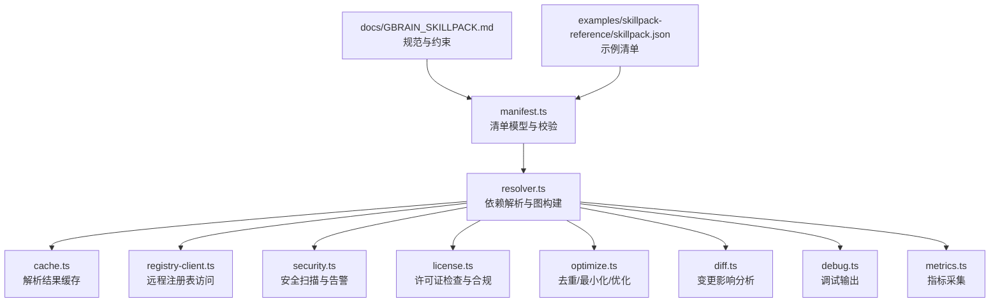
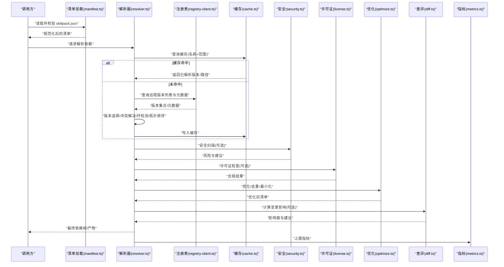
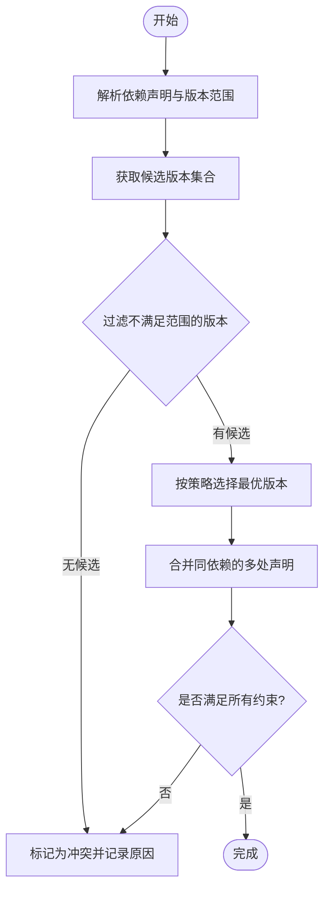
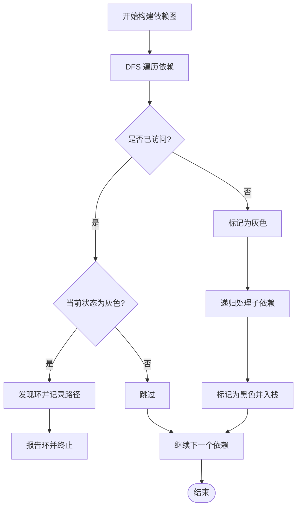
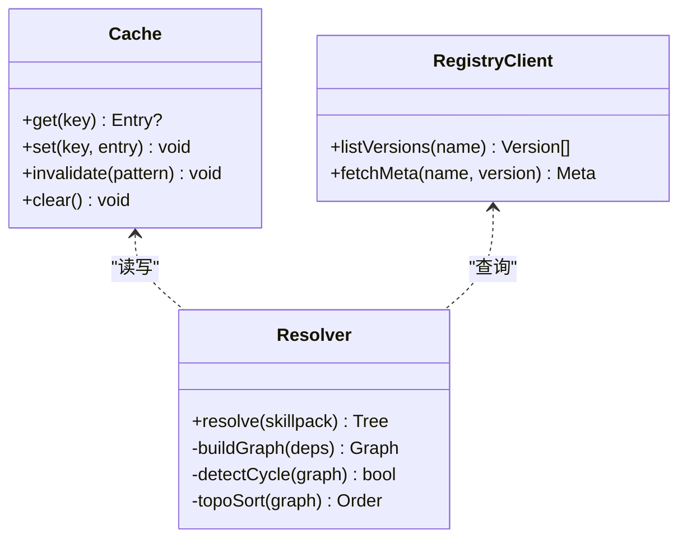
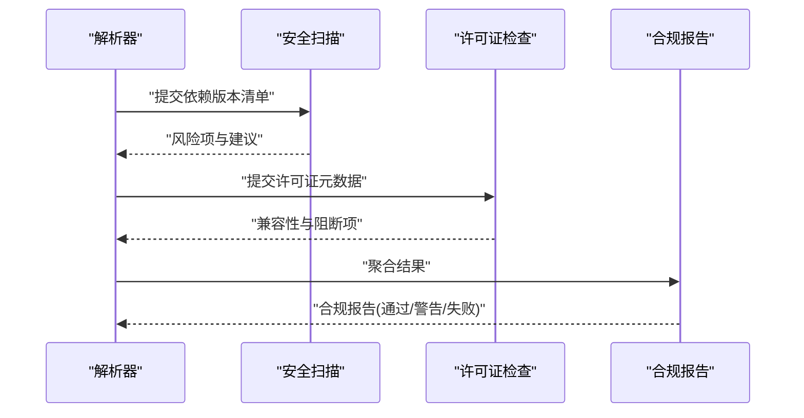
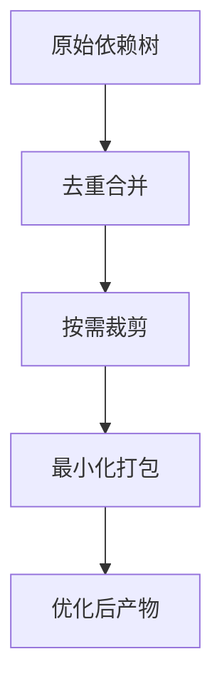
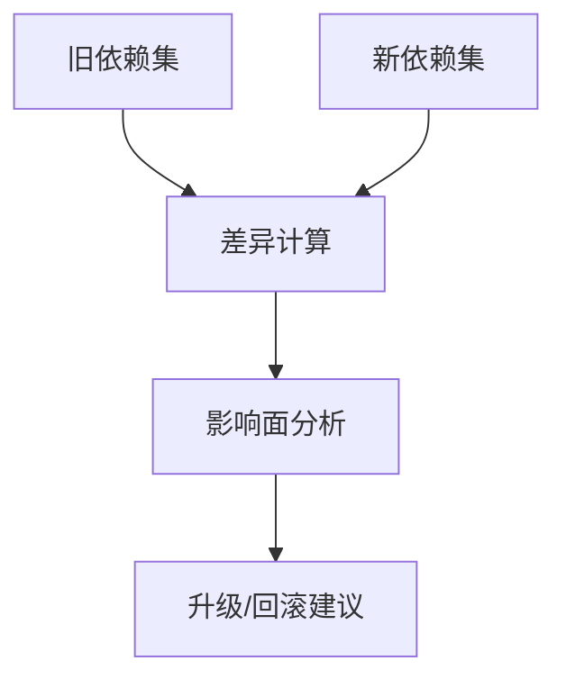
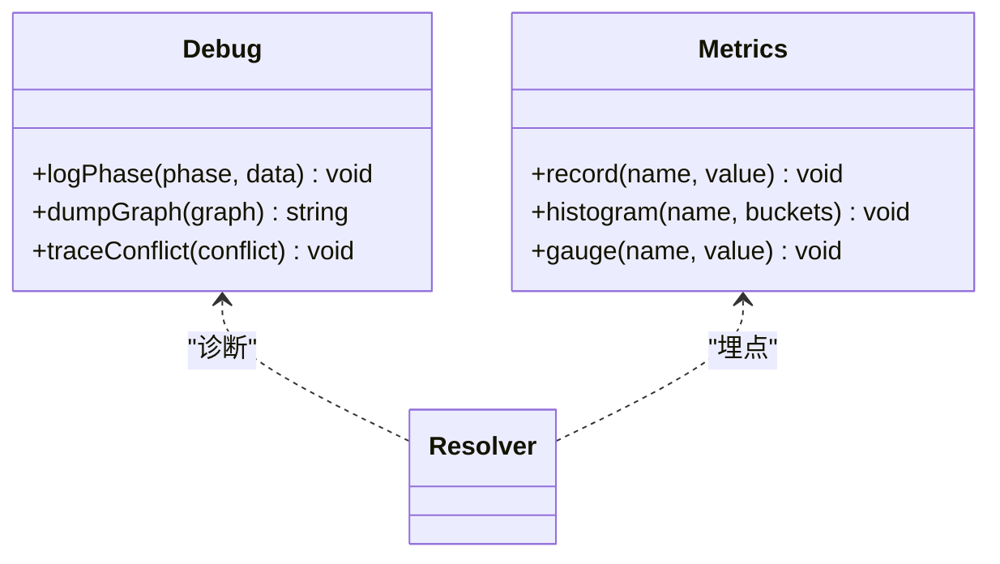
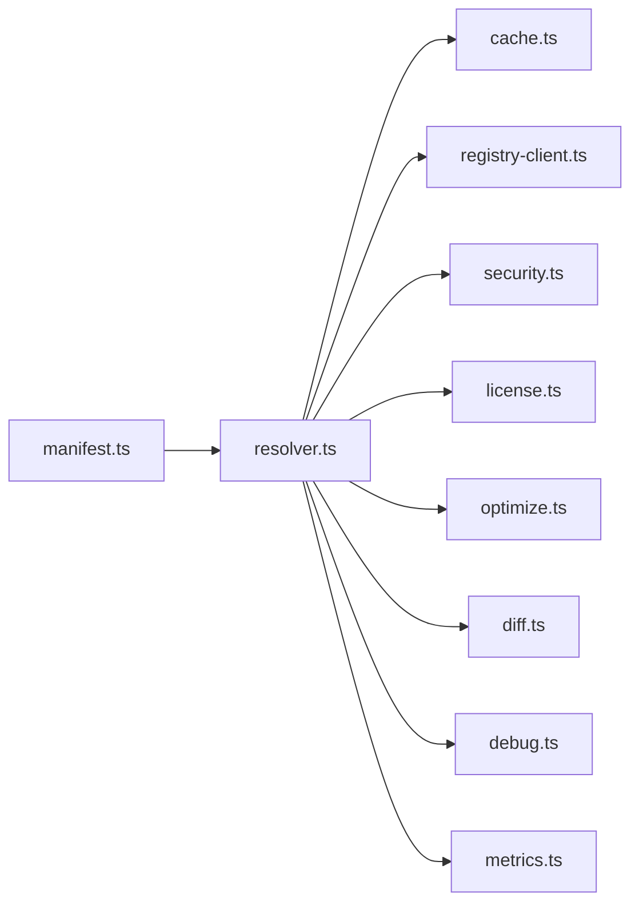

# 依赖解析

<cite>
**本文引用的文件**   
- [src/core/skillpack/manifest.ts](file://src/core/skillpack/manifest.ts)
- [src/core/skillpack/resolver.ts](file://src/core/skillpack/resolver.ts)
- [src/core/skillpack/cache.ts](file://src/core/skillpack/cache.ts)
- [src/core/skillpack/registry-client.ts](file://src/core/skillpack/registry-client.ts)
- [src/core/skillpack/security.ts](file://src/core/skillpack/security.ts)
- [src/core/skillpack/license.ts](file://src/core/skillpack/license.ts)
- [src/core/skillpack/optimize.ts](file://src/core/skillpack/optimize.ts)
- [src/core/skillpack/diff.ts](file://src/core/skillpack/diff.ts)
- [src/core/skillpack/debug.ts](file://src/core/skillpack/debug.ts)
- [src/core/skillpack/metrics.ts](file://src/core/skillpack/metrics.ts)
- [docs/GBRAIN_SKILLPACK.md](file://docs/GBRAIN_SKILLPACK.md)
- [examples/skillpack-reference/skillpack.json](file://examples/skillpack-reference/skillpack.json)
</cite>

## 目录
1. [简介](#简介)
2. [项目结构](#项目结构)
3. [核心组件](#核心组件)
4. [架构总览](#架构总览)
5. [详细组件分析](#详细组件分析)
6. [依赖关系分析](#依赖关系分析)
7. [性能考量](#性能考量)
8. [故障排查指南](#故障排查指南)
9. [结论](#结论)
10. [附录](#附录)

## 简介
本文件面向技能包（Skillpack）依赖解析的 API 与实现，覆盖以下关键主题：
- 依赖声明语法、版本范围匹配与冲突解决算法
- 依赖树构建、循环依赖检测与拓扑排序
- 依赖缓存策略、增量更新与预下载机制
- 依赖安全扫描、许可证检查与合规性验证接口
- 依赖优化、去重与最小化打包
- 依赖变更影响分析与自动更新建议
- 调试工具与性能监控接口

## 项目结构
围绕“依赖解析”的核心代码位于 src/core/skillpack 目录，配合文档与示例进行说明。下图给出与依赖解析相关的主要模块及其职责。

图表来源
- [src/core/skillpack/manifest.ts](file://src/core/skillpack/manifest.ts)
- [src/core/skillpack/resolver.ts](file://src/core/skillpack/resolver.ts)
- [src/core/skillpack/cache.ts](file://src/core/skillpack/cache.ts)
- [src/core/skillpack/registry-client.ts](file://src/core/skillpack/registry-client.ts)
- [src/core/skillpack/security.ts](file://src/core/skillpack/security.ts)
- [src/core/skillpack/license.ts](file://src/core/skillpack/license.ts)
- [src/core/skillpack/optimize.ts](file://src/core/skillpack/optimize.ts)
- [src/core/skillpack/diff.ts](file://src/core/skillpack/diff.ts)
- [src/core/skillpack/debug.ts](file://src/core/skillpack/debug.ts)
- [src/core/skillpack/metrics.ts](file://src/core/skillpack/metrics.ts)
- [docs/GBRAIN_SKILLPACK.md](file://docs/GBRAIN_SKILLPACK.md)
- [examples/skillpack-reference/skillpack.json](file://examples/skillpack-reference/skillpack.json)

章节来源
- [docs/GBRAIN_SKILLPACK.md](file://docs/GBRAIN_SKILLPACK.md)
- [examples/skillpack-reference/skillpack.json](file://examples/skillpack-reference/skillpack.json)

## 核心组件
- 清单模型与校验（manifest.ts）
  - 定义 skillpack.json 的结构、必填字段、依赖声明格式与约束
  - 提供解析前校验与规范化能力
- 依赖解析器（resolver.ts）
  - 负责读取本地与远程依赖、构建依赖图、版本选择、冲突解决、循环检测与拓扑排序
- 缓存层（cache.ts）
  - 缓存已解析的依赖元数据、版本映射与安装路径，支持失效与增量更新
- 注册表客户端（registry-client.ts）
  - 封装远程仓库查询、版本列表获取、元数据拉取与重试/超时控制
- 安全扫描（security.ts）
  - 集成漏洞数据库或规则引擎，产出风险等级与建议修复版本
- 许可证检查（license.ts）
  - 校验依赖许可证兼容性，生成合规报告与阻断策略
- 优化与最小化（optimize.ts）
  - 执行依赖去重、按需裁剪、最小化打包产物
- 变更影响分析（diff.ts）
  - 对比前后依赖集，评估升级/降级影响面与回滚建议
- 调试与可观测性（debug.ts, metrics.ts）
  - 提供诊断日志、阶段耗时、命中缓存率等指标

章节来源
- [src/core/skillpack/manifest.ts](file://src/core/skillpack/manifest.ts)
- [src/core/skillpack/resolver.ts](file://src/core/skillpack/resolver.ts)
- [src/core/skillpack/cache.ts](file://src/core/skillpack/cache.ts)
- [src/core/skillpack/registry-client.ts](file://src/core/skillpack/registry-client.ts)
- [src/core/skillpack/security.ts](file://src/core/skillpack/security.ts)
- [src/core/skillpack/license.ts](file://src/core/skillpack/license.ts)
- [src/core/skillpack/optimize.ts](file://src/core/skillpack/optimize.ts)
- [src/core/skillpack/diff.ts](file://src/core/skillpack/diff.ts)
- [src/core/skillpack/debug.ts](file://src/core/skillpack/debug.ts)
- [src/core/skillpack/metrics.ts](file://src/core/skillpack/metrics.ts)

## 架构总览
下图展示一次完整的依赖解析流程，从清单加载到最终产物输出，并标注各阶段的输入输出与交互点。

图表来源
- [src/core/skillpack/manifest.ts](file://src/core/skillpack/manifest.ts)
- [src/core/skillpack/resolver.ts](file://src/core/skillpack/resolver.ts)
- [src/core/skillpack/registry-client.ts](file://src/core/skillpack/registry-client.ts)
- [src/core/skillpack/cache.ts](file://src/core/skillpack/cache.ts)
- [src/core/skillpack/security.ts](file://src/core/skillpack/security.ts)
- [src/core/skillpack/license.ts](file://src/core/skillpack/license.ts)
- [src/core/skillpack/optimize.ts](file://src/core/skillpack/optimize.ts)
- [src/core/skillpack/diff.ts](file://src/core/skillpack/diff.ts)
- [src/core/skillpack/metrics.ts](file://src/core/skillpack/metrics.ts)

## 详细组件分析

### 依赖声明语法与版本范围匹配
- 依赖声明位置与键名
  - 在清单文件中通过统一键名声明直接依赖与开发依赖，遵循清单模型的字段约定
- 版本范围匹配
  - 支持精确版本、范围表达式与通配符；解析时优先满足语义化版本约束，并在多候选中选择最兼容版本
- 冲突解决原则
  - 当同一依赖被多处引用且版本范围不一致时，采用“向上提升”策略以达成最大公共子集；若不可满足则报告冲突并给出降级/拆分建议

章节来源
- [docs/GBRAIN_SKILLPACK.md](file://docs/GBRAIN_SKILLPACK.md)
- [examples/skillpack-reference/skillpack.json](file://examples/skillpack-reference/skillpack.json)
- [src/core/skillpack/manifest.ts](file://src/core/skillpack/manifest.ts)
- [src/core/skillpack/resolver.ts](file://src/core/skillpack/resolver.ts)

#### 版本匹配流程图

图表来源
- [src/core/skillpack/resolver.ts](file://src/core/skillpack/resolver.ts)

### 依赖树构建、循环依赖检测与拓扑排序
- 依赖树构建
  - 自顶向下递归收集依赖，维护已访问集合避免重复展开
- 循环依赖检测
  - 基于深度优先搜索的着色法（白/灰/黑）识别环，定位环中节点并生成可读错误信息
- 拓扑排序
  - 对无环依赖图执行拓扑排序，得到安装/加载顺序；若存在环则中止并提示修复方案

图表来源
- [src/core/skillpack/resolver.ts](file://src/core/skillpack/resolver.ts)

章节来源
- [src/core/skillpack/resolver.ts](file://src/core/skillpack/resolver.ts)

### 依赖缓存策略、增量更新与预下载
- 缓存键设计
  - 以“依赖名称 + 版本范围指纹 + 源地址 + 时间戳”作为缓存键，确保范围变化或上游更新能触发失效
- 缓存粒度
  - 细粒度缓存：单个依赖的元数据与版本映射
  - 粗粒度缓存：整棵依赖树的解析结果快照
- 增量更新
  - 仅对发生变化的依赖重新解析，复用未变节点的缓存结果
- 预下载机制
  - 在解析完成后异步预拉取高概率使用的依赖元数据与资源，缩短后续安装延迟

图表来源
- [src/core/skillpack/cache.ts](file://src/core/skillpack/cache.ts)
- [src/core/skillpack/registry-client.ts](file://src/core/skillpack/registry-client.ts)
- [src/core/skillpack/resolver.ts](file://src/core/skillpack/resolver.ts)

章节来源
- [src/core/skillpack/cache.ts](file://src/core/skillpack/cache.ts)
- [src/core/skillpack/registry-client.ts](file://src/core/skillpack/registry-client.ts)
- [src/core/skillpack/resolver.ts](file://src/core/skillpack/resolver.ts)

### 依赖安全扫描、许可证检查与合规性验证
- 安全扫描
  - 对每个依赖的版本进行漏洞库比对，输出风险等级、受影响范围与修复建议版本
- 许可证检查
  - 校验依赖许可证类型与项目策略的兼容性，阻断高风险或不兼容许可证
- 合规性验证
  - 汇总安全与许可证结果，生成合规报告，支持白名单与例外配置

图表来源
- [src/core/skillpack/security.ts](file://src/core/skillpack/security.ts)
- [src/core/skillpack/license.ts](file://src/core/skillpack/license.ts)
- [src/core/skillpack/resolver.ts](file://src/core/skillpack/resolver.ts)

章节来源
- [src/core/skillpack/security.ts](file://src/core/skillpack/security.ts)
- [src/core/skillpack/license.ts](file://src/core/skillpack/license.ts)
- [src/core/skillpack/resolver.ts](file://src/core/skillpack/resolver.ts)

### 依赖优化、去重与最小化打包
- 去重
  - 合并相同名称与兼容版本的依赖，消除冗余副本
- 按需裁剪
  - 根据实际使用入口与导出边界，剔除未使用分支
- 最小化打包
  - 生成精简的依赖产物，减少体积与启动开销

图表来源
- [src/core/skillpack/optimize.ts](file://src/core/skillpack/optimize.ts)

章节来源
- [src/core/skillpack/optimize.ts](file://src/core/skillpack/optimize.ts)

### 依赖变更影响分析与自动更新建议
- 变更检测
  - 对比前后依赖集，识别新增、移除、版本升级/降级
- 影响面评估
  - 基于依赖图传播变更影响，评估下游依赖与功能模块的潜在破坏
- 自动建议
  - 针对不兼容变更给出最小可行升级路径或回滚建议

图表来源
- [src/core/skillpack/diff.ts](file://src/core/skillpack/diff.ts)

章节来源
- [src/core/skillpack/diff.ts](file://src/core/skillpack/diff.ts)

### 调试工具与性能监控接口
- 调试输出
  - 提供解析阶段日志、图结构可视化、环检测详情与冲突上下文
- 指标采集
  - 记录解析耗时、缓存命中率、网络请求次数、安全/许可证检查耗时等

图表来源
- [src/core/skillpack/debug.ts](file://src/core/skillpack/debug.ts)
- [src/core/skillpack/metrics.ts](file://src/core/skillpack/metrics.ts)
- [src/core/skillpack/resolver.ts](file://src/core/skillpack/resolver.ts)

章节来源
- [src/core/skillpack/debug.ts](file://src/core/skillpack/debug.ts)
- [src/core/skillpack/metrics.ts](file://src/core/skillpack/metrics.ts)
- [src/core/skillpack/resolver.ts](file://src/core/skillpack/resolver.ts)

## 依赖关系分析
下图展示核心模块之间的依赖关系与调用方向，便于理解耦合与内聚。

图表来源
- [src/core/skillpack/manifest.ts](file://src/core/skillpack/manifest.ts)
- [src/core/skillpack/resolver.ts](file://src/core/skillpack/resolver.ts)
- [src/core/skillpack/cache.ts](file://src/core/skillpack/cache.ts)
- [src/core/skillpack/registry-client.ts](file://src/core/skillpack/registry-client.ts)
- [src/core/skillpack/security.ts](file://src/core/skillpack/security.ts)
- [src/core/skillpack/license.ts](file://src/core/skillpack/license.ts)
- [src/core/skillpack/optimize.ts](file://src/core/skillpack/optimize.ts)
- [src/core/skillpack/diff.ts](file://src/core/skillpack/diff.ts)
- [src/core/skillpack/debug.ts](file://src/core/skillpack/debug.ts)
- [src/core/skillpack/metrics.ts](file://src/core/skillpack/metrics.ts)

章节来源
- [src/core/skillpack/resolver.ts](file://src/core/skillpack/resolver.ts)

## 性能考量
- 缓存命中优先
  - 合理设置缓存键与失效策略，最大化命中以减少网络与解析开销
- 并发与限流
  - 对注册表查询进行并发控制与退避重试，避免雪崩
- 增量解析
  - 仅对变更节点重新解析，复用稳定子树
- 产物优化
  - 通过去重与裁剪降低内存占用与启动时间

[本节为通用指导，无需源码引用]

## 故障排查指南
- 常见错误与定位
  - 版本冲突：查看冲突上下文与候选版本集合，确认范围是否过窄
  - 循环依赖：依据环路径调整依赖方向或引入抽象层
  - 网络异常：检查注册表可达性与重试策略
  - 许可证阻断：核对许可证策略与例外清单
- 诊断手段
  - 启用调试输出，打印解析阶段与图结构
  - 查看指标，关注缓存命中率与耗时分布

章节来源
- [src/core/skillpack/debug.ts](file://src/core/skillpack/debug.ts)
- [src/core/skillpack/metrics.ts](file://src/core/skillpack/metrics.ts)
- [src/core/skillpack/resolver.ts](file://src/core/skillpack/resolver.ts)

## 结论
本依赖解析体系以清单模型为基础，结合稳健的版本匹配、冲突解决、环检测与拓扑排序，辅以缓存、安全与许可证检查、优化与变更分析，形成端到端的技能包依赖管理能力。通过调试与指标接口，可在复杂场景中快速定位问题并持续优化性能。

[本节为总结，无需源码引用]

## 附录
- 参考清单示例
  - 参见示例清单文件以了解依赖声明的实际写法与最佳实践

章节来源
- [examples/skillpack-reference/skillpack.json](file://examples/skillpack-reference/skillpack.json)