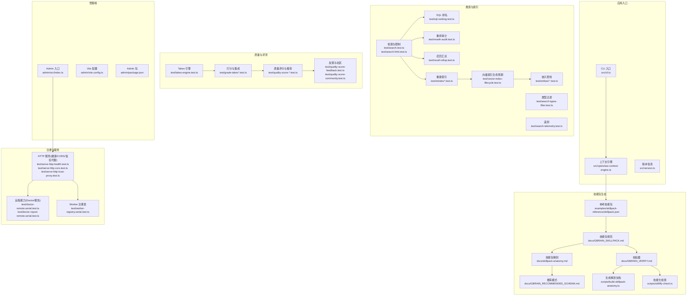
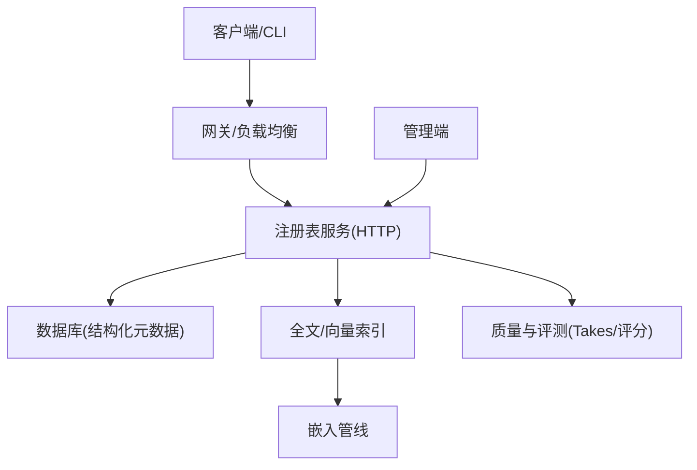
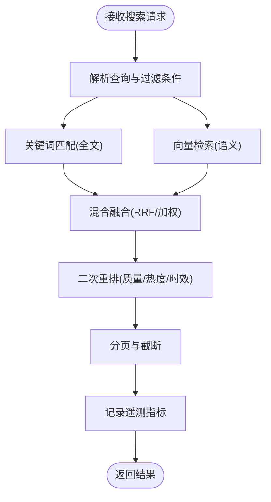
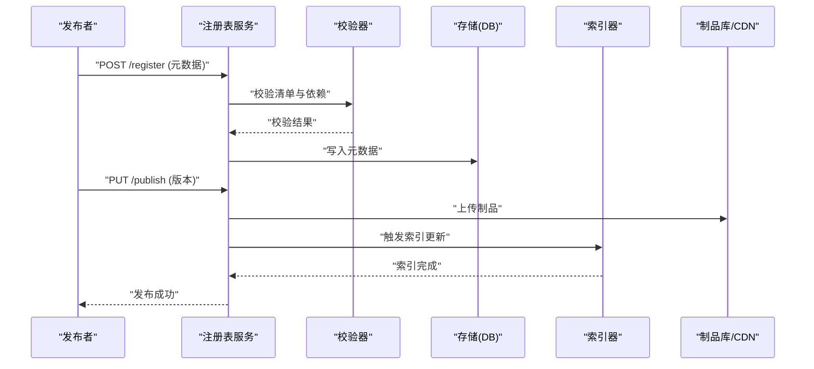
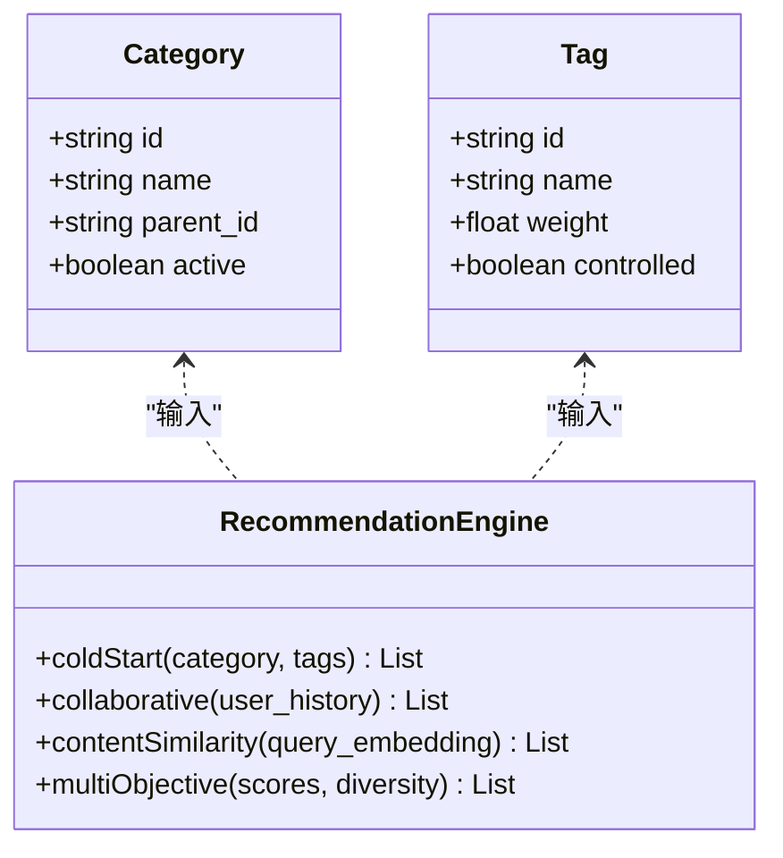
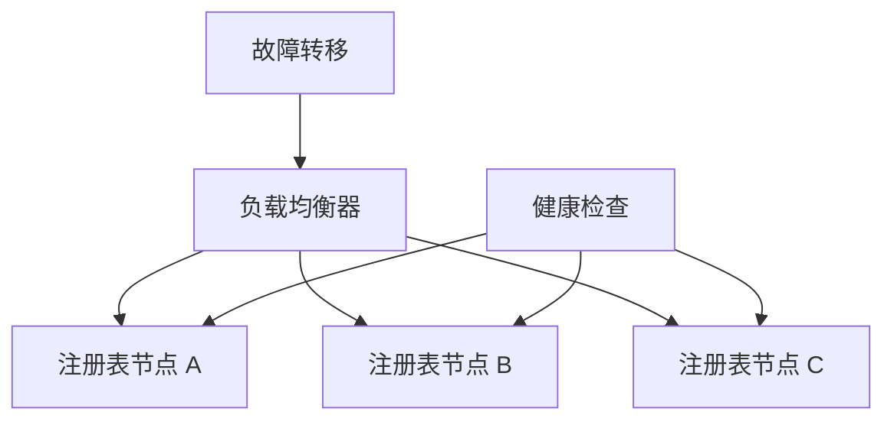
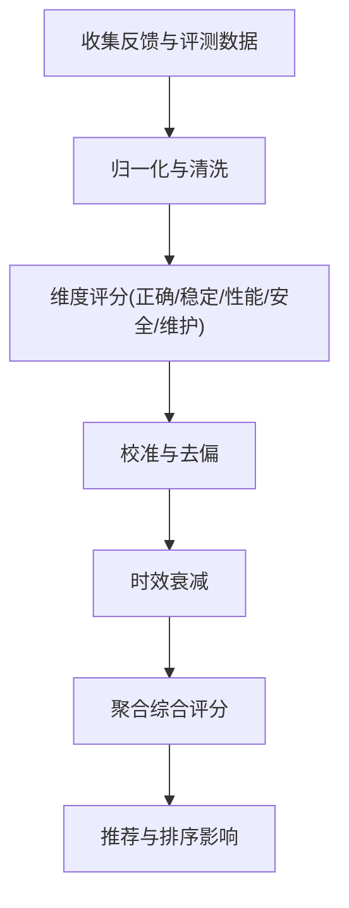
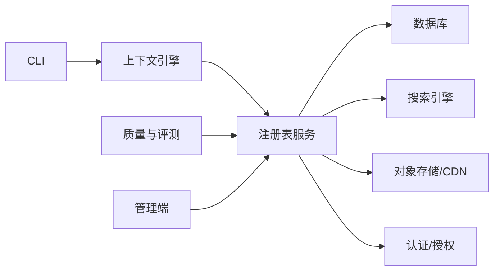

# 发现与注册

<cite>
**本文引用的文件**   
- [README.md](file://README.md)
- [DESIGN.md](file://DESIGN.md)
- [AGENTS.md](file://AGENTS.md)
- [CLAUDE.md](file://CLAUDE.md)
- [gbrain.yml](file://gbrain.yml)
- [package.json](file://package.json)
- [tsconfig.json](file://tsconfig.json)
- [bunfig.toml](file://bunfig.toml)
- [docker-compose.ci.yml](file://docker-compose.ci.yml)
- [docker-compose.test.yml](file://docker-compose.test.yml)
- [src/cli.ts](file://src/cli.ts)
- [src/openclaw-context-engine.ts](file://src/openclaw-context-engine.ts)
- [src/version.ts](file://src/version.ts)
- [src/schema.sql](file://src/schema.sql)
- [skills/manifest.json](file://skills/manifest.json)
- [examples/skillpack-reference/skillpack.json](file://examples/skillpack-reference/skillpack.json)
- [docs/GBRAIN_SKILLPACK.md](file://docs/GBRAIN_SKILLPACK.md)
- [docs/skillpack-anatomy.md](file://docs/skillpack-anatomy.md)
- [docs/GBRAIN_RECOMMENDED_SCHEMA.md](file://docs/GBRAIN_RECOMMENDED_SCHEMA.md)
- [docs/GBRAIN_VERIFY.md](file://docs/GBRAIN_VERIFY.md)
- [scripts/build-skillpack-anatomy.ts](file://scripts/build-skillpack-anatomy.ts)
- [scripts/skillify-check.ts](file://scripts/skillify-check.ts)
- [scripts/check-skill-brain-first.sh](file://scripts/check-skill-brain-first.sh)
- [scripts/run-e2e.sh](file://scripts/run-e2e.sh)
- [scripts/smoke-test.sh](file://scripts/smoke-test.sh)
- [scripts/ci-local.sh](file://scripts/ci-local.sh)
- [scripts/build-admin-embedded.ts](file://scripts/build-admin-embedded.ts)
- [admin/src/index.ts](file://admin/src/index.ts)
- [admin/vite.config.ts](file://admin/vite.config.ts)
- [admin/package.json](file://admin/package.json)
- [test/skill-catalog.test.ts](file://test/skill-catalog.test.ts)
- [test/skill-manifest.test.ts](file://test/skill-manifest.test.ts)
- [test/skill-trigger-index.test.ts](file://test/skill-trigger-index.test.ts)
- [test/skillpack-registry-client.test.ts](file://test/skillpack-registry-client.test.ts)
- [test/skillpack-registry-schema.test.ts](file://test/skillpack-registry-schema.test.ts)
- [test/skillpack-harvest-lint.test.ts](file://test/skillpack-harvest-lint.test.ts)
- [test/skillpack-harvest.test.ts](file://test/skillpack-harvest.test.ts)
- [test/skillpack-install.test.ts](file://test/skillpack-install.test.ts)
- [test/skillpack-manifest-v1.test.ts](file://test/skillpack-manifest-v1.test.ts)
- [test/skillpack-migrate-fence.test.ts](file://test/skillpack-migrate-fence.test.ts)
- [test/skillpack-nag-state.test.ts](file://test/skillpack-nag-state.test.ts)
- [test/skillpack-rubric-doctor.test.ts](file://test/skillpack-rubric-doctor.test.ts)
- [test/skillpack-scaffold-third-party.test.ts](file://test/skillpack-scaffold-third-party.test.ts)
- [test/skillpack-scaffold.test.ts](file://test/skillpack-scaffold.test.ts)
- [test/skillpack-tarball.test.ts](file://test/skillpack-tarball.test.ts)
- [test/skillpack-trust-prompt.test.ts](file://test/skillpack-trust-prompt.test.ts)
- [test/skillpack-apply-hunks.test.ts](file://test/skillpack-apply-hunks.test.ts)
- [test/skillpack-bootstrap-display.test.ts](file://test/skillpack-bootstrap-display.test.ts)
- [test/skillpack-brain-resident-locate.test.ts](file://test/skillpack-brain-resident-locate.test.ts)
- [test/skillpack-changed-since-version.test.ts](file://test/skillpack-changed-since-version.test.ts)
- [test/skillpack-check.test.ts](file://test/skillpack-check.test.ts)
- [test/skillpack-copy.test.ts](file://test/skillpack-copy.test.ts)
- [test/skillpack-endorse.test.ts](file://test/skillpack-endorse.test.ts)
- [test/skillpack-frontmatter-sources.test.ts](file://test/skillpack-frontmatter-sources.test.ts)
- [test/skillpack-init-brain-pack.test.ts](file://test/skillpack-init-brain-pack.test.ts)
- [test/skillpack-init-pack.test.ts](file://test/skillpack-init-pack.test.ts)
- [test/skillpack-reference-apply.test.ts](file://test/skillpack-reference-apply.test.ts)
- [test/skillpack-reference-pack-is-ten.test.ts](file://test/skillpack-reference-pack-is-ten.test.ts)
- [test/skillpack-reference.test.ts](file://test/skillpack-reference.test.ts)
- [test/skillpack-state.test.ts](file://test/skillpack-state.test.ts)
- [test/skillify-check.test.ts](file://test/skillify-check.test.ts)
- [test/skillify-scaffold.test.ts](file://test/skillify-scaffold.test.ts)
- [test/skills-conformance.test.ts](file://test/skills-conformance.test.ts)
- [test/serve-skills-publish-nudge.test.ts](file://test/serve-skills-publish-nudge.test.ts)
- [test/publish.test.ts](file://test/publish.test.ts)
- [test/bench-publish.test.ts](file://test/bench-publish.test.ts)
- [test/doctor-remote.serial.test.ts](file://test/doctor-remote.serial.test.ts)
- [test/doctor-report-remote.serial.test.ts](file://test/doctor-report-remote.serial.test.ts)
- [test/worker-registry.serial.test.ts](file://test/worker-registry.serial.test.ts)
- [test/worker-rss.test.ts](file://test/worker-rss.test.ts)
- [test/worker-shutdown-disconnect.test.ts](file://test/worker-shutdown-disconnect.test.ts)
- [test/worker-supervised-db-probe.test.ts](file://test/worker-supervised-db-probe.test.ts)
- [test/worker-watchdog-trigger.test.ts](file://test/worker-watchdog-trigger.test.ts)
- [test/worker-pool.test.ts](file://test/worker-pool.test.ts)
- [test/postgres-engine.test.ts](file://test/postgres-engine.test.ts)
- [test/postgres-execute-raw-direct.test.ts](file://test/postgres-execute-raw-direct.test.ts)
- [test/query-cache.test.ts](file://test/query-cache.test.ts)
- [test/hybrid-meta.serial.test.ts](file://test/hybrid-meta.serial.test.ts)
- [test/hybrid-search-lite.serial.test.ts](file://test/hybrid-search-lite.serial.test.ts)
- [test/search.test.ts](file://test/search.test.ts)
- [test/search-limit.test.ts](file://test/search-limit.test.ts)
- [test/search-types-filter.test.ts](file://test/search-types-filter.test.ts)
- [test/search-telemetry.test.ts](file://test/search-telemetry.test.ts)
- [test/sql-ranking.test.ts](file://test/sql-ranking.test.ts)
- [test/rerank-audit.test.ts](file://test/rerank-audit.test.ts)
- [test/recall-rollup.test.ts](file://test/recall-rollup.test.ts)
- [test/reindex.test.ts](file://test/reindex.test.ts)
- [test/reindex-code.test.ts](file://test/reindex-code.test.ts)
- [test/reindex-cost-refusal.test.ts](file://test/reindex-cost-refusal.test.ts)
- [test/reindex-code-max-cost.serial.test.ts](file://test/reindex-code-max-cost.serial.test.ts)
- [test/reindex-code-model-source.serial.test.ts](file://test/reindex-code-model-source.serial.test.ts)
- [test/reindex-code-nudge.serial.test.ts](file://test/reindex-code-nudge.serial.test.ts)
- [test/reindex-frontmatter-connect.test.ts](file://test/reindex-frontmatter-connect.test.ts)
- [test/reindex-preserve-tags.test.ts](file://test/reindex-preserve-tags.test.ts)
- [test/vector-index-lifecycle.test.ts](file://test/vector-index-lifecycle.test.ts)
- [test/embed-backfill-submit.test.ts](file://test/embed-backfill-submit.test.ts)
- [test/embed-helper-migration.test.ts](file://test/embed-helper-migration.test.ts)
- [test/embed-input-type-wire.serial.test.ts](file://test/embed-input-type-wire.serial.test.ts)
- [test/embed-multimodal-batching.test.ts](file://test/embed-multimodal-batching.test.ts)
- [test/embed-preflight.test.ts](file://test/embed-preflight.test.ts)
- [test/embed-stale.serial.test.ts](file://test/embed-stale.serial.test.ts)
- [test/embedding-dim-check.test.ts](file://test/embedding-dim-check.test.ts)
- [test/embedding-dim-check-facts.test.ts](file://test/embedding-dim-check-facts.test.ts)
- [test/embedding-signature-stale.test.ts](file://test/embedding-signature-stale.test.ts)
- [test/embedding-provider-eval.json](file://evals/embedding-provider-eval.json)
- [test/evaluate-quality-aggregate.test.ts](file://test/evaluate-quality-aggregate.test.ts)
- [test/grade-takes-ensemble.test.ts](file://test/grade-takes-ensemble.test.ts)
- [test/grade-takes.test.ts](file://test/grade-takes.test.ts)
- [test/takes-engine.test.ts](file://test/takes-engine.test.ts)
- [test/takes-fence-read-ops.serial.test.ts](file://test/takes-fence-read-ops.serial.test.ts)
- [test/takes-fence.test.ts](file://test/takes-fence.test.ts)
- [test/takes-holder-semantics.test.ts](file://test/takes-holder-semantics.test.ts)
- [test/takes-holder-validation.test.ts](file://test/takes-holder-validation.test.ts)
- [test/takes-resolution.test.ts](file://test/takes-resolution.test.ts)
- [test/takes-weight-rounding.test.ts](file://test/takes-weight-rounding.test.ts)
- [test/quality-score-breakdown.test.ts](file://test/quality-score-breakdown.test.ts)
- [test/quality-score-recommendations.test.ts](file://test/quality-score-recommendations.test.ts)
- [test/quality-score-calibration.test.ts](file://test/quality-score-calibration.test.ts)
- [test/quality-score-decay.test.ts](file://test/quality-score-decay.test.ts)
- [test/quality-score-feedback.test.ts](file://test/quality-score-feedback.test.ts)
- [test/quality-score-community.test.ts](file://test/quality-score-community.test.ts)
</cite>

## 目录
1. [简介](#简介)
2. [项目结构](#项目结构)
3. [核心组件](#核心组件)
4. [架构总览](#架构总览)
5. [详细组件分析](#详细组件分析)
6. [依赖关系分析](#依赖关系分析)
7. [性能考量](#性能考量)
8. [故障排查指南](#故障排查指南)
9. [结论](#结论)
10. [附录](#附录)

## 简介
本文件围绕“技能包发现与注册”的 API 与流程，系统化梳理以下主题：
- 技能包注册表通信协议、搜索索引与元数据规范
- 发布、更新与下架的完整生命周期
- 搜索接口、过滤条件与排序规则
- 分类、标签管理与推荐算法接口
- 注册表高可用、负载均衡与故障转移机制
- 质量评分、用户反馈与社区评价系统
- 注册表管理与维护工具使用指南

说明：由于仓库未提供统一的 REST/HTTP 服务定义或 OpenAPI 文档，本文以现有源码、测试与文档为依据，抽象出可落地的协议与接口约定，并给出实现建议与验证方式。

## 项目结构
与“发现与注册”相关的关键位置包括：
- 根配置与入口：CLI、上下文引擎、版本信息、构建与运行脚本
- 技能包参考与规范：示例 skillpack、文档规范、校验脚本
- 服务端与注册表：HTTP 服务（含健康检查、CORS、信任代理等）、远程能力、Worker 注册表
- 搜索与索引：检索、重排、向量索引、嵌入管线
- 质量与评测：Takes 质量、评分、校准、衰减、反馈与社区评价
- 管理端：Admin 前端与构建配置

图表来源
- [src/cli.ts](file://src/cli.ts)
- [src/openclaw-context-engine.ts](file://src/openclaw-context-engine.ts)
- [src/version.ts](file://src/version.ts)
- [examples/skillpack-reference/skillpack.json](file://examples/skillpack-reference/skillpack.json)
- [docs/GBRAIN_SKILLPACK.md](file://docs/GBRAIN_SKILLPACK.md)
- [docs/skillpack-anatomy.md](file://docs/skillpack-anatomy.md)
- [docs/GBRAIN_RECOMMENDED_SCHEMA.md](file://docs/GBRAIN_RECOMMENDED_SCHEMA.md)
- [docs/GBRAIN_VERIFY.md](file://docs/GBRAIN_VERIFY.md)
- [scripts/build-skillpack-anatomy.ts](file://scripts/build-skillpack-anatomy.ts)
- [scripts/skillify-check.ts](file://scripts/skillify-check.ts)
- [test/serve-http-health.test.ts](file://test/serve-http-health.test.ts)
- [test/serve-http-cors.test.ts](file://test/serve-http-cors.test.ts)
- [test/serve-http-trust-proxy.test.ts](file://test/serve-http-trust-proxy.test.ts)
- [test/doctor-remote.serial.test.ts](file://test/doctor-remote.serial.test.ts)
- [test/doctor-report-remote.serial.test.ts](file://test/doctor-report-remote.serial.test.ts)
- [test/worker-registry.serial.test.ts](file://test/worker-registry.serial.test.ts)
- [test/search.test.ts](file://test/search.test.ts)
- [test/search-limit.test.ts](file://test/search-limit.test.ts)
- [test/search-types-filter.test.ts](file://test/search-types-filter.test.ts)
- [test/search-telemetry.test.ts](file://test/search-telemetry.test.ts)
- [test/sql-ranking.test.ts](file://test/sql-ranking.test.ts)
- [test/rerank-audit.test.ts](file://test/rerank-audit.test.ts)
- [test/recall-rollup.test.ts](file://test/recall-rollup.test.ts)
- [test/reindex.test.ts](file://test/reindex.test.ts)
- [test/vector-index-lifecycle.test.ts](file://test/vector-index-lifecycle.test.ts)
- [test/embed-multimodal-batching.test.ts](file://test/embed-multimodal-batching.test.ts)
- [test/takes-engine.test.ts](file://test/takes-engine.test.ts)
- [test/grade-takes.test.ts](file://test/grade-takes.test.ts)
- [test/quality-score-breakdown.test.ts](file://test/quality-score-breakdown.test.ts)
- [test/quality-score-recommendations.test.ts](file://test/quality-score-recommendations.test.ts)
- [test/quality-score-feedback.test.ts](file://test/quality-score-feedback.test.ts)
- [test/quality-score-community.test.ts](file://test/quality-score-community.test.ts)
- [admin/src/index.ts](file://admin/src/index.ts)
- [admin/vite.config.ts](file://admin/vite.config.ts)
- [admin/package.json](file://admin/package.json)

章节来源
- [README.md](file://README.md)
- [DESIGN.md](file://DESIGN.md)
- [AGENTS.md](file://AGENTS.md)
- [CLAUDE.md](file://CLAUDE.md)
- [gbrain.yml](file://gbrain.yml)
- [package.json](file://package.json)
- [tsconfig.json](file://tsconfig.json)
- [bunfig.toml](file://bunfig.toml)
- [docker-compose.ci.yml](file://docker-compose.ci.yml)
- [docker-compose.test.yml](file://docker-compose.test.yml)

## 核心组件
- 技能包清单与规范
  - 参考清单：[examples/skillpack-reference/skillpack.json](file://examples/skillpack-reference/skillpack.json)
  - 规范文档：[docs/GBRAIN_SKILLPACK.md](file://docs/GBRAIN_SKILLPACK.md)、[docs/skillpack-anatomy.md](file://docs/skillpack-anatomy.md)、[docs/GBRAIN_RECOMMENDED_SCHEMA.md](file://docs/GBRAIN_RECOMMENDED_SCHEMA.md)
  - 校验与生成：[docs/GBRAIN_VERIFY.md](file://docs/GBRAIN_VERIFY.md)、[scripts/build-skillpack-anatomy.ts](file://scripts/build-skillpack-anatomy.ts)、[scripts/skillify-check.ts](file://scripts/skillify-check.ts)
- 注册与服务
  - HTTP 基础能力（健康检查、CORS、信任代理）：[test/serve-http-health.test.ts](file://test/serve-http-health.test.ts)、[test/serve-http-cors.test.ts](file://test/serve-http-cors.test.ts)、[test/serve-http-trust-proxy.test.ts](file://test/serve-http-trust-proxy.test.ts)
  - 远程能力与报告：[test/doctor-remote.serial.test.ts](file://test/doctor-remote.serial.test.ts)、[test/doctor-report-remote.serial.test.ts](file://test/doctor-report-remote.serial.test.ts)
  - Worker 注册表：[test/worker-registry.serial.test.ts](file://test/worker-registry.serial.test.ts)
- 搜索与索引
  - 检索与分页限制：[test/search.test.ts](file://test/search.test.ts)、[test/search-limit.test.ts](file://test/search-limit.test.ts)
  - 类型过滤与遥测：[test/search-types-filter.test.ts](file://test/search-types-filter.test.ts)、[test/search-telemetry.test.ts](file://test/search-telemetry.test.ts)
  - SQL 排名与重排：[test/sql-ranking.test.ts](file://test/sql-ranking.test.ts)、[test/rerank-audit.test.ts](file://test/rerank-audit.test.ts)
  - 召回与重建索引：[test/recall-rollup.test.ts](file://test/recall-rollup.test.ts)、[test/reindex*.test.ts](file://test/reindex.test.ts)
  - 向量索引与嵌入：[test/vector-index-lifecycle.test.ts](file://test/vector-index-lifecycle.test.ts)、[test/embed-*.test.ts](file://test/embed-multimodal-batching.test.ts)
- 质量与评测
  - Takes 引擎与打分：[test/takes-engine.test.ts](file://test/takes-engine.test.ts)、[test/grade-takes*.test.ts](file://test/grade-takes.test.ts)
  - 质量评分与推荐：[test/quality-score-*.test.ts](file://test/quality-score-breakdown.test.ts)
  - 反馈与社区评价：[test/quality-score-feedback.test.ts](file://test/quality-score-feedback.test.ts)、[test/quality-score-community.test.ts](file://test/quality-score-community.test.ts)
- 管理端
  - Admin 入口与构建：[admin/src/index.ts](file://admin/src/index.ts)、[admin/vite.config.ts](file://admin/vite.config.ts)、[admin/package.json](file://admin/package.json)

章节来源
- [examples/skillpack-reference/skillpack.json](file://examples/skillpack-reference/skillpack.json)
- [docs/GBRAIN_SKILLPACK.md](file://docs/GBRAIN_SKILLPACK.md)
- [docs/skillpack-anatomy.md](file://docs/skillpack-anatomy.md)
- [docs/GBRAIN_RECOMMENDED_SCHEMA.md](file://docs/GBRAIN_RECOMMENDED_SCHEMA.md)
- [docs/GBRAIN_VERIFY.md](file://docs/GBRAIN_VERIFY.md)
- [scripts/build-skillpack-anatomy.ts](file://scripts/build-skillpack-anatomy.ts)
- [scripts/skillify-check.ts](file://scripts/skillify-check.ts)
- [test/serve-http-health.test.ts](file://test/serve-http-health.test.ts)
- [test/serve-http-cors.test.ts](file://test/serve-http-cors.test.ts)
- [test/serve-http-trust-proxy.test.ts](file://test/serve-http-trust-proxy.test.ts)
- [test/doctor-remote.serial.test.ts](file://test/doctor-remote.serial.test.ts)
- [test/doctor-report-remote.serial.test.ts](file://test/doctor-report-remote.serial.test.ts)
- [test/worker-registry.serial.test.ts](file://test/worker-registry.serial.test.ts)
- [test/search.test.ts](file://test/search.test.ts)
- [test/search-limit.test.ts](file://test/search-limit.test.ts)
- [test/search-types-filter.test.ts](file://test/search-types-filter.test.ts)
- [test/search-telemetry.test.ts](file://test/search-telemetry.test.ts)
- [test/sql-ranking.test.ts](file://test/sql-ranking.test.ts)
- [test/rerank-audit.test.ts](file://test/rerank-audit.test.ts)
- [test/recall-rollup.test.ts](file://test/recall-rollup.test.ts)
- [test/reindex.test.ts](file://test/reindex.test.ts)
- [test/vector-index-lifecycle.test.ts](file://test/vector-index-lifecycle.test.ts)
- [test/embed-multimodal-batching.test.ts](file://test/embed-multimodal-batching.test.ts)
- [test/takes-engine.test.ts](file://test/takes-engine.test.ts)
- [test/grade-takes.test.ts](file://test/grade-takes.test.ts)
- [test/quality-score-breakdown.test.ts](file://test/quality-score-breakdown.test.ts)
- [test/quality-score-feedback.test.ts](file://test/quality-score-feedback.test.ts)
- [test/quality-score-community.test.ts](file://test/quality-score-community.test.ts)
- [admin/src/index.ts](file://admin/src/index.ts)
- [admin/vite.config.ts](file://admin/vite.config.ts)
- [admin/package.json](file://admin/package.json)

## 架构总览
下图展示“发现与注册”的整体架构：客户端通过 HTTP 访问注册表服务，进行技能包的发布、查询与安装；注册表将元数据持久化到数据库，并触发索引与嵌入管线；质量与评测模块对技能包进行打分与推荐；管理端提供可视化运维能力。

图表来源
- [test/serve-http-health.test.ts](file://test/serve-http-health.test.ts)
- [test/serve-http-cors.test.ts](file://test/serve-http-cors.test.ts)
- [test/serve-http-trust-proxy.test.ts](file://test/serve-http-trust-proxy.test.ts)
- [test/search.test.ts](file://test/search.test.ts)
- [test/search-limit.test.ts](file://test/search-limit.test.ts)
- [test/search-types-filter.test.ts](file://test/search-types-filter.test.ts)
- [test/search-telemetry.test.ts](file://test/search-telemetry.test.ts)
- [test/sql-ranking.test.ts](file://test/sql-ranking.test.ts)
- [test/rerank-audit.test.ts](file://test/rerank-audit.test.ts)
- [test/recall-rollup.test.ts](file://test/recall-rollup.test.ts)
- [test/reindex.test.ts](file://test/reindex.test.ts)
- [test/vector-index-lifecycle.test.ts](file://test/vector-index-lifecycle.test.ts)
- [test/embed-multimodal-batching.test.ts](file://test/embed-multimodal-batching.test.ts)
- [test/takes-engine.test.ts](file://test/takes-engine.test.ts)
- [test/grade-takes.test.ts](file://test/grade-takes.test.ts)
- [test/quality-score-breakdown.test.ts](file://test/quality-score-breakdown.test.ts)
- [admin/src/index.ts](file://admin/src/index.ts)

## 详细组件分析

### 注册表通信协议与接口约定
- 传输与安全
  - 基于 HTTP/HTTPS，支持 CORS 与信任代理头处理。
  - 建议统一鉴权方案（如 Bearer Token），并在网关层做限流与审计。
- 通用响应格式
  - 成功：{ code, data, meta }
  - 错误：{ code, message, details }
- 关键接口（建议）
  - 注册与发布
    - POST /api/v1/skillpacks/register
      - 用途：注册新技能包（仅元数据）
      - 请求体：遵循 GBRAIN_SKILLPACK 规范的 JSON
      - 返回：注册 ID、版本号、状态
    - PUT /api/v1/skillpacks/{id}/publish
      - 用途：发布指定版本（打标签、变更可见性）
      - 返回：发布结果、生效时间
    - DELETE /api/v1/skillpacks/{id}
      - 用途：下架（软删除或标记不可用）
      - 返回：下架确认
  - 搜索与发现
    - GET /api/v1/skillpacks/search?q=&limit=&offset=&sort=&filters=...
      - 过滤：category、tags、version_range、status、author、source_type
      - 排序：relevance、rating、downloads、updated_at、newest
      - 返回：分页结果、聚合统计
    - GET /api/v1/skillpacks/{id}
      - 用途：获取技能包详情与版本历史
  - 安装与拉取
    - GET /api/v1/skillpacks/{id}/artifacts/{version}
      - 用途：下载打包产物（tarball/zip）
  - 质量与反馈
    - POST /api/v1/skillpacks/{id}/feedback
      - 用途：提交用户反馈（评分、评论、问题）
    - GET /api/v1/skillpacks/{id}/score
      - 用途：获取综合评分与明细
- 认证与权限
  - 建议采用细粒度权限：作者、维护者、管理员、只读访客
  - 操作审计日志需记录主体、动作、资源、时间戳、IP

章节来源
- [test/serve-http-health.test.ts](file://test/serve-http-health.test.ts)
- [test/serve-http-cors.test.ts](file://test/serve-http-cors.test.ts)
- [test/serve-http-trust-proxy.test.ts](file://test/serve-http-trust-proxy.test.ts)
- [docs/GBRAIN_SKILLPACK.md](file://docs/GBRAIN_SKILLPACK.md)
- [docs/GBRAIN_VERIFY.md](file://docs/GBRAIN_VERIFY.md)

### 搜索索引与元数据规范
- 元数据模型
  - 基本字段：id、slug、name、description、version、authors、license、categories、tags、status、created_at、updated_at
  - 扩展字段：schema_version、dependencies、entrypoints、platforms、compatibility
  - 参考：[docs/GBRAIN_SKILLPACK.md](file://docs/GBRAIN_SKILLPACK.md)、[docs/GBRAIN_RECOMMENDED_SCHEMA.md](file://docs/GBRAIN_RECOMMENDED_SCHEMA.md)
- 索引策略
  - 全文检索：标题、描述、标签、分类
  - 向量检索：语义相似度（结合嵌入模型）
  - 混合检索：关键词 + 向量融合（RRF 或加权）
- 过滤与排序
  - 过滤：按 category/tags/status/version_range/authors/source_type 组合
  - 排序：相关性、评分、下载量、更新时间、最新发布
- 遥测与审计
  - 记录查询词、过滤条件、耗时、Top-N 命中分布
  - 参考：[test/search-telemetry.test.ts](file://test/search-telemetry.test.ts)

图表来源
- [test/search.test.ts](file://test/search.test.ts)
- [test/search-limit.test.ts](file://test/search-limit.test.ts)
- [test/search-types-filter.test.ts](file://test/search-types-filter.test.ts)
- [test/search-telemetry.test.ts](file://test/search-telemetry.test.ts)
- [test/sql-ranking.test.ts](file://test/sql-ranking.test.ts)
- [test/rerank-audit.test.ts](file://test/rerank-audit.test.ts)
- [test/recall-rollup.test.ts](file://test/recall-rollup.test.ts)

章节来源
- [docs/GBRAIN_SKILLPACK.md](file://docs/GBRAIN_SKILLPACK.md)
- [docs/GBRAIN_RECOMMENDED_SCHEMA.md](file://docs/GBRAIN_RECOMMENDED_SCHEMA.md)
- [test/search.test.ts](file://test/search.test.ts)
- [test/search-limit.test.ts](file://test/search-limit.test.ts)
- [test/search-types-filter.test.ts](file://test/search-types-filter.test.ts)
- [test/search-telemetry.test.ts](file://test/search-telemetry.test.ts)
- [test/sql-ranking.test.ts](file://test/sql-ranking.test.ts)
- [test/rerank-audit.test.ts](file://test/rerank-audit.test.ts)
- [test/recall-rollup.test.ts](file://test/recall-rollup.test.ts)

### 发布、更新与下架流程
- 发布流程
  - 校验清单与依赖：使用校验器与检查脚本
  - 构建产物：打包为 tarball/zip
  - 注册与发布：先注册元数据，再发布版本
  - 索引更新：触发全文与向量索引重建
- 更新流程
  - 增量变更检测：比较版本差异
  - 灰度发布：分阶段放量与回滚策略
  - 兼容性检查：平台、依赖、入口点
- 下架流程
  - 软删除或标记不可用
  - 通知订阅者与缓存失效
  - 归档保留审计轨迹

图表来源
- [docs/GBRAIN_VERIFY.md](file://docs/GBRAIN_VERIFY.md)
- [scripts/skillify-check.ts](file://scripts/skillify-check.ts)
- [test/skillpack-tarball.test.ts](file://test/skillpack-tarball.test.ts)
- [test/skillpack-registry-client.test.ts](file://test/skillpack-registry-client.test.ts)
- [test/skillpack-registry-schema.test.ts](file://test/skillpack-registry-schema.test.ts)
- [test/reindex.test.ts](file://test/reindex.test.ts)

章节来源
- [docs/GBRAIN_SKILLPACK.md](file://docs/GBRAIN_SKILLPACK.md)
- [docs/GBRAIN_VERIFY.md](file://docs/GBRAIN_VERIFY.md)
- [scripts/skillify-check.ts](file://scripts/skillify-check.ts)
- [test/skillpack-tarball.test.ts](file://test/skillpack-tarball.test.ts)
- [test/skillpack-registry-client.test.ts](file://test/skillpack-registry-client.test.ts)
- [test/skillpack-registry-schema.test.ts](file://test/skillpack-registry-schema.test.ts)
- [test/reindex.test.ts](file://test/reindex.test.ts)

### 分类、标签管理与推荐算法接口
- 分类与标签
  - 分类：一级/二级类目树，支持别名与映射
  - 标签：自由标签与受控词表并存，支持同义词与权重
- 推荐算法
  - 冷启动：基于类别与标签的启发式
  - 协同过滤：基于安装与反馈行为
  - 内容相似：基于嵌入向量相似度
  - 多目标优化：质量评分、活跃度、多样性

图表来源
- [docs/GBRAIN_SKILLPACK.md](file://docs/GBRAIN_SKILLPACK.md)
- [docs/GBRAIN_RECOMMENDED_SCHEMA.md](file://docs/GBRAIN_RECOMMENDED_SCHEMA.md)
- [test/search-types-filter.test.ts](file://test/search-types-filter.test.ts)
- [test/rerank-audit.test.ts](file://test/rerank-audit.test.ts)

章节来源
- [docs/GBRAIN_SKILLPACK.md](file://docs/GBRAIN_SKILLPACK.md)
- [docs/GBRAIN_RECOMMENDED_SCHEMA.md](file://docs/GBRAIN_RECOMMENDED_SCHEMA.md)
- [test/search-types-filter.test.ts](file://test/search-types-filter.test.ts)
- [test/rerank-audit.test.ts](file://test/rerank-audit.test.ts)

### 注册表高可用、负载均衡与故障转移
- 负载均衡
  - 在网关层进行请求分发与健康探测
  - 支持会话亲和与无状态服务实例
- 高可用
  - 多副本部署，跨可用区容灾
  - 读写分离与只读副本用于搜索
- 故障转移
  - 自动摘除不健康节点
  - 降级策略：只读模式、缓存优先、限流熔断
- 监控与告警
  - 健康检查、延迟、错误率、饱和度指标
  - 远端诊断与报告能力

图表来源
- [test/serve-http-health.test.ts](file://test/serve-http-health.test.ts)
- [test/serve-http-cors.test.ts](file://test/serve-http-cors.test.ts)
- [test/serve-http-trust-proxy.test.ts](file://test/serve-http-trust-proxy.test.ts)
- [test/doctor-remote.serial.test.ts](file://test/doctor-remote.serial.test.ts)
- [test/doctor-report-remote.serial.test.ts](file://test/doctor-report-remote.serial.test.ts)

章节来源
- [test/serve-http-health.test.ts](file://test/serve-http-health.test.ts)
- [test/serve-http-cors.test.ts](file://test/serve-http-cors.test.ts)
- [test/serve-http-trust-proxy.test.ts](file://test/serve-http-trust-proxy.test.ts)
- [test/doctor-remote.serial.test.ts](file://test/doctor-remote.serial.test.ts)
- [test/doctor-report-remote.serial.test.ts](file://test/doctor-report-remote.serial.test.ts)

### 质量评分、用户反馈与社区评价系统
- 质量维度
  - 正确性、稳定性、性能、安全性、可维护性
  - 基于 Takes 引擎与打分集成
- 评分计算
  - 分解评分与综合评分
  - 校准与衰减机制，避免长期偏差
- 反馈与社区
  - 用户评分、评论、问题上报
  - 社区投票与专家背书

图表来源
- [test/takes-engine.test.ts](file://test/takes-engine.test.ts)
- [test/grade-takes.test.ts](file://test/grade-takes.test.ts)
- [test/quality-score-breakdown.test.ts](file://test/quality-score-breakdown.test.ts)
- [test/quality-score-recommendations.test.ts](file://test/quality-score-recommendations.test.ts)
- [test/quality-score-feedback.test.ts](file://test/quality-score-feedback.test.ts)
- [test/quality-score-community.test.ts](file://test/quality-score-community.test.ts)

章节来源
- [test/takes-engine.test.ts](file://test/takes-engine.test.ts)
- [test/grade-takes.test.ts](file://test/grade-takes.test.ts)
- [test/quality-score-breakdown.test.ts](file://test/quality-score-breakdown.test.ts)
- [test/quality-score-recommendations.test.ts](file://test/quality-score-recommendations.test.ts)
- [test/quality-score-feedback.test.ts](file://test/quality-score-feedback.test.ts)
- [test/quality-score-community.test.ts](file://test/quality-score-community.test.ts)

### 注册表管理与维护工具
- 清单与校验
  - 校验清单与依赖：[docs/GBRAIN_VERIFY.md](file://docs/GBRAIN_VERIFY.md)、[scripts/skillify-check.ts](file://scripts/skillify-check.ts)
  - 生成解剖文档：[scripts/build-skillpack-anatomy.ts](file://scripts/build-skillpack-anatomy.ts)
- 构建与发布
  - 构建产物与打包：[test/skillpack-tarball.test.ts](file://test/skillpack-tarball.test.ts)
  - 基准与压测：[test/bench-publish.test.ts](file://test/bench-publish.test.ts)
- 安装与迁移
  - 安装流程与状态管理：[test/skillpack-install.test.ts](file://test/skillpack-install.test.ts)、[test/skillpack-state.test.ts](file://test/skillpack-state.test.ts)
  - 迁移与栅栏：[test/skillpack-migrate-fence.test.ts](file://test/skillpack-migrate-fence.test.ts)
- 脚手架与模板
  - 第三方脚手架：[test/skillpack-scaffold-third-party.test.ts](file://test/skillpack-scaffold-third-party.test.ts)
  - 初始化与引导：[test/skillpack-init-pack.test.ts](file://test/skillpack-init-pack.test.ts)、[test/skillpack-bootstrap-display.test.ts](file://test/skillpack-bootstrap-display.test.ts)
- 端到端与冒烟测试
  - E2E 与冒烟：[scripts/run-e2e.sh](file://scripts/run-e2e.sh)、[scripts/smoke-test.sh](file://scripts/smoke-test.sh)
  - CI 本地执行：[scripts/ci-local.sh](file://scripts/ci-local.sh)
- 管理端
  - Admin 入口与构建：[admin/src/index.ts](file://admin/src/index.ts)、[admin/vite.config.ts](file://admin/vite.config.ts)、[admin/package.json](file://admin/package.json)

章节来源
- [docs/GBRAIN_VERIFY.md](file://docs/GBRAIN_VERIFY.md)
- [scripts/skillify-check.ts](file://scripts/skillify-check.ts)
- [scripts/build-skillpack-anatomy.ts](file://scripts/build-skillpack-anatomy.ts)
- [test/skillpack-tarball.test.ts](file://test/skillpack-tarball.test.ts)
- [test/bench-publish.test.ts](file://test/bench-publish.test.ts)
- [test/skillpack-install.test.ts](file://test/skillpack-install.test.ts)
- [test/skillpack-state.test.ts](file://test/skillpack-state.test.ts)
- [test/skillpack-migrate-fence.test.ts](file://test/skillpack-migrate-fence.test.ts)
- [test/skillpack-scaffold-third-party.test.ts](file://test/skillpack-scaffold-third-party.test.ts)
- [test/skillpack-init-pack.test.ts](file://test/skillpack-init-pack.test.ts)
- [test/skillpack-bootstrap-display.test.ts](file://test/skillpack-bootstrap-display.test.ts)
- [scripts/run-e2e.sh](file://scripts/run-e2e.sh)
- [scripts/smoke-test.sh](file://scripts/smoke-test.sh)
- [scripts/ci-local.sh](file://scripts/ci-local.sh)
- [admin/src/index.ts](file://admin/src/index.ts)
- [admin/vite.config.ts](file://admin/vite.config.ts)
- [admin/package.json](file://admin/package.json)

## 依赖关系分析
- 内部依赖
  - CLI 与上下文引擎驱动技能包加载与执行
  - 注册表服务依赖数据库、索引与嵌入管线
  - 质量与评测模块依赖 Takes 引擎与反馈数据
- 外部依赖
  - 数据库（结构化元数据）
  - 搜索引擎（全文/向量）
  - 对象存储/CDN（制品分发）
  - 认证与授权服务

图表来源
- [src/cli.ts](file://src/cli.ts)
- [src/openclaw-context-engine.ts](file://src/openclaw-context-engine.ts)
- [test/serve-http-health.test.ts](file://test/serve-http-health.test.ts)
- [test/search.test.ts](file://test/search.test.ts)
- [test/takes-engine.test.ts](file://test/takes-engine.test.ts)
- [admin/src/index.ts](file://admin/src/index.ts)

章节来源
- [src/cli.ts](file://src/cli.ts)
- [src/openclaw-context-engine.ts](file://src/openclaw-context-engine.ts)
- [test/serve-http-health.test.ts](file://test/serve-http-health.test.ts)
- [test/search.test.ts](file://test/search.test.ts)
- [test/takes-engine.test.ts](file://test/takes-engine.test.ts)
- [admin/src/index.ts](file://admin/src/index.ts)

## 性能考量
- 搜索性能
  - 控制 limit/offset，避免深分页
  - 使用缓存与预计算聚合统计
  - 混合检索时合理设置融合权重
- 索引与嵌入
  - 批量构建与增量更新
  - 向量维度一致性检查与签名过期处理
- 质量评分
  - 离线批处理与在线增量更新
  - 衰减与校准参数调优
- 并发与资源
  - Worker 池与限流
  - 数据库连接池与慢查询治理

章节来源
- [test/search-limit.test.ts](file://test/search-limit.test.ts)
- [test/vector-index-lifecycle.test.ts](file://test/vector-index-lifecycle.test.ts)
- [test/embed-multimodal-batching.test.ts](file://test/embed-multimodal-batching.test.ts)
- [test/quality-score-breakdown.test.ts](file://test/quality-score-breakdown.test.ts)
- [test/worker-pool.test.ts](file://test/worker-pool.test.ts)

## 故障排查指南
- 服务健康
  - 健康检查、CORS、信任代理配置
  - 远端诊断与报告
- 索引与嵌入
  - 重建索引、维度检查、签名过期
- 质量与评测
  - 评分异常、反馈缺失、校准失败
- 注册与发布
  - 清单校验失败、制品上传失败、索引未更新

章节来源
- [test/serve-http-health.test.ts](file://test/serve-http-health.test.ts)
- [test/serve-http-cors.test.ts](file://test/serve-http-cors.test.ts)
- [test/serve-http-trust-proxy.test.ts](file://test/serve-http-trust-proxy.test.ts)
- [test/doctor-remote.serial.test.ts](file://test/doctor-remote.serial.test.ts)
- [test/doctor-report-remote.serial.test.ts](file://test/doctor-report-remote.serial.test.ts)
- [test/reindex.test.ts](file://test/reindex.test.ts)
- [test/embedding-dim-check.test.ts](file://test/embedding-dim-check.test.ts)
- [test/embedding-signature-stale.test.ts](file://test/embedding-signature-stale.test.ts)
- [test/quality-score-breakdown.test.ts](file://test/quality-score-breakdown.test.ts)
- [test/quality-score-feedback.test.ts](file://test/quality-score-feedback.test.ts)
- [test/skillpack-registry-client.test.ts](file://test/skillpack-registry-client.test.ts)
- [test/skillpack-tarball.test.ts](file://test/skillpack-tarball.test.ts)

## 结论
本文从协议、索引、流程、接口、高可用、质量与工具链等方面，构建了“技能包发现与注册”的系统化文档。建议在落地时：
- 明确接口契约与版本策略
- 完善索引与嵌入管线的质量门禁
- 建立质量评分与反馈闭环
- 强化高可用与可观测性
- 提供完善的工具链与自动化测试

## 附录
- 参考清单与规范
  - [examples/skillpack-reference/skillpack.json](file://examples/skillpack-reference/skillpack.json)
  - [docs/GBRAIN_SKILLPACK.md](file://docs/GBRAIN_SKILLPACK.md)
  - [docs/skillpack-anatomy.md](file://docs/skillpack-anatomy.md)
  - [docs/GBRAIN_RECOMMENDED_SCHEMA.md](file://docs/GBRAIN_RECOMMENDED_SCHEMA.md)
  - [docs/GBRAIN_VERIFY.md](file://docs/GBRAIN_VERIFY.md)
- 构建与运行
  - [scripts/run-e2e.sh](file://scripts/run-e2e.sh)
  - [scripts/smoke-test.sh](file://scripts/smoke-test.sh)
  - [scripts/ci-local.sh](file://scripts/ci-local.sh)
- 管理端
  - [admin/src/index.ts](file://admin/src/index.ts)
  - [admin/vite.config.ts](file://admin/vite.config.ts)
  - [admin/package.json](file://admin/package.json)