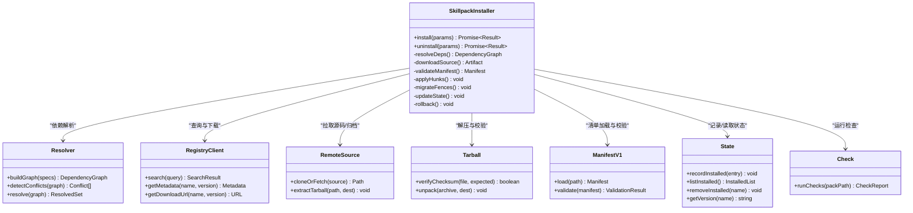
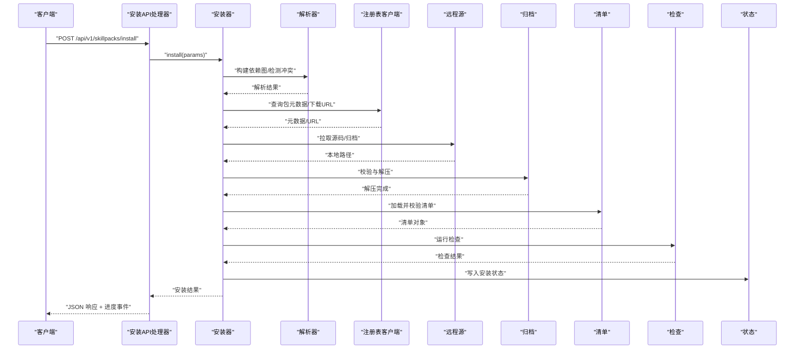
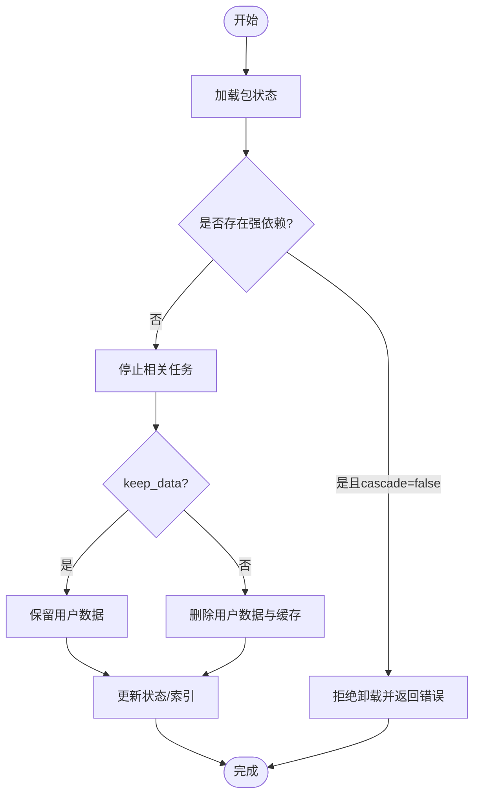
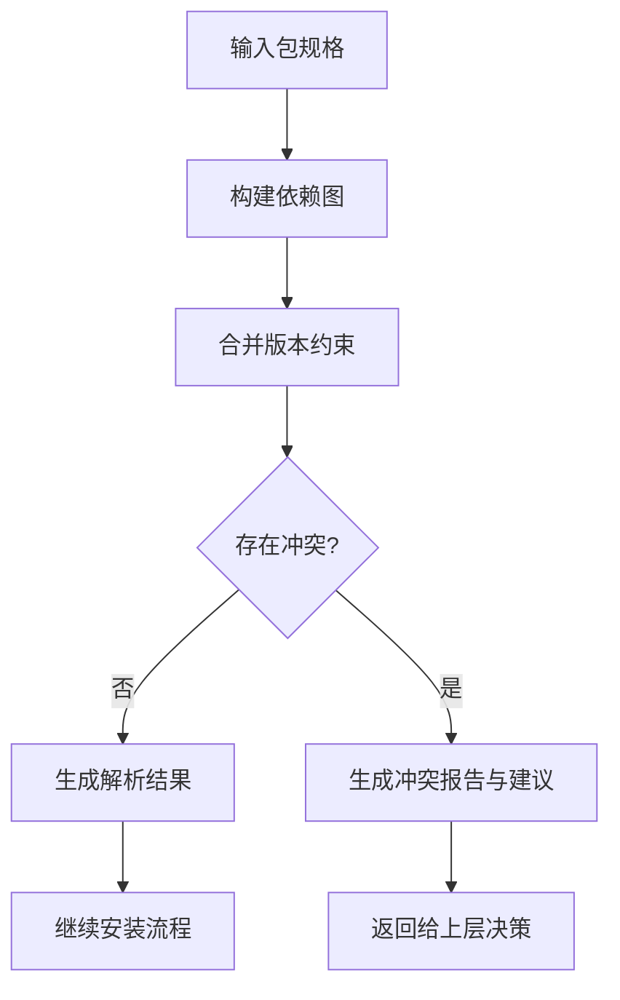
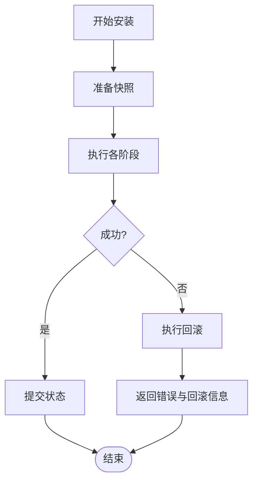
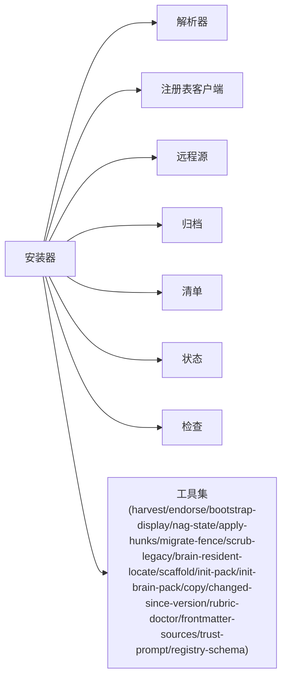

# 安装与卸载

<cite>
**本文引用的文件**   
- [src/commands/skillpack-install.ts](file://src/commands/skillpack-install.ts)
- [src/commands/skillpack-uninstall.ts](file://src/commands/skillpack-uninstall.ts)
- [src/core/skillpack/installer.ts](file://src/core/skillpack/installer.ts)
- [src/core/skillpack/resolver.ts](file://src/core/skillpack/resolver.ts)
- [src/core/skillpack/state.ts](file://src/core/skillpack/state.ts)
- [src/core/skillpack/registry-client.ts](file://src/core/skillpack/registry-client.ts)
- [src/core/skillpack/remote-source.ts](file://src/core/skillpack/remote-source.ts)
- [src/core/skillpack/tarball.ts](file://src/core/skillpack/tarball.ts)
- [src/core/skillpack/manifest-v1.ts](file://src/core/skillpack/manifest-v1.ts)
- [src/core/skillpack/check.ts](file://src/core/skillpack/check.ts)
- [src/core/skillpack/harvest.ts](file://src/core/skillpack/harvest.ts)
- [src/core/skillpack/endorse.ts](file://src/core/skillpack/endorse.ts)
- [src/core/skillpack/bootstrap-display.ts](file://src/core/skillpack/bootstrap-display.ts)
- [src/core/skillpack/nag-state.ts](file://src/core/skillpack/nag-state.ts)
- [src/core/skillpack/apply-hunks.ts](file://src/core/skillpack/apply-hunks.ts)
- [src/core/skillpack/migrate-fence.ts](file://src/core/skillpack/migrate-fence.ts)
- [src/core/skillpack/scrub-legacy.ts](file://src/core/skillpack/scrub-legacy.ts)
- [src/core/skillpack/brain-resident-locate.ts](file://src/core/skillpack/brain-resident-locate.ts)
- [src/core/skillpack/scaffold-third-party.ts](file://src/core/skillpack/scaffold-third-party.ts)
- [src/core/skillpack/scaffold.ts](file://src/core/skillpack/scaffold.ts)
- [src/core/skillpack/init-pack.ts](file://src/core/skillpack/init-pack.ts)
- [src/core/skillpack/init-brain-pack.ts](file://src/core/skillpack/init-brain-pack.ts)
- [src/core/skillpack/copy.ts](file://src/core/skillpack/copy.ts)
- [src/core/skillpack/changed-since-version.ts](file://src/core/skillpack/changed-since-version.ts)
- [src/core/skillpack/rubric-doctor.ts](file://src/core/skillpack/rubric-doctor.ts)
- [src/core/skillpack/frontmatter-sources.ts](file://src/core/skillpack/frontmatter-sources.ts)
- [src/core/skillpack/trust-prompt.ts](file://src/core/skillpack/trust-prompt.ts)
- [src/core/skillpack/registry-schema.ts](file://src/core/skillpack/registry-schema.ts)
- [src/core/skillpack/state.test.ts](file://test/skillpack-state.test.ts)
- [src/core/skillpack/registry-client.test.ts](file://test/skillpack-registry-client.test.ts)
- [src/core/skillpack/registry-schema.test.ts](file://test/skillpack-registry-schema.test.ts)
- [src/core/skillpack/remote-source.test.ts](file://test/skillpack-remote-source.test.ts)
- [src/core/skillpack/tarball.test.ts](file://test/skillpack-tarball.test.ts)
- [src/core/skillpack/manifest-v1.test.ts](file://test/skillpack-manifest-v1.test.ts)
- [src/core/skillpack/check.test.ts](file://test/skillpack-check.test.ts)
- [src/core/skillpack/harvest.test.ts](file://test/skillpack-harvest.test.ts)
- [src/core/skillpack/harvest-lint.test.ts](file://test/skillpack-harvest-lint.test.ts)
- [src/core/skillpack/bootstrap-display.test.ts](file://test/skillpack-bootstrap-display.test.ts)
- [src/core/skillpack/nag-state.test.ts](file://test/skillpack-nag-state.test.ts)
- [src/core/skillpack/apply-hunks.test.ts](file://test/skillpack-apply-hunks.test.ts)
- [src/core/skillpack/migrate-fence.test.ts](file://test/skillpack-migrate-fence.test.ts)
- [src/core/skillpack/scrub-legacy.test.ts](file://test/skillpack-scrub-legacy.test.ts)
- [src/core/skillpack/brain-resident-locate.test.ts](file://test/skillpack-brain-resident-locate.test.ts)
- [src/core/skillpack/scaffold-third-party.test.ts](file://test/skillpack-scaffold-third-party.test.ts)
- [src/core/skillpack/scaffold.test.ts](file://test/skillpack-scaffold.test.ts)
- [src/core/skillpack/init-pack.test.ts](file://test/skillpack-init-pack.test.ts)
- [src/core/skillpack/init-brain-pack.test.ts](file://test/skillpack-init-brain-pack.test.ts)
- [src/core/skillpack/copy.test.ts](file://test/skillpack-copy.test.ts)
- [src/core/skillpack/changed-since-version.test.ts](file://test/skillpack-changed-since-version.test.ts)
- [src/core/skillpack/rubric-doctor.test.ts](file://test/skillpack-rubric-doctor.test.ts)
- [src/core/skillpack/frontmatter-sources.test.ts](file://test/skillpack-frontmatter-sources.test.ts)
- [src/core/skillpack/trust-prompt.test.ts](file://test/skillpack-trust-prompt.test.ts)
- [examples/skillpack-reference/skillpack.json](file://examples/skillpack-reference/skillpack.json)
- [docs/GBRAIN_SKILLPACK.md](file://docs/GBRAIN_SKILLPACK.md)
</cite>

## 目录
1. [简介](#简介)
2. [项目结构](#项目结构)
3. [核心组件](#核心组件)
4. [架构总览](#架构总览)
5. [详细组件分析](#详细组件分析)
6. [依赖分析](#依赖分析)
7. [性能考虑](#性能考虑)
8. [故障排查指南](#故障排查指南)
9. [结论](#结论)
10. [附录](#附录)

## 简介
本章节面向需要集成或调用技能包安装与卸载能力的开发者，提供基于 HTTP 的接口说明与实现要点。文档覆盖以下能力：
- 从本地文件、远程仓库和注册表安装技能包
- 安装过程中的依赖解析、版本冲突处理与回滚机制
- 卸载流程：依赖检查、数据清理与状态同步
- 安装参数配置、环境变量与权限控制
- 安装进度监控、错误处理与日志输出格式
- 完整的安装与卸载示例（以 curl 与脚本形式）

## 项目结构
与“安装与卸载”相关的代码主要分布在命令层与核心逻辑层：
- 命令层：对外暴露 CLI/HTTP 入口，负责参数解析、鉴权、进度事件与结果返回
- 核心层：实现安装器、解析器、注册表客户端、远程源拉取、归档解压、清单校验、状态管理、迁移与清理等

```mermaid
graph TB
subgraph "命令层"
CMDI["skillpack-install 命令"]
CMDD["skillpack-uninstall 命令"]
end
subgraph "核心层"
INST["安装器 installer"]
RES["解析器 resolver"]
REG["注册表客户端 registry-client"]
REM["远程源 remote-source"]
TAR["归档 tarball"]
MAN["清单 manifest-v1"]
ST["状态 state"]
CHK["检查 check"]
HRF["harvest 收集"]
END["endorse 背书"]
BDP["bootstrap-display 引导展示"]
NAG["nag-state 提醒状态"]
AH["apply-hunks 补丁应用"]
MF["migrate-fence 围栏迁移"]
SL["scrub-legacy 清理旧版"]
BRL["brain-resident-locate 脑驻留定位"]
S3P["scaffold-third-party 第三方脚手架"]
SCF["scaffold 脚手架"]
INP["init-pack 初始化包"]
INB["init-brain-pack 初始化脑包"]
CPY["copy 复制"]
CSV["changed-since-version 变更检测"]
RUD["rubric-doctor 规范医生"]
FMS["frontmatter-sources 来源前置元数据"]
TRU["trust-prompt 信任提示"]
RSCH["registry-schema 注册表模式"]
end
CMDI --> INST
CMDD --> INST
INST --> RES
INST --> REG
INST --> REM
INST --> TAR
INST --> MAN
INST --> ST
INST --> CHK
INST --> HRF
INST --> END
INST --> BDP
INST --> NAG
INST --> AH
INST --> MF
INST --> SL
INST --> BRL
INST --> S3P
INST --> SCF
INST --> INP
INST --> INB
INST --> CPY
INST --> CSV
INST --> RUD
INST --> FMS
INST --> TRU
INST --> RSCH
```

图表来源
- [src/commands/skillpack-install.ts](file://src/commands/skillpack-install.ts)
- [src/commands/skillpack-uninstall.ts](file://src/commands/skillpack-uninstall.ts)
- [src/core/skillpack/installer.ts](file://src/core/skillpack/installer.ts)
- [src/core/skillpack/resolver.ts](file://src/core/skillpack/resolver.ts)
- [src/core/skillpack/registry-client.ts](file://src/core/skillpack/registry-client.ts)
- [src/core/skillpack/remote-source.ts](file://src/core/skillpack/remote-source.ts)
- [src/core/skillpack/tarball.ts](file://src/core/skillpack/tarball.ts)
- [src/core/skillpack/manifest-v1.ts](file://src/core/skillpack/manifest-v1.ts)
- [src/core/skillpack/state.ts](file://src/core/skillpack/state.ts)
- [src/core/skillpack/check.ts](file://src/core/skillpack/check.ts)
- [src/core/skillpack/harvest.ts](file://src/core/skillpack/harvest.ts)
- [src/core/skillpack/endorse.ts](file://src/core/skillpack/endorse.ts)
- [src/core/skillpack/bootstrap-display.ts](file://src/core/skillpack/bootstrap-display.ts)
- [src/core/skillpack/nag-state.ts](file://src/core/skillpack/nag-state.ts)
- [src/core/skillpack/apply-hunks.ts](file://src/core/skillpack/apply-hunks.ts)
- [src/core/skillpack/migrate-fence.ts](file://src/core/skillpack/migrate-fence.ts)
- [src/core/skillpack/scrub-legacy.ts](file://src/core/skillpack/scrub-legacy.ts)
- [src/core/skillpack/brain-resident-locate.ts](file://src/core/skillpack/brain-resident-locate.ts)
- [src/core/skillpack/scaffold-third-party.ts](file://src/core/skillpack/scaffold-third-party.ts)
- [src/core/skillpack/scaffold.ts](file://src/core/skillpack/scaffold.ts)
- [src/core/skillpack/init-pack.ts](file://src/core/skillpack/init-pack.ts)
- [src/core/skillpack/init-brain-pack.ts](file://src/core/skillpack/init-brain-pack.ts)
- [src/core/skillpack/copy.ts](file://src/core/skillpack/copy.ts)
- [src/core/skillpack/changed-since-version.ts](file://src/core/skillpack/changed-since-version.ts)
- [src/core/skillpack/rubric-doctor.ts](file://src/core/skillpack/rubric-doctor.ts)
- [src/core/skillpack/frontmatter-sources.ts](file://src/core/skillpack/frontmatter-sources.ts)
- [src/core/skillpack/trust-prompt.ts](file://src/core/skillpack/trust-prompt.ts)
- [src/core/skillpack/registry-schema.ts](file://src/core/skillpack/registry-schema.ts)

章节来源
- [src/commands/skillpack-install.ts](file://src/commands/skillpack-install.ts)
- [src/commands/skillpack-uninstall.ts](file://src/commands/skillpack-uninstall.ts)
- [src/core/skillpack/installer.ts](file://src/core/skillpack/installer.ts)

## 核心组件
- 安装器（installer）：编排安装全流程，协调解析、下载、校验、应用、迁移、状态更新与回滚
- 解析器（resolver）：解析依赖图、计算版本选择、检测冲突并提供解决策略
- 注册表客户端（registry-client）：与注册表交互，查询包元数据、版本列表与下载链接
- 远程源（remote-source）：统一抽象 Git/HTTPS/本地路径等多来源拉取
- 归档（tarball）：安全解压与完整性校验
- 清单（manifest-v1）：加载并校验 skillpack.json 等元数据
- 状态（state）：持久化已安装包信息、版本、来源与时间戳
- 检查（check）：运行规则检查、依赖一致性验证
- 其他辅助：harvest、endorse、bootstrap-display、nag-state、apply-hunks、migrate-fence、scrub-legacy、brain-resident-locate、scaffold、init-pack、init-brain-pack、copy、changed-since-version、rubric-doctor、frontmatter-sources、trust-prompt、registry-schema

章节来源
- [src/core/skillpack/installer.ts](file://src/core/skillpack/installer.ts)
- [src/core/skillpack/resolver.ts](file://src/core/skillpack/resolver.ts)
- [src/core/skillpack/registry-client.ts](file://src/core/skillpack/registry-client.ts)
- [src/core/skillpack/remote-source.ts](file://src/core/skillpack/remote-source.ts)
- [src/core/skillpack/tarball.ts](file://src/core/skillpack/tarball.ts)
- [src/core/skillpack/manifest-v1.ts](file://src/core/skillpack/manifest-v1.ts)
- [src/core/skillpack/state.ts](file://src/core/skillpack/state.ts)
- [src/core/skillpack/check.ts](file://src/core/skillpack/check.ts)

## 架构总览
下图展示了“安装与卸载”在命令层与核心层的交互关系，以及关键子模块的职责边界。

图表来源
- [src/core/skillpack/installer.ts](file://src/core/skillpack/installer.ts)
- [src/core/skillpack/resolver.ts](file://src/core/skillpack/resolver.ts)
- [src/core/skillpack/registry-client.ts](file://src/core/skillpack/registry-client.ts)
- [src/core/skillpack/remote-source.ts](file://src/core/skillpack/remote-source.ts)
- [src/core/skillpack/tarball.ts](file://src/core/skillpack/tarball.ts)
- [src/core/skillpack/manifest-v1.ts](file://src/core/skillpack/manifest-v1.ts)
- [src/core/skillpack/state.ts](file://src/core/skillpack/state.ts)
- [src/core/skillpack/check.ts](file://src/core/skillpack/check.ts)

## 详细组件分析

### 安装 API（HTTP）
- 方法：POST /api/v1/skillpacks/install
- 请求体字段（节选）
  - source: 字符串，支持 local|registry|git|http
  - target: 字符串，目标包名或 slug
  - version: 字符串，语义化版本或标签
  - path: 字符串，当 source=local 时必填
  - url: 字符串，当 source=http 或 git 时必填
  - checksum: 字符串，可选，用于 tarball 校验
  - dry_run: 布尔，仅预检不执行
  - force: 布尔，强制覆盖
  - skip_checks: 布尔，跳过检查
  - trust_level: 字符串，信任级别（如 strict/relaxed）
  - env_overrides: 对象，运行时环境变量覆盖
  - install_dir: 字符串，自定义安装目录
  - progress_channel: 字符串，进度通道标识（用于 SSE/WebSocket）
- 响应体
  - status: installed|failed|dry_run
  - pack: 包元数据摘要
  - steps: 步骤数组，包含 step、status、message、timestamp
  - errors: 错误列表
  - warnings: 警告列表
  - rollback_info: 若发生回滚，包含回滚快照与恢复状态
- 进度事件
  - 通过 progress_channel 推送事件：start、resolving、downloading、verifying、applying、migrating、finalizing、success、error、rollback

图表来源
- [src/commands/skillpack-install.ts](file://src/commands/skillpack-install.ts)
- [src/core/skillpack/installer.ts](file://src/core/skillpack/installer.ts)
- [src/core/skillpack/resolver.ts](file://src/core/skillpack/resolver.ts)
- [src/core/skillpack/registry-client.ts](file://src/core/skillpack/registry-client.ts)
- [src/core/skillpack/remote-source.ts](file://src/core/skillpack/remote-source.ts)
- [src/core/skillpack/tarball.ts](file://src/core/skillpack/tarball.ts)
- [src/core/skillpack/manifest-v1.ts](file://src/core/skillpack/manifest-v1.ts)
- [src/core/skillpack/check.ts](file://src/core/skillpack/check.ts)
- [src/core/skillpack/state.ts](file://src/core/skillpack/state.ts)

章节来源
- [src/commands/skillpack-install.ts](file://src/commands/skillpack-install.ts)
- [src/core/skillpack/installer.ts](file://src/core/skillpack/installer.ts)

### 卸载 API（HTTP）
- 方法：POST /api/v1/skillpacks/uninstall
- 请求体字段（节选）
  - name: 字符串，包名或 slug
  - version: 字符串，可选，指定版本；未指定则卸载当前版本
  - cascade: 布尔，是否级联卸载依赖
  - keep_data: 布尔，保留用户数据
  - force: 布尔，强制卸载
  - dry_run: 布尔，仅预检
  - progress_channel: 字符串，进度通道标识
- 响应体
  - status: uninstalled|failed|dry_run
  - removed: 被移除的包列表
  - steps: 步骤数组
  - errors/warnings: 错误与警告
  - cleanup_report: 清理报告（文件、索引、状态）
- 卸载流程
  - 依赖检查：确认无其他活跃包强依赖该包（除非 cascade=true）
  - 停止相关任务：暂停与该包相关的定时任务与监听
  - 数据清理：按 keep_data 决定是否删除用户数据与缓存
  - 状态同步：从状态库中移除记录，刷新索引与发现
  - 回滚：若中途失败，尝试恢复到卸载前状态

图表来源
- [src/commands/skillpack-uninstall.ts](file://src/commands/skillpack-uninstall.ts)
- [src/core/skillpack/installer.ts](file://src/core/skillpack/installer.ts)
- [src/core/skillpack/state.ts](file://src/core/skillpack/state.ts)

章节来源
- [src/commands/skillpack-uninstall.ts](file://src/commands/skillpack-uninstall.ts)
- [src/core/skillpack/installer.ts](file://src/core/skillpack/installer.ts)

### 依赖解析与版本冲突处理
- 依赖解析
  - 输入：包规格（名称、版本范围、来源）
  - 过程：构建依赖图、合并约束、拓扑排序
  - 输出：确定版本的依赖集合
- 冲突检测
  - 识别同一依赖的不同版本约束
  - 生成冲突报告与建议方案（升级/降级/替换）
- 解决策略
  - 优先满足严格约束
  - 在允许范围内选择最高兼容版本
  - 对无法解决的冲突，返回可操作的修复建议

图表来源
- [src/core/skillpack/resolver.ts](file://src/core/skillpack/resolver.ts)

章节来源
- [src/core/skillpack/resolver.ts](file://src/core/skillpack/resolver.ts)

### 回滚机制
- 触发条件
  - 安装过程中出现不可恢复错误（校验失败、应用失败、迁移失败）
- 回滚内容
  - 文件系统：恢复到安装前的快照
  - 状态库：撤销已写入的安装记录
  - 索引与发现：重建索引快照
- 回滚后行为
  - 返回明确的错误与回滚信息
  - 提供重试指引与修复建议

图表来源
- [src/core/skillpack/installer.ts](file://src/core/skillpack/installer.ts)

章节来源
- [src/core/skillpack/installer.ts](file://src/core/skillpack/installer.ts)

### 安装参数配置与环境变量
- 安装参数
  - source/target/version/path/url/checksum/dry_run/force/skip_checks/trust_level/env_overrides/install_dir/progress_channel
- 环境变量（常见）
  - GBRAIN_HOME：工作空间根目录
  - GBRAIN_REGISTRY_URL：注册表地址
  - GBRAIN_PROXY：网络代理
  - GBRAIN_TRUST_LEVEL：默认信任级别
  - GBRAIN_PROGRESS_CHANNEL：默认进度通道
- 权限控制
  - 基于 trust_level 限制高风险操作
  - 结合系统用户权限与目录访问控制

章节来源
- [src/commands/skillpack-install.ts](file://src/commands/skillpack-install.ts)
- [src/core/skillpack/trust-prompt.ts](file://src/core/skillpack/trust-prompt.ts)

### 进度监控、错误处理与日志输出
- 进度监控
  - 通过 progress_channel 推送结构化事件（step/status/message/timestamp）
  - 支持 SSE/WebSocket 两种传输方式
- 错误处理
  - 分类错误码与消息，便于前端展示与自动化处理
  - 提供可重试的错误类型与退避策略
- 日志输出
  - 结构化 JSON 日志，包含 trace_id、step、level、message、meta
  - 敏感信息脱敏（密钥、令牌、路径）

章节来源
- [src/commands/skillpack-install.ts](file://src/commands/skillpack-install.ts)
- [src/core/skillpack/installer.ts](file://src/core/skillpack/installer.ts)

### 完整示例（安装与卸载）
- 从本地文件安装
  - 使用 curl 发送 POST 请求，source=local，path 指向本地归档或目录
- 从远程仓库安装
  - 使用 curl 发送 POST 请求，source=git，url 指向仓库地址，version 指定分支或标签
- 从注册表安装
  - 使用 curl 发送 POST 请求，source=registry，target 为包名，version 指定版本
- 卸载
  - 使用 curl 发送 POST 请求，name 指定包名，cascade/keep_data/force 按需设置

示例参考路径
- [src/commands/skillpack-install.ts](file://src/commands/skillpack-install.ts)
- [src/commands/skillpack-uninstall.ts](file://src/commands/skillpack-uninstall.ts)

章节来源
- [src/commands/skillpack-install.ts](file://src/commands/skillpack-install.ts)
- [src/commands/skillpack-uninstall.ts](file://src/commands/skillpack-uninstall.ts)

## 依赖分析
- 直接依赖
  - 安装器依赖解析器、注册表客户端、远程源、归档、清单、状态、检查等
- 间接依赖
  - 脚手架、初始化、迁移、清理、背书、引导展示、提醒状态等工具
- 外部集成点
  - 注册表服务、Git 仓库、HTTP 资源服务器
- 潜在循环依赖
  - 通过分层与接口隔离避免循环引用

图表来源
- [src/core/skillpack/installer.ts](file://src/core/skillpack/installer.ts)
- [src/core/skillpack/resolver.ts](file://src/core/skillpack/resolver.ts)
- [src/core/skillpack/registry-client.ts](file://src/core/skillpack/registry-client.ts)
- [src/core/skillpack/remote-source.ts](file://src/core/skillpack/remote-source.ts)
- [src/core/skillpack/tarball.ts](file://src/core/skillpack/tarball.ts)
- [src/core/skillpack/manifest-v1.ts](file://src/core/skillpack/manifest-v1.ts)
- [src/core/skillpack/state.ts](file://src/core/skillpack/state.ts)
- [src/core/skillpack/check.ts](file://src/core/skillpack/check.ts)

章节来源
- [src/core/skillpack/installer.ts](file://src/core/skillpack/installer.ts)

## 性能考虑
- 并行拉取：对无相互依赖的包进行并发下载与解压
- 增量安装：基于 changed-since-version 减少不必要操作
- 缓存策略：注册表元数据与远程源缓存，缩短二次安装耗时
- 流式解压：大归档采用流式解压降低内存峰值
- 事务性更新：状态与索引更新采用原子提交，避免部分成功导致的不一致

[本节为通用指导，无需特定文件来源]

## 故障排查指南
- 常见问题
  - 依赖冲突：查看冲突报告，调整版本范围或启用强制策略
  - 网络问题：检查代理与超时配置，重试或切换源
  - 权限不足：确认目录读写权限与信任级别
  - 校验失败：核对 checksum 与签名
- 诊断信息
  - 获取步骤日志与错误堆栈
  - 导出安装快照与回滚信息
  - 检查状态库中的包记录与索引一致性

章节来源
- [src/core/skillpack/installer.ts](file://src/core/skillpack/installer.ts)
- [src/core/skillpack/state.ts](file://src/core/skillpack/state.ts)

## 结论
本 API 将技能包的来源多样性（本地、远程、注册表）与安装生命周期（解析、下载、校验、应用、迁移、状态更新、回滚）统一封装，提供稳定的 HTTP 接口与完善的进度、错误与日志能力。通过依赖解析与冲突处理、回滚机制与权限控制，确保安装与卸载的安全性与可观测性。

[本节为总结，无需特定文件来源]

## 附录
- 清单与规范
  - 参考 skillpack.json 结构与规范定义
- 示例包
  - 参考示例工程中的清单与结构

章节来源
- [examples/skillpack-reference/skillpack.json](file://examples/skillpack-reference/skillpack.json)
- [docs/GBRAIN_SKILLPACK.md](file://docs/GBRAIN_SKILLPACK.md)