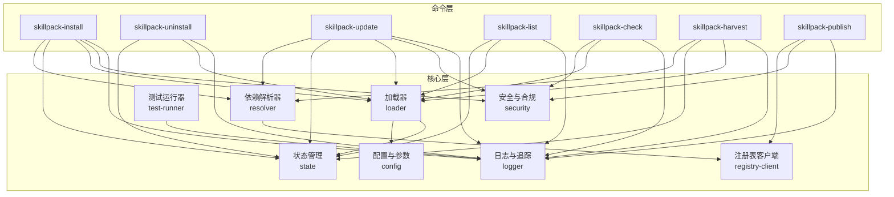
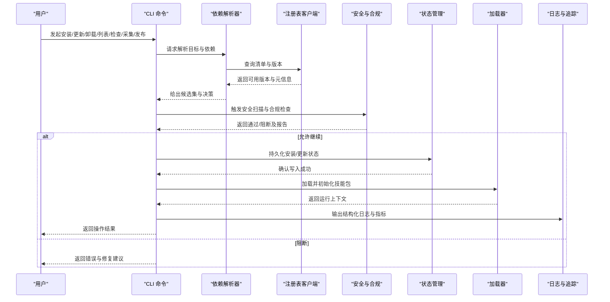
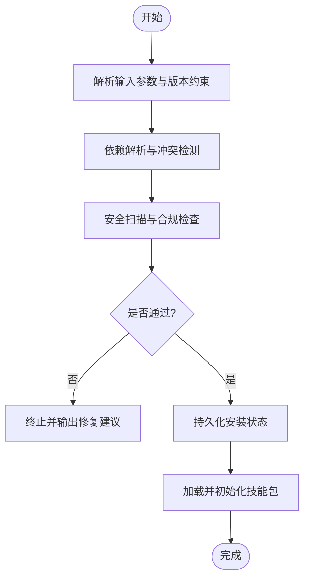
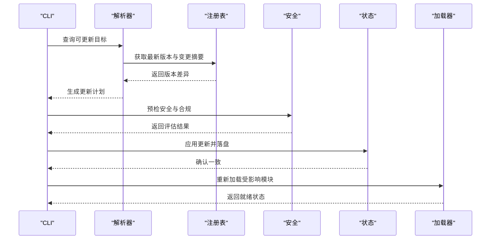
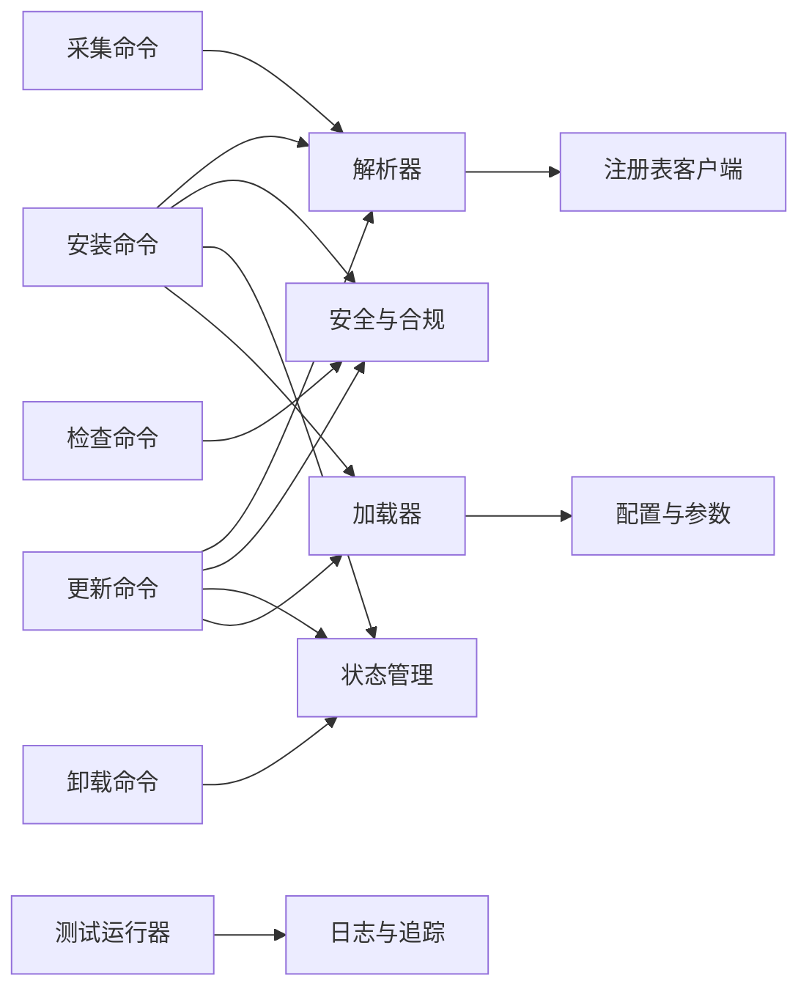

# 技能包操作

<cite>
**本文引用的文件**   
- [README.md](file://README.md)
- [docs/GBRAIN_SKILLPACK.md](file://docs/GBRAIN_SKILLPACK.md)
- [docs/skillpack-anatomy.md](file://docs/skillpack-anatomy.md)
- [examples/skillpack-reference/skillpack.json](file://examples/skillpack-reference/skillpack.json)
- [src/commands/skillpack-install.ts](file://src/commands/skillpack-install.ts)
- [src/commands/skillpack-uninstall.ts](file://src/commands/skillpack-uninstall.ts)
- [src/commands/skillpack-update.ts](file://src/commands/skillpack-update.ts)
- [src/commands/skillpack-list.ts](file://src/commands/skillpack-list.ts)
- [src/commands/skillpack-check.ts](file://src/commands/skillpack-check.ts)
- [src/commands/skillpack-harvest.ts](file://src/commands/skillpack-harvest.ts)
- [src/commands/skillpack-publish.ts](file://src/commands/skillpack-publish.ts)
- [src/core/skillpack/registry-client.ts](file://src/core/skillpack/registry-client.ts)
- [src/core/skillpack/resolver.ts](file://src/core/skillpack/resolver.ts)
- [src/core/skillpack/state.ts](file://src/core/skillpack/state.ts)
- [src/core/skillpack/loader.ts](file://src/core/skillpack/loader.ts)
- [src/core/skillpack/config.ts](file://src/core/skillpack/config.ts)
- [src/core/skillpack/security.ts](file://src/core/skillpack/security.ts)
- [src/core/skillpack/test-runner.ts](file://src/core/skillpack/test-runner.ts)
- [src/core/skillpack/logger.ts](file://src/core/skillpack/logger.ts)
</cite>

## 目录
1. [简介](#简介)
2. [项目结构](#项目结构)
3. [核心组件](#核心组件)
4. [架构总览](#架构总览)
5. [详细组件分析](#详细组件分析)
6. [依赖关系分析](#依赖关系分析)
7. [性能考虑](#性能考虑)
8. [故障排查指南](#故障排查指南)
9. [结论](#结论)
10. [附录](#附录)

## 简介
本文件面向“技能包”（Skillpack）的完整生命周期管理，覆盖安装、卸载、更新与版本管理；技能包的发现、注册与依赖解析；配置管理与参数设置、环境变量注入；测试、调试与日志查看；发布、分发与仓库管理；权限控制、安全扫描与合规检查；并提供端到端的开发工作流示例。文档以仓库现有实现为依据，结合命令层与核心库的职责划分进行说明。

## 项目结构
围绕技能包能力，代码组织分为两层：
- 命令层：提供 CLI 入口，负责参数解析、用户交互与流程编排
- 核心层：封装技能包发现、解析、加载、状态、配置、安全、测试与日志等通用能力

图表来源
- [src/commands/skillpack-install.ts](file://src/commands/skillpack-install.ts)
- [src/commands/skillpack-uninstall.ts](file://src/commands/skillpack-uninstall.ts)
- [src/commands/skillpack-update.ts](file://src/commands/skillpack-update.ts)
- [src/commands/skillpack-list.ts](file://src/commands/skillpack-list.ts)
- [src/commands/skillpack-check.ts](file://src/commands/skillpack-check.ts)
- [src/commands/skillpack-harvest.ts](file://src/commands/skillpack-harvest.ts)
- [src/commands/skillpack-publish.ts](file://src/commands/skillpack-publish.ts)
- [src/core/skillpack/registry-client.ts](file://src/core/skillpack/registry-client.ts)
- [src/core/skillpack/resolver.ts](file://src/core/skillpack/resolver.ts)
- [src/core/skillpack/state.ts](file://src/core/skillpack/state.ts)
- [src/core/skillpack/loader.ts](file://src/core/skillpack/loader.ts)
- [src/core/skillpack/config.ts](file://src/core/skillpack/config.ts)
- [src/core/skillpack/security.ts](file://src/core/skillpack/security.ts)
- [src/core/skillpack/test-runner.ts](file://src/core/skillpack/test-runner.ts)
- [src/core/skillpack/logger.ts](file://src/core/skillpack/logger.ts)

章节来源
- [README.md](file://README.md)
- [docs/GBRAIN_SKILLPACK.md](file://docs/GBRAIN_SKILLPACK.md)
- [docs/skillpack-anatomy.md](file://docs/skillpack-anatomy.md)

## 核心组件
- 注册表客户端（Registry Client）
  - 职责：与远程仓库通信，执行清单拉取、版本查询、上传制品等操作
  - 关键点：支持多源、重试与错误分类
- 依赖解析器（Resolver）
  - 职责：基于清单与约束计算可安装的版本集合，处理冲突与环依赖检测
  - 关键点：版本选择策略、最小化变更、回滚友好
- 状态管理（State）
  - 职责：维护已安装技能包元数据、版本锚点、激活状态与迁移标记
  - 关键点：幂等写入、并发安全、快照与恢复
- 加载器（Loader）
  - 职责：按状态加载技能包资源，初始化运行时上下文
  - 关键点：按需加载、隔离边界、热重载支持
- 配置与参数（Config）
  - 职责：合并默认值、环境覆盖、用户配置与包内声明
  - 关键点：类型校验、敏感字段脱敏、键空间隔离
- 安全与合规（Security）
  - 职责：签名校验、漏洞扫描、策略检查、白名单/黑名单
  - 关键点：可插拔策略、审计记录、阻断式拦截
- 测试运行器（Test Runner）
  - 职责：执行单元/集成测试、收集覆盖率与产物
  - 关键点：并行度控制、超时与隔离、结果标准化
- 日志与追踪（Logger）
  - 职责：结构化输出、分级过滤、采样与导出
  - 关键点：链路 ID、上下文注入、脱敏

章节来源
- [src/core/skillpack/registry-client.ts](file://src/core/skillpack/registry-client.ts)
- [src/core/skillpack/resolver.ts](file://src/core/skillpack/resolver.ts)
- [src/core/skillpack/state.ts](file://src/core/skillpack/state.ts)
- [src/core/skillpack/loader.ts](file://src/core/skillpack/loader.ts)
- [src/core/skillpack/config.ts](file://src/core/skillpack/config.ts)
- [src/core/skillpack/security.ts](file://src/core/skillpack/security.ts)
- [src/core/skillpack/test-runner.ts](file://src/core/skillpack/test-runner.ts)
- [src/core/skillpack/logger.ts](file://src/core/skillpack/logger.ts)

## 架构总览
下图展示从 CLI 到核心层的调用路径与数据流向，体现“发现—解析—校验—安装/更新—加载—运行—观测”的闭环。

图表来源
- [src/commands/skillpack-install.ts](file://src/commands/skillpack-install.ts)
- [src/commands/skillpack-update.ts](file://src/commands/skillpack-update.ts)
- [src/commands/skillpack-uninstall.ts](file://src/commands/skillpack-uninstall.ts)
- [src/commands/skillpack-list.ts](file://src/commands/skillpack-list.ts)
- [src/commands/skillpack-check.ts](file://src/commands/skillpack-check.ts)
- [src/commands/skillpack-harvest.ts](file://src/commands/skillpack-harvest.ts)
- [src/commands/skillpack-publish.ts](file://src/commands/skillpack-publish.ts)
- [src/core/skillpack/resolver.ts](file://src/core/skillpack/resolver.ts)
- [src/core/skillpack/registry-client.ts](file://src/core/skillpack/registry-client.ts)
- [src/core/skillpack/security.ts](file://src/core/skillpack/security.ts)
- [src/core/skillpack/state.ts](file://src/core/skillpack/state.ts)
- [src/core/skillpack/loader.ts](file://src/core/skillpack/loader.ts)
- [src/core/skillpack/logger.ts](file://src/core/skillpack/logger.ts)

## 详细组件分析

### 安装（Install）
- 功能要点
  - 解析目标包名与版本约束
  - 拉取清单与依赖图，计算最优安装集
  - 执行安全扫描与合规检查
  - 持久化状态并加载资源
- 关键流程

图表来源
- [src/commands/skillpack-install.ts](file://src/commands/skillpack-install.ts)
- [src/core/skillpack/resolver.ts](file://src/core/skillpack/resolver.ts)
- [src/core/skillpack/security.ts](file://src/core/skillpack/security.ts)
- [src/core/skillpack/state.ts](file://src/core/skillpack/state.ts)
- [src/core/skillpack/loader.ts](file://src/core/skillpack/loader.ts)

章节来源
- [src/commands/skillpack-install.ts](file://src/commands/skillpack-install.ts)
- [src/core/skillpack/resolver.ts](file://src/core/skillpack/resolver.ts)
- [src/core/skillpack/security.ts](file://src/core/skillpack/security.ts)
- [src/core/skillpack/state.ts](file://src/core/skillpack/state.ts)
- [src/core/skillpack/loader.ts](file://src/core/skillpack/loader.ts)

### 卸载（Uninstall）
- 功能要点
  - 根据名称或标识定位已安装包
  - 清理状态与资源引用，保留必要审计痕迹
  - 可选级联卸载受控依赖
- 注意事项
  - 避免破坏其他包的共享依赖
  - 失败时保持幂等与可恢复

章节来源
- [src/commands/skillpack-uninstall.ts](file://src/commands/skillpack-uninstall.ts)
- [src/core/skillpack/state.ts](file://src/core/skillpack/state.ts)
- [src/core/skillpack/loader.ts](file://src/core/skillpack/loader.ts)

### 更新（Update）
- 功能要点
  - 对比当前版本与仓库最新满足约束的版本
  - 增量更新或全量替换策略
  - 回滚与一致性校验
- 关键流程

图表来源
- [src/commands/skillpack-update.ts](file://src/commands/skillpack-update.ts)
- [src/core/skillpack/resolver.ts](file://src/core/skillpack/resolver.ts)
- [src/core/skillpack/registry-client.ts](file://src/core/skillpack/registry-client.ts)
- [src/core/skillpack/security.ts](file://src/core/skillpack/security.ts)
- [src/core/skillpack/state.ts](file://src/core/skillpack/state.ts)
- [src/core/skillpack/loader.ts](file://src/core/skillpack/loader.ts)

章节来源
- [src/commands/skillpack-update.ts](file://src/commands/skillpack-update.ts)
- [src/core/skillpack/resolver.ts](file://src/core/skillpack/resolver.ts)
- [src/core/skillpack/registry-client.ts](file://src/core/skillpack/registry-client.ts)
- [src/core/skillpack/security.ts](file://src/core/skillpack/security.ts)
- [src/core/skillpack/state.ts](file://src/core/skillpack/state.ts)
- [src/core/skillpack/loader.ts](file://src/core/skillpack/loader.ts)

### 版本管理（List/Inspect）
- 功能要点
  - 列出本地已安装与全局可用版本
  - 显示版本锚点、来源、依赖树与健康状态
- 典型用法
  - 快速定位不兼容升级风险
  - 辅助回滚与灰度策略制定

章节来源
- [src/commands/skillpack-list.ts](file://src/commands/skillpack-list.ts)
- [src/core/skillpack/state.ts](file://src/core/skillpack/state.ts)
- [src/core/skillpack/loader.ts](file://src/core/skillpack/loader.ts)

### 检查（Check）
- 功能要点
  - 对本地技能包进行静态检查、依赖健康度与合规性验证
  - 输出问题清单与修复指引
- 适用场景
  - CI 门禁、发布前自检、日常巡检

章节来源
- [src/commands/skillpack-check.ts](file://src/commands/skillpack-check.ts)
- [src/core/skillpack/security.ts](file://src/core/skillpack/security.ts)
- [src/core/skillpack/loader.ts](file://src/core/skillpack/loader.ts)

### 采集（Harvest）
- 功能要点
  - 从指定源自动发现并拉取技能包清单
  - 构建本地索引，便于后续解析与检索
- 注意
  - 支持增量同步与去重
  - 可配置信任域与过滤规则

章节来源
- [src/commands/skillpack-harvest.ts](file://src/commands/skillpack-harvest.ts)
- [src/core/skillpack/resolver.ts](file://src/core/skillpack/resolver.ts)
- [src/core/skillpack/registry-client.ts](file://src/core/skillpack/registry-client.ts)

### 发布（Publish）
- 功能要点
  - 打包制品、签名与上传至仓库
  - 生成发布说明与变更摘要
  - 触发下游索引刷新
- 安全要求
  - 强制签名校验与完整性校验
  - 可选二次扫描与审批流

章节来源
- [src/commands/skillpack-publish.ts](file://src/commands/skillpack-publish.ts)
- [src/core/skillpack/registry-client.ts](file://src/core/skillpack/registry-client.ts)
- [src/core/skillpack/security.ts](file://src/core/skillpack/security.ts)

### 配置管理、参数与环境变量
- 配置来源优先级（由低到高）
  - 包内默认配置
  - 用户/系统配置文件
  - 命令行参数
  - 环境变量
- 特性
  - 类型校验与缺省值填充
  - 敏感字段脱敏与审计
  - 命名空间隔离，避免键冲突
- 参考
  - 清单中的配置项声明与校验规则

章节来源
- [src/core/skillpack/config.ts](file://src/core/skillpack/config.ts)
- [docs/GBRAIN_SKILLPACK.md](file://docs/GBRAIN_SKILLPACK.md)
- [examples/skillpack-reference/skillpack.json](file://examples/skillpack-reference/skillpack.json)

### 测试、调试与日志
- 测试
  - 运行包内测试套件，支持并行与隔离
  - 产出覆盖率与测试结果归档
- 调试
  - 开启详细日志与链路追踪
  - 断点与慢路径诊断
- 日志
  - 结构化输出、分级过滤、采样与导出
  - 统一上下文（如请求 ID、包名、版本）

章节来源
- [src/core/skillpack/test-runner.ts](file://src/core/skillpack/test-runner.ts)
- [src/core/skillpack/logger.ts](file://src/core/skillpack/logger.ts)

### 权限控制、安全扫描与合规检查
- 权限控制
  - 基于角色/作用域的访问控制
  - 操作审计与不可抵赖记录
- 安全扫描
  - 依赖漏洞扫描、许可证合规、恶意模式检测
  - 策略引擎驱动的可插拔检查
- 合规检查
  - 企业策略（如网络、存储、加密）强校验
  - 阻断式拦截与告警上报

章节来源
- [src/core/skillpack/security.ts](file://src/core/skillpack/security.ts)

### 依赖解析机制
- 解析流程
  - 读取清单与约束，构建依赖图
  - 版本选择策略（语义化版本、锁定文件、最小变更）
  - 冲突检测与解决（提升/降级/分支）
  - 环依赖检测与提示
- 优化
  - 缓存解析结果
  - 增量更新时的局部重算

章节来源
- [src/core/skillpack/resolver.ts](file://src/core/skillpack/resolver.ts)
- [docs/GBRAIN_SKILLPACK.md](file://docs/GBRAIN_SKILLPACK.md)

### 技能包清单与结构
- 清单关键字段
  - 名称、版本、描述、作者与许可证
  - 依赖声明、配置项定义、入口与钩子
  - 安全标签、合规标签与测试开关
- 目录结构
  - 源码、测试、文档、资源与脚本
- 参考示例
  - 参考清单样例与最佳实践

章节来源
- [docs/GBRAIN_SKILLPACK.md](file://docs/GBRAIN_SKILLPACK.md)
- [docs/skillpack-anatomy.md](file://docs/skillpack-anatomy.md)
- [examples/skillpack-reference/skillpack.json](file://examples/skillpack-reference/skillpack.json)

### 端到端开发工作流示例
- 步骤概览
  - 初始化与脚手架
  - 编写技能与清单
  - 本地测试与检查
  - 构建与签名
  - 发布到仓库
  - 安装与验证
  - 迭代更新与回滚
- 关键命令
  - 初始化、检查、测试、发布、安装、更新、卸载、列表
- 质量门禁
  - 静态检查、安全扫描、合规校验、回归测试

章节来源
- [src/commands/skillpack-init-pack.ts](file://src/commands/skillpack-init-pack.ts)
- [src/commands/skillpack-check.ts](file://src/commands/skillpack-check.ts)
- [src/core/skillpack/test-runner.ts](file://src/core/skillpack/test-runner.ts)
- [src/commands/skillpack-publish.ts](file://src/commands/skillpack-publish.ts)
- [src/commands/skillpack-install.ts](file://src/commands/skillpack-install.ts)
- [src/commands/skillpack-update.ts](file://src/commands/skillpack-update.ts)
- [src/commands/skillpack-uninstall.ts](file://src/commands/skillpack-uninstall.ts)
- [src/commands/skillpack-list.ts](file://src/commands/skillpack-list.ts)

## 依赖关系分析
- 组件耦合
  - 命令层仅依赖核心层接口，保持高内聚低耦合
  - 解析器与注册表客户端解耦，支持多后端
- 外部依赖
  - 注册表服务、签名与扫描服务、CI/CD 流水线
- 潜在风险
  - 循环依赖需通过分层与接口抽象规避
  - 大依赖图解析耗时，需引入缓存与增量算法

图表来源
- [src/commands/skillpack-install.ts](file://src/commands/skillpack-install.ts)
- [src/commands/skillpack-update.ts](file://src/commands/skillpack-update.ts)
- [src/commands/skillpack-uninstall.ts](file://src/commands/skillpack-uninstall.ts)
- [src/commands/skillpack-list.ts](file://src/commands/skillpack-list.ts)
- [src/commands/skillpack-check.ts](file://src/commands/skillpack-check.ts)
- [src/commands/skillpack-harvest.ts](file://src/commands/skillpack-harvest.ts)
- [src/commands/skillpack-publish.ts](file://src/commands/skillpack-publish.ts)
- [src/core/skillpack/resolver.ts](file://src/core/skillpack/resolver.ts)
- [src/core/skillpack/registry-client.ts](file://src/core/skillpack/registry-client.ts)
- [src/core/skillpack/security.ts](file://src/core/skillpack/security.ts)
- [src/core/skillpack/state.ts](file://src/core/skillpack/state.ts)
- [src/core/skillpack/loader.ts](file://src/core/skillpack/loader.ts)
- [src/core/skillpack/config.ts](file://src/core/skillpack/config.ts)
- [src/core/skillpack/test-runner.ts](file://src/core/skillpack/test-runner.ts)
- [src/core/skillpack/logger.ts](file://src/core/skillpack/logger.ts)

章节来源
- [src/core/skillpack/resolver.ts](file://src/core/skillpack/resolver.ts)
- [src/core/skillpack/registry-client.ts](file://src/core/skillpack/registry-client.ts)
- [src/core/skillpack/state.ts](file://src/core/skillpack/state.ts)
- [src/core/skillpack/loader.ts](file://src/core/skillpack/loader.ts)
- [src/core/skillpack/config.ts](file://src/core/skillpack/config.ts)
- [src/core/skillpack/security.ts](file://src/core/skillpack/security.ts)
- [src/core/skillpack/test-runner.ts](file://src/core/skillpack/test-runner.ts)
- [src/core/skillpack/logger.ts](file://src/core/skillpack/logger.ts)

## 性能考虑
- 解析与加载
  - 使用增量解析与缓存命中减少重复计算
  - 懒加载与按需初始化降低冷启动开销
- I/O 与网络
  - 并发下载与连接池复用
  - 断点续传与重试退避
- 存储与状态
  - 原子写入与事务保障一致性
  - 定期压缩与清理无用快照
- 观测与调优
  - 关键路径埋点与指标上报
  - 热点依赖识别与预取

[本节为通用指导，无需具体文件来源]

## 故障排查指南
- 常见问题
  - 依赖冲突：查看冲突节点与推荐解决方案
  - 安全阻断：依据扫描报告修复漏洞或调整策略
  - 加载失败：核对清单与入口、检查环境变量与权限
  - 网络异常：检查代理、证书与仓库可达性
- 诊断手段
  - 启用详细日志与链路追踪
  - 导出状态快照与依赖图
  - 使用检查命令定位静态问题
- 恢复策略
  - 回滚到上一稳定版本
  - 清理损坏状态后重试
  - 隔离问题包并逐步恢复

章节来源
- [src/core/skillpack/security.ts](file://src/core/skillpack/security.ts)
- [src/core/skillpack/state.ts](file://src/core/skillpack/state.ts)
- [src/core/skillpack/loader.ts](file://src/core/skillpack/loader.ts)
- [src/core/skillpack/logger.ts](file://src/core/skillpack/logger.ts)

## 结论
本方案将技能包的生命周期管理拆分为清晰的命令层与核心层，围绕“发现—解析—校验—安装/更新—加载—运行—观测”形成闭环。通过可插拔的安全与合规策略、完善的配置与环境变量体系、以及健壮的测试与日志能力，确保技能包在复杂环境中仍可被高效、安全地开发与运维。

[本节为总结性内容，无需具体文件来源]

## 附录
- 清单与结构参考
  - 清单字段规范与示例
  - 目录结构与约定
- 常用命令速查
  - 安装、卸载、更新、列表、检查、采集、发布
- 最佳实践
  - 版本策略与变更说明
  - 安全与合规基线
  - 测试与质量门禁

章节来源
- [docs/GBRAIN_SKILLPACK.md](file://docs/GBRAIN_SKILLPACK.md)
- [docs/skillpack-anatomy.md](file://docs/skillpack-anatomy.md)
- [examples/skillpack-reference/skillpack.json](file://examples/skillpack-reference/skillpack.json)