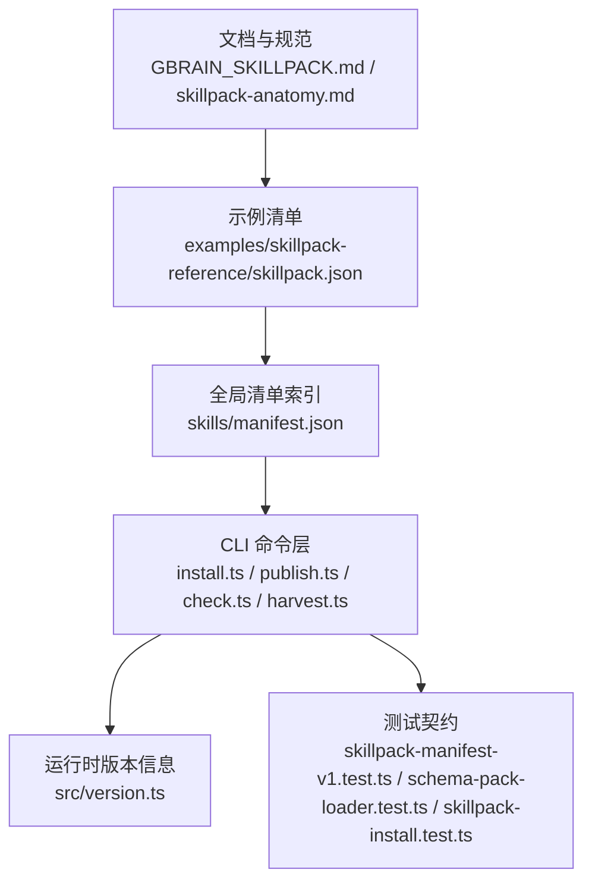
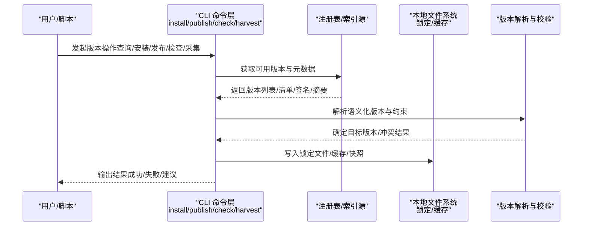
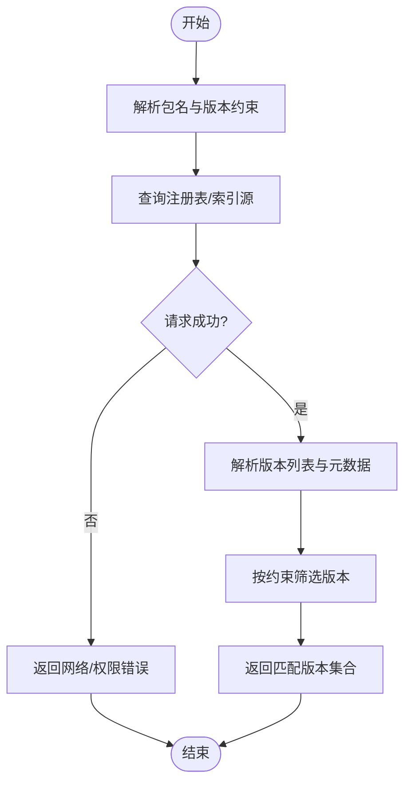
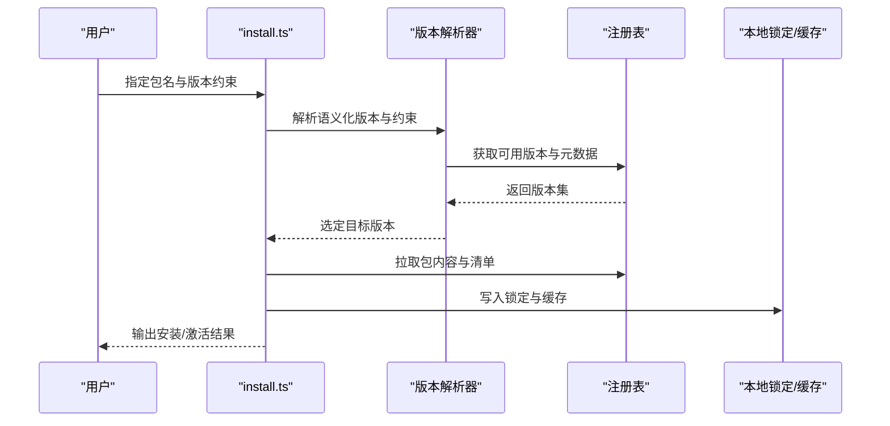
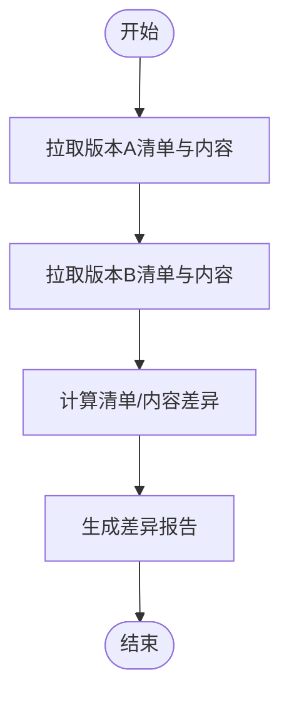
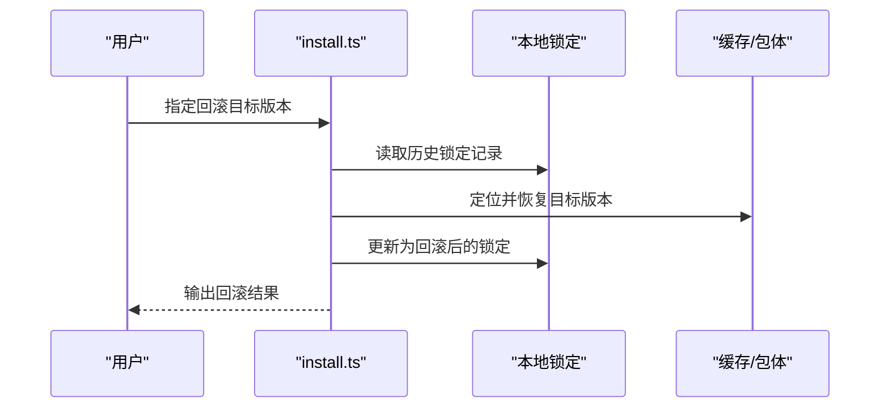
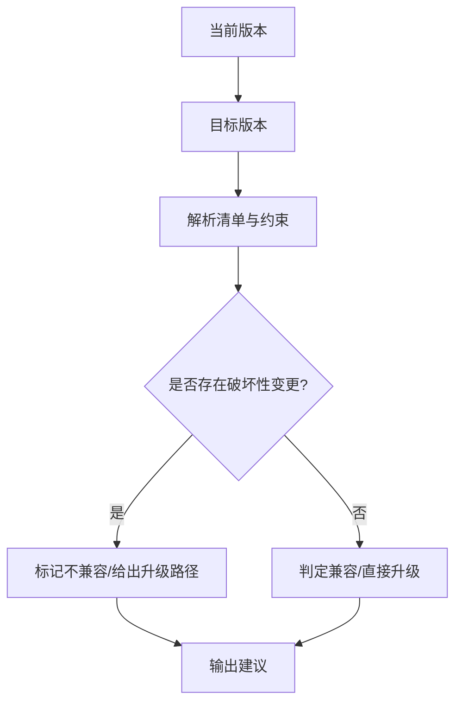
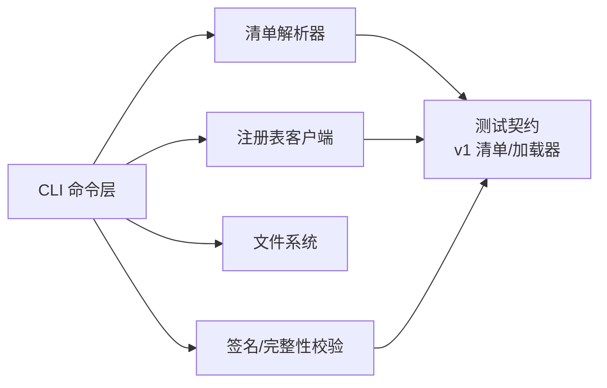

# 版本管理

<cite>
**本文引用的文件**   
- [README.md](file://README.md)
- [GBRAIN_SKILLPACK.md](file://docs/GBRAIN_SKILLPACK.md)
- [skillpack-anatomy.md](file://docs/skillpack-anatomy.md)
- [RELEASING.md](file://docs/RELEASING.md)
- [UPGRADING_DOWNSTREAM_AGENTS.md](file://docs/UPGRADING_DOWNSTREAM_AGENTS.md)
- [manifest.json](file://skills/manifest.json)
- [skillpack.json](file://examples/skillpack-reference/skillpack.json)
- [version.ts](file://src/version.ts)
- [install.ts](file://src/commands/install.ts)
- [publish.ts](file://src/commands/publish.ts)
- [check.ts](file://src/commands/check.ts)
- [harvest.ts](file://src/commands/harvest.ts)
- [schema-pack-loader.test.ts](file://test/schema-pack-loader.test.ts)
- [skillpack-manifest-v1.test.ts](file://test/skillpack-manifest-v1.test.ts)
- [skillpack-install.test.ts](file://test/skillpack-install.test.ts)
- [skillpack-check.test.ts](file://test/skillpack-check.test.ts)
- [skillpack-harvest-lint.test.ts](file://test/skillpack-harvest-lint.test.ts)
- [self-upgrade.test.ts](file://test/self-upgrade.test.ts)
- [upgrade.serial.test.ts](file://test/upgrade.serial.test.ts)
</cite>

## 目录
1. [简介](#简介)
2. [项目结构](#项目结构)
3. [核心组件](#核心组件)
4. [架构总览](#架构总览)
5. [详细组件分析](#详细组件分析)
6. [依赖关系分析](#依赖关系分析)
7. [性能考虑](#性能考虑)
8. [故障排除指南](#故障排除指南)
9. [结论](#结论)
10. [附录](#附录)

## 简介
本文件面向“技能包版本管理”的 API 与流程，覆盖以下主题：
- 版本查询、切换与比较接口（CLI 命令与内部服务）
- 语义化版本控制规则、版本锁定与依赖版本约束
- 版本历史查看、差异对比与回滚操作
- 兼容性检查与升级路径规划
- 版本元数据管理、签名验证与完整性校验
- 多版本共存策略与隔离机制
- 最佳实践与常见问题排查

说明：
- 本文档以仓库中的文档与测试为依据，对现有能力进行系统化整理。若某些能力在代码中尚未实现，将以“概念性说明”呈现并标注来源边界。

## 项目结构
围绕版本管理的核心位置与职责如下：
- 规范与约定
  - 技能包规范与清单定义：[docs/GBRAIN_SKILLPACK.md](file://docs/GBRAIN_SKILLPACK.md)、[docs/skillpack-anatomy.md](file://docs/skillpack-anatomy.md)
  - 发布与升级指引：[docs/RELEASING.md](file://docs/RELEASING.md)、[docs/UPGRADING_DOWNSTREAM_AGENTS.md](file://docs/UPGRADING_DOWNSTREAM_AGENTS.md)
- 示例与参考
  - 示例技能包清单：[examples/skillpack-reference/skillpack.json](file://examples/skillpack-reference/skillpack.json)
  - 全局技能清单索引：[skills/manifest.json](file://skills/manifest.json)
- 运行时版本信息
  - 应用版本常量：[src/version.ts](file://src/version.ts)
- CLI 命令入口（安装、发布、检查、采集等）
  - 安装：[src/commands/install.ts](file://src/commands/install.ts)
  - 发布：[src/commands/publish.ts](file://src/commands/publish.ts)
  - 检查：[src/commands/check.ts](file://src/commands/check.ts)
  - 采集：[src/commands/harvest.ts](file://src/commands/harvest.ts)
- 关键测试用例（体现行为契约）
  - 清单 v1 格式与字段：[test/skillpack-manifest-v1.test.ts](file://test/skillpack-manifest-v1.test.ts)
  - 加载器与注册表交互：[test/schema-pack-loader.test.ts](file://test/schema-pack-loader.test.ts)
  - 安装与版本解析：[test/skillpack-install.test.ts](file://test/skillpack-install.test.ts)
  - 检查与合规：[test/skillpack-check.test.ts](file://test/skillpack-check.test.ts)
  - 采集与 Lint：[test/skillpack-harvest-lint.test.ts](file://test/skillpack-harvest-lint.test.ts)
  - 自升级与升级序列：[test/self-upgrade.test.ts](file://test/self-upgrade.test.ts)、[test/upgrade.serial.test.ts](file://test/upgrade.serial.test.ts)

**图示来源**
- [GBRAIN_SKILLPACK.md](file://docs/GBRAIN_SKILLPACK.md)
- [skillpack-anatomy.md](file://docs/skillpack-anatomy.md)
- [skillpack.json](file://examples/skillpack-reference/skillpack.json)
- [manifest.json](file://skills/manifest.json)
- [install.ts](file://src/commands/install.ts)
- [publish.ts](file://src/commands/publish.ts)
- [check.ts](file://src/commands/check.ts)
- [harvest.ts](file://src/commands/harvest.ts)
- [version.ts](file://src/version.ts)
- [skillpack-manifest-v1.test.ts](file://test/skillpack-manifest-v1.test.ts)
- [schema-pack-loader.test.ts](file://test/schema-pack-loader.test.ts)
- [skillpack-install.test.ts](file://test/skillpack-install.test.ts)

**章节来源**
- [README.md](file://README.md)
- [GBRAIN_SKILLPACK.md](file://docs/GBRAIN_SKILLPACK.md)
- [skillpack-anatomy.md](file://docs/skillpack-anatomy.md)
- [RELEASING.md](file://docs/RELEASING.md)
- [UPGRADING_DOWNSTREAM_AGENTS.md](file://docs/UPGRADING_DOWNSTREAM_AGENTS.md)
- [manifest.json](file://skills/manifest.json)
- [skillpack.json](file://examples/skillpack-reference/skillpack.json)
- [version.ts](file://src/version.ts)
- [install.ts](file://src/commands/install.ts)
- [publish.ts](file://src/commands/publish.ts)
- [check.ts](file://src/commands/check.ts)
- [harvest.ts](file://src/commands/harvest.ts)
- [schema-pack-loader.test.ts](file://test/schema-pack-loader.test.ts)
- [skillpack-manifest-v1.test.ts](file://test/skillpack-manifest-v1.test.ts)
- [skillpack-install.test.ts](file://test/skillpack-install.test.ts)
- [skillpack-check.test.ts](file://test/skillpack-check.test.ts)
- [skillpack-harvest-lint.test.ts](file://test/skillpack-harvest-lint.test.ts)
- [self-upgrade.test.ts](file://test/self-upgrade.test.ts)
- [upgrade.serial.test.ts](file://test/upgrade.serial.test.ts)

## 核心组件
- 清单模型与语义化版本
  - 清单字段与版本约束由清单 v1 测试与规范文档共同定义；语义化版本用于表达主/次/补丁变更与兼容范围。
- 安装与解析
  - 安装命令负责解析依赖、选择目标版本、拉取与落盘，并在本地维护锁定状态。
- 发布与索引
  - 发布命令将构建产物与清单提交至远端或索引源，供后续安装与查询使用。
- 检查与采集
  - 检查命令执行清单校验、依赖一致性、合规性扫描；采集命令用于收集元数据与差异信息。
- 版本信息与升级
  - 运行时版本常量用于自检与提示；升级相关测试覆盖自升级与序列升级场景。

**章节来源**
- [GBRAIN_SKILLPACK.md](file://docs/GBRAIN_SKILLPACK.md)
- [skillpack-anatomy.md](file://docs/skillpack-anatomy.md)
- [skillpack-manifest-v1.test.ts](file://test/skillpack-manifest-v1.test.ts)
- [install.ts](file://src/commands/install.ts)
- [publish.ts](file://src/commands/publish.ts)
- [check.ts](file://src/commands/check.ts)
- [harvest.ts](file://src/commands/harvest.ts)
- [version.ts](file://src/version.ts)
- [self-upgrade.test.ts](file://test/self-upgrade.test.ts)
- [upgrade.serial.test.ts](file://test/upgrade.serial.test.ts)

## 架构总览
从调用方到存储/索引的整体流程如下：

**图示来源**
- [install.ts](file://src/commands/install.ts)
- [publish.ts](file://src/commands/publish.ts)
- [check.ts](file://src/commands/check.ts)
- [harvest.ts](file://src/commands/harvest.ts)
- [schema-pack-loader.test.ts](file://test/schema-pack-loader.test.ts)
- [skillpack-manifest-v1.test.ts](file://test/skillpack-manifest-v1.test.ts)

## 详细组件分析

### 版本查询接口（CLI 与服务侧）
- 能力概述
  - 列出某技能包的所有可用版本
  - 按语义化版本过滤（如主/次/补丁区间）
  - 返回版本元数据（描述、发布时间、变更摘要、签名/摘要等）
- 典型调用路径
  - 通过安装命令的“只查询”模式或专用查询子命令（若存在）访问
  - 内部由注册表客户端与清单解析器协作完成
- 输入/输出要点
  - 输入：包名、可选的版本约束表达式
  - 输出：版本列表及对应元数据
- 错误处理
  - 网络不可用、索引不可达、版本不满足约束、清单格式异常等

**图示来源**
- [install.ts](file://src/commands/install.ts)
- [schema-pack-loader.test.ts](file://test/schema-pack-loader.test.ts)
- [skillpack-manifest-v1.test.ts](file://test/skillpack-manifest-v1.test.ts)

**章节来源**
- [install.ts](file://src/commands/install.ts)
- [schema-pack-loader.test.ts](file://test/schema-pack-loader.test.ts)
- [skillpack-manifest-v1.test.ts](file://test/skillpack-manifest-v1.test.ts)

### 版本切换接口（安装/锁定/激活）
- 能力概述
  - 根据约束选择目标版本并安装
  - 生成/更新本地锁定文件，确保可复现环境
  - 支持在同一环境中多版本并存，按需激活
- 典型调用路径
  - 安装命令解析约束 -> 下载/解压 -> 写入锁定 -> 激活当前版本
- 输入/输出要点
  - 输入：包名、版本约束、是否强制覆盖锁定
  - 输出：安装结果、锁定快照、激活状态
- 错误处理
  - 版本不存在、依赖冲突、签名/完整性校验失败、磁盘空间不足等

**图示来源**
- [install.ts](file://src/commands/install.ts)
- [schema-pack-loader.test.ts](file://test/schema-pack-loader.test.ts)
- [skillpack-manifest-v1.test.ts](file://test/skillpack-manifest-v1.test.ts)

**章节来源**
- [install.ts](file://src/commands/install.ts)
- [schema-pack-loader.test.ts](file://test/schema-pack-loader.test.ts)
- [skillpack-manifest-v1.test.ts](file://test/skillpack-manifest-v1.test.ts)

### 版本比较接口（差异对比）
- 能力概述
  - 对比两个版本的清单与内容差异
  - 输出破坏性变更、新增/删除项、元数据变化
- 典型调用路径
  - 通过采集/检查命令触发，或作为安装前预检的一部分
- 输入/输出要点
  - 输入：包名、待比较的两个版本标识
  - 输出：差异报告（结构化/可读文本）
- 错误处理
  - 版本不存在、无法拉取差异、清单格式不一致等

**图示来源**
- [harvest.ts](file://src/commands/harvest.ts)
- [check.ts](file://src/commands/check.ts)
- [skillpack-manifest-v1.test.ts](file://test/skillpack-manifest-v1.test.ts)

**章节来源**
- [harvest.ts](file://src/commands/harvest.ts)
- [check.ts](file://src/commands/check.ts)
- [skillpack-manifest-v1.test.ts](file://test/skillpack-manifest-v1.test.ts)

### 版本历史查看接口
- 能力概述
  - 列出某包的版本时间线，包含发布说明与变更摘要
- 典型调用路径
  - 通过查询接口扩展“历史视图”，或由采集命令聚合
- 输入/输出要点
  - 输入：包名、分页/排序参数
  - 输出：版本历史条目集合
- 错误处理
  - 索引不可用、分页越界、条目缺失等

**章节来源**
- [install.ts](file://src/commands/install.ts)
- [harvest.ts](file://src/commands/harvest.ts)
- [schema-pack-loader.test.ts](file://test/schema-pack-loader.test.ts)

### 回滚操作接口
- 能力概述
  - 基于本地锁定快照回滚到指定历史版本
  - 保证回滚后环境与锁定一致
- 典型调用路径
  - 安装命令的回滚模式或专用回滚子命令（若存在）
- 输入/输出要点
  - 输入：包名、目标历史版本
  - 输出：回滚结果、新的锁定快照
- 错误处理
  - 目标版本不在本地缓存、锁定文件损坏、依赖不满足等

**图示来源**
- [install.ts](file://src/commands/install.ts)
- [schema-pack-loader.test.ts](file://test/schema-pack-loader.test.ts)

**章节来源**
- [install.ts](file://src/commands/install.ts)
- [schema-pack-loader.test.ts](file://test/schema-pack-loader.test.ts)

### 兼容性检查与升级路径规划
- 能力概述
  - 基于语义化版本与清单约束，判断跨版本升级是否兼容
  - 提供最小升级路径（如仅允许小版本/大版本步进）
- 典型调用路径
  - 检查命令在执行升级前进行兼容性评估
  - 发布/安装流程中集成约束校验
- 输入/输出要点
  - 输入：当前版本、目标版本、依赖约束
  - 输出：兼容性结论与建议路径
- 错误处理
  - 约束冲突、破坏性变更未声明、依赖链断裂等

**图示来源**
- [check.ts](file://src/commands/check.ts)
- [UPGRADING_DOWNSTREAM_AGENTS.md](file://docs/UPGRADING_DOWNSTREAM_AGENTS.md)
- [skillpack-manifest-v1.test.ts](file://test/skillpack-manifest-v1.test.ts)

**章节来源**
- [check.ts](file://src/commands/check.ts)
- [UPGRADING_DOWNSTREAM_AGENTS.md](file://docs/UPGRADING_DOWNSTREAM_AGENTS.md)
- [skillpack-manifest-v1.test.ts](file://test/skillpack-manifest-v1.test.ts)

### 版本元数据管理
- 能力概述
  - 清单中包含版本号、描述、作者、许可证、依赖、变更日志等元数据
  - 发布时校验元数据完整性与一致性
- 典型调用路径
  - 发布命令打包清单与资源；检查命令校验清单字段
- 输入/输出要点
  - 输入：清单文件、附加元数据
  - 输出：校验结果、发布产物
- 错误处理
  - 必填字段缺失、类型不符、依赖引用无效等

**章节来源**
- [GBRAIN_SKILLPACK.md](file://docs/GBRAIN_SKILLPACK.md)
- [skillpack-anatomy.md](file://docs/skillpack-anatomy.md)
- [publish.ts](file://src/commands/publish.ts)
- [check.ts](file://src/commands/check.ts)
- [skillpack-manifest-v1.test.ts](file://test/skillpack-manifest-v1.test.ts)

### 签名验证与完整性检查
- 能力概述
  - 对清单与包体进行签名与摘要校验，确保来源可信与内容完整
- 典型调用路径
  - 安装/发布/检查流程中嵌入签名与摘要校验步骤
- 输入/输出要点
  - 输入：签名文件、摘要值、公钥/信任根
  - 输出：校验结果（通过/失败）
- 错误处理
  - 签名不匹配、摘要不一致、证书过期、信任根缺失等

**章节来源**
- [publish.ts](file://src/commands/publish.ts)
- [check.ts](file://src/commands/check.ts)
- [install.ts](file://src/commands/install.ts)
- [skillpack-manifest-v1.test.ts](file://test/skillpack-manifest-v1.test.ts)

### 多版本共存与隔离机制
- 能力概述
  - 同一环境下可并行安装多个版本，通过命名空间/路径隔离
  - 锁定文件决定当前激活版本，避免相互影响
- 典型调用路径
  - 安装命令按包名+版本创建独立目录；激活命令切换软链接或环境变量
- 输入/输出要点
  - 输入：包名、目标版本、隔离策略
  - 输出：安装位置、激活状态
- 错误处理
  - 路径冲突、权限不足、依赖重复加载等

**章节来源**
- [install.ts](file://src/commands/install.ts)
- [schema-pack-loader.test.ts](file://test/schema-pack-loader.test.ts)

## 依赖关系分析
- 组件耦合
  - CLI 命令层依赖清单解析器、注册表客户端、文件系统与版本解析器
  - 测试用例定义了清单格式、加载器行为与安装流程的关键契约
- 外部依赖
  - 注册表/索引源、签名与摘要算法、文件系统
- 潜在循环依赖
  - 通过分层（CLI -> 解析/校验 -> 存储）降低耦合

**图示来源**
- [install.ts](file://src/commands/install.ts)
- [publish.ts](file://src/commands/publish.ts)
- [check.ts](file://src/commands/check.ts)
- [harvest.ts](file://src/commands/harvest.ts)
- [schema-pack-loader.test.ts](file://test/schema-pack-loader.test.ts)
- [skillpack-manifest-v1.test.ts](file://test/skillpack-manifest-v1.test.ts)

**章节来源**
- [install.ts](file://src/commands/install.ts)
- [publish.ts](file://src/commands/publish.ts)
- [check.ts](file://src/commands/check.ts)
- [harvest.ts](file://src/commands/harvest.ts)
- [schema-pack-loader.test.ts](file://test/schema-pack-loader.test.ts)
- [skillpack-manifest-v1.test.ts](file://test/skillpack-manifest-v1.test.ts)

## 性能考虑
- 缓存与增量拉取
  - 利用本地缓存减少重复下载；优先拉取差异与清单元数据
- 并发与限流
  - 批量安装/检查时合理设置并发度，避免注册表压力过大
- 锁粒度与持久化
  - 锁定文件读写尽量原子化，避免竞争导致的状态不一致
- 内存占用
  - 大清单与差异计算时采用流式处理与分块比对

## 故障排除指南
- 常见错误与定位
  - 网络/权限问题：确认注册表可达性与凭据
  - 版本不满足约束：调整约束表达式或选择兼容版本
  - 签名/完整性失败：核对公钥/信任根与摘要值
  - 锁定文件损坏：重建锁定或清理缓存后重试
- 诊断步骤
  - 启用更详细的日志输出
  - 先执行检查命令，再尝试安装/发布
  - 使用采集命令导出差异与元数据，辅助定位问题

**章节来源**
- [check.ts](file://src/commands/check.ts)
- [install.ts](file://src/commands/install.ts)
- [harvest.ts](file://src/commands/harvest.ts)
- [skillpack-check.test.ts](file://test/skillpack-check.test.ts)
- [skillpack-harvest-lint.test.ts](file://test/skillpack-harvest-lint.test.ts)

## 结论
本文件系统梳理了技能包版本管理的核心能力与流程，包括查询、切换、比较、历史、回滚、兼容性检查、元数据管理、签名与完整性校验、多版本共存与隔离。建议在工程实践中遵循语义化版本与清单规范，结合锁定与校验机制保障稳定性与可复现性。

## 附录
- 术语
  - 语义化版本：主/次/补丁三段式版本，表达兼容性与变更级别
  - 锁定文件：记录已安装版本与依赖快照，确保环境一致
  - 清单：描述技能包结构与元数据的配置文件
- 参考
  - 规范与解剖：[docs/GBRAIN_SKILLPACK.md](file://docs/GBRAIN_SKILLPACK.md)、[docs/skillpack-anatomy.md](file://docs/skillpack-anatomy.md)
  - 发布与升级：[docs/RELEASING.md](file://docs/RELEASING.md)、[docs/UPGRADING_DOWNSTREAM_AGENTS.md](file://docs/UPGRADING_DOWNSTREAM_AGENTS.md)
  - 示例清单：[examples/skillpack-reference/skillpack.json](file://examples/skillpack-reference/skillpack.json)
  - 全局清单索引：[skills/manifest.json](file://skills/manifest.json)
  - 版本常量：[src/version.ts](file://src/version.ts)
  - 命令入口：[src/commands/install.ts](file://src/commands/install.ts)、[src/commands/publish.ts](file://src/commands/publish.ts)、[src/commands/check.ts](file://src/commands/check.ts)、[src/commands/harvest.ts](file://src/commands/harvest.ts)
  - 测试契约：[test/skillpack-manifest-v1.test.ts](file://test/skillpack-manifest-v1.test.ts)、[test/schema-pack-loader.test.ts](file://test/schema-pack-loader.test.ts)、[test/skillpack-install.test.ts](file://test/skillpack-install.test.ts)、[test/skillpack-check.test.ts](file://test/skillpack-check.test.ts)、[test/skillpack-harvest-lint.test.ts](file://test/skillpack-harvest-lint.test.ts)、[test/self-upgrade.test.ts](file://test/self-upgrade.test.ts)、[test/upgrade.serial.test.ts](file://test/upgrade.serial.test.ts)