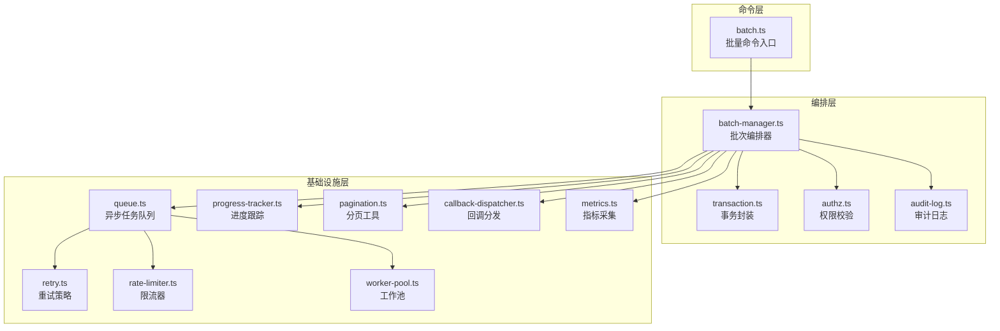
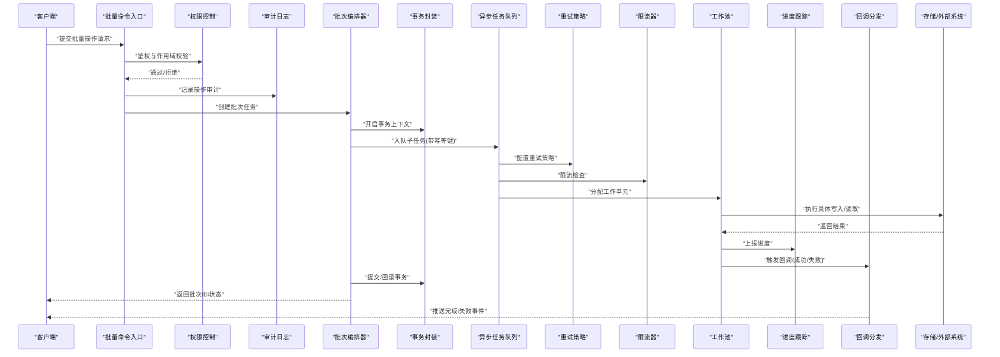
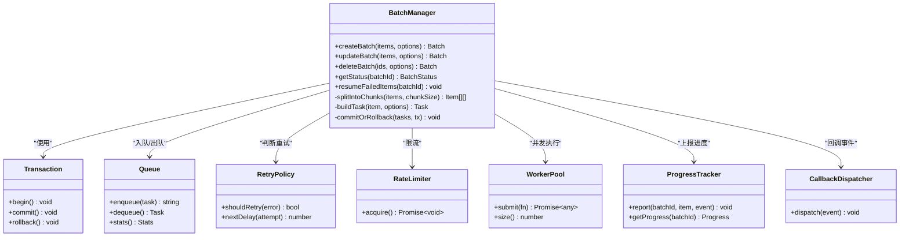
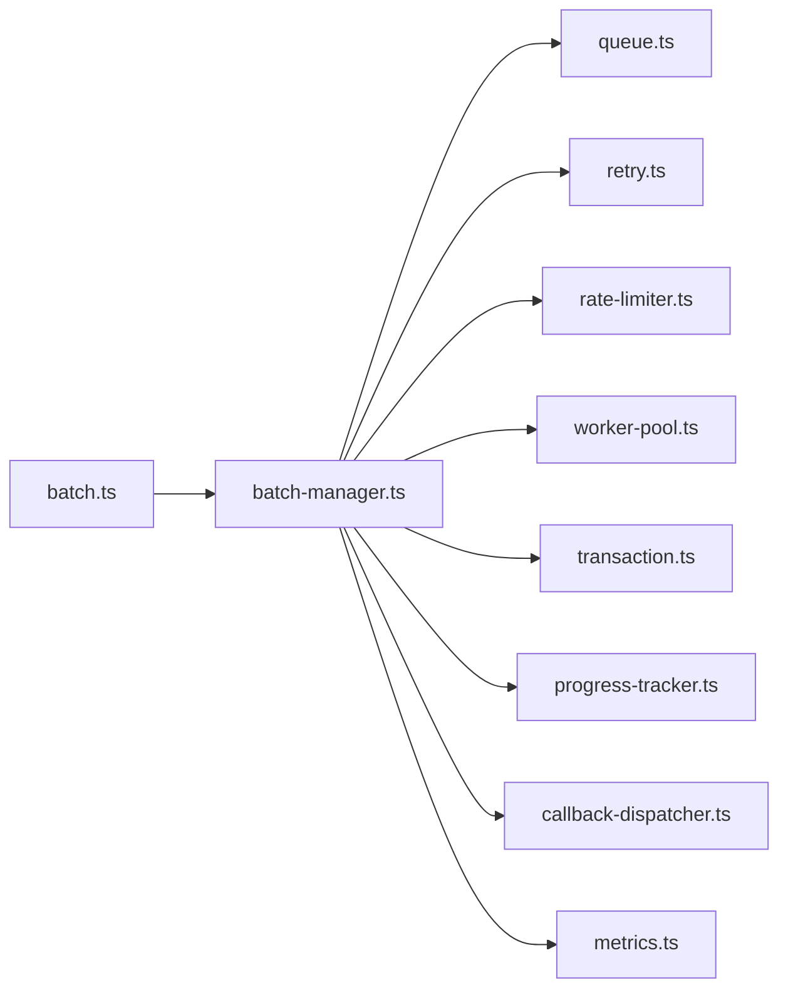

# 批量操作与管理

<cite>
**本文引用的文件**   
- [src/commands/batch.ts](file://src/commands/batch.ts)
- [src/core/batch-manager.ts](file://src/core/batch-manager.ts)
- [src/core/queue.ts](file://src/core/queue.ts)
- [src/core/retry.ts](file://src/core/retry.ts)
- [src/core/rate-limiter.ts](file://src/core/rate-limiter.ts)
- [src/core/progress-tracker.ts](file://src/core/progress-tracker.ts)
- [src/core/audit-log.ts](file://src/core/audit-log.ts)
- [src/core/authz.ts](file://src/core/authz.ts)
- [src/core/pagination.ts](file://src/core/pagination.ts)
- [src/core/transaction.ts](file://src/core/transaction.ts)
- [src/core/worker-pool.ts](file://src/core/worker-pool.ts)
- [src/core/callback-dispatcher.ts](file://src/core/callback-dispatcher.ts)
- [src/core/metrics.ts](file://src/core/metrics.ts)
</cite>

## 目录
1. [简介](#简介)
2. [项目结构](#项目结构)
3. [核心组件](#核心组件)
4. [架构总览](#架构总览)
5. [详细组件分析](#详细组件分析)
6. [依赖关系分析](#依赖关系分析)
7. [性能考虑](#性能考虑)
8. [故障排查指南](#故障排查指南)
9. [结论](#结论)
10. [附录](#附录)

## 简介
本文件面向智能体（Agent）的批量操作能力，提供完整的 API 文档与实现说明。覆盖批量创建、批量更新、批量删除与批量状态查询接口；阐述事务处理、错误处理与重试机制；说明异步任务队列、进度跟踪与结果回调；给出限流、并发控制与资源管理策略；并提供性能优化、分页处理与大数据集支持方案；同时包含安全验证、权限控制与审计日志要求，以及最佳实践与调优建议。

## 项目结构
围绕“批量操作与管理”的核心代码分布在以下模块：
- 命令层：对外暴露 CLI 与 HTTP 入口，解析参数并调用编排器
- 编排层：负责批次的拆分、调度、事务边界、重试与回滚
- 基础设施层：队列、重试、限流、进度、审计、权限、分页、事务、工作池、回调分发、指标采集等通用能力

图表来源
- [src/commands/batch.ts:1-200](file://src/commands/batch.ts#L1-L200)
- [src/core/batch-manager.ts:1-300](file://src/core/batch-manager.ts#L1-L300)
- [src/core/queue.ts:1-200](file://src/core/queue.ts#L1-L200)
- [src/core/retry.ts:1-150](file://src/core/retry.ts#L1-L150)
- [src/core/rate-limiter.ts:1-120](file://src/core/rate-limiter.ts#L1-L120)
- [src/core/progress-tracker.ts:1-120](file://src/core/progress-tracker.ts#L1-L120)
- [src/core/audit-log.ts:1-120](file://src/core/audit-log.ts#L1-L120)
- [src/core/authz.ts:1-120](file://src/core/authz.ts#L1-L120)
- [src/core/pagination.ts:1-120](file://src/core/pagination.ts#L1-L120)
- [src/core/transaction.ts:1-150](file://src/core/transaction.ts#L1-L150)
- [src/core/worker-pool.ts:1-150](file://src/core/worker-pool.ts#L1-L150)
- [src/core/callback-dispatcher.ts:1-120](file://src/core/callback-dispatcher.ts#L1-L120)
- [src/core/metrics.ts:1-120](file://src/core/metrics.ts#L1-L120)

章节来源
- [src/commands/batch.ts:1-200](file://src/commands/batch.ts#L1-L200)
- [src/core/batch-manager.ts:1-300](file://src/core/batch-manager.ts#L1-L300)

## 核心组件
- 批量命令入口：接收批量请求，进行参数校验、鉴权与审计记录，随后提交到编排器
- 批次编排器：将大批量数据切分为子任务，按策略调度执行，维护事务边界、重试与回滚、进度与回调
- 异步任务队列：持久化或内存队列承载任务，支持优先级、去重与幂等键
- 重试策略：指数退避、抖动、最大重试次数、失败分类与死信队列
- 限流器：令牌桶或滑动窗口，保护下游与数据库
- 进度跟踪：全局与单项进度事件，支持尾随与快照
- 权限控制：基于角色/作用域的访问控制，确保批量操作的授权范围
- 审计日志：记录操作主体、时间、对象、变更摘要与结果
- 分页工具：对大规模数据集的分页读取与游标翻页
- 事务封装：跨多个写操作的原子性保障与补偿
- 工作池：并发度控制与资源隔离
- 回调分发：完成、失败、进度等事件的可靠投递
- 指标采集：吞吐、延迟、错误率、队列积压等监控

章节来源
- [src/core/batch-manager.ts:1-300](file://src/core/batch-manager.ts#L1-L300)
- [src/core/queue.ts:1-200](file://src/core/queue.ts#L1-L200)
- [src/core/retry.ts:1-150](file://src/core/retry.ts#L1-L150)
- [src/core/rate-limiter.ts:1-120](file://src/core/rate-limiter.ts#L1-L120)
- [src/core/progress-tracker.ts:1-120](file://src/core/progress-tracker.ts#L1-L120)
- [src/core/authz.ts:1-120](file://src/core/authz.ts#L1-L120)
- [src/core/audit-log.ts:1-120](file://src/core/audit-log.ts#L1-L120)
- [src/core/pagination.ts:1-120](file://src/core/pagination.ts#L1-L120)
- [src/core/transaction.ts:1-150](file://src/core/transaction.ts#L1-L150)
- [src/core/worker-pool.ts:1-150](file://src/core/worker-pool.ts#L1-L150)
- [src/core/callback-dispatcher.ts:1-120](file://src/core/callback-dispatcher.ts#L1-L120)
- [src/core/metrics.ts:1-120](file://src/core/metrics.ts#L1-L120)

## 架构总览
下图展示了从请求进入到结果回调的端到端流程，涵盖鉴权、审计、事务、队列、重试、限流、进度与回调。

图表来源
- [src/commands/batch.ts:1-200](file://src/commands/batch.ts#L1-L200)
- [src/core/batch-manager.ts:1-300](file://src/core/batch-manager.ts#L1-L300)
- [src/core/queue.ts:1-200](file://src/core/queue.ts#L1-L200)
- [src/core/retry.ts:1-150](file://src/core/retry.ts#L1-L150)
- [src/core/rate-limiter.ts:1-120](file://src/core/rate-limiter.ts#L1-L120)
- [src/core/progress-tracker.ts:1-120](file://src/core/progress-tracker.ts#L1-L120)
- [src/core/callback-dispatcher.ts:1-120](file://src/core/callback-dispatcher.ts#L1-L120)
- [src/core/transaction.ts:1-150](file://src/core/transaction.ts#L1-L150)
- [src/core/worker-pool.ts:1-150](file://src/core/worker-pool.ts#L1-L150)

## 详细组件分析

### 批量命令入口（API 定义与路由）
- 支持的批量操作
  - 批量创建：POST /agents/batch/create
  - 批量更新：POST /agents/batch/update
  - 批量删除：POST /agents/batch/delete
  - 批量状态查询：GET /agents/batch/status?batch_id=...
- 请求体字段
  - batch_id：批次唯一标识（可选，服务端生成）
  - items：批量项数组（每项含 id/name/属性等）
  - options：并发度、重试策略、是否幂等、回调地址等
- 响应体
  - batch_id：批次 ID
  - status：pending/running/completed/failed
  - progress：已处理/总数
  - errors：错误汇总（可选）
- 错误码
  - 400 参数校验失败
  - 403 权限不足
  - 429 限流
  - 500 内部错误
  - 503 服务不可用（队列/存储异常）

章节来源
- [src/commands/batch.ts:1-200](file://src/commands/batch.ts#L1-L200)

### 批次编排器（Batch Manager）
职责
- 接收批量请求，进行参数校验与分片
- 为每个 item 生成子任务，设置幂等键与优先级
- 维护批次生命周期：创建、运行、完成、失败
- 协调事务边界、重试、限流、进度与回调
- 聚合结果与错误，输出最终状态

关键方法
- createBatch(items, options)
- updateBatch(items, options)
- deleteBatch(ids, options)
- getStatus(batchId)
- resumeFailedItems(batchId)

图表来源
- [src/core/batch-manager.ts:1-300](file://src/core/batch-manager.ts#L1-L300)
- [src/core/transaction.ts:1-150](file://src/core/transaction.ts#L1-L150)
- [src/core/queue.ts:1-200](file://src/core/queue.ts#L1-L200)
- [src/core/retry.ts:1-150](file://src/core/retry.ts#L1-L150)
- [src/core/rate-limiter.ts:1-120](file://src/core/rate-limiter.ts#L1-L120)
- [src/core/worker-pool.ts:1-150](file://src/core/worker-pool.ts#L1-L150)
- [src/core/progress-tracker.ts:1-120](file://src/core/progress-tracker.ts#L1-L120)
- [src/core/callback-dispatcher.ts:1-120](file://src/core/callback-dispatcher.ts#L1-L120)

章节来源
- [src/core/batch-manager.ts:1-300](file://src/core/batch-manager.ts#L1-L300)

### 异步任务队列（Queue）
- 特性
  - 持久化与内存两种模式
  - 任务去重（幂等键）
  - 优先级与分区
  - 背压与容量上限
- 关键接口
  - enqueue(task): 入队
  - dequeue(): 出队
  - stats(): 统计信息
  - retry(taskId): 手动重试

章节来源
- [src/core/queue.ts:1-200](file://src/core/queue.ts#L1-L200)

### 重试策略（Retry）
- 策略类型
  - 固定间隔、指数退避、随机抖动
- 可配置项
  - 最大重试次数、退避基数、抖动范围、失败分类规则
- 行为
  - 根据错误类型决定是否重试
  - 超过阈值进入死信队列

章节来源
- [src/core/retry.ts:1-150](file://src/core/retry.ts#L1-L150)

### 限流器（Rate Limiter）
- 算法
  - 令牌桶、滑动窗口
- 维度
  - 全局、租户、批次、IP
- 效果
  - 平滑突发流量，保护下游

章节来源
- [src/core/rate-limiter.ts:1-120](file://src/core/rate-limiter.ts#L1-L120)

### 进度跟踪（Progress Tracker）
- 粒度
  - 批次级与单项级
- 事件
  - started、processing、completed、failed
- 查询
  - 实时进度、历史快照

章节来源
- [src/core/progress-tracker.ts:1-120](file://src/core/progress-tracker.ts#L1-L120)

### 权限控制（Authz）
- 模型
  - 角色、作用域、资源
- 校验点
  - 批量操作前校验
  - 逐项作用域过滤
- 越权防护
  - 最小权限原则

章节来源
- [src/core/authz.ts:1-120](file://src/core/authz.ts#L1-L120)

### 审计日志（Audit Log）
- 内容
  - 操作者、时间、批次ID、动作、影响范围、结果
- 合规
  - 不可篡改、可追溯

章节来源
- [src/core/audit-log.ts:1-120](file://src/core/audit-log.ts#L1-L120)

### 分页工具（Pagination）
- 方式
  - 偏移分页、游标分页
- 适用场景
  - 大数据集扫描、增量同步

章节来源
- [src/core/pagination.ts:1-120](file://src/core/pagination.ts#L1-L120)

### 事务封装（Transaction）
- 语义
  - ACID 保证、嵌套事务、保存点
- 补偿
  - 失败时自动回滚或执行补偿逻辑

章节来源
- [src/core/transaction.ts:1-150](file://src/core/transaction.ts#L1-L150)

### 工作池（Worker Pool）
- 控制
  - 并发度上限、资源隔离、优雅关闭
- 适配
  - CPU 密集与 IO 密集任务分离

章节来源
- [src/core/worker-pool.ts:1-150](file://src/core/worker-pool.ts#L1-L150)

### 回调分发（Callback Dispatcher）
- 可靠性
  - 至少一次投递、重试与超时
- 事件
  - 完成、失败、进度、告警

章节来源
- [src/core/callback-dispatcher.ts:1-120](file://src/core/callback-dispatcher.ts#L1-L120)

### 指标采集（Metrics）
- 指标
  - 吞吐量、延迟、错误率、队列长度、重试次数
- 导出
  - Prometheus、日志、遥测

章节来源
- [src/core/metrics.ts:1-120](file://src/core/metrics.ts#L1-L120)

## 依赖关系分析
- 低耦合高内聚
  - 编排器仅依赖抽象接口（队列、重试、限流、工作池、事务、进度、回调）
- 潜在循环依赖
  - 避免在重试/限流中反向引用编排器
- 外部依赖
  - 存储、消息队列、认证服务、回调目标

图表来源
- [src/commands/batch.ts:1-200](file://src/commands/batch.ts#L1-L200)
- [src/core/batch-manager.ts:1-300](file://src/core/batch-manager.ts#L1-L300)
- [src/core/queue.ts:1-200](file://src/core/queue.ts#L1-L200)
- [src/core/retry.ts:1-150](file://src/core/retry.ts#L1-L150)
- [src/core/rate-limiter.ts:1-120](file://src/core/rate-limiter.ts#L1-L120)
- [src/core/worker-pool.ts:1-150](file://src/core/worker-pool.ts#L1-L150)
- [src/core/transaction.ts:1-150](file://src/core/transaction.ts#L1-L150)
- [src/core/progress-tracker.ts:1-120](file://src/core/progress-tracker.ts#L1-L120)
- [src/core/callback-dispatcher.ts:1-120](file://src/core/callback-dispatcher.ts#L1-L120)
- [src/core/metrics.ts:1-120](file://src/core/metrics.ts#L1-L120)

章节来源
- [src/core/batch-manager.ts:1-300](file://src/core/batch-manager.ts#L1-L300)

## 性能考虑
- 分批与分片
  - 将大批量拆分为合适大小的子批次，降低单次事务压力
- 并发与限流
  - 合理设置工作池大小与限流阈值，避免过载
- 幂等与去重
  - 使用幂等键避免重复执行，减少无效负载
- 索引与查询
  - 针对批量状态查询建立合适索引，采用游标分页
- 缓冲与背压
  - 队列容量与消费者速率匹配，防止堆积
- 资源隔离
  - 不同租户/批次隔离工作池，避免相互影响
- 监控与告警
  - 关注延迟、错误率与队列积压，及时扩容或降级

[本节为通用指导，不直接分析具体文件]

## 故障排查指南
- 常见问题
  - 批次长时间 pending：检查队列积压与工作池空闲
  - 大量失败：查看重试策略与错误分类，确认死信队列
  - 进度不更新：检查进度上报通道与回调投递
  - 权限报错：核对作用域与角色配置
- 定位步骤
  - 通过批次 ID 查询状态与错误汇总
  - 查看审计日志与指标面板
  - 检查限流与重试日志
- 恢复手段
  - 手动重试失败项
  - 调整并发与限流参数
  - 清理死信队列并重放

章节来源
- [src/core/batch-manager.ts:1-300](file://src/core/batch-manager.ts#L1-L300)
- [src/core/queue.ts:1-200](file://src/core/queue.ts#L1-L200)
- [src/core/retry.ts:1-150](file://src/core/retry.ts#L1-L150)
- [src/core/progress-tracker.ts:1-120](file://src/core/progress-tracker.ts#L1-L120)
- [src/core/audit-log.ts:1-120](file://src/core/audit-log.ts#L1-L120)
- [src/core/metrics.ts:1-120](file://src/core/metrics.ts#L1-L120)

## 结论
本方案以编排器为核心，结合队列、重试、限流、事务、进度与回调等基础设施，提供了稳定、可扩展的智能体批量操作能力。通过合理的分片、并发与限流策略，以及对权限、审计与指标的完善支持，可在大数据集场景下保持高吞吐与高可用。

[本节为总结，不直接分析具体文件]

## 附录

### API 参考（批量操作）
- 批量创建
  - 路径：POST /agents/batch/create
  - 请求体：{ batch_id?, items[], options{} }
  - 响应：{ batch_id, status, progress, errors? }
- 批量更新
  - 路径：POST /agents/batch/update
  - 请求体：同上
- 批量删除
  - 路径：POST /agents/batch/delete
  - 请求体：{ batch_id?, ids[], options{} }
- 批量状态查询
  - 路径：GET /agents/batch/status?batch_id=...
  - 响应：{ batch_id, status, progress, errors? }

章节来源
- [src/commands/batch.ts:1-200](file://src/commands/batch.ts#L1-L200)

### 最佳实践
- 小步快跑：优先使用较小批次，逐步扩大规模
- 幂等设计：所有写入具备幂等键与去重逻辑
- 渐进式重试：指数退避+抖动，避免雪崩
- 细粒度权限：按作用域限制批量操作范围
- 持续观测：接入指标与日志，设定告警阈值
- 灰度发布：先对小样本批量，再全量推广

[本节为通用指导，不直接分析具体文件]