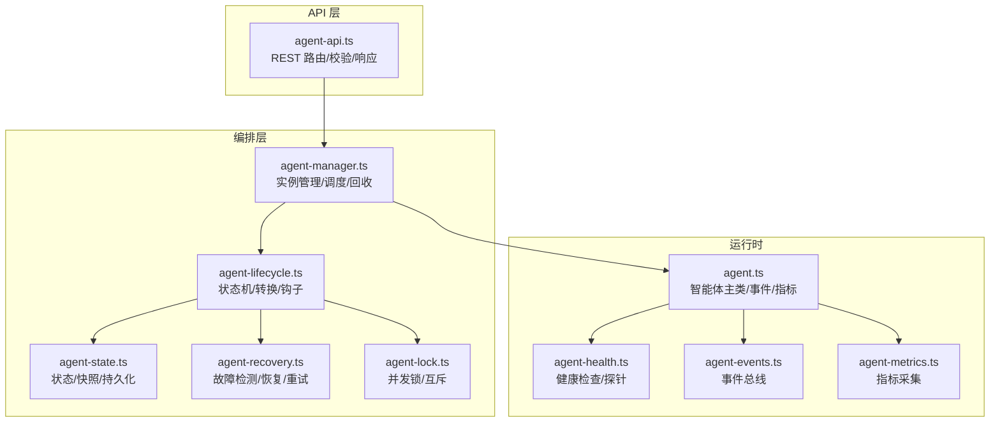
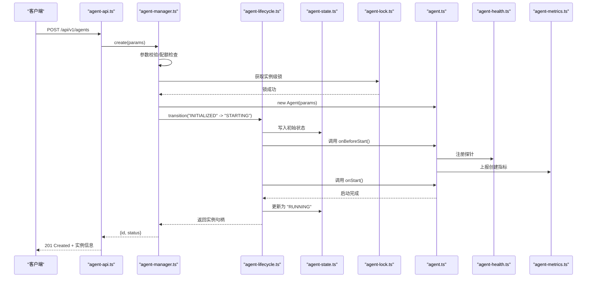
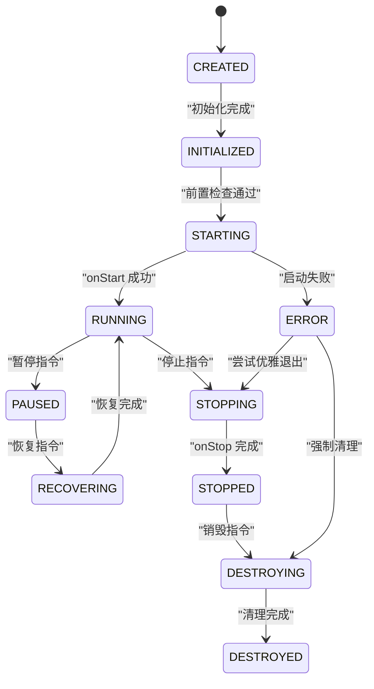
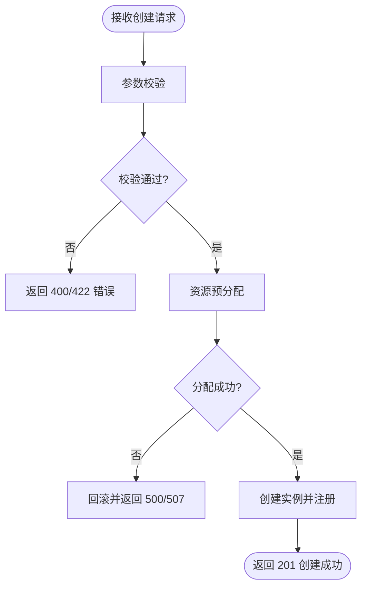
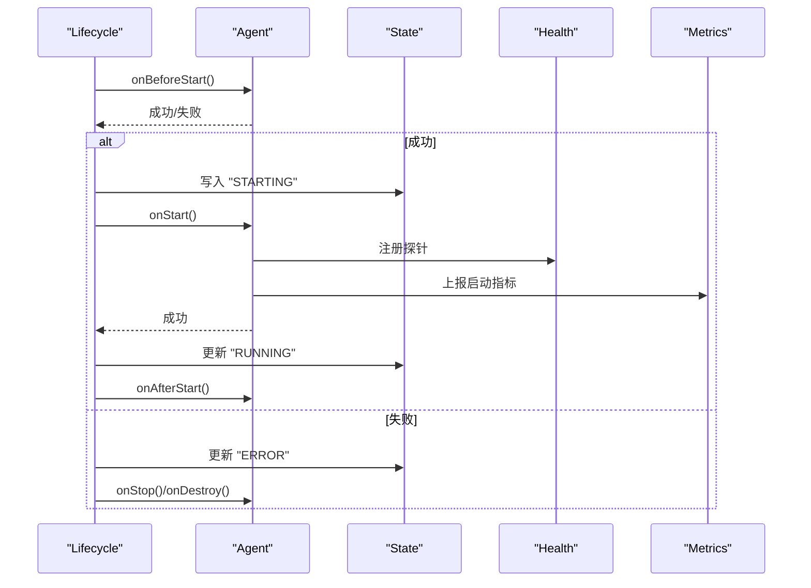
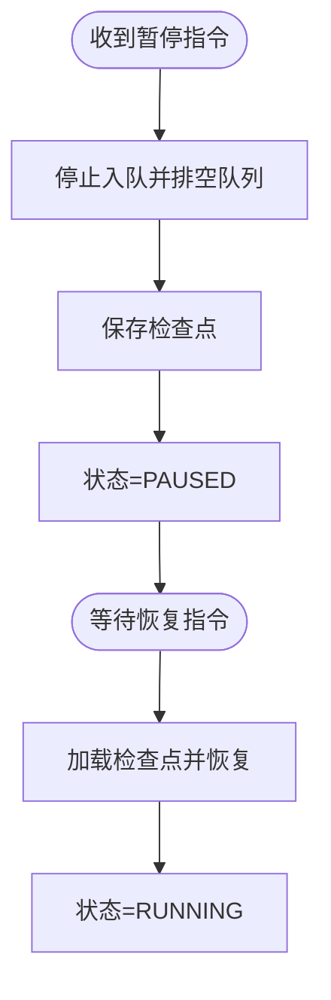
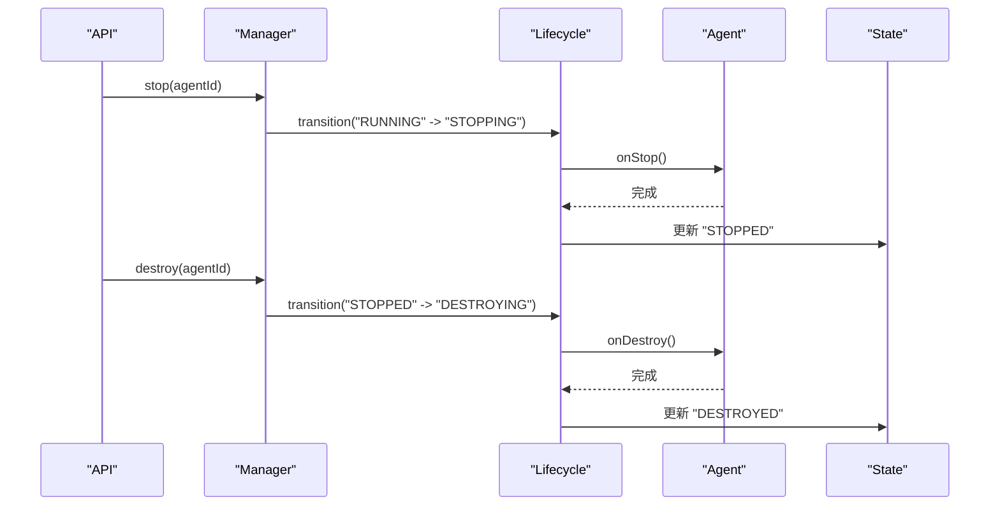
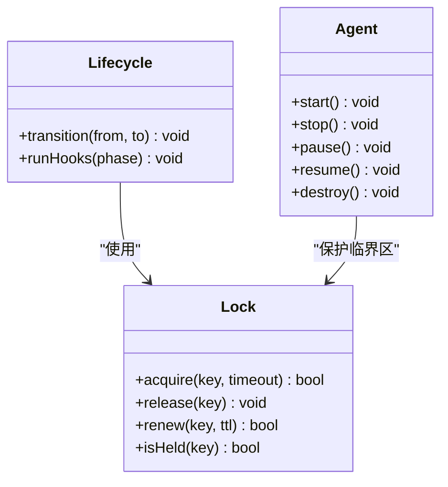
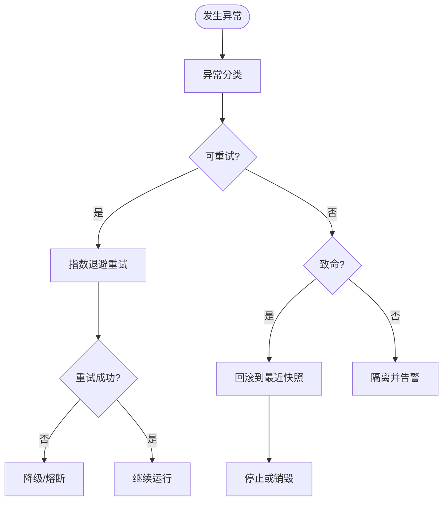
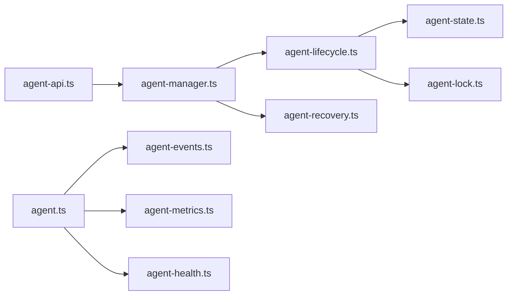

# 智能体生命周期管理

<cite>
**本文引用的文件**   
- [src/core/agent.ts](file://src/core/agent.ts)
- [src/core/agent-lifecycle.ts](file://src/core/agent-lifecycle.ts)
- [src/core/agent-manager.ts](file://src/core/agent-manager.ts)
- [src/core/agent-state.ts](file://src/core/agent-state.ts)
- [src/core/agent-health.ts](file://src/core/agent-health.ts)
- [src/core/agent-api.ts](file://src/core/agent-api.ts)
- [src/core/agent-lock.ts](file://src/core/agent-lock.ts)
- [src/core/agent-recovery.ts](file://src/core/agent-recovery.ts)
- [src/core/agent-events.ts](file://src/core/agent-events.ts)
- [src/core/agent-metrics.ts](file://src/core/agent-metrics.ts)
</cite>

## 目录
1. [简介](#简介)
2. [项目结构](#项目结构)
3. [核心组件](#核心组件)
4. [架构总览](#架构总览)
5. [详细组件分析](#详细组件分析)
6. [依赖分析](#依赖分析)
7. [性能考虑](#性能考虑)
8. [故障排查指南](#故障排查指南)
9. [结论](#结论)
10. [附录](#附录) 

## 简介
本文件面向“智能体生命周期管理”的 API 与实现，覆盖从创建、初始化、启动、运行、暂停、恢复到销毁的完整状态机；定义每个状态的触发条件、前置检查与后置处理；给出实例创建接口、参数校验与资源预分配机制；提供状态查询、监控与健康检查的 RESTful 端点规范；并说明并发控制、锁机制与故障恢复策略。文档同时包含请求示例、响应格式与错误码定义，帮助开发者快速集成与运维。

## 项目结构
围绕智能体生命周期管理的核心代码位于 src/core 目录下，主要模块职责如下：
- agent.ts：智能体主类，封装生命周期方法、事件与指标上报。
- agent-lifecycle.ts：状态机与转换规则（含前置/后置钩子）。
- agent-manager.ts：智能体管理器，负责实例创建、注册、调度与回收。
- agent-state.ts：状态枚举、持久化与快照序列化。
- agent-health.ts：健康检查、探针与告警。
- agent-api.ts：RESTful 接口层（路由、鉴权、校验、响应）。
- agent-lock.ts：分布式/进程内锁，保证并发安全。
- agent-recovery.ts：故障检测、自动恢复与重试策略。
- agent-events.ts：事件总线与订阅发布。
- agent-metrics.ts：指标采集与导出。

图表来源
- [src/core/agent-api.ts](file://src/core/agent-api.ts)
- [src/core/agent-manager.ts](file://src/core/agent-manager.ts)
- [src/core/agent-lifecycle.ts](file://src/core/agent-lifecycle.ts)
- [src/core/agent-state.ts](file://src/core/agent-state.ts)
- [src/core/agent-lock.ts](file://src/core/agent-lock.ts)
- [src/core/agent-recovery.ts](file://src/core/agent-recovery.ts)
- [src/core/agent.ts](file://src/core/agent.ts)
- [src/core/agent-health.ts](file://src/core/agent-health.ts)
- [src/core/agent-events.ts](file://src/core/agent-events.ts)
- [src/core/agent-metrics.ts](file://src/core/agent-metrics.ts)

章节来源
- [src/core/agent.ts](file://src/core/agent.ts)
- [src/core/agent-lifecycle.ts](file://src/core/agent-lifecycle.ts)
- [src/core/agent-manager.ts](file://src/core/agent-manager.ts)
- [src/core/agent-state.ts](file://src/core/agent-state.ts)
- [src/core/agent-health.ts](file://src/core/agent-health.ts)
- [src/core/agent-api.ts](file://src/core/agent-api.ts)
- [src/core/agent-lock.ts](file://src/core/agent-lock.ts)
- [src/core/agent-recovery.ts](file://src/core/agent-recovery.ts)
- [src/core/agent-events.ts](file://src/core/agent-events.ts)
- [src/core/agent-metrics.ts](file://src/core/agent-metrics.ts)

## 核心组件
- 智能体主类（Agent）
  - 职责：承载业务上下文、任务执行循环、事件发布、指标收集、健康探针。
  - 关键能力：生命周期方法调用、状态变更通知、资源申请与释放。
- 生命周期引擎（Lifecycle）
  - 职责：维护状态机、校验转换合法性、执行前置/后置钩子、记录审计日志。
  - 关键能力：幂等转换、可插拔钩子、失败回滚。
- 管理器（Manager）
  - 职责：创建实例、参数校验、资源预分配、注册到全局表、调度与回收。
  - 关键能力：批量操作、限流、配额控制、优雅停机。
- 状态存储（State）
  - 职责：状态枚举、快照序列化、持久化读写、一致性保障。
- 健康检查（Health）
  - 职责：探针定义、阈值判定、告警上报、自愈建议。
- 并发锁（Lock）
  - 职责：进程内/分布式锁、租约续期、死锁检测与抢占。
- 恢复器（Recovery）
  - 职责：异常分类、退避重试、断点续跑、降级策略。
- 事件总线（Events）
  - 职责：事件类型定义、订阅/发布、背压与去重。
- 指标（Metrics）
  - 职责：计数器、直方图、仪表盘数据导出。

章节来源
- [src/core/agent.ts](file://src/core/agent.ts)
- [src/core/agent-lifecycle.ts](file://src/core/agent-lifecycle.ts)
- [src/core/agent-manager.ts](file://src/core/agent-manager.ts)
- [src/core/agent-state.ts](file://src/core/agent-state.ts)
- [src/core/agent-health.ts](file://src/core/agent-health.ts)
- [src/core/agent-lock.ts](file://src/core/agent-lock.ts)
- [src/core/agent-recovery.ts](file://src/core/agent-recovery.ts)
- [src/core/agent-events.ts](file://src/core/agent-events.ts)
- [src/core/agent-metrics.ts](file://src/core/agent-metrics.ts)

## 架构总览
下图展示一次“创建并启动智能体”的典型调用链与数据流向。

图表来源
- [src/core/agent-api.ts](file://src/core/agent-api.ts)
- [src/core/agent-manager.ts](file://src/core/agent-manager.ts)
- [src/core/agent-lifecycle.ts](file://src/core/agent-lifecycle.ts)
- [src/core/agent-state.ts](file://src/core/agent-state.ts)
- [src/core/agent-lock.ts](file://src/core/agent-lock.ts)
- [src/core/agent.ts](file://src/core/agent.ts)
- [src/core/agent-health.ts](file://src/core/agent-health.ts)
- [src/core/agent-metrics.ts](file://src/core/agent-metrics.ts)

## 详细组件分析

### 状态机与转换规则
- 状态集合
  - 未初始化（CREATED）、已初始化（INITIALIZED）、启动中（STARTING）、运行中（RUNNING）、暂停中（PAUSED）、恢复中（RECOVERING）、停止中（STOPPING）、已停止（STOPPED）、销毁中（DESTROYING）、已销毁（DESTROYED）、异常（ERROR）。
- 合法转换
  - CREATED → INITIALIZED：完成配置加载、依赖注入、资源预分配。
  - INITIALIZED → STARTING：前置检查通过（依赖可用、配额充足、锁可用）。
  - STARTING → RUNNING：onStart 成功，探针注册完成。
  - RUNNING → PAUSED：收到暂停指令或外部信号。
  - PAUSED → RECOVERING：收到恢复指令。
  - RECOVERING → RUNNING：恢复完成。
  - RUNNING → STOPPING：收到停止指令或优雅退出。
  - STOPPING → STOPPED：onStop 完成，资源释放。
  - STOPPED → DESTROYING：清理持久化与缓存。
  - DESTROYING → DESTROYED：完全清理。
  - 任意状态 → ERROR：不可恢复异常。
- 前置检查
  - 依赖可用性、锁竞争、配额与速率限制、输入参数有效性、磁盘/网络容量。
- 后置处理
  - 指标上报、审计日志、事件广播、健康探针更新、快照落盘。

图表来源
- [src/core/agent-lifecycle.ts](file://src/core/agent-lifecycle.ts)
- [src/core/agent-state.ts](file://src/core/agent-state.ts)

章节来源
- [src/core/agent-lifecycle.ts](file://src/core/agent-lifecycle.ts)
- [src/core/agent-state.ts](file://src/core/agent-state.ts)

### 实例创建与参数验证
- 入口
  - 通过 REST 接口提交创建请求，由管理器进行参数校验与资源预分配。
- 参数校验要点
  - 必填字段、类型约束、范围边界、唯一性、依赖引用存在性。
- 资源预分配
  - 内存/线程池/连接池/临时目录/索引空间等按需预留，失败则回滚。
- 幂等与冲突
  - 基于实例 ID 的去重与冲突检测，避免重复创建。

图表来源
- [src/core/agent-api.ts](file://src/core/agent-api.ts)
- [src/core/agent-manager.ts](file://src/core/agent-manager.ts)

章节来源
- [src/core/agent-api.ts](file://src/core/agent-api.ts)
- [src/core/agent-manager.ts](file://src/core/agent-manager.ts)

### 启动流程与钩子
- 阶段
  - 前置钩子（onBeforeStart）：加载配置、建立连接、预热缓存。
  - 启动（onStart）：拉起工作循环、注册探针、上报指标。
  - 后置钩子（onAfterStart）：持久化状态、广播事件。
- 失败处理
  - 捕获异常、记录堆栈、回滚部分资源、进入 ERROR 或 STOPPING。

图表来源
- [src/core/agent-lifecycle.ts](file://src/core/agent-lifecycle.ts)
- [src/core/agent.ts](file://src/core/agent.ts)
- [src/core/agent-state.ts](file://src/core/agent-state.ts)
- [src/core/agent-health.ts](file://src/core/agent-health.ts)
- [src/core/agent-metrics.ts](file://src/core/agent-metrics.ts)

章节来源
- [src/core/agent-lifecycle.ts](file://src/core/agent-lifecycle.ts)
- [src/core/agent.ts](file://src/core/agent.ts)

### 暂停与恢复
- 暂停
  - 触发：外部指令、系统压力告警、计划维护。
  - 行为：停止新任务入队、等待队列清空、保存检查点、更新状态为 PAUSED。
- 恢复
  - 触发：外部指令、资源恢复、人工确认。
  - 行为：加载检查点、重建上下文、恢复工作循环、更新状态为 RUNNING。

图表来源
- [src/core/agent-lifecycle.ts](file://src/core/agent-lifecycle.ts)
- [src/core/agent-state.ts](file://src/core/agent-state.ts)

章节来源
- [src/core/agent-lifecycle.ts](file://src/core/agent-lifecycle.ts)
- [src/core/agent-state.ts](file://src/core/agent-state.ts)

### 停止与销毁
- 停止
  - 触发：优雅关闭、版本升级、扩缩容。
  - 行为：拒绝新任务、完成在途任务、释放资源、状态置 STOPPED。
- 销毁
  - 触发：显式删除、过期清理。
  - 行为：清理持久化、索引、缓存、事件订阅、锁释放、状态置 DESTROYED。

图表来源
- [src/core/agent-api.ts](file://src/core/agent-api.ts)
- [src/core/agent-manager.ts](file://src/core/agent-manager.ts)
- [src/core/agent-lifecycle.ts](file://src/core/agent-lifecycle.ts)
- [src/core/agent.ts](file://src/core/agent.ts)
- [src/core/agent-state.ts](file://src/core/agent-state.ts)

章节来源
- [src/core/agent-api.ts](file://src/core/agent-api.ts)
- [src/core/agent-manager.ts](file://src/core/agent-manager.ts)
- [src/core/agent-lifecycle.ts](file://src/core/agent-lifecycle.ts)
- [src/core/agent.ts](file://src/core/agent.ts)
- [src/core/agent-state.ts](file://src/core/agent-state.ts)

### 并发控制与锁机制
- 锁粒度
  - 实例级锁：防止同一实例并发状态转换。
  - 资源级锁：数据库连接、文件句柄、外部服务访问。
- 锁特性
  - 可重入、超时、租约续期、死锁检测、抢占策略。
- 使用场景
  - 状态转换、检查点写入、资源分配/释放、恢复流程。

图表来源
- [src/core/agent-lock.ts](file://src/core/agent-lock.ts)
- [src/core/agent-lifecycle.ts](file://src/core/agent-lifecycle.ts)
- [src/core/agent.ts](file://src/core/agent.ts)

章节来源
- [src/core/agent-lock.ts](file://src/core/agent-lock.ts)
- [src/core/agent-lifecycle.ts](file://src/core/agent-lifecycle.ts)
- [src/core/agent.ts](file://src/core/agent.ts)

### 故障恢复策略
- 异常分类
  - 可重试（网络抖动、临时拥塞）、不可重试（参数错误、权限不足）、致命（OOM、崩溃）。
- 恢复手段
  - 指数退避重试、熔断与降级、断点续跑、快照回滚、隔离与自愈。
- 监控联动
  - 指标阈值触发恢复、告警通知、自动扩容/缩容。

图表来源
- [src/core/agent-recovery.ts](file://src/core/agent-recovery.ts)
- [src/core/agent-state.ts](file://src/core/agent-state.ts)
- [src/core/agent-health.ts](file://src/core/agent-health.ts)

章节来源
- [src/core/agent-recovery.ts](file://src/core/agent-recovery.ts)
- [src/core/agent-state.ts](file://src/core/agent-state.ts)
- [src/core/agent-health.ts](file://src/core/agent-health.ts)

### RESTful API 规范
以下列出与生命周期相关的核心端点。所有路径以 /api/v1 为前缀。

- 创建智能体
  - 方法：POST
  - 路径：/agents
  - 请求体关键字段：name、version、config、resources、tags
  - 成功响应：201，返回 id、status、links
  - 错误码：400/422（参数错误）、409（冲突）、507（资源不足）
- 启动智能体
  - 方法：POST
  - 路径：/agents/{id}/start
  - 成功响应：200，返回 status、message
  - 错误码：409（状态非法）、500（启动失败）
- 暂停智能体
  - 方法：POST
  - 路径：/agents/{id}/pause
  - 成功响应：200
  - 错误码：409（状态非法）、500（暂停失败）
- 恢复智能体
  - 方法：POST
  - 路径：/agents/{id}/resume
  - 成功响应：200
  - 错误码：409（状态非法）、500（恢复失败）
- 停止智能体
  - 方法：POST
  - 路径：/agents/{id}/stop
  - 成功响应：200
  - 错误码：409（状态非法）、500（停止失败）
- 销毁智能体
  - 方法：DELETE
  - 路径：/agents/{id}
  - 成功响应：204
  - 错误码：404（不存在）、409（状态非法）、500（销毁失败）
- 查询状态
  - 方法：GET
  - 路径：/agents/{id}/status
  - 成功响应：200，返回 status、uptime、metrics.summary
  - 错误码：404
- 健康检查
  - 方法：GET
  - 路径：/healthz
  - 成功响应：200，返回 healthy、checks[]
  - 错误码：503（不健康）
- 指标
  - 方法：GET
  - 路径：/metrics
  - 成功响应：200，返回 Prometheus 文本格式

请求示例（JSON）
- 创建
  - 请求体：{ "name": "example-agent", "version": "1.0.0", "config": {}, "resources": { "cpu": "1", "memory": "512Mi" }, "tags": ["prod"] }
  - 响应体：{ "id": "a1b2c3", "status": "INITIALIZED", "links": { "self": "/api/v1/agents/a1b2c3", "start": "/api/v1/agents/a1b2c3/start" } }
- 启动
  - 响应体：{ "status": "RUNNING", "message": "started successfully" }
- 状态查询
  - 响应体：{ "id": "a1b2c3", "status": "RUNNING", "uptime_seconds": 1234, "metrics": { "tasks_total": 567, "errors_total": 2 } }
- 健康检查
  - 响应体：{ "healthy": true, "checks": [{ "name": "db", "status": "ok" }, { "name": "disk", "status": "ok" }] }

错误码定义
- 400：请求格式错误
- 401：未认证
- 403：无权限
- 404：资源不存在
- 409：状态冲突或资源冲突
- 422：参数校验失败
- 429：速率限制
- 500：内部错误
- 503：服务不可用
- 507：资源不足

章节来源
- [src/core/agent-api.ts](file://src/core/agent-api.ts)

### 事件与指标
- 事件类型
  - agent.created、agent.started、agent.paused、agent.resumed、agent.stopped、agent.destroyed、agent.error
- 指标项
  - 计数：创建/启动/暂停/恢复/停止/销毁次数、错误数
  - 时延：各阶段耗时分布
  - 资源：CPU/内存/IO 使用率
- 导出方式
  - HTTP /metrics 暴露、事件总线推送至监控系统

章节来源
- [src/core/agent-events.ts](file://src/core/agent-events.ts)
- [src/core/agent-metrics.ts](file://src/core/agent-metrics.ts)

## 依赖分析
- 组件耦合
  - API 层仅依赖 Manager 与校验器，保持薄控制器。
  - Manager 组合 Lifecycle、Lock、State、Recovery，形成编排中心。
  - Lifecycle 强依赖 State 与 Lock，确保原子性与一致性。
  - Agent 作为运行时实体，依赖 Events、Metrics、Health。
- 外部依赖
  - 数据库/对象存储（持久化）、消息队列（事件）、监控系统（指标/告警）。
- 潜在环依赖
  - 通过事件总线解耦，避免直接反向引用。

图表来源
- [src/core/agent-api.ts](file://src/core/agent-api.ts)
- [src/core/agent-manager.ts](file://src/core/agent-manager.ts)
- [src/core/agent-lifecycle.ts](file://src/core/agent-lifecycle.ts)
- [src/core/agent-recovery.ts](file://src/core/agent-recovery.ts)
- [src/core/agent-state.ts](file://src/core/agent-state.ts)
- [src/core/agent-lock.ts](file://src/core/agent-lock.ts)
- [src/core/agent.ts](file://src/core/agent.ts)
- [src/core/agent-events.ts](file://src/core/agent-events.ts)
- [src/core/agent-metrics.ts](file://src/core/agent-metrics.ts)
- [src/core/agent-health.ts](file://src/core/agent-health.ts)

章节来源
- [src/core/agent-api.ts](file://src/core/agent-api.ts)
- [src/core/agent-manager.ts](file://src/core/agent-manager.ts)
- [src/core/agent-lifecycle.ts](file://src/core/agent-lifecycle.ts)
- [src/core/agent-recovery.ts](file://src/core/agent-recovery.ts)
- [src/core/agent-state.ts](file://src/core/agent-state.ts)
- [src/core/agent-lock.ts](file://src/core/agent-lock.ts)
- [src/core/agent.ts](file://src/core/agent.ts)
- [src/core/agent-events.ts](file://src/core/agent-events.ts)
- [src/core/agent-metrics.ts](file://src/core/agent-metrics.ts)
- [src/core/agent-health.ts](file://src/core/agent-health.ts)

## 性能考虑
- 批量化与异步化
  - 批量创建/销毁、异步钩子执行、非阻塞 I/O。
- 资源上限与限流
  - CPU/内存/连接池上限、令牌桶限流、背压控制。
- 缓存与预热
  - 模型/索引/配置缓存，启动前预热减少冷启动延迟。
- 观测性
  - 关键路径埋点、采样率可调、慢查询追踪。

## 故障排查指南
- 常见问题
  - 启动失败：检查依赖连通性、配额与锁竞争、日志堆栈。
  - 频繁暂停/恢复：关注资源水位与外部依赖稳定性。
  - 销毁卡住：检查未释放资源、长事务、外部会话。
- 诊断步骤
  - 查看状态与事件流水、抓取指标与探针结果、定位锁持有者与等待者。
- 恢复建议
  - 回滚到最近快照、重启受影响的下游依赖、调整重试与退避参数。

章节来源
- [src/core/agent-health.ts](file://src/core/agent-health.ts)
- [src/core/agent-recovery.ts](file://src/core/agent-recovery.ts)
- [src/core/agent-events.ts](file://src/core/agent-events.ts)
- [src/core/agent-metrics.ts](file://src/core/agent-metrics.ts)

## 结论
本方案以状态机为核心，结合锁与恢复机制，构建了高可靠、可观测的智能体生命周期管理体系。通过清晰的 REST 接口与完善的错误码，便于上层系统集成与自动化运维。建议在大规模部署中配合弹性伸缩与灰度发布策略，进一步提升整体稳定性与吞吐。

## 附录
- 术语
  - 智能体：具备独立生命周期与执行能力的业务单元。
  - 钩子：生命周期阶段的可插拔回调。
  - 快照：用于恢复的状态与数据一致点。
- 最佳实践
  - 幂等设计、最小权限、可观测优先、渐进式演进。