# 智能体监控与诊断

<cite>
**本文引用的文件**   
- [src/core/monitoring.ts](file://src/core/monitoring.ts)
- [src/core/metrics.ts](file://src/core/metrics.ts)
- [src/core/logger.ts](file://src/core/logger.ts)
- [src/core/tracing.ts](file://src/core/tracing.ts)
- [src/core/health.ts](file://src/core/health.ts)
- [src/core/alerts.ts](file://src/core/alerts.ts)
- [src/core/anomaly.ts](file://src/core/anomaly.ts)
- [src/core/resources.ts](file://src/core/resources.ts)
- [src/core/debug.ts](file://src/core/debug.ts)
- [src/core/exporter.ts](file://src/core/exporter.ts)
- [src/core/reporter.ts](file://src/core/reporter.ts)
- [src/core/dashboard.ts](file://src/core/dashboard.ts)
- [src/core/telemetry.ts](file://src/core/telemetry.ts)
- [src/core/ops.ts](file://src/core/ops.ts)
- [src/core/status.ts](file://src/core/status.ts)
- [src/core/queue-stats.ts](file://src/core/queue-stats.ts)
- [src/core/worker-metrics.ts](file://src/core/worker-metrics.ts)
- [src/core/db-health.ts](file://src/core/db-health.ts)
- [src/core/storage-status.ts](file://src/core/storage-status.ts)
- [src/core/source-health.ts](file://src/core/source-health.ts)
- [src/core/supervisor-health.ts](file://src/core/supervisor-health.ts)
- [src/core/process-watchdog.ts](file://src/core/process-watchdog.ts)
- [src/core/doctor.ts](file://src/core/doctor.ts)
- [src/core/agent-runner.ts](file://src/core/agent-runner.ts)
- [src/core/autopilot-cycle-handler.ts](file://src/core/autopilot-cycle-handler.ts)
- [src/core/progress-events.ts](file://src/core/progress-events.ts)
- [src/core/heartbeat.ts](file://src/core/heartbeat.ts)
- [src/core/gateway.ts](file://src/core/gateway.ts)
- [src/core/http-server.ts](file://src/core/http-server.ts)
- [src/core/handlers/health.ts](file://src/core/handlers/health.ts)
- [src/core/handlers/metrics.ts](file://src/core/handlers/metrics.ts)
- [src/core/handlers/logs.ts](file://src/core/handlers/logs.ts)
- [src/core/handlers/status.ts](file://src/core/handlers/status.ts)
- [src/core/handlers/export.ts](file://src/core/handlers/export.ts)
- [src/core/handlers/report.ts](file://src/core/handlers/report.ts)
- [src/core/handlers/diagnostic.ts](file://src/core/handlers/diagnostic.ts)
- [src/core/handlers/tracing.ts](file://src/core/handlers/tracing.ts)
- [src/core/handlers/ops.ts](file://src/core/handlers/ops.ts)
</cite>

## 目录
1. [简介](#简介)
2. [项目结构](#项目结构)
3. [核心组件](#核心组件)
4. [架构总览](#架构总览)
5. [详细组件分析](#详细组件分析)
6. [依赖关系分析](#依赖关系分析)
7. [性能考量](#性能考量)
8. [故障排查指南](#故障排查指南)
9. [结论](#结论)
10. [附录](#附录)

## 简介
本文件面向运维、SRE 与平台工程团队，系统化梳理“智能体监控与诊断”的 API 能力与实践方法。内容覆盖：
- 运行状态监控：健康检查、进程/子进程/工作池/队列/数据库/存储/数据源等关键子系统健康度
- 性能指标收集：CPU、内存、磁盘、I/O、网络、LLM 调用、向量索引、搜索、同步任务等
- 日志查询：结构化日志检索、过滤、分页与导出
- 实时监控与历史趋势：实时拉取、时间窗口聚合、趋势分析与告警
- 异常检测：基线漂移、阈值告警、异常模式识别
- 调试与追踪：调试模式、追踪 ID、分布式追踪集成
- 数据导出与可视化：Prometheus/OpenMetrics、JSON/CSV 导出、报告生成
- 最佳实践与排障：常见瓶颈定位、容量规划、稳定性保障

## 项目结构
监控与诊断相关代码主要分布在 core 层与 handlers 层：
- core 层负责采集、聚合、计算、持久化与对外暴露接口
- handlers 层提供 HTTP API 路由与请求处理
- 辅助模块包括资源采集、异常检测、告警规则、导出与报表、仪表盘等

```mermaid
graph TB
subgraph "HTTP 服务"
H["http-server.ts"]
R1["handlers/health.ts"]
R2["handlers/metrics.ts"]
R3["handlers/logs.ts"]
R4["handlers/status.ts"]
R5["handlers/export.ts"]
R6["handlers/report.ts"]
R7["handlers/diagnostic.ts"]
R8["handlers/tracing.ts"]
R9["handlers/ops.ts"]
end
subgraph "监控核心"
M["monitoring.ts"]
MET["metrics.ts"]
LOG["logger.ts"]
TRC["tracing.ts"]
HL["health.ts"]
AL["alerts.ts"]
AN["anomaly.ts"]
RES["resources.ts"]
DBG["debug.ts"]
EXP["exporter.ts"]
REP["reporter.ts"]
DSH["dashboard.ts"]
TEL["telemetry.ts"]
OPS["ops.ts"]
ST["status.ts"]
QS["queue-stats.ts"]
WM["worker-metrics.ts"]
DBH["db-health.ts"]
SS["storage-status.ts"]
SH["source-health.ts"]
SVH["supervisor-health.ts"]
PW["process-watchdog.ts"]
DOC["doctor.ts"]
end
subgraph "被观测系统"
AR["agent-runner.ts"]
ACH["autopilot-cycle-handler.ts"]
PE["progress-events.ts"]
HB["heartbeat.ts"]
GW["gateway.ts"]
end
H --> R1
H --> R2
H --> R3
H --> R4
H --> R5
H --> R6
H --> R7
H --> R8
H --> R9
R1 --> HL
R2 --> MET
R3 --> LOG
R4 --> ST
R5 --> EXP
R6 --> REP
R7 --> DOC
R8 --> TRC
R9 --> OPS
MET --> RES
MET --> QS
MET --> WM
MET --> DBH
MET --> SS
MET --> SH
MET --> SVH
MET --> PW
MET --> HB
MET --> PE
HL --> DBH
HL --> SS
HL --> SH
HL --> SVH
HL --> PW
AL --> AN
AL --> MET
AL --> LOG
EXP --> MET
EXP --> LOG
EXP --> ST
REP --> MET
REP --> LOG
REP --> ST
DSH --> MET
DSH --> LOG
DSH --> ST
TRC --> TEL
TRC --> LOG
OPS --> ST
OPS --> MET
OPS --> LOG
```

图表来源
- [src/core/http-server.ts](file://src/core/http-server.ts)
- [src/core/handlers/health.ts](file://src/core/handlers/health.ts)
- [src/core/handlers/metrics.ts](file://src/core/handlers/metrics.ts)
- [src/core/handlers/logs.ts](file://src/core/handlers/logs.ts)
- [src/core/handlers/status.ts](file://src/core/handlers/status.ts)
- [src/core/handlers/export.ts](file://src/core/handlers/export.ts)
- [src/core/handlers/report.ts](file://src/core/handlers/report.ts)
- [src/core/handlers/diagnostic.ts](file://src/core/handlers/diagnostic.ts)
- [src/core/handlers/tracing.ts](file://src/core/handlers/tracing.ts)
- [src/core/handlers/ops.ts](file://src/core/handlers/ops.ts)
- [src/core/monitoring.ts](file://src/core/monitoring.ts)
- [src/core/metrics.ts](file://src/core/metrics.ts)
- [src/core/logger.ts](file://src/core/logger.ts)
- [src/core/tracing.ts](file://src/core/tracing.ts)
- [src/core/health.ts](file://src/core/health.ts)
- [src/core/alerts.ts](file://src/core/alerts.ts)
- [src/core/anomaly.ts](file://src/core/anomaly.ts)
- [src/core/resources.ts](file://src/core/resources.ts)
- [src/core/debug.ts](file://src/core/debug.ts)
- [src/core/exporter.ts](file://src/core/exporter.ts)
- [src/core/reporter.ts](file://src/core/reporter.ts)
- [src/core/dashboard.ts](file://src/core/dashboard.ts)
- [src/core/telemetry.ts](file://src/core/telemetry.ts)
- [src/core/ops.ts](file://src/core/ops.ts)
- [src/core/status.ts](file://src/core/status.ts)
- [src/core/queue-stats.ts](file://src/core/queue-stats.ts)
- [src/core/worker-metrics.ts](file://src/core/worker-metrics.ts)
- [src/core/db-health.ts](file://src/core/db-health.ts)
- [src/core/storage-status.ts](file://src/core/storage-status.ts)
- [src/core/source-health.ts](file://src/core/source-health.ts)
- [src/core/supervisor-health.ts](file://src/core/supervisor-health.ts)
- [src/core/process-watchdog.ts](file://src/core/process-watchdog.ts)
- [src/core/doctor.ts](file://src/core/doctor.ts)
- [src/core/agent-runner.ts](file://src/core/agent-runner.ts)
- [src/core/autopilot-cycle-handler.ts](file://src/core/autopilot-cycle-handler.ts)
- [src/core/progress-events.ts](file://src/core/progress-events.ts)
- [src/core/heartbeat.ts](file://src/core/heartbeat.ts)
- [src/core/gateway.ts](file://src/core/gateway.ts)

章节来源
- [src/core/http-server.ts](file://src/core/http-server.ts)
- [src/core/monitoring.ts](file://src/core/monitoring.ts)

## 核心组件
- 监控总线（monitoring）：统一注册指标、事件与生命周期钩子，协调采集器与处理器
- 指标系统（metrics）：计数器、直方图、仪表、标签维度管理，支持 Prometheus/OpenMetrics 输出
- 日志系统（logger）：结构化日志、分级、采样、脱敏、滚动与导出
- 健康检查（health）：组合式健康探针，聚合各子系统健康状态
- 告警与异常（alerts/anomaly）：阈值、滑动窗口、基线对比、异常模式识别
- 资源采集（resources）：CPU、内存、磁盘、I/O、网络、句柄数等
- 调试与追踪（debug/tracing）：调试开关、采样率、Trace/Span、上下文传播
- 导出与报表（exporter/reporter）：批量导出、定时快照、报告模板
- 仪表盘（dashboard）：预置视图与聚合查询
- 遥测（telemetry）：匿名遥测、上报策略与隐私控制
- 运维操作（ops）：重启、清理、重平衡、强制刷新等受控操作
- 状态与统计（status/queue-stats/worker-metrics）：全局状态、队列积压、工作进程指标
- 子系统健康（db-health/storage-status/source-health/supervisor-health/process-watchdog）：数据库、存储、数据源、监督者、进程看门狗健康
- 医生（doctor）：自检、修复建议、一键诊断包
- 被观测系统：智能体运行器、自动编排循环、进度事件、心跳、网关

章节来源
- [src/core/monitoring.ts](file://src/core/monitoring.ts)
- [src/core/metrics.ts](file://src/core/metrics.ts)
- [src/core/logger.ts](file://src/core/logger.ts)
- [src/core/health.ts](file://src/core/health.ts)
- [src/core/alerts.ts](file://src/core/alerts.ts)
- [src/core/anomaly.ts](file://src/core/anomaly.ts)
- [src/core/resources.ts](file://src/core/resources.ts)
- [src/core/debug.ts](file://src/core/debug.ts)
- [src/core/tracing.ts](file://src/core/tracing.ts)
- [src/core/exporter.ts](file://src/core/exporter.ts)
- [src/core/reporter.ts](file://src/core/reporter.ts)
- [src/core/dashboard.ts](file://src/core/dashboard.ts)
- [src/core/telemetry.ts](file://src/core/telemetry.ts)
- [src/core/ops.ts](file://src/core/ops.ts)
- [src/core/status.ts](file://src/core/status.ts)
- [src/core/queue-stats.ts](file://src/core/queue-stats.ts)
- [src/core/worker-metrics.ts](file://src/core/worker-metrics.ts)
- [src/core/db-health.ts](file://src/core/db-health.ts)
- [src/core/storage-status.ts](file://src/core/storage-status.ts)
- [src/core/source-health.ts](file://src/core/source-health.ts)
- [src/core/supervisor-health.ts](file://src/core/supervisor-health.ts)
- [src/core/process-watchdog.ts](file://src/core/process-watchdog.ts)
- [src/core/doctor.ts](file://src/core/doctor.ts)
- [src/core/agent-runner.ts](file://src/core/agent-runner.ts)
- [src/core/autopilot-cycle-handler.ts](file://src/core/autopilot-cycle-handler.ts)
- [src/core/progress-events.ts](file://src/core/progress-events.ts)
- [src/core/heartbeat.ts](file://src/core/heartbeat.ts)
- [src/core/gateway.ts](file://src/core/gateway.ts)

## 架构总览
整体采用“采集-聚合-暴露”的分层架构：
- 采集层：资源、队列、工作进程、数据库、存储、数据源、心跳、进度事件等
- 聚合层：指标归一化、标签标准化、去抖与降采样、异常检测与告警
- 暴露层：HTTP API、Prometheus/OpenMetrics、导出器、报表与仪表盘

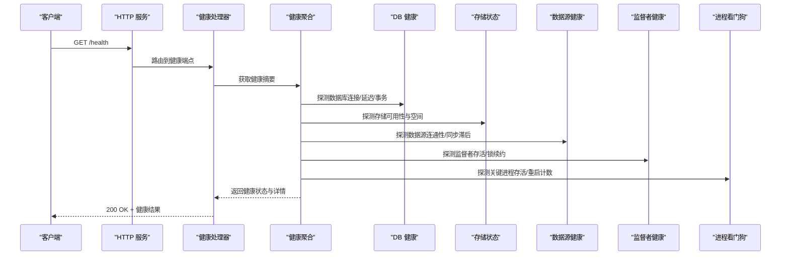

图表来源
- [src/core/handlers/health.ts](file://src/core/handlers/health.ts)
- [src/core/health.ts](file://src/core/health.ts)
- [src/core/db-health.ts](file://src/core/db-health.ts)
- [src/core/storage-status.ts](file://src/core/storage-status.ts)
- [src/core/source-health.ts](file://src/core/source-health.ts)
- [src/core/supervisor-health.ts](file://src/core/supervisor-health.ts)
- [src/core/process-watchdog.ts](file://src/core/process-watchdog.ts)

## 详细组件分析

### 健康检查与健康聚合
- 功能要点
  - 组合式健康探针：数据库、存储、数据源、监督者、进程看门狗
  - 健康等级：healthy/degraded/unhealthy，附带原因与恢复建议
  - 快速失败：任一关键子系统不健康即降级响应
- 典型流程
  - 客户端发起健康检查
  - 健康处理器并行触发各子系统探针
  - 聚合结果并返回

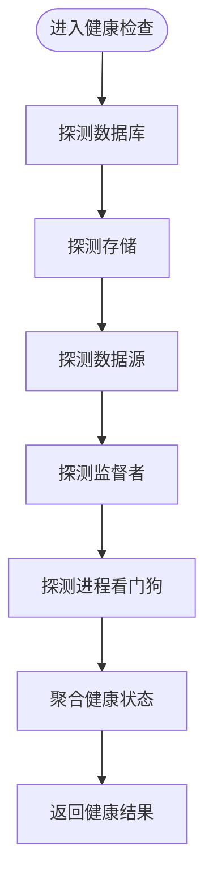

图表来源
- [src/core/handlers/health.ts](file://src/core/handlers/health.ts)
- [src/core/health.ts](file://src/core/health.ts)
- [src/core/db-health.ts](file://src/core/db-health.ts)
- [src/core/storage-status.ts](file://src/core/storage-status.ts)
- [src/core/source-health.ts](file://src/core/source-health.ts)
- [src/core/supervisor-health.ts](file://src/core/supervisor-health.ts)
- [src/core/process-watchdog.ts](file://src/core/process-watchdog.ts)

章节来源
- [src/core/handlers/health.ts](file://src/core/handlers/health.ts)
- [src/core/health.ts](file://src/core/health.ts)

### 指标收集与暴露
- 指标类型
  - 计数器：错误数、请求数、任务完成数
  - 直方图：延迟分布、大小分布
  - 仪表：瞬时值（如队列长度、活跃 worker 数）
- 维度与标签
  - agent_id、source_id、task_type、status、region、host
- 暴露格式
  - Prometheus/OpenMetrics 文本格式
  - JSON 快照用于导出与报表
- 采集范围
  - 资源使用（CPU、内存、磁盘、I/O、网络）
  - 队列与工作进程（积压、吞吐、耗时、OOM 次数）
  - 数据库（连接池、慢查询、锁等待）
  - 存储（空间、写入放大、碎片）
  - 数据源（同步延迟、失败率、重试）
  - 网关与 LLM（请求量、成功率、延迟、配额）

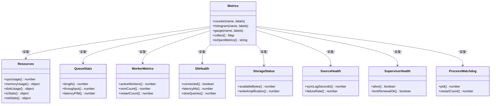

图表来源
- [src/core/metrics.ts](file://src/core/metrics.ts)
- [src/core/resources.ts](file://src/core/resources.ts)
- [src/core/queue-stats.ts](file://src/core/queue-stats.ts)
- [src/core/worker-metrics.ts](file://src/core/worker-metrics.ts)
- [src/core/db-health.ts](file://src/core/db-health.ts)
- [src/core/storage-status.ts](file://src/core/storage-status.ts)
- [src/core/source-health.ts](file://src/core/source-health.ts)
- [src/core/supervisor-health.ts](file://src/core/supervisor-health.ts)
- [src/core/process-watchdog.ts](file://src/core/process-watchdog.ts)

章节来源
- [src/core/handlers/metrics.ts](file://src/core/handlers/metrics.ts)
- [src/core/metrics.ts](file://src/core/metrics.ts)

### 日志查询与导出
- 能力
  - 按级别、时间窗、关键字、trace_id、agent_id、source_id 过滤
  - 分页、排序、去重、采样
  - 导出为 JSON/CSV，支持压缩
- 注意事项
  - 大时间窗需限制行数与采样率
  - 敏感字段自动脱敏
  - 流式输出避免长连接阻塞

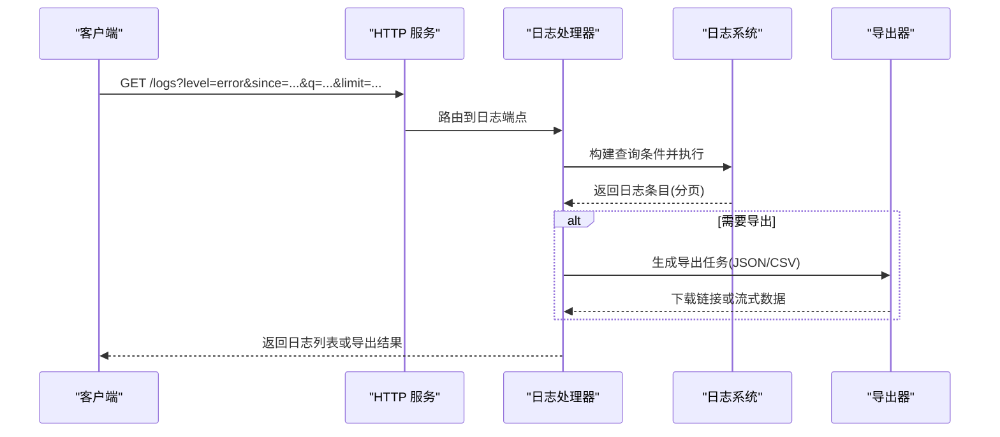

图表来源
- [src/core/handlers/logs.ts](file://src/core/handlers/logs.ts)
- [src/core/logger.ts](file://src/core/logger.ts)
- [src/core/exporter.ts](file://src/core/exporter.ts)

章节来源
- [src/core/handlers/logs.ts](file://src/core/handlers/logs.ts)
- [src/core/logger.ts](file://src/core/logger.ts)

### 状态与统计
- 全局状态：版本、启动时间、运行时长、配置摘要
- 队列统计：长度、吞吐、P99/P95 延迟、背压信号
- 工作进程：活跃数、重启次数、OOM 次数、CPU/内存占用

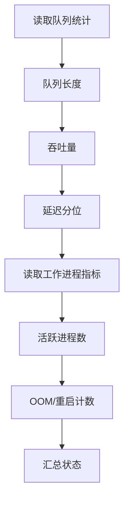

图表来源
- [src/core/queue-stats.ts](file://src/core/queue-stats.ts)
- [src/core/worker-metrics.ts](file://src/core/worker-metrics.ts)
- [src/core/status.ts](file://src/core/status.ts)

章节来源
- [src/core/handlers/status.ts](file://src/core/handlers/status.ts)
- [src/core/status.ts](file://src/core/status.ts)
- [src/core/queue-stats.ts](file://src/core/queue-stats.ts)
- [src/core/worker-metrics.ts](file://src/core/worker-metrics.ts)

### 异常检测与告警
- 异常检测
  - 基线漂移：基于历史窗口计算均值/方差，超出置信区间报警
  - 突变检测：短时尖峰或骤降
  - 模式匹配：特定错误序列、死锁、OOM 循环
- 告警规则
  - 阈值类：CPU>90% 持续 5 分钟
  - 比率类：错误率>1% 持续 3 分钟
  - 复合类：队列积压+延迟升高+worker OOM
- 动作
  - 通知（Webhook/邮件/IM）
  - 自愈（重启、扩容、限流）
  - 记录审计与回溯

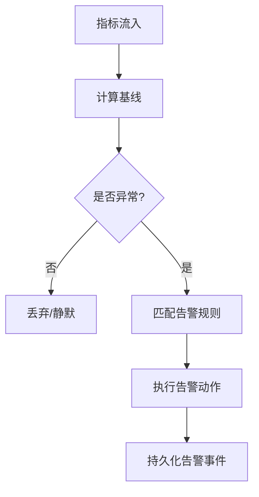

图表来源
- [src/core/anomaly.ts](file://src/core/anomaly.ts)
- [src/core/alerts.ts](file://src/core/alerts.ts)
- [src/core/metrics.ts](file://src/core/metrics.ts)

章节来源
- [src/core/anomaly.ts](file://src/core/anomaly.ts)
- [src/core/alerts.ts](file://src/core/alerts.ts)

### 调试模式、追踪 ID 与分布式追踪
- 调试模式
  - 细粒度日志开关、采样率调整、堆栈打印、慢路径标记
- 追踪 ID
  - 每个请求/任务分配唯一 trace_id，跨组件传播
- 分布式追踪
  - 与外部链路系统对接（如 OpenTelemetry），支持 Span 埋点、上下文注入/提取、采样策略

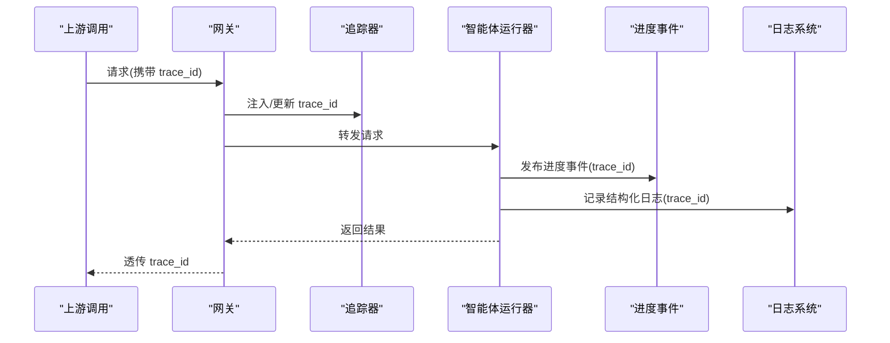

图表来源
- [src/core/tracing.ts](file://src/core/tracing.ts)
- [src/core/debug.ts](file://src/core/debug.ts)
- [src/core/agent-runner.ts](file://src/core/agent-runner.ts)
- [src/core/progress-events.ts](file://src/core/progress-events.ts)
- [src/core/logger.ts](file://src/core/logger.ts)
- [src/core/gateway.ts](file://src/core/gateway.ts)

章节来源
- [src/core/handlers/tracing.ts](file://src/core/handlers/tracing.ts)
- [src/core/tracing.ts](file://src/core/tracing.ts)
- [src/core/debug.ts](file://src/core/debug.ts)

### 导出、可视化与报告
- 导出
  - 指标快照（JSON）、日志归档（CSV/JSON）、健康与状态快照
  - 定时导出与增量导出
- 可视化
  - 预置仪表盘视图（资源、队列、延迟、错误率）
  - 与外部 BI/时序数据库集成
- 报告
  - 周期性报告（日/周/月），包含趋势、峰值、异常事件与建议

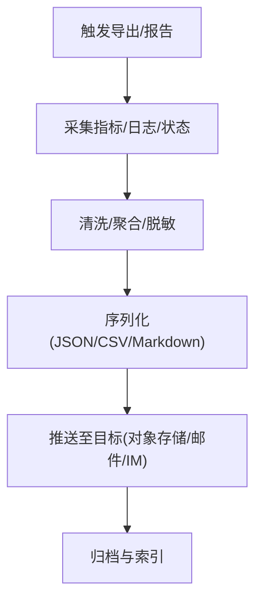

图表来源
- [src/core/exporter.ts](file://src/core/exporter.ts)
- [src/core/reporter.ts](file://src/core/reporter.ts)
- [src/core/dashboard.ts](file://src/core/dashboard.ts)
- [src/core/metrics.ts](file://src/core/metrics.ts)
- [src/core/logger.ts](file://src/core/logger.ts)
- [src/core/status.ts](file://src/core/status.ts)

章节来源
- [src/core/handlers/export.ts](file://src/core/handlers/export.ts)
- [src/core/handlers/report.ts](file://src/core/handlers/report.ts)
- [src/core/exporter.ts](file://src/core/exporter.ts)
- [src/core/reporter.ts](file://src/core/reporter.ts)
- [src/core/dashboard.ts](file://src/core/dashboard.ts)

### 运维操作与诊断工具
- 运维操作
  - 重启、清理缓存、强制刷新、重平衡、限流开关
- 诊断工具
  - 一键诊断包（指标快照、日志片段、配置摘要、堆栈）
  - 医生自检：数据库、存储、数据源、监督者、进程看门狗、队列与工作进程

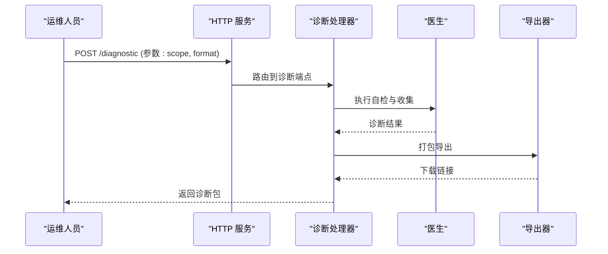

图表来源
- [src/core/handlers/diagnostic.ts](file://src/core/handlers/diagnostic.ts)
- [src/core/doctor.ts](file://src/core/doctor.ts)
- [src/core/exporter.ts](file://src/core/exporter.ts)

章节来源
- [src/core/handlers/diagnostic.ts](file://src/core/handlers/diagnostic.ts)
- [src/core/doctor.ts](file://src/core/doctor.ts)

## 依赖关系分析
- 松耦合设计
  - handlers 仅依赖 core 暴露的函数/类，避免直接访问底层实现
  - metrics 作为中心枢纽，其他采集模块通过标准接口上报
- 潜在风险
  - 过度集中：若 metrics 成为单点瓶颈，需考虑分片与异步落盘
  - 标签爆炸：需对高基数标签进行白名单与上限控制
- 外部依赖
  - 时序数据库、消息总线、对象存储、外部链路系统

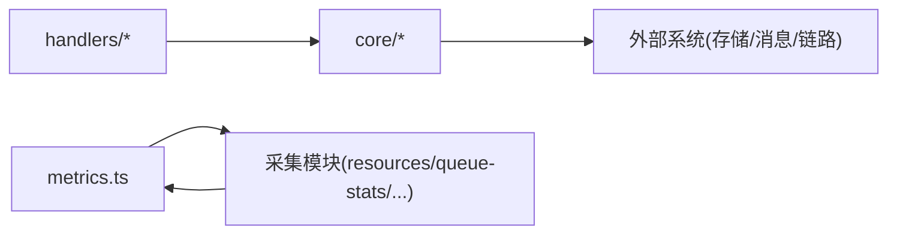

图表来源
- [src/core/handlers/health.ts](file://src/core/handlers/health.ts)
- [src/core/handlers/metrics.ts](file://src/core/handlers/metrics.ts)
- [src/core/handlers/logs.ts](file://src/core/handlers/logs.ts)
- [src/core/handlers/status.ts](file://src/core/handlers/status.ts)
- [src/core/handlers/export.ts](file://src/core/handlers/export.ts)
- [src/core/handlers/report.ts](file://src/core/handlers/report.ts)
- [src/core/handlers/diagnostic.ts](file://src/core/handlers/diagnostic.ts)
- [src/core/handlers/tracing.ts](file://src/core/handlers/tracing.ts)
- [src/core/handlers/ops.ts](file://src/core/handlers/ops.ts)
- [src/core/metrics.ts](file://src/core/metrics.ts)
- [src/core/resources.ts](file://src/core/resources.ts)
- [src/core/queue-stats.ts](file://src/core/queue-stats.ts)
- [src/core/worker-metrics.ts](file://src/core/worker-metrics.ts)

章节来源
- [src/core/monitoring.ts](file://src/core/monitoring.ts)
- [src/core/metrics.ts](file://src/core/metrics.ts)

## 性能考量
- 指标采集
  - 采样与降采样：高频指标按时间窗口聚合，降低 I/O 压力
  - 标签治理：限制高基数标签数量，避免内存膨胀
- 日志处理
  - 异步写入与批量化，避免阻塞主流程
  - 动态采样：根据负载与级别自适应采样率
- 健康检查
  - 并行探测与超时控制，避免级联超时
- 导出与报表
  - 增量导出与后台任务，避免高峰期影响在线服务
- 追踪
  - 采样策略：按错误率与慢请求优先采样，减少开销

[本节为通用指导，无需源码引用]

## 故障排查指南
- 常见问题
  - 数据库连接池耗尽：检查连接数、慢查询、锁等待
  - 存储写放大过高：检查碎片整理与写入策略
  - 数据源同步滞后：检查网络、鉴权、速率限制
  - 监督者锁续约失败：检查时钟漂移与并发竞争
  - 进程频繁重启：检查 OOM、看门狗阈值、崩溃堆栈
- 定位步骤
  - 使用健康检查确认子系统状态
  - 通过指标查看延迟、错误率、资源使用趋势
  - 结合日志与 trace_id 定位具体请求
  - 使用诊断工具生成诊断包并分析
- 自愈建议
  - 自动扩容、限流、熔断、重试退避、优雅降级

章节来源
- [src/core/health.ts](file://src/core/health.ts)
- [src/core/db-health.ts](file://src/core/db-health.ts)
- [src/core/storage-status.ts](file://src/core/storage-status.ts)
- [src/core/source-health.ts](file://src/core/source-health.ts)
- [src/core/supervisor-health.ts](file://src/core/supervisor-health.ts)
- [src/core/process-watchdog.ts](file://src/core/process-watchdog.ts)
- [src/core/doctor.ts](file://src/core/doctor.ts)

## 结论
本方案以“采集-聚合-暴露”为核心，构建了覆盖健康、指标、日志、追踪、异常与告警、导出与报表、诊断与运维操作的完整监控与诊断体系。通过合理的采样与标签治理、并行健康探测与异步导出，可在保证稳定性的同时提供丰富的可观测性能力。建议在生产环境逐步落地，并结合业务特性定制告警规则与仪表盘。

[本节为总结性内容，无需源码引用]

## 附录
- 术语
  - Trace/Span：分布式追踪的基本单元
  - 基线漂移：指标偏离历史正常范围的现象
  - 写放大：实际写入量与逻辑写入量的比值
- 参考
  - 健康检查最佳实践：短超时、幂等、无副作用
  - 指标命名规范：前缀清晰、单位明确、维度可控
  - 日志脱敏：PII 与密钥自动替换

[本节为补充信息，无需源码引用]