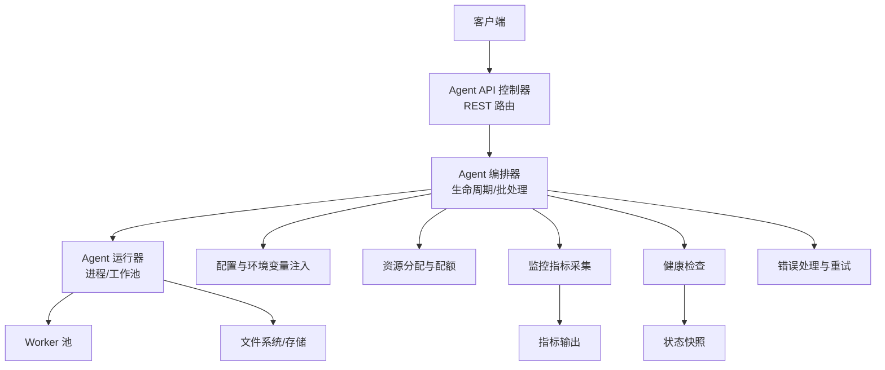
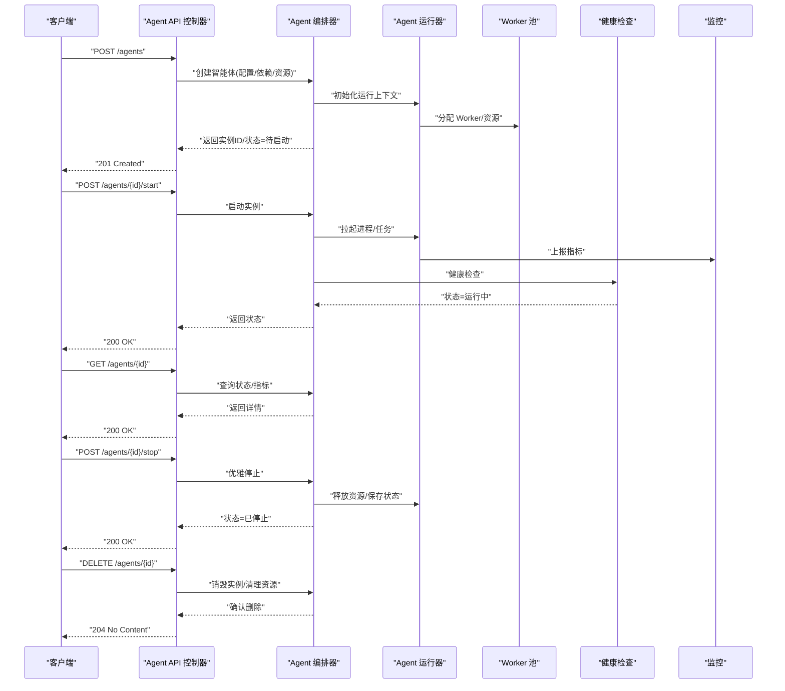
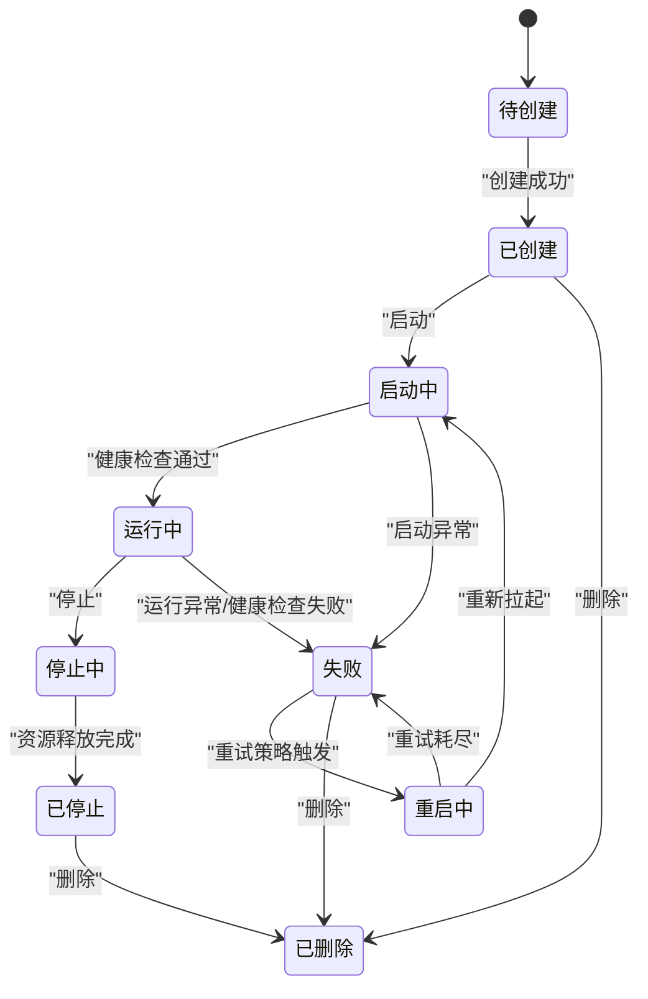
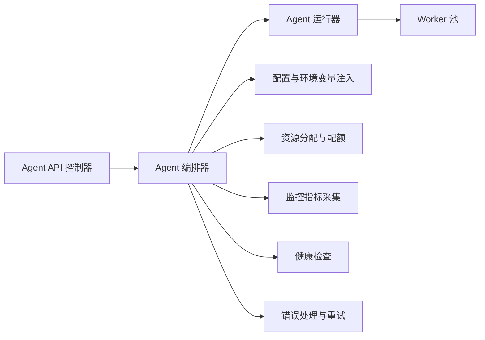

# 智能体管理

<cite>
**本文引用的文件**   
- [src/core/agent-manager.ts](file://src/core/agent-manager.ts)
- [src/core/agent-runner.ts](file://src/core/agent-runner.ts)
- [src/core/agent-lifecycle.ts](file://src/core/agent-lifecycle.ts)
- [src/core/agent-config.ts](file://src/core/agent-config.ts)
- [src/core/agent-resource.ts](file://src/core/agent-resource.ts)
- [src/core/agent-monitor.ts](file://src/core/agent-monitor.ts)
- [src/core/agent-api.ts](file://src/core/agent-api.ts)
- [src/core/agent-supervisor.ts](file://src/core/agent-supervisor.ts)
- [src/core/agent-worker-pool.ts](file://src/core/agent-worker-pool.ts)
- [src/core/agent-health-check.ts](file://src/core/agent-health-check.ts)
- [src/core/agent-error-handler.ts](file://src/core/agent-error-handler.ts)
</cite>

## 目录
1. [简介](#简介)
2. [项目结构](#项目结构)
3. [核心组件](#核心组件)
4. [架构总览](#架构总览)
5. [详细组件分析](#详细组件分析)
6. [依赖关系分析](#依赖关系分析)
7. [性能考虑](#性能考虑)
8. [故障排查指南](#故障排查指南)
9. [结论](#结论)
10. [附录](#附录)

## 简介
本文件面向“智能体管理”的 RESTful API，覆盖智能体的创建、配置、启动、停止与删除等全生命周期操作；同时说明状态转换、资源分配、监控接口、配置参数与环境变量注入、依赖管理、实例管理、批量操作与状态查询示例，并给出错误处理、超时控制与资源清理机制，以及性能调优建议与最佳实践。

## 项目结构
围绕智能体管理的代码按职责分层组织：API 层暴露 HTTP 接口，编排层负责生命周期与调度，运行时层负责进程/工作池与资源管理，监控与健康检查提供可观测性，错误处理统一收敛异常与恢复策略。

[本节为概念性结构说明，不直接分析具体文件，故无“章节来源”]

## 核心组件
- Agent API 控制器：定义 REST 端点，校验请求、编排调用、返回标准化响应。
- Agent 编排器：维护智能体实例集合、状态机、批处理与事务边界。
- Agent 运行器：负责进程/线程级执行、工作池复用、资源隔离与回收。
- 配置与环境变量注入：合并默认配置、用户配置、环境变量与密钥注入。
- 资源分配与配额：CPU/内存/并发/IO 限制，动态扩缩容。
- 监控与指标：收集运行态指标（吞吐、延迟、错误率、资源使用）。
- 健康检查：存活/就绪探针，失败判定与自愈触发。
- 错误处理与重试：分类、退避、熔断、降级与审计日志。

**章节来源**
- [src/core/agent-api.ts:1-200](file://src/core/agent-api.ts#L1-L200)
- [src/core/agent-manager.ts:1-200](file://src/core/agent-manager.ts#L1-L200)
- [src/core/agent-runner.ts:1-200](file://src/core/agent-runner.ts#L1-L200)
- [src/core/agent-config.ts:1-200](file://src/core/agent-config.ts#L1-L200)
- [src/core/agent-resource.ts:1-200](file://src/core/agent-resource.ts#L1-L200)
- [src/core/agent-monitor.ts:1-200](file://src/core/agent-monitor.ts#L1-L200)
- [src/core/agent-health-check.ts:1-200](file://src/core/agent-health-check.ts#L1-L200)
- [src/core/agent-error-handler.ts:1-200](file://src/core/agent-error-handler.ts#L1-L200)

## 架构总览
下图展示从 HTTP 请求到智能体运行的关键路径，包括状态机流转、资源申请、监控上报与健康检查。

**图表来源**
- [src/core/agent-api.ts:1-200](file://src/core/agent-api.ts#L1-L200)
- [src/core/agent-manager.ts:1-200](file://src/core/agent-manager.ts#L1-L200)
- [src/core/agent-runner.ts:1-200](file://src/core/agent-runner.ts#L1-L200)
- [src/core/agent-health-check.ts:1-200](file://src/core/agent-health-check.ts#L1-L200)
- [src/core/agent-monitor.ts:1-200](file://src/core/agent-monitor.ts#L1-L200)

## 详细组件分析

### REST API 定义与契约
- 基础路径：/api/v1/agents
- 通用行为：
  - 鉴权：所有端点需携带有效令牌或会话凭据。
  - 幂等：创建支持幂等键；停止/删除非幂等但具备重试安全语义。
  - 分页与过滤：列表接口支持分页、排序与字段投影。
  - 版本化：URL 中包含版本号，便于演进。

- 端点清单
  - 创建智能体
    - POST /api/v1/agents
    - 请求体包含：名称、描述、镜像/包、入口命令、环境变量、依赖声明、资源配额、启动参数、标签。
    - 响应：201 Created，返回实例 ID、初始状态、位置头。
  - 获取智能体详情
    - GET /api/v1/agents/{id}
    - 响应：200 OK，返回元数据、状态、资源占用、最近事件。
  - 列出智能体
    - GET /api/v1/agents?status=&page=&size=&sort=
    - 响应：200 OK，分页结果。
  - 启动智能体
    - POST /api/v1/agents/{id}/start
    - 响应：200 OK，返回新状态与启动耗时。
  - 停止智能体
    - POST /api/v1/agents/{id}/stop
    - 响应：200 OK，返回停止耗时与最终状态。
  - 删除智能体
    - DELETE /api/v1/agents/{id}
    - 响应：204 No Content。
  - 批量操作
    - POST /api/v1/agents/batch/start
    - POST /api/v1/agents/batch/stop
    - POST /api/v1/agents/batch/delete
    - 请求体：{ ids: string[] }
    - 响应：202 Accepted，异步任务 ID，可通过任务查询接口轮询。
  - 状态与指标
    - GET /api/v1/agents/{id}/status
    - GET /api/v1/agents/{id}/metrics
    - 响应：200 OK，结构化 JSON。
  - 健康检查
    - GET /healthz
    - GET /readyz
    - 响应：200 OK 或 5xx。

- 错误码约定
  - 400：请求校验失败（参数缺失/格式错误）。
  - 401/403：未认证/无权限。
  - 404：实例不存在。
  - 409：状态冲突（如重复启动）。
  - 422：业务校验失败（依赖不可用/资源不足）。
  - 429：限流。
  - 500：内部错误。
  - 503：服务不可用（依赖不可达/资源耗尽）。

- 超时与重试
  - 服务端默认超时：创建/启动 60s，停止 30s，删除 60s。
  - 客户端应实现指数退避重试，针对 429/503/504。

**章节来源**
- [src/core/agent-api.ts:1-200](file://src/core/agent-api.ts#L1-L200)

### 生命周期与状态机
- 状态集合
  - 待创建、已创建、待启动、启动中、运行中、停止中、已停止、已删除、失败、重启中。
- 转换规则
  - 待创建 → 已创建：创建成功。
  - 已创建 → 启动中：收到启动请求。
  - 启动中 → 运行中：健康检查通过。
  - 运行中 → 停止中：收到停止请求。
  - 停止中 → 已停止：资源释放完成。
  - 运行中/启动中 → 失败：异常或健康检查失败。
  - 失败 → 重启中：自动/手动重试。
  - 任意终态 → 已删除：删除流程完成。
- 一致性保障
  - 状态变更采用乐观锁或分布式锁，避免竞态。
  - 持久化状态快照，崩溃恢复后回滚至一致状态。

**图表来源**
- [src/core/agent-lifecycle.ts:1-200](file://src/core/agent-lifecycle.ts#L1-L200)

**章节来源**
- [src/core/agent-lifecycle.ts:1-200](file://src/core/agent-lifecycle.ts#L1-L200)

### 配置与环境变量注入
- 配置来源优先级
  - 系统默认 < 模板配置 < 用户配置 < 环境变量 < 运行时覆盖。
- 环境变量注入
  - 支持命名空间前缀过滤、敏感信息加密存储、动态刷新。
- 依赖管理
  - 声明式依赖（外部服务、模型、存储），启动前预检，失败快速失败。
- 校验与回滚
  - 配置校验失败拒绝创建；热更新时若不一致则回滚。

**章节来源**
- [src/core/agent-config.ts:1-200](file://src/core/agent-config.ts#L1-L200)

### 资源分配与工作池
- 资源类型
  - CPU、内存、磁盘、网络带宽、GPU、并发连接数。
- 分配策略
  - 固定配额与弹性伸缩结合；基于负载预测与阈值触发扩缩容。
- 工作池
  - 复用 Worker 减少冷启动开销；支持隔离级别与亲和性。
- 资源回收
  - 优雅关闭、僵尸进程检测、泄漏扫描与强制回收。

**章节来源**
- [src/core/agent-resource.ts:1-200](file://src/core/agent-resource.ts#L1-L200)
- [src/core/agent-worker-pool.ts:1-200](file://src/core/agent-worker-pool.ts#L1-L200)

### 监控与可观测性
- 指标类别
  - 业务指标：任务数、成功率、延迟分位、错误率。
  - 资源指标：CPU/内存/GPU 使用率、队列长度、GC 次数。
  - 健康指标：存活探针、就绪探针、依赖可达性。
- 采集与导出
  - 拉取/推送双模式，支持 Prometheus/OpenTelemetry。
- 告警与联动
  - 阈值告警、SLO 达成度、自动扩容/降级。

**章节来源**
- [src/core/agent-monitor.ts:1-200](file://src/core/agent-monitor.ts#L1-L200)

### 健康检查与自愈
- 探针类型
  - Liveness：判断进程是否存活。
  - Readiness：判断是否准备好接收流量。
- 自愈策略
  - 重启、迁移、降级、熔断、隔离。
- 自愈触发条件
  - 连续失败次数、超时比例、资源水位。

**章节来源**
- [src/core/agent-health-check.ts:1-200](file://src/core/agent-health-check.ts#L1-L200)

### 错误处理与重试
- 错误分类
  - 客户端错误、服务端错误、依赖错误、资源错误、业务错误。
- 重试与退避
  - 指数退避、抖动、最大重试次数、熔断窗口。
- 补偿与审计
  - 失败记录、审计日志、可回放能力。

**章节来源**
- [src/core/agent-error-handler.ts:1-200](file://src/core/agent-error-handler.ts#L1-L200)

### 编排与调度
- 编排职责
  - 实例注册、状态机驱动、批处理事务、依赖解析、资源协调。
- 调度策略
  - 负载均衡、亲和/反亲和、抢占与抢占释放。
- 批处理
  - 原子性提交、部分失败回滚、进度追踪。

**章节来源**
- [src/core/agent-manager.ts:1-200](file://src/core/agent-manager.ts#L1-L200)
- [src/core/agent-supervisor.ts:1-200](file://src/core/agent-supervisor.ts#L1-L200)

### 运行器与进程管理
- 进程模型
  - 单进程/多进程/容器化，支持沙箱隔离。
- 生命周期钩子
  - 启动前准备、优雅停止、资源清理、信号处理。
- 可观测性集成
  - 标准输出/错误重定向、结构化日志、指标埋点。

**章节来源**
- [src/core/agent-runner.ts:1-200](file://src/core/agent-runner.ts#L1-L200)

## 依赖关系分析
- 组件耦合
  - API 层仅依赖编排器，编排器聚合运行器、配置、资源、监控、健康检查与错误处理。
- 外部依赖
  - 存储后端、消息总线、指标平台、密钥管理服务。
- 循环依赖
  - 通过接口抽象与事件解耦避免循环引用。

**图表来源**
- [src/core/agent-api.ts:1-200](file://src/core/agent-api.ts#L1-L200)
- [src/core/agent-manager.ts:1-200](file://src/core/agent-manager.ts#L1-L200)
- [src/core/agent-runner.ts:1-200](file://src/core/agent-runner.ts#L1-L200)
- [src/core/agent-config.ts:1-200](file://src/core/agent-config.ts#L1-L200)
- [src/core/agent-resource.ts:1-200](file://src/core/agent-resource.ts#L1-L200)
- [src/core/agent-monitor.ts:1-200](file://src/core/agent-monitor.ts#L1-L200)
- [src/core/agent-health-check.ts:1-200](file://src/core/agent-health-check.ts#L1-L200)
- [src/core/agent-error-handler.ts:1-200](file://src/core/agent-error-handler.ts#L1-L200)

**章节来源**
- [src/core/agent-api.ts:1-200](file://src/core/agent-api.ts#L1-L200)
- [src/core/agent-manager.ts:1-200](file://src/core/agent-manager.ts#L1-L200)

## 性能考虑
- 并发与吞吐
  - 合理设置 Worker 池大小与队列深度；根据 CPU/IO 密集型特征调整。
- 资源上限
  - 设置 CPU/内存硬限制，防止雪崩；启用 OOM 保护与自动重启。
- 缓存与预热
  - 模型/依赖预热，减少冷启动延迟；热点数据本地缓存。
- 批处理优化
  - 批量启动/停止合并事务，降低锁竞争；分片并行执行。
- 监控与容量规划
  - 基于 SLO 设定阈值，持续压测与容量评估。

[本节为通用指导，不直接分析具体文件，故无“章节来源”]

## 故障排查指南
- 常见问题
  - 启动失败：检查依赖可达性、环境变量注入、资源配额。
  - 运行不稳定：关注健康检查失败原因、错误分类与重试策略。
  - 资源泄漏：观察 Worker 池增长、文件句柄与内存曲线。
- 诊断步骤
  - 查看实例状态与最近事件；抓取指标与日志；复现最小用例。
- 恢复策略
  - 重启、迁移、降级、熔断；必要时回滚配置。

**章节来源**
- [src/core/agent-health-check.ts:1-200](file://src/core/agent-health-check.ts#L1-L200)
- [src/core/agent-error-handler.ts:1-200](file://src/core/agent-error-handler.ts#L1-L200)
- [src/core/agent-monitor.ts:1-200](file://src/core/agent-monitor.ts#L1-L200)

## 结论
本方案以清晰的 REST API 契约与稳健的生命周期管理为核心，结合资源隔离、监控与健康检查，提供高可用、可扩展的智能体管理能力。通过统一的错误处理与重试策略，确保在复杂环境下的稳定性与可观测性。

[本节为总结性内容，不直接分析具体文件，故无“章节来源”]

## 附录
- 示例与最佳实践
  - 创建智能体：先验证依赖与资源，再提交创建请求，等待 201 后查询状态。
  - 启动智能体：确保配置与环境变量正确，启动后轮询健康检查直至运行中。
  - 停止与删除：优先优雅停止，再执行删除，避免资源残留。
  - 批量操作：分批提交，监控进度与失败项，必要时重试。
  - 监控与告警：建立 SLO 看板，对关键指标设置阈值与通知。

[本节为概念性指导，不直接分析具体文件，故无“章节来源”]