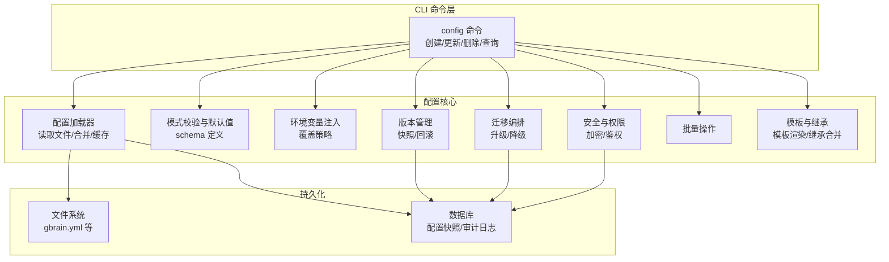
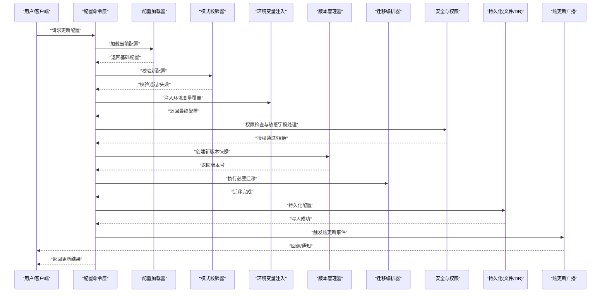
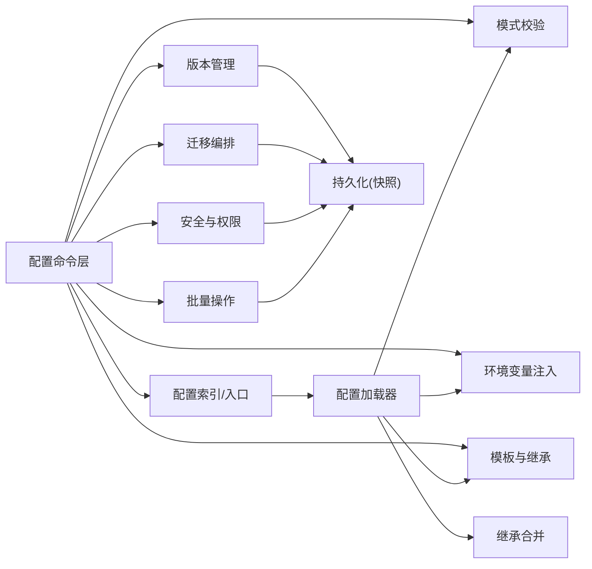

# 智能体配置管理

<cite>
**本文引用的文件**   
- [gbrain.yml](file://gbrain.yml)
- [src/commands/config.ts](file://src/commands/config.ts)
- [src/core/config/index.ts](file://src/core/config/index.ts)
- [src/core/config/env.ts](file://src/core/config/env.ts)
- [src/core/config/loader.ts](file://src/core/config/loader.ts)
- [src/core/config/schema.ts](file://src/core/config/schema.ts)
- [src/core/config/migrations.ts](file://src/core/config/migrations.ts)
- [src/core/config/versioning.ts](file://src/core/config/versioning.ts)
- [src/core/config/security.ts](file://src/core/config/security.ts)
- [src/core/config/batch.ts](file://src/core/config/batch.ts)
- [src/core/config/templates.ts](file://src/core/config/templates.ts)
- [src/core/config/inheritance.ts](file://src/core/config/inheritance.ts)
- [test/config.test.ts](file://test/config.test.ts)
- [test/config-env.test.ts](file://test/config-env.test.ts)
- [test/config-set.test.ts](file://test/config-set.test.ts)
- [test/config-unset.test.ts](file://test/config-unset.test.ts)
- [test/loadConfig-merge.test.ts](file://test/loadConfig-merge.test.ts)
</cite>

## 目录
1. [简介](#简介)
2. [项目结构](#项目结构)
3. [核心组件](#核心组件)
4. [架构总览](#架构总览)
5. [详细组件分析](#详细组件分析)
6. [依赖关系分析](#依赖关系分析)
7. [性能考虑](#性能考虑)
8. [故障排查指南](#故障排查指南)
9. [结论](#结论)
10. [附录](#附录)

## 简介
本文件面向“智能体配置管理”的 API 与实现，覆盖配置的创建、更新、删除、查询；参数结构与类型校验；默认值处理；环境变量注入；配置文件加载；动态热更新；版本管理与回滚迁移；权限控制与安全验证；敏感信息加密存储；批量操作、模板与继承机制。文档同时提供完整示例与最佳实践，帮助开发者快速集成与运维。

## 项目结构
围绕配置管理的代码主要分布在 core/config 模块与 CLI 命令层，测试用例位于 test 目录，根级示例配置在 gbrain.yml。整体采用分层设计：
- CLI 命令层：对外暴露配置管理命令（创建、更新、删除、查询等）
- 配置加载与合并层：负责读取多来源配置并合并
- 模式校验与默认值：基于 schema 进行强类型校验与默认值填充
- 环境变量注入：支持从环境变量注入或覆盖配置项
- 版本与迁移：提供版本记录、迁移脚本执行与回滚能力
- 安全与权限：对敏感字段进行加密存储与访问控制
- 批量与模板：支持批量写入、模板渲染与继承合并

图表来源
- [src/commands/config.ts](file://src/commands/config.ts)
- [src/core/config/loader.ts](file://src/core/config/loader.ts)
- [src/core/config/schema.ts](file://src/core/config/schema.ts)
- [src/core/config/env.ts](file://src/core/config/env.ts)
- [src/core/config/versioning.ts](file://src/core/config/versioning.ts)
- [src/core/config/migrations.ts](file://src/core/config/migrations.ts)
- [src/core/config/security.ts](file://src/core/config/security.ts)
- [src/core/config/batch.ts](file://src/core/config/batch.ts)
- [src/core/config/templates.ts](file://src/core/config/templates.ts)
- [src/core/config/inheritance.ts](file://src/core/config/inheritance.ts)

章节来源
- [gbrain.yml](file://gbrain.yml)
- [src/commands/config.ts](file://src/commands/config.ts)
- [src/core/config/index.ts](file://src/core/config/index.ts)

## 核心组件
- 配置加载器：统一入口，聚合文件、环境变量、模板与继承结果，输出最终配置对象
- 模式校验器：依据 schema 对输入与运行时配置进行校验，返回错误详情与修复建议
- 环境变量注入器：按优先级将环境变量注入到配置树中，支持命名空间与路径映射
- 版本管理器：维护配置版本快照，支持创建、列出、切换与回滚
- 迁移编排器：顺序执行迁移脚本，保证幂等与可逆性
- 安全与权限：对敏感字段进行加密存储与解密读取，结合权限策略限制访问范围
- 批量处理器：原子化批量写入与回滚，支持事务式提交
- 模板与继承：模板变量替换与多级继承合并，支持条件分支与选择性覆盖

章节来源
- [src/core/config/index.ts](file://src/core/config/index.ts)
- [src/core/config/loader.ts](file://src/core/config/loader.ts)
- [src/core/config/schema.ts](file://src/core/config/schema.ts)
- [src/core/config/env.ts](file://src/core/config/env.ts)
- [src/core/config/versioning.ts](file://src/core/config/versioning.ts)
- [src/core/config/migrations.ts](file://src/core/config/migrations.ts)
- [src/core/config/security.ts](file://src/core/config/security.ts)
- [src/core/config/batch.ts](file://src/core/config/batch.ts)
- [src/core/config/templates.ts](file://src/core/config/templates.ts)
- [src/core/config/inheritance.ts](file://src/core/config/inheritance.ts)

## 架构总览
下图展示一次典型“更新配置”的端到端流程，包括 CLI 调用、校验、注入、持久化、版本与迁移、以及热更新通知。

图表来源
- [src/commands/config.ts](file://src/commands/config.ts)
- [src/core/config/loader.ts](file://src/core/config/loader.ts)
- [src/core/config/schema.ts](file://src/core/config/schema.ts)
- [src/core/config/env.ts](file://src/core/config/env.ts)
- [src/core/config/versioning.ts](file://src/core/config/versioning.ts)
- [src/core/config/migrations.ts](file://src/core/config/migrations.ts)
- [src/core/config/security.ts](file://src/core/config/security.ts)

## 详细组件分析

### 配置命令层（创建/更新/删除/查询）
- 功能要点
  - 提供统一的 CLI 接口，封装底层配置操作
  - 支持单条与批量操作，返回结构化响应
  - 内置权限校验与审计日志
- 关键行为
  - 创建：生成初始配置，应用模板与默认值，写入持久化
  - 更新：增量合并，校验差异，创建版本快照，执行迁移
  - 删除：软删除标记与审计记录，保留历史版本
  - 查询：按 ID/标签/版本过滤，支持分页与投影
- 错误处理
  - 参数缺失/类型不匹配时返回明确错误码与修复提示
  - 权限不足时返回受限访问信息
  - 并发冲突时建议重试或强制覆盖

章节来源
- [src/commands/config.ts](file://src/commands/config.ts)
- [test/config.test.ts](file://test/config.test.ts)
- [test/config-set.test.ts](file://test/config-set.test.ts)
- [test/config-unset.test.ts](file://test/config-unset.test.ts)

### 配置加载与合并
- 加载顺序
  - 基础配置（文件）→ 模板渲染 → 继承合并 → 环境变量注入 → 运行时覆盖
- 合并策略
  - 深合并，数组追加或覆盖由 schema 指定
  - 冲突检测与告警，避免静默覆盖
- 缓存与热更新
  - 内存缓存最近配置，监听文件变更触发重新加载
  - 增量重算差异，减少重启开销

章节来源
- [src/core/config/loader.ts](file://src/core/config/loader.ts)
- [src/core/config/index.ts](file://src/core/config/index.ts)
- [test/loadConfig-merge.test.ts](file://test/loadConfig-merge.test.ts)

### 模式校验与默认值
- 校验规则
  - 必填字段、类型约束、枚举值、范围与正则
  - 跨字段依赖校验与业务规则
- 默认值处理
  - 未提供字段自动填充默认值
  - 条件默认值与环境相关默认值
- 错误报告
  - 定位具体路径与上下文，提供修复建议

章节来源
- [src/core/config/schema.ts](file://src/core/config/schema.ts)
- [test/config.test.ts](file://test/config.test.ts)

### 环境变量注入
- 注入方式
  - 前缀命名空间，如 AGENT_CONFIG_ 前缀映射到配置路径
  - 支持嵌套路径与数组索引
- 覆盖优先级
  - 环境变量高于文件与模板，低于显式运行时覆盖
- 安全策略
  - 敏感键名白名单与脱敏输出

章节来源
- [src/core/config/env.ts](file://src/core/config/env.ts)
- [test/config-env.test.ts](file://test/config-env.test.ts)

### 版本管理、回滚与迁移
- 版本管理
  - 每次变更生成不可变快照，包含元数据与指纹
  - 支持按时间、标签、作者筛选
- 回滚
  - 一键回滚至指定版本，自动执行反向迁移
- 迁移编排
  - 顺序执行迁移脚本，幂等与可逆
  - 失败中断与部分回滚保护

章节来源
- [src/core/config/versioning.ts](file://src/core/config/versioning.ts)
- [src/core/config/migrations.ts](file://src/core/config/migrations.ts)
- [test/config-set.test.ts](file://test/config-set.test.ts)

### 安全与权限控制
- 权限模型
  - 基于角色与资源的访问控制，细粒度到字段级
  - 操作审计与合规留痕
- 敏感信息
  - 敏感字段加密存储，按需解密
  - 传输与落盘双重保护

章节来源
- [src/core/config/security.ts](file://src/core/config/security.ts)
- [test/config.test.ts](file://test/config.test.ts)

### 批量操作
- 特性
  - 原子批量写入，失败整体回滚
  - 进度与断点续传
- 使用场景
  - 大规模环境初始化、灰度发布、批量迁移

章节来源
- [src/core/config/batch.ts](file://src/core/config/batch.ts)
- [test/config-set.test.ts](file://test/config-set.test.ts)

### 模板与继承
- 模板
  - 变量替换、条件渲染、循环片段
  - 模板仓库与版本绑定
- 继承
  - 多级继承链，选择性覆盖与合并策略
  - 冲突检测与可视化差异

章节来源
- [src/core/config/templates.ts](file://src/core/config/templates.ts)
- [src/core/config/inheritance.ts](file://src/core/config/inheritance.ts)

## 依赖关系分析
配置模块内部依赖清晰，职责单一，便于扩展与维护。

图表来源
- [src/commands/config.ts](file://src/commands/config.ts)
- [src/core/config/index.ts](file://src/core/config/index.ts)
- [src/core/config/loader.ts](file://src/core/config/loader.ts)
- [src/core/config/schema.ts](file://src/core/config/schema.ts)
- [src/core/config/env.ts](file://src/core/config/env.ts)
- [src/core/config/versioning.ts](file://src/core/config/versioning.ts)
- [src/core/config/migrations.ts](file://src/core/config/migrations.ts)
- [src/core/config/security.ts](file://src/core/config/security.ts)
- [src/core/config/batch.ts](file://src/core/config/batch.ts)
- [src/core/config/templates.ts](file://src/core/config/templates.ts)
- [src/core/config/inheritance.ts](file://src/core/config/inheritance.ts)

章节来源
- [src/core/config/index.ts](file://src/core/config/index.ts)
- [src/core/config/loader.ts](file://src/core/config/loader.ts)

## 性能考虑
- 懒加载与缓存：仅加载所需配置片段，热点配置常驻内存
- 增量合并：对比差异后局部更新，避免全量重算
- 异步与批处理：批量操作并行化，限制并发上限
- 序列化优化：大对象压缩与分块读写
- 监控指标：加载耗时、校验失败率、迁移时长、热更新延迟

[本节为通用指导，无需源码引用]

## 故障排查指南
- 常见错误
  - 校验失败：检查字段类型、必填项与依赖关系
  - 权限不足：确认角色与资源权限，查看审计日志
  - 迁移失败：查看迁移脚本日志，必要时手动回滚
  - 热更新未生效：确认监听器状态与缓存失效策略
- 诊断步骤
  - 启用调试日志，捕获完整请求链路
  - 导出配置快照与差异报告
  - 隔离环境变量与模板影响，逐步复现
- 恢复策略
  - 使用版本回滚恢复到稳定基线
  - 分批灰度发布，设置熔断与自动回退

章节来源
- [test/config.test.ts](file://test/config.test.ts)
- [test/config-env.test.ts](file://test/config-env.test.ts)
- [test/config-set.test.ts](file://test/config-set.test.ts)
- [test/config-unset.test.ts](file://test/config-unset.test.ts)

## 结论
智能体配置管理以模块化与高内聚为核心，提供完整的生命周期管理能力。通过严格的模式校验、安全的敏感信息处理、完善的版本与迁移机制，以及高效的批量与热更新能力，满足复杂生产环境的治理需求。建议在生产环境中启用审计与监控，遵循最小权限原则与灰度发布策略，确保配置变更的可控与可追溯。

[本节为总结性内容，无需源码引用]

## 附录

### API 参考（概览）
- 创建配置
  - 方法：POST /api/agent-configs
  - 入参：配置对象（受 schema 约束）
  - 返回：创建结果与版本号
- 更新配置
  - 方法：PATCH /api/agent-configs/:id
  - 入参：增量配置对象
  - 返回：更新结果与新版本号
- 删除配置
  - 方法：DELETE /api/agent-configs/:id
  - 返回：删除结果与审计记录
- 查询配置
  - 方法：GET /api/agent-configs
  - 查询参数：id、标签、版本、分页
  - 返回：配置列表与元数据
- 版本管理
  - 列出版本：GET /api/agent-configs/:id/versions
  - 切换版本：POST /api/agent-configs/:id/switch-version
  - 回滚版本：POST /api/agent-configs/:id/rollback
- 迁移
  - 执行迁移：POST /api/agent-configs/:id/migrate
  - 迁移状态：GET /api/agent-configs/:id/migration-status
- 批量操作
  - 批量写入：POST /api/agent-configs/batch
  - 批量状态：GET /api/agent-configs/batch/:jobId
- 模板与继承
  - 渲染模板：POST /api/agent-configs/render-template
  - 继承解析：GET /api/agent-configs/:id/inheritance-tree

[本节为概念性说明，无需源码引用]

### 配置示例与最佳实践
- 示例文件
  - 根级示例配置：gbrain.yml
- 最佳实践
  - 使用模板与继承组织多环境配置
  - 通过环境变量注入敏感信息，避免明文存储
  - 小步快跑，频繁提交版本，便于回滚
  - 严格遵循 schema，减少运行时错误
  - 开启审计与监控，追踪变更轨迹

章节来源
- [gbrain.yml](file://gbrain.yml)
- [test/config.test.ts](file://test/config.test.ts)