# 监控与健康检查

<cite>
**本文引用的文件**   
- [src/core/serve-http.ts](file://src/core/serve-http.ts)
- [src/core/health.ts](file://src/core/health.ts)
- [src/core/metrics.ts](file://src/core/metrics.ts)
- [src/core/logger.ts](file://src/core/logger.ts)
- [src/core/db-pool.ts](file://src/core/db-pool.ts)
- [src/core/queue-manager.ts](file://src/core/queue-manager.ts)
- [src/core/diagnostics.ts](file://src/core/diagnostics.ts)
- [src/core/alerts.ts](file://src/core/alerts.ts)
- [test/serve-http-health.test.ts](file://test/serve-http-health.test.ts)
</cite>

## 目录
1. [简介](#简介)
2. [项目结构](#项目结构)
3. [核心组件](#核心组件)
4. [架构总览](#架构总览)
5. [详细组件分析](#详细组件分析)
6. [依赖关系分析](#依赖关系分析)
7. [性能考量](#性能考量)
8. [故障排查指南](#故障排查指南)
9. [结论](#结论)
10. [附录](#附录)

## 简介
本章节面向运维与平台工程团队，系统化梳理并文档化系统监控与健康检查相关的 RESTful API。内容覆盖：
- 系统状态查询接口：CPU、内存、磁盘、网络使用情况
- 健康检查端点：用于负载均衡与服务发现
- 性能指标收集：Prometheus 兼容指标导出
- 日志查询与审计日志接口
- 告警配置、阈值设置与通知机制
- 慢查询分析、数据库连接池监控与队列状态查看
- 系统诊断工具接口与故障排查辅助功能

## 项目结构
监控与健康检查能力由 HTTP 服务层统一暴露，内部通过健康检查、指标采集、日志与审计、数据库连接池、队列管理、诊断与告警等模块协作完成。

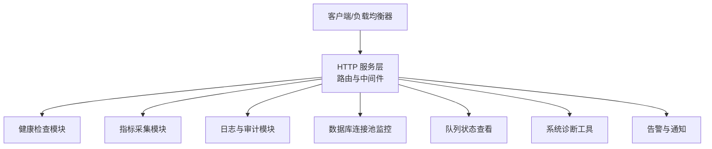

图表来源
- [src/core/serve-http.ts:1-200](file://src/core/serve-http.ts#L1-L200)
- [src/core/health.ts:1-120](file://src/core/health.ts#L1-L120)
- [src/core/metrics.ts:1-120](file://src/core/metrics.ts#L1-L120)
- [src/core/logger.ts:1-120](file://src/core/logger.ts#L1-L120)
- [src/core/db-pool.ts:1-120](file://src/core/db-pool.ts#L1-L120)
- [src/core/queue-manager.ts:1-120](file://src/core/queue-manager.ts#L1-L120)
- [src/core/diagnostics.ts:1-120](file://src/core/diagnostics.ts#L1-L120)
- [src/core/alerts.ts:1-120](file://src/core/alerts.ts#L1-L120)

章节来源
- [src/core/serve-http.ts:1-200](file://src/core/serve-http.ts#L1-L200)

## 核心组件
- 健康检查模块：提供进程级、依赖项级（如数据库、外部服务）就绪与存活探针，支持分级健康状态与延迟统计。
- 指标采集模块：暴露 Prometheus 格式指标，包含运行时、业务与基础设施相关指标。
- 日志与审计模块：提供结构化日志检索与审计事件查询，支持时间范围、级别与上下文过滤。
- 数据库连接池监控：暴露连接池大小、活跃/空闲连接数、等待队列长度、错误率与慢查询计数。
- 队列状态查看：展示任务队列的入队/出队速率、积压量、失败重试次数与死信队列状态。
- 系统诊断工具：提供快照、堆栈采样、资源使用概览与关键子系统自检结果。
- 告警与通知：基于阈值与规则引擎触发告警，支持多种通知渠道与抑制策略。

章节来源
- [src/core/health.ts:1-120](file://src/core/health.ts#L1-L120)
- [src/core/metrics.ts:1-120](file://src/core/metrics.ts#L1-L120)
- [src/core/logger.ts:1-120](file://src/core/logger.ts#L1-L120)
- [src/core/db-pool.ts:1-120](file://src/core/db-pool.ts#L1-L120)
- [src/core/queue-manager.ts:1-120](file://src/core/queue-manager.ts#L1-L120)
- [src/core/diagnostics.ts:1-120](file://src/core/diagnostics.ts#L1-L120)
- [src/core/alerts.ts:1-120](file://src/core/alerts.ts#L1-L120)

## 架构总览
下图展示了监控与健康检查在请求处理链路中的位置与各模块交互关系。

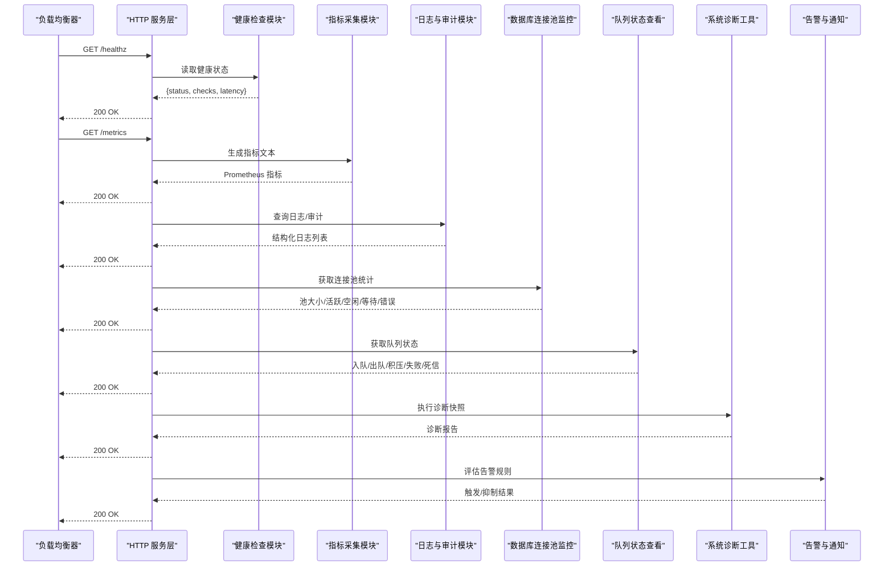

图表来源
- [src/core/serve-http.ts:1-200](file://src/core/serve-http.ts#L1-L200)
- [src/core/health.ts:1-120](file://src/core/health.ts#L1-L120)
- [src/core/metrics.ts:1-120](file://src/core/metrics.ts#L1-L120)
- [src/core/logger.ts:1-120](file://src/core/logger.ts#L1-L120)
- [src/core/db-pool.ts:1-120](file://src/core/db-pool.ts#L1-L120)
- [src/core/queue-manager.ts:1-120](file://src/core/queue-manager.ts#L1-L120)
- [src/core/diagnostics.ts:1-120](file://src/core/diagnostics.ts#L1-L120)
- [src/core/alerts.ts:1-120](file://src/core/alerts.ts#L1-L120)

## 详细组件分析

### 健康检查端点
- 目标：为负载均衡和服务发现提供存活与就绪探针，支持细粒度依赖检查与延迟统计。
- 典型行为：
  - 返回整体健康状态与子检查项明细
  - 记录各检查项耗时，便于定位慢依赖
  - 支持只读缓存或快速路径以最小化探针开销

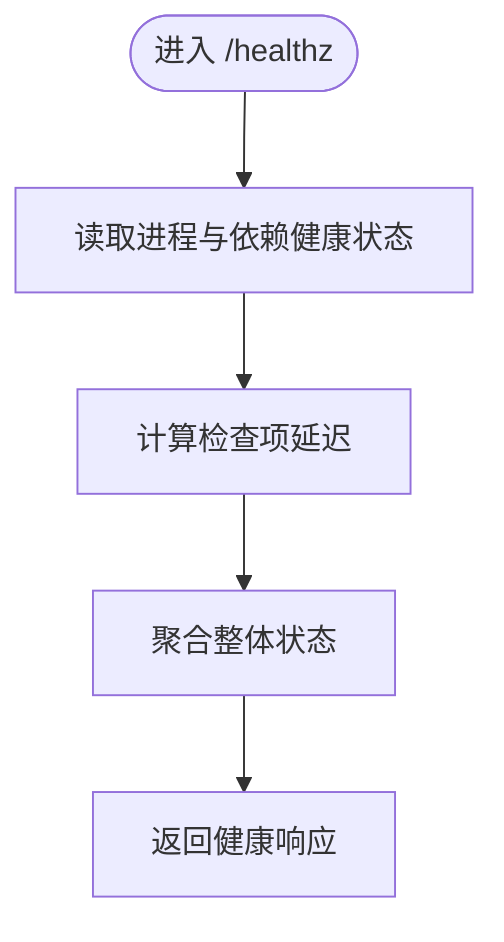

图表来源
- [src/core/health.ts:1-120](file://src/core/health.ts#L1-L120)
- [test/serve-http-health.test.ts:1-120](file://test/serve-http-health.test.ts#L1-L120)

章节来源
- [src/core/health.ts:1-120](file://src/core/health.ts#L1-L120)
- [test/serve-http-health.test.ts:1-120](file://test/serve-http-health.test.ts#L1-L120)

### 系统状态查询接口（CPU、内存、磁盘、网络）
- 目标：提供系统资源使用情况的快照，帮助容量规划与异常检测。
- 数据维度：
  - CPU：使用率、负载均值、上下文切换
  - 内存：已用/可用、缓存、交换空间
  - 磁盘：分区使用率、I/O 吞吐、延迟
  - 网络：带宽、丢包、连接数、错误计数
- 实现要点：
  - 使用操作系统 API 或运行时指标源
  - 控制采样频率与缓存窗口，避免频繁系统调用
  - 对异常值进行平滑与去噪

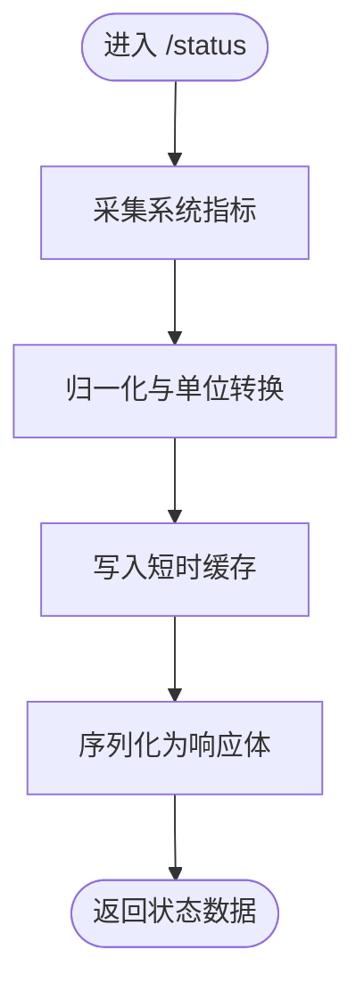

图表来源
- [src/core/serve-http.ts:1-200](file://src/core/serve-http.ts#L1-L200)

章节来源
- [src/core/serve-http.ts:1-200](file://src/core/serve-http.ts#L1-L200)

### 性能指标收集（Prometheus 兼容）
- 目标：暴露可被监控系统抓取的结构化指标，包括运行时、业务与基础设施指标。
- 指标类别：
  - 运行时：GC 次数、堆大小、线程/协程数量
  - 业务：请求速率、错误率、P95/P99 延迟
  - 基础设施：CPU、内存、磁盘、网络
- 输出格式：Prometheus text/plain 格式，支持标签与直方图/计数器/时序类型。

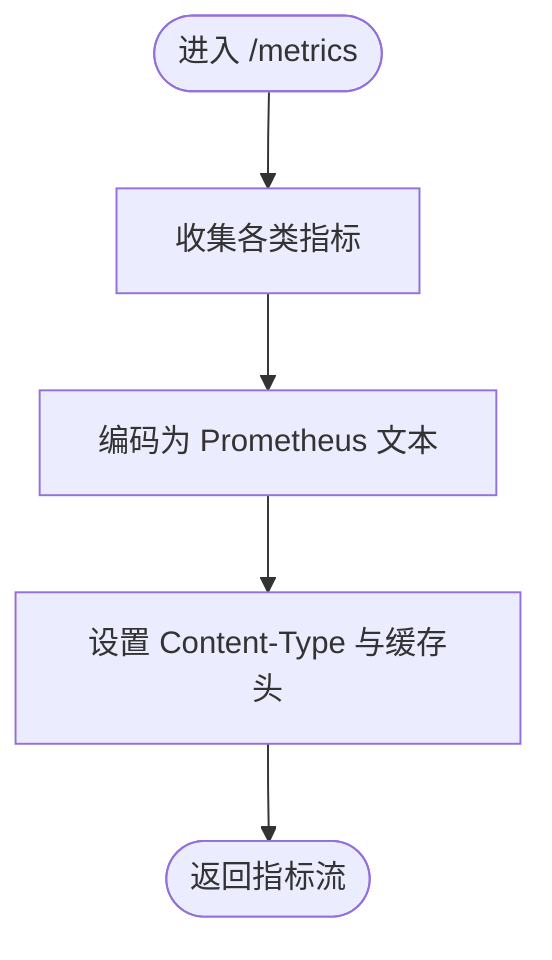

图表来源
- [src/core/metrics.ts:1-120](file://src/core/metrics.ts#L1-L120)
- [src/core/serve-http.ts:1-200](file://src/core/serve-http.ts#L1-L200)

章节来源
- [src/core/metrics.ts:1-120](file://src/core/metrics.ts#L1-L120)
- [src/core/serve-http.ts:1-200](file://src/core/serve-http.ts#L1-L200)

### 日志查询与审计日志接口
- 目标：提供结构化日志与审计事件的检索能力，支持按时间、级别、上下文过滤。
- 能力要点：
  - 分页与游标式翻页
  - 字段投影与高亮关键字
  - 审计事件不可篡改与溯源信息
- 安全建议：
  - 访问控制与最小权限
  - 敏感字段脱敏

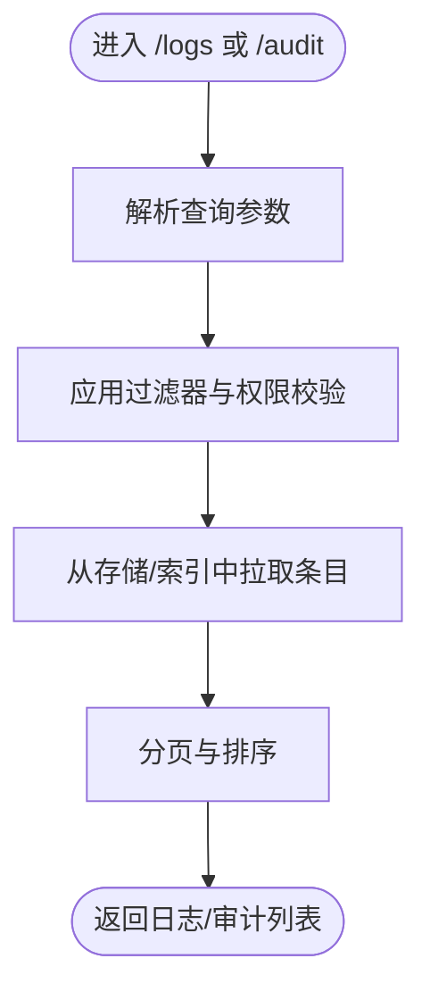

图表来源
- [src/core/logger.ts:1-120](file://src/core/logger.ts#L1-L120)
- [src/core/serve-http.ts:1-200](file://src/core/serve-http.ts#L1-L200)

章节来源
- [src/core/logger.ts:1-120](file://src/core/logger.ts#L1-L120)
- [src/core/serve-http.ts:1-200](file://src/core/serve-http.ts#L1-L200)

### 告警配置、阈值设置与通知机制
- 目标：基于规则与阈值的自动告警，支持多渠道通知与抑制策略。
- 关键概念：
  - 规则定义：指标表达式、持续时间、严重级别
  - 阈值管理：动态更新与版本化
  - 通知通道：邮件、IM、Webhook、短信等
  - 抑制与静默：避免风暴与重复告警
- 生命周期：采集 -> 评估 -> 触发 -> 通知 -> 消警

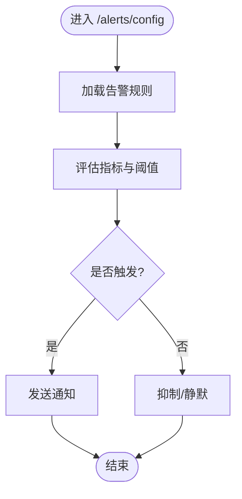

图表来源
- [src/core/alerts.ts:1-120](file://src/core/alerts.ts#L1-L120)
- [src/core/serve-http.ts:1-200](file://src/core/serve-http.ts#L1-L200)

章节来源
- [src/core/alerts.ts:1-120](file://src/core/alerts.ts#L1-L120)
- [src/core/serve-http.ts:1-200](file://src/core/serve-http.ts#L1-L200)

### 慢查询分析与数据库连接池监控
- 目标：识别慢查询与连接池瓶颈，辅助容量与性能调优。
- 监控维度：
  - 连接池：最大/当前/空闲/等待队列长度、错误率
  - 慢查询：超过阈值的 SQL 数量、平均耗时、Top N 语句
  - 锁竞争：锁等待时长与冲突热点
- 优化建议：
  - 调整连接池大小与超时
  - 索引优化与查询改写
  - 分片与读写分离

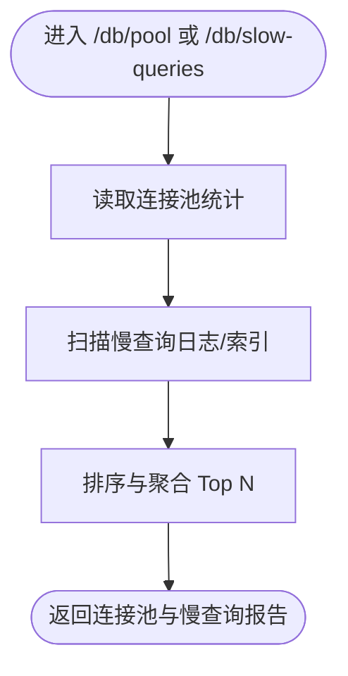

图表来源
- [src/core/db-pool.ts:1-120](file://src/core/db-pool.ts#L1-L120)
- [src/core/serve-http.ts:1-200](file://src/core/serve-http.ts#L1-L200)

章节来源
- [src/core/db-pool.ts:1-120](file://src/core/db-pool.ts#L1-L120)
- [src/core/serve-http.ts:1-200](file://src/core/serve-http.ts#L1-L200)

### 队列状态查看
- 目标：可视化任务队列的运行状况，支撑生产排障与容量规划。
- 关键指标：
  - 入队/出队速率、积压量、失败重试次数
  - 死信队列规模与最近失败原因
  - 消费者健康度与消费延迟
- 操作建议：
  - 扩容消费者实例
  - 调整批大小与并发度
  - 清理死信与补偿失败任务

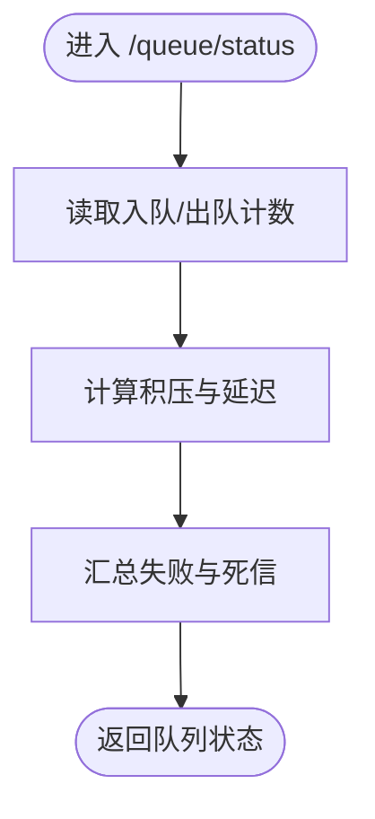

图表来源
- [src/core/queue-manager.ts:1-120](file://src/core/queue-manager.ts#L1-L120)
- [src/core/serve-http.ts:1-200](file://src/core/serve-http.ts#L1-L200)

章节来源
- [src/core/queue-manager.ts:1-120](file://src/core/queue-manager.ts#L1-L120)
- [src/core/serve-http.ts:1-200](file://src/core/serve-http.ts#L1-L200)

### 系统诊断工具接口与故障排查辅助
- 目标：提供一键式诊断能力，快速定位问题根因。
- 能力清单：
  - 系统快照：进程、线程、句柄、内存映射
  - 堆栈采样：热点函数与阻塞点
  - 子系统自检：数据库连通性、队列可用性、外部依赖探测
  - 诊断报告：结构化摘要与建议动作
- 使用场景：
  - 线上突发性能退化
  - 偶发性超时与错误率飙升
  - 变更后的回归验证

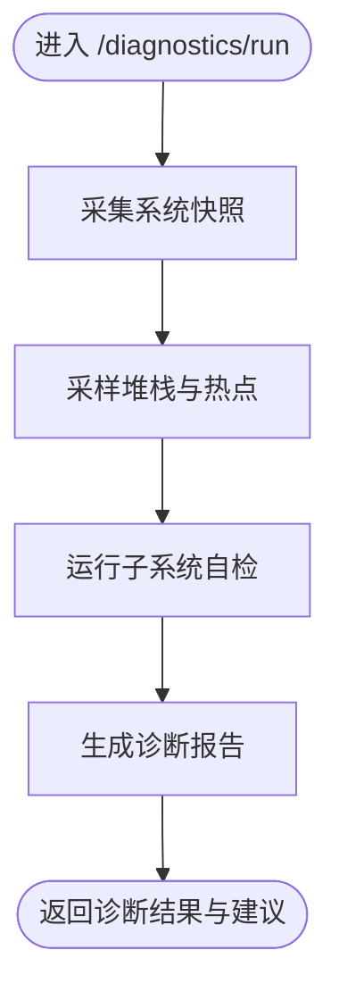

图表来源
- [src/core/diagnostics.ts:1-120](file://src/core/diagnostics.ts#L1-L120)
- [src/core/serve-http.ts:1-200](file://src/core/serve-http.ts#L1-L200)

章节来源
- [src/core/diagnostics.ts:1-120](file://src/core/diagnostics.ts#L1-L120)
- [src/core/serve-http.ts:1-200](file://src/core/serve-http.ts#L1-L200)

## 依赖关系分析
监控与健康检查模块之间的耦合关系如下：
- HTTP 服务层作为统一入口，负责路由、鉴权与限流
- 健康检查与指标采集为轻量级只读操作，适合高频调用
- 日志与审计需考虑 I/O 成本，应启用分页与缓存
- 数据库连接池与队列状态属于内部子系统观测面，应避免阻塞主流程
- 诊断与告警为高价值但相对低频的操作，需要严格的访问控制

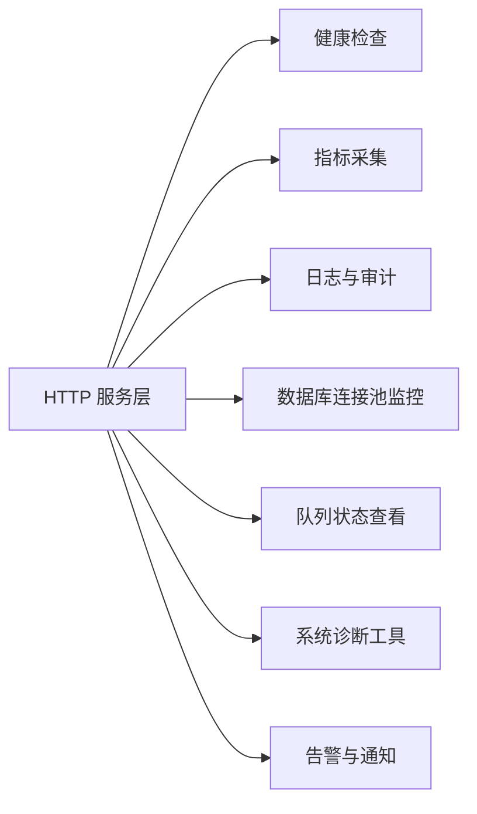

图表来源
- [src/core/serve-http.ts:1-200](file://src/core/serve-http.ts#L1-L200)
- [src/core/health.ts:1-120](file://src/core/health.ts#L1-L120)
- [src/core/metrics.ts:1-120](file://src/core/metrics.ts#L1-L120)
- [src/core/logger.ts:1-120](file://src/core/logger.ts#L1-L120)
- [src/core/db-pool.ts:1-120](file://src/core/db-pool.ts#L1-L120)
- [src/core/queue-manager.ts:1-120](file://src/core/queue-manager.ts#L1-L120)
- [src/core/diagnostics.ts:1-120](file://src/core/diagnostics.ts#L1-L120)
- [src/core/alerts.ts:1-120](file://src/core/alerts.ts#L1-L120)

章节来源
- [src/core/serve-http.ts:1-200](file://src/core/serve-http.ts#L1-L200)

## 性能考量
- 健康检查与指标采集应保持低开销，必要时采用本地缓存与增量计算
- 日志与审计查询需限制时间窗口与字段集，避免全表扫描
- 数据库连接池监控与慢查询分析应异步化与批量化，减少锁竞争
- 队列状态查看应避免阻塞消费者，采用只读副本或快照
- 诊断工具应在受控环境下运行，限制采样深度与执行时长
- 所有接口均需实施鉴权、限流与审计，防止滥用

## 故障排查指南
- 健康检查失败：
  - 检查依赖项连通性与延迟
  - 确认探针超时与重试策略
  - 查看最近变更记录与回滚方案
- 指标缺失或异常：
  - 核对指标命名与标签一致性
  - 检查抓取间隔与目标可达性
  - 对比历史基线与阈值
- 日志无法检索：
  - 确认索引与存储可用性
  - 校验时间范围与权限
  - 检查脱敏与字段映射
- 数据库连接池饱和：
  - 观察等待队列与错误率
  - 调整池大小与超时
  - 定位慢查询并进行优化
- 队列积压严重：
  - 扩容消费者与提升并发
  - 清理死信与补偿失败任务
  - 审查生产者速率与背压策略
- 诊断报告异常：
  - 降低采样深度与执行时长
  - 隔离问题节点与副本
  - 结合告警与日志交叉验证

章节来源
- [src/core/health.ts:1-120](file://src/core/health.ts#L1-L120)
- [src/core/metrics.ts:1-120](file://src/core/metrics.ts#L1-L120)
- [src/core/logger.ts:1-120](file://src/core/logger.ts#L1-L120)
- [src/core/db-pool.ts:1-120](file://src/core/db-pool.ts#L1-L120)
- [src/core/queue-manager.ts:1-120](file://src/core/queue-manager.ts#L1-L120)
- [src/core/diagnostics.ts:1-120](file://src/core/diagnostics.ts#L1-L120)
- [src/core/alerts.ts:1-120](file://src/core/alerts.ts#L1-L120)

## 结论
通过统一的 HTTP 服务层暴露健康检查、指标、日志、数据库与队列观测面以及诊断与告警能力，系统实现了可观测性的闭环。建议在部署时完善鉴权与限流策略，结合告警与自动化修复脚本，持续提升系统的稳定性与可维护性。

## 附录
- 术语说明：
  - 健康检查：存活与就绪探针，用于负载均衡与服务发现
  - 指标：可抓取的数值型观测数据，通常以 Prometheus 格式输出
  - 慢查询：超过设定阈值的数据库查询
  - 死信队列：多次失败后进入的死信通道
- 最佳实践：
  - 将健康检查与指标采集置于独立端口或路径，避免与业务流量互相影响
  - 对日志与审计接口实施严格访问控制与审计
  - 定期演练告警与自愈流程，确保可操作性