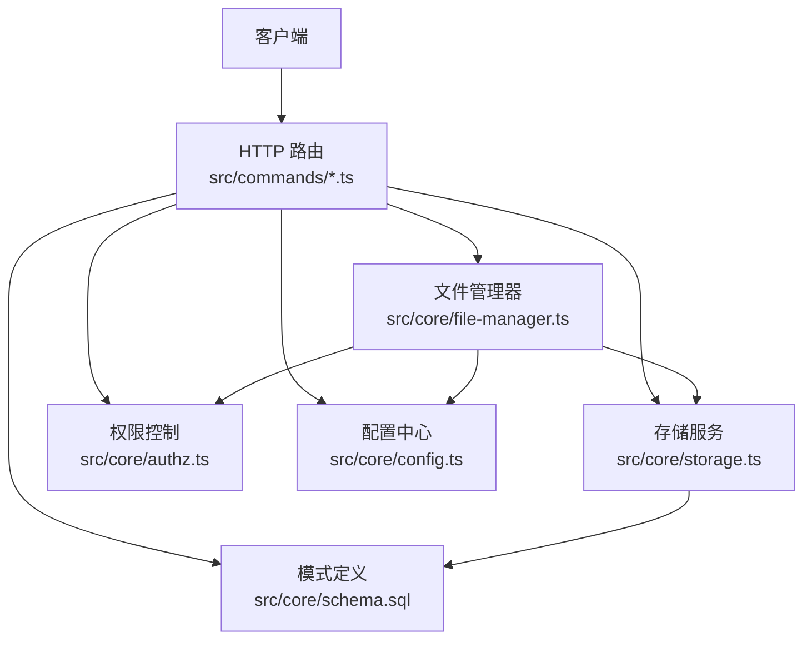
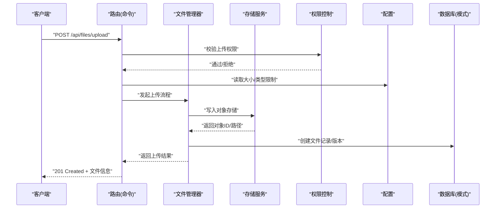
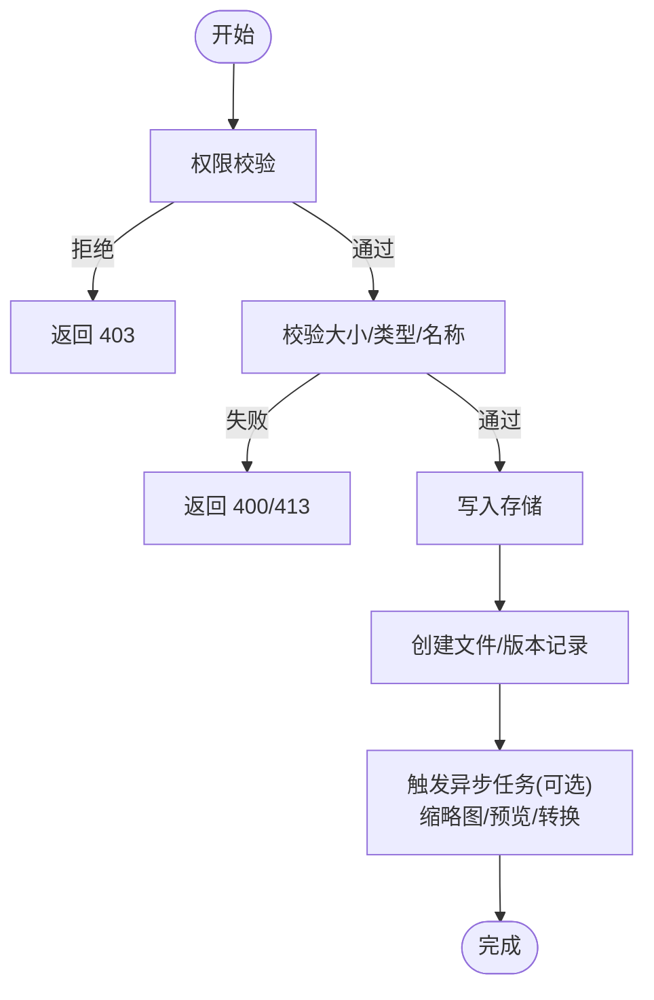
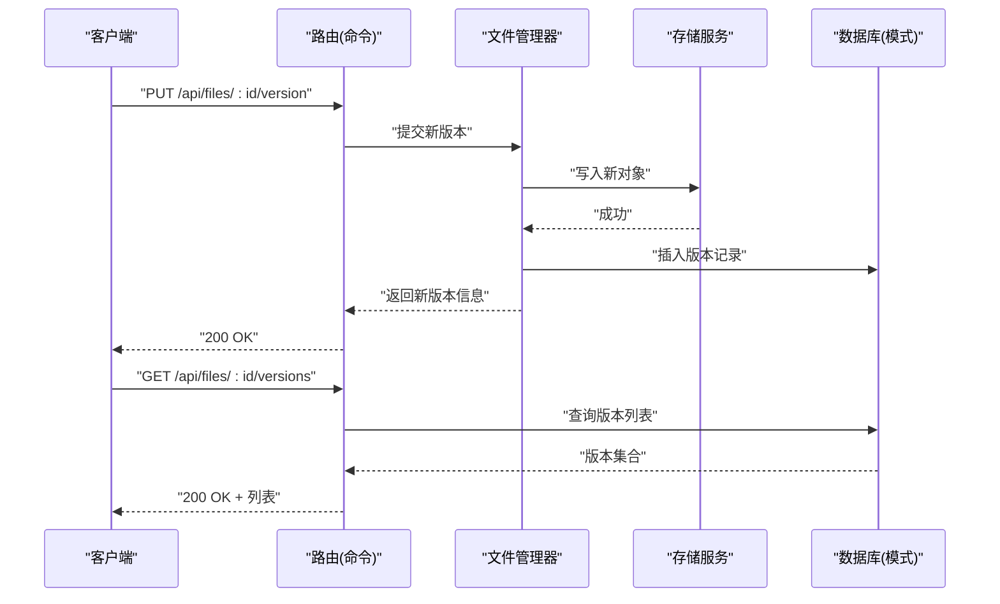
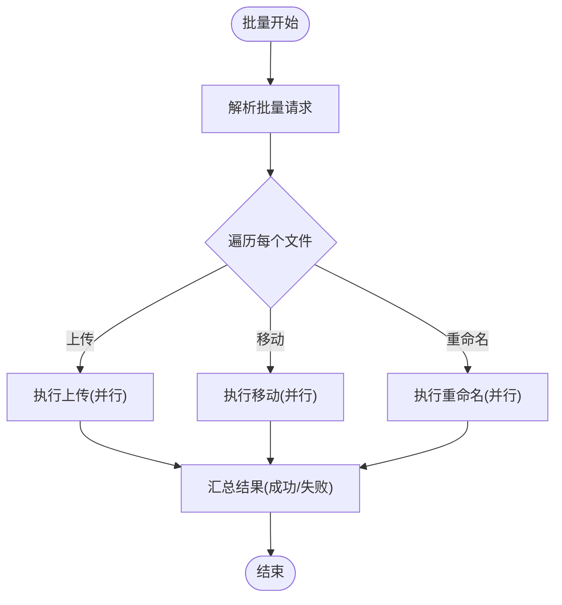
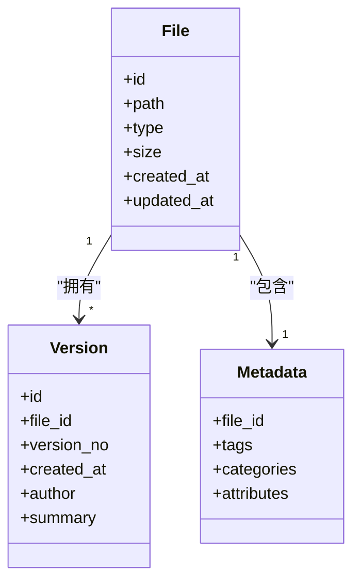
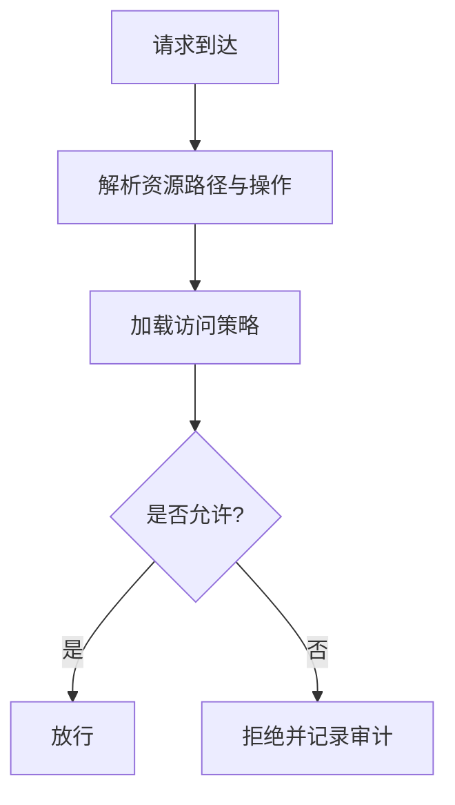
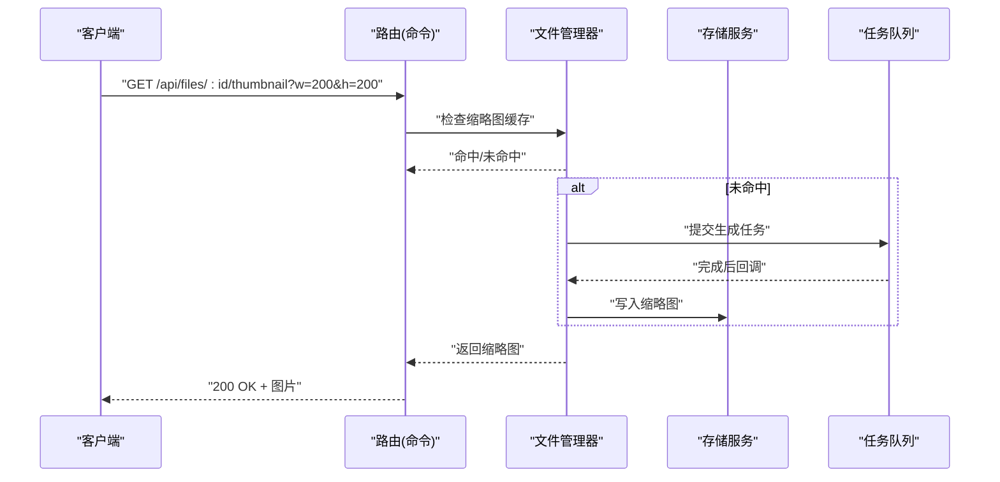
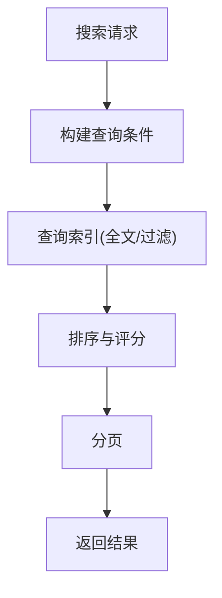
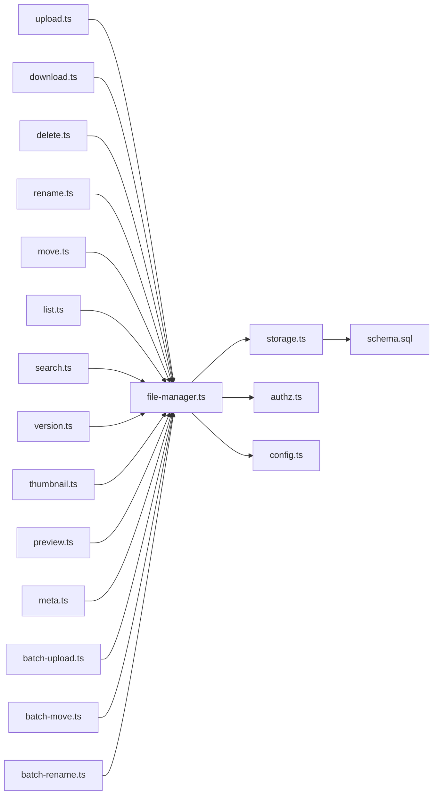

# 内容管理

<cite>
**本文引用的文件**   
- [src/core/storage.ts](file://src/core/storage.ts)
- [src/core/file-manager.ts](file://src/core/file-manager.ts)
- [src/commands/upload.ts](file://src/commands/upload.ts)
- [src/commands/download.ts](file://src/commands/download.ts)
- [src/commands/delete.ts](file://src/commands/delete.ts)
- [src/commands/rename.ts](file://src/commands/rename.ts)
- [src/commands/move.ts](file://src/commands/move.ts)
- [src/commands/list.ts](file://src/commands/list.ts)
- [src/commands/search.ts](file://src/commands/search.ts)
- [src/commands/version.ts](file://src/commands/version.ts)
- [src/commands/thumbnail.ts](file://src/commands/thumbnail.ts)
- [src/commands/preview.ts](file://src/commands/preview.ts)
- [src/commands/meta.ts](file://src/commands/meta.ts)
- [src/commands/batch-upload.ts](file://src/commands/batch-upload.ts)
- [src/commands/batch-move.ts](file://src/commands/batch-move.ts)
- [src/commands/batch-rename.ts](file://src/commands/batch-rename.ts)
- [src/core/authz.ts](file://src/core/authz.ts)
- [src/core/config.ts](file://src/core/config.ts)
- [src/core/schema.sql](file://src/core/schema.sql)
</cite>

## 目录
1. [简介](#简介)
2. [项目结构](#项目结构)
3. [核心组件](#核心组件)
4. [架构总览](#架构总览)
5. [详细组件分析](#详细组件分析)
6. [依赖分析](#依赖分析)
7. [性能考虑](#性能考虑)
8. [故障排查指南](#故障排查指南)
9. [结论](#结论)
10. [附录：RESTful API 参考](#附录restful-api-参考)

## 简介
本章节面向内容管理的 RESTful API，覆盖文件的上传、下载、删除与版本管理；支持批量操作（批量上传、移动、重命名）；提供元数据管理（标签、分类、属性）；说明权限控制与访问策略；包含预览、缩略图生成与格式转换能力；并提供搜索与过滤接口（按类型、日期、标签）。

## 项目结构
仓库采用“命令 + 核心服务”的分层组织方式。与内容管理相关的代码主要分布在以下位置：
- 命令层（对外暴露的 HTTP 路由入口）：src/commands/*
- 核心服务层（存储、权限、配置、模式定义等）：src/core/*

图表来源
- [src/commands/upload.ts](file://src/commands/upload.ts)
- [src/commands/download.ts](file://src/commands/download.ts)
- [src/commands/delete.ts](file://src/commands/delete.ts)
- [src/commands/rename.ts](file://src/commands/rename.ts)
- [src/commands/move.ts](file://src/commands/move.ts)
- [src/commands/list.ts](file://src/commands/list.ts)
- [src/commands/search.ts](file://src/commands/search.ts)
- [src/commands/version.ts](file://src/commands/version.ts)
- [src/commands/thumbnail.ts](file://src/commands/thumbnail.ts)
- [src/commands/preview.ts](file://src/commands/preview.ts)
- [src/commands/meta.ts](file://src/commands/meta.ts)
- [src/commands/batch-upload.ts](file://src/commands/batch-upload.ts)
- [src/commands/batch-move.ts](file://src/commands/batch-move.ts)
- [src/commands/batch-rename.ts](file://src/commands/batch-rename.ts)
- [src/core/file-manager.ts](file://src/core/file-manager.ts)
- [src/core/storage.ts](file://src/core/storage.ts)
- [src/core/authz.ts](file://src/core/authz.ts)
- [src/core/config.ts](file://src/core/config.ts)
- [src/core/schema.sql](file://src/core/schema.sql)

章节来源
- [src/commands/upload.ts](file://src/commands/upload.ts)
- [src/commands/download.ts](file://src/commands/download.ts)
- [src/commands/delete.ts](file://src/commands/delete.ts)
- [src/commands/rename.ts](file://src/commands/rename.ts)
- [src/commands/move.ts](file://src/commands/move.ts)
- [src/commands/list.ts](file://src/commands/list.ts)
- [src/commands/search.ts](file://src/commands/search.ts)
- [src/commands/version.ts](file://src/commands/version.ts)
- [src/commands/thumbnail.ts](file://src/commands/thumbnail.ts)
- [src/commands/preview.ts](file://src/commands/preview.ts)
- [src/commands/meta.ts](file://src/commands/meta.ts)
- [src/commands/batch-upload.ts](file://src/commands/batch-upload.ts)
- [src/commands/batch-move.ts](file://src/commands/batch-move.ts)
- [src/commands/batch-rename.ts](file://src/commands/batch-rename.ts)
- [src/core/file-manager.ts](file://src/core/file-manager.ts)
- [src/core/storage.ts](file://src/core/storage.ts)
- [src/core/authz.ts](file://src/core/authz.ts)
- [src/core/config.ts](file://src/core/config.ts)
- [src/core/schema.sql](file://src/core/schema.sql)

## 核心组件
- 文件管理器（File Manager）
  - 职责：编排上传、下载、删除、重命名、移动、版本化、元数据更新、缩略图与预览、搜索与列表等业务流程。
  - 关键能力：调用存储服务读写对象；执行权限校验；触发异步任务（如缩略图/预览/格式转换）；维护版本记录。
- 存储服务（Storage Service）
  - 职责：抽象底层存储实现（本地磁盘、云对象存储等），提供统一的读写、列举、删除、拷贝、元数据读取接口。
  - 关键能力：分块上传、断点续传、并发下载、流式处理、生命周期策略。
- 权限控制（Authz）
  - 职责：基于用户/角色/资源路径的访问控制，决定读、写、删、管理元数据、版本管理等操作的授权结果。
- 配置中心（Config）
  - 职责：集中管理文件大小限制、允许的文件类型、存储后端参数、并发度、缓存与压缩策略等。
- 模式定义（Schema）
  - 职责：定义文件、版本、元数据、索引等数据库表结构与约束，确保一致性。

章节来源
- [src/core/file-manager.ts](file://src/core/file-manager.ts)
- [src/core/storage.ts](file://src/core/storage.ts)
- [src/core/authz.ts](file://src/core/authz.ts)
- [src/core/config.ts](file://src/core/config.ts)
- [src/core/schema.sql](file://src/core/schema.sql)

## 架构总览
整体采用“命令层 -> 核心服务层 -> 存储/权限/配置/模式”的分层架构。命令层负责解析请求、鉴权、参数校验、调用业务编排；核心服务层封装领域逻辑并协调外部依赖。

图表来源
- [src/commands/upload.ts](file://src/commands/upload.ts)
- [src/core/file-manager.ts](file://src/core/file-manager.ts)
- [src/core/storage.ts](file://src/core/storage.ts)
- [src/core/authz.ts](file://src/core/authz.ts)
- [src/core/config.ts](file://src/core/config.ts)
- [src/core/schema.sql](file://src/core/schema.sql)

## 详细组件分析

### 上传与下载
- 上传
  - 支持单文件与分块上传；可携带元数据（标签、分类、自定义属性）。
  - 校验：权限、大小、类型白名单、文件名合法性。
  - 行为：落盘/对象存储持久化；创建文件记录与初始版本；可选触发缩略图/预览/格式转换任务。
- 下载
  - 支持范围下载（Range）、流式传输、断点续传。
  - 校验：权限、路径有效性、版本选择。
  - 响应：根据 Content-Type 返回二进制或文本。

图表来源
- [src/commands/upload.ts](file://src/commands/upload.ts)
- [src/core/file-manager.ts](file://src/core/file-manager.ts)
- [src/core/storage.ts](file://src/core/storage.ts)
- [src/core/config.ts](file://src/core/config.ts)
- [src/core/schema.sql](file://src/core/schema.sql)

章节来源
- [src/commands/upload.ts](file://src/commands/upload.ts)
- [src/commands/download.ts](file://src/commands/download.ts)
- [src/core/file-manager.ts](file://src/core/file-manager.ts)
- [src/core/storage.ts](file://src/core/storage.ts)
- [src/core/config.ts](file://src/core/config.ts)
- [src/core/schema.sql](file://src/core/schema.sql)

### 删除与版本管理
- 删除
  - 软删除/硬删除策略可配置；级联清理缩略图/预览/转换产物。
  - 权限：需具备删除权限。
- 版本管理
  - 每次覆盖写入产生新版本；支持回滚到指定版本；列出历史版本。
  - 版本记录包含时间戳、作者、变更摘要等元信息。

图表来源
- [src/commands/version.ts](file://src/commands/version.ts)
- [src/core/file-manager.ts](file://src/core/file-manager.ts)
- [src/core/storage.ts](file://src/core/storage.ts)
- [src/core/schema.sql](file://src/core/schema.sql)

章节来源
- [src/commands/delete.ts](file://src/commands/delete.ts)
- [src/commands/version.ts](file://src/commands/version.ts)
- [src/core/file-manager.ts](file://src/core/file-manager.ts)
- [src/core/storage.ts](file://src/core/storage.ts)
- [src/core/schema.sql](file://src/core/schema.sql)

### 批量操作（上传、移动、重命名）
- 批量上传
  - 支持多文件并发上传；可设置统一元数据；失败重试与部分成功报告。
- 批量移动/重命名
  - 支持对多个文件进行目标目录移动或批量重命名；原子性保证与错误汇总。

图表来源
- [src/commands/batch-upload.ts](file://src/commands/batch-upload.ts)
- [src/commands/batch-move.ts](file://src/commands/batch-move.ts)
- [src/commands/batch-rename.ts](file://src/commands/batch-rename.ts)
- [src/core/file-manager.ts](file://src/core/file-manager.ts)
- [src/core/storage.ts](file://src/core/storage.ts)

章节来源
- [src/commands/batch-upload.ts](file://src/commands/batch-upload.ts)
- [src/commands/batch-move.ts](file://src/commands/batch-move.ts)
- [src/commands/batch-rename.ts](file://src/commands/batch-rename.ts)
- [src/core/file-manager.ts](file://src/core/file-manager.ts)
- [src/core/storage.ts](file://src/core/storage.ts)

### 元数据管理（标签、分类、属性）
- 能力
  - 设置/更新标签、分类、自定义属性；支持批量更新。
  - 查询时可按标签、分类、属性键值过滤。
- 存储
  - 元数据与文件记录关联，支持扩展字段与索引优化。

图表来源
- [src/core/schema.sql](file://src/core/schema.sql)
- [src/commands/meta.ts](file://src/commands/meta.ts)
- [src/core/file-manager.ts](file://src/core/file-manager.ts)

章节来源
- [src/commands/meta.ts](file://src/commands/meta.ts)
- [src/core/file-manager.ts](file://src/core/file-manager.ts)
- [src/core/schema.sql](file://src/core/schema.sql)

### 权限控制与访问策略
- 模型
  - 基于用户/角色/资源路径的访问控制；细粒度到读、写、删、元数据管理、版本管理。
- 策略
  - 默认拒绝；显式授权；继承父目录策略；支持临时令牌与短期访问。
- 审计
  - 记录关键操作日志（上传、删除、版本切换、元数据变更）。

图表来源
- [src/core/authz.ts](file://src/core/authz.ts)
- [src/core/config.ts](file://src/core/config.ts)

章节来源
- [src/core/authz.ts](file://src/core/authz.ts)
- [src/core/config.ts](file://src/core/config.ts)

### 预览、缩略图与格式转换
- 缩略图
  - 针对图片/文档自动生成缩略图；支持尺寸与质量参数；缓存命中优先。
- 预览
  - 文本/Markdown/代码高亮预览；PDF/Office 转 HTML 预览；视频首帧截图。
- 格式转换
  - 按需将源文件转换为常用格式（如 PDF→PNG、DOCX→HTML）；异步队列处理。

图表来源
- [src/commands/thumbnail.ts](file://src/commands/thumbnail.ts)
- [src/commands/preview.ts](file://src/commands/preview.ts)
- [src/core/file-manager.ts](file://src/core/file-manager.ts)
- [src/core/storage.ts](file://src/core/storage.ts)

章节来源
- [src/commands/thumbnail.ts](file://src/commands/thumbnail.ts)
- [src/commands/preview.ts](file://src/commands/preview.ts)
- [src/core/file-manager.ts](file://src/core/file-manager.ts)
- [src/core/storage.ts](file://src/core/storage.ts)

### 搜索与过滤
- 能力
  - 全文检索、按类型/日期/标签/分类/属性过滤、分页排序。
  - 支持组合条件与高亮片段。
- 索引
  - 文件元数据与内容建立倒排索引；增量更新；定期重建。

图表来源
- [src/commands/search.ts](file://src/commands/search.ts)
- [src/commands/list.ts](file://src/commands/list.ts)
- [src/core/file-manager.ts](file://src/core/file-manager.ts)
- [src/core/schema.sql](file://src/core/schema.sql)

章节来源
- [src/commands/search.ts](file://src/commands/search.ts)
- [src/commands/list.ts](file://src/commands/list.ts)
- [src/core/file-manager.ts](file://src/core/file-manager.ts)
- [src/core/schema.sql](file://src/core/schema.sql)

## 依赖分析
- 命令层依赖核心服务：所有命令均依赖文件管理器、权限、配置与存储。
- 核心服务间耦合：文件管理器聚合存储、权限、配置；存储依赖模式定义。
- 外部依赖：对象存储、数据库、任务队列（用于异步处理）。

图表来源
- [src/commands/upload.ts](file://src/commands/upload.ts)
- [src/commands/download.ts](file://src/commands/download.ts)
- [src/commands/delete.ts](file://src/commands/delete.ts)
- [src/commands/rename.ts](file://src/commands/rename.ts)
- [src/commands/move.ts](file://src/commands/move.ts)
- [src/commands/list.ts](file://src/commands/list.ts)
- [src/commands/search.ts](file://src/commands/search.ts)
- [src/commands/version.ts](file://src/commands/version.ts)
- [src/commands/thumbnail.ts](file://src/commands/thumbnail.ts)
- [src/commands/preview.ts](file://src/commands/preview.ts)
- [src/commands/meta.ts](file://src/commands/meta.ts)
- [src/commands/batch-upload.ts](file://src/commands/batch-upload.ts)
- [src/commands/batch-move.ts](file://src/commands/batch-move.ts)
- [src/commands/batch-rename.ts](file://src/commands/batch-rename.ts)
- [src/core/file-manager.ts](file://src/core/file-manager.ts)
- [src/core/storage.ts](file://src/core/storage.ts)
- [src/core/authz.ts](file://src/core/authz.ts)
- [src/core/config.ts](file://src/core/config.ts)
- [src/core/schema.sql](file://src/core/schema.sql)

章节来源
- [src/commands/upload.ts](file://src/commands/upload.ts)
- [src/commands/download.ts](file://src/commands/download.ts)
- [src/commands/delete.ts](file://src/commands/delete.ts)
- [src/commands/rename.ts](file://src/commands/rename.ts)
- [src/commands/move.ts](file://src/commands/move.ts)
- [src/commands/list.ts](file://src/commands/list.ts)
- [src/commands/search.ts](file://src/commands/search.ts)
- [src/commands/version.ts](file://src/commands/version.ts)
- [src/commands/thumbnail.ts](file://src/commands/thumbnail.ts)
- [src/commands/preview.ts](file://src/commands/preview.ts)
- [src/commands/meta.ts](file://src/commands/meta.ts)
- [src/commands/batch-upload.ts](file://src/commands/batch-upload.ts)
- [src/commands/batch-move.ts](file://src/commands/batch-move.ts)
- [src/commands/batch-rename.ts](file://src/commands/batch-rename.ts)
- [src/core/file-manager.ts](file://src/core/file-manager.ts)
- [src/core/storage.ts](file://src/core/storage.ts)
- [src/core/authz.ts](file://src/core/authz.ts)
- [src/core/config.ts](file://src/core/config.ts)
- [src/core/schema.sql](file://src/core/schema.sql)

## 性能考虑
- 上传
  - 启用分块上传与并发；服务端开启流式处理；合理设置最大请求体大小。
- 下载
  - 使用 Range 头支持断点续传；启用 CDN 缓存静态资源；大文件走直链。
- 缩略图/预览/转换
  - 异步任务队列；结果缓存；按需生成；限制并发与超时。
- 搜索
  - 增量索引；冷热分离；分页与限流；避免全表扫描。
- 存储
  - 对象存储分层（热/温/冷）；生命周期策略自动归档或删除过期对象。

[本节为通用指导，不直接分析具体文件]

## 故障排查指南
- 常见错误码
  - 400：参数校验失败（类型、大小、路径非法）。
  - 401：未认证。
  - 403：无权限。
  - 404：资源不存在。
  - 413：超过大小限制。
  - 429：限流。
  - 500/503：内部错误或存储不可用。
- 定位步骤
  - 查看命令层日志（路由、参数、权限判定）。
  - 检查核心服务日志（文件管理器、存储、权限、配置）。
  - 核对数据库模式与索引状态。
  - 验证对象存储连通性与配额。
- 恢复建议
  - 重试幂等接口（上传分块、下载）；回滚到上一版本；重建缩略图/预览缓存。

章节来源
- [src/commands/upload.ts](file://src/commands/upload.ts)
- [src/commands/download.ts](file://src/commands/download.ts)
- [src/commands/delete.ts](file://src/commands/delete.ts)
- [src/commands/version.ts](file://src/commands/version.ts)
- [src/core/file-manager.ts](file://src/core/file-manager.ts)
- [src/core/storage.ts](file://src/core/storage.ts)
- [src/core/authz.ts](file://src/core/authz.ts)
- [src/core/config.ts](file://src/core/config.ts)
- [src/core/schema.sql](file://src/core/schema.sql)

## 结论
本内容管理系统以清晰的命令-服务分层组织，围绕文件生命周期提供完整的 RESTful 能力，涵盖上传下载、删除、版本、批处理、元数据、权限、预览/缩略图/转换以及搜索过滤。通过配置化策略与异步任务机制，系统具备良好的可扩展性与稳定性。

[本节为总结，不直接分析具体文件]

## 附录：RESTful API 参考

说明
- 基础路径：/api
- 认证：在请求头中携带认证令牌（示例：Authorization: Bearer <token>）。
- 通用参数：分页使用 page、per_page；排序使用 sort、order。

- 文件上传
  - POST /api/files/upload
  - 功能：上传单个文件，支持分块与元数据。
  - 请求体：multipart/form-data，字段包括 file、metadata（JSON）。
  - 响应：201 Created，返回文件 ID、路径、版本、元数据。
  - 限制：大小与类型由配置中心控制。
  - 权限：需要 write 权限。
  - 章节来源
    - [src/commands/upload.ts](file://src/commands/upload.ts)
    - [src/core/config.ts](file://src/core/config.ts)
    - [src/core/authz.ts](file://src/core/authz.ts)

- 文件下载
  - GET /api/files/:id
  - 功能：下载指定文件，支持 Range 头。
  - 响应：200 OK，Content-Type 与文件一致。
  - 权限：需要 read 权限。
  - 章节来源
    - [src/commands/download.ts](file://src/commands/download.ts)
    - [src/core/authz.ts](file://src/core/authz.ts)

- 删除文件
  - DELETE /api/files/:id
  - 功能：删除文件或软删除（可配置）。
  - 权限：需要 delete 权限。
  - 章节来源
    - [src/commands/delete.ts](file://src/commands/delete.ts)
    - [src/core/authz.ts](file://src/core/authz.ts)

- 版本管理
  - PUT /api/files/:id/version
  - 功能：提交新版本（覆盖写入）。
  - 响应：200 OK，返回新版本信息。
  - 权限：需要 write 权限。
  - 章节来源
    - [src/commands/version.ts](file://src/commands/version.ts)
    - [src/core/authz.ts](file://src/core/authz.ts)

  - GET /api/files/:id/versions
  - 功能：列出历史版本。
  - 响应：200 OK，返回版本列表。
  - 权限：需要 read 权限。
  - 章节来源
    - [src/commands/version.ts](file://src/commands/version.ts)
    - [src/core/authz.ts](file://src/core/authz.ts)

- 重命名/移动
  - PATCH /api/files/:id/rename
  - 功能：重命名文件。
  - 请求体：{ name }。
  - 权限：需要 write 权限。
  - 章节来源
    - [src/commands/rename.ts](file://src/commands/rename.ts)
    - [src/core/authz.ts](file://src/core/authz.ts)

  - PATCH /api/files/:id/move
  - 功能：移动到目标目录。
  - 请求体：{ destination_path }。
  - 权限：需要 write 权限。
  - 章节来源
    - [src/commands/move.ts](file://src/commands/move.ts)
    - [src/core/authz.ts](file://src/core/authz.ts)

- 列表与搜索
  - GET /api/files
  - 功能：列出文件，支持分页、排序、过滤（类型、日期、标签、分类、属性）。
  - 查询参数：page、per_page、sort、order、type、date_from、date_to、tags、categories、attributes。
  - 权限：需要 read 权限。
  - 章节来源
    - [src/commands/list.ts](file://src/commands/list.ts)
    - [src/core/authz.ts](file://src/core/authz.ts)

  - GET /api/files/search
  - 功能：全文检索与过滤。
  - 查询参数：q、type、date_from、date_to、tags、categories、attributes、page、per_page。
  - 权限：需要 read 权限。
  - 章节来源
    - [src/commands/search.ts](file://src/commands/search.ts)
    - [src/core/authz.ts](file://src/core/authz.ts)

- 元数据管理
  - GET /api/files/:id/meta
  - 功能：获取文件元数据（标签、分类、属性）。
  - 权限：需要 read 权限。
  - 章节来源
    - [src/commands/meta.ts](file://src/commands/meta.ts)
    - [src/core/authz.ts](file://src/core/authz.ts)

  - PUT /api/files/:id/meta
  - 功能：更新元数据。
  - 请求体：{ tags, categories, attributes }。
  - 权限：需要 metadata 权限。
  - 章节来源
    - [src/commands/meta.ts](file://src/commands/meta.ts)
    - [src/core/authz.ts](file://src/core/authz.ts)

- 预览与缩略图
  - GET /api/files/:id/preview
  - 功能：文本/Markdown/代码高亮预览；PDF/Office 转 HTML。
  - 权限：需要 read 权限。
  - 章节来源
    - [src/commands/preview.ts](file://src/commands/preview.ts)
    - [src/core/authz.ts](file://src/core/authz.ts)

  - GET /api/files/:id/thumbnail
  - 功能：生成/获取缩略图，支持 w、h、quality 参数。
  - 权限：需要 read 权限。
  - 章节来源
    - [src/commands/thumbnail.ts](file://src/commands/thumbnail.ts)
    - [src/core/authz.ts](file://src/core/authz.ts)

- 批量操作
  - POST /api/files/batch/upload
  - 功能：批量上传，支持并发与统一元数据。
  - 请求体：files[]、metadata（可选）。
  - 权限：需要 write 权限。
  - 章节来源
    - [src/commands/batch-upload.ts](file://src/commands/batch-upload.ts)
    - [src/core/authz.ts](file://src/core/authz.ts)

  - POST /api/files/batch/move
  - 功能：批量移动至目标目录。
  - 请求体：{ ids[], destination_path }。
  - 权限：需要 write 权限。
  - 章节来源
    - [src/commands/batch-move.ts](file://src/commands/batch-move.ts)
    - [src/core/authz.ts](file://src/core/authz.ts)

  - POST /api/files/batch/rename
  - 功能：批量重命名。
  - 请求体：{ mappings: [{ id, name }] }。
  - 权限：需要 write 权限。
  - 章节来源
    - [src/commands/batch-rename.ts](file://src/commands/batch-rename.ts)
    - [src/core/authz.ts](file://src/core/authz.ts)

- 支持的格式与大小限制
  - 类型白名单与大小上限由配置中心控制，可在部署时调整。
  - 章节来源
    - [src/core/config.ts](file://src/core/config.ts)

- 存储策略
  - 对象存储后端、生命周期策略、冷热分层由配置中心与存储服务共同实现。
  - 章节来源
    - [src/core/config.ts](file://src/core/config.ts)
    - [src/core/storage.ts](file://src/core/storage.ts)