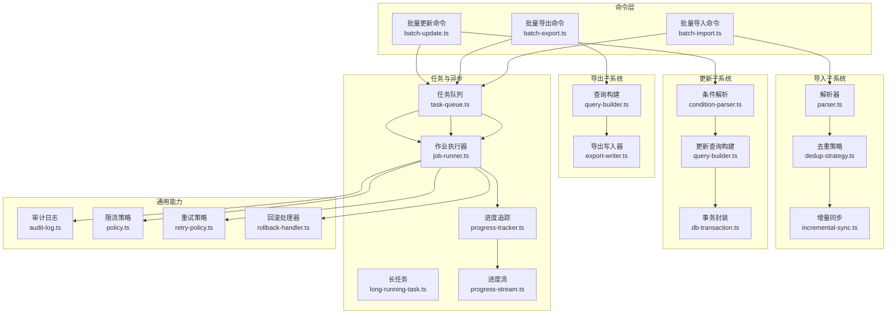
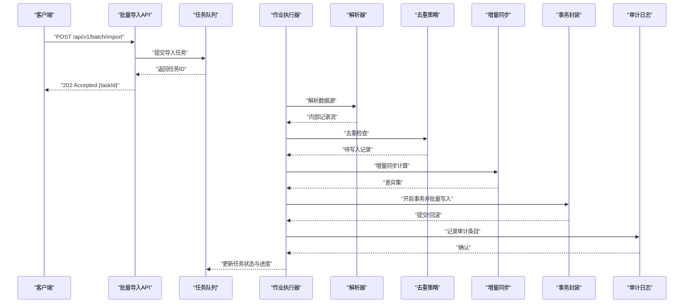
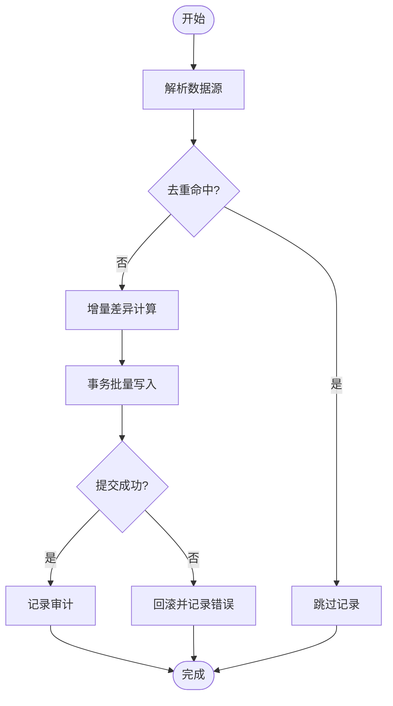
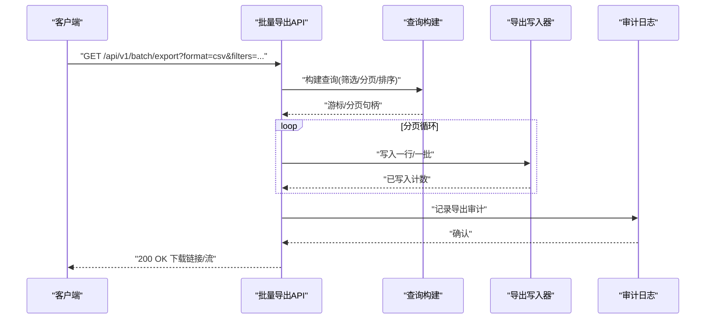
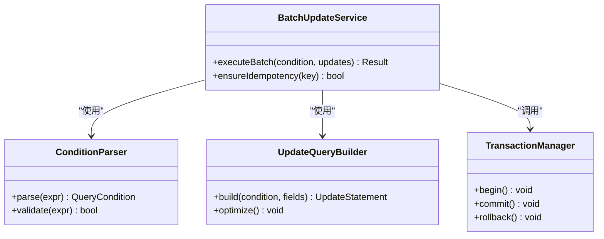
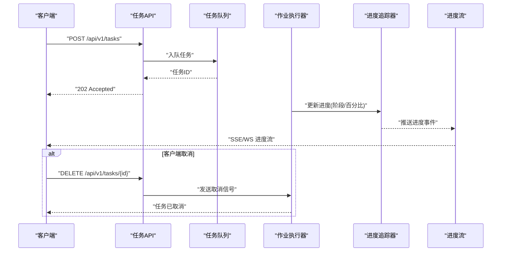
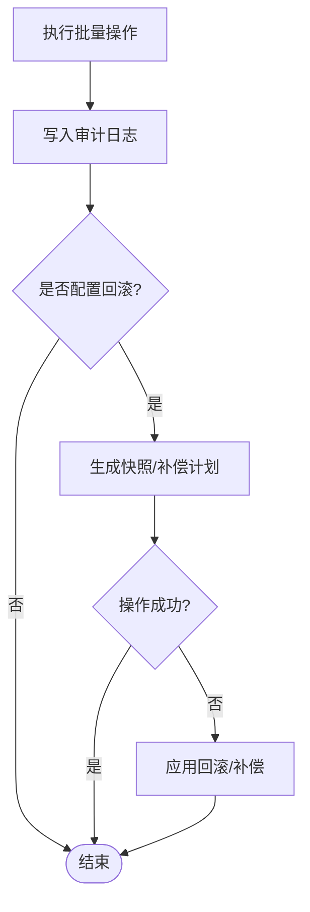
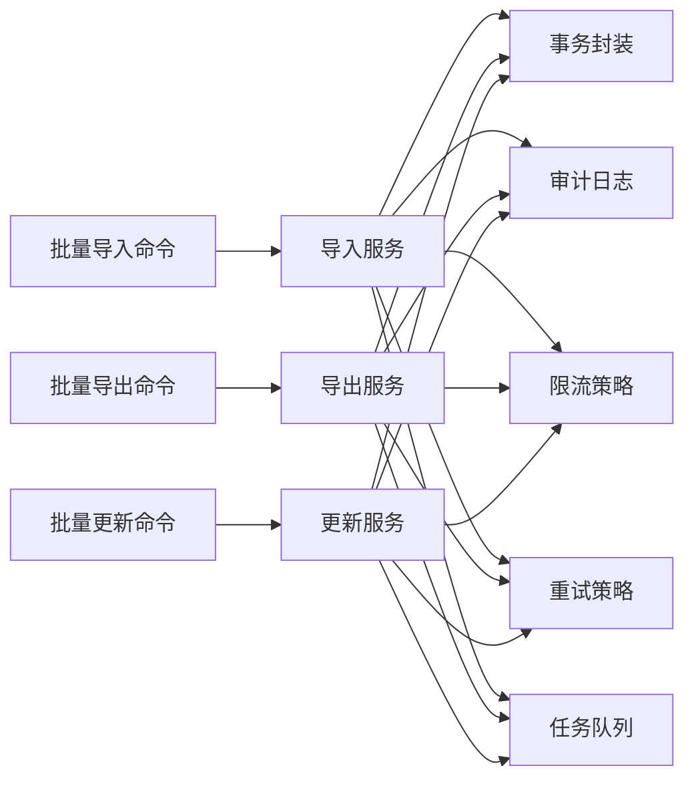

# 批量操作

<cite>
**本文引用的文件**   
- [src/commands/batch-import.ts](file://src/commands/batch-import.ts)
- [src/commands/batch-export.ts](file://src/commands/batch-export.ts)
- [src/commands/batch-update.ts](file://src/commands/batch-update.ts)
- [src/core/queue/task-queue.ts](file://src/core/queue/task-queue.ts)
- [src/core/queue/job-runner.ts](file://src/core/queue/job-runner.ts)
- [src/core/progress/progress-stream.ts](file://src/core/progress/progress-stream.ts)
- [src/core/audit/audit-log.ts](file://src/core/audit/audit-log.ts)
- [src/core/transaction/db-transaction.ts](file://src/core/transaction/db-transaction.ts)
- [src/core/rate-limit/policy.ts](file://src/core/rate-limit/policy.ts)
- [src/core/storage/export-writer.ts](file://src/core/storage/export-writer.ts)
- [src/core/import/parser.ts](file://src/core/import/parser.ts)
- [src/core/import/dedup-strategy.ts](file://src/core/import/dedup-strategy.ts)
- [src/core/import/incremental-sync.ts](file://src/core/import/incremental-sync.ts)
- [src/core/update/query-builder.ts](file://src/core/update/query-builder.ts)
- [src/core/update/condition-parser.ts](file://src/core/update/condition-parser.ts)
- [src/core/async-task/long-running-task.ts](file://src/core/async-task/long-running-task.ts)
- [src/core/async-task/progress-tracker.ts](file://src/core/async-task/progress-tracker.ts)
- [src/core/error/retry-policy.ts](file://src/core/error/retry-policy.ts)
- [src/core/error/rollback-handler.ts](file://src/core/error/rollback-handler.ts)
</cite>

## 目录
1. [简介](#简介)
2. [项目结构](#项目结构)
3. [核心组件](#核心组件)
4. [架构总览](#架构总览)
5. [详细组件分析](#详细组件分析)
6. [依赖分析](#依赖分析)
7. [性能考虑](#性能考虑)
8. [故障排查指南](#故障排查指南)
9. [结论](#结论)
10. [附录](#附录)

## 简介
本文件面向需要实现“批量操作”的开发者与集成方，提供一套 RESTful API 的设计说明与实现要点。内容覆盖：
- 批量导入接口：支持多种数据格式（JSON、CSV、Parquet 等）与增量更新策略（基于签名/时间戳/唯一键）。
- 批量导出接口：支持数据筛选、分页、排序与多格式输出（JSON、CSV、Parquet）。
- 批量更新接口：支持条件更新、幂等性与事务处理。
- 任务队列管理：任务提交、状态监控、错误重试与失败隔离。
- 异步长耗时任务：进度跟踪、断点续跑与取消。
- 性能优化与资源控制：并发度、限流、背压、内存与磁盘水位线。
- 审计与回滚：全链路审计日志、可追溯变更与一键回滚。

## 项目结构
为支撑上述能力，代码按职责分层组织，关键模块如下：
- 命令层：对外暴露 CLI/HTTP 入口，解析参数并编排流程。
- 导入子系统：解析器、去重策略、增量同步。
- 导出子系统：查询构建、写入器（多格式）。
- 更新子系统：条件解析、查询构建、事务封装。
- 任务与异步：任务队列、作业执行器、长任务与进度追踪。
- 通用能力：审计日志、事务、限流、错误重试与回滚。

**图表来源**
- [src/commands/batch-import.ts](file://src/commands/batch-import.ts)
- [src/commands/batch-export.ts](file://src/commands/batch-export.ts)
- [src/commands/batch-update.ts](file://src/commands/batch-update.ts)
- [src/core/import/parser.ts](file://src/core/import/parser.ts)
- [src/core/import/dedup-strategy.ts](file://src/core/import/dedup-strategy.ts)
- [src/core/import/incremental-sync.ts](file://src/core/import/incremental-sync.ts)
- [src/core/update/query-builder.ts](file://src/core/update/query-builder.ts)
- [src/core/update/condition-parser.ts](file://src/core/update/condition-parser.ts)
- [src/core/transaction/db-transaction.ts](file://src/core/transaction/db-transaction.ts)
- [src/core/queue/task-queue.ts](file://src/core/queue/task-queue.ts)
- [src/core/queue/job-runner.ts](file://src/core/queue/job-runner.ts)
- [src/core/progress/progress-stream.ts](file://src/core/progress/progress-stream.ts)
- [src/core/audit/audit-log.ts](file://src/core/audit/audit-log.ts)
- [src/core/rate-limit/policy.ts](file://src/core/rate-limit/policy.ts)
- [src/core/error/retry-policy.ts](file://src/core/error/retry-policy.ts)
- [src/core/error/rollback-handler.ts](file://src/core/error/rollback-handler.ts)
- [src/core/storage/export-writer.ts](file://src/core/storage/export-writer.ts)
- [src/core/async-task/long-running-task.ts](file://src/core/async-task/long-running-task.ts)
- [src/core/async-task/progress-tracker.ts](file://src/core/async-task/progress-tracker.ts)

**章节来源**
- [src/commands/batch-import.ts](file://src/commands/batch-import.ts)
- [src/commands/batch-export.ts](file://src/commands/batch-export.ts)
- [src/commands/batch-update.ts](file://src/commands/batch-update.ts)
- [src/core/queue/task-queue.ts](file://src/core/queue/task-queue.ts)
- [src/core/queue/job-runner.ts](file://src/core/queue/job-runner.ts)
- [src/core/progress/progress-stream.ts](file://src/core/progress/progress-stream.ts)
- [src/core/audit/audit-log.ts](file://src/core/audit/audit-log.ts)
- [src/core/transaction/db-transaction.ts](file://src/core/transaction/db-transaction.ts)
- [src/core/rate-limit/policy.ts](file://src/core/rate-limit/policy.ts)
- [src/core/storage/export-writer.ts](file://src/core/storage/export-writer.ts)
- [src/core/import/parser.ts](file://src/core/import/parser.ts)
- [src/core/import/dedup-strategy.ts](file://src/core/import/dedup-strategy.ts)
- [src/core/import/incremental-sync.ts](file://src/core/import/incremental-sync.ts)
- [src/core/update/query-builder.ts](file://src/core/update/query-builder.ts)
- [src/core/update/condition-parser.ts](file://src/core/update/condition-parser.ts)
- [src/core/async-task/long-running-task.ts](file://src/core/async-task/long-running-task.ts)
- [src/core/async-task/progress-tracker.ts](file://src/core/async-task/progress-tracker.ts)
- [src/core/error/retry-policy.ts](file://src/core/error/retry-policy.ts)
- [src/core/error/rollback-handler.ts](file://src/core/error/rollback-handler.ts)

## 核心组件
- 批量导入
  - 输入：多格式数据源（JSON/CSV/Parquet），支持分片上传与校验。
  - 解析：统一解析器将不同格式转换为内部记录模型。
  - 去重：基于唯一键或指纹的去重策略，避免重复写入。
  - 增量：基于签名/时间戳/版本号的增量同步，仅处理新增与变更。
- 批量导出
  - 筛选：字段投影、条件过滤、范围查询、分页与排序。
  - 转换：多格式输出（JSON/CSV/Parquet），支持压缩与流式写入。
- 批量更新
  - 条件：表达式解析与编译，支持复杂条件组合。
  - 事务：批量写操作在事务中执行，保证一致性。
  - 幂等：通过幂等键或版本号确保重复提交安全。
- 任务队列
  - 提交：REST 提交任务，返回任务 ID。
  - 监控：查询任务状态、进度与结果。
  - 重试：指数退避与最大重试次数控制。
- 异步长任务
  - 进度：事件流推送进度与中间结果。
  - 取消：支持客户端主动取消。
- 审计与回滚
  - 审计：所有变更写入审计日志，包含操作者、时间、影响范围。
  - 回滚：基于快照或反向操作的原子回滚。

**章节来源**
- [src/core/import/parser.ts](file://src/core/import/parser.ts)
- [src/core/import/dedup-strategy.ts](file://src/core/import/dedup-strategy.ts)
- [src/core/import/incremental-sync.ts](file://src/core/import/incremental-sync.ts)
- [src/core/storage/export-writer.ts](file://src/core/storage/export-writer.ts)
- [src/core/update/condition-parser.ts](file://src/core/update/condition-parser.ts)
- [src/core/update/query-builder.ts](file://src/core/update/query-builder.ts)
- [src/core/transaction/db-transaction.ts](file://src/core/transaction/db-transaction.ts)
- [src/core/queue/task-queue.ts](file://src/core/queue/task-queue.ts)
- [src/core/queue/job-runner.ts](file://src/core/queue/job-runner.ts)
- [src/core/async-task/long-running-task.ts](file://src/core/async-task/long-running-task.ts)
- [src/core/async-task/progress-tracker.ts](file://src/core/async-task/progress-tracker.ts)
- [src/core/audit/audit-log.ts](file://src/core/audit/audit-log.ts)
- [src/core/error/retry-policy.ts](file://src/core/error/retry-policy.ts)
- [src/core/error/rollback-handler.ts](file://src/core/error/rollback-handler.ts)

## 架构总览
整体采用“命令编排 + 领域服务 + 基础设施”的分层设计。命令层负责参数校验与流程编排；领域服务承载导入、导出、更新的核心逻辑；基础设施提供队列、事务、审计、限流、重试等横切能力。

**图表来源**
- [src/commands/batch-import.ts](file://src/commands/batch-import.ts)
- [src/core/queue/task-queue.ts](file://src/core/queue/task-queue.ts)
- [src/core/queue/job-runner.ts](file://src/core/queue/job-runner.ts)
- [src/core/import/parser.ts](file://src/core/import/parser.ts)
- [src/core/import/dedup-strategy.ts](file://src/core/import/dedup-strategy.ts)
- [src/core/import/incremental-sync.ts](file://src/core/import/incremental-sync.ts)
- [src/core/transaction/db-transaction.ts](file://src/core/transaction/db-transaction.ts)
- [src/core/audit/audit-log.ts](file://src/core/audit/audit-log.ts)

## 详细组件分析

### 批量导入组件
- 功能要点
  - 多格式解析：统一抽象出记录模型，屏蔽底层格式差异。
  - 去重策略：支持基于唯一键、内容指纹、哈希指纹的策略选择。
  - 增量同步：对比目标侧签名/时间戳/版本号，生成差异集。
  - 事务写入：批量写入在事务边界内，失败自动回滚。
- 关键流程
  - 提交任务 -> 解析 -> 去重 -> 增量计算 -> 事务写入 -> 审计记录 -> 状态更新。

**图表来源**
- [src/core/import/parser.ts](file://src/core/import/parser.ts)
- [src/core/import/dedup-strategy.ts](file://src/core/import/dedup-strategy.ts)
- [src/core/import/incremental-sync.ts](file://src/core/import/incremental-sync.ts)
- [src/core/transaction/db-transaction.ts](file://src/core/transaction/db-transaction.ts)
- [src/core/audit/audit-log.ts](file://src/core/audit/audit-log.ts)

**章节来源**
- [src/commands/batch-import.ts](file://src/commands/batch-import.ts)
- [src/core/import/parser.ts](file://src/core/import/parser.ts)
- [src/core/import/dedup-strategy.ts](file://src/core/import/dedup-strategy.ts)
- [src/core/import/incremental-sync.ts](file://src/core/import/incremental-sync.ts)
- [src/core/transaction/db-transaction.ts](file://src/core/transaction/db-transaction.ts)
- [src/core/audit/audit-log.ts](file://src/core/audit/audit-log.ts)

### 批量导出组件
- 功能要点
  - 筛选与投影：支持字段选择、条件过滤、范围与分页。
  - 格式转换：JSON/CSV/Parquet 输出，支持压缩与流式写入。
  - 顺序与稳定性：可选排序键与稳定输出。
- 关键流程
  - 构建查询 -> 分页读取 -> 转换格式 -> 流式写出 -> 审计记录。

**图表来源**
- [src/commands/batch-export.ts](file://src/commands/batch-export.ts)
- [src/core/storage/export-writer.ts](file://src/core/storage/export-writer.ts)
- [src/core/audit/audit-log.ts](file://src/core/audit/audit-log.ts)

**章节来源**
- [src/commands/batch-export.ts](file://src/commands/batch-export.ts)
- [src/core/storage/export-writer.ts](file://src/core/storage/export-writer.ts)
- [src/core/audit/audit-log.ts](file://src/core/audit/audit-log.ts)

### 批量更新组件
- 功能要点
  - 条件解析：表达式到查询条件的编译，支持布尔组合与函数。
  - 查询构建：根据条件生成高效更新语句。
  - 事务处理：批量更新在事务中执行，失败回滚。
  - 幂等性：通过幂等键或版本号避免重复更新。
- 关键流程
  - 解析条件 -> 构建更新 -> 事务执行 -> 审计记录 -> 状态反馈。

**图表来源**
- [src/core/update/condition-parser.ts](file://src/core/update/condition-parser.ts)
- [src/core/update/query-builder.ts](file://src/core/update/query-builder.ts)
- [src/core/transaction/db-transaction.ts](file://src/core/transaction/db-transaction.ts)

**章节来源**
- [src/commands/batch-update.ts](file://src/commands/batch-update.ts)
- [src/core/update/condition-parser.ts](file://src/core/update/condition-parser.ts)
- [src/core/update/query-builder.ts](file://src/core/update/query-builder.ts)
- [src/core/transaction/db-transaction.ts](file://src/core/transaction/db-transaction.ts)

### 任务队列与异步长任务
- 任务队列
  - 提交：REST 接口创建任务，持久化任务元数据。
  - 调度：作业执行器从队列拉取任务，分配工作进程。
  - 状态：运行中、排队、完成、失败、取消。
- 异步长任务
  - 进度：进度追踪器记录百分比与阶段信息。
  - 流式：进度流推送实时进度事件。
  - 取消：支持客户端取消请求，执行器响应中断。

**图表来源**
- [src/core/queue/task-queue.ts](file://src/core/queue/task-queue.ts)
- [src/core/queue/job-runner.ts](file://src/core/queue/job-runner.ts)
- [src/core/async-task/long-running-task.ts](file://src/core/async-task/long-running-task.ts)
- [src/core/async-task/progress-tracker.ts](file://src/core/async-task/progress-tracker.ts)
- [src/core/progress/progress-stream.ts](file://src/core/progress/progress-stream.ts)

**章节来源**
- [src/core/queue/task-queue.ts](file://src/core/queue/task-queue.ts)
- [src/core/queue/job-runner.ts](file://src/core/queue/job-runner.ts)
- [src/core/async-task/long-running-task.ts](file://src/core/async-task/long-running-task.ts)
- [src/core/async-task/progress-tracker.ts](file://src/core/async-task/progress-tracker.ts)
- [src/core/progress/progress-stream.ts](file://src/core/progress/progress-stream.ts)

### 审计与回滚
- 审计日志
  - 记录操作者、时间、对象标识、变更摘要、前后快照（脱敏）。
  - 支持按任务ID、操作类型、时间范围检索。
- 回滚机制
  - 基于快照的反向操作或补偿事务。
  - 原子回滚：失败时自动触发，保证最终一致性。

**图表来源**
- [src/core/audit/audit-log.ts](file://src/core/audit/audit-log.ts)
- [src/core/error/rollback-handler.ts](file://src/core/error/rollback-handler.ts)

**章节来源**
- [src/core/audit/audit-log.ts](file://src/core/audit/audit-log.ts)
- [src/core/error/rollback-handler.ts](file://src/core/error/rollback-handler.ts)

## 依赖分析
- 组件耦合
  - 命令层依赖导入/导出/更新服务，不直接访问数据库。
  - 导入/导出/更新服务依赖事务、审计、限流、重试等基础设施。
  - 任务队列与作业执行器解耦业务逻辑，便于扩展与水平扩容。
- 外部依赖
  - 存储后端（文件系统/对象存储）用于导出与快照。
  - 消息队列/持久化存储用于任务队列。
  - 数据库用于事务与审计日志。

**图表来源**
- [src/commands/batch-import.ts](file://src/commands/batch-import.ts)
- [src/commands/batch-export.ts](file://src/commands/batch-export.ts)
- [src/commands/batch-update.ts](file://src/commands/batch-update.ts)
- [src/core/transaction/db-transaction.ts](file://src/core/transaction/db-transaction.ts)
- [src/core/audit/audit-log.ts](file://src/core/audit/audit-log.ts)
- [src/core/rate-limit/policy.ts](file://src/core/rate-limit/policy.ts)
- [src/core/error/retry-policy.ts](file://src/core/error/retry-policy.ts)
- [src/core/queue/task-queue.ts](file://src/core/queue/task-queue.ts)

**章节来源**
- [src/commands/batch-import.ts](file://src/commands/batch-import.ts)
- [src/commands/batch-export.ts](file://src/commands/batch-export.ts)
- [src/commands/batch-update.ts](file://src/commands/batch-update.ts)
- [src/core/transaction/db-transaction.ts](file://src/core/transaction/db-transaction.ts)
- [src/core/audit/audit-log.ts](file://src/core/audit/audit-log.ts)
- [src/core/rate-limit/policy.ts](file://src/core/rate-limit/policy.ts)
- [src/core/error/retry-policy.ts](file://src/core/error/retry-policy.ts)
- [src/core/queue/task-queue.ts](file://src/core/queue/task-queue.ts)

## 性能考虑
- 并发与吞吐
  - 合理设置任务并行度与批大小，避免数据库连接池耗尽。
  - 使用流式读写降低内存峰值。
- 限流与背压
  - 基于令牌桶或滑动窗口进行速率限制。
  - 当下游延迟升高时，自动降速与暂停消费。
- 索引与查询优化
  - 为去重与条件更新建立合适索引。
  - 导出查询使用投影与分页减少网络与内存开销。
- 缓存与去重
  - 热点去重键本地缓存，减少远程查询。
  - 增量同步利用签名/时间戳避免全量扫描。
- 资源水位线
  - 监控 CPU、内存、磁盘 I/O，动态调整批大小与并发。
- 重试与退避
  - 指数退避与抖动，避免雪崩效应。
  - 区分可重试与不可重试错误，快速失败。

[本节为通用指导，无需具体文件引用]

## 故障排查指南
- 常见问题
  - 任务堆积：检查队列消费者数量与作业执行时长。
  - 导入失败：查看审计日志与错误分类，定位解析或约束冲突。
  - 导出超时：优化查询条件与索引，启用分页与压缩。
  - 更新不一致：检查事务边界与幂等键，确认条件表达式正确。
- 诊断步骤
  - 通过任务ID检索审计日志与进度事件。
  - 检查重试策略与失败原因，必要时手动重试或回滚。
  - 监控资源水位线与慢查询，调整批大小与并发。
- 恢复策略
  - 使用快照与补偿计划进行回滚。
  - 对部分失败的任务进行断点续跑。

**章节来源**
- [src/core/audit/audit-log.ts](file://src/core/audit/audit-log.ts)
- [src/core/error/retry-policy.ts](file://src/core/error/retry-policy.ts)
- [src/core/error/rollback-handler.ts](file://src/core/error/rollback-handler.ts)

## 结论
本批量操作体系以任务驱动为核心，结合解析、去重、增量、事务、审计与限流等能力，提供了高可靠、可扩展的批量导入、导出与更新方案。通过异步长任务与进度流，用户可实时监控与干预；通过审计与回滚，保障数据安全与可追溯。建议在生产环境结合监控指标与容量规划，持续优化批大小、并发与索引策略。

[本节为总结，无需具体文件引用]

## 附录
- 术语
  - 幂等：同一请求多次执行效果与一次相同。
  - 增量：仅处理新增与变更的数据。
  - 快照：操作前的数据副本，用于回滚。
- 最佳实践
  - 小步快跑：分批提交与滚动升级。
  - 明确边界：事务与审计边界清晰。
  - 可观测性：完善日志、指标与告警。

[本节为补充说明，无需具体文件引用]