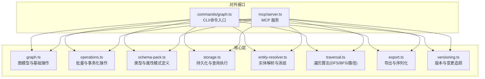
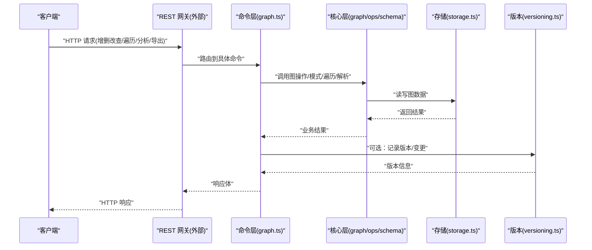
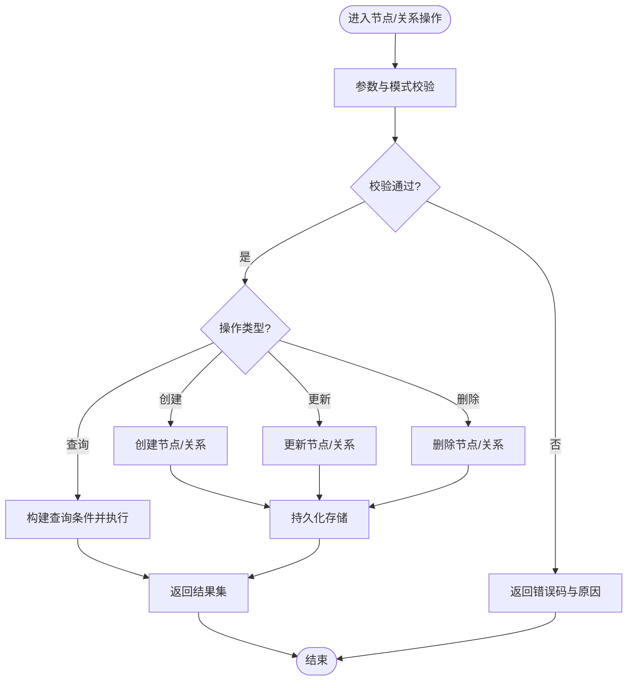
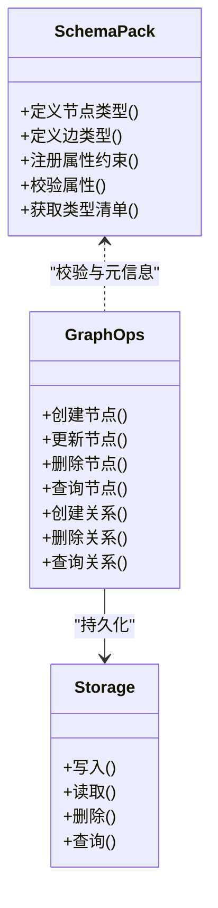
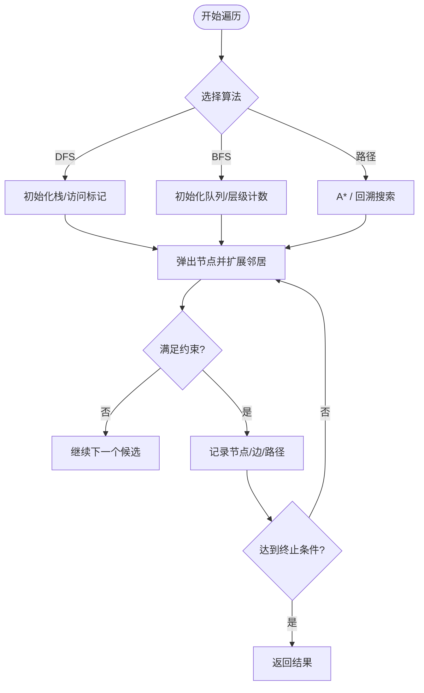
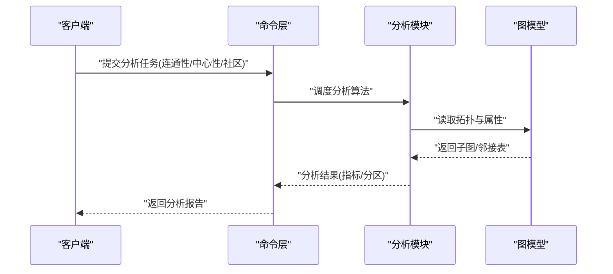
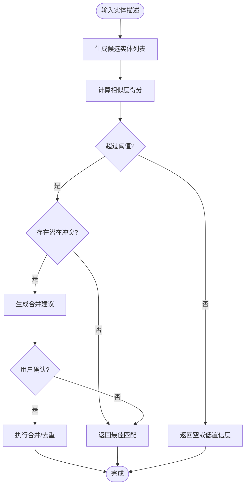
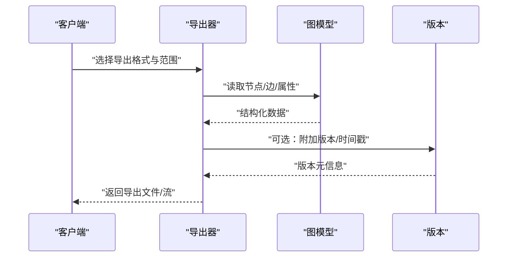
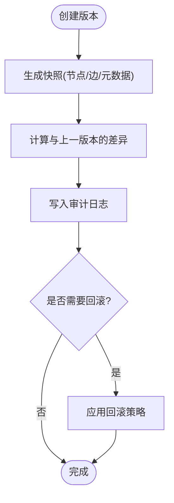
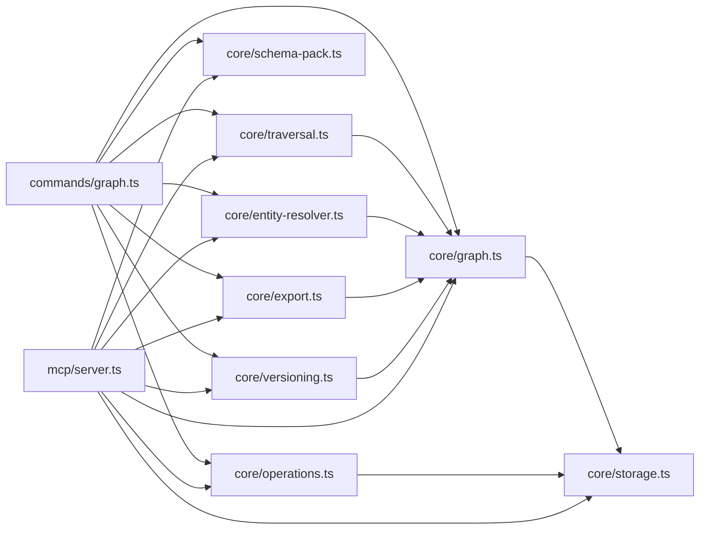

# 知识图谱

<cite>
**本文引用的文件**   
- [src/core/graph.ts](file://src/core/graph.ts)
- [src/core/operations.ts](file://src/core/operations.ts)
- [src/core/schema-pack.ts](file://src/core/schema-pack.ts)
- [src/core/storage.ts](file://src/core/storage.ts)
- [src/core/entity-resolver.ts](file://src/core/entity-resolver.ts)
- [src/core/traversal.ts](file://src/core/traversal.ts)
- [src/core/export.ts](file://src/core/export.ts)
- [src/core/versioning.ts](file://src/core/versioning.ts)
- [src/commands/graph.ts](file://src/commands/graph.ts)
- [src/mcp/server.ts](file://src/mcp/server.ts)
</cite>

## 目录
1. [简介](#简介)
2. [项目结构](#项目结构)
3. [核心组件](#核心组件)
4. [架构总览](#架构总览)
5. [详细组件分析](#详细组件分析)
6. [依赖分析](#依赖分析)
7. [性能考虑](#性能考虑)
8. [故障排查指南](#故障排查指南)
9. [结论](#结论)
10. [附录](#附录)

## 简介
本文件面向需要基于 RESTful API 操作知识图谱的开发者，提供图节点与关系的增删改查、属性管理、遍历（深度优先、广度优先、路径查找）、图谱分析（连通性检测、中心性计算、社区发现）、实体解析与消歧、可视化与导出、以及版本管理与变更追踪等能力的接口说明。文档同时给出系统架构、数据流与关键流程的图示，帮助读者快速定位实现位置并理解调用关系。

## 项目结构
本项目将知识图谱能力集中在 core 层，并通过命令与 MCP 服务对外暴露。REST 侧通常由上层网关或 HTTP 服务封装这些核心模块。下图展示与知识图谱相关的核心文件及其职责：

图表来源
- [src/core/graph.ts](file://src/core/graph.ts)
- [src/core/operations.ts](file://src/core/operations.ts)
- [src/core/schema-pack.ts](file://src/core/schema-pack.ts)
- [src/core/storage.ts](file://src/core/storage.ts)
- [src/core/entity-resolver.ts](file://src/core/entity-resolver.ts)
- [src/core/traversal.ts](file://src/core/traversal.ts)
- [src/core/export.ts](file://src/core/export.ts)
- [src/core/versioning.ts](file://src/core/versioning.ts)
- [src/commands/graph.ts](file://src/commands/graph.ts)
- [src/mcp/server.ts](file://src/mcp/server.ts)

章节来源
- [src/core/graph.ts](file://src/core/graph.ts)
- [src/core/operations.ts](file://src/core/operations.ts)
- [src/core/schema-pack.ts](file://src/core/schema-pack.ts)
- [src/core/storage.ts](file://src/core/storage.ts)
- [src/core/entity-resolver.ts](file://src/core/entity-resolver.ts)
- [src/core/traversal.ts](file://src/core/traversal.ts)
- [src/core/export.ts](file://src/core/export.ts)
- [src/core/versioning.ts](file://src/core/versioning.ts)
- [src/commands/graph.ts](file://src/commands/graph.ts)
- [src/mcp/server.ts](file://src/mcp/server.ts)

## 核心组件
- 图模型与基础操作：提供节点与边的创建、更新、删除、查询，以及元信息读取。
- 模式与属性管理：定义节点类型、边类型及属性约束，支持校验与迁移。
- 存储与查询：负责底层数据的读写、索引与过滤条件执行。
- 遍历与路径：实现 DFS、BFS、最短路径与多跳扩展。
- 实体解析与消歧：对同名或近似实体进行合并与去重建议。
- 分析与统计：连通性检测、中心性指标、社区划分等。
- 导出与可视化：输出为 JSON、Graphviz、GEXF 等格式。
- 版本与变更：记录图谱快照、差异与回滚能力。

章节来源
- [src/core/graph.ts](file://src/core/graph.ts)
- [src/core/schema-pack.ts](file://src/core/schema-pack.ts)
- [src/core/storage.ts](file://src/core/storage.ts)
- [src/core/traversal.ts](file://src/core/traversal.ts)
- [src/core/entity-resolver.ts](file://src/core/entity-resolver.ts)
- [src/core/export.ts](file://src/core/export.ts)
- [src/core/versioning.ts](file://src/core/versioning.ts)

## 架构总览
下图展示了从外部请求到核心实现的典型调用链。REST 网关（未在本仓库中直接体现）会调用命令层或直接调用核心模块；命令层再协调各子系统进行数据处理与持久化。

图表来源
- [src/commands/graph.ts](file://src/commands/graph.ts)
- [src/core/graph.ts](file://src/core/graph.ts)
- [src/core/operations.ts](file://src/core/operations.ts)
- [src/core/schema-pack.ts](file://src/core/schema-pack.ts)
- [src/core/storage.ts](file://src/core/storage.ts)
- [src/core/versioning.ts](file://src/core/versioning.ts)

## 详细组件分析

### 节点与关系 CRUD 接口
- 节点创建：支持指定节点类型与属性，自动分配唯一标识。
- 节点更新：按 ID 或部分键值匹配更新属性，支持幂等写入。
- 节点删除：级联清理关联边与引用，支持软删除选项。
- 节点查询：支持按类型、属性过滤、分页与排序。
- 关系创建：指定源节点、目标节点与关系类型，可携带属性。
- 关系删除：按边标识或端点+类型组合删除。
- 关系查询：按端点、类型、方向与属性过滤。

图表来源
- [src/core/graph.ts](file://src/core/graph.ts)
- [src/core/schema-pack.ts](file://src/core/schema-pack.ts)
- [src/core/storage.ts](file://src/core/storage.ts)

章节来源
- [src/core/graph.ts](file://src/core/graph.ts)
- [src/core/schema-pack.ts](file://src/core/schema-pack.ts)
- [src/core/storage.ts](file://src/core/storage.ts)

### 属性与类型管理
- 类型定义：声明节点类型、边类型及其属性字段、数据类型与约束。
- 属性校验：在写入时依据模式进行强校验，拒绝非法值。
- 模式演进：支持新增字段、默认值与迁移策略，保证向后兼容。
- 元信息查询：列出所有类型、字段与约束，便于前端渲染与校验提示。

图表来源
- [src/core/schema-pack.ts](file://src/core/schema-pack.ts)
- [src/core/graph.ts](file://src/core/graph.ts)
- [src/core/storage.ts](file://src/core/storage.ts)

章节来源
- [src/core/schema-pack.ts](file://src/core/schema-pack.ts)
- [src/core/graph.ts](file://src/core/graph.ts)
- [src/core/storage.ts](file://src/core/storage.ts)

### 遍历与路径查找
- 深度优先搜索（DFS）：从种子节点出发，按邻接边递归探索，支持最大深度与剪枝条件。
- 广度优先搜索（BFS）：逐层扩展，适合最短跳数查询与近邻发现。
- 路径查找：给定起点与终点，返回满足类型/属性约束的路径集合。
- 反向遍历：支持沿入边或出边方向进行定向遍历。

图表来源
- [src/core/traversal.ts](file://src/core/traversal.ts)
- [src/core/graph.ts](file://src/core/graph.ts)

章节来源
- [src/core/traversal.ts](file://src/core/traversal.ts)
- [src/core/graph.ts](file://src/core/graph.ts)

### 图谱分析
- 连通性检测：判断图是否连通、弱连通分量与强连通分量。
- 中心性计算：度中心性、接近中心性、介数中心性等。
- 社区发现：基于边权重与拓扑结构的聚类方法。
- 统计概览：节点/边数量、类型分布、属性取值分布。

图表来源
- [src/core/graph.ts](file://src/core/graph.ts)
- [src/core/operations.ts](file://src/core/operations.ts)

章节来源
- [src/core/graph.ts](file://src/core/graph.ts)
- [src/core/operations.ts](file://src/core/operations.ts)

### 实体解析与消歧
- 相似度匹配：基于名称、别名、上下文与属性相似度进行候选生成。
- 冲突检测：识别重复或冲突实体，提供合并建议。
- 合并与去重：支持手动确认或自动合并，保留审计日志。
- 消歧查询：根据上下文返回最可能的实体映射。

图表来源
- [src/core/entity-resolver.ts](file://src/core/entity-resolver.ts)
- [src/core/graph.ts](file://src/core/graph.ts)

章节来源
- [src/core/entity-resolver.ts](file://src/core/entity-resolver.ts)
- [src/core/graph.ts](file://src/core/graph.ts)

### 可视化与导出
- 导出格式：JSON、Graphviz DOT、GEXF、CSV 等。
- 视图裁剪：按类型、属性、时间范围或子图范围导出。
- 可视化集成：输出可直接被前端图可视化工具加载。
- 增量导出：基于版本差异导出变更集。

图表来源
- [src/core/export.ts](file://src/core/export.ts)
- [src/core/graph.ts](file://src/core/graph.ts)
- [src/core/versioning.ts](file://src/core/versioning.ts)

章节来源
- [src/core/export.ts](file://src/core/export.ts)
- [src/core/graph.ts](file://src/core/graph.ts)
- [src/core/versioning.ts](file://src/core/versioning.ts)

### 版本管理与变更追踪
- 版本快照：对当前图状态打快照，包含节点、边与元数据。
- 差异对比：比较两个版本之间的新增、删除与修改。
- 变更审计：记录操作者、时间与原因，支持回放与回滚。
- 分支与合并：支持并行编辑与合并策略（如以最新为准或人工介入）。

图表来源
- [src/core/versioning.ts](file://src/core/versioning.ts)
- [src/core/graph.ts](file://src/core/graph.ts)

章节来源
- [src/core/versioning.ts](file://src/core/versioning.ts)
- [src/core/graph.ts](file://src/core/graph.ts)

## 依赖分析
核心模块之间保持清晰分层：命令层协调核心模块，核心模块依赖存储与模式定义，遍历与分析模块复用图模型。MCP 服务同样依赖这些核心模块以提供工具能力。

图表来源
- [src/commands/graph.ts](file://src/commands/graph.ts)
- [src/core/graph.ts](file://src/core/graph.ts)
- [src/core/operations.ts](file://src/core/operations.ts)
- [src/core/schema-pack.ts](file://src/core/schema-pack.ts)
- [src/core/storage.ts](file://src/core/storage.ts)
- [src/core/traversal.ts](file://src/core/traversal.ts)
- [src/core/entity-resolver.ts](file://src/core/entity-resolver.ts)
- [src/core/export.ts](file://src/core/export.ts)
- [src/core/versioning.ts](file://src/core/versioning.ts)
- [src/mcp/server.ts](file://src/mcp/server.ts)

章节来源
- [src/commands/graph.ts](file://src/commands/graph.ts)
- [src/core/graph.ts](file://src/core/graph.ts)
- [src/core/operations.ts](file://src/core/operations.ts)
- [src/core/schema-pack.ts](file://src/core/schema-pack.ts)
- [src/core/storage.ts](file://src/core/storage.ts)
- [src/core/traversal.ts](file://src/core/traversal.ts)
- [src/core/entity-resolver.ts](file://src/core/entity-resolver.ts)
- [src/core/export.ts](file://src/core/export.ts)
- [src/core/versioning.ts](file://src/core/versioning.ts)
- [src/mcp/server.ts](file://src/mcp/server.ts)

## 性能考虑
- 批量操作：使用事务与批处理减少往返开销，提高吞吐。
- 索引优化：为高频查询的属性建立索引，避免全表扫描。
- 遍历限制：设置最大深度、邻居上限与超时，防止大图爆炸。
- 缓存策略：对热点查询结果进行短期缓存，降低重复计算。
- 导出分片：大导出采用流式与分页，避免内存峰值过高。
- 分析异步：复杂分析任务异步执行，返回任务 ID 供后续查询进度。

[本节为通用指导，不直接分析具体文件]

## 故障排查指南
- 模式校验失败：检查属性类型、必填字段与约束是否符合 schema 定义。
- 遍历超时：缩小查询范围、增加索引或调整遍历参数。
- 导出失败：确认导出格式与权限，检查磁盘空间与网络稳定性。
- 版本冲突：查看版本差异与审计日志，必要时回滚或人工合并。
- 实体解析误判：调整相似度阈值与特征权重，补充别名与上下文。

章节来源
- [src/core/schema-pack.ts](file://src/core/schema-pack.ts)
- [src/core/traversal.ts](file://src/core/traversal.ts)
- [src/core/export.ts](file://src/core/export.ts)
- [src/core/versioning.ts](file://src/core/versioning.ts)
- [src/core/entity-resolver.ts](file://src/core/entity-resolver.ts)

## 结论
本文件系统化梳理了知识图谱的 RESTful API 能力与内部实现要点，覆盖节点与关系 CRUD、属性与类型管理、遍历与路径、图谱分析、实体解析与消歧、可视化与导出、版本与变更追踪。通过分层架构与清晰的依赖关系，系统具备良好的可扩展性与可维护性。建议在工程实践中结合索引、批处理与异步分析等手段提升性能与用户体验。

[本节为总结性内容，不直接分析具体文件]

## 附录
- 术语说明
  - 节点：图中的实体对象，具有类型与属性。
  - 关系：连接两个节点的有向边，可带属性。
  - 模式：对节点与关系类型的定义与约束。
  - 版本：对图状态的快照与变更记录。
- 参考入口
  - 命令层：用于 CLI 与脚本调用的统一入口。
  - MCP 服务：提供工具化能力，便于集成到智能体工作流。

[本节为概念性内容，不直接分析具体文件]