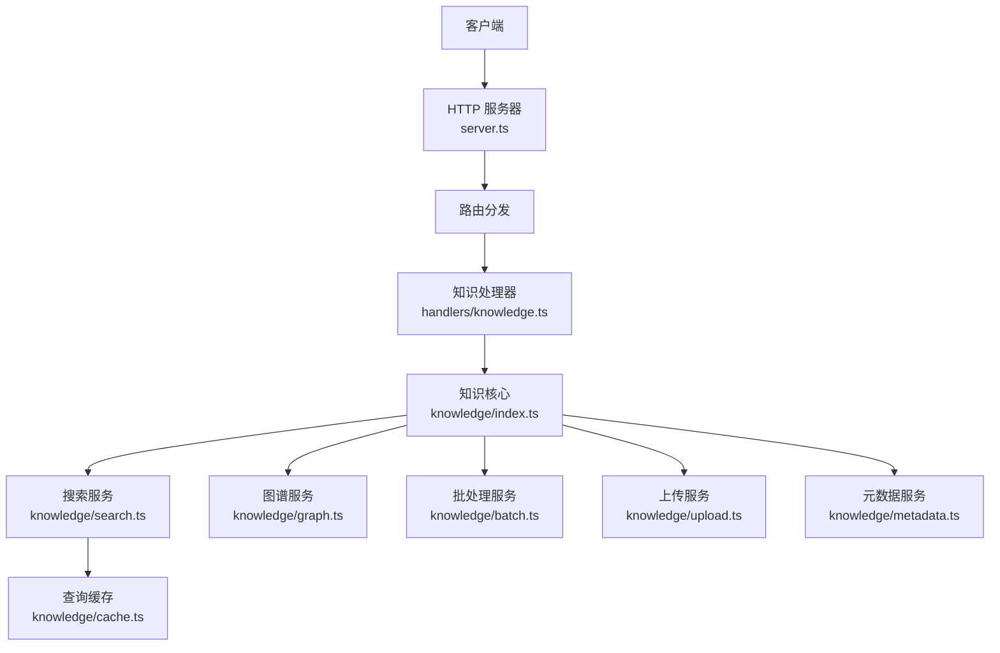
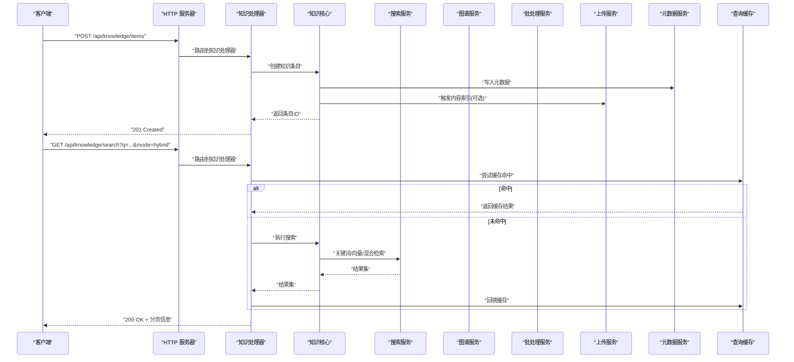
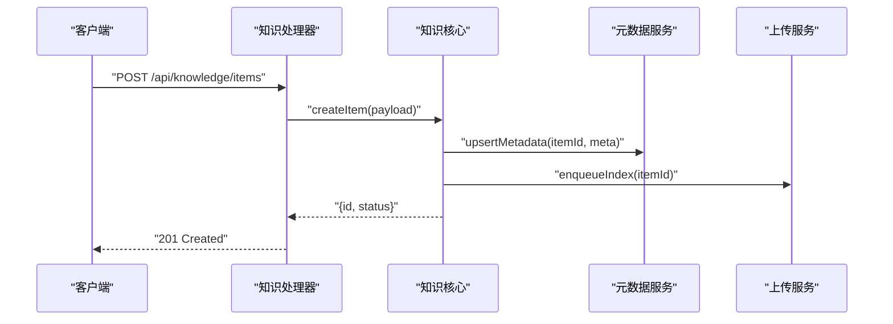
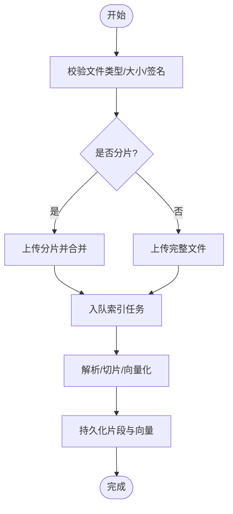
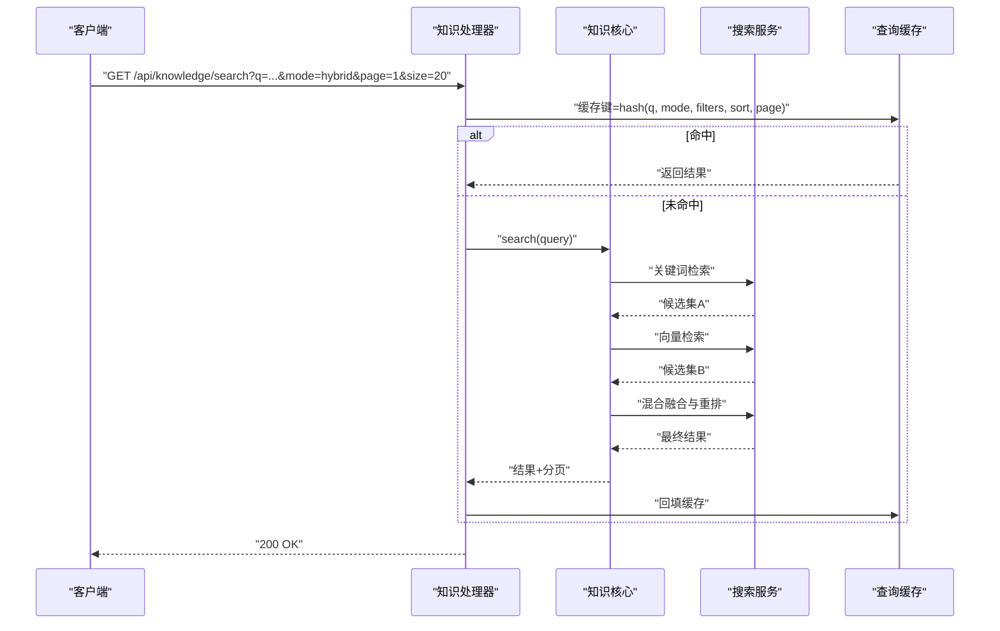
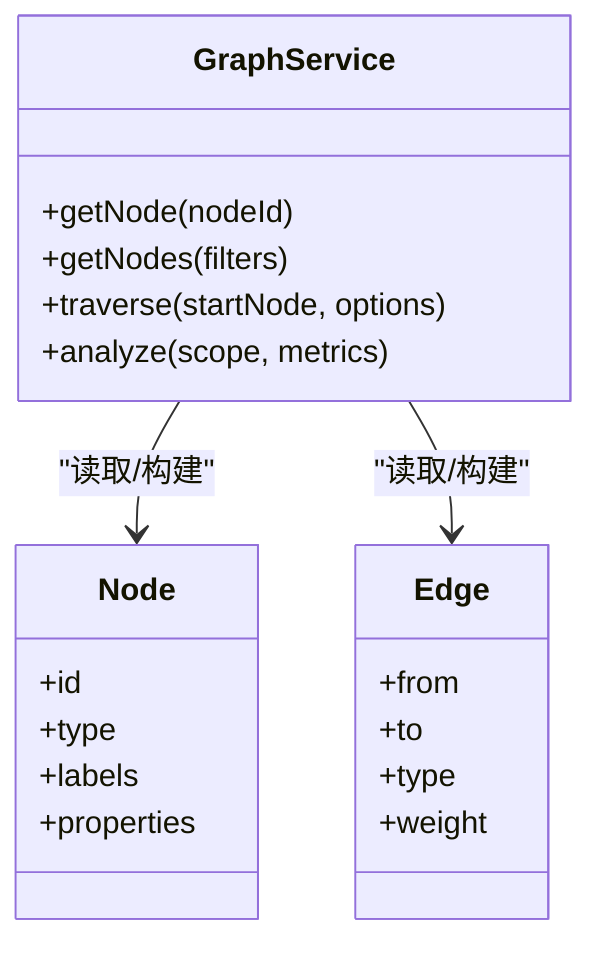
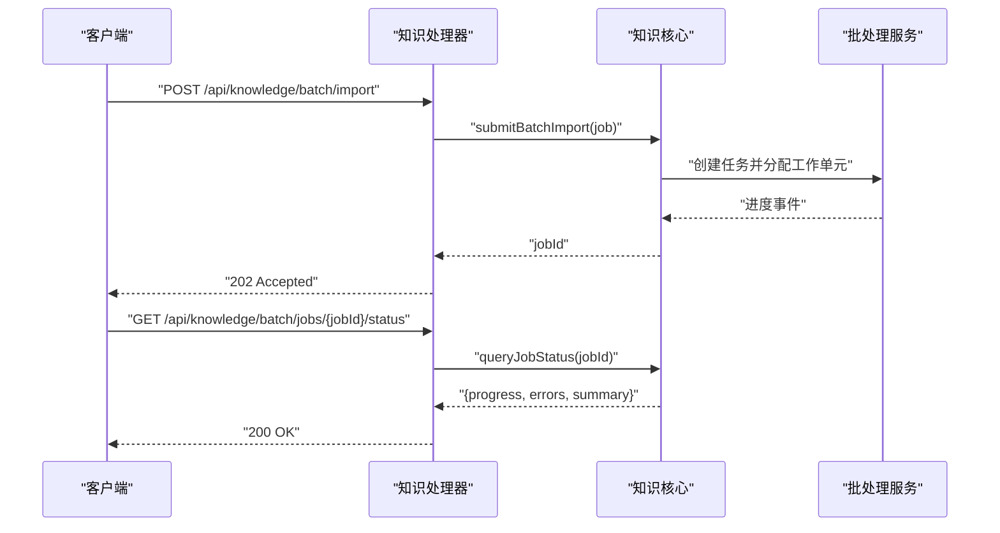
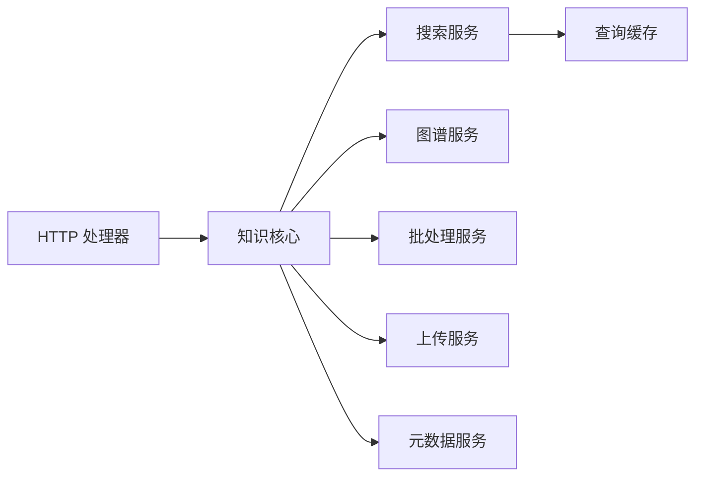

# 知识操作

<cite>
**本文引用的文件**   
- [src/core/knowledge/index.ts](file://src/core/knowledge/index.ts)
- [src/core/knowledge/search.ts](file://src/core/knowledge/search.ts)
- [src/core/knowledge/graph.ts](file://src/core/knowledge/graph.ts)
- [src/core/knowledge/batch.ts](file://src/core/knowledge/batch.ts)
- [src/core/knowledge/upload.ts](file://src/core/knowledge/upload.ts)
- [src/core/knowledge/metadata.ts](file://src/core/knowledge/metadata.ts)
- [src/core/knowledge/cache.ts](file://src/core/knowledge/cache.ts)
- [src/commands/knowledge.ts](file://src/commands/knowledge.ts)
- [src/core/http/handlers/knowledge.ts](file://src/core/http/handlers/knowledge.ts)
- [src/core/http/server.ts](file://src/core/http/server.ts)
</cite>

## 目录
1. [简介](#简介)
2. [项目结构](#项目结构)
3. [核心组件](#核心组件)
4. [架构总览](#架构总览)
5. [详细组件分析](#详细组件分析)
6. [依赖分析](#依赖分析)
7. [性能考虑](#性能考虑)
8. [故障排查指南](#故障排查指南)
9. [结论](#结论)
10. [附录](#附录)

## 简介
本文件面向“知识操作”的 RESTful API，覆盖知识内容的增删改查、文件上传、内容索引与元数据管理；语义搜索（关键词、向量、混合）；知识图谱（节点查询、关系遍历、图谱分析）；批量导入/导出/更新；分页、排序、过滤与高级查询语法；以及搜索性能优化与缓存策略。文档以代码仓库中的实现为依据，提供端到端接口说明、调用流程与最佳实践。

## 项目结构
知识操作的 HTTP 入口位于 HTTP 层处理器，业务逻辑集中在 knowledge 子模块，命令层提供 CLI 能力，缓存与搜索、图谱、批处理等能力由各自子模块实现。

图表来源
- [src/core/http/server.ts](file://src/core/http/server.ts)
- [src/core/http/handlers/knowledge.ts](file://src/core/http/handlers/knowledge.ts)
- [src/core/knowledge/index.ts](file://src/core/knowledge/index.ts)
- [src/core/knowledge/search.ts](file://src/core/knowledge/search.ts)
- [src/core/knowledge/graph.ts](file://src/core/knowledge/graph.ts)
- [src/core/knowledge/batch.ts](file://src/core/knowledge/batch.ts)
- [src/core/knowledge/upload.ts](file://src/core/knowledge/upload.ts)
- [src/core/knowledge/metadata.ts](file://src/core/knowledge/metadata.ts)
- [src/core/knowledge/cache.ts](file://src/core/knowledge/cache.ts)

章节来源
- [src/core/http/server.ts](file://src/core/http/server.ts)
- [src/core/http/handlers/knowledge.ts](file://src/core/http/handlers/knowledge.ts)
- [src/core/knowledge/index.ts](file://src/core/knowledge/index.ts)

## 核心组件
- 知识核心：统一编排知识实体的生命周期与资源访问，对外暴露增删改查、索引触发、版本与可见性控制等能力。
- 搜索服务：支持全文检索、向量检索与混合检索，提供分页、排序、过滤与高级查询语法。
- 图谱服务：提供图节点查询、关系遍历与基础图谱分析（度统计、连通域、路径查找等）。
- 批处理服务：批量导入、导出与更新，支持事务与回滚、进度上报与断点续传。
- 上传服务：多类型文件解析、分片上传、去重与异步索引。
- 元数据服务：结构化元数据的读写、校验与索引联动。
- 查询缓存：对热点查询结果进行缓存，降低重复计算与存储压力。

章节来源
- [src/core/knowledge/index.ts](file://src/core/knowledge/index.ts)
- [src/core/knowledge/search.ts](file://src/core/knowledge/search.ts)
- [src/core/knowledge/graph.ts](file://src/core/knowledge/graph.ts)
- [src/core/knowledge/batch.ts](file://src/core/knowledge/batch.ts)
- [src/core/knowledge/upload.ts](file://src/core/knowledge/upload.ts)
- [src/core/knowledge/metadata.ts](file://src/core/knowledge/metadata.ts)
- [src/core/knowledge/cache.ts](file://src/core/knowledge/cache.ts)

## 架构总览
REST 请求经 HTTP 服务器进入知识处理器，处理器将请求参数规范化后委托给知识核心；核心根据操作类型调度搜索、图谱、批处理、上传与元数据服务；必要时使用查询缓存命中或回填结果。

图表来源
- [src/core/http/server.ts](file://src/core/http/server.ts)
- [src/core/http/handlers/knowledge.ts](file://src/core/http/handlers/knowledge.ts)
- [src/core/knowledge/index.ts](file://src/core/knowledge/index.ts)
- [src/core/knowledge/search.ts](file://src/core/knowledge/search.ts)
- [src/core/knowledge/cache.ts](file://src/core/knowledge/cache.ts)

## 详细组件分析

### 知识条目 CRUD
- 创建条目：提交标题、类型、可见范围、可选元数据与附件；成功后返回条目标识与状态。
- 读取条目：按 ID 获取详情，支持字段投影与关联展开。
- 更新条目：增量更新标题、元数据与可见性；保留历史版本。
- 删除条目：软删除为主，支持硬删除与回收站恢复。

典型调用序列（创建）：

图表来源
- [src/core/http/handlers/knowledge.ts](file://src/core/http/handlers/knowledge.ts)
- [src/core/knowledge/index.ts](file://src/core/knowledge/index.ts)
- [src/core/knowledge/metadata.ts](file://src/core/knowledge/metadata.ts)
- [src/core/knowledge/upload.ts](file://src/core/knowledge/upload.ts)

章节来源
- [src/core/knowledge/index.ts](file://src/core/knowledge/index.ts)
- [src/core/knowledge/metadata.ts](file://src/core/knowledge/metadata.ts)
- [src/core/knowledge/upload.ts](file://src/core/knowledge/upload.ts)
- [src/core/http/handlers/knowledge.ts](file://src/core/http/handlers/knowledge.ts)

### 文件上传与内容索引
- 支持分片上传、断点续传、MIME 校验与大小限制。
- 上传完成后进入异步索引队列，生成文本片段与向量嵌入。
- 可配置解析器（PDF、Markdown、代码等），失败重试与错误隔离。

图表来源
- [src/core/knowledge/upload.ts](file://src/core/knowledge/upload.ts)
- [src/core/knowledge/index.ts](file://src/core/knowledge/index.ts)

章节来源
- [src/core/knowledge/upload.ts](file://src/core/knowledge/upload.ts)
- [src/core/knowledge/index.ts](file://src/core/knowledge/index.ts)

### 元数据管理
- 支持键值型与结构化元数据，提供模式校验与默认值。
- 元数据变更会触发相关索引重建或增量更新。
- 提供按元数据字段过滤与聚合的能力。

章节来源
- [src/core/knowledge/metadata.ts](file://src/core/knowledge/metadata.ts)
- [src/core/knowledge/index.ts](file://src/core/knowledge/index.ts)

### 语义搜索（关键词、向量、混合）
- 关键词检索：基于全文索引，支持布尔表达式、前缀匹配与同义词扩展。
- 向量检索：基于嵌入向量相似度，支持 top-k 与阈值过滤。
- 混合检索：融合关键词与向量分数，支持权重调节与重排策略。
- 高级查询：支持字段选择、时间范围、标签/分类过滤、排序与分页。

图表来源
- [src/core/http/handlers/knowledge.ts](file://src/core/http/handlers/knowledge.ts)
- [src/core/knowledge/search.ts](file://src/core/knowledge/search.ts)
- [src/core/knowledge/cache.ts](file://src/core/knowledge/cache.ts)
- [src/core/knowledge/index.ts](file://src/core/knowledge/index.ts)

章节来源
- [src/core/knowledge/search.ts](file://src/core/knowledge/search.ts)
- [src/core/knowledge/cache.ts](file://src/core/knowledge/cache.ts)
- [src/core/knowledge/index.ts](file://src/core/knowledge/index.ts)
- [src/core/http/handlers/knowledge.ts](file://src/core/http/handlers/knowledge.ts)

### 知识图谱（节点查询、关系遍历、图谱分析）
- 节点查询：按 ID、类型、标签或属性条件检索节点。
- 关系遍历：从指定节点出发，按边类型与深度进行广度/深度优先遍历。
- 图谱分析：度分布、连通分量、中心性指标、子图提取与导出。

图表来源
- [src/core/knowledge/graph.ts](file://src/core/knowledge/graph.ts)

章节来源
- [src/core/knowledge/graph.ts](file://src/core/knowledge/graph.ts)

### 批量操作（导入、导出、更新）
- 批量导入：支持 JSON/CSV/ZIP 包，含去重、冲突策略与事务边界。
- 批量导出：按筛选条件导出为结构化文件，支持流式输出。
- 批量更新：按 ID 列表或查询条件批量更新元数据与可见性。
- 进度与幂等：提供任务 ID、进度回调与幂等键，支持中断与重试。

图表来源
- [src/core/knowledge/batch.ts](file://src/core/knowledge/batch.ts)
- [src/core/knowledge/index.ts](file://src/core/knowledge/index.ts)
- [src/core/http/handlers/knowledge.ts](file://src/core/http/handlers/knowledge.ts)

章节来源
- [src/core/knowledge/batch.ts](file://src/core/knowledge/batch.ts)
- [src/core/knowledge/index.ts](file://src/core/knowledge/index.ts)
- [src/core/http/handlers/knowledge.ts](file://src/core/http/handlers/knowledge.ts)

### 分页、排序、过滤与高级查询
- 分页：page/size 或 cursor-based 游标分页，避免深翻页性能问题。
- 排序：支持多字段排序与方向控制，结合相关性得分。
- 过滤：按类型、标签、时间窗、作者/来源、可见性等维度组合过滤。
- 高级语法：支持布尔表达式、通配符、范围查询与嵌套字段。

章节来源
- [src/core/knowledge/search.ts](file://src/core/knowledge/search.ts)
- [src/core/knowledge/index.ts](file://src/core/knowledge/index.ts)

### 命令与 CLI
- 提供本地调试与运维命令，如批量导入、导出、重新索引与状态查看。
- 与 HTTP 接口保持一致的参数语义，便于自动化脚本集成。

章节来源
- [src/commands/knowledge.ts](file://src/commands/knowledge.ts)

## 依赖分析
- HTTP 层仅负责协议适配与参数校验，不承载复杂业务逻辑。
- 知识核心作为协调者，低耦合地调用搜索、图谱、批处理、上传与元数据服务。
- 查询缓存独立于业务，通过键哈希与失效策略参与搜索链路。

图表来源
- [src/core/http/handlers/knowledge.ts](file://src/core/http/handlers/knowledge.ts)
- [src/core/knowledge/index.ts](file://src/core/knowledge/index.ts)
- [src/core/knowledge/search.ts](file://src/core/knowledge/search.ts)
- [src/core/knowledge/graph.ts](file://src/core/knowledge/graph.ts)
- [src/core/knowledge/batch.ts](file://src/core/knowledge/batch.ts)
- [src/core/knowledge/upload.ts](file://src/core/knowledge/upload.ts)
- [src/core/knowledge/metadata.ts](file://src/core/knowledge/metadata.ts)
- [src/core/knowledge/cache.ts](file://src/core/knowledge/cache.ts)

章节来源
- [src/core/http/handlers/knowledge.ts](file://src/core/http/handlers/knowledge.ts)
- [src/core/knowledge/index.ts](file://src/core/knowledge/index.ts)

## 性能考虑
- 搜索性能
  - 混合检索时合理设置关键词与向量权重，减少无效候选集。
  - 使用游标分页替代深翻页，避免全表扫描。
  - 对高频查询启用查询缓存，注意缓存键包含所有影响结果的参数。
- 索引与写入
  - 大文件采用分片上传与异步索引，避免阻塞主线程。
  - 批量导入开启事务与去重，减少重复写入与索引重建。
- 缓存策略
  - 短 TTL 用于热数据，长 TTL 用于静态字典与枚举。
  - 写扩散与读扩散结合：元数据变更及时失效相关缓存键。
- 资源控制
  - 并发上限、超时与熔断保护外部依赖（如嵌入模型服务）。
  - 监控关键指标：QPS、P95/P99 延迟、缓存命中率、索引堆积量。

[本节为通用指导，无需源码引用]

## 故障排查指南
- 常见问题
  - 搜索结果为空：检查查询语法、过滤器与索引状态；确认混合检索权重配置。
  - 上传失败：核对 MIME 类型、文件大小与权限；查看分片合并日志。
  - 批量任务卡住：检查任务队列、重试次数与工作进程健康状态。
- 定位手段
  - 通过任务 ID 查询进度与错误摘要。
  - 打开调试日志，关注处理器与核心层的输入输出形状。
  - 验证缓存键一致性，必要时手动清理热点键。

章节来源
- [src/core/knowledge/batch.ts](file://src/core/knowledge/batch.ts)
- [src/core/knowledge/upload.ts](file://src/core/knowledge/upload.ts)
- [src/core/knowledge/search.ts](file://src/core/knowledge/search.ts)
- [src/core/knowledge/cache.ts](file://src/core/knowledge/cache.ts)

## 结论
本 API 围绕知识条目的全生命周期与检索增强展开，提供统一的增删改查、文件上传与索引、元数据管理、语义搜索、图谱分析与批量处理能力。通过合理的分页、排序、过滤与高级查询语法，以及查询缓存与异步索引机制，可在保证功能完备的同时获得良好的性能与可扩展性。

[本节为总结性内容，无需源码引用]

## 附录
- 术语
  - 混合检索：同时利用关键词与向量相似度的检索方式。
  - 游标分页：基于上次结果游标的分页方式，适合大数据集。
  - 软删除：标记删除而非物理移除，便于恢复与审计。
- 参考命令
  - 本地批量导入/导出、重新索引与状态查看可通过 CLI 命令执行。

章节来源
- [src/commands/knowledge.ts](file://src/commands/knowledge.ts)