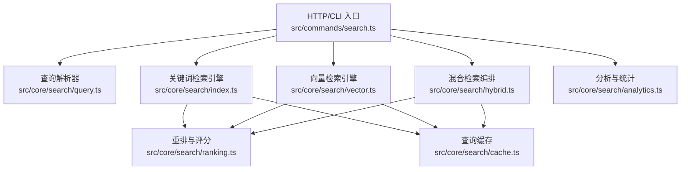
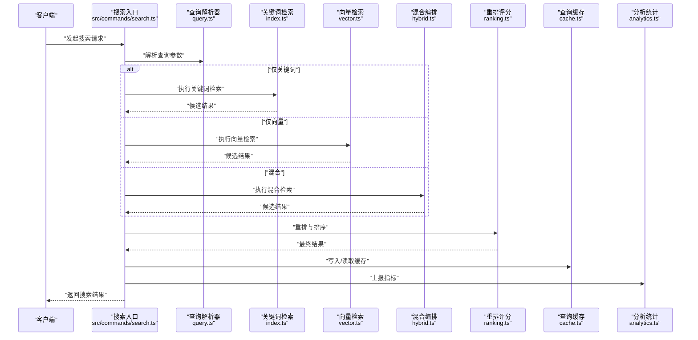
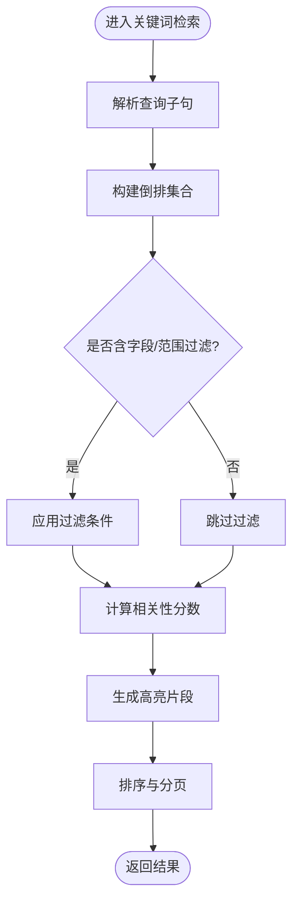
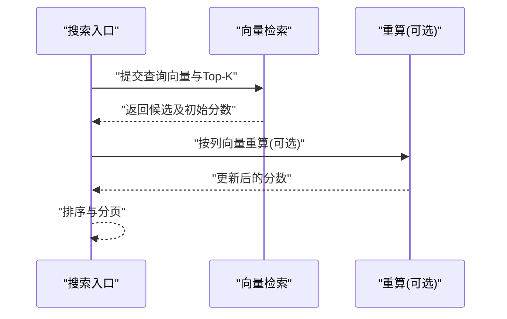
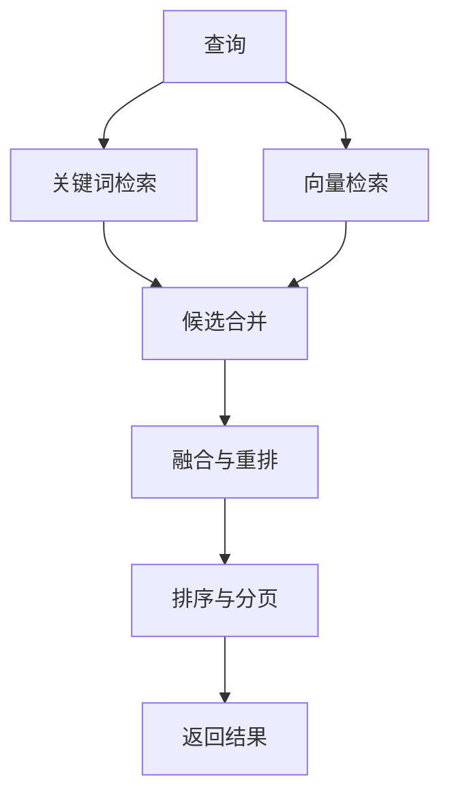
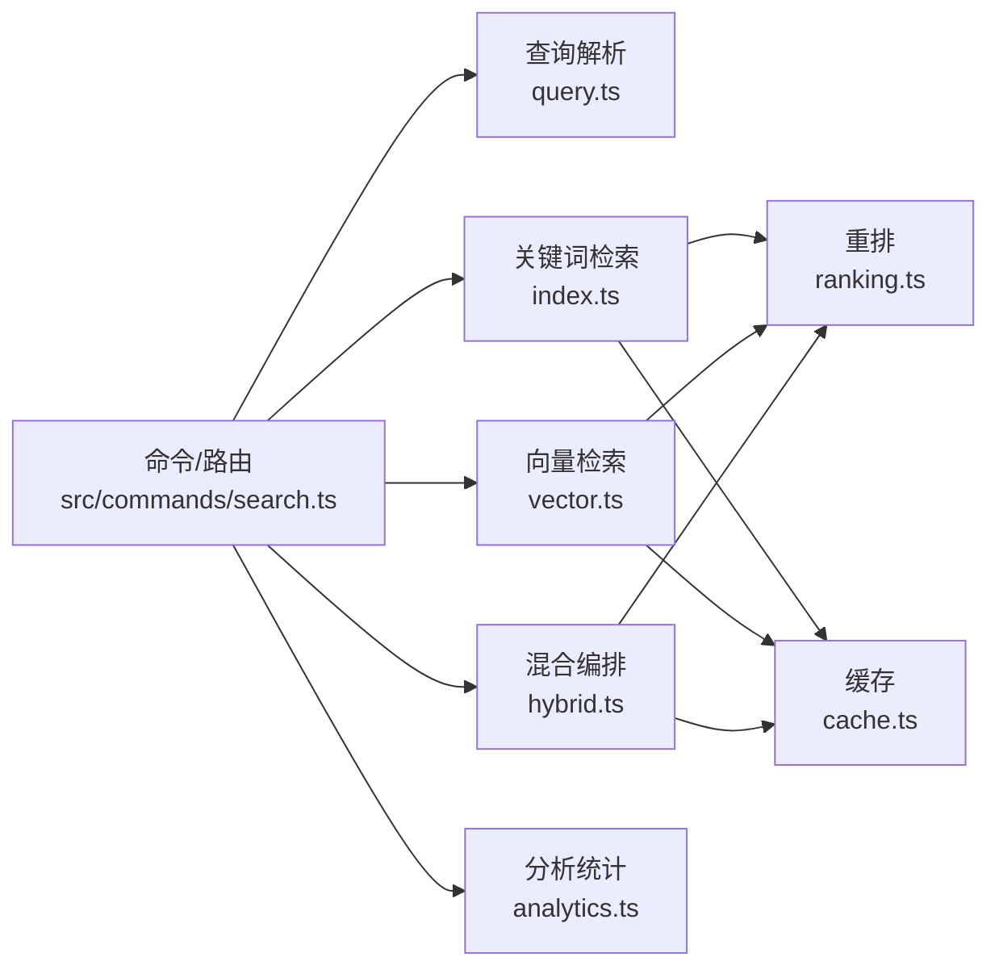

# 语义搜索

<cite>
**本文引用的文件**   
- [src/core/search/index.ts](file://src/core/search/index.ts)
- [src/core/search/query.ts](file://src/core/search/query.ts)
- [src/core/search/vector.ts](file://src/core/search/vector.ts)
- [src/core/search/hybrid.ts](file://src/core/search/hybrid.ts)
- [src/core/search/ranking.ts](file://src/core/search/ranking.ts)
- [src/core/search/cache.ts](file://src/core/search/cache.ts)
- [src/core/search/analytics.ts](file://src/core/search/analytics.ts)
- [src/commands/search.ts](file://src/commands/search.ts)
- [src/commands/query.ts](file://src/commands/query.ts)
- [test/search/search.test.ts](file://test/search/search.test.ts)
- [test/search/search-mode.test.ts](file://test/search/search-mode.test.ts)
- [test/search/search-limit.test.ts](file://test/search/search-limit.test.ts)
- [test/search/search-telemetry.test.ts](file://test/search/search-telemetry.test.ts)
- [test/search/hybrid-search-lite.serial.test.ts](file://test/search/hybrid-search-lite.serial.test.ts)
- [test/search/cosine-rescore-column.test.ts](file://test/search/cosine-rescore-column.test.ts)
</cite>

## 目录
1. [简介](#简介)
2. [项目结构](#项目结构)
3. [核心组件](#核心组件)
4. [架构总览](#架构总览)
5. [详细组件分析](#详细组件分析)
6. [依赖分析](#依赖分析)
7. [性能考虑](#性能考虑)
8. [故障排查指南](#故障排查指南)
9. [结论](#结论)
10. [附录](#附录)

## 简介
本文件面向开发者与使用者，系统化梳理语义搜索的 RESTful API 能力与实现要点。内容覆盖：
- 关键词搜索接口：支持模糊匹配、短语搜索与布尔逻辑
- 向量检索接口：相似度计算与最近邻搜索
- 混合搜索模式：结合关键词与向量检索结果
- 高级查询语法：字段过滤、范围查询与聚合操作
- 排序、分页与高亮显示
- 性能优化：索引策略与缓存机制
- 搜索分析与统计接口

## 项目结构
语义搜索相关代码主要位于 src/core/search 目录，命令入口在 src/commands，测试用例集中在 test/search。下图给出与文档相关的模块关系概览（概念性示意）。

[本图为概念性示意，不直接映射具体源码结构，故无“图示来源”]

## 核心组件
- 查询解析器：负责将用户输入转换为结构化查询（模糊、短语、布尔、字段过滤、范围等）
- 关键词检索：基于倒排与分词，提供精确/模糊/短语/布尔组合检索
- 向量检索：基于嵌入向量进行相似度计算与近似最近邻搜索
- 混合检索：融合关键词与向量结果，统一排序与返回
- 重排与评分：对候选集进行再打分与排序
- 查询缓存：按查询指纹缓存结果，降低重复请求延迟
- 分析与统计：记录查询指标、耗时、命中率与错误分布

章节来源
- [src/core/search/query.ts](file://src/core/search/query.ts)
- [src/core/search/index.ts](file://src/core/search/index.ts)
- [src/core/search/vector.ts](file://src/core/search/vector.ts)
- [src/core/search/hybrid.ts](file://src/core/search/hybrid.ts)
- [src/core/search/ranking.ts](file://src/core/search/ranking.ts)
- [src/core/search/cache.ts](file://src/core/search/cache.ts)
- [src/core/search/analytics.ts](file://src/core/search/analytics.ts)

## 架构总览
下图展示一次典型搜索请求从入口到返回的关键路径，包括关键词、向量与混合三种模式。

图示来源
- [src/commands/search.ts](file://src/commands/search.ts)
- [src/core/search/query.ts](file://src/core/search/query.ts)
- [src/core/search/index.ts](file://src/core/search/index.ts)
- [src/core/search/vector.ts](file://src/core/search/vector.ts)
- [src/core/search/hybrid.ts](file://src/core/search/hybrid.ts)
- [src/core/search/ranking.ts](file://src/core/search/ranking.ts)
- [src/core/search/cache.ts](file://src/core/search/cache.ts)
- [src/core/search/analytics.ts](file://src/core/search/analytics.ts)

## 详细组件分析

### 关键词搜索接口
- 功能要点
  - 模糊匹配：支持编辑距离或前缀/后缀模糊
  - 短语搜索：多词连续匹配
  - 布尔逻辑：AND/OR/NOT 组合
  - 字段过滤：限定在指定字段内匹配
  - 范围查询：数值/时间区间筛选
  - 高亮显示：返回命中片段与位置信息
- 典型流程
  - 解析查询为关键词子句
  - 构建倒排交集/并集
  - 应用字段与范围过滤
  - 生成高亮片段
  - 排序与分页

图示来源
- [src/core/search/index.ts](file://src/core/search/index.ts)
- [src/core/search/query.ts](file://src/core/search/query.ts)
- [src/core/search/ranking.ts](file://src/core/search/ranking.ts)

章节来源
- [src/core/search/index.ts](file://src/core/search/index.ts)
- [src/core/search/query.ts](file://src/core/search/query.ts)
- [src/core/search/ranking.ts](file://src/core/search/ranking.ts)
- [test/search/search.test.ts](file://test/search/search.test.ts)
- [test/search/search-mode.test.ts](file://test/search/search-mode.test.ts)
- [test/search/search-limit.test.ts](file://test/search/search-limit.test.ts)

### 向量检索接口
- 功能要点
  - 相似度计算：余弦相似度等
  - 最近邻搜索：Top-K 近似最近邻
  - 可选列参与重算：如使用特定列向量重新打分
- 典型流程
  - 将查询文本转为向量
  - 执行 ANN 检索得到候选
  - 可选地对候选进行精确重算
  - 排序与分页

图示来源
- [src/core/search/vector.ts](file://src/core/search/vector.ts)
- [src/core/search/ranking.ts](file://src/core/search/ranking.ts)

章节来源
- [src/core/search/vector.ts](file://src/core/search/vector.ts)
- [src/core/search/ranking.ts](file://src/core/search/ranking.ts)
- [test/search/cosine-rescore-column.test.ts](file://test/search/cosine-rescore-column.test.ts)

### 混合搜索模式
- 目标：同时利用关键词的精确性与向量的语义召回能力
- 融合策略：先分别获取候选，再进行统一重排；可配置权重或采用 RRF 等融合算法
- 适用场景：复杂意图、跨模态、长尾查询

图示来源
- [src/core/search/hybrid.ts](file://src/core/search/hybrid.ts)
- [src/core/search/ranking.ts](file://src/core/search/ranking.ts)

章节来源
- [src/core/search/hybrid.ts](file://src/core/search/hybrid.ts)
- [test/search/hybrid-search-lite.serial.test.ts](file://test/search/hybrid-search-lite.serial.test.ts)

### 高级查询语法
- 字段过滤：在指定字段范围内匹配
- 范围查询：数值、日期、枚举区间的包含/不包含
- 聚合操作：按维度统计命中数量、分布等（用于分析面板）
- 建议：通过查询解析器统一抽象，避免硬编码分支

章节来源
- [src/core/search/query.ts](file://src/core/search/query.ts)
- [src/core/search/analytics.ts](file://src/core/search/analytics.ts)

### 排序、分页与高亮
- 排序：关键词相关性、向量相似度、时间衰减、业务权重等可组合
- 分页：页码与每页大小控制，游标式分页适用于大数据量
- 高亮：返回命中片段、起始偏移与长度，便于前端渲染

章节来源
- [src/core/search/ranking.ts](file://src/core/search/ranking.ts)
- [src/core/search/index.ts](file://src/core/search/index.ts)

### 搜索分析与统计接口
- 指标：QPS、P95/P99 延迟、命中率、错误率、Top 查询词
- 维度：按模式（关键词/向量/混合）、字段、租户/来源等拆分
- 用途：容量规划、模型评估、异常告警

章节来源
- [src/core/search/analytics.ts](file://src/core/search/analytics.ts)
- [test/search/search-telemetry.test.ts](file://test/search/search-telemetry.test.ts)

## 依赖分析
- 入口层：命令/HTTP 路由将请求分发至不同检索模式
- 解析层：查询解析器统一处理语法与参数校验
- 检索层：关键词、向量、混合三个子系统相互独立，通过重排层统一输出
- 支撑层：缓存与分析贯穿各模式，提升性能与可观测性

图示来源
- [src/commands/search.ts](file://src/commands/search.ts)
- [src/core/search/query.ts](file://src/core/search/query.ts)
- [src/core/search/index.ts](file://src/core/search/index.ts)
- [src/core/search/vector.ts](file://src/core/search/vector.ts)
- [src/core/search/hybrid.ts](file://src/core/search/hybrid.ts)
- [src/core/search/ranking.ts](file://src/core/search/ranking.ts)
- [src/core/search/cache.ts](file://src/core/search/cache.ts)
- [src/core/search/analytics.ts](file://src/core/search/analytics.ts)

章节来源
- [src/commands/search.ts](file://src/commands/search.ts)
- [src/commands/query.ts](file://src/commands/query.ts)

## 性能考虑
- 索引策略
  - 关键词：合理分词粒度、停用词与同义词表、字段级倒排
  - 向量：ANN 索引（如 HNSW/IVF），根据数据规模选择内存/磁盘层级
- 缓存机制
  - 查询指纹：规范化查询后生成稳定键
  - 分层缓存：本地 LRU + 分布式共享缓存
  - 失效策略：按数据变更事件或 TTL 过期
- 重排优化
  - 两阶段检索：粗召回 + 精重排
  - 增量重算：仅在必要时对 Top-N 进行精确相似度重算
- 并发与限流
  - 队列化与背压，避免雪崩
  - 按租户/来源配额限制

[本节为通用指导，不直接分析具体文件，故无“章节来源”]

## 故障排查指南
- 常见问题
  - 查询超时：检查 ANN 索引状态、Top-K 过大、重算列缺失
  - 结果为空：确认分词/同义词配置、字段映射、范围边界
  - 高亮错位：核对片段偏移与字符编码
  - 缓存未命中：验证查询规范化与键生成一致性
- 定位手段
  - 启用详细日志与追踪 ID
  - 查看分析面板中的错误分类与时序
  - 复现最小查询样例，逐步关闭特性定位根因

章节来源
- [test/search/search-telemetry.test.ts](file://test/search/search-telemetry.test.ts)

## 结论
本方案以“解析-检索-重排-缓存-分析”的分层架构，提供关键词、向量与混合三类检索能力，并通过统一的排序、分页与高亮输出，满足多样化搜索需求。配合合理的索引与缓存策略，可在保证召回质量的同时获得稳定的性能表现。

## 附录

### RESTful API 参考（摘要）
- 关键词搜索
  - 方法：POST /api/v1/search/keyword
  - 入参：query、fields、fuzziness、phrase、boolean、range、highlight、sort、page
  - 出参：results、total、highlights、took_ms
- 向量检索
  - 方法：POST /api/v1/search/vector
  - 入参：query_vector、top_k、distance_metric、rescore_column、sort、page
  - 出参：results、scores、took_ms
- 混合搜索
  - 方法：POST /api/v1/search/hybrid
  - 入参：keyword、vector、weights、fusion_strategy、sort、page
  - 出参：results、score_breakdown、took_ms
- 分析与统计
  - 方法：GET /api/v1/search/stats
  - 入参：from、to、group_by
  - 出参：metrics、dimensions

[本节为接口约定摘要，不直接分析具体文件，故无“章节来源”]