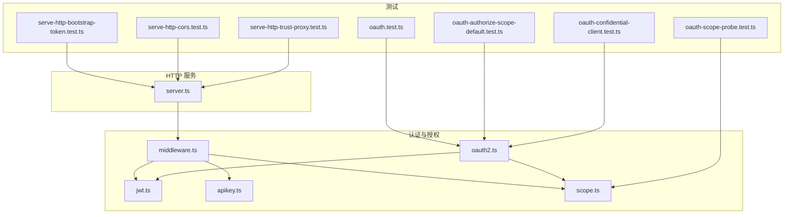
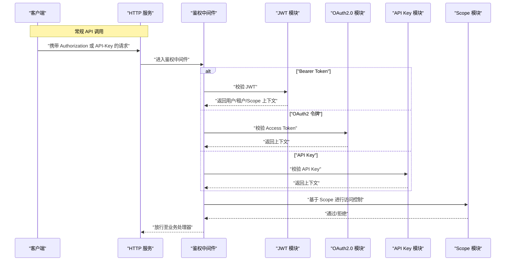
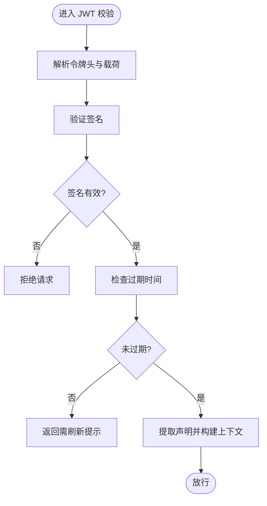
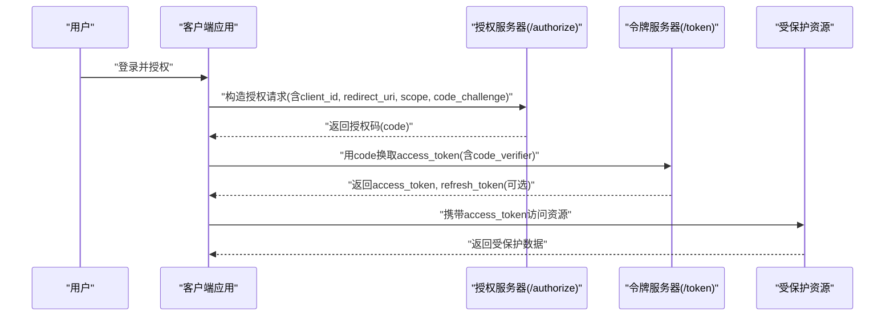
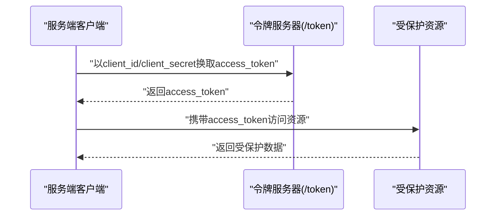
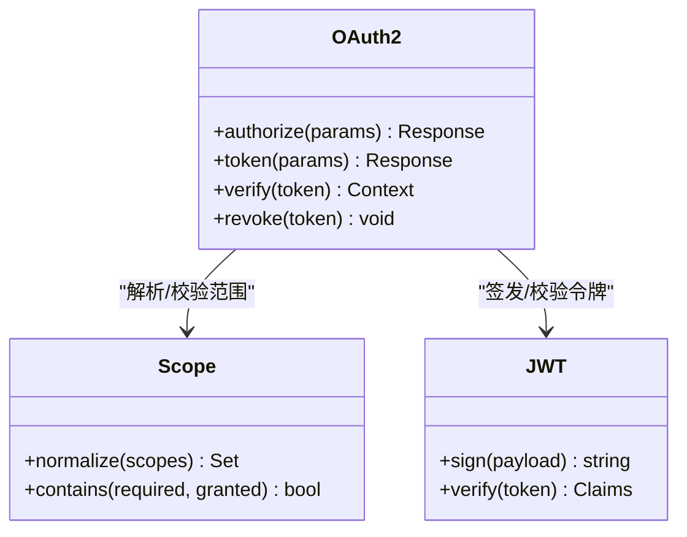
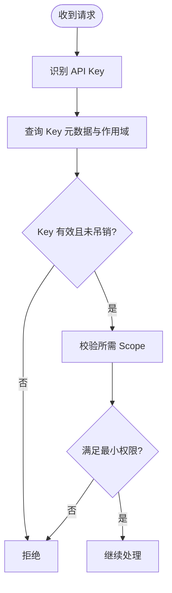
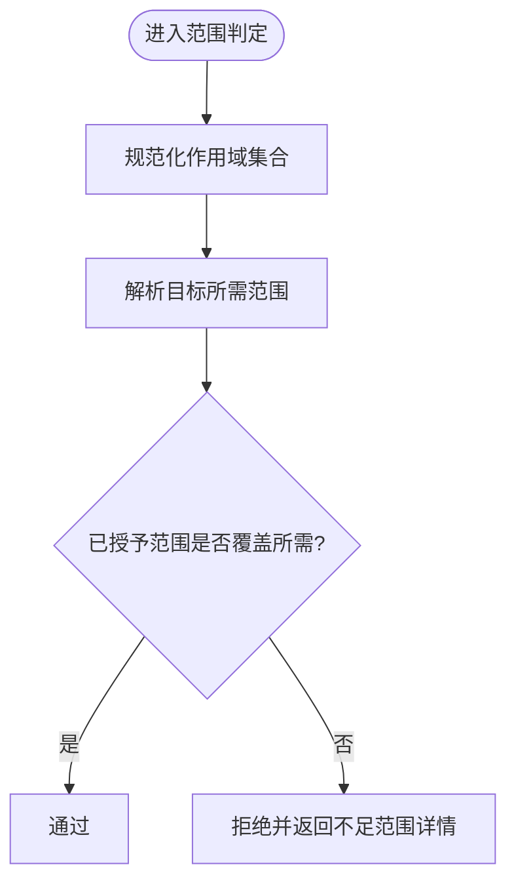
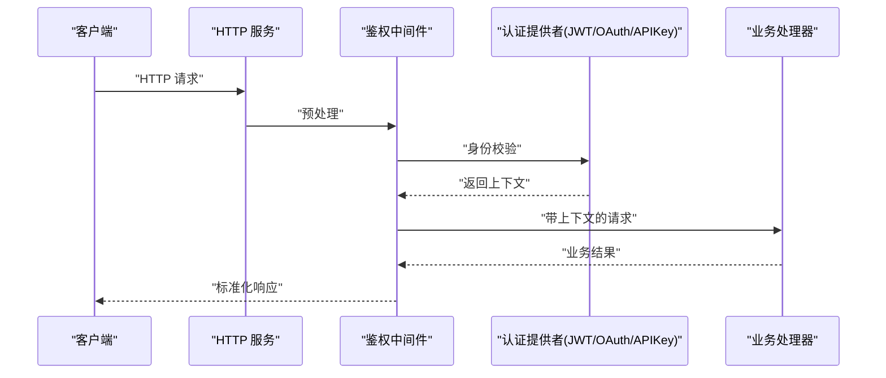
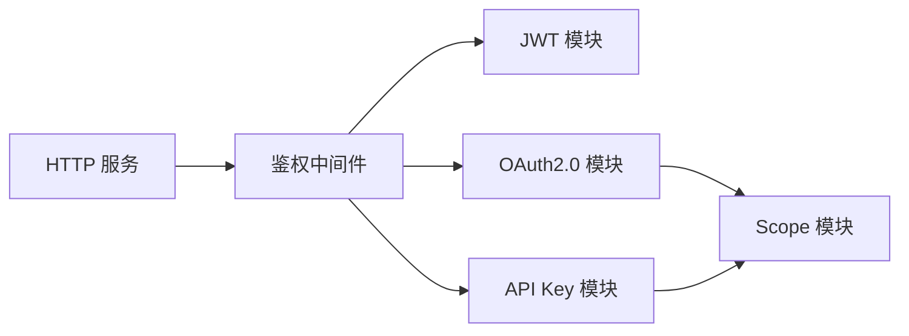

# 认证与授权

<cite>
**本文引用的文件**   
- [src/core/auth/jwt.ts](file://src/core/auth/jwt.ts)
- [src/core/auth/oauth2.ts](file://src/core/auth/oauth2.ts)
- [src/core/auth/apikey.ts](file://src/core/auth/apikey.ts)
- [src/core/auth/scope.ts](file://src/core/auth/scope.ts)
- [src/core/auth/middleware.ts](file://src/core/auth/middleware.ts)
- [src/core/http/server.ts](file://src/core/http/server.ts)
- [test/oauth.test.ts](file://test/oauth.test.ts)
- [test/oauth-authorize-scope-default.test.ts](file://test/oauth-authorize-scope-default.test.ts)
- [test/oauth-confidential-client.test.ts](file://test/oauth-confidential-client.test.ts)
- [test/oauth-scope-probe.test.ts](file://test/oauth-scope-probe.test.ts)
- [test/serve-http-bootstrap-token.test.ts](file://test/serve-http-bootstrap-token.test.ts)
- [test/serve-http-cors.test.ts](file://test/serve-http-cors.test.ts)
- [test/serve-http-trust-proxy.test.ts](file://test/serve-http-trust-proxy.test.ts)
</cite>

## 目录
1. [简介](#简介)
2. [项目结构](#项目结构)
3. [核心组件](#核心组件)
4. [架构总览](#架构总览)
5. [详细组件分析](#详细组件分析)
6. [依赖关系分析](#依赖关系分析)
7. [性能考虑](#性能考虑)
8. [故障排查指南](#故障排查指南)
9. [结论](#结论)
10. [附录](#附录)

## 简介
本文件面向开发者与集成方，系统化说明项目的认证与授权机制，覆盖以下主题：
- JWT 令牌生成、验证与刷新流程；令牌结构与有效期管理；安全注意事项
- OAuth2.0 集成流程（授权码模式、客户端凭证模式）
- API Key 管理与权限范围（scope）控制、访问策略
- 完整的认证请求/响应示例（含错误处理与重试建议）
- 安全最佳实践（令牌存储、传输加密、防重放攻击等）

## 项目结构
认证与授权相关能力主要分布在 core 层的 auth 子模块中，并通过 HTTP 服务层暴露对外接口。测试用例覆盖了 OAuth2.0、CORS、信任代理、引导令牌等关键场景。

图表来源
- [src/core/http/server.ts](file://src/core/http/server.ts)
- [src/core/auth/middleware.ts](file://src/core/auth/middleware.ts)
- [src/core/auth/jwt.ts](file://src/core/auth/jwt.ts)
- [src/core/auth/oauth2.ts](file://src/core/auth/oauth2.ts)
- [src/core/auth/apikey.ts](file://src/core/auth/apikey.ts)
- [src/core/auth/scope.ts](file://src/core/auth/scope.ts)
- [test/oauth.test.ts](file://test/oauth.test.ts)
- [test/oauth-authorize-scope-default.test.ts](file://test/oauth-authorize-scope-default.test.ts)
- [test/oauth-confidential-client.test.ts](file://test/oauth-confidential-client.test.ts)
- [test/oauth-scope-probe.test.ts](file://test/oauth-scope-probe.test.ts)
- [test/serve-http-bootstrap-token.test.ts](file://test/serve-http-bootstrap-token.test.ts)
- [test/serve-http-cors.test.ts](file://test/serve-http-cors.test.ts)
- [test/serve-http-trust-proxy.test.ts](file://test/serve-http-trust-proxy.test.ts)

章节来源
- [src/core/http/server.ts](file://src/core/http/server.ts)
- [src/core/auth/middleware.ts](file://src/core/auth/middleware.ts)
- [src/core/auth/jwt.ts](file://src/core/auth/jwt.ts)
- [src/core/auth/oauth2.ts](file://src/core/auth/oauth2.ts)
- [src/core/auth/apikey.ts](file://src/core/auth/apikey.ts)
- [src/core/auth/scope.ts](file://src/core/auth/scope.ts)
- [test/oauth.test.ts](file://test/oauth.test.ts)
- [test/oauth-authorize-scope-default.test.ts](file://test/oauth-authorize-scope-default.test.ts)
- [test/oauth-confidential-client.test.ts](file://test/oauth-confidential-client.test.ts)
- [test/oauth-scope-probe.test.ts](file://test/oauth-scope-probe.test.ts)
- [test/serve-http-bootstrap-token.test.ts](file://test/serve-http-bootstrap-test.ts)
- [test/serve-http-cors.test.ts](file://test/serve-http-cors.test.ts)
- [test/serve-http-trust-proxy.test.ts](file://test/serve-http-trust-proxy.test.ts)

## 核心组件
- JWT 模块：负责令牌的签发、校验、刷新与过期策略。
- OAuth2.0 模块：实现授权码模式与客户端凭证模式的完整流程，包括授权端点、令牌端点、回调与 scope 解析。
- API Key 模块：提供密钥的创建、校验、作用域绑定与生命周期管理。
- Scope 模块：定义范围集合、包含关系与最小权限原则的判定逻辑。
- 中间件：统一鉴权入口，按策略选择 JWT/OAuth/API Key 校验，并注入上下文。
- HTTP 服务：注册认证路由、CORS、信任代理等配置。

章节来源
- [src/core/auth/jwt.ts](file://src/core/auth/jwt.ts)
- [src/core/auth/oauth2.ts](file://src/core/auth/oauth2.ts)
- [src/core/auth/apikey.ts](file://src/core/auth/apikey.ts)
- [src/core/auth/scope.ts](file://src/core/auth/scope.ts)
- [src/core/auth/middleware.ts](file://src/core/auth/middleware.ts)
- [src/core/http/server.ts](file://src/core/http/server.ts)

## 架构总览
下图展示了从客户端到业务处理的认证与授权主路径，以及各组件之间的协作关系。

图表来源
- [src/core/http/server.ts](file://src/core/http/server.ts)
- [src/core/auth/middleware.ts](file://src/core/auth/middleware.ts)
- [src/core/auth/jwt.ts](file://src/core/auth/jwt.ts)
- [src/core/auth/oauth2.ts](file://src/core/auth/oauth2.ts)
- [src/core/auth/apikey.ts](file://src/core/auth/apikey.ts)
- [src/core/auth/scope.ts](file://src/core/auth/scope.ts)

## 详细组件分析

### JWT 令牌子系统
- 功能要点
  - 签发：根据主体信息、租户标识、作用域集合与有效期生成签名令牌。
  - 校验：验签、检查过期时间、提取声明并注入请求上下文。
  - 刷新：支持短时效访问令牌与长时效刷新令牌组合，提供刷新端点。
  - 安全：使用强随机源、严格算法白名单、最小必要声明、可撤销黑名单（可选）。
- 数据结构（概念）
  - Header：算法、类型
  - Payload：主体 ID、租户 ID、角色/组、作用域集合、签发时间、过期时间、一次性使用标记（可选）
  - Signature：HMAC/RSA/ECDSA 签名
- 复杂度与性能
  - 校验为常数时间操作（取决于签名算法），适合高并发网关层前置校验。
- 优化建议
  - 将公钥/密钥材料缓存于内存，避免每次 IO。
  - 对高频校验路径引入本地 LRU 黑名单缓存（短期失效）。

图表来源
- [src/core/auth/jwt.ts](file://src/core/auth/jwt.ts)

章节来源
- [src/core/auth/jwt.ts](file://src/core/auth/jwt.ts)

### OAuth2.0 集成
- 支持的流程
  - 授权码模式（Authorization Code）：适用于 Web/移动端应用，支持 PKCE。
  - 客户端凭证模式（Client Credentials）：适用于服务端对服务端调用。
- 关键端点（概念）
  - /authorize：发起授权，返回授权码或直返令牌（视模式而定）
  - /token：交换令牌，支持 access_token 与 refresh_token
  - /userinfo：获取当前用户信息（可选）
- 交互时序（授权码模式）

- 交互时序（客户端凭证模式）

- 安全要点
  - 强制 HTTPS、严格 redirect_uri 白名单、PKCE 防护授权码泄露。
  - 客户端凭证模式仅用于可信后端服务，严格限制 scope 与 IP 白名单。
  - 令牌最小化与最短有效期，配合刷新令牌轮换。

图表来源
- [src/core/auth/oauth2.ts](file://src/core/auth/oauth2.ts)
- [src/core/auth/scope.ts](file://src/core/auth/scope.ts)
- [src/core/auth/jwt.ts](file://src/core/auth/jwt.ts)

章节来源
- [src/core/auth/oauth2.ts](file://src/core/auth/oauth2.ts)
- [test/oauth.test.ts](file://test/oauth.test.ts)
- [test/oauth-authorize-scope-default.test.ts](file://test/oauth-authorize-scope-default.test.ts)
- [test/oauth-confidential-client.test.ts](file://test/oauth-confidential-client.test.ts)
- [test/oauth-scope-probe.test.ts](file://test/oauth-scope-probe.test.ts)

### API Key 管理
- 功能要点
  - 创建/吊销：支持按租户/项目维度创建与回收。
  - 校验：快速验签与哈希比对，支持前缀索引加速查找。
  - 作用域：每个 Key 绑定最小权限集合，支持动态扩展与审计。
  - 限流与审计：结合速率限制与审计日志，便于追踪异常。
- 安全要点
  - 仅在后端安全存储摘要值，禁止明文落盘。
  - 传输必须 HTTPS，并在网关层做速率限制与地域/IP 白名单。

图表来源
- [src/core/auth/apikey.ts](file://src/core/auth/apikey.ts)
- [src/core/auth/scope.ts](file://src/core/auth/scope.ts)

章节来源
- [src/core/auth/apikey.ts](file://src/core/auth/apikey.ts)
- [src/core/auth/scope.ts](file://src/core/auth/scope.ts)

### 权限范围（Scope）与访问策略
- 设计原则
  - 最小权限：默认无权限，显式授予。
  - 继承与聚合：支持父级作用域向子级继承，聚合多个资源的粒度。
  - 动态评估：在请求路径上实时计算是否满足所需范围。
- 典型用法
  - 资源级：如 read:documents、write:documents
  - 操作级：如 execute:agent、publish:skillpack
  - 环境级：如 env:prod、env:staging

图表来源
- [src/core/auth/scope.ts](file://src/core/auth/scope.ts)

章节来源
- [src/core/auth/scope.ts](file://src/core/auth/scope.ts)

### 鉴权中间件与 HTTP 服务
- 中间件职责
  - 统一入口：识别 Bearer/OAuth/API Key 三种方式。
  - 上下文注入：将用户、租户、作用域写入请求上下文供后续处理器使用。
  - 错误归一化：将各类失败转换为标准错误格式。
- HTTP 服务
  - 路由注册：/authorize、/token、/refresh、/whoami 等。
  - 安全开关：CORS、信任代理、HTTPS 强制、超时与限流。

图表来源
- [src/core/http/server.ts](file://src/core/http/server.ts)
- [src/core/auth/middleware.ts](file://src/core/auth/middleware.ts)

章节来源
- [src/core/http/server.ts](file://src/core/http/server.ts)
- [src/core/auth/middleware.ts](file://src/core/auth/middleware.ts)
- [test/serve-http-cors.test.ts](file://test/serve-http-cors.test.ts)
- [test/serve-http-trust-proxy.test.ts](file://test/serve-http-trust-proxy.test.ts)
- [test/serve-http-bootstrap-token.test.ts](file://test/serve-http-bootstrap-token.test.ts)

## 依赖关系分析
- 耦合与内聚
  - 中间件低耦合地依赖 JWT/OAuth/APIKey 抽象，便于替换与扩展。
  - Scope 作为独立模块被多组件复用，提升内聚性。
- 外部依赖
  - 密码学库（签名/验签）、HTTP 框架、配置中心（密钥/证书）。
- 潜在循环依赖
  - 通过分层与接口隔离避免循环引用。

图表来源
- [src/core/auth/middleware.ts](file://src/core/auth/middleware.ts)
- [src/core/auth/jwt.ts](file://src/core/auth/jwt.ts)
- [src/core/auth/oauth2.ts](file://src/core/auth/oauth2.ts)
- [src/core/auth/apikey.ts](file://src/core/auth/apikey.ts)
- [src/core/auth/scope.ts](file://src/core/auth/scope.ts)
- [src/core/http/server.ts](file://src/core/http/server.ts)

章节来源
- [src/core/auth/middleware.ts](file://src/core/auth/middleware.ts)
- [src/core/auth/jwt.ts](file://src/core/auth/jwt.ts)
- [src/core/auth/oauth2.ts](file://src/core/auth/oauth2.ts)
- [src/core/auth/apikey.ts](file://src/core/auth/apikey.ts)
- [src/core/auth/scope.ts](file://src/core/auth/scope.ts)
- [src/core/http/server.ts](file://src/core/http/server.ts)

## 性能考虑
- 令牌校验
  - 优先在边缘网关完成签名校验，减少后端压力。
  - 使用内存缓存公钥/黑名单，降低 I/O 开销。
- 作用域判定
  - 预计算与缓存常用作用域组合，避免重复集合运算。
- 并发与限流
  - 对令牌端点实施严格的速率限制与熔断策略。
  - 区分读写路径，读多写少场景下采用只读副本承载校验。

[本节为通用指导，不直接分析具体文件]

## 故障排查指南
- 常见问题
  - 401 未认证：检查 Authorization 头格式、令牌是否过期、签名算法是否匹配。
  - 403 未授权：核对所需 scope 是否已授予，确认作用域继承规则。
  - 400 参数错误：检查 OAuth 授权请求参数（redirect_uri、state、code_challenge）。
  - 网络问题：确认 CORS 配置、反向代理信任设置与 HTTPS 证书链。
- 定位步骤
  - 开启调试日志，记录进入中间件的原始请求与解析后的上下文。
  - 复现最小用例，逐步关闭特性（如禁用缓存、放宽 scope）定位根因。
  - 针对 OAuth 流程，分别校验 /authorize 与 /token 的输入输出。
- 参考测试
  - 授权码默认 scope、机密客户端、scope 探测、CORS、信任代理、引导令牌等场景。

章节来源
- [test/oauth.test.ts](file://test/oauth.test.ts)
- [test/oauth-authorize-scope-default.test.ts](file://test/oauth-authorize-scope-default.test.ts)
- [test/oauth-confidential-client.test.ts](file://test/oauth-confidential-client.test.ts)
- [test/oauth-scope-probe.test.ts](file://test/oauth-scope-probe.test.ts)
- [test/serve-http-cors.test.ts](file://test/serve-http-cors.test.ts)
- [test/serve-http-trust-proxy.test.ts](file://test/serve-http-trust-proxy.test.ts)
- [test/serve-http-bootstrap-token.test.ts](file://test/serve-http-bootstrap-token.test.ts)

## 结论
本项目围绕 JWT、OAuth2.0 与 API Key 构建了统一的认证与授权体系，并通过中间件与 Scope 模块实现最小权限与可扩展的访问控制。建议在部署时遵循安全最佳实践，结合限流、审计与监控，确保系统在高可用与安全之间取得平衡。

[本节为总结性内容，不直接分析具体文件]

## 附录

### 认证请求/响应示例（概念）
- Bearer Token（JWT）
  - 请求头：Authorization: Bearer <token>
  - 成功响应：业务数据
  - 失败响应：401/403，附带错误码与简要原因
- OAuth2.0 授权码模式
  - 授权请求：GET /authorize?client_id=...&redirect_uri=...&scope=...&response_type=code&code_challenge=...
  - 令牌请求：POST /token {grant_type=authorization_code, code, code_verifier, client_id, redirect_uri}
  - 成功响应：{access_token, token_type, expires_in, refresh_token(可选)}
- OAuth2.0 客户端凭证模式
  - 令牌请求：POST /token {grant_type=client_credentials, client_id, client_secret, scope}
  - 成功响应：同上
- API Key
  - 请求头：X-API-Key: <key> 或 Authorization: ApiKey <key>
  - 成功响应：业务数据
  - 失败响应：401/403，附带错误码与简要原因

[本节为概念性示例，不直接分析具体文件]

### 安全最佳实践清单
- 传输安全
  - 全站 HTTPS，启用 HSTS；正确配置反向代理与证书链。
- 令牌安全
  - 使用强随机源与最新算法；最小化声明；短有效期+刷新令牌轮换。
  - 服务端侧存储摘要/指纹，禁止明文持久化敏感信息。
- 防重放与幂等
  - 对关键写操作引入一次性 nonce 或请求指纹校验；服务端维护短期去重窗口。
- 最小权限与审计
  - 默认拒绝，显式授予；记录关键操作的审计日志与指标。
- 边界防护
  - 对令牌端点与敏感接口实施速率限制、IP 白名单与地理围栏。

[本节为通用指导，不直接分析具体文件]