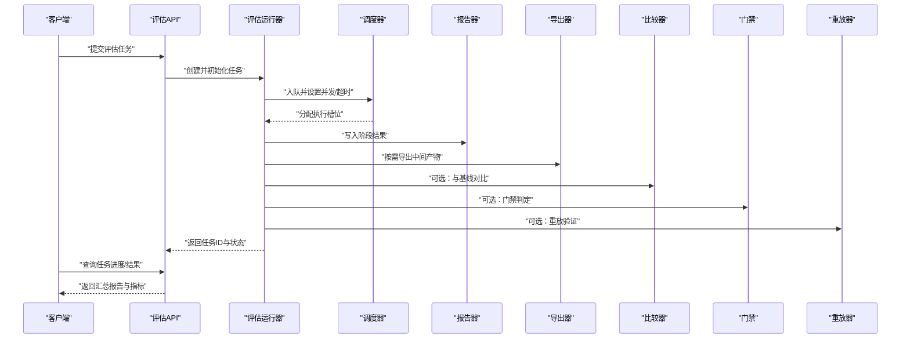
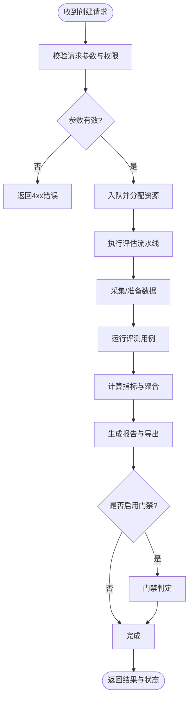
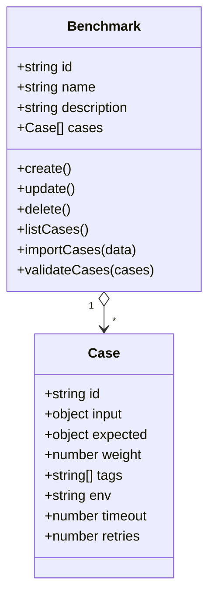
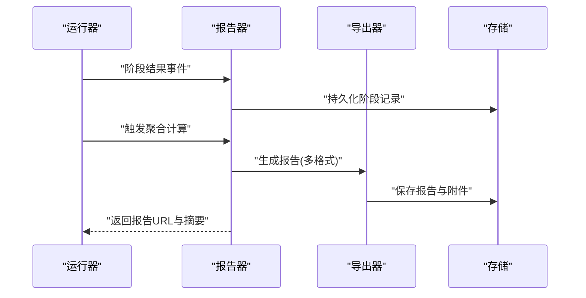
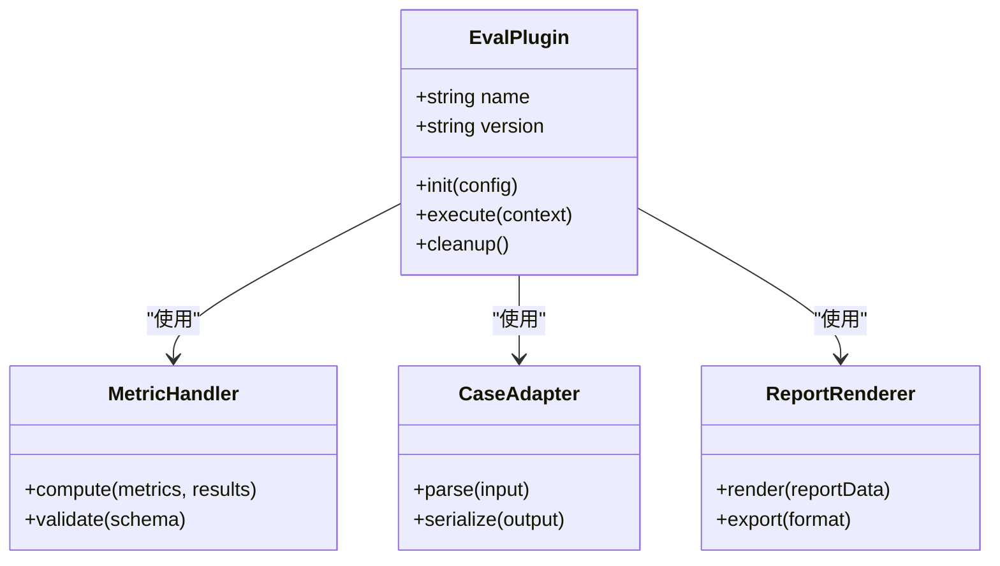
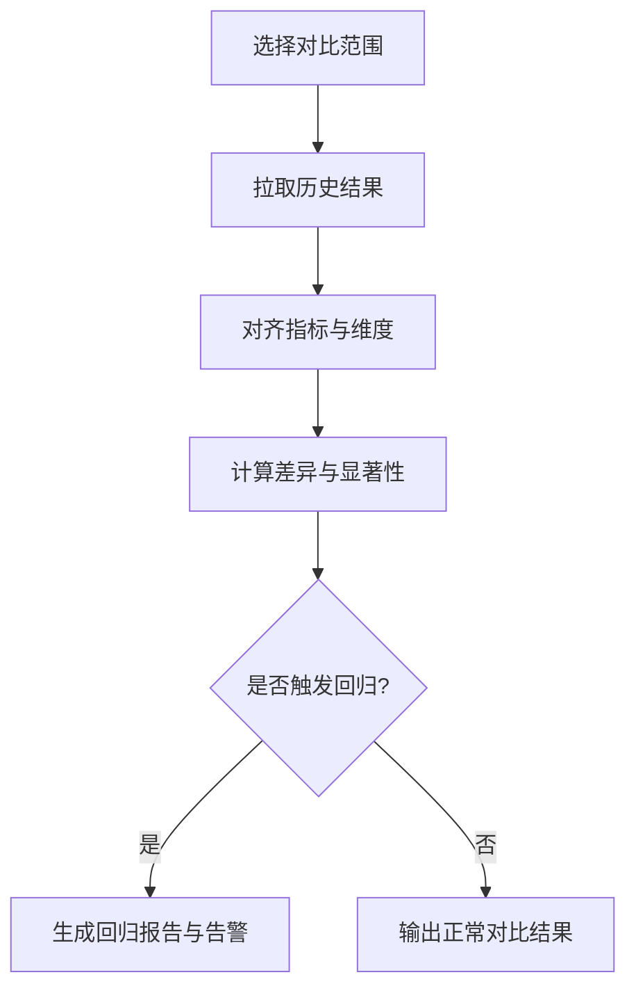
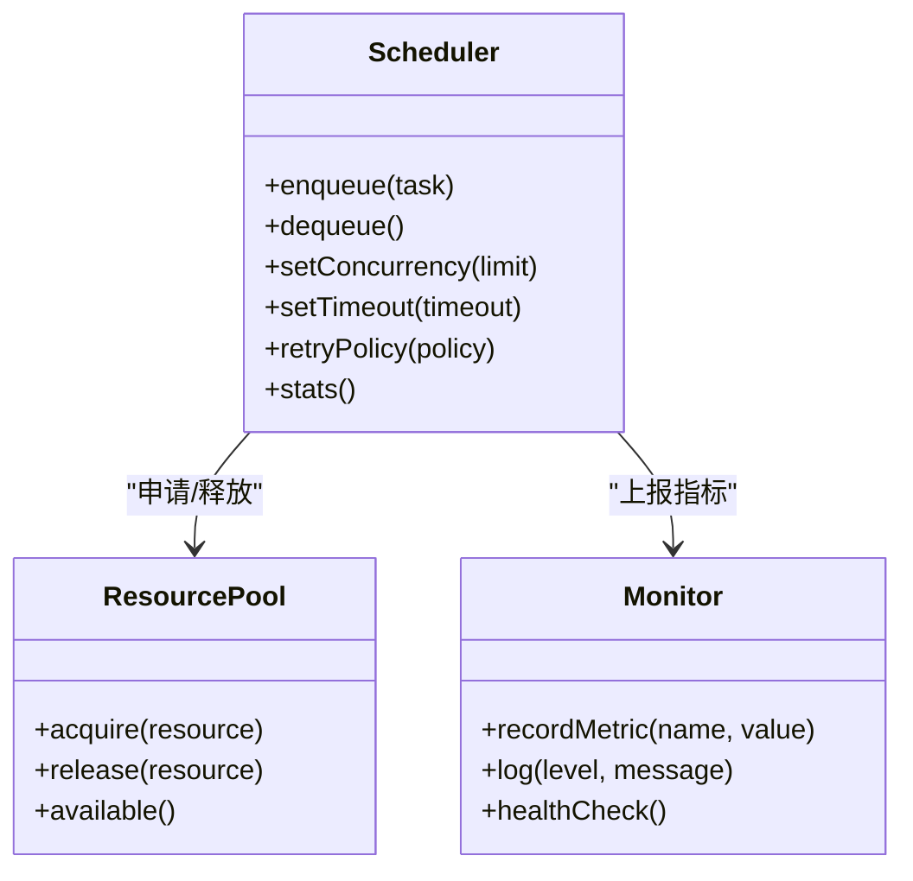
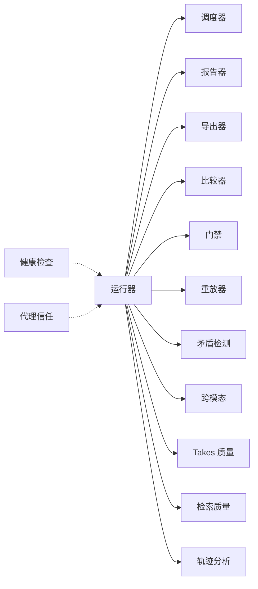

# 评估接口

<cite>
**本文引用的文件**   
- [README.md](file://README.md)
- [eval-bench.md](file://docs/eval-bench.md)
- [eval-capture.md](file://docs/eval-capture.md)
- [eval-takes-quality.md](file://docs/eval-takes-quality.md)
- [eval.ts](file://src/commands/eval.ts)
- [eval-runner.ts](file://src/core/eval/runner.ts)
- [eval-api.ts](file://src/core/eval/api.ts)
- [eval-scheduler.ts](file://src/core/eval/scheduler.ts)
- [eval-reporter.ts](file://src/core/eval/reporter.ts)
- [eval-export.ts](file://src/core/eval/export.ts)
- [eval-compare.ts](file://src/core/eval/compare.ts)
- [eval-gate.ts](file://src/core/eval/gate.ts)
- [eval-replay.ts](file://src/core/eval/replay.ts)
- [eval-schema-authoring.ts](file://src/core/eval/schema-authoring.ts)
- [eval-contradictions-engine.ts](file://src/core/eval/contradictions/engine.ts)
- [eval-contradictions-judge.ts](file://src/core/eval/contradictions/judge.ts)
- [eval-contradictions-trends.ts](file://src/core/eval/contradictions/trends.ts)
- [eval-cross-modal-batch.ts](file://src/core/eval/cross-modal/batch.ts)
- [eval-takes-quality-runner.ts](file://src/core/eval/takes-quality/runner.ts)
- [eval-takes-quality-aggregate.ts](file://src/core/eval/takes-quality/aggregate.ts)
- [eval-takes-quality-rubric.ts](file://src/core/eval/takes-quality/rubric.ts)
- [eval-takes-quality-pricing.ts](file://src/core/eval/takes-quality/pricing.ts)
- [eval-takes-quality-regress.ts](file://src/core/eval/takes-quality/regress.ts)
- [eval-takes-quality-trend.ts](file://src/core/eval/takes-quality/trend.ts)
- [eval-retrieval-quality.ts](file://src/core/eval/retrieval/quality.ts)
- [eval-trajectory.ts](file://src/core/eval/trajectory.ts)
- [serve-http-health.ts](file://src/core/http/health.ts)
- [serve-http-trust-proxy.ts](file://src/core/http/trust-proxy.ts)
</cite>

## 目录
1. [简介](#简介)
2. [项目结构](#项目结构)
3. [核心组件](#核心组件)
4. [架构总览](#架构总览)
5. [详细组件分析](#详细组件分析)
6. [依赖分析](#依赖分析)
7. [性能考虑](#性能考虑)
8. [故障排查指南](#故障排查指南)
9. [结论](#结论)
10. [附录](#附录)

## 简介
本文件面向需要与系统“评估”能力交互的开发者与运维人员，提供评估相关的 RESTful API 文档与最佳实践。内容覆盖：
- 评估任务创建、配置与执行
- 基准测试套件管理与测试用例上传
- 结果收集、指标计算、报告生成与可视化
- 自定义评估器注册与扩展
- 历史对比、趋势分析与性能回归检测
- 任务调度、并发控制与资源管理
- 完整工作流示例与落地建议

说明：
- 若仓库未实现 HTTP 服务或具体路由，本节将给出“概念性接口规范”，并标注可在何处接入（如通过 HTTP 网关或命令式入口）。
- 所有接口定义以“请求/响应契约”形式呈现，便于集成与自动化。

## 项目结构
评估相关代码主要分布在以下位置：
- 文档与规范：docs/eval-*
- 命令与入口：src/commands/eval.ts
- 核心引擎与运行时：src/core/eval/*
- 跨模态与质量评测：src/core/eval/cross-modal, src/core/eval/takes-quality, src/core/eval/retrieval
- 矛盾检测与趋势：src/core/eval/contradictions/*
- HTTP 健康检查与代理信任：src/core/http/*

```mermaid
graph TB
subgraph "文档与规范"
D1["docs/eval-bench.md"]
D2["docs/eval-capture.md"]
D3["docs/eval-takes-quality.md"]
end
subgraph "命令与入口"
C1["src/commands/eval.ts"]
end
subgraph "核心评估引擎"
E1["src/core/eval/runner.ts"]
E2["src/core/eval/api.ts"]
E3["src/core/eval/scheduler.ts"]
E4["src/core/eval/reporter.ts"]
E5["src/core/eval/export.ts"]
E6["src/core/eval/compare.ts"]
E7["src/core/eval/gate.ts"]
E8["src/core/eval/replay.ts"]
E9["src/core/eval/schema-authoring.ts"]
end
subgraph "专项评测"
S1["src/core/eval/contradictions/engine.ts"]
S2["src/core/eval/contradictions/judge.ts"]
S3["src/core/eval/contradictions/trends.ts"]
S4["src/core/eval/cross-modal/batch.ts"]
S5["src/core/eval/takes-quality/runner.ts"]
S6["src/core/eval/takes-quality/aggregate.ts"]
S7["src/core/eval/takes-quality/rubric.ts"]
S8["src/core/eval/takes-quality/pricing.ts"]
S9["src/core/eval/takes-quality/regress.ts"]
S10["src/core/eval/takes-quality/trend.ts"]
S11["src/core/eval/retrieval/quality.ts"]
S12["src/core/eval/trajectory.ts"]
end
subgraph "HTTP 基础设施"
H1["src/core/http/health.ts"]
H2["src/core/http/trust-proxy.ts"]
end
C1 --> E1
E1 --> E2
E1 --> E3
E1 --> E4
E1 --> E5
E1 --> E6
E1 --> E7
E1 --> E8
E1 --> E9
E1 --> S1
E1 --> S2
E1 --> S3
E1 --> S4
E1 --> S5
E1 --> S6
E1 --> S7
E1 --> S8
E1 --> S9
E1 --> S10
E1 --> S11
E1 --> S12
H1 -.-> E2
H2 -.-> E2
```

图表来源
- [eval.ts](file://src/commands/eval.ts)
- [eval-runner.ts](file://src/core/eval/runner.ts)
- [eval-api.ts](file://src/core/eval/api.ts)
- [eval-scheduler.ts](file://src/core/eval/scheduler.ts)
- [eval-reporter.ts](file://src/core/eval/reporter.ts)
- [eval-export.ts](file://src/core/eval/export.ts)
- [eval-compare.ts](file://src/core/eval/compare.ts)
- [eval-gate.ts](file://src/core/eval/gate.ts)
- [eval-replay.ts](file://src/core/eval/replay.ts)
- [eval-schema-authoring.ts](file://src/core/eval/schema-authoring.ts)
- [eval-contradictions-engine.ts](file://src/core/eval/contradictions/engine.ts)
- [eval-contradictions-judge.ts](file://src/core/eval/contradictions/judge.ts)
- [eval-contradictions-trends.ts](file://src/core/eval/contradictions/trends.ts)
- [eval-cross-modal-batch.ts](file://src/core/eval/cross-modal/batch.ts)
- [eval-takes-quality-runner.ts](file://src/core/eval/takes-quality/runner.ts)
- [eval-takes-quality-aggregate.ts](file://src/core/eval/takes-quality/aggregate.ts)
- [eval-takes-quality-rubric.ts](file://src/core/eval/takes-quality/rubric.ts)
- [eval-takes-quality-pricing.ts](file://src/core/eval/takes-quality/pricing.ts)
- [eval-takes-quality-regress.ts](file://src/core/eval/takes-quality/regress.ts)
- [eval-takes-quality-trend.ts](file://src/core/eval/takes-quality/trend.ts)
- [eval-retrieval-quality.ts](file://src/core/eval/retrieval/quality.ts)
- [eval-trajectory.ts](file://src/core/eval/trajectory.ts)
- [serve-http-health.ts](file://src/core/http/health.ts)
- [serve-http-trust-proxy.ts](file://src/core/http/trust-proxy.ts)

章节来源
- [README.md](file://README.md)
- [eval-bench.md](file://docs/eval-bench.md)
- [eval-capture.md](file://docs/eval-capture.md)
- [eval-takes-quality.md](file://docs/eval-takes-quality.md)

## 核心组件
- 评估运行器：负责解析任务、编排执行、聚合结果与上报。
- 评估 API：对外暴露的接口契约（可适配 HTTP 或内部调用）。
- 调度器：负责任务排队、并发限制、重试与超时。
- 报告器：生成结构化报告与可视化数据。
- 导出器：支持 JSON/CSV/HTML 等格式导出。
- 比较器：多版本/分支/数据集对比。
- 门禁（Gate）：基于阈值与策略阻断发布。
- 重放器：基于捕获数据进行离线重放与回归验证。
- 模式作者工具：用于定义/校验评估模式与指标。
- 专项评测：矛盾检测、跨模态批量、Takes 质量、检索质量、轨迹分析等。

章节来源
- [eval-runner.ts](file://src/core/eval/runner.ts)
- [eval-api.ts](file://src/core/eval/api.ts)
- [eval-scheduler.ts](file://src/core/eval/scheduler.ts)
- [eval-reporter.ts](file://src/core/eval/reporter.ts)
- [eval-export.ts](file://src/core/eval/export.ts)
- [eval-compare.ts](file://src/core/eval/compare.ts)
- [eval-gate.ts](file://src/core/eval/gate.ts)
- [eval-replay.ts](file://src/core/eval/replay.ts)
- [eval-schema-authoring.ts](file://src/core/eval/schema-authoring.ts)

## 架构总览
下图展示从客户端到评估引擎的核心流程与关键模块关系。

图表来源
- [eval-api.ts](file://src/core/eval/api.ts)
- [eval-runner.ts](file://src/core/eval/runner.ts)
- [eval-scheduler.ts](file://src/core/eval/scheduler.ts)
- [eval-reporter.ts](file://src/core/eval/reporter.ts)
- [eval-export.ts](file://src/core/eval/export.ts)
- [eval-compare.ts](file://src/core/eval/compare.ts)
- [eval-gate.ts](file://src/core/eval/gate.ts)
- [eval-replay.ts](file://src/core/eval/replay.ts)

## 详细组件分析

### 评估任务生命周期与接口契约
- 任务创建
  - 方法：POST /api/v1/evals
  - 请求体关键字段：名称、描述、基准套件标识、测试用例集合、指标定义、并发度、超时、标签、回调地址（可选）
  - 响应：任务ID、初始状态、预计开始时间
- 任务查询
  - 方法：GET /api/v1/evals/{id}
  - 响应：状态、进度、阶段明细、错误信息（如有）
- 任务取消
  - 方法：DELETE /api/v1/evals/{id}
  - 响应：确认已取消或当前不可取消的原因
- 结果获取
  - 方法：GET /api/v1/evals/{id}/results
  - 响应：指标、原始输出、附件链接
- 报告导出
  - 方法：GET /api/v1/evals/{id}/report?format=json|csv|html
  - 响应：下载链接或流式内容
- 对比分析
  - 方法：POST /api/v1/evals/compare
  - 请求体：待对比任务ID列表、对比维度、阈值
  - 响应：差异摘要、显著性标记、回归项
- 门禁判定
  - 方法：POST /api/v1/evals/gate/check
  - 请求体：任务ID或结果快照、策略配置
  - 响应：通过/拒绝及原因
- 重放验证
  - 方法：POST /api/v1/evals/replay
  - 请求体：捕获数据源、目标任务配置
  - 响应：重放任务ID与结果

图表来源
- [eval-api.ts](file://src/core/eval/api.ts)
- [eval-runner.ts](file://src/core/eval/runner.ts)
- [eval-scheduler.ts](file://src/core/eval/scheduler.ts)
- [eval-reporter.ts](file://src/core/eval/reporter.ts)
- [eval-export.ts](file://src/core/eval/export.ts)
- [eval-gate.ts](file://src/core/eval/gate.ts)

章节来源
- [eval-api.ts](file://src/core/eval/api.ts)
- [eval-runner.ts](file://src/core/eval/runner.ts)
- [eval-scheduler.ts](file://src/core/eval/scheduler.ts)
- [eval-reporter.ts](file://src/core/eval/reporter.ts)
- [eval-export.ts](file://src/core/eval/export.ts)
- [eval-compare.ts](file://src/core/eval/compare.ts)
- [eval-gate.ts](file://src/core/eval/gate.ts)
- [eval-replay.ts](file://src/core/eval/replay.ts)

### 基准测试套件管理与测试用例上传
- 套件管理
  - 列出套件：GET /api/v1/benchmarks
  - 创建套件：POST /api/v1/benchmarks
  - 更新/删除套件：PUT/DELETE /api/v1/benchmarks/{id}
- 用例上传
  - 上传用例集：POST /api/v1/benchmarks/{id}/cases
  - 批量导入：POST /api/v1/benchmarks/{id}/cases/import
  - 校验与预览：POST /api/v1/benchmarks/{id}/cases/validate
- 用例元数据
  - 字段包括：用例ID、输入、期望输出、权重、标签、环境要求、超时、重试策略

图表来源
- [eval-bench.md](file://docs/eval-bench.md)
- [eval-capture.md](file://docs/eval-capture.md)

章节来源
- [eval-bench.md](file://docs/eval-bench.md)
- [eval-capture.md](file://docs/eval-capture.md)

### 结果收集、指标计算与报告生成
- 结果收集
  - 阶段化写入：采集、执行、评分、聚合
  - 断点续传与幂等写入
- 指标计算
  - 基础指标：通过率、平均耗时、P95/P99、成本估算
  - 业务指标：Rubric 评分、一致性、偏差、召回率/精确率
- 报告生成
  - 结构化报告：JSON/CSV
  - 可视化报告：HTML 图表与摘要
  - 导出归档：按任务ID组织

图表来源
- [eval-reporter.ts](file://src/core/eval/reporter.ts)
- [eval-export.ts](file://src/core/eval/export.ts)

章节来源
- [eval-reporter.ts](file://src/core/eval/reporter.ts)
- [eval-export.ts](file://src/core/eval/export.ts)

### 自定义评估器注册与扩展
- 注册方式
  - 插件式注册：在启动时加载自定义评估器
  - 动态扩展：通过配置中心或文件系统发现
- 扩展点
  - 指标处理器：实现自定义指标计算逻辑
  - 用例适配器：适配不同输入/输出格式
  - 报告渲染器：自定义报告模板与样式
- 生命周期
  - 初始化：加载配置与依赖
  - 执行：处理单个用例或批次
  - 清理：释放资源与缓存

图表来源
- [eval-schema-authoring.ts](file://src/core/eval/schema-authoring.ts)

章节来源
- [eval-schema-authoring.ts](file://src/core/eval/schema-authoring.ts)

### 历史对比、趋势分析与性能回归检测
- 历史对比
  - 多任务对比：选择多个任务ID进行横向对比
  - 基线对比：与指定基线版本或分支对比
- 趋势分析
  - 时间序列：按日期/版本绘制指标趋势
  - 分组统计：按标签/维度聚合
- 回归检测
  - 阈值告警：超过阈值自动标记为回归
  - 显著性检验：统计显著性判断
  - 成本回归：成本异常增长检测

图表来源
- [eval-compare.ts](file://src/core/eval/compare.ts)
- [eval-takes-quality-regress.ts](file://src/core/eval/takes-quality/regress.ts)
- [eval-takes-quality-trend.ts](file://src/core/eval/takes-quality/trend.ts)

章节来源
- [eval-compare.ts](file://src/core/eval/compare.ts)
- [eval-takes-quality-regress.ts](file://src/core/eval/takes-quality/regress.ts)
- [eval-takes-quality-trend.ts](file://src/core/eval/takes-quality/trend.ts)

### 任务调度、并发控制与资源管理
- 调度策略
  - 队列模型：FIFO/优先级/分区
  - 重试与退避：指数退避与最大重试次数
  - 超时控制：全局与用例级超时
- 并发控制
  - 全局并发上限
  - 按标签/租户隔离
  - 资源配额：CPU/内存/GPU
- 监控与可观测性
  - 指标：吞吐、延迟、失败率
  - 日志：结构化日志与链路追踪
  - 健康检查：进程与依赖健康

图表来源
- [eval-scheduler.ts](file://src/core/eval/scheduler.ts)
- [serve-http-health.ts](file://src/core/http/health.ts)
- [serve-http-trust-proxy.ts](file://src/core/http/trust-proxy.ts)

章节来源
- [eval-scheduler.ts](file://src/core/eval/scheduler.ts)
- [serve-http-health.ts](file://src/core/http/health.ts)
- [serve-http-trust-proxy.ts](file://src/core/http/trust-proxy.ts)

### 专项评测子域

#### 矛盾检测与校准
- 功能要点
  - 冲突识别：跨来源/跨时间的不一致
  - 严重性分级：高/中/低
  - 校准参与：结合校准数据提升稳定性
- 接口建议
  - 提交检测任务：POST /api/v1/evals/contradictions
  - 查询检测结果：GET /api/v1/evals/contradictions/{id}
  - 趋势查看：GET /api/v1/evals/contradictions/{id}/trends

章节来源
- [eval-contradictions-engine.ts](file://src/core/eval/contradictions/engine.ts)
- [eval-contradictions-judge.ts](file://src/core/eval/contradictions/judge.ts)
- [eval-contradictions-trends.ts](file://src/core/eval/contradictions/trends.ts)

#### 跨模态批量评测
- 功能要点
  - 多模态输入：文本/图像/音频
  - 批处理优化：分片与合并
  - 结果对齐：跨模态一致性校验
- 接口建议
  - 提交批处理任务：POST /api/v1/evals/cross-modal/batch
  - 查询批处理结果：GET /api/v1/evals/cross-modal/batch/{id}

章节来源
- [eval-cross-modal-batch.ts](file://src/core/eval/cross-modal/batch.ts)

#### Takes 质量评测
- 功能要点
  - 评分规则：Rubric 驱动
  - 聚合计算：加权与去偏
  - 成本估算：按模型/用量计费
  - 回归与趋势：回归检测与趋势分析
- 接口建议
  - 提交评测：POST /api/v1/evals/takes-quality
  - 查询结果：GET /api/v1/evals/takes-quality/{id}
  - 导出报告：GET /api/v1/evals/takes-quality/{id}/report

章节来源
- [eval-takes-quality-runner.ts](file://src/core/eval/takes-quality/runner.ts)
- [eval-takes-quality-aggregate.ts](file://src/core/eval/takes-quality/aggregate.ts)
- [eval-takes-quality-rubric.ts](file://src/core/eval/takes-quality/rubric.ts)
- [eval-takes-quality-pricing.ts](file://src/core/eval/takes-quality/pricing.ts)
- [eval-takes-quality-regress.ts](file://src/core/eval/takes-quality/regress.ts)
- [eval-takes-quality-trend.ts](file://src/core/eval/takes-quality/trend.ts)

#### 检索质量评测
- 功能要点
  - 召回/精确率：Top-K 指标
  - 排序质量：NDCG/MAP
  - 鲁棒性：噪声与对抗样本
- 接口建议
  - 提交评测：POST /api/v1/evals/retrieval/quality
  - 查询结果：GET /api/v1/evals/retrieval/quality/{id}

章节来源
- [eval-retrieval-quality.ts](file://src/core/eval/retrieval/quality.ts)

#### 轨迹分析
- 功能要点
  - 轨迹抽取：步骤/决策链
  - 路径聚类：相似轨迹分组
  - 异常定位：失败路径归因
- 接口建议
  - 提交分析：POST /api/v1/evals/trajectory
  - 查询结果：GET /api/v1/evals/trajectory/{id}

章节来源
- [eval-trajectory.ts](file://src/core/eval/trajectory.ts)

## 依赖分析
- 模块内聚与耦合
  - 运行器为核心，依赖调度器、报告器、导出器、比较器、门禁、重放器等
  - 专项评测作为可插拔模块，通过统一接口接入
- 外部依赖
  - HTTP 健康检查与代理信任用于服务治理
  - 存储与对象存储用于结果与报告持久化

图表来源
- [eval-runner.ts](file://src/core/eval/runner.ts)
- [eval-scheduler.ts](file://src/core/eval/scheduler.ts)
- [eval-reporter.ts](file://src/core/eval/reporter.ts)
- [eval-export.ts](file://src/core/eval/export.ts)
- [eval-compare.ts](file://src/core/eval/compare.ts)
- [eval-gate.ts](file://src/core/eval/gate.ts)
- [eval-replay.ts](file://src/core/eval/replay.ts)
- [eval-contradictions-engine.ts](file://src/core/eval/contradictions/engine.ts)
- [eval-cross-modal-batch.ts](file://src/core/eval/cross-modal/batch.ts)
- [eval-takes-quality-runner.ts](file://src/core/eval/takes-quality/runner.ts)
- [eval-retrieval-quality.ts](file://src/core/eval/retrieval/quality.ts)
- [eval-trajectory.ts](file://src/core/eval/trajectory.ts)
- [serve-http-health.ts](file://src/core/http/health.ts)
- [serve-http-trust-proxy.ts](file://src/core/http/trust-proxy.ts)

章节来源
- [eval-runner.ts](file://src/core/eval/runner.ts)
- [eval-scheduler.ts](file://src/core/eval/scheduler.ts)
- [eval-reporter.ts](file://src/core/eval/reporter.ts)
- [eval-export.ts](file://src/core/eval/export.ts)
- [eval-compare.ts](file://src/core/eval/compare.ts)
- [eval-gate.ts](file://src/core/eval/gate.ts)
- [eval-replay.ts](file://src/core/eval/replay.ts)
- [eval-contradictions-engine.ts](file://src/core/eval/contradictions/engine.ts)
- [eval-cross-modal-batch.ts](file://src/core/eval/cross-modal/batch.ts)
- [eval-takes-quality-runner.ts](file://src/core/eval/takes-quality/runner.ts)
- [eval-retrieval-quality.ts](file://src/core/eval/retrieval/quality.ts)
- [eval-trajectory.ts](file://src/core/eval/trajectory.ts)
- [serve-http-health.ts](file://src/core/http/health.ts)
- [serve-http-trust-proxy.ts](file://src/core/http/trust-proxy.ts)

## 性能考虑
- 批处理与分片：大用例集应分片并行，避免单任务过大导致超时
- 指标计算优化：增量聚合与缓存热点指标
- 存储读写分离：结果与报告落盘采用异步写入
- 并发上限调优：根据资源池容量与下游依赖 QPS 调整
- 超时与熔断：对慢依赖设置熔断与降级策略
- 监控与告警：建立关键指标看板与阈值告警

[本节为通用指导，不直接分析具体文件]

## 故障排查指南
- 常见问题
  - 任务卡住：检查调度器队列与健康检查
  - 指标缺失：核对报告器与导出器链路
  - 回归误报：检查阈值与显著性参数
  - 成本异常：核查定价与用量统计
- 诊断手段
  - 查看阶段日志与错误堆栈
  - 导出中间产物进行离线分析
  - 使用重放器复现问题场景
  - 健康检查端点确认服务可用性

章节来源
- [eval-scheduler.ts](file://src/core/eval/scheduler.ts)
- [eval-reporter.ts](file://src/core/eval/reporter.ts)
- [eval-export.ts](file://src/core/eval/export.ts)
- [eval-compare.ts](file://src/core/eval/compare.ts)
- [eval-gate.ts](file://src/core/eval/gate.ts)
- [eval-replay.ts](file://src/core/eval/replay.ts)
- [serve-http-health.ts](file://src/core/http/health.ts)

## 结论
本评估体系围绕“任务编排—指标计算—报告导出—门禁与回归—可扩展插件”构建，既满足日常评测需求，也支持复杂场景下的定制与扩展。建议在生产环境中结合健康检查、监控告警与资源配额，确保评估服务的稳定与高效。

[本节为总结，不直接分析具体文件]

## 附录
- 术语表
  - 基准套件：一组标准化用例与配置的集合
  - 门禁：基于阈值的发布拦截机制
  - 重放：基于捕获数据的离线复现
- 最佳实践
  - 明确用例边界与环境要求
  - 合理设置超时与重试策略
  - 定期维护 Rubric 与阈值
  - 建立回归与趋势看板
  - 使用导出与归档保障可追溯性

[本节为补充信息，不直接分析具体文件]