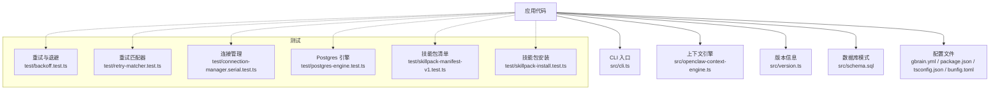
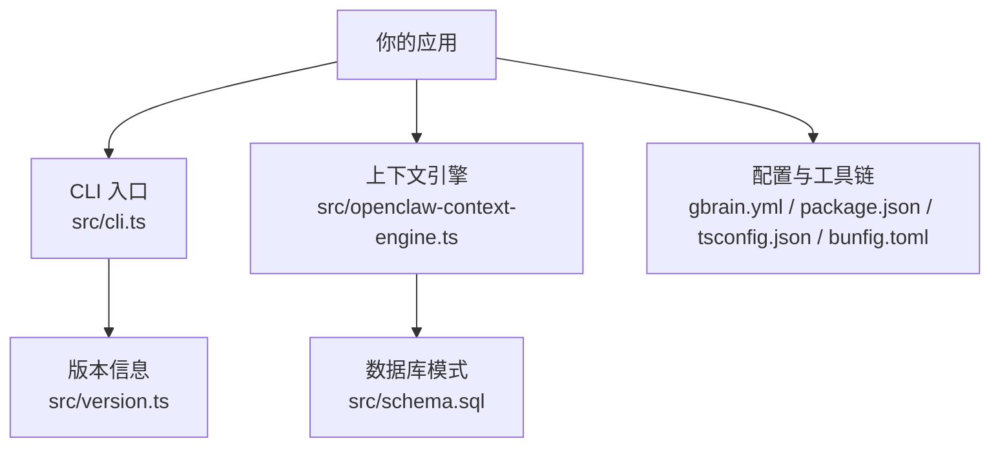
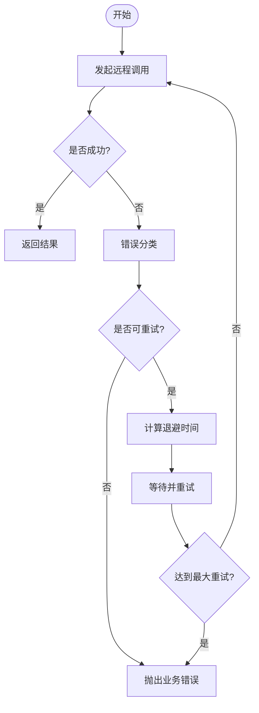
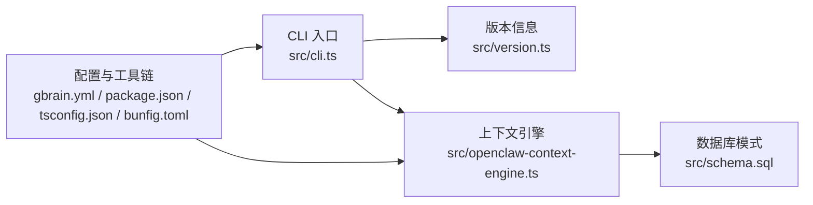

# SDK 集成指南

<cite>
**本文引用的文件**   
- [README.md](file://README.md)
- [INSTALL.md](file://docs/INSTALL.md)
- [RELEASING.md](file://docs/RELEASING.md)
- [UPGRADING_DOWNSTREAM_AGENTS.md](file://docs/UPGRADING_DOWNSTREAM_AGENTS.md)
- [package.json](file://package.json)
- [tsconfig.json](file://tsconfig.json)
- [bunfig.toml](file://bunfig.toml)
- [gbrain.yml](file://gbrain.yml)
- [src/cli.ts](file://src/cli.ts)
- [src/version.ts](file://src/version.ts)
- [src/openclaw-context-engine.ts](file://src/openclaw-context-engine.ts)
- [src/schema.sql](file://src/schema.sql)
- [scripts/run-unit-parallel.sh](file://scripts/run-unit-parallel.sh)
- [scripts/smoke-test.sh](file://scripts/smoke-test.sh)
- [test/backoff.test.ts](file://test/backoff.test.ts)
- [test/retry-matcher.test.ts](file://test/retry-matcher.test.ts)
- [test/connection-manager.serial.test.ts](file://test/connection-manager.serial.test.ts)
- [test/postgres-engine.test.ts](file://test/postgres-engine.test.ts)
- [test/skillpack-manifest-v1.test.ts](file://test/skillpack-manifest-v1.test.ts)
- [test/skillpack-install.test.ts](file://test/skillpack-install.test.ts)
- [test/skillpack-reference-pack-is-ten.ts](file://test/skillpack-reference-pack-is-ten.ts)
- [examples/skillpack-reference/README.md](file://examples/skillpack-reference/README.md)
- [examples/skillpack-reference/skillpack.json](file://examples/skillpack-reference/skillpack.json)
</cite>

## 目录
1. [简介](#简介)
2. [项目结构](#项目结构)
3. [核心组件](#核心组件)
4. [架构总览](#架构总览)
5. [详细组件分析](#详细组件分析)
6. [依赖分析](#依赖分析)
7. [性能考虑](#性能考虑)
8. [故障排查指南](#故障排查指南)
9. [结论](#结论)
10. [附录](#附录)

## 简介
本指南面向希望集成 GBrain SDK 的开发者，覆盖安装、初始化与基本配置；提供常见用例（智能体创建、知识查询、技能包管理）的使用路径说明；阐述异步操作、错误处理与重试机制；给出连接池配置、性能调优与资源管理最佳实践；并包含单元测试集成示例与模拟对象使用方法，以及迁移与版本升级注意事项。

## 项目结构
仓库采用多语言生态下的 TypeScript/Node 工程组织方式，SDK 相关能力集中在 src 目录，测试位于 test 目录，文档集中于 docs，示例与参考实现位于 examples 与 recipes 等目录。CLI 入口、版本信息与上下文引擎是客户端集成的关键入口点。

图表来源
- [src/cli.ts](file://src/cli.ts)
- [src/openclaw-context-engine.ts](file://src/openclaw-context-engine.ts)
- [src/version.ts](file://src/version.ts)
- [src/schema.sql](file://src/schema.sql)
- [gbrain.yml](file://gbrain.yml)
- [package.json](file://package.json)
- [tsconfig.json](file://tsconfig.json)
- [bunfig.toml](file://bunfig.toml)
- [test/backoff.test.ts](file://test/backoff.test.ts)
- [test/retry-matcher.test.ts](file://test/retry-matcher.test.ts)
- [test/connection-manager.serial.test.ts](file://test/connection-manager.serial.test.ts)
- [test/postgres-engine.test.ts](file://test/postgres-engine.test.ts)
- [test/skillpack-manifest-v1.test.ts](file://test/skillpack-manifest-v1.test.ts)
- [test/skillpack-install.test.ts](file://test/skillpack-install.test.ts)

章节来源
- [README.md](file://README.md)
- [docs/INSTALL.md](file://docs/INSTALL.md)
- [package.json](file://package.json)
- [tsconfig.json](file://tsconfig.json)
- [bunfig.toml](file://bunfig.toml)
- [gbrain.yml](file://gbrain.yml)
- [src/cli.ts](file://src/cli.ts)
- [src/version.ts](file://src/version.ts)
- [src/openclaw-context-engine.ts](file://src/openclaw-context-engine.ts)
- [src/schema.sql](file://src/schema.sql)

## 核心组件
- CLI 入口：提供命令分发与运行生命周期控制，是本地或容器化部署时的主要交互点。
- 上下文引擎：封装运行时上下文、配置加载与外部服务调用抽象，便于在应用中复用。
- 版本信息：集中暴露当前构建版本，用于兼容性检查与日志记录。
- 数据库模式：定义持久层表结构与约束，确保数据一致性与可演进性。

章节来源
- [src/cli.ts](file://src/cli.ts)
- [src/openclaw-context-engine.ts](file://src/openclaw-context-engine.ts)
- [src/version.ts](file://src/version.ts)
- [src/schema.sql](file://src/schema.sql)

## 架构总览
下图展示典型集成路径：应用通过 CLI 或上下文引擎访问系统能力，底层由配置与数据库支撑，测试套件保障稳定性与回归安全。

图表来源
- [src/cli.ts](file://src/cli.ts)
- [src/openclaw-context-engine.ts](file://src/openclaw-context-engine.ts)
- [src/version.ts](file://src/version.ts)
- [src/schema.sql](file://src/schema.sql)
- [gbrain.yml](file://gbrain.yml)
- [package.json](file://package.json)
- [tsconfig.json](file://tsconfig.json)
- [bunfig.toml](file://bunfig.toml)

## 详细组件分析

### 安装与初始化
- 安装方式
  - 使用包管理器安装依赖与脚本，参考工程根配置。
  - 如需本地开发环境，参考安装文档中的环境与依赖说明。
- 初始化步骤
  - 加载配置：从 gbrain.yml 与运行时环境变量中读取必要参数。
  - 启动 CLI 或上下文引擎：根据部署形态选择命令行或库式调用。
  - 校验版本：通过版本模块进行兼容性与特性开关判断。

章节来源
- [docs/INSTALL.md](file://docs/INSTALL.md)
- [gbrain.yml](file://gbrain.yml)
- [package.json](file://package.json)
- [src/cli.ts](file://src/cli.ts)
- [src/openclaw-context-engine.ts](file://src/openclaw-context-engine.ts)
- [src/version.ts](file://src/version.ts)

### 基本配置
- 全局配置
  - 使用 gbrain.yml 管理默认行为、连接参数与功能开关。
- 构建与运行
  - 使用 tsconfig.json 指定编译目标与模块解析策略。
  - 使用 bunfig.toml 调整运行时行为（如并行度、缓存等）。
- 包元数据
  - 在 package.json 中声明依赖、脚本与发布元信息。

章节来源
- [gbrain.yml](file://gbrain.yml)
- [tsconfig.json](file://tsconfig.json)
- [bunfig.toml](file://bunfig.toml)
- [package.json](file://package.json)

### 常见用例

#### 智能体创建
- 通过 CLI 命令或上下文引擎提供的接口完成智能体的注册与初始化。
- 建议在初始化后执行健康检查与最小可用验证。

章节来源
- [src/cli.ts](file://src/cli.ts)
- [src/openclaw-context-engine.ts](file://src/openclaw-context-engine.ts)

#### 知识查询
- 基于数据库模式定义的实体与索引进行检索。
- 建议结合分页与过滤条件，避免全表扫描。

章节来源
- [src/schema.sql](file://src/schema.sql)

#### 技能包管理
- 清单与安装
  - 参考示例项目的 skillpack.json 与 README，了解清单字段与目录约定。
  - 使用安装脚本或命令将技能包应用到工作区。
- 验证与回滚
  - 通过清单校验与安装测试用例确认一致性。
  - 保留历史版本以便快速回滚。

章节来源
- [examples/skillpack-reference/README.md](file://examples/skillpack-reference/README.md)
- [examples/skillpack-reference/skillpack.json](file://examples/skillpack-reference/skillpack.json)
- [test/skillpack-manifest-v1.test.ts](file://test/skillpack-manifest-v1.test.ts)
- [test/skillpack-install.test.ts](file://test/skillpack-install.test.ts)
- [test/skillpack-reference-pack-is-ten.ts](file://test/skillpack-reference-pack-is-ten.ts)

### 异步操作、错误处理与重试机制
- 异步模型
  - 所有 I/O 操作应返回 Promise 或使用回调，避免阻塞事件循环。
- 错误分类
  - 区分网络错误、认证失败、业务校验错误与超时异常，分别采取不同恢复策略。
- 重试与退避
  - 对幂等请求实施指数退避与抖动，限制最大重试次数与总耗时。
  - 使用重试匹配器精准识别可重试错误类型。

图表来源
- [test/backoff.test.ts](file://test/backoff.test.ts)
- [test/retry-matcher.test.ts](file://test/retry-matcher.test.ts)

章节来源
- [test/backoff.test.ts](file://test/backoff.test.ts)
- [test/retry-matcher.test.ts](file://test/retry-matcher.test.ts)

### 连接池配置、性能调优与资源管理
- 连接池
  - 合理设置最大连接数、空闲回收与获取超时，避免连接泄漏。
  - 针对读写分离场景，为只读查询配置独立连接池。
- 并发与批处理
  - 对批量写入与检索启用批处理与合并策略，降低往返开销。
- 资源清理
  - 在进程退出或任务取消时主动释放连接、关闭句柄与清理临时文件。

章节来源
- [test/connection-manager.serial.test.ts](file://test/connection-manager.serial.test.ts)
- [test/postgres-engine.test.ts](file://test/postgres-engine.test.ts)

### 单元测试集成与模拟对象
- 单测框架与脚本
  - 使用并行脚本加速测试执行，隔离测试间状态。
- 模拟与桩
  - 对外部依赖（网络、文件系统、数据库）使用桩函数或内存替代。
- 端到端冒烟
  - 通过轻量冒烟脚本验证关键路径可用性。

章节来源
- [scripts/run-unit-parallel.sh](file://scripts/run-unit-parallel.sh)
- [scripts/smoke-test.sh](file://scripts/smoke-test.sh)

### 迁移指南与版本升级注意事项
- 向后兼容
  - 遵循发布流程中的兼容性策略，优先采用渐进式变更。
- 下游适配
  - 参考下游代理升级指南，评估 API 变更与行为差异。
- 发布与回滚
  - 利用发布流程中的制品与签名校验，确保可追溯与可回滚。

章节来源
- [docs/RELEASING.md](file://docs/RELEASING.md)
- [docs/UPGRADING_DOWNSTREAM_AGENTS.md](file://docs/UPGRADING_DOWNSTREAM_AGENTS.md)

## 依赖分析
下图展示核心模块间的依赖关系与职责边界，有助于理解扩展点与耦合面。

图表来源
- [src/cli.ts](file://src/cli.ts)
- [src/version.ts](file://src/version.ts)
- [src/openclaw-context-engine.ts](file://src/openclaw-context-engine.ts)
- [src/schema.sql](file://src/schema.sql)
- [gbrain.yml](file://gbrain.yml)
- [package.json](file://package.json)
- [tsconfig.json](file://tsconfig.json)
- [bunfig.toml](file://bunfig.toml)

章节来源
- [src/cli.ts](file://src/cli.ts)
- [src/version.ts](file://src/version.ts)
- [src/openclaw-context-engine.ts](file://src/openclaw-context-engine.ts)
- [src/schema.sql](file://src/schema.sql)
- [gbrain.yml](file://gbrain.yml)
- [package.json](file://package.json)
- [tsconfig.json](file://tsconfig.json)
- [bunfig.toml](file://bunfig.toml)

## 性能考虑
- 减少跨进程/跨网络调用：尽量在进程内聚合逻辑，降低序列化与传输成本。
- 批量化与去重：对高频写操作进行批处理与内容去重，降低存储压力。
- 缓存热点数据：对只读且变化不频繁的数据引入短 TTL 缓存。
- 监控与度量：采集关键路径延迟、吞吐与错误率，建立告警阈值。

[本节为通用指导，无需源码引用]

## 故障排查指南
- 常见问题定位
  - 连接问题：检查连接池大小、超时与鉴权配置。
  - 重试风暴：确认退避策略与最大重试次数，避免雪崩。
  - 权限与范围：核对配置项与作用域，确保最小权限原则。
- 诊断手段
  - 开启调试日志与结构化输出，关联请求 ID 追踪链路。
  - 使用冒烟与单元脚本复现问题，逐步缩小范围。

章节来源
- [test/connection-manager.serial.test.ts](file://test/connection-manager.serial.test.ts)
- [test/backoff.test.ts](file://test/backoff.test.ts)
- [scripts/smoke-test.sh](file://scripts/smoke-test.sh)

## 结论
通过合理的安装与初始化、清晰的配置管理、稳健的重试与错误处理、完善的连接池与资源管理，以及充分的测试与迁移策略，可以高效、稳定地将 GBrain 能力集成到各类应用中。建议在生产环境持续观测关键指标，并结合业务特征进行针对性优化。

[本节为总结性内容，无需源码引用]

## 附录
- 参考示例
  - 技能包参考实现：查看示例项目的清单与说明，了解标准结构与最佳实践。
- 常用脚本
  - 并行单测与冒烟脚本：用于本地快速验证与 CI 流水线集成。

章节来源
- [examples/skillpack-reference/README.md](file://examples/skillpack-reference/README.md)
- [examples/skillpack-reference/skillpack.json](file://examples/skillpack-reference/skillpack.json)
- [scripts/run-unit-parallel.sh](file://scripts/run-unit-parallel.sh)
- [scripts/smoke-test.sh](file://scripts/smoke-test.sh)