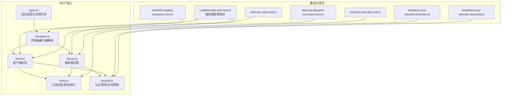
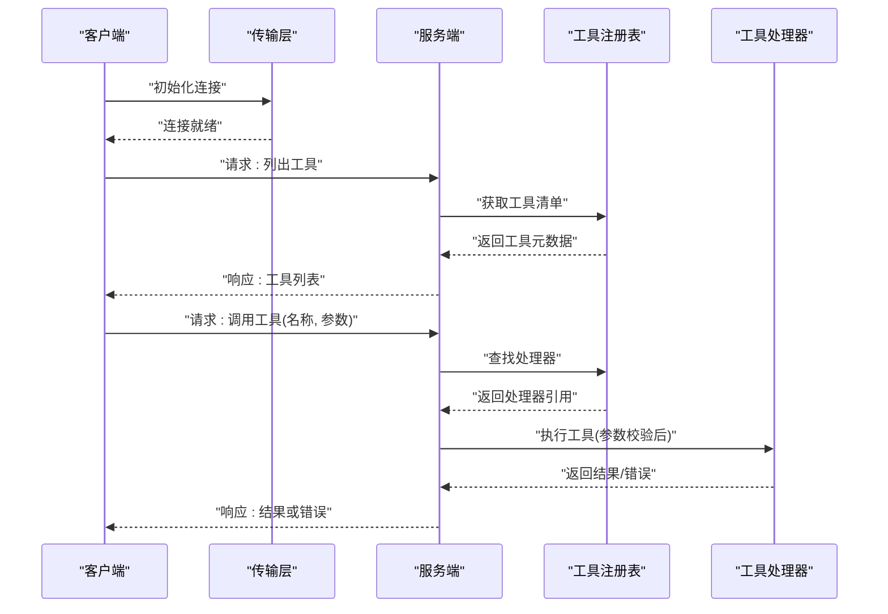
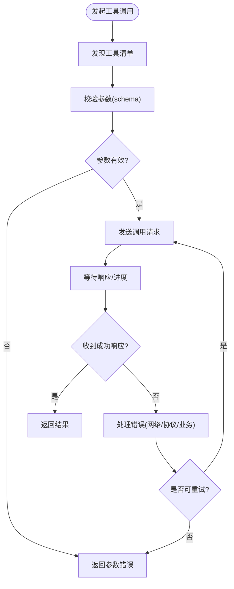
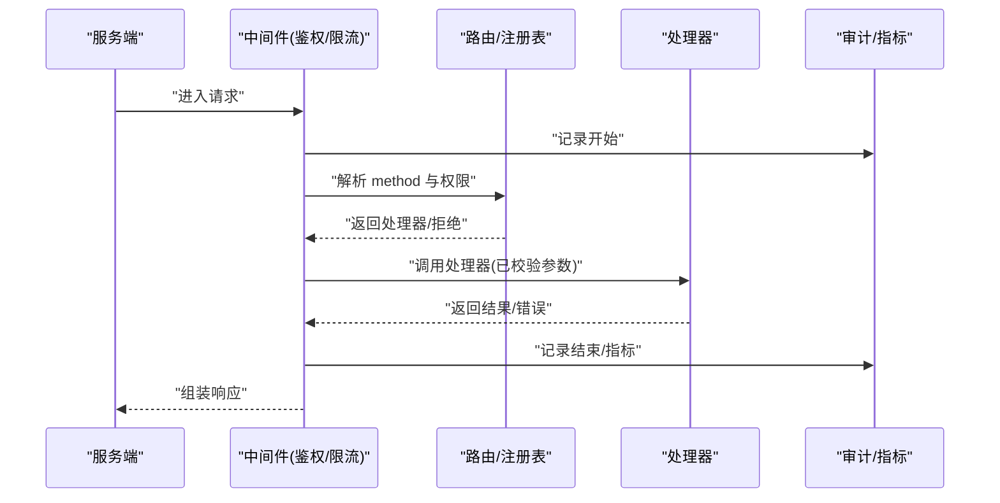
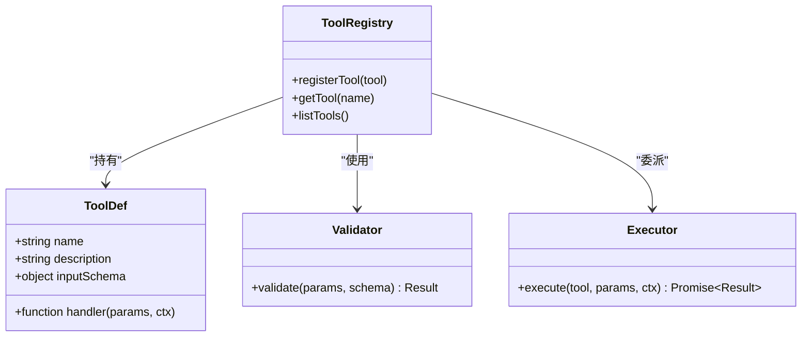
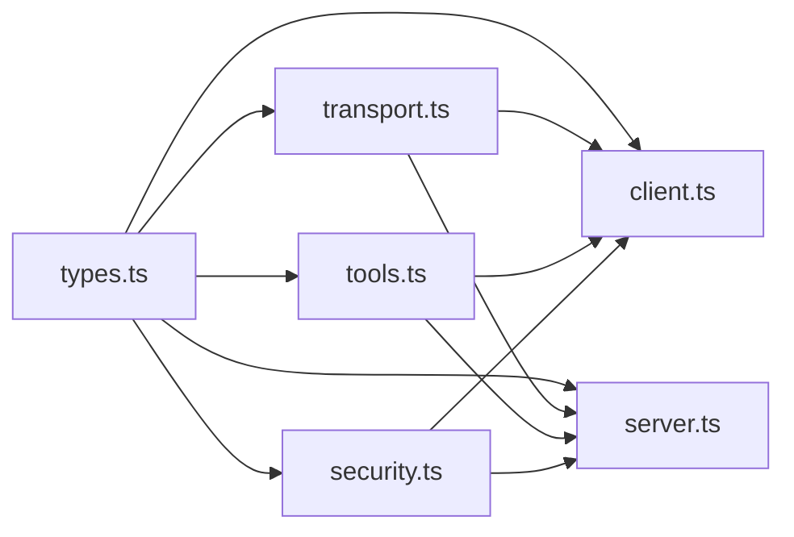

# MCP 协议实现

<cite>
**本文引用的文件**   
- [src/mcp/index.ts](file://src/mcp/index.ts)
- [src/mcp/client.ts](file://src/mcp/client.ts)
- [src/mcp/server.ts](file://src/mcp/server.ts)
- [src/mcp/transport.ts](file://src/mcp/transport.ts)
- [src/mcp/types.ts](file://src/mcp/types.ts)
- [src/mcp/tools.ts](file://src/mcp/tools.ts)
- [src/mcp/security.ts](file://src/mcp/security.ts)
- [scripts/smoke-test-mcp.ts](file://scripts/smoke-test-mcp.ts)
- [test/mcp-client.test.ts](file://test/mcp-client.test.ts)
- [test/mcp-tool-defs.test.ts](file://test/mcp-tool-defs.test.ts)
- [test/mcp-dispatch-summarize.test.ts](file://test/mcp-dispatch-summarize.test.ts)
- [test/facts-mcp-allowlist.serial.test.ts](file://test/facts-mcp-allowlist.serial.test.ts)
- [test/takes-mcp-allowlist.serial.test.ts](file://test/takes-mcp-allowlist.serial.test.ts)
- [test/skill-catalog-transports.test.ts](file://test/skill-catalog-transports.test.ts)
</cite>

## 目录
1. [简介](#简介)
2. [项目结构](#项目结构)
3. [核心组件](#核心组件)
4. [架构总览](#架构总览)
5. [详细组件分析](#详细组件分析)
6. [依赖关系分析](#依赖关系分析)
7. [性能考虑](#性能考虑)
8. [故障排查指南](#故障排查指南)
9. [结论](#结论)
10. [附录](#附录)

## 简介
本文件面向在仓库中实现与使用 MCP（Model Context Protocol）的开发者，系统性阐述协议的设计目标、消息格式与通信模式，并深入解析客户端与服务端实现机制，包括连接管理、消息路由、错误处理、工具定义与参数校验、结果返回标准。文档同时覆盖安全与访问控制、扩展点与自定义工具开发方法、调试与性能监控实践，并提供多语言客户端的实现思路与示例路径。

MCP 在本仓库中的定位是：以标准化消息契约连接“模型上下文”提供方（服务端）与调用方（客户端），通过可插拔传输层承载 JSON-RPC 风格的消息，支持工具发现、执行、进度上报与错误传播，从而为上层 Agent/Skill 生态提供统一的能力接入面。

## 项目结构
MCP 相关代码集中在 src/mcp 目录，配套测试位于 test 与 scripts 目录。整体组织遵循“协议类型 + 传输抽象 + 客户端/服务端实现 + 工具注册与校验 + 安全策略”的分层设计。

图表来源
- [src/mcp/types.ts](file://src/mcp/types.ts)
- [src/mcp/transport.ts](file://src/mcp/transport.ts)
- [src/mcp/client.ts](file://src/mcp/client.ts)
- [src/mcp/server.ts](file://src/mcp/server.ts)
- [src/mcp/tools.ts](file://src/mcp/tools.ts)
- [src/mcp/security.ts](file://src/mcp/security.ts)
- [scripts/smoke-test-mcp.ts](file://scripts/smoke-test-mcp.ts)
- [test/mcp-client.test.ts](file://test/mcp-client.test.ts)
- [test/mcp-tool-defs.test.ts](file://test/mcp-tool-defs.test.ts)
- [test/mcp-dispatch-summarize.test.ts](file://test/mcp-dispatch-summarize.test.ts)
- [test/facts-mcp-allowlist.serial.test.ts](file://test/facts-mcp-allowlist.serial.test.ts)
- [test/takes-mcp-allowlist.serial.test.ts](file://test/takes-mcp-allowlist.serial.test.ts)
- [test/skill-catalog-transports.test.ts](file://test/skill-catalog-transports.test.ts)

章节来源
- [src/mcp/index.ts](file://src/mcp/index.ts)
- [src/mcp/types.ts](file://src/mcp/types.ts)
- [src/mcp/transport.ts](file://src/mcp/transport.ts)
- [src/mcp/client.ts](file://src/mcp/client.ts)
- [src/mcp/server.ts](file://src/mcp/server.ts)
- [src/mcp/tools.ts](file://src/mcp/tools.ts)
- [src/mcp/security.ts](file://src/mcp/security.ts)
- [scripts/smoke-test-mcp.ts](file://scripts/smoke-test-mcp.ts)
- [test/mcp-client.test.ts](file://test/mcp-client.test.ts)
- [test/mcp-tool-defs.test.ts](file://test/mcp-tool-defs.test.ts)
- [test/mcp-dispatch-summarize.test.ts](file://test/mcp-dispatch-summarize.test.ts)
- [test/facts-mcp-allowlist.serial.test.ts](file://test/facts-mcp-allowlist.serial.test.ts)
- [test/takes-mcp-allowlist.serial.test.ts](file://test/takes-mcp-allowlist.serial.test.ts)
- [test/skill-catalog-transports.test.ts](file://test/skill-catalog-transports.test.ts)

## 核心组件
- 协议类型与消息形状（types.ts）
  - 定义 MCP 消息基类、请求/响应/通知结构、工具描述、参数校验 schema、错误对象等。
  - 约定 id、jsonrpc、method、params、result、error 等字段语义与约束。
- 传输抽象（transport.ts）
  - 定义 ITransport 接口：发送/接收消息、生命周期钩子（连接、断开、错误）。
  - 提供基于 stdio/HTTP/WebSocket 等具体实现的适配层（若存在）。
- 客户端（client.ts）
  - 负责建立连接、维护会话、发送请求与订阅通知、重试与超时、错误分类与恢复。
  - 暴露工具发现、调用、进度监听等高层 API。
- 服务端（server.ts）
  - 负责启动、注册处理器、分发请求到对应 handler、聚合结果与错误、上报进度。
  - 集成安全策略（鉴权、范围限制、审计日志）。
- 工具系统（tools.ts）
  - 工具注册表、元数据（名称、描述、schema）、参数校验、执行器调度、结果封装。
- 安全与访问控制（security.ts）
  - 认证令牌校验、作用域/命名空间隔离、白名单/黑名单、速率限制与审计。

章节来源
- [src/mcp/types.ts](file://src/mcp/types.ts)
- [src/mcp/transport.ts](file://src/mcp/transport.ts)
- [src/mcp/client.ts](file://src/mcp/client.ts)
- [src/mcp/server.ts](file://src/mcp/server.ts)
- [src/mcp/tools.ts](file://src/mcp/tools.ts)
- [src/mcp/security.ts](file://src/mcp/security.ts)

## 架构总览
MCP 采用“客户端-传输-服务端”三层架构，工具系统作为横向能力横切于两端。

图表来源
- [src/mcp/client.ts](file://src/mcp/client.ts)
- [src/mcp/transport.ts](file://src/mcp/transport.ts)
- [src/mcp/server.ts](file://src/mcp/server.ts)
- [src/mcp/tools.ts](file://src/mcp/tools.ts)

## 详细组件分析

### 协议类型与消息格式（types.ts）
- 消息基类
  - 包含 jsonrpc 版本标识、唯一 id、method 名、可选 params/result/error。
- 请求/响应/通知
  - 请求：method + params；响应：id 匹配 result 或 error；通知：无 id。
- 工具描述
  - name、description、inputSchema（JSON Schema 兼容）、输出结构说明。
- 错误对象
  - code、message、data（可选），用于跨语言一致的错误传播。
- 进度事件
  - 用于长耗时操作的阶段性反馈（如百分比、阶段名、附加信息）。

章节来源
- [src/mcp/types.ts](file://src/mcp/types.ts)

### 传输层抽象（transport.ts）
- 接口定义
  - send(message): Promise<void>
  - onMessage(handler): void
  - connect()/disconnect(): Promise<void>
  - onError(handler): void
- 典型实现
  - stdio：进程间管道读写
  - HTTP：REST/JSON-RPC over HTTP
  - WebSocket：双向实时通道
- 可靠性
  - 断线重连、心跳保活、消息去重/乱序处理（由具体实现决定）

章节来源
- [src/mcp/transport.ts](file://src/mcp/transport.ts)

### 客户端实现（client.ts）
- 连接管理
  - 自动重连、指数退避、最大重试次数、连接池与会话复用。
- 消息路由
  - 按 method 分派到对应处理器；对未注册 method 返回标准错误。
- 超时与取消
  - 请求级超时、可取消的异步操作、资源清理。
- 工具调用
  - 先 discoverTools，再 executeTool(name, params)，支持进度回调。
- 错误处理
  - 网络错误、协议错误、业务错误的分层捕获与转换。

图表来源
- [src/mcp/client.ts](file://src/mcp/client.ts)
- [src/mcp/types.ts](file://src/mcp/types.ts)

章节来源
- [src/mcp/client.ts](file://src/mcp/client.ts)

### 服务端实现（server.ts）
- 启动与注册
  - 加载传输层、注册工具处理器、挂载中间件（鉴权、限流、审计）。
- 请求分发
  - 根据 method 路由到对应处理器；对未知 method 返回标准错误。
- 工具执行
  - 从注册表解析处理器，执行前进行参数校验，执行后包装结果/错误。
- 进度上报
  - 将进度事件推送给客户端，便于 UI 展示与中断决策。
- 错误与审计
  - 统一错误码映射、结构化日志、敏感信息脱敏。

图表来源
- [src/mcp/server.ts](file://src/mcp/server.ts)
- [src/mcp/tools.ts](file://src/mcp/tools.ts)
- [src/mcp/security.ts](file://src/mcp/security.ts)

章节来源
- [src/mcp/server.ts](file://src/mcp/server.ts)

### 工具系统与参数校验（tools.ts）
- 工具注册
  - registerTool({name, description, inputSchema, handler})
- 参数校验
  - 基于 JSON Schema 的严格校验，缺失必填项、类型不匹配时返回明确错误。
- 执行器
  - 支持同步/异步处理器；异常被捕获并转换为标准错误对象。
- 结果封装
  - 成功：{ ok: true, data }；失败：{ ok: false, error }
- 进度与取消
  - 处理器可上报进度；支持外部取消信号。

图表来源
- [src/mcp/tools.ts](file://src/mcp/tools.ts)
- [src/mcp/types.ts](file://src/mcp/types.ts)

章节来源
- [src/mcp/tools.ts](file://src/mcp/tools.ts)

### 安全、认证与访问控制（security.ts）
- 认证
  - 支持 Bearer Token、JWT 校验、短期会话令牌。
- 授权与作用域
  - 基于角色/命名空间的访问控制；工具级白名单/黑名单。
- 审计与合规
  - 关键操作审计日志；敏感字段脱敏；速率限制与配额。
- 集成点
  - 在服务端中间件与客户端出站拦截器处注入安全上下文。

章节来源
- [src/mcp/security.ts](file://src/mcp/security.ts)

### 多语言客户端实现示例
- TypeScript/Node.js
  - 参考测试与脚本：[test/mcp-client.test.ts](file://test/mcp-client.test.ts)、[scripts/smoke-test-mcp.ts](file://scripts/smoke-test-mcp.ts)
- Python
  - 建议基于 httpx/aiohttp 实现 JSON-RPC 客户端，遵循 types.ts 的消息形状与错误码约定。
- Go
  - 建议使用 net/http 或 gorilla/websocket，结合 encoding/json 编解码，保持 id 与 method 一致性。
- Java/Kotlin
  - 使用 OkHttp/Java HttpClient，配合 Jackson/Gson 序列化，注意线程池与超时配置。
- Rust
  - 使用 reqwest 或 tungstenya，serde 序列化，tokio 异步运行时。

提示：以上为通用实现思路，实际字段与错误码需与 types.ts 保持一致。

章节来源
- [src/mcp/types.ts](file://src/mcp/types.ts)
- [test/mcp-client.test.ts](file://test/mcp-client.test.ts)
- [scripts/smoke-test-mcp.ts](file://scripts/smoke-test-mcp.ts)

## 依赖关系分析
- 模块内聚与耦合
  - types.ts 为所有模块的基础依赖，低耦合高内聚。
  - transport.ts 解耦底层 IO，client/server 仅依赖抽象接口。
  - tools.ts 被 client/server 共同使用，形成横向能力。
  - security.ts 作为中间件横切关注点，降低业务逻辑侵入性。
- 外部依赖
  - 传输层可能依赖网络库（HTTP/WebSocket）与进程 IO（stdio）。
  - 校验依赖 JSON Schema 解析器。
- 潜在循环依赖
  - 避免 client/server 直接相互引用，应通过 transport 与 types 交互。

图表来源
- [src/mcp/types.ts](file://src/mcp/types.ts)
- [src/mcp/transport.ts](file://src/mcp/transport.ts)
- [src/mcp/client.ts](file://src/mcp/client.ts)
- [src/mcp/server.ts](file://src/mcp/server.ts)
- [src/mcp/tools.ts](file://src/mcp/tools.ts)
- [src/mcp/security.ts](file://src/mcp/security.ts)

章节来源
- [src/mcp/index.ts](file://src/mcp/index.ts)
- [src/mcp/types.ts](file://src/mcp/types.ts)

## 性能考虑
- 连接复用与池化
  - 复用 TCP/WebSocket 连接，减少握手开销；合理设置最大并发与队列长度。
- 批处理与合并
  - 对短小高频的请求进行批处理（在允许范围内），降低序列化与网络开销。
- 超时与背压
  - 设置合理的请求超时与读/写超时；对慢消费者实施背压与丢弃策略。
- 缓存与幂等
  - 对只读工具启用结果缓存；确保幂等键（id）正确生成以避免重复执行。
- 监控与指标
  - 统计 P50/P95/P99 延迟、吞吐、错误率、重连次数、队列积压等。

## 故障排查指南
- 常见问题
  - 连接失败：检查传输层地址/端口、证书、代理与防火墙规则。
  - 认证失败：核对令牌有效期、签名算法、作用域与权限。
  - 参数校验失败：对照 inputSchema 检查必填项与类型。
  - 工具未找到：确认工具名大小写与命名空间。
- 诊断步骤
  - 开启调试日志，捕获完整请求/响应报文。
  - 使用冒烟测试脚本验证端到端链路：[scripts/smoke-test-mcp.ts](file://scripts/smoke-test-mcp.ts)
  - 针对工具定义与分发进行测试：[test/mcp-tool-defs.test.ts](file://test/mcp-tool-defs.test.ts)、[test/mcp-dispatch-summarize.test.ts](file://test/mcp-dispatch-summarize.test.ts)
- 安全与合规
  - 校验白名单策略生效：[test/facts-mcp-allowlist.serial.test.ts](file://test/facts-mcp-allowlist.serial.test.ts)、[test/takes-mcp-allowlist.serial.test.ts](file://test/takes-mcp-allowlist.serial.test.ts)
  - 验证传输层安全性（TLS、鉴权头）：[test/skill-catalog-transports.test.ts](file://test/skill-catalog-transports.test.ts)

章节来源
- [scripts/smoke-test-mcp.ts](file://scripts/smoke-test-mcp.ts)
- [test/mcp-tool-defs.test.ts](file://test/mcp-tool-defs.test.ts)
- [test/mcp-dispatch-summarize.test.ts](file://test/mcp-dispatch-summarize.test.ts)
- [test/facts-mcp-allowlist.serial.test.ts](file://test/facts-mcp-allowlist.serial.test.ts)
- [test/takes-mcp-allowlist.serial.test.ts](file://test/takes-mcp-allowlist.serial.test.ts)
- [test/skill-catalog-transports.test.ts](file://test/skill-catalog-transports.test.ts)

## 结论
MCP 在本仓库中以清晰的类型定义、可插拔传输层与稳健的客户端/服务端实现，提供了统一的模型上下文交互协议。通过严格的参数校验、标准化的错误传播与安全访问控制，MCP 能够支撑复杂的多语言生态与丰富的工具扩展。建议在部署时结合监控与审计，持续优化连接与执行性能，并完善工具治理与权限策略。

## 附录
- 扩展点与自定义工具
  - 新增工具：在 tools.ts 中注册新工具，提供输入 schema 与处理器。
  - 自定义传输：实现 transport.ts 的 ITransport 接口，并在 client/server 中注入。
  - 安全策略：在 security.ts 中扩展认证/授权逻辑，并通过中间件接入。
- 调试与观测
  - 启用详细日志与结构化追踪 ID；采集关键指标（延迟、吞吐、错误率、重连）。
  - 使用冒烟测试与单元测试快速回归。