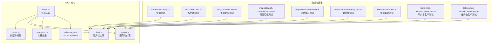
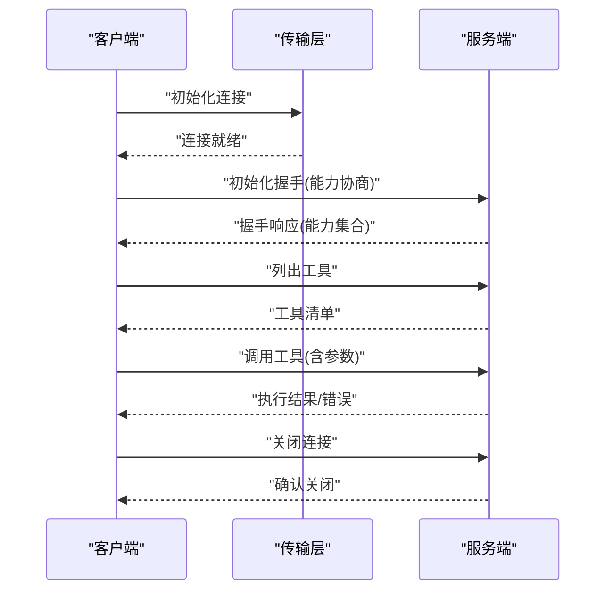
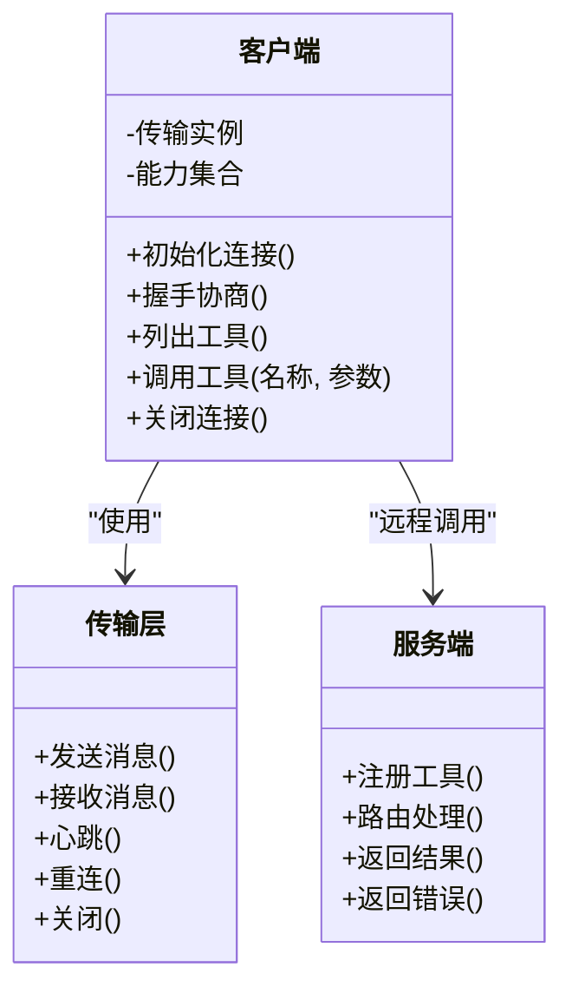
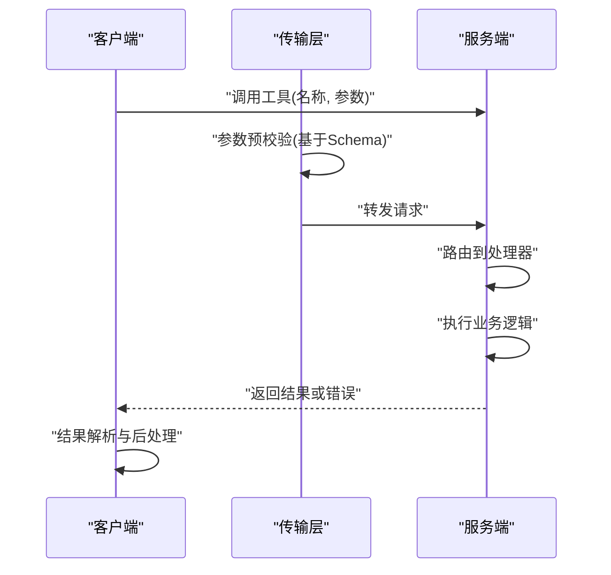
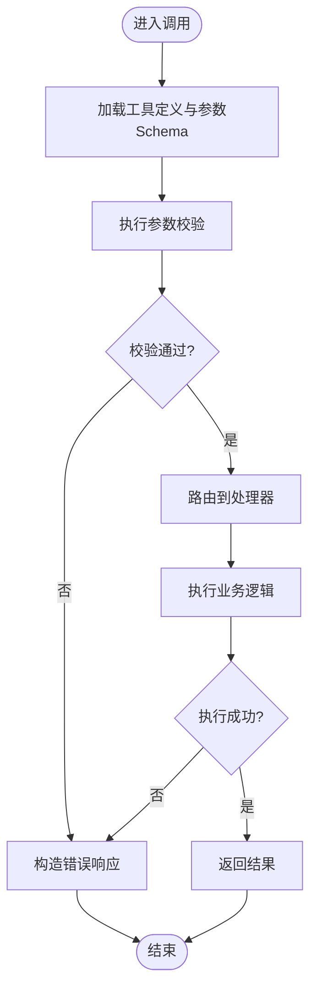
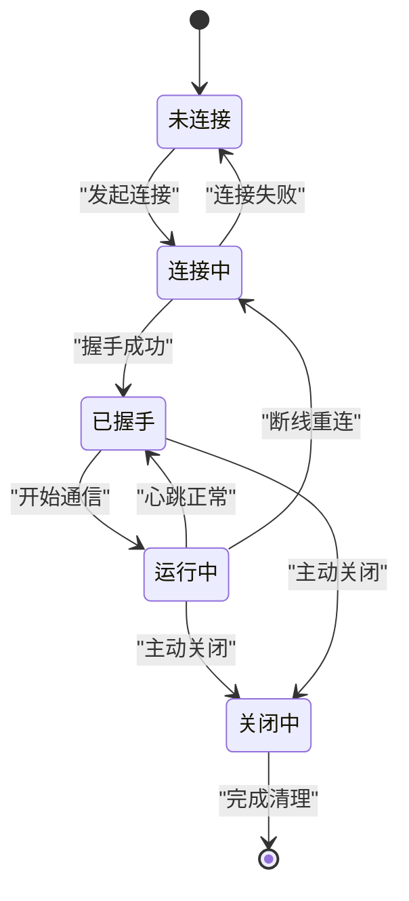
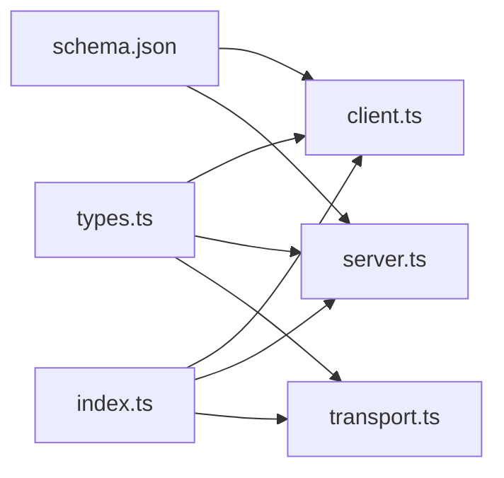

# 协议规范详解

<cite>
**本文引用的文件**   
- [src/mcp/index.ts](file://src/mcp/index.ts)
- [src/mcp/client.ts](file://src/mcp/client.ts)
- [src/mcp/server.ts](file://src/mcp/server.ts)
- [src/mcp/types.ts](file://src/mcp/types.ts)
- [src/mcp/transport.ts](file://src/mcp/transport.ts)
- [src/mcp/schema.json](file://src/mcp/schema.json)
- [scripts/smoke-test-mcp.ts](file://scripts/smoke-test-mcp.ts)
- [test/mcp-client.test.ts](file://test/mcp-client.test.ts)
- [test/mcp-tool-defs.test.ts](file://test/mcp-tool-defs.test.ts)
- [test/mcp-dispatch-summarize.test.ts](file://test/mcp-dispatch-summarize.test.ts)
- [test/mcp-eval-capture.test.ts](file://test/mcp-eval-capture.test.ts)
- [test/mcp-client-hardening.test.ts](file://test/mcp-client-hardening.test.ts)
- [test/sources-mcp.test.ts](file://test/sources-mcp.test.ts)
- [test/facts-mcp-allowlist.serial.test.ts](file://test/facts-mcp-allowlist.serial.test.ts)
- [test/takes-mcp-allowlist.serial.test.ts](file://test/takes-mcp-allowlist.serial.test.ts)
</cite>

## 目录
1. [简介](#简介)
2. [项目结构](#项目结构)
3. [核心组件](#核心组件)
4. [架构总览](#架构总览)
5. [详细组件分析](#详细组件分析)
6. [依赖关系分析](#依赖关系分析)
7. [性能考量](#性能考量)
8. [故障排查指南](#故障排查指南)
9. [结论](#结论)
10. [附录](#附录)

## 简介
本文件面向实现与集成 MCP（Model Context Protocol）的开发者，系统化阐述该协议在本仓库中的定义、消息格式、通信模式、工具定义与参数校验、连接生命周期、错误处理、超时与重试策略、版本兼容与扩展机制，并给出完整的 JSON Schema 参考与示例消息。文档同时提供序列图与状态转换图，帮助读者快速理解端到端交互流程与关键边界条件。

## 项目结构
MCP 相关代码主要位于 src/mcp 目录，包含类型定义、传输抽象、客户端与服务端实现以及协议 JSON Schema；测试覆盖客户端行为、工具定义、调度汇总、评估捕获、健壮性加固等场景；脚本与测试中提供了端到端冒烟用例与来源集成验证。

图表来源
- [src/mcp/index.ts](file://src/mcp/index.ts)
- [src/mcp/types.ts](file://src/mcp/types.ts)
- [src/mcp/client.ts](file://src/mcp/client.ts)
- [src/mcp/server.ts](file://src/mcp/server.ts)
- [src/mcp/transport.ts](file://src/mcp/transport.ts)
- [src/mcp/schema.json](file://src/mcp/schema.json)
- [scripts/smoke-test-mcp.ts](file://scripts/smoke-test-mcp.ts)
- [test/mcp-client.test.ts](file://test/mcp-client.test.ts)
- [test/mcp-tool-defs.test.ts](file://test/mcp-tool-defs.test.ts)
- [test/mcp-dispatch-summarize.test.ts](file://test/mcp-dispatch-summarize.test.ts)
- [test/mcp-eval-capture.test.ts](file://test/mcp-eval-capture.test.ts)
- [test/mcp-client-hardening.test.ts](file://test/mcp-client-hardening.test.ts)
- [test/sources-mcp.test.ts](file://test/sources-mcp.test.ts)
- [test/facts-mcp-allowlist.serial.test.ts](file://test/facts-mcp-allowlist.serial.test.ts)
- [test/takes-mcp-allowlist.serial.test.ts](file://test/takes-mcp-allowlist.serial.test.ts)

章节来源
- [src/mcp/index.ts](file://src/mcp/index.ts)
- [src/mcp/types.ts](file://src/mcp/types.ts)
- [src/mcp/client.ts](file://src/mcp/client.ts)
- [src/mcp/server.ts](file://src/mcp/server.ts)
- [src/mcp/transport.ts](file://src/mcp/transport.ts)
- [src/mcp/schema.json](file://src/mcp/schema.json)
- [scripts/smoke-test-mcp.ts](file://scripts/smoke-test-mcp.ts)
- [test/mcp-client.test.ts](file://test/mcp-client.test.ts)
- [test/mcp-tool-defs.test.ts](file://test/mcp-tool-defs.test.ts)
- [test/mcp-dispatch-summarize.test.ts](file://test/mcp-dispatch-summarize.test.ts)
- [test/mcp-eval-capture.test.ts](file://test/mcp-eval-capture.test.ts)
- [test/mcp-client-hardening.test.ts](file://test/mcp-client-hardening.test.ts)
- [test/sources-mcp.test.ts](file://test/sources-mcp.test.ts)
- [test/facts-mcp-allowlist.serial.test.ts](file://test/facts-mcp-allowlist.serial.test.ts)
- [test/takes-mcp-allowlist.serial.test.ts](file://test/takes-mcp-allowlist.serial.test.ts)

## 核心组件
- 类型与常量：集中定义消息头、方法名、错误码、能力集、工具描述与参数校验规则等核心类型。
- JSON Schema：对消息体与工具定义进行结构化约束，确保跨语言一致性与可验证性。
- 传输抽象：屏蔽底层 I/O 差异，统一消息编解码、分帧、心跳与重连逻辑。
- 客户端：负责连接建立、握手协商、工具发现与调用、结果解析与错误映射。
- 服务端：负责注册工具、路由请求、执行业务逻辑、返回结果或错误。
- 入口导出：聚合对外 API，便于上层模块引用。

章节来源
- [src/mcp/types.ts](file://src/mcp/types.ts)
- [src/mcp/schema.json](file://src/mcp/schema.json)
- [src/mcp/transport.ts](file://src/mcp/transport.ts)
- [src/mcp/client.ts](file://src/mcp/client.ts)
- [src/mcp/server.ts](file://src/mcp/server.ts)
- [src/mcp/index.ts](file://src/mcp/index.ts)

## 架构总览
下图展示了客户端与服务端通过传输层进行双向通信的整体架构，包括握手、工具发现、调用与结果回传的关键路径。

图表来源
- [src/mcp/client.ts](file://src/mcp/client.ts)
- [src/mcp/server.ts](file://src/mcp/server.ts)
- [src/mcp/transport.ts](file://src/mcp/transport.ts)

## 详细组件分析

### 类型与 Schema 设计
- 消息模型：包含通用消息头、请求/响应包装、通知与错误对象。
- 工具定义：名称、描述、参数 Schema、返回值 Schema、权限与元数据。
- 能力集：客户端与服务端在握手阶段交换的能力列表，用于功能协商。
- 错误模型：错误码、消息、附加信息，便于上层统一处理。
- JSON Schema：对消息结构与字段约束进行声明式定义，支持静态校验与生成器。

章节来源
- [src/mcp/types.ts](file://src/mcp/types.ts)
- [src/mcp/schema.json](file://src/mcp/schema.json)

### 传输层抽象
- 职责：消息序列化/反序列化、帧边界处理、心跳保活、断线检测与自动重连。
- 特性：背压控制、最大消息长度限制、超时与取消传播。
- 扩展点：可插拔的底层通道（如进程标准输入输出、HTTP、WebSocket）。

章节来源
- [src/mcp/transport.ts](file://src/mcp/transport.ts)

### 客户端实现
- 连接管理：建立连接、握手协商、能力同步、连接健康检查。
- 工具调用：根据工具清单发起调用，携带参数并进行本地预校验。
- 结果处理：解析成功响应、错误映射、重试与降级策略。
- 资源清理：优雅关闭、释放句柄、清理定时器与监听器。

章节来源
- [src/mcp/client.ts](file://src/mcp/client.ts)

### 服务端实现
- 工具注册：动态注册工具、校验参数 Schema、暴露能力。
- 请求路由：按方法分发到对应处理器，执行业务逻辑。
- 错误上报：标准化错误返回，附带上下文以便诊断。
- 生命周期：启动、就绪、停止与优雅退出。

章节来源
- [src/mcp/server.ts](file://src/mcp/server.ts)

### 入口导出
- 聚合对外 API，简化上层集成复杂度。
- 提供便捷工厂方法与默认配置。

章节来源
- [src/mcp/index.ts](file://src/mcp/index.ts)

### 客户端类图

图表来源
- [src/mcp/client.ts](file://src/mcp/client.ts)
- [src/mcp/transport.ts](file://src/mcp/transport.ts)
- [src/mcp/server.ts](file://src/mcp/server.ts)

### 工具调用序列图

图表来源
- [src/mcp/client.ts](file://src/mcp/client.ts)
- [src/mcp/server.ts](file://src/mcp/server.ts)
- [src/mcp/transport.ts](file://src/mcp/transport.ts)

### 参数校验流程图

图表来源
- [src/mcp/types.ts](file://src/mcp/types.ts)
- [src/mcp/schema.json](file://src/mcp/schema.json)
- [src/mcp/client.ts](file://src/mcp/client.ts)
- [src/mcp/server.ts](file://src/mcp/server.ts)

### 连接生命周期状态图

图表来源
- [src/mcp/client.ts](file://src/mcp/client.ts)
- [src/mcp/transport.ts](file://src/mcp/transport.ts)

## 依赖关系分析
- 低耦合高内聚：传输层独立于具体 I/O，客户端与服务端仅依赖传输接口。
- 类型与 Schema 作为契约：所有组件围绕 types.ts 与 schema.json 保持一致。
- 测试驱动：大量单测与集成测试覆盖客户端行为、工具定义、调度汇总、评估捕获与健壮性。

图表来源
- [src/mcp/types.ts](file://src/mcp/types.ts)
- [src/mcp/schema.json](file://src/mcp/schema.json)
- [src/mcp/client.ts](file://src/mcp/client.ts)
- [src/mcp/server.ts](file://src/mcp/server.ts)
- [src/mcp/transport.ts](file://src/mcp/transport.ts)
- [src/mcp/index.ts](file://src/mcp/index.ts)

章节来源
- [src/mcp/types.ts](file://src/mcp/types.ts)
- [src/mcp/schema.json](file://src/mcp/schema.json)
- [src/mcp/client.ts](file://src/mcp/client.ts)
- [src/mcp/server.ts](file://src/mcp/server.ts)
- [src/mcp/transport.ts](file://src/mcp/transport.ts)
- [src/mcp/index.ts](file://src/mcp/index.ts)

## 性能考量
- 批量与分页：工具返回大数据时建议分页，减少单次消息体积。
- 流式与增量：长耗时操作可采用进度事件或增量更新。
- 缓存与去重：客户端侧对幂等查询做短期缓存，避免重复网络往返。
- 背压与限流：传输层需限制并发与消息大小，防止内存膨胀。
- 超时与取消：为每个调用设置合理超时，并在上游取消时及时中断。

[本节为通用指导，不直接分析具体文件]

## 故障排查指南
- 常见错误分类：参数校验失败、工具不存在、执行异常、超时、连接断开。
- 日志与追踪：记录请求 ID、工具名、参数摘要（脱敏）、错误堆栈与上下文。
- 重试策略：针对瞬时错误采用指数退避与抖动，避免雪崩。
- 降级与熔断：连续失败达到阈值时触发熔断，返回兜底结果。
- 白名单与权限：结合事实与任务的 MCP 白名单控制访问范围。

章节来源
- [test/mcp-client.test.ts](file://test/mcp-client.test.ts)
- [test/mcp-tool-defs.test.ts](file://test/mcp-tool-defs.test.ts)
- [test/mcp-dispatch-summarize.test.ts](file://test/mcp-dispatch-summarize.test.ts)
- [test/mcp-eval-capture.test.ts](file://test/mcp-eval-capture.test.ts)
- [test/mcp-client-hardening.test.ts](file://test/mcp-client-hardening.test.ts)
- [test/sources-mcp.test.ts](file://test/sources-mcp.test.ts)
- [test/facts-mcp-allowlist.serial.test.ts](file://test/facts-mcp-allowlist.serial.test.ts)
- [test/takes-mcp-allowlist.serial.test.ts](file://test/takes-mcp-allowlist.serial.test.ts)

## 结论
本规范以类型与 Schema 为核心契约，通过传输层抽象解耦 I/O，客户端与服务端围绕工具定义与能力协商展开协作。完善的错误模型、超时与重试策略、白名单与权限控制，保障了系统的稳定性与安全性。配合详尽的测试与冒烟脚本，可在多环境下快速验证协议一致性。

[本节为总结性内容，不直接分析具体文件]

## 附录

### 协议版本与兼容性
- 版本号语义：主版本变更表示破坏性更新，次版本新增向后兼容特性，修订版本修复问题。
- 能力协商：握手阶段交换能力集合，双方按需启用功能。
- 扩展机制：预留扩展字段与自定义能力键，遵循“未知字段忽略”原则。

章节来源
- [src/mcp/types.ts](file://src/mcp/types.ts)
- [src/mcp/schema.json](file://src/mcp/schema.json)

### 消息格式与示例
- 消息头：包含消息 ID、方法名、时间戳、来源标识等。
- 请求体：工具名称、参数对象（遵循参数 Schema）。
- 响应体：成功结果对象或错误对象（包含错误码与消息）。
- 通知：无需响应的单向消息，如进度事件。
- 示例消息：参见冒烟测试与单测中的构造与断言片段。

章节来源
- [scripts/smoke-test-mcp.ts](file://scripts/smoke-test-mcp.ts)
- [test/mcp-client.test.ts](file://test/mcp-client.test.ts)
- [test/mcp-tool-defs.test.ts](file://test/mcp-tool-defs.test.ts)
- [test/mcp-dispatch-summarize.test.ts](file://test/mcp-dispatch-summarize.test.ts)
- [test/mcp-eval-capture.test.ts](file://test/mcp-eval-capture.test.ts)

### JSON Schema 要点
- 根对象：消息头与载荷分离，便于解析与校验。
- 工具定义：名称、描述、参数 Schema、返回 Schema、元数据。
- 参数校验：必填字段、类型约束、枚举值、范围与正则。
- 错误对象：错误码、消息、附加信息。

章节来源
- [src/mcp/schema.json](file://src/mcp/schema.json)
- [src/mcp/types.ts](file://src/mcp/types.ts)

### 连接维护与关闭
- 心跳：周期性探测，失败则触发重连。
- 重连：指数退避与上限次数，避免风暴。
- 优雅关闭：等待未完成请求完成或取消，释放资源。

章节来源
- [src/mcp/transport.ts](file://src/mcp/transport.ts)
- [src/mcp/client.ts](file://src/mcp/client.ts)
- [src/mcp/server.ts](file://src/mcp/server.ts)