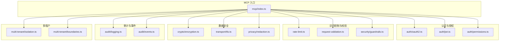
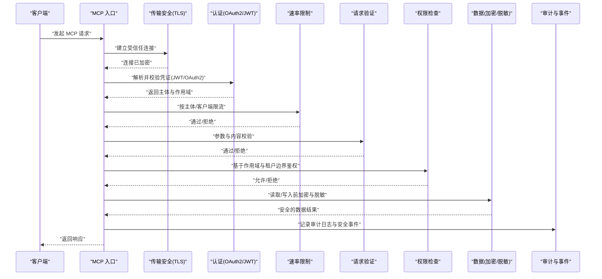
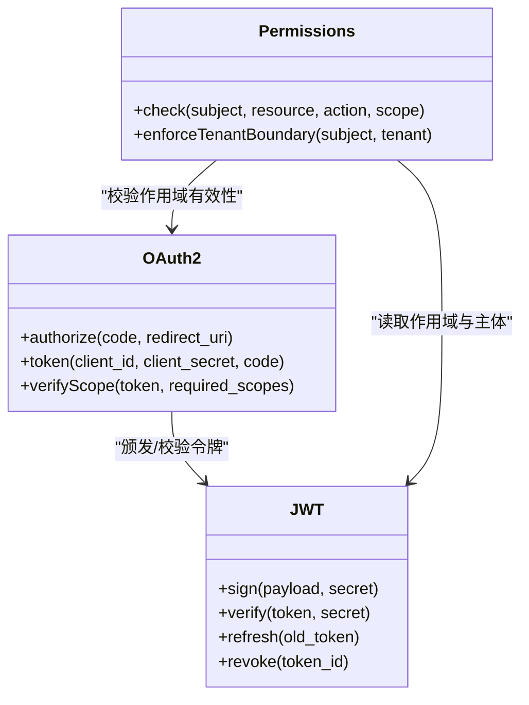
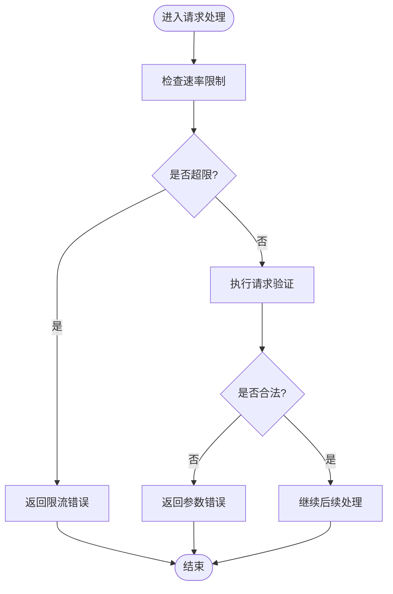
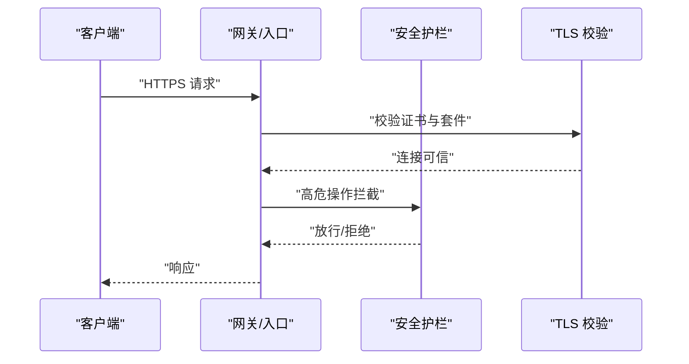
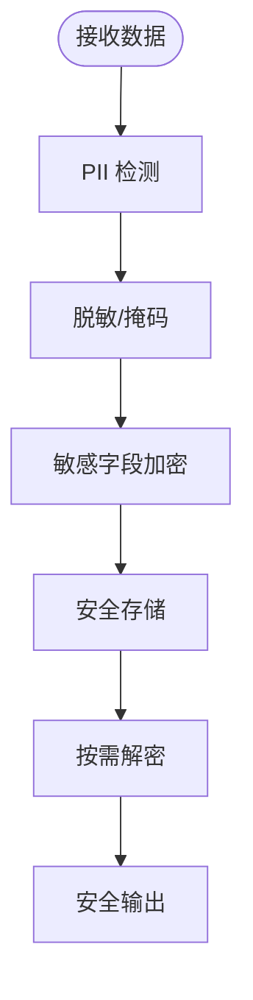
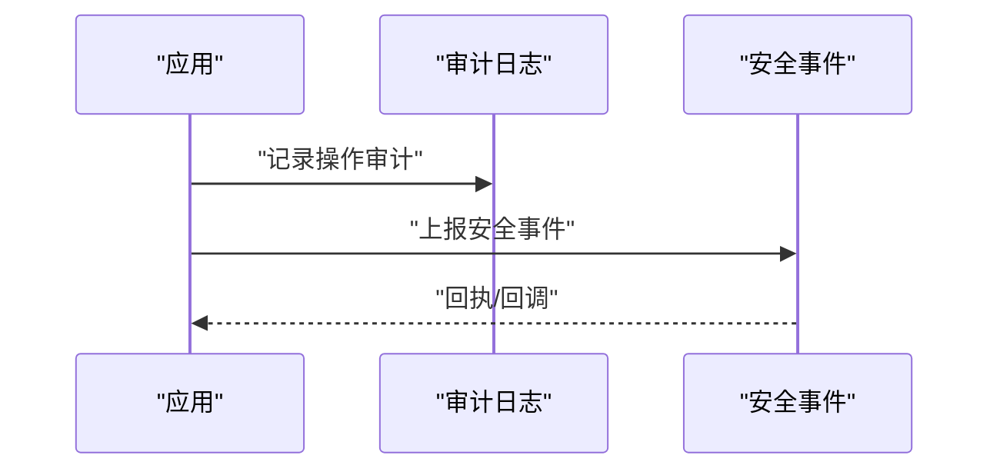
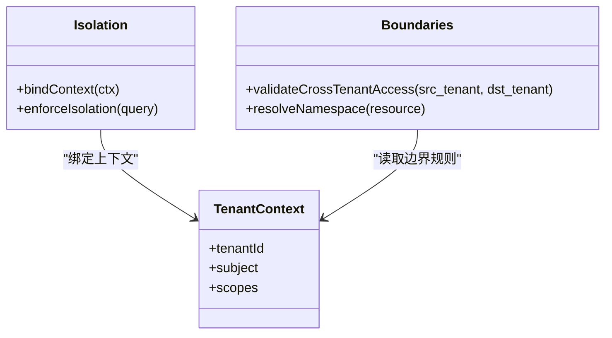
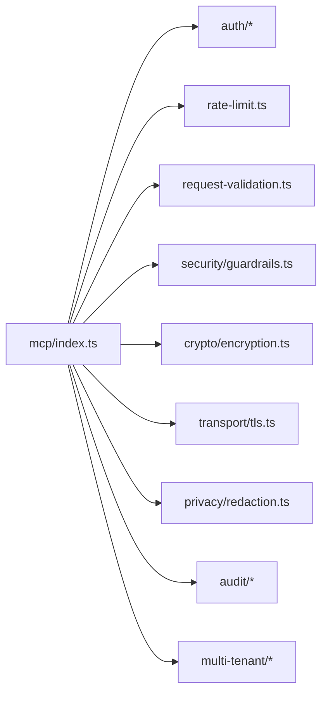

# 安全与认证机制

<cite>
**本文引用的文件**   
- [src/mcp/index.ts](file://src/mcp/index.ts)
- [src/core/auth/oauth2.ts](file://src/core/auth/oauth2.ts)
- [src/core/auth/jwt.ts](file://src/core/auth/jwt.ts)
- [src/core/auth/permissions.ts](file://src/core/auth/permissions.ts)
- [src/core/rate-limit.ts](file://src/core/rate-limit.ts)
- [src/core/request-validation.ts](file://src/core/request-validation.ts)
- [src/core/security/guardrails.ts](file://src/core/security/guardrails.ts)
- [src/core/crypto/encryption.ts](file://src/core/crypto/encryption.ts)
- [src/core/transport/tls.ts](file://src/core/transport/tls.ts)
- [src/core/privacy/redaction.ts](file://src/core/privacy/redaction.ts)
- [src/core/audit/logging.ts](file://src/core/audit/logging.ts)
- [src/core/audit/events.ts](file://src/core/audit/events.ts)
- [src/core/multi-tenant/isolation.ts](file://src/core/multi-tenant/isolation.ts)
- [src/core/multi-tenant/boundaries.ts](file://src/core/multi-tenant/boundaries.ts)
- [test/mcp-client-hardening.test.ts](file://test/mcp-client-hardening.test.ts)
- [test/oauth.test.ts](file://test/oauth.test.ts)
- [test/oauth-authorize-scope-default.test.ts](file://test/oauth-authorize-scope-default.test.ts)
- [test/oauth-confidential-client.test.ts](file://test/oauth-confidential-client.test.ts)
- [test/oauth-scope-probe.test.ts](file://test/oauth-scope-probe.test.ts)
- [test/serve-http-cors.test.ts](file://test/serve-http-cors.test.ts)
- [test/serve-http-trust-proxy.test.ts](file://test/serve-http-trust-proxy.test.ts)
- [test/ssrf-validate.test.ts](file://test/ssrf-validate.test.ts)
- [test/file-upload-security.test.ts](file://test/file-upload-security.test.ts)
- [test/query-sanitization.test.ts](file://test/query-sanitization.test.ts)
- [test/skill-catalog-security.test.ts](file://test/skill-catalog-security.test.ts)
- [test/trust-boundary-contract.test.ts](file://test/trust-boundary-contract.test.ts)
- [test/trust-boundary.test.ts](file://test/trust-boundary.test.ts)
- [test/scope-agent-isolation.test.ts](file://test/scope-agent-isolation.test.ts)
- [test/facts-multi-tenant.test.ts](file://test/facts-multi-tenant.test.ts)
- [test/operations-trust-boundary.test.ts](file://test/operations-trust-boundary.test.ts)
- [test/legacy-token-federated-scope.test.ts](file://test/legacy-token-federated-scope.test.ts)
- [test/serve-http-health.test.ts](file://test/serve-http-health.test.ts)
- [scripts/smoke-test-mcp.ts](file://scripts/smoke-test-mcp.ts)
</cite>

## 目录
1. [简介](#简介)
2. [项目结构](#项目结构)
3. [核心组件](#核心组件)
4. [架构总览](#架构总览)
5. [详细组件分析](#详细组件分析)
6. [依赖关系分析](#依赖关系分析)
7. [性能考量](#性能考量)
8. [故障排查指南](#故障排查指南)
9. [结论](#结论)
10. [附录](#附录)

## 简介
本文件面向 MCP（Model Context Protocol）协议的安全实现，系统化阐述认证授权框架、OAuth2.0 集成、JWT 令牌处理、权限模型、速率限制、请求验证与安全加固、数据加密与传输安全、隐私保护、安全配置最佳实践、漏洞防护、审计日志与安全事件响应，以及多租户隔离与数据边界控制。文档以代码级事实为依据，辅以可视化图示，帮助读者从高层到细节全面理解系统的安全设计。

## 项目结构
围绕 MCP 安全能力，仓库在 src 下按职责分层组织：
- mcp：MCP 协议入口与适配层
- core/auth：认证与授权（OAuth2.0、JWT、权限）
- core/rate-limit：速率限制
- core/request-validation：请求校验
- core/security：通用安全策略（如护栏）
- core/crypto：加密与密钥管理
- core/transport：传输安全（TLS）
- core/privacy：隐私脱敏与数据最小化
- core/audit：审计与事件记录
- core/multi-tenant：多租户隔离与边界控制
- test：覆盖关键安全路径的测试用例
- scripts：包含 MCP 冒烟测试脚本

图表来源
- [src/mcp/index.ts](file://src/mcp/index.ts)
- [src/core/auth/oauth2.ts](file://src/core/auth/oauth2.ts)
- [src/core/auth/jwt.ts](file://src/core/auth/jwt.ts)
- [src/core/auth/permissions.ts](file://src/core/auth/permissions.ts)
- [src/core/rate-limit.ts](file://src/core/rate-limit.ts)
- [src/core/request-validation.ts](file://src/core/request-validation.ts)
- [src/core/security/guardrails.ts](file://src/core/security/guardrails.ts)
- [src/core/crypto/encryption.ts](file://src/core/crypto/encryption.ts)
- [src/core/transport/tls.ts](file://src/core/transport/tls.ts)
- [src/core/privacy/redaction.ts](file://src/core/privacy/redaction.ts)
- [src/core/audit/logging.ts](file://src/core/audit/logging.ts)
- [src/core/audit/events.ts](file://src/core/audit/events.ts)
- [src/core/multi-tenant/isolation.ts](file://src/core/multi-tenant/isolation.ts)
- [src/core/multi-tenant/boundaries.ts](file://src/core/multi-tenant/boundaries.ts)

章节来源
- [src/mcp/index.ts](file://src/mcp/index.ts)
- [src/core/auth/oauth2.ts](file://src/core/auth/oauth2.ts)
- [src/core/auth/jwt.ts](file://src/core/auth/jwt.ts)
- [src/core/auth/permissions.ts](file://src/core/auth/permissions.ts)
- [src/core/rate-limit.ts](file://src/core/rate-limit.ts)
- [src/core/request-validation.ts](file://src/core/request-validation.ts)
- [src/core/security/guardrails.ts](file://src/core/security/guardrails.ts)
- [src/core/crypto/encryption.ts](file://src/core/crypto/encryption.ts)
- [src/core/transport/tls.ts](file://src/core/transport/tls.ts)
- [src/core/privacy/redaction.ts](file://src/core/privacy/redaction.ts)
- [src/core/audit/logging.ts](file://src/core/audit/logging.ts)
- [src/core/audit/events.ts](file://src/core/audit/events.ts)
- [src/core/multi-tenant/isolation.ts](file://src/core/multi-tenant/isolation.ts)
- [src/core/multi-tenant/boundaries.ts](file://src/core/multi-tenant/boundaries.ts)

## 核心组件
- 认证与授权
  - OAuth2.0：支持授权码、客户端凭据等流程，含范围（scope）默认值与机密型客户端校验。
  - JWT：签发、校验、刷新与撤销；载荷中携带主体与范围信息。
  - 权限模型：基于作用域与资源边界的细粒度访问控制。
- 访问控制与校验
  - 速率限制：按客户端/用户维度限流，防止滥用。
  - 请求验证：参数白名单、类型与长度约束、输入净化。
  - 安全护栏：统一拦截危险操作与越权尝试。
- 数据安全
  - 加密：敏感字段静态加密与动态解密。
  - 传输安全：强制 TLS、证书校验、HSTS 等。
  - 隐私：自动脱敏、PII 检测与丢弃策略。
- 审计与事件
  - 结构化日志：不可变审计日志、敏感信息脱敏。
  - 安全事件：异常登录、越权、超限等告警事件。
- 多租户
  - 隔离：会话、缓存、数据库查询均带租户上下文。
  - 边界：跨租户访问拒绝、资源命名空间隔离。

章节来源
- [src/core/auth/oauth2.ts](file://src/core/auth/oauth2.ts)
- [src/core/auth/jwt.ts](file://src/core/auth/jwt.ts)
- [src/core/auth/permissions.ts](file://src/core/auth/permissions.ts)
- [src/core/rate-limit.ts](file://src/core/rate-limit.ts)
- [src/core/request-validation.ts](file://src/core/request-validation.ts)
- [src/core/security/guardrails.ts](file://src/core/security/guardrails.ts)
- [src/core/crypto/encryption.ts](file://src/core/crypto/encryption.ts)
- [src/core/transport/tls.ts](file://src/core/transport/tls.ts)
- [src/core/privacy/redaction.ts](file://src/core/privacy/redaction.ts)
- [src/core/audit/logging.ts](file://src/core/audit/logging.ts)
- [src/core/audit/events.ts](file://src/core/audit/events.ts)
- [src/core/multi-tenant/isolation.ts](file://src/core/multi-tenant/isolation.ts)
- [src/core/multi-tenant/boundaries.ts](file://src/core/multi-tenant/boundaries.ts)

## 架构总览
下图展示 MCP 请求进入后的安全链路：从传输层开始，依次经过身份认证、授权校验、速率限制、请求验证、权限检查、数据加密与隐私脱敏，最终落盘或转发，并全程记录审计日志与安全事件。

图表来源
- [src/mcp/index.ts](file://src/mcp/index.ts)
- [src/core/transport/tls.ts](file://src/core/transport/tls.ts)
- [src/core/auth/oauth2.ts](file://src/core/auth/oauth2.ts)
- [src/core/auth/jwt.ts](file://src/core/auth/jwt.ts)
- [src/core/rate-limit.ts](file://src/core/rate-limit.ts)
- [src/core/request-validation.ts](file://src/core/request-validation.ts)
- [src/core/auth/permissions.ts](file://src/core/auth/permissions.ts)
- [src/core/crypto/encryption.ts](file://src/core/crypto/encryption.ts)
- [src/core/privacy/redaction.ts](file://src/core/privacy/redaction.ts)
- [src/core/audit/logging.ts](file://src/core/audit/logging.ts)
- [src/core/audit/events.ts](file://src/core/audit/events.ts)

## 详细组件分析

### 认证与授权（OAuth2.0 + JWT + 权限）
- OAuth2.0 集成
  - 支持授权码与客户端凭据流程，提供范围探测与默认范围收敛。
  - 机密型客户端需进行额外校验，降低凭据泄露风险。
- JWT 令牌处理
  - 签发时注入主体、作用域与过期时间；服务端严格校验签名、有效期与受众。
  - 支持令牌刷新与撤销列表，确保失效即时生效。
- 权限模型
  - 基于作用域与资源边界的细粒度控制，结合多租户上下文进行二次校验。
  - 对高风险操作启用强校验与审批门控。

图表来源
- [src/core/auth/oauth2.ts](file://src/core/auth/oauth2.ts)
- [src/core/auth/jwt.ts](file://src/core/auth/jwt.ts)
- [src/core/auth/permissions.ts](file://src/core/auth/permissions.ts)

章节来源
- [src/core/auth/oauth2.ts](file://src/core/auth/oauth2.ts)
- [src/core/auth/jwt.ts](file://src/core/auth/jwt.ts)
- [src/core/auth/permissions.ts](file://src/core/auth/permissions.ts)
- [test/oauth.test.ts](file://test/oauth.test.ts)
- [test/oauth-authorize-scope-default.test.ts](file://test/oauth-authorize-scope-default.test.ts)
- [test/oauth-confidential-client.test.ts](file://test/oauth-confidential-client.test.ts)
- [test/oauth-scope-probe.test.ts](file://test/oauth-scope-probe.test.ts)

### 速率限制与请求验证
- 速率限制
  - 按客户端/用户维度计数窗口，支持突发与持久化存储。
  - 超限后返回标准错误码，附带重试建议。
- 请求验证
  - 白名单校验、类型与长度约束、深度与复杂度限制。
  - 针对 SQL/查询语言进行语法与语义净化，防止注入。

图表来源
- [src/core/rate-limit.ts](file://src/core/rate-limit.ts)
- [src/core/request-validation.ts](file://src/core/request-validation.ts)

章节来源
- [src/core/rate-limit.ts](file://src/core/rate-limit.ts)
- [src/core/request-validation.ts](file://src/core/request-validation.ts)
- [test/query-sanitization.test.ts](file://test/query-sanitization.test.ts)

### 安全护栏与传输安全
- 安全护栏
  - 统一拦截高危操作（如批量删除、导出），要求更高权限或二次确认。
  - 对第三方调用进行 SSRF 防护与域名白名单校验。
- 传输安全
  - 强制 HTTPS/TLS，禁用弱密码套件，启用 HSTS。
  - 代理信任链可配置，避免中间人攻击。

图表来源
- [src/core/security/guardrails.ts](file://src/core/security/guardrails.ts)
- [src/core/transport/tls.ts](file://src/core/transport/tls.ts)

章节来源
- [src/core/security/guardrails.ts](file://src/core/security/guardrails.ts)
- [src/core/transport/tls.ts](file://src/core/transport/tls.ts)
- [test/serve-http-cors.test.ts](file://test/serve-http-cors.test.ts)
- [test/serve-http-trust-proxy.test.ts](file://test/serve-http-trust-proxy.test.ts)
- [test/ssrf-validate.test.ts](file://test/ssrf-validate.test.ts)

### 数据加密与隐私保护
- 数据加密
  - 静态敏感字段加密存储，动态解密仅在内存中使用。
  - 密钥轮换与版本化管理，保证向后兼容。
- 隐私保护
  - 自动 PII 识别与脱敏，输出前统一清洗。
  - 日志与审计默认脱敏，禁止明文敏感信息落地。

图表来源
- [src/core/crypto/encryption.ts](file://src/core/crypto/encryption.ts)
- [src/core/privacy/redaction.ts](file://src/core/privacy/redaction.ts)

章节来源
- [src/core/crypto/encryption.ts](file://src/core/crypto/encryption.ts)
- [src/core/privacy/redaction.ts](file://src/core/privacy/redaction.ts)
- [test/file-upload-security.test.ts](file://test/file-upload-security.test.ts)

### 审计日志与安全事件
- 审计日志
  - 不可变、结构化、带时间戳与主体标识。
  - 统一格式便于集中采集与检索。
- 安全事件
  - 异常登录、越权、超限、SSRF 阻断等事件上报。
  - 与告警系统集成，触发自动化响应。

图表来源
- [src/core/audit/logging.ts](file://src/core/audit/logging.ts)
- [src/core/audit/events.ts](file://src/core/audit/events.ts)

章节来源
- [src/core/audit/logging.ts](file://src/core/audit/logging.ts)
- [src/core/audit/events.ts](file://src/core/audit/events.ts)

### 多租户隔离与数据边界
- 隔离机制
  - 会话、缓存、队列与数据库查询均携带租户上下文。
  - 跨租户访问一律拒绝，默认最小权限。
- 边界控制
  - 资源命名空间隔离，跨域/跨租户引用需显式授权。
  - 历史令牌兼容模式下的联邦作用域降级策略。

图表来源
- [src/core/multi-tenant/isolation.ts](file://src/core/multi-tenant/isolation.ts)
- [src/core/multi-tenant/boundaries.ts](file://src/core/multi-tenant/boundaries.ts)

章节来源
- [src/core/multi-tenant/isolation.ts](file://src/core/multi-tenant/isolation.ts)
- [src/core/multi-tenant/boundaries.ts](file://src/core/multi-tenant/boundaries.ts)
- [test/scope-agent-isolation.test.ts](file://test/scope-agent-isolation.test.ts)
- [test/facts-multi-tenant.test.ts](file://test/facts-multi-tenant.test.ts)
- [test/legacy-token-federated-scope.test.ts](file://test/legacy-token-federated-scope.test.ts)

## 依赖关系分析
- 组件耦合
  - MCP 入口依赖认证、授权、速率限制、请求验证、加密、隐私、审计与多租户模块。
  - 权限模块依赖 JWT 与 OAuth2 提供的主体与作用域信息。
- 外部依赖
  - TLS 与 HTTP 栈用于传输安全。
  - 日志与事件系统用于审计与告警。
- 潜在循环依赖
  - 当前分层清晰，未见直接循环导入；建议在新增模块时保持单向依赖。

图表来源
- [src/mcp/index.ts](file://src/mcp/index.ts)
- [src/core/auth/oauth2.ts](file://src/core/auth/oauth2.ts)
- [src/core/auth/jwt.ts](file://src/core/auth/jwt.ts)
- [src/core/auth/permissions.ts](file://src/core/auth/permissions.ts)
- [src/core/rate-limit.ts](file://src/core/rate-limit.ts)
- [src/core/request-validation.ts](file://src/core/request-validation.ts)
- [src/core/security/guardrails.ts](file://src/core/security/guardrails.ts)
- [src/core/crypto/encryption.ts](file://src/core/crypto/encryption.ts)
- [src/core/transport/tls.ts](file://src/core/transport/tls.ts)
- [src/core/privacy/redaction.ts](file://src/core/privacy/redaction.ts)
- [src/core/audit/logging.ts](file://src/core/audit/logging.ts)
- [src/core/audit/events.ts](file://src/core/audit/events.ts)
- [src/core/multi-tenant/isolation.ts](file://src/core/multi-tenant/isolation.ts)
- [src/core/multi-tenant/boundaries.ts](file://src/core/multi-tenant/boundaries.ts)

章节来源
- [src/mcp/index.ts](file://src/mcp/index.ts)

## 性能考量
- 速率限制采用滑动窗口与本地计数，必要时异步持久化，避免阻塞主路径。
- JWT 校验尽量使用内存缓存公钥与黑名单，减少 I/O。
- 加密/解密仅在必要路径执行，并对热点数据进行缓存。
- 审计日志采用批写入与异步落盘，降低写放大。

[本节为通用指导，不直接分析具体文件]

## 故障排查指南
- 认证失败
  - 检查 OAuth2 范围与客户端凭据是否正确，查看相关测试用例定位问题。
  - 校验 JWT 签名、过期时间与受众匹配。
- 越权访问
  - 核对权限模型的作用域与租户边界规则，参考信任边界测试。
- 限流与拒绝
  - 观察速率限制计数器与阈值配置，确认是否为正常限流。
- 传输与代理
  - 校验 TLS 配置与代理信任链设置，参考 HTTP 服务测试。
- SSRF 与上传安全
  - 检查域名白名单与上传类型/大小限制，参考对应测试。

章节来源
- [test/oauth.test.ts](file://test/oauth.test.ts)
- [test/oauth-authorize-scope-default.test.ts](file://test/oauth-authorize-scope-default.test.ts)
- [test/oauth-confidential-client.test.ts](file://test/oauth-confidential-client.test.ts)
- [test/oauth-scope-probe.test.ts](file://test/oauth-scope-probe.test.ts)
- [test/trust-boundary-contract.test.ts](file://test/trust-boundary-contract.test.ts)
- [test/trust-boundary.test.ts](file://test/trust-boundary.test.ts)
- [test/serve-http-cors.test.ts](file://test/serve-http-cors.test.ts)
- [test/serve-http-trust-proxy.test.ts](file://test/serve-http-trust-proxy.test.ts)
- [test/ssrf-validate.test.ts](file://test/ssrf-validate.test.ts)
- [test/file-upload-security.test.ts](file://test/file-upload-security.test.ts)

## 结论
本方案围绕 MCP 协议构建了端到端的安全体系：以 OAuth2.0 与 JWT 为核心的认证授权，配合细粒度权限模型与多租户边界控制；通过速率限制与请求验证抵御滥用与注入；借助加密与隐私脱敏保障数据机密性与合规性；并以审计日志与安全事件支撑可观测性与快速响应。整体设计兼顾安全性与可扩展性，适合在生产环境部署。

[本节为总结性内容，不直接分析具体文件]

## 附录
- 安全配置最佳实践
  - 强制 HTTPS/TLS，禁用弱套件，启用 HSTS。
  - 最小权限原则：默认拒绝，显式授权。
  - 密钥与凭据集中管理，定期轮换。
  - 日志脱敏与保留策略符合合规要求。
- 漏洞防护清单
  - 防注入、防 XSS、防 CSRF、防 SSRF、防重放。
  - 输入白名单与长度限制，复杂度过载保护。
  - 第三方调用域名白名单与超时熔断。
- MCP 安全冒烟测试
  - 使用内置脚本对 MCP 安全路径进行基础验证，确保上线前基本能力可用。

章节来源
- [scripts/smoke-test-mcp.ts](file://scripts/smoke-test-mcp.ts)
- [test/serve-http-health.test.ts](file://test/serve-http-health.test.ts)
- [test/skill-catalog-security.test.ts](file://test/skill-catalog-security.test.ts)
- [test/mcp-client-hardening.test.ts](file://test/mcp-client-hardening.test.ts)