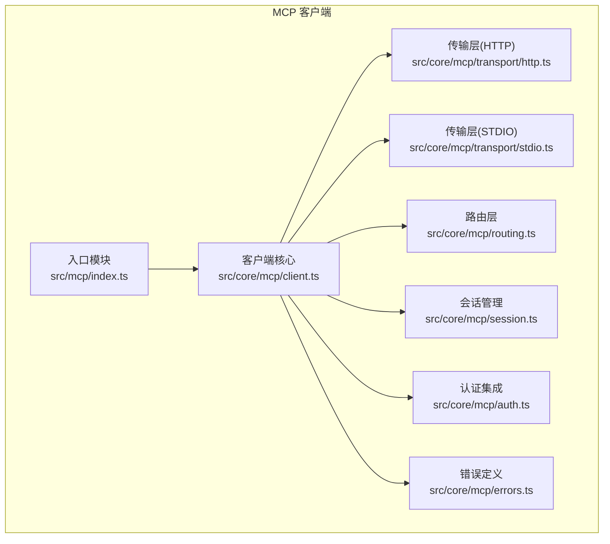
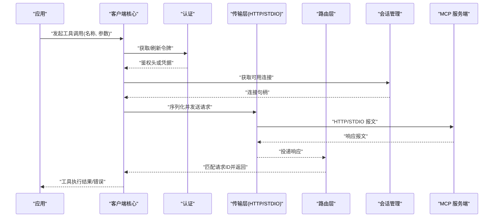
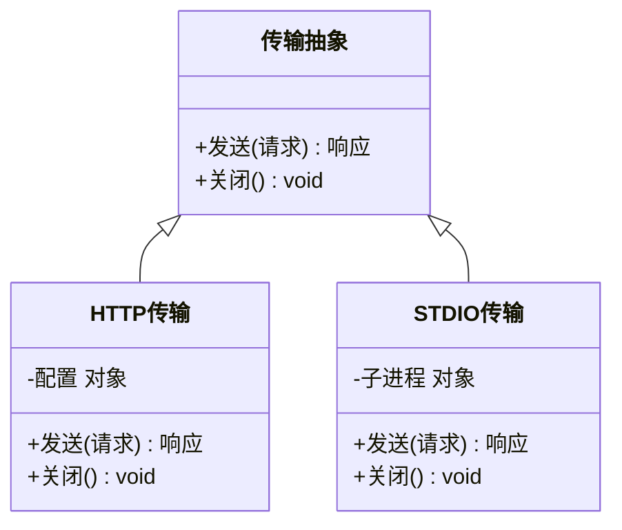
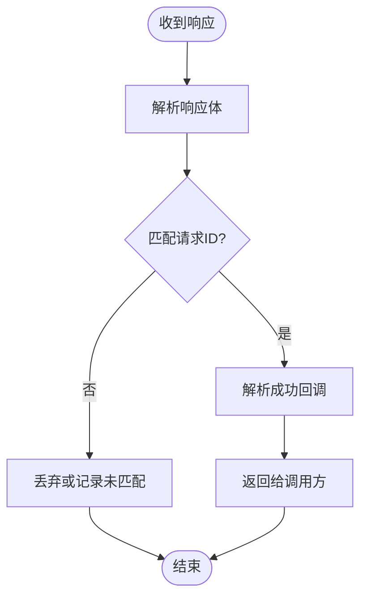
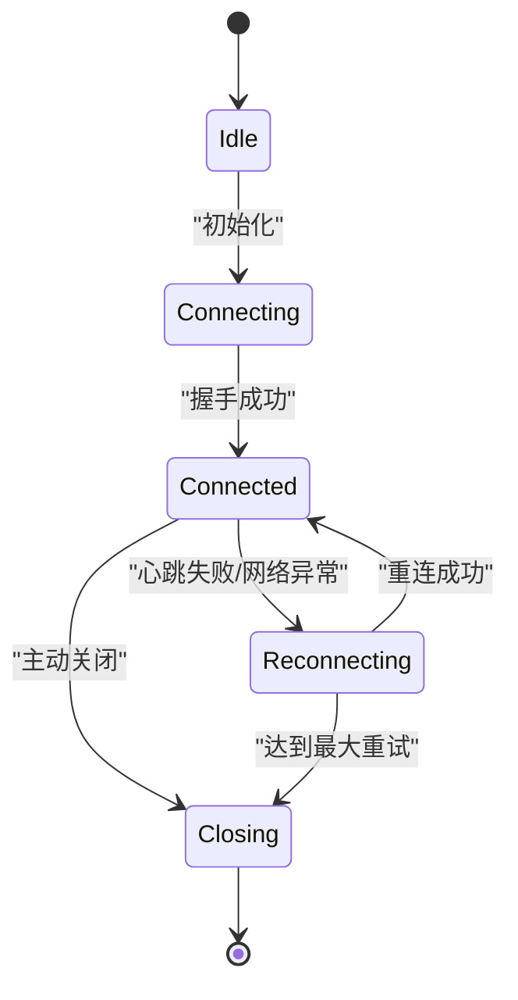
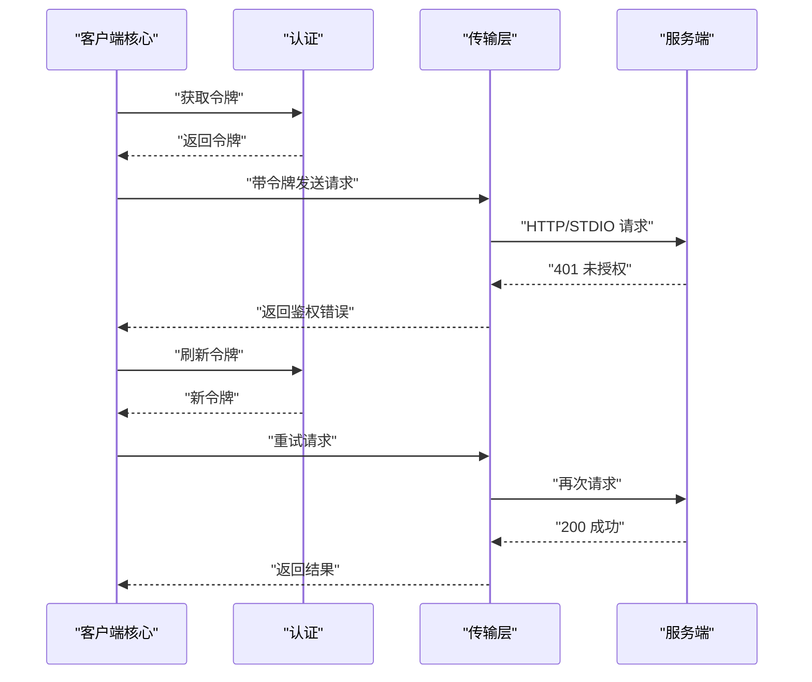
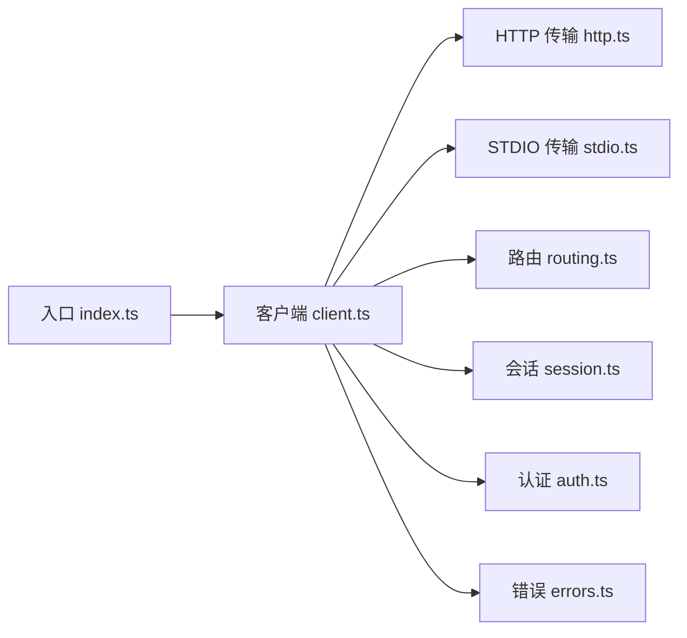

# 客户端开发指南

<cite>
**本文引用的文件**   
- [src/mcp/index.ts](file://src/mcp/index.ts)
- [src/core/mcp/client.ts](file://src/core/mcp/client.ts)
- [src/core/mcp/transport/http.ts](file://src/core/mcp/transport/http.ts)
- [src/core/mcp/transport/stdio.ts](file://src/core/mcp/transport/stdio.ts)
- [src/core/mcp/routing.ts](file://src/core/mcp/routing.ts)
- [src/core/mcp/session.ts](file://src/core/mcp/session.ts)
- [src/core/mcp/auth.ts](file://src/core/mcp/auth.ts)
- [src/core/mcp/errors.ts](file://src/core/mcp/errors.ts)
- [test/mcp-client.test.ts](file://test/mcp-client.test.ts)
- [test/mcp-client-hardening.test.ts](file://test/mcp-client-hardening.test.ts)
- [scripts/smoke-test-mcp.ts](file://scripts/smoke-test-mcp.ts)
</cite>

## 目录
1. [简介](#简介)
2. [项目结构](#项目结构)
3. [核心组件](#核心组件)
4. [架构总览](#架构总览)
5. [详细组件分析](#详细组件分析)
6. [依赖关系分析](#依赖关系分析)
7. [性能考虑](#性能考虑)
8. [故障排查指南](#故障排查指南)
9. [结论](#结论)
10. [附录](#附录)

## 简介
本指南面向希望基于 MCP（Model Context Protocol）构建客户端应用的开发者，覆盖 HTTP 传输层实现、连接管理、消息路由、工具调用流程、参数传递与结果处理、认证集成、会话管理、错误恢复机制、调试技巧与性能优化建议。文档同时提供多种编程语言的集成思路与示例路径，帮助快速落地不同形态的客户端应用。

## 项目结构
仓库中与 MCP 客户端相关的关键代码位于 src/core/mcp 与 src/mcp 目录，测试与脚本分别位于 test 与 scripts 目录。整体采用分层设计：
- 传输层：HTTP、STDIO 等协议适配
- 会话层：连接生命周期、重连与保活
- 路由层：请求-响应匹配、超时与重试
- 认证层：令牌获取、刷新与注入
- 错误层：统一错误分类与可观测性

图表来源
- [src/mcp/index.ts](file://src/mcp/index.ts)
- [src/core/mcp/client.ts](file://src/core/mcp/client.ts)
- [src/core/mcp/transport/http.ts](file://src/core/mcp/transport/http.ts)
- [src/core/mcp/transport/stdio.ts](file://src/core/mcp/transport/stdio.ts)
- [src/core/mcp/routing.ts](file://src/core/mcp/routing.ts)
- [src/core/mcp/session.ts](file://src/core/mcp/session.ts)
- [src/core/mcp/auth.ts](file://src/core/mcp/auth.ts)
- [src/core/mcp/errors.ts](file://src/core/mcp/errors.ts)

章节来源
- [src/mcp/index.ts](file://src/mcp/index.ts)
- [src/core/mcp/client.ts](file://src/core/mcp/client.ts)
- [src/core/mcp/transport/http.ts](file://src/core/mcp/transport/http.ts)
- [src/core/mcp/transport/stdio.ts](file://src/core/mcp/transport/stdio.ts)
- [src/core/mcp/routing.ts](file://src/core/mcp/routing.ts)
- [src/core/mcp/session.ts](file://src/core/mcp/session.ts)
- [src/core/mcp/auth.ts](file://src/core/mcp/auth.ts)
- [src/core/mcp/errors.ts](file://src/core/mcp/errors.ts)

## 核心组件
- 客户端核心：封装连接建立、消息发送/接收、工具调用编排、并发控制与资源清理。
- 传输层：HTTP 与 STDIO 两种传输实现，屏蔽底层差异，向上暴露统一的 send/receive 接口。
- 路由层：维护请求 ID 到回调的映射，支持超时、重试与幂等策略。
- 会话管理：负责连接池、心跳、断线重连、优雅关闭与状态机转换。
- 认证集成：在请求前注入鉴权信息，支持令牌刷新与失败回退。
- 错误定义：标准化错误类型、码与上下文，便于上层统一处理与上报。

章节来源
- [src/core/mcp/client.ts](file://src/core/mcp/client.ts)
- [src/core/mcp/transport/http.ts](file://src/core/mcp/transport/http.ts)
- [src/core/mcp/transport/stdio.ts](file://src/core/mcp/transport/stdio.ts)
- [src/core/mcp/routing.ts](file://src/core/mcp/routing.ts)
- [src/core/mcp/session.ts](file://src/core/mcp/session.ts)
- [src/core/mcp/auth.ts](file://src/core/mcp/auth.ts)
- [src/core/mcp/errors.ts](file://src/core/mcp/errors.ts)

## 架构总览
下图展示了从应用侧发起工具调用到服务端返回结果的完整链路，包括认证注入、传输选择、路由分发与错误处理。

图表来源
- [src/core/mcp/client.ts](file://src/core/mcp/client.ts)
- [src/core/mcp/auth.ts](file://src/core/mcp/auth.ts)
- [src/core/mcp/transport/http.ts](file://src/core/mcp/transport/http.ts)
- [src/core/mcp/transport/stdio.ts](file://src/core/mcp/transport/stdio.ts)
- [src/core/mcp/routing.ts](file://src/core/mcp/routing.ts)
- [src/core/mcp/session.ts](file://src/core/mcp/session.ts)

## 详细组件分析

### 客户端核心（client.ts）
职责与要点：
- 对外暴露工具调用 API，内部协调认证、会话、传输与路由。
- 维护请求上下文（如 traceId、sourceId），用于追踪与审计。
- 支持批量调用与并发上限控制，避免下游过载。
- 对异常进行归类与包装，输出结构化错误以便上层处理。

最佳实践：
- 为每个工具调用设置合理超时与重试次数。
- 使用幂等键避免重复执行副作用操作。
- 将耗时任务拆分为分片，结合进度事件反馈。

章节来源
- [src/core/mcp/client.ts](file://src/core/mcp/client.ts)

### 传输层（HTTP/STDIO）
HTTP 传输：
- 负责构造 HTTP 请求、设置头部（含认证）、处理 JSON 编解码。
- 支持连接复用、超时与重试配置。
- 对网络异常进行分类（超时、连接拒绝、证书错误等）。

STDIO 传输：
- 通过标准输入输出与本地进程通信。
- 需要处理进程生命周期、管道断开与重启。

图表来源
- [src/core/mcp/transport/http.ts](file://src/core/mcp/transport/http.ts)
- [src/core/mcp/transport/stdio.ts](file://src/core/mcp/transport/stdio.ts)

章节来源
- [src/core/mcp/transport/http.ts](file://src/core/mcp/transport/http.ts)
- [src/core/mcp/transport/stdio.ts](file://src/core/mcp/transport/stdio.ts)

### 路由层（routing.ts）
职责与要点：
- 维护请求 ID 到回调的映射表，确保响应正确投递。
- 支持超时取消、重试与去重。
- 提供批量等待与聚合能力。

图表来源
- [src/core/mcp/routing.ts](file://src/core/mcp/routing.ts)

章节来源
- [src/core/mcp/routing.ts](file://src/core/mcp/routing.ts)

### 会话管理（session.ts）
职责与要点：
- 连接池管理：创建、复用、回收连接。
- 心跳与保活：周期性探测，自动重连。
- 优雅关闭：等待在途请求完成后再释放资源。
- 状态机：Idle、Connecting、Connected、Reconnecting、Closing。

图表来源
- [src/core/mcp/session.ts](file://src/core/mcp/session.ts)

章节来源
- [src/core/mcp/session.ts](file://src/core/mcp/session.ts)

### 认证集成（auth.ts）
职责与要点：
- 在请求前注入令牌或签名。
- 支持令牌缓存与刷新策略。
- 对 401/403 等鉴权错误进行自动重试或降级。

图表来源
- [src/core/mcp/auth.ts](file://src/core/mcp/auth.ts)
- [src/core/mcp/transport/http.ts](file://src/core/mcp/transport/http.ts)

章节来源
- [src/core/mcp/auth.ts](file://src/core/mcp/auth.ts)

### 错误定义（errors.ts）
职责与要点：
- 定义统一错误类型与错误码。
- 包含上下文信息（请求ID、时间戳、上游错误）。
- 支持错误分级（可重试、不可重试、限流等）。

章节来源
- [src/core/mcp/errors.ts](file://src/core/mcp/errors.ts)

### 入口模块（index.ts）
职责与要点：
- 导出高层 API，简化客户端初始化与常用场景。
- 提供默认配置与便捷方法（如 listTools、callTool）。

章节来源
- [src/mcp/index.ts](file://src/mcp/index.ts)

## 依赖关系分析

图表来源
- [src/mcp/index.ts](file://src/mcp/index.ts)
- [src/core/mcp/client.ts](file://src/core/mcp/client.ts)
- [src/core/mcp/transport/http.ts](file://src/core/mcp/transport/http.ts)
- [src/core/mcp/transport/stdio.ts](file://src/core/mcp/transport/stdio.ts)
- [src/core/mcp/routing.ts](file://src/core/mcp/routing.ts)
- [src/core/mcp/session.ts](file://src/core/mcp/session.ts)
- [src/core/mcp/auth.ts](file://src/core/mcp/auth.ts)
- [src/core/mcp/errors.ts](file://src/core/mcp/errors.ts)

章节来源
- [src/mcp/index.ts](file://src/mcp/index.ts)
- [src/core/mcp/client.ts](file://src/core/mcp/client.ts)
- [src/core/mcp/transport/http.ts](file://src/core/mcp/transport/http.ts)
- [src/core/mcp/transport/stdio.ts](file://src/core/mcp/transport/stdio.ts)
- [src/core/mcp/routing.ts](file://src/core/mcp/routing.ts)
- [src/core/mcp/session.ts](file://src/core/mcp/session.ts)
- [src/core/mcp/auth.ts](file://src/core/mcp/auth.ts)
- [src/core/mcp/errors.ts](file://src/core/mcp/errors.ts)

## 性能考虑
- 连接复用：优先复用长连接，减少握手开销。
- 并发控制：限制并行度，避免下游服务过载。
- 批处理：合并小请求，降低往返次数。
- 超时与重试：合理设置超时时间与退避策略，避免雪崩。
- 缓存：对只读工具结果进行短期缓存，提升命中率。
- 监控：采集延迟、吞吐、错误率与重试次数等指标。

[本节为通用指导，不直接分析具体文件]

## 故障排查指南
常见问题与定位步骤：
- 连接失败：检查网络可达性、代理与证书；查看会话状态机日志。
- 鉴权失败：确认令牌有效期与刷新逻辑；观察 401/403 重试路径。
- 路由丢失：核对请求 ID 生成与匹配规则；检查超时是否过早取消。
- 传输异常：区分 HTTP 与 STDIO 错误类别；验证编码格式与边界条件。
- 性能问题：分析并发与批大小；定位慢请求与热点工具。

参考测试与脚本：
- 单元测试覆盖客户端行为与健壮性。
- 冒烟脚本用于端到端连通性与基础功能验证。

章节来源
- [test/mcp-client.test.ts](file://test/mcp-client.test.ts)
- [test/mcp-client-hardening.test.ts](file://test/mcp-client-hardening.test.ts)
- [scripts/smoke-test-mcp.ts](file://scripts/smoke-test-mcp.ts)

## 结论
通过分层设计与清晰的职责划分，MCP 客户端能够以一致的方式对接多种传输与认证方案，并提供稳定的连接管理与错误恢复能力。遵循本文的最佳实践与排障建议，可在多语言环境中快速构建高可用的 MCP 客户端应用。

[本节为总结性内容，不直接分析具体文件]

## 附录

### 多语言 SDK 使用示例与集成模式
- Node.js/TypeScript
  - 使用入口模块初始化客户端，配置传输与认证，调用工具并处理结果。
  - 参考路径：[入口模块](file://src/mcp/index.ts)、[客户端核心](file://src/core/mcp/client.ts)
- Python
  - 通过 HTTP 传输封装 REST 调用，或使用 STDIO 与本地进程通信。
  - 参考路径：[HTTP 传输](file://src/core/mcp/transport/http.ts)、[STDIO 传输](file://src/core/mcp/transport/stdio.ts)
- Go
  - 使用 net/http 实现传输层，结合 goroutine 与 channel 管理并发与路由。
  - 参考路径：[路由层](file://src/core/mcp/routing.ts)、[会话管理](file://src/core/mcp/session.ts)
- Java/Kotlin
  - 基于 OkHttp 或 Apache HttpClient 实现传输层，配合线程池与队列管理。
  - 参考路径：[认证集成](file://src/core/mcp/auth.ts)、[错误定义](file://src/core/mcp/errors.ts)

### 工具调用流程与最佳实践
- 参数校验：在服务端与客户端双重校验，避免无效请求。
- 幂等设计：为写操作提供幂等键，防止重复执行。
- 进度反馈：对长耗时任务使用分片与事件推送。
- 结果处理：统一数据结构，明确成功/失败分支与错误码。

章节来源
- [src/core/mcp/client.ts](file://src/core/mcp/client.ts)
- [src/core/mcp/routing.ts](file://src/core/mcp/routing.ts)
- [src/core/mcp/errors.ts](file://src/core/mcp/errors.ts)

### 认证与会话管理
- 认证策略：Bearer Token、OAuth2、HMAC 签名等。
- 会话策略：连接池大小、心跳间隔、重连退避与最大重试次数。
- 安全加固：最小权限原则、敏感信息脱敏与审计日志。

章节来源
- [src/core/mcp/auth.ts](file://src/core/mcp/auth.ts)
- [src/core/mcp/session.ts](file://src/core/mcp/session.ts)

### 调试技巧
- 启用详细日志：记录请求/响应、错误堆栈与上下文。
- 使用追踪 ID：贯穿上下游，便于关联分析。
- 模拟与桩：在测试中替换传输层与认证层，隔离外部依赖。

章节来源
- [test/mcp-client.test.ts](file://test/mcp-client.test.ts)
- [test/mcp-client-hardening.test.ts](file://test/mcp-client-hardening.test.ts)
- [scripts/smoke-test-mcp.ts](file://scripts/smoke-test-mcp.ts)