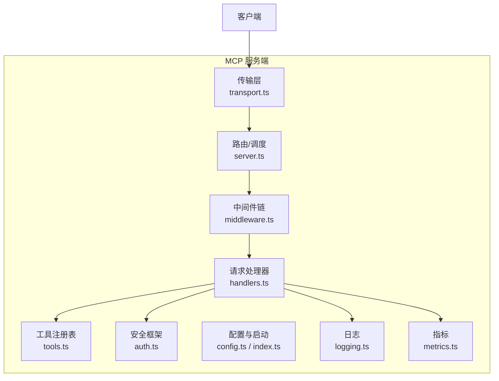
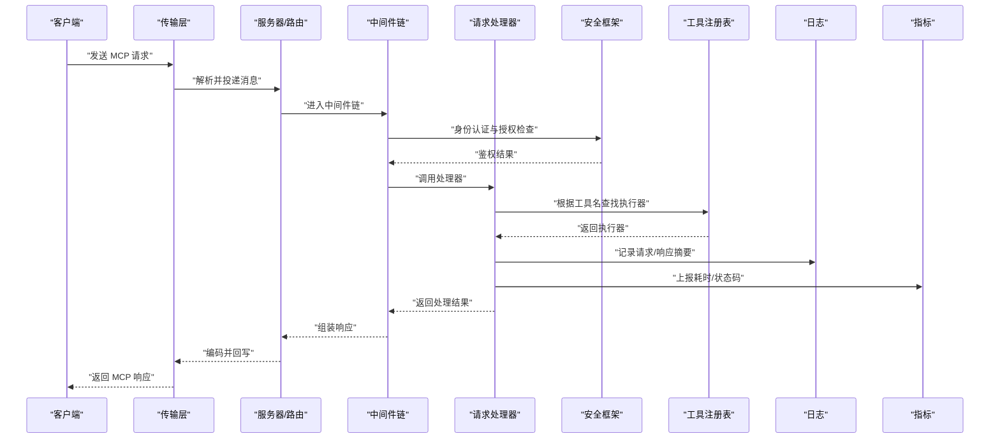
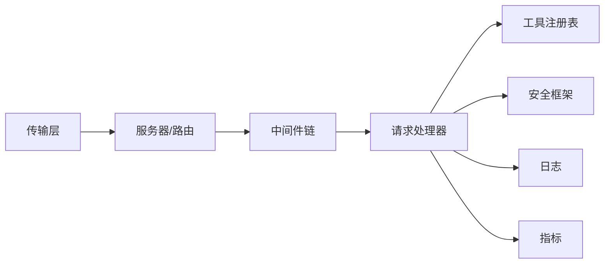

# 服务端实现架构

<cite>
**本文引用的文件**   
- [src/mcp/index.ts](file://src/mcp/index.ts)
- [src/mcp/server.ts](file://src/mcp/server.ts)
- [src/mcp/transport.ts](file://src/mcp/transport.ts)
- [src/mcp/handlers.ts](file://src/mcp/handlers.ts)
- [src/mcp/tools.ts](file://src/mcp/tools.ts)
- [src/mcp/auth.ts](file://src/mcp/auth.ts)
- [src/mcp/middleware.ts](file://src/mcp/middleware.ts)
- [src/mcp/config.ts](file://src/mcp/config.ts)
- [src/mcp/logging.ts](file://src/mcp/logging.ts)
- [src/mcp/metrics.ts](file://src/mcp/metrics.ts)
- [scripts/smoke-test-mcp.ts](file://scripts/smoke-test-mcp.ts)
</cite>

## 目录
1. [简介](#简介)
2. [项目结构](#项目结构)
3. [核心组件](#核心组件)
4. [架构总览](#架构总览)
5. [详细组件分析](#详细组件分析)
6. [依赖关系分析](#依赖关系分析)
7. [性能与高可用](#性能与高可用)
8. [监控、日志与故障诊断](#监控日志与故障诊断)
9. [扩展点与自定义中间件](#扩展点与自定义中间件)
10. [结论](#结论)

## 简介
本文件面向 MCP（Model Context Protocol）服务端的实现，系统性阐述其架构设计与关键机制。文档覆盖请求处理管线、工具注册表、中间件系统、并发控制、负载均衡、资源管理、安全框架（身份验证、授权与访问控制）、高可用部署模式、性能调优策略，以及监控指标、日志记录与故障诊断方法，并给出扩展点设计与自定义中间件开发指南。

## 项目结构
MCP 服务端代码位于 src/mcp 目录下，采用分层与职责分离的组织方式：
- 传输层：负责协议编解码与 I/O 适配（stdio、HTTP 等）
- 路由与处理器：解析请求、分发到具体业务处理器
- 工具注册表：集中管理可被客户端调用的工具定义与执行器
- 中间件系统：在请求进入处理器前后插入横切逻辑（鉴权、限流、审计等）
- 安全模块：统一认证、授权与访问控制
- 配置与运行时：加载配置、启动生命周期管理
- 可观测性：指标采集与结构化日志
- 测试与冒烟脚本：用于快速验证服务端能力

图表来源
- [src/mcp/transport.ts](file://src/mcp/transport.ts)
- [src/mcp/server.ts](file://src/mcp/server.ts)
- [src/mcp/handlers.ts](file://src/mcp/handlers.ts)
- [src/mcp/tools.ts](file://src/mcp/tools.ts)
- [src/mcp/middleware.ts](file://src/mcp/middleware.ts)
- [src/mcp/auth.ts](file://src/mcp/auth.ts)
- [src/mcp/config.ts](file://src/mcp/config.ts)
- [src/mcp/index.ts](file://src/mcp/index.ts)
- [src/mcp/logging.ts](file://src/mcp/logging.ts)
- [src/mcp/metrics.ts](file://src/mcp/metrics.ts)

章节来源
- [src/mcp/index.ts](file://src/mcp/index.ts)
- [src/mcp/server.ts](file://src/mcp/server.ts)
- [src/mcp/transport.ts](file://src/mcp/transport.ts)
- [src/mcp/handlers.ts](file://src/mcp/handlers.ts)
- [src/mcp/tools.ts](file://src/mcp/tools.ts)
- [src/mcp/middleware.ts](file://src/mcp/middleware.ts)
- [src/mcp/auth.ts](file://src/mcp/auth.ts)
- [src/mcp/config.ts](file://src/mcp/config.ts)
- [src/mcp/logging.ts](file://src/mcp/logging.ts)
- [src/mcp/metrics.ts](file://src/mcp/metrics.ts)

## 核心组件
- 传输层（Transport）
  - 职责：抽象底层 I/O（如 stdio、HTTP），完成消息的序列化/反序列化与连接生命周期管理。
  - 关键点：背压与缓冲、错误恢复、心跳保活、多路复用（若为 HTTP）。
- 服务器与路由（Server/Router）
  - 职责：接收传输层消息，按协议方法名路由到对应处理器；维护上下文与请求 ID。
  - 关键点：并发隔离、超时控制、重试与降级策略。
- 请求处理器（Handlers）
  - 职责：封装业务调用入口，校验参数、编排工具与服务调用、返回标准化响应。
  - 关键点：输入校验、幂等性、事务边界、结果聚合。
- 工具注册表（Tool Registry）
  - 职责：集中注册工具元数据与执行器，提供发现、过滤与权限检查。
  - 关键点：版本兼容、动态加载、沙箱隔离（可选）。
- 中间件系统（Middleware）
  - 职责：在请求进入处理器前后注入横切逻辑，如鉴权、限流、审计、缓存、追踪。
  - 关键点：顺序可控、短路返回、错误透传、上下文传递。
- 安全框架（Auth & Access Control）
  - 职责：统一身份认证、基于角色/资源的授权、访问控制列表（ACL）与范围限制。
  - 关键点：令牌校验、签名验证、最小权限原则、租户隔离。
- 配置与启动（Config & Bootstrap）
  - 职责：加载配置、初始化各子系统、暴露健康检查与优雅关闭钩子。
  - 关键点：热更新、灰度开关、环境差异。
- 可观测性（Logging & Metrics）
  - 职责：结构化日志、指标采集、分布式追踪集成。
  - 关键点：采样率、标签维度、告警阈值。

章节来源
- [src/mcp/transport.ts](file://src/mcp/transport.ts)
- [src/mcp/server.ts](file://src/mcp/server.ts)
- [src/mcp/handlers.ts](file://src/mcp/handlers.ts)
- [src/mcp/tools.ts](file://src/mcp/tools.ts)
- [src/mcp/middleware.ts](file://src/mcp/middleware.ts)
- [src/mcp/auth.ts](file://src/mcp/auth.ts)
- [src/mcp/config.ts](file://src/mcp/config.ts)
- [src/mcp/index.ts](file://src/mcp/index.ts)
- [src/mcp/logging.ts](file://src/mcp/logging.ts)
- [src/mcp/metrics.ts](file://src/mcp/metrics.ts)

## 架构总览
下图展示了从客户端到工具执行的端到端流程，包括中间件与安全校验、处理器编排、工具注册表查找与执行，以及可观测性埋点。

图表来源
- [src/mcp/transport.ts](file://src/mcp/transport.ts)
- [src/mcp/server.ts](file://src/mcp/server.ts)
- [src/mcp/middleware.ts](file://src/mcp/middleware.ts)
- [src/mcp/handlers.ts](file://src/mcp/handlers.ts)
- [src/mcp/auth.ts](file://src/mcp/auth.ts)
- [src/mcp/tools.ts](file://src/mcp/tools.ts)
- [src/mcp/logging.ts](file://src/mcp/logging.ts)
- [src/mcp/metrics.ts](file://src/mcp/metrics.ts)

## 详细组件分析

### 传输层（Transport）
- 设计要点
  - 抽象 I/O 接口，支持多种后端（stdio、HTTP、WebSocket 等）。
  - 消息编解码遵循 MCP 协议规范，保证类型安全与向后兼容。
  - 连接管理：建立、保活、重连、优雅关闭。
  - 背压与缓冲：防止上游过载导致内存膨胀。
- 并发与资源
  - 单连接内串行化或有限并行，避免同一会话乱序。
  - 资源清理：释放缓冲区、关闭句柄、取消未决任务。
- 错误处理
  - 网络异常分类、指数退避重试、熔断与降级。
- 典型扩展
  - 新增传输后端只需实现统一接口并在引导时注册。

章节来源
- [src/mcp/transport.ts](file://src/mcp/transport.ts)

### 服务器与路由（Server/Router）
- 设计要点
  - 将协议方法映射到处理器函数，维护上下文（请求 ID、租户、用户信息）。
  - 支持路由级中间件与全局中间件组合。
  - 超时与取消：上层可设置请求级超时，传播至下游。
- 并发模型
  - 进程内事件循环驱动，结合队列/线程池对 CPU 密集任务进行分流。
  - 请求隔离：不同会话/租户间状态隔离。
- 健康与就绪
  - 暴露健康检查端点，配合外部探针进行滚动升级。

章节来源
- [src/mcp/server.ts](file://src/mcp/server.ts)

### 请求处理器（Handlers）
- 设计要点
  - 每个处理器对应一个或多个 MCP 方法，负责参数校验、业务编排与结果封装。
  - 通过上下文获取已认证的主体信息与权限范围。
- 编排与容错
  - 使用工作单元/事务确保一致性。
  - 对不稳定依赖引入重试、熔断与超时保护。
- 可观测性
  - 在关键路径埋点，输出结构化日志与指标。

章节来源
- [src/mcp/handlers.ts](file://src/mcp/handlers.ts)

### 工具注册表（Tool Registry）
- 设计要点
  - 集中注册工具元数据（名称、版本、描述、参数 Schema）与执行器。
  - 支持按命名空间/标签筛选，便于多租户与灰度发布。
- 执行模型
  - 同步/异步执行器均可，统一包装为 Promise 风格。
  - 可选沙箱执行，限制系统调用与资源使用。
- 安全与审计
  - 在执行前进行权限校验，记录调用审计日志。

章节来源
- [src/mcp/tools.ts](file://src/mcp/tools.ts)

### 中间件系统（Middleware）
- 设计要点
  - 线性管道模型，支持前置与后置拦截。
  - 可短路返回，避免进入后续处理器。
  - 上下文对象贯穿链路，供各中间件读写。
- 内置中间件
  - 鉴权、限流、审计、缓存、追踪、压缩等。
- 错误传播
  - 统一错误格式，携带错误码与可观测性标签。

章节来源
- [src/mcp/middleware.ts](file://src/mcp/middleware.ts)

### 安全框架（Auth & Access Control）
- 设计要点
  - 身份认证：支持多种凭证（Token、OAuth、mTLS 等）。
  - 授权模型：RBAC/ABAC 混合，支持资源级与操作级控制。
  - 访问控制：白名单/黑名单、租户隔离、IP 段限制。
- 集成点
  - 在中间件链中优先执行，失败直接拒绝。
  - 将主体信息注入上下文，供处理器与工具使用。

章节来源
- [src/mcp/auth.ts](file://src/mcp/auth.ts)

### 配置与启动（Config & Bootstrap）
- 设计要点
  - 分层配置：默认值、环境变量、配置文件、运行时开关。
  - 启动阶段初始化各子系统，注册中间件与处理器。
  - 优雅关闭：等待活跃请求完成、刷新指标、释放资源。
- 可观测性
  - 启动耗时、依赖就绪状态、配置校验报告。

章节来源
- [src/mcp/config.ts](file://src/mcp/config.ts)
- [src/mcp/index.ts](file://src/mcp/index.ts)

### 可观测性（Logging & Metrics）
- 设计要点
  - 结构化日志：包含请求 ID、租户、用户、耗时、状态码等字段。
  - 指标采集：QPS、延迟分位、错误率、资源使用率、工具调用计数。
  - 追踪集成：跨进程/跨服务的链路追踪。
- 采样与存储
  - 按需采样，避免高负载下开销过大。
  - 批量上报，降低写入放大。

章节来源
- [src/mcp/logging.ts](file://src/mcp/logging.ts)
- [src/mcp/metrics.ts](file://src/mcp/metrics.ts)

## 依赖关系分析
- 组件耦合
  - 传输层仅依赖协议抽象，低耦合。
  - 服务器/路由依赖中间件与处理器，形成松散的插件式架构。
  - 处理器依赖工具注册表与安全框架，职责清晰。
- 外部依赖
  - 传输层可能依赖网络库、序列化库。
  - 安全框架依赖密钥管理与外部认证服务。
  - 可观测性依赖日志与指标后端。
- 潜在循环依赖
  - 通过接口与事件解耦，避免处理器与中间件相互引用。

图表来源
- [src/mcp/transport.ts](file://src/mcp/transport.ts)
- [src/mcp/server.ts](file://src/mcp/server.ts)
- [src/mcp/middleware.ts](file://src/mcp/middleware.ts)
- [src/mcp/handlers.ts](file://src/mcp/handlers.ts)
- [src/mcp/tools.ts](file://src/mcp/tools.ts)
- [src/mcp/auth.ts](file://src/mcp/auth.ts)
- [src/mcp/logging.ts](file://src/mcp/logging.ts)
- [src/mcp/metrics.ts](file://src/mcp/metrics.ts)

章节来源
- [src/mcp/server.ts](file://src/mcp/server.ts)
- [src/mcp/middleware.ts](file://src/mcp/middleware.ts)
- [src/mcp/handlers.ts](file://src/mcp/handlers.ts)
- [src/mcp/tools.ts](file://src/mcp/tools.ts)
- [src/mcp/auth.ts](file://src/mcp/auth.ts)
- [src/mcp/logging.ts](file://src/mcp/logging.ts)
- [src/mcp/metrics.ts](file://src/mcp/metrics.ts)

## 性能与高可用
- 并发控制
  - 请求级并发上限、工具执行并发池、I/O 与 CPU 任务分离。
  - 背压与限流：令牌桶/漏桶算法，保护下游依赖。
- 负载均衡
  - 多实例部署，配合反向代理进行轮询/最少连接数策略。
  - 会话亲和性：如需保持状态，需考虑粘性会话或无状态化改造。
- 资源管理
  - 连接池、内存池、临时文件清理、GC 友好数据结构。
  - 优雅关闭：停止接受新请求，等待活跃请求完成。
- 高可用部署
  - 多副本 + 健康检查 + 自动重启。
  - 灰度发布与蓝绿部署，结合功能开关逐步放量。
  - 故障隔离：舱壁隔离、熔断与降级，避免雪崩。

[本节为通用指导，不直接分析具体文件]

## 监控、日志与故障诊断
- 监控指标
  - 服务层：QPS、P95/P99 延迟、错误率、饱和度。
  - 工具层：调用次数、成功率、平均耗时、失败原因分布。
  - 资源层：CPU、内存、磁盘、网络 IO。
- 日志记录
  - 结构化字段：请求 ID、租户、用户、方法名、工具名、耗时、状态码、错误码。
  - 敏感信息脱敏：令牌、密码、PII 字段。
- 故障诊断
  - 定位慢请求：按 P99 延迟排序，查看堆栈与下游依赖。
  - 错误归因：统计错误码分布，关联最近变更与容量水位。
  - 链路追踪：跨组件追踪，识别瓶颈与异常节点。
- 冒烟测试
  - 使用脚本快速验证核心能力与连通性。

章节来源
- [src/mcp/logging.ts](file://src/mcp/logging.ts)
- [src/mcp/metrics.ts](file://src/mcp/metrics.ts)
- [scripts/smoke-test-mcp.ts](file://scripts/smoke-test-mcp.ts)

## 扩展点与自定义中间件
- 扩展点设计
  - 传输层：实现统一接口以接入新的 I/O 后端。
  - 中间件：按顺序注册，支持前置/后置逻辑与短路返回。
  - 工具：注册元数据与执行器，支持版本与权限标注。
  - 安全：扩展认证源与授权策略。
- 自定义中间件开发步骤
  - 定义中间件函数签名，接收上下文与下一步回调。
  - 在入口处收集指标与日志，在出口处统一处理错误与响应。
  - 注册到中间件链，指定优先级与条件匹配。
- 最佳实践
  - 保持中间件无副作用或副作用可预期。
  - 避免长耗时逻辑阻塞主循环，必要时异步化。
  - 使用统一的错误类型与可观测性标签。

章节来源
- [src/mcp/middleware.ts](file://src/mcp/middleware.ts)
- [src/mcp/tools.ts](file://src/mcp/tools.ts)
- [src/mcp/auth.ts](file://src/mcp/auth.ts)

## 结论
本架构以传输层、路由、处理器、工具注册表与中间件为核心，辅以安全框架与可观测性体系，形成了可扩展、可观测、高可用的 MCP 服务端。通过清晰的职责划分与松耦合设计，系统具备良好的弹性与演进能力。建议在生产环境中结合容量规划、灰度发布与完善的监控告警，持续优化性能与稳定性。