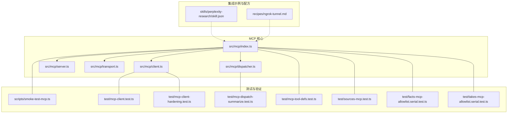
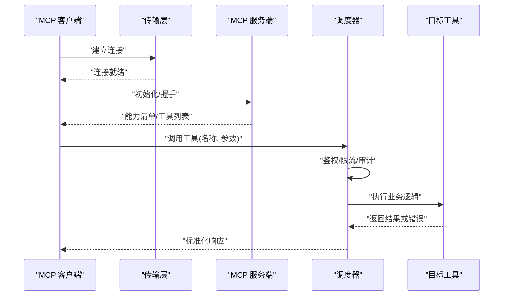
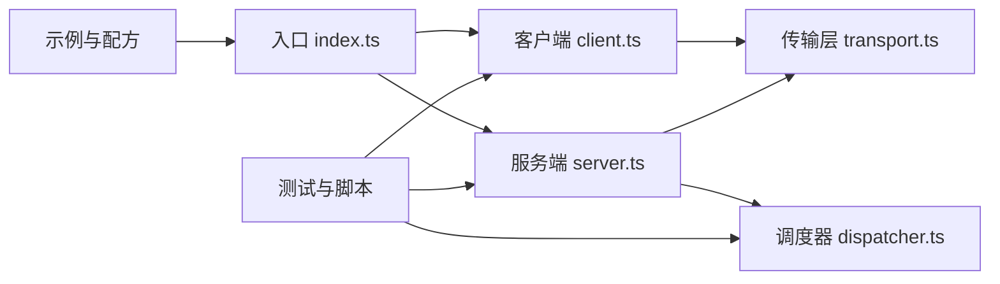

# 集成示例与实践

<cite>
**本文引用的文件**   
- [README.md](file://README.md)
- [gbrain.yml](file://gbrain.yml)
- [src/mcp/index.ts](file://src/mcp/index.ts)
- [src/mcp/client.ts](file://src/mcp/client.ts)
- [src/mcp/server.ts](file://src/mcp/server.ts)
- [src/mcp/transport.ts](file://src/mcp/transport.ts)
- [src/mcp/dispatcher.ts](file://src/mcp/dispatcher.ts)
- [scripts/smoke-test-mcp.ts](file://scripts/smoke-test-mcp.ts)
- [test/mcp-client.test.ts](file://test/mcp-client.test.ts)
- [test/mcp-client-hardening.test.ts](file://test/mcp-client-hardening.test.ts)
- [test/mcp-dispatch-summarize.test.ts](file://test/mcp-dispatch-summarize.test.ts)
- [test/mcp-tool-defs.test.ts](file://test/mcp-tool-defs.test.ts)
- [test/sources-mcp.test.ts](file://test/sources-mcp.test.ts)
- [test/facts-mcp-allowlist.serial.test.ts](file://test/facts-mcp-allowlist.serial.test.ts)
- [test/takes-mcp-allowlist.serial.test.ts](file://test/takes-mcp-allowlist.serial.test.ts)
- [skills/perplexity-research/skill.json](file://skills/perplexity-research/skill.json)
- [recipes/ngrok-tunnel.md](file://recipes/ngrok-tunnel.md)
</cite>

## 目录
1. [简介](#简介)
2. [项目结构](#项目结构)
3. [核心组件](#核心组件)
4. [架构总览](#架构总览)
5. [详细组件分析](#详细组件分析)
6. [依赖关系分析](#依赖关系分析)
7. [性能考虑](#性能考虑)
8. [故障排查指南](#故障排查指南)
9. [结论](#结论)
10. [附录](#附录)

## 简介
本实践指南聚焦于在项目中集成 Model Context Protocol（MCP）的端到端落地方案，覆盖主流 AI 平台（ChatGPT、Claude Desktop、CodeX、Perplexity）的典型集成模式。文档从系统架构、数据流、配置与部署、常见集成模式、第三方适配开发到故障排查与性能优化，提供可操作的步骤与参考路径，帮助读者快速完成 MCP 客户端与服务端的对接，并在生产环境中稳定运行。

## 项目结构
仓库围绕 MCP 能力提供了客户端、服务端、传输层与调度器四个核心模块，并配套了冒烟测试与多组单元测试，确保协议兼容性与健壮性。同时，仓库中包含若干与外部平台集成的技能包与配方，可作为 MCP 集成的参考实现。

图表来源
- [src/mcp/index.ts](file://src/mcp/index.ts)
- [src/mcp/client.ts](file://src/mcp/client.ts)
- [src/mcp/server.ts](file://src/mcp/server.ts)
- [src/mcp/transport.ts](file://src/mcp/transport.ts)
- [src/mcp/dispatcher.ts](file://src/mcp/dispatcher.ts)
- [scripts/smoke-test-mcp.ts](file://scripts/smoke-test-mcp.ts)
- [test/mcp-client.test.ts](file://test/mcp-client.test.ts)
- [test/mcp-client-hardening.test.ts](file://test/mcp-client-hardening.test.ts)
- [test/mcp-dispatch-summarize.test.ts](file://test/mcp-dispatch-summarize.test.ts)
- [test/mcp-tool-defs.test.ts](file://test/mcp-tool-defs.test.ts)
- [test/sources-mcp.test.ts](file://test/sources-mcp.test.ts)
- [test/facts-mcp-allowlist.serial.test.ts](file://test/facts-mcp-allowlist.serial.test.ts)
- [test/takes-mcp-allowlist.serial.test.ts](file://test/takes-mcp-allowlist.serial.test.ts)
- [skills/perplexity-research/skill.json](file://skills/perplexity-research/skill.json)
- [recipes/ngrok-tunnel.md](file://recipes/ngrok-tunnel.md)

章节来源
- [README.md](file://README.md)
- [gbrain.yml](file://gbrain.yml)

## 核心组件
- MCP 客户端：负责建立连接、发送请求、处理响应与错误，支持多种传输方式（如 stdio、HTTP）。
- MCP 服务端：暴露工具与方法，接收并执行来自客户端的请求，返回结构化结果。
- 传输层：抽象底层通信细节，屏蔽不同协议差异，统一消息编解码。
- 调度器：对工具调用进行路由、鉴权、限流与审计，保障安全与稳定性。

章节来源
- [src/mcp/client.ts](file://src/mcp/client.ts)
- [src/mcp/server.ts](file://src/mcp/server.ts)
- [src/mcp/transport.ts](file://src/mcp/transport.ts)
- [src/mcp/dispatcher.ts](file://src/mcp/dispatcher.ts)

## 架构总览
下图展示了 MCP 客户端与服务端之间的典型交互流程，包括握手、工具发现、参数校验、权限检查、执行与结果回传。

图表来源
- [src/mcp/client.ts](file://src/mcp/client.ts)
- [src/mcp/server.ts](file://src/mcp/server.ts)
- [src/mcp/transport.ts](file://src/mcp/transport.ts)
- [src/mcp/dispatcher.ts](file://src/mcp/dispatcher.ts)

## 详细组件分析

### MCP 客户端
- 职责：管理生命周期（启动、连接、重连）、发送请求、解析响应、错误分类与重试策略。
- 关键特性：
  - 传输无关：通过传输层抽象，支持 stdio、HTTP 等。
  - 幂等与超时：为长耗时操作设置超时与取消语义。
  - 容错：网络抖动、服务重启场景下的自动恢复。
- 建议用法：
  - 在应用启动时初始化客户端，复用连接对象。
  - 将业务异常映射为统一的错误类型，便于上层处理。

章节来源
- [src/mcp/client.ts](file://src/mcp/client.ts)
- [test/mcp-client.test.ts](file://test/mcp-client.test.ts)
- [test/mcp-client-hardening.test.ts](file://test/mcp-client-hardening.test.ts)

### MCP 服务端
- 职责：注册工具、处理请求、返回结构化结果、记录审计日志。
- 关键特性：
  - 工具注册表：集中管理可用工具及其元信息。
  - 输入校验：对参数进行严格校验，避免非法输入导致崩溃。
  - 输出规范：遵循 MCP 响应格式，保证客户端一致性。
- 扩展点：
  - 中间件机制用于鉴权、限流、埋点。
  - 插件式工具加载，便于动态扩展。

章节来源
- [src/mcp/server.ts](file://src/mcp/server.ts)
- [test/mcp-tool-defs.test.ts](file://test/mcp-tool-defs.test.ts)

### 传输层
- 职责：封装底层通信细节，统一消息序列化/反序列化。
- 关键特性：
  - 多协议支持：stdio、HTTP 等。
  - 背压与缓冲：防止突发流量导致内存暴涨。
  - 断线重连：在网络不稳定环境下保持可用性。

章节来源
- [src/mcp/transport.ts](file://src/mcp/transport.ts)

### 调度器
- 职责：工具路由、权限控制、速率限制、审计追踪。
- 关键特性：
  - 白名单/黑名单：基于上下文决定是否允许调用。
  - 并发控制：保护后端资源不被过载。
  - 审计日志：记录调用链路与敏感字段脱敏。

章节来源
- [src/mcp/dispatcher.ts](file://src/mcp/dispatcher.ts)
- [test/mcp-dispatch-summarize.test.ts](file://test/mcp-dispatch-summarize.test.ts)

### 冒烟测试与单测
- 冒烟脚本：验证 MCP 基本链路连通性与关键路径。
- 单测覆盖：
  - 客户端行为与硬增强（hardening）。
  - 工具定义与分发逻辑。
  - 源与事实的 MCP 白名单策略。

章节来源
- [scripts/smoke-test-mcp.ts](file://scripts/smoke-test-mcp.ts)
- [test/mcp-client.test.ts](file://test/mcp-client.test.ts)
- [test/mcp-client-hardening.test.ts](file://test/mcp-client-hardening.test.ts)
- [test/mcp-dispatch-summarize.test.ts](file://test/mcp-dispatch-summarize.test.ts)
- [test/mcp-tool-defs.test.ts](file://test/mcp-tool-defs.test.ts)
- [test/sources-mcp.test.ts](file://test/sources-mcp.test.ts)
- [test/facts-mcp-allowlist.serial.test.ts](file://test/facts-mcp-allowlist.serial.test.ts)
- [test/takes-mcp-allowlist.serial.test.ts](file://test/takes-mcp-allowlist.serial.test.ts)

### 集成示例与配方
- Perplexity Research 技能包：展示如何通过 MCP 调用研究类工具，获取检索与摘要能力。
- ngrok 隧道配方：演示如何在本地调试时将 MCP 服务暴露到公网，便于远程客户端接入。

章节来源
- [skills/perplexity-research/skill.json](file://skills/perplexity-research/skill.json)
- [recipes/ngrok-tunnel.md](file://recipes/ngrok-tunnel.md)

## 依赖关系分析
MCP 核心模块之间耦合清晰，职责边界明确；测试与示例位于外围，不反向依赖核心实现细节，有利于独立演进与替换。

图表来源
- [src/mcp/index.ts](file://src/mcp/index.ts)
- [src/mcp/client.ts](file://src/mcp/client.ts)
- [src/mcp/server.ts](file://src/mcp/server.ts)
- [src/mcp/transport.ts](file://src/mcp/transport.ts)
- [src/mcp/dispatcher.ts](file://src/mcp/dispatcher.ts)
- [scripts/smoke-test-mcp.ts](file://scripts/smoke-test-mcp.ts)
- [skills/perplexity-research/skill.json](file://skills/perplexity-research/skill.json)

## 性能考虑
- 连接复用：避免频繁创建/销毁连接，降低握手开销。
- 批处理与合并：对短小高频的工具调用进行聚合，减少往返次数。
- 超时与取消：为长任务设置合理超时，及时释放资源。
- 背压与限流：在服务端对高并发场景做削峰填谷，保护下游资源。
- 缓存热点：对只读且稳定的结果进行短期缓存，提升吞吐。

[本节为通用指导，无需特定文件引用]

## 故障排查指南
- 连接问题：
  - 检查传输层配置（端口、地址、认证信息）。
  - 确认防火墙与安全组放行规则。
- 鉴权失败：
  - 核对令牌有效期与作用域。
  - 查看调度器的白名单/黑名单策略。
- 超时与重试：
  - 调整客户端超时阈值与重试退避策略。
  - 观察服务端负载与队列积压情况。
- 审计与日志：
  - 启用详细日志，定位具体调用链。
  - 对敏感字段进行脱敏，避免泄露。

章节来源
- [test/mcp-client-hardening.test.ts](file://test/mcp-client-hardening.test.ts)
- [test/mcp-dispatch-summarize.test.ts](file://test/mcp-dispatch-summarize.test.ts)
- [test/facts-mcp-allowlist.serial.test.ts](file://test/facts-mcp-allowlist.serial.test.ts)
- [test/takes-mcp-allowlist.serial.test.ts](file://test/takes-mcp-allowlist.serial.test.ts)

## 结论
通过清晰的模块化设计与完善的测试覆盖，本项目为 MCP 协议的集成提供了坚实的基础。结合示例与配方，开发者可以快速完成 ChatGPT、Claude Desktop、CodeX、Perplexity 等平台的接入，并在生产环境获得良好的稳定性与性能表现。建议在上线前充分进行冒烟与压力测试，完善监控与告警，持续优化超时、限流与缓存策略。

[本节为总结性内容，无需特定文件引用]

## 附录

### 配置要点与部署建议
- 环境变量与配置文件：
  - 使用集中配置管理密钥、端点与功能开关。
  - 区分开发与生产环境的差异化配置。
- 容器化与编排：
  - 将 MCP 服务端打包为镜像，配合编排平台进行扩缩容。
  - 使用健康检查与探针确保服务可用性。
- 安全加固：
  - 最小权限原则，仅开放必要接口。
  - 启用 TLS 与双向认证，必要时引入网关进行统一鉴权。

章节来源
- [gbrain.yml](file://gbrain.yml)
- [recipes/ngrok-tunnel.md](file://recipes/ngrok-tunnel.md)

### 第三方平台适配开发指南
- 适配器设计：
  - 定义统一的工具契约，屏蔽平台差异。
  - 通过配置驱动选择具体实现。
- 认证与授权：
  - 支持 OAuth、API Key 等多种认证方式。
  - 实现令牌刷新与失效处理。
- 错误映射与降级：
  - 将平台错误码映射为内部错误模型。
  - 在不可用场景下提供降级策略（如缓存或默认值）。
- 测试与回归：
  - 编写平台特定的用例，覆盖关键路径与异常分支。
  - 定期回归以确保兼容性。

章节来源
- [skills/perplexity-research/skill.json](file://skills/perplexity-research/skill.json)
- [test/mcp-tool-defs.test.ts](file://test/mcp-tool-defs.test.ts)