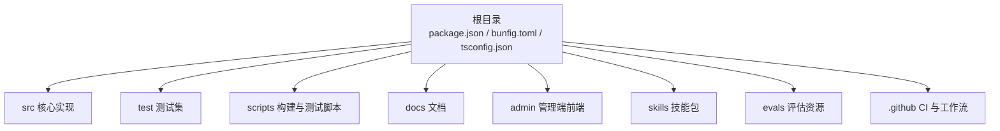
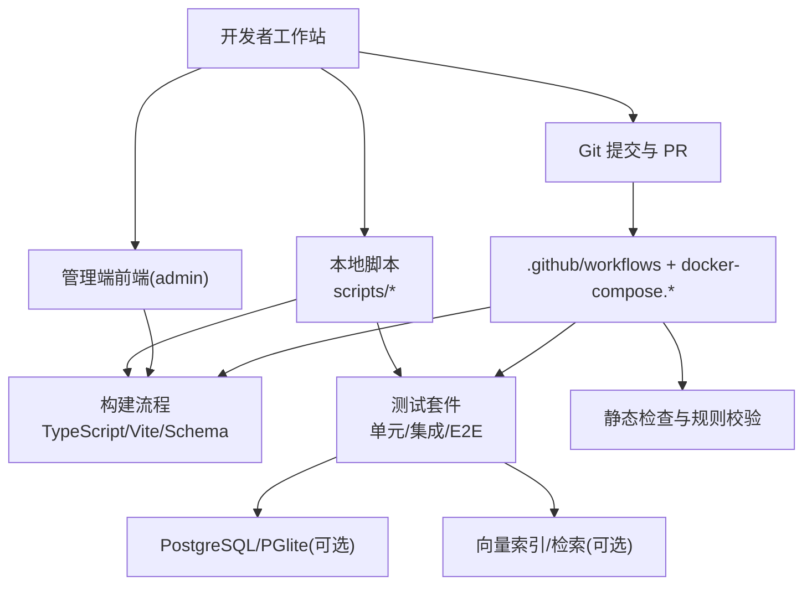
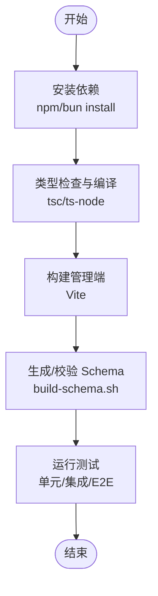
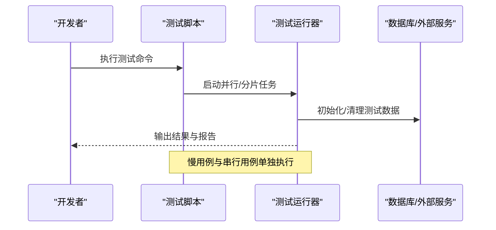
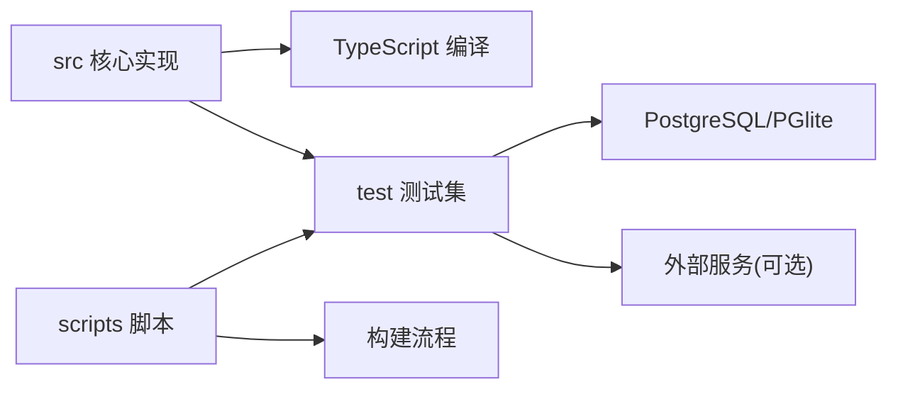

# 开发指南

<cite>
**本文引用的文件**   
- [README.md](file://README.md)
- [CONTRIBUTING.md](file://CONTRIBUTING.md)
- [INSTALL.md](file://docs/INSTALL.md)
- [TESTING.md](file://docs/TESTING.md)
- [RELEASING.md](file://docs/RELEASING.md)
- [package.json](file://package.json)
- [bunfig.toml](file://bunfig.toml)
- [tsconfig.json](file://tsconfig.json)
- [docker-compose.ci.yml](file://docker-compose.ci.yml)
- [docker-compose.test.yml](file://docker-compose.test.yml)
- [scripts/run-unit-parallel.sh](file://scripts/run-unit-parallel.sh)
- [scripts/run-e2e.sh](file://scripts/run-e2e.sh)
- [scripts/profile-tests.sh](file://scripts/profile-tests.sh)
- [scripts/ci-local.sh](file://scripts/ci-local.sh)
- [scripts/smoke-test.sh](file://scripts/smoke-test.sh)
- [scripts/test-shard.sh](file://scripts/test-shard.sh)
- [scripts/run-heavy.sh](file://scripts/run-heavy.sh)
- [scripts/run-slow-tests.sh](file://scripts/run-slow-tests.sh)
- [scripts/run-serial-tests.sh](file://scripts/run-serial-tests.sh)
- [scripts/run-verify-parallel.sh](file://scripts/run-verify-parallel.sh)
- [scripts/select-e2e.ts](file://scripts/select-e2e.ts)
- [scripts/e2e-test-map.ts](file://scripts/e2e-test-map.ts)
- [scripts/build-schema.sh](file://scripts/build-schema.sh)
- [scripts/check-trailing-newline.sh](file://scripts/check-trailing-newline.sh)
- [scripts/check-jsonb-params.mjs](file://scripts/check-jsonb-params.mjs)
- [scripts/check-no-double-retry.sh](file://scripts/check-no-double-retry.sh)
- [scripts/check-worker-lock-renewal-shape.sh](file://scripts/check-worker-lock-renewal-shape.sh)
- [scripts/check-worker-pool-atomicity.sh](file://scripts/check-worker-pool-atomicity.sh)
- [scripts/check-image-decoders-embedded.sh](file://scripts/check-image-decoders-embedded.sh)
- [scripts/check-admin-build.sh](file://scripts/check-admin-build.sh)
- [scripts/check-admin-embedded.sh](file://scripts/check-admin-embedded.sh)
- [scripts/check-admin-scope-drift.sh](file://scripts/check-admin-scope-drift.sh)
- [scripts/check-batch-audit-site.sh](file://scripts/check-batch-audit-site.sh)
- [scripts/check-cli-executable.sh](file://scripts/check-cli-executable.sh)
- [scripts/check-eval-glossary-fresh.sh](file://scripts/check-eval-glossary-fresh.sh)
- [scripts/check-exports-count.sh](file://scripts/check-exports-count.sh)
- [scripts/check-fixture-privacy.sh](file://scripts/check-fixture-privacy.sh)
- [scripts/check-fuzz-purity.sh](file://scripts/check-fuzz-purity.sh)
- [scripts/check-gateway-routed-no-direct-anthropic.sh](file://scripts/check-gateway-routed-no-direct-anthropic.sh)
- [scripts/check-key-files-current-state.sh](file://scripts/check-key-files-current-state.sh)
- [scripts/check-no-legacy-getconnection.sh](file://scripts/check-no-legacy-getconnection.sh)
- [scripts/check-no-pii-in-agent-voice.sh](file://scripts/check-no-pii-in-agent-voice.sh)
- [scripts/check-operations-filter-bypass.sh](file://scripts/check-operations-filter-bypass.sh)
- [scripts/check-pagetype-exhaustive.sh](file://scripts/check-pagetype-exhaustive.sh)
- [scripts/check-pg-url-redaction.sh](file://scripts/check-pg-url-redaction.sh)
- [scripts/check-privacy.sh](file://scripts/check-privacy.sh)
- [scripts/check-progress-to-stdout.sh](file://scripts/check-progress-to-stdout.sh)
- [scripts/check-proposal-pii.sh](file://scripts/check-proposal-pii.sh)
- [scripts/check-skill-brain-first.sh](file://scripts/check-skill-brain-first.sh)
- [scripts/check-source-config-leak.sh](file://scripts/check-source-config-leak.sh)
- [scripts/check-source-id-projection.sh](file://scripts/check-source-id-projection.sh)
- [scripts/check-source-scope-onboard.sh](file://scripts/check-source-scope-onboard.sh)
- [scripts/check-synthetic-corpus-privacy.sh](file://scripts/check-synthetic-corpus-privacy.sh)
- [scripts/check-system-of-record.sh](file://scripts/check-system-of-record.sh)
- [scripts/check-test-isolation.allowlist](file://scripts/check-test-isolation.allowlist)
- [scripts/check-test-isolation.sh](file://scripts/check-test-isolation.sh)
- [scripts/check-test-real-names.sh](file://scripts/check-test-real-names.sh)
- [scripts/check-wasm-embedded.sh](file://scripts/check-wasm-embedded.sh)
- [scripts/ci-cache-hash.sh](file://scripts/ci-cache-hash.sh)
- [scripts/chunker-smoketest.ts](file://scripts/chunker-smoketest.ts)
- [scripts/e5-lease-cap-ab.ts](file://scripts/e5-lease-cap-ab.ts)
- [scripts/fix-v0.11.0.sh](file://scripts/fix-v0.11.0.sh)
- [scripts/generate-gbrain-base.ts](file://scripts/generate-gbrain-base.ts)
- [scripts/generate-metric-glossary.ts](file://scripts/generate-metric-glossary.ts)
- [scripts/image-decoders-smoketest.ts](file://scripts/image-decoders-smoketest.ts)
- [scripts/import-from-upstream.sh](file://scripts/import-from-upstream.sh)
- [scripts/live-brain-first-check.ts](file://scripts/live-brain-first-check.ts)
- [scripts/llms-config.ts](file://scripts/llms-config.ts)
- [scripts/mine-shard-weights.ts](file://scripts/mine-shard-weights.ts)
- [scripts/profiling-tests.sh](file://scripts/profile-tests.sh)
- [scripts/sharding.ts](file://scripts/sharding.ts)
- [scripts/ship-remote-tests.sh](file://scripts/ship-remote-tests.sh)
- [scripts/skillify-check.ts](file://scripts/skillify-check.ts)
- [scripts/smoke-test-mcp.ts](file://scripts/smoke-test-mcp.ts)
- [scripts/spike-bun-vm-timeout.ts](file://scripts/spike-bun-vm-timeout.ts)
- [scripts/test-weights.json](file://scripts/test-weights.json)
- [scripts/upstream-scrub-table.txt](file://scripts/upstream-scrub-table.txt)
</cite>

## 目录
1. [简介](#简介)
2. [项目结构](#项目结构)
3. [核心组件](#核心组件)
4. [架构总览](#架构总览)
5. [详细组件分析](#详细组件分析)
6. [依赖分析](#依赖分析)
7. [性能考虑](#性能考虑)
8. [故障排查指南](#故障排查指南)
9. [结论](#结论)
10. [附录](#附录)

## 简介
本指南面向贡献者与本地开发者，覆盖从环境搭建、代码规范、测试策略到调试与发布的全流程。目标是帮助你在最短时间完成可运行的本地开发环境，并遵循统一的协作与质量保障流程。

## 项目结构
仓库采用多包与多职责分层组织：
- 根级配置与脚本：构建、测试、CI、检查等脚本集中于 scripts 目录；运行时与类型配置位于根 tsconfig.json、bunfig.toml、package.json。
- 文档：docs 下包含安装、测试、发布、架构与设计说明。
- 源码：src 为核心实现；test 为测试集；admin 为管理端前端；skills 为技能包集合；evals 为评估相关资源；examples 与 recipes 提供示例与配方。
- CI 与模板：.github 下包含工作流与 PR/Issue 模板。

图表来源
- [package.json:1-200](file://package.json#L1-L200)
- [bunfig.toml:1-200](file://bunfig.toml#L1-L200)
- [tsconfig.json:1-200](file://tsconfig.json#L1-L200)

章节来源
- [README.md:1-200](file://README.md#L1-L200)
- [CONTRIBUTING.md:1-200](file://CONTRIBUTING.md#L1-L200)
- [docs/INSTALL.md:1-200](file://docs/INSTALL.md#L1-L200)
- [docs/TESTING.md:1-200](file://docs/TESTING.md#L1-L200)
- [docs/RELEASING.md:1-200](file://docs/RELEASING.md#L1-L200)

## 核心组件
- 运行环境与工具链
  - Node/Bun 版本要求与包管理器由 package.json 与 bunfig.toml 定义。
  - TypeScript 编译与路径映射由 tsconfig.json 控制。
- 构建与打包
  - 管理端前端使用 Vite + TypeScript，构建产物嵌入后端（见 admin 与相关脚本）。
  - 数据库 Schema 生成与校验通过 build-schema.sh 等脚本驱动。
- 测试体系
  - 单元测试、集成测试、端到端测试分别由不同脚本与配置文件组织，支持并行、分片与慢用例隔离。
- 持续集成
  - docker-compose.ci.yml 与 docker-compose.test.yml 提供 CI 与测试环境编排。
  - .github/workflows 中定义自动化流水线（PR 检查、构建、测试、发布等）。

章节来源
- [package.json:1-200](file://package.json#L1-L200)
- [bunfig.toml:1-200](file://bunfig.toml#L1-L200)
- [tsconfig.json:1-200](file://tsconfig.json#L1-L200)
- [admin/package.json:1-200](file://admin/package.json#L1-L200)
- [admin/vite.config.ts:1-200](file://admin/vite.config.ts#L1-L200)
- [scripts/build-schema.sh:1-200](file://scripts/build-schema.sh#L1-L200)
- [docker-compose.ci.yml:1-200](file://docker-compose.ci.yml#L1-L200)
- [docker-compose.test.yml:1-200](file://docker-compose.test.yml#L1-L200)

## 架构总览
下图展示了本地开发与 CI 的关键交互：开发者在本地执行脚本进行构建与测试，CI 基于 Docker Compose 拉起依赖服务并运行全量检查与测试。

图表来源
- [scripts/run-unit-parallel.sh:1-200](file://scripts/run-unit-parallel.sh#L1-L200)
- [scripts/run-e2e.sh:1-200](file://scripts/run-e2e.sh#L1-L200)
- [scripts/build-schema.sh:1-200](file://scripts/build-schema.sh#L1-L200)
- [docker-compose.ci.yml:1-200](file://docker-compose.ci.yml#L1-L200)
- [docker-compose.test.yml:1-200](file://docker-compose.test.yml#L1-L200)

## 详细组件分析

### 开发环境搭建
- 前置条件
  - 操作系统：macOS/Linux/Windows（WSL2）
  - 运行时：Node.js 或 Bun（以 package.json 指定为准）
  - 数据库：PostgreSQL（本地或容器），部分测试支持 PGlite
  - 可选：向量检索/嵌入服务（根据功能开关与环境变量）
- 克隆与初始化
  - 克隆仓库后，安装依赖并初始化本地配置（参考 INSTALL.md 与 README 的“快速开始”）。
- 环境变量
  - 常见变量包括数据库连接串、第三方 API Key、功能开关等，详见各模块文档与脚本注释。
- 启动与验证
  - 使用提供的脚本启动本地服务与最小化测试，确保关键路径可用。

章节来源
- [docs/INSTALL.md:1-200](file://docs/INSTALL.md#L1-L200)
- [README.md:1-200](file://README.md#L1-L200)
- [package.json:1-200](file://package.json#L1-L200)
- [bunfig.toml:1-200](file://bunfig.toml#L1-L200)

### 依赖管理与构建流程
- 包管理
  - 使用 package.json 声明依赖与脚本命令；bunfig.toml 用于 Bun 行为配置。
- TypeScript 编译
  - tsconfig.json 定义目标平台、模块解析、路径别名与输出目录。
- 前端构建
  - admin 使用 Vite 构建，可通过 scripts 中的检查脚本验证构建产物一致性。
- 数据库 Schema
  - 通过 build-schema.sh 生成/校验 schema，确保迁移与代码一致。

图表来源
- [package.json:1-200](file://package.json#L1-L200)
- [tsconfig.json:1-200](file://tsconfig.json#L1-L200)
- [admin/package.json:1-200](file://admin/package.json#L1-L200)
- [admin/vite.config.ts:1-200](file://admin/vite.config.ts#L1-L200)
- [scripts/build-schema.sh:1-200](file://scripts/build-schema.sh#L1-L200)

章节来源
- [package.json:1-200](file://package.json#L1-L200)
- [bunfig.toml:1-200](file://bunfig.toml#L1-L200)
- [tsconfig.json:1-200](file://tsconfig.json#L1-L200)
- [admin/package.json:1-200](file://admin/package.json#L1-L200)
- [admin/vite.config.ts:1-200](file://admin/vite.config.ts#L1-L200)
- [scripts/build-schema.sh:1-200](file://scripts/build-schema.sh#L1-L200)

### 代码风格与贡献规范
- 代码风格
  - 统一使用 TypeScript，遵循仓库现有格式化与导入顺序约定（参见根配置与脚本中的检查项）。
  - 禁止遗留模式与潜在风险用法（如双重重试、敏感信息泄露等），由脚本自动检查。
- 提交约定
  - 建议采用语义化提交信息，便于自动生成变更日志与版本。
- Pull Request 流程
  - 遵循 .github/PULL_REQUEST_TEMPLATE.md 的要求，填写变更背景、影响范围、测试覆盖与回滚方案。
  - 确保本地通过全部检查后再发起 PR，减少 CI 失败次数。

章节来源
- [CONTRIBUTING.md:1-200](file://CONTRIBUTING.md#L1-L200)
- [.github/PULL_REQUEST_TEMPLATE.md:1-200](file://.github/PULL_REQUEST_TEMPLATE.md#L1-L200)
- [scripts/check-no-double-retry.sh:1-200](file://scripts/check-no-double-retry.sh#L1-L200)
- [scripts/check-privacy.sh:1-200](file://scripts/check-privacy.sh#L1-L200)
- [scripts/check-trailing-newline.sh:1-200](file://scripts/check-trailing-newline.sh#L1-L200)

### 测试策略与执行方法
- 测试分层
  - 单元测试：聚焦函数/模块逻辑，快速反馈。
  - 集成测试：涉及数据库、外部服务或进程间通信。
  - 端到端测试：模拟真实用户场景，覆盖关键业务链路。
- 执行方式
  - 并行与分片：run-unit-parallel.sh、test-shard.sh 提升吞吐。
  - 慢用例隔离：run-slow-tests.sh、run-heavy.sh 避免阻塞主流程。
  - 串行用例：run-serial-tests.sh 保证状态一致性。
  - E2E 选择：select-e2e.ts 与 e2e-test-map.ts 支持按标签/权重筛选。
- 数据与依赖
  - 使用 docker-compose.test.yml 拉起必要服务（如 PostgreSQL）。
  - 部分测试支持 PGlite 以减少外部依赖。
- 覆盖率与稳定性
  - 结合 profile-tests.sh 定位热点与瓶颈；对不稳定用例加入 allowlist 并逐步修复。

图表来源
- [scripts/run-unit-parallel.sh:1-200](file://scripts/run-unit-parallel.sh#L1-L200)
- [scripts/test-shard.sh:1-200](file://scripts/test-shard.sh#L1-L200)
- [scripts/run-slow-tests.sh:1-200](file://scripts/run-slow-tests.sh#L1-L200)
- [scripts/run-heavy.sh:1-200](file://scripts/run-heavy.sh#L1-L200)
- [scripts/run-serial-tests.sh:1-200](file://scripts/run-serial-tests.sh#L1-L200)
- [scripts/select-e2e.ts:1-200](file://scripts/select-e2e.ts#L1-L200)
- [scripts/e2e-test-map.ts:1-200](file://scripts/e2e-test-map.ts#L1-L200)
- [docker-compose.test.yml:1-200](file://docker-compose.test.yml#L1-L200)

章节来源
- [docs/TESTING.md:1-200](file://docs/TESTING.md#L1-L200)
- [scripts/run-unit-parallel.sh:1-200](file://scripts/run-unit-parallel.sh#L1-L200)
- [scripts/run-e2e.sh:1-200](file://scripts/run-e2e.sh#L1-L200)
- [scripts/profile-tests.sh:1-200](file://scripts/profile-tests.sh#L1-L200)
- [scripts/ci-local.sh:1-200](file://scripts/ci-local.sh#L1-L200)
- [scripts/smoke-test.sh:1-200](file://scripts/smoke-test.sh#L1-L200)

### 调试技巧与性能分析
- 断点与日志
  - 使用 IDE 断点调试 TypeScript 源文件；在关键路径添加结构化日志以便追踪。
- 性能剖析
  - 使用 profile-tests.sh 对测试集进行性能剖析，识别热点与瓶颈。
  - 针对慢查询与高延迟操作，结合数据库慢查询日志与指标收集进行分析。
- 内存与并发
  - 关注 worker 池与锁续期相关的检查脚本，确保并发安全与资源释放。
- 网络与外部依赖
  - 使用代理与 Mock 屏蔽不稳定外部服务；对超时与重试策略进行压力测试。

章节来源
- [scripts/profile-tests.sh:1-200](file://scripts/profile-tests.sh#L1-L200)
- [scripts/check-worker-lock-renewal-shape.sh:1-200](file://scripts/check-worker-lock-renewal-shape.sh#L1-L200)
- [scripts/check-worker-pool-atomicity.sh:1-200](file://scripts/check-worker-pool-atomicity.sh#L1-L200)

### 代码审查标准与持续集成
- 审查要点
  - 正确性：边界条件、错误处理、事务与锁。
  - 安全性：敏感信息脱敏、权限校验、输入验证。
  - 可维护性：模块化、命名清晰、注释完整。
  - 性能：复杂度、I/O 与并发模型。
- 自动化检查
  - 静态检查、隐私扫描、导出数量与 JSONB 模式校验等脚本在 PR 阶段执行。
- CI 流水线
  - 基于 docker-compose.ci.yml 拉起依赖，执行构建、测试与检查；失败时阻断合并。

章节来源
- [CONTRIBUTING.md:1-200](file://CONTRIBUTING.md#L1-L200)
- [scripts/check-jsonb-params.mjs:1-200](file://scripts/check-jsonb-params.mjs#L1-L200)
- [scripts/check-exports-count.sh:1-200](file://scripts/check-exports-count.sh#L1-L200)
- [scripts/check-privacy.sh:1-200](file://scripts/check-privacy.sh#L1-L200)
- [docker-compose.ci.yml:1-200](file://docker-compose.ci.yml#L1-L200)

### 新功能开发流程与版本发布管理
- 新功能流程
  - 需求分析与设计评审 → 分支开发 → 单元测试与集成测试 → 端到端验证 → 代码审查 → 合并与发布。
- 版本发布
  - 遵循 RELEASING.md 的流程，包括变更日志生成、版本号递增、制品构建与分发。
  - 发布前执行冒烟测试与回归测试，确保关键路径稳定。

章节来源
- [docs/RELEASING.md:1-200](file://docs/RELEASING.md#L1-L200)
- [scripts/smoke-test.sh:1-200](file://scripts/smoke-test.sh#L1-L200)

## 依赖分析
- 内部依赖
  - src 与 test 之间通过模块接口耦合；scripts 作为编排层调用构建与测试工具。
- 外部依赖
  - 数据库（PostgreSQL）、可选向量检索/嵌入服务、第三方 API（LLM、存储等）。
- 风险与缓解
  - 外部服务不稳定：使用 Mock 与降级策略；增加重试与熔断。
  - 数据库连接泄漏：通过检查脚本与监控告警规避。

图表来源
- [package.json:1-200](file://package.json#L1-L200)
- [tsconfig.json:1-200](file://tsconfig.json#L1-L200)
- [docker-compose.test.yml:1-200](file://docker-compose.test.yml#L1-L200)

章节来源
- [package.json:1-200](file://package.json#L1-L200)
- [tsconfig.json:1-200](file://tsconfig.json#L1-L200)
- [docker-compose.test.yml:1-200](file://docker-compose.test.yml#L1-L200)

## 性能考虑
- 测试性能
  - 合理拆分测试集，使用并行与分片提升吞吐；将慢用例隔离执行。
- 构建性能
  - 利用增量编译与缓存；前端构建使用 Vite 热更新加速迭代。
- 运行时性能
  - 关注数据库查询与索引；优化批量操作与批大小；避免不必要的序列化与反序列化。
- 资源限制
  - 设置合理的超时与重试上限；监控内存与 CPU 使用，防止 OOM。

[本节为通用指导，不直接分析具体文件]

## 故障排查指南
- 常见问题
  - 依赖安装失败：检查 Node/Bun 版本与镜像源；清理缓存后重试。
  - 数据库连接失败：确认 docker-compose.test.yml 服务已启动，端口与凭据正确。
  - 测试不稳定：查看 allowlist 与隔离策略，逐步修复竞态与时序问题。
- 诊断步骤
  - 启用详细日志与剖析；复现最小用例；对比成功与失败分支的差异。
  - 使用 CI 本地脚本（ci-local.sh）在相同环境中复现问题。

章节来源
- [scripts/ci-local.sh:1-200](file://scripts/ci-local.sh#L1-L200)
- [scripts/run-unit-parallel.sh:1-200](file://scripts/run-unit-parallel.sh#L1-L200)
- [scripts/run-serial-tests.sh:1-200](file://scripts/run-serial-tests.sh#L1-L200)
- [scripts/check-test-isolation.sh:1-200](file://scripts/check-test-isolation.sh#L1-L200)

## 结论
通过统一的工具链、严格的检查与完善的测试体系，本项目能够在保持高质量的同时高效迭代。遵循本指南的流程与规范，你将能够快速上手并稳定地贡献代码。

[本节为总结，不直接分析具体文件]

## 附录
- 常用命令速查
  - 安装依赖：参考 package.json 的 scripts 与 README。
  - 构建：TypeScript 编译与前端构建。
  - 测试：单元/集成/E2E 与慢用例、串行用例。
  - 检查：隐私、JSONB 模式、导出数量、尾随换行等。
- 参考文档
  - 安装与升级：docs/INSTALL.md
  - 测试策略：docs/TESTING.md
  - 发布流程：docs/RELEASING.md

章节来源
- [README.md:1-200](file://README.md#L1-L200)
- [docs/INSTALL.md:1-200](file://docs/INSTALL.md#L1-L200)
- [docs/TESTING.md:1-200](file://docs/TESTING.md#L1-L200)
- [docs/RELEASING.md:1-200](file://docs/RELEASING.md#L1-L200)
- [package.json:1-200](file://package.json#L1-L200)