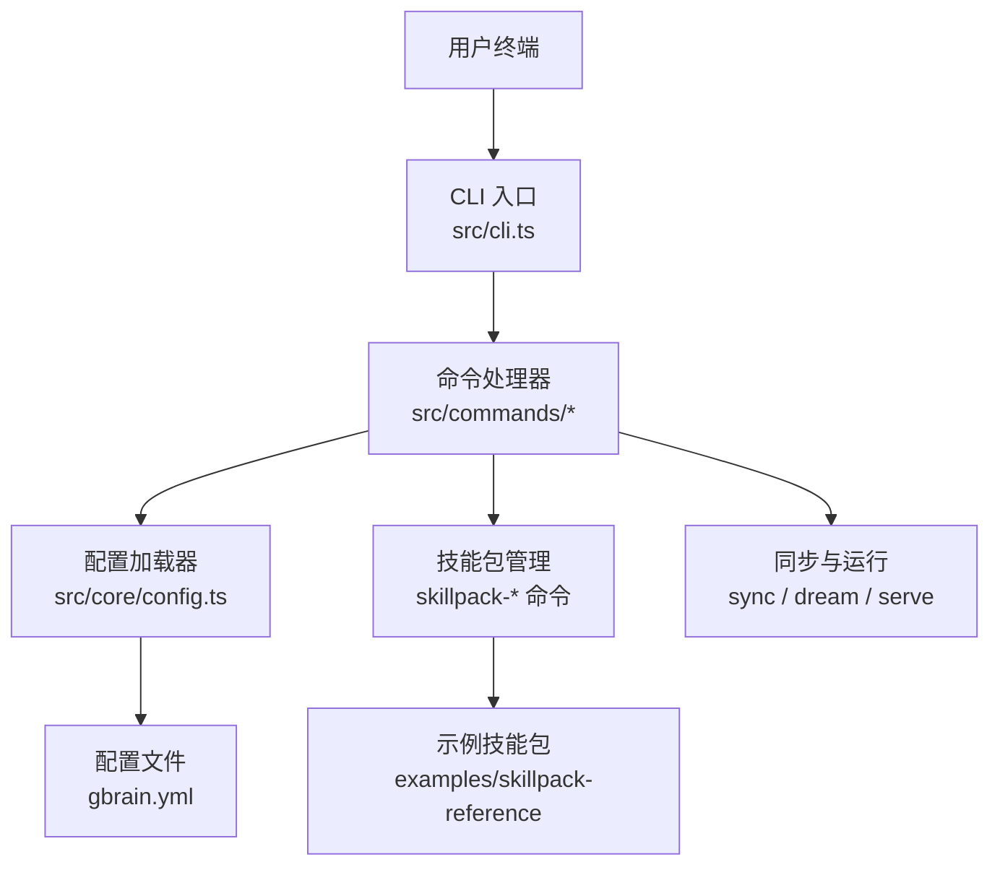
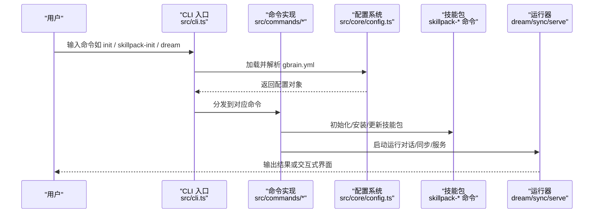
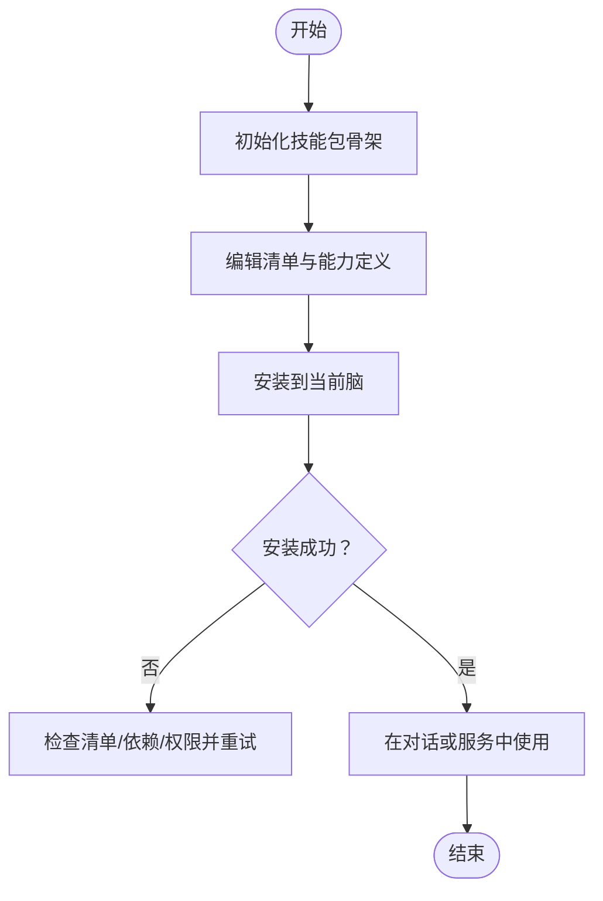
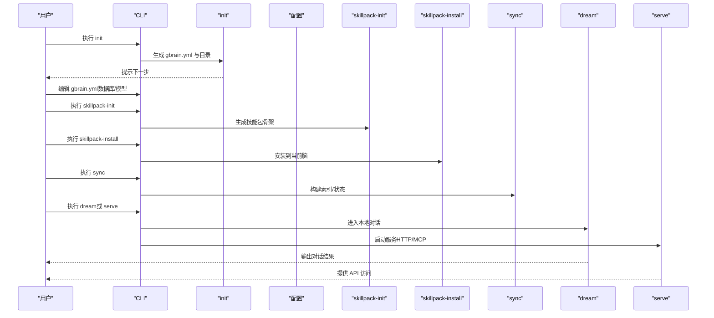
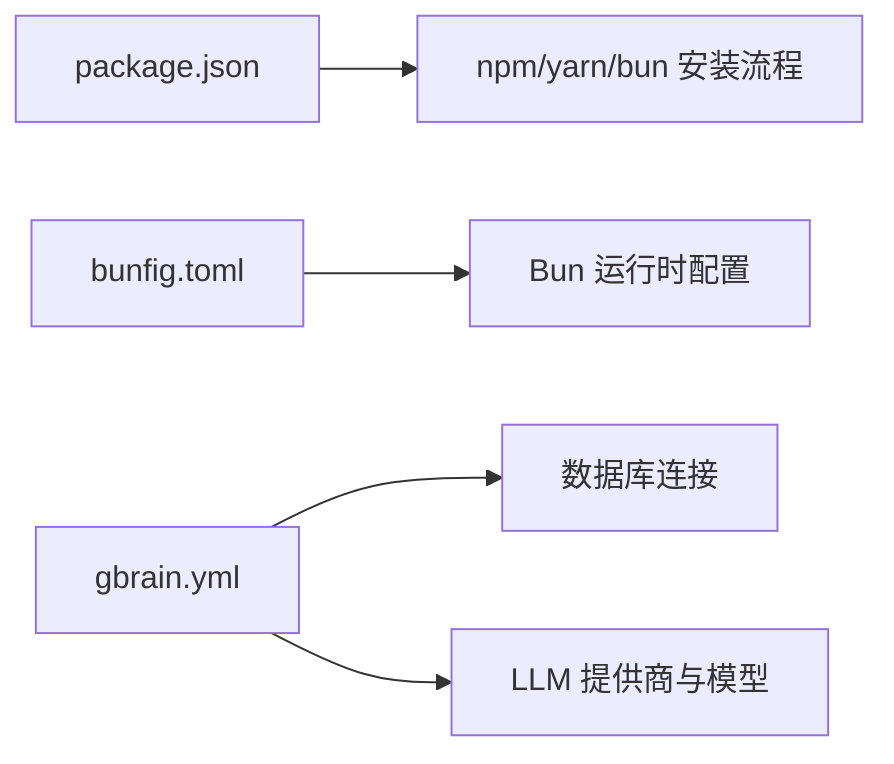

# 快速开始

<cite>
**本文引用的文件**   
- [README.md](file://README.md)
- [INSTALL.md](file://docs/INSTALL.md)
- [gbrain.yml](file://gbrain.yml)
- [package.json](file://package.json)
- [bunfig.toml](file://bunfig.toml)
- [src/cli.ts](file://src/cli.ts)
- [src/core/config.ts](file://src/core/config.ts)
- [src/commands/init.ts](file://src/commands/init.ts)
- [src/commands/skillpack-init.ts](file://src/commands/skillpack-init.ts)
- [src/commands/skillpack-install.ts](file://src/commands/skillpack-install.ts)
- [src/commands/sync.ts](file://src/commands/sync.ts)
- [src/commands/dream.ts](file://src/commands/dream.ts)
- [src/commands/serve.ts](file://src/commands/serve.ts)
- [examples/skillpack-reference/skillpack.json](file://examples/skillpack-reference/skillpack.json)
- [recipes/agent-voice.md](file://recipes/agent-voice.md)
</cite>

## 目录
1. [简介](#简介)
2. [项目结构](#项目结构)
3. [核心组件](#核心组件)
4. [架构总览](#架构总览)
5. [详细组件分析](#详细组件分析)
6. [依赖分析](#依赖分析)
7. [性能考虑](#性能考虑)
8. [故障排除指南](#故障排除指南)
9. [结论](#结论)
10. [附录](#附录)

## 简介
本指南面向首次接触 GBrain 的用户，目标是在最短时间内完成环境准备、安装、初始配置并运行第一个智能体。你将学会：
- 确认 Node.js/Bun 与数据库要求
- 使用 npm/yarn/bun 安装 GBrain
- 初始化 gbrain.yml 并完成基础配置
- 创建第一个技能包（Skillpack）
- 运行一个可交互的智能体工作流
- 常见问题排查与解决

## 项目结构
GBrain 仓库包含 CLI、核心运行时、命令实现、示例与教程等。快速开始主要涉及以下位置：
- 根级配置文件：gbrain.yml
- 入口与命令：src/cli.ts 与各 src/commands/*.ts
- 配置解析：src/core/config.ts
- 示例技能包：examples/skillpack-reference/...
- 官方安装文档：docs/INSTALL.md
- 包元数据与脚本：package.json、bunfig.toml

图表来源
- [src/cli.ts](file://src/cli.ts)
- [src/core/config.ts](file://src/core/config.ts)
- [gbrain.yml](file://gbrain.yml)
- [src/commands/skillpack-init.ts](file://src/commands/skillpack-init.ts)
- [src/commands/sync.ts](file://src/commands/sync.ts)
- [src/commands/dream.ts](file://src/commands/dream.ts)
- [src/commands/serve.ts](file://src/commands/serve.ts)
- [examples/skillpack-reference/skillpack.json](file://examples/skillpack-reference/skillpack.json)

章节来源
- [README.md](file://README.md)
- [docs/INSTALL.md](file://docs/INSTALL.md)
- [package.json](file://package.json)
- [bunfig.toml](file://bunfig.toml)

## 核心组件
- CLI 入口与命令分发：负责解析命令行参数并路由到具体命令实现。
- 配置系统：读取并合并 gbrain.yml 与环境变量，提供默认值与校验。
- 技能包（Skillpack）：封装一组能力（工具、触发器、编排逻辑），通过命令进行初始化、安装与管理。
- 运行与交互：支持本地对话（dream）、后台服务（serve）以及数据同步（sync）。

章节来源
- [src/cli.ts](file://src/cli.ts)
- [src/core/config.ts](file://src/core/config.ts)
- [src/commands/skillpack-init.ts](file://src/commands/skillpack-init.ts)
- [src/commands/sync.ts](file://src/commands/sync.ts)
- [src/commands/dream.ts](file://src/commands/dream.ts)
- [src/commands/serve.ts](file://src/commands/serve.ts)

## 架构总览
下图展示了从用户输入到智能体运行的关键路径：CLI 接收命令，加载配置，调用相应命令模块；技能包被安装后参与执行；最终通过对话或服务接口输出结果。

图表来源
- [src/cli.ts](file://src/cli.ts)
- [src/core/config.ts](file://src/core/config.ts)
- [src/commands/skillpack-init.ts](file://src/commands/skillpack-init.ts)
- [src/commands/sync.ts](file://src/commands/sync.ts)
- [src/commands/dream.ts](file://src/commands/dream.ts)
- [src/commands/serve.ts](file://src/commands/serve.ts)

## 详细组件分析

### 环境与安装
- 运行环境
  - Node.js：建议使用 LTS 版本，参考包元数据中的引擎约束。
  - Bun：可选，若使用 bun 作为包管理器，需确保版本满足要求。
- 数据库
  - 根据配置与命令行为，GBrain 需要持久化存储（例如 Postgres 或嵌入式引擎）。请确保数据库可达且权限正确。
- 安装方式
  - npm：使用包管理器全局或项目内安装 GBrain。
  - yarn：等效于 npm 的安装流程。
  - bun：使用 bun 的添加/安装命令。
- 验证安装
  - 运行帮助命令查看可用子命令与选项。

章节来源
- [docs/INSTALL.md](file://docs/INSTALL.md)
- [package.json](file://package.json)
- [bunfig.toml](file://bunfig.toml)

### 初始配置（gbrain.yml）
- 配置文件位置：项目根目录下的 gbrain.yml。
- 关键配置项
  - 数据库连接：包括连接字符串、驱动类型、迁移策略等。
  - 模型与提供商：选择 LLM 提供商、模型 ID、鉴权凭据等。
  - 日志与调试：控制输出级别与诊断信息。
- 环境变量覆盖：可通过环境变量覆盖部分配置项，便于多环境部署。
- 校验与提示：配置加载时会进行基本校验，缺失必填项会给出明确提示。

章节来源
- [gbrain.yml](file://gbrain.yml)
- [src/core/config.ts](file://src/core/config.ts)

### 创建第一个技能包（Skillpack）
- 初始化
  - 使用初始化命令在指定目录生成最小可用的技能包骨架。
- 结构说明
  - 清单文件：描述技能包名称、版本、依赖与入口。
  - 能力定义：工具、触发器、编排规则等。
- 安装与启用
  - 将本地或远程技能包安装到当前脑（Brain）中。
  - 安装后可在对话与服务中直接使用。

图表来源
- [src/commands/skillpack-init.ts](file://src/commands/skillpack-init.ts)
- [src/commands/skillpack-install.ts](file://src/commands/skillpack-install.ts)
- [examples/skillpack-reference/skillpack.json](file://examples/skillpack-reference/skillpack.json)

章节来源
- [src/commands/skillpack-init.ts](file://src/commands/skillpack-init.ts)
- [src/commands/skillpack-install.ts](file://src/commands/skillpack-install.ts)
- [examples/skillpack-reference/skillpack.json](file://examples/skillpack-reference/skillpack.json)

### 运行第一个智能体（完整示例工作流）
以下步骤构成从零到一的最小闭环：
1. 初始化项目与配置
   - 在项目根目录运行初始化命令，生成 gbrain.yml 与必要目录。
2. 配置数据库与模型
   - 填写数据库连接与模型提供商凭据。
3. 创建并安装技能包
   - 初始化本地技能包，按需编辑能力定义，然后安装到脑。
4. 同步与索引
   - 运行同步命令以构建索引与状态。
5. 交互体验
   - 使用对话命令进行本地交互，或使用服务命令暴露 HTTP/MCP 接口。
6. 扩展与复用
   - 参考示例技能包与食谱，逐步增强能力。

图表来源
- [src/commands/init.ts](file://src/commands/init.ts)
- [src/core/config.ts](file://src/core/config.ts)
- [src/commands/skillpack-init.ts](file://src/commands/skillpack-init.ts)
- [src/commands/skillpack-install.ts](file://src/commands/skillpack-install.ts)
- [src/commands/sync.ts](file://src/commands/sync.ts)
- [src/commands/dream.ts](file://src/commands/dream.ts)
- [src/commands/serve.ts](file://src/commands/serve.ts)

章节来源
- [src/commands/init.ts](file://src/commands/init.ts)
- [src/commands/skillpack-init.ts](file://src/commands/skillpack-init.ts)
- [src/commands/skillpack-install.ts](file://src/commands/skillpack-install.ts)
- [src/commands/sync.ts](file://src/commands/sync.ts)
- [src/commands/dream.ts](file://src/commands/dream.ts)
- [src/commands/serve.ts](file://src/commands/serve.ts)

### 参考示例与食谱
- 示例技能包
  - 位于 examples/skillpack-reference，可作为模板参考结构与清单字段。
- 食谱
  - recipes 目录下提供多种场景化实践，如语音智能体、邮件集成等，适合进阶学习。

章节来源
- [examples/skillpack-reference/skillpack.json](file://examples/skillpack-reference/skillpack.json)
- [recipes/agent-voice.md](file://recipes/agent-voice.md)

## 依赖分析
- 包管理与引擎
  - package.json 定义了依赖与脚本，建议遵循其引擎约束。
  - bunfig.toml 用于 Bun 相关配置（如缓存、打包行为）。
- 外部依赖
  - 数据库驱动：由配置决定（Postgres 或嵌入式引擎）。
  - LLM 提供商 SDK：由模型与提供商配置引入。

图表来源
- [package.json](file://package.json)
- [bunfig.toml](file://bunfig.toml)
- [gbrain.yml](file://gbrain.yml)

章节来源
- [package.json](file://package.json)
- [bunfig.toml](file://bunfig.toml)
- [gbrain.yml](file://gbrain.yml)

## 性能考虑
- 数据库选择
  - 生产环境建议使用高性能关系型数据库（如 Postgres），以获得更好的并发与稳定性。
- 索引与同步
  - 合理设置同步频率与批大小，避免频繁全量重建索引。
- 资源限制
  - 为嵌入与检索任务设置合理的并发与超时，防止内存与 CPU 峰值过高。
- 缓存与预热
  - 对常用查询与上下文进行缓存，减少重复计算与网络开销。

[本节为通用指导，不直接分析具体文件]

## 故障排除指南
- 无法找到命令或未识别的子命令
  - 确认已按所选包管理器正确安装，并在 PATH 中可见。
  - 运行帮助命令查看可用子命令列表。
- 配置错误或缺失
  - 检查 gbrain.yml 必填项是否齐全，数据库连接是否正确。
  - 使用环境变量覆盖敏感配置，避免硬编码。
- 数据库连接失败
  - 验证网络连通性、用户名密码、端口与防火墙策略。
  - 检查迁移是否成功执行，必要时手动回滚或重试。
- 模型提供商鉴权失败
  - 核对密钥与区域设置，确认配额与访问权限。
- 技能包安装失败
  - 检查清单文件格式与依赖声明，确认本地路径或远程源可达。
  - 查看安装日志定位具体错误原因。

章节来源
- [src/core/config.ts](file://src/core/config.ts)
- [src/commands/skillpack-install.ts](file://src/commands/skillpack-install.ts)
- [src/commands/sync.ts](file://src/commands/sync.ts)

## 结论
通过以上步骤，你可以在最短时间内完成 GBrain 的环境搭建、配置与首个智能体的运行。建议后续结合示例技能包与食谱，逐步扩展你的智能体能力，并根据实际业务需求优化配置与性能。

[本节为总结性内容，不直接分析具体文件]

## 附录
- 常用命令速查
  - 初始化项目与配置
  - 初始化与安装技能包
  - 同步与索引
  - 本地对话与服务启动
- 参考文档
  - 安装指南与最佳实践
  - 示例技能包与食谱

章节来源
- [docs/INSTALL.md](file://docs/INSTALL.md)
- [examples/skillpack-reference/skillpack.json](file://examples/skillpack-reference/skillpack.json)
- [recipes/agent-voice.md](file://recipes/agent-voice.md)