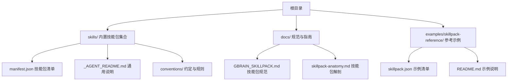
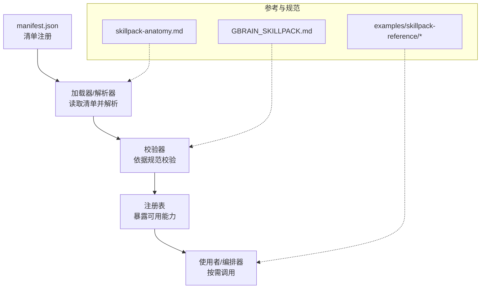
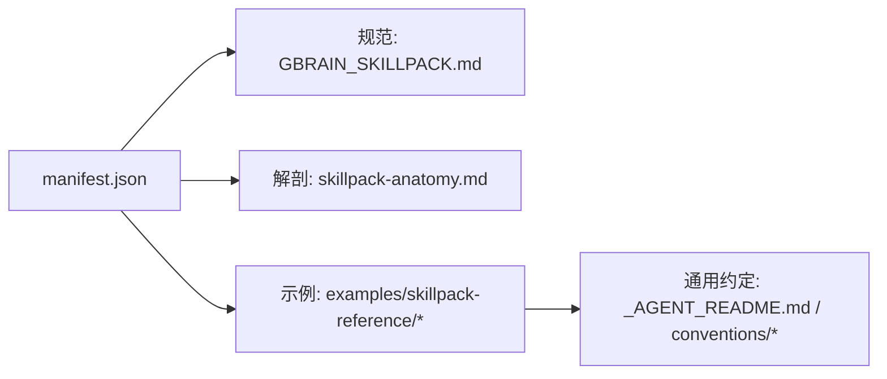

# 内置技能包说明

<cite>
**本文引用的文件**   
- [skills/manifest.json](file://skills/manifest.json)
- [docs/GBRAIN_SKILLPACK.md](file://docs/GBRAIN_SKILLPACK.md)
- [docs/skillpack-anatomy.md](file://docs/skillpack-anatomy.md)
- [examples/skillpack-reference/skillpack.json](file://examples/skillpack-reference/skillpack.json)
- [examples/skillpack-reference/README.md](file://examples/skillpack-reference/README.md)
- [skills/_AGENT_README.md](file://skills/_AGENT_README.md)
- [skills/conventions/README.md](file://skills/conventions/README.md)
</cite>

## 目录
1. [简介](#简介)
2. [项目结构](#项目结构)
3. [核心组件](#核心组件)
4. [架构总览](#架构总览)
5. [详细组件分析](#详细组件分析)
6. [依赖关系分析](#依赖关系分析)
7. [性能与资源特征](#性能与资源特征)
8. [故障排查指南](#故障排查指南)
9. [结论](#结论)
10. [附录](#附录)

## 简介
本文件面向希望理解和使用系统“内置技能包”的读者，提供按功能分类的完整说明。内容涵盖：
- 每个内置技能包的功能特性、使用场景与配置选项
- 参数说明、输入输出格式与使用示例（以路径引用为主）
- 技能包之间的依赖关系与组合使用方法
- 性能特征、资源消耗与适用场景分析
- 常见使用模式与最佳实践建议

为保证准确性，所有实现细节均以仓库内文档与清单为准；代码级实现不在本文展开。

## 项目结构
内置技能包位于 skills 目录，并通过 manifest.json 进行统一注册与管理。参考示例与规范文档可帮助理解技能包的组成与约定。

图表来源
- [skills/manifest.json](file://skills/manifest.json)
- [docs/GBRAIN_SKILLPACK.md](file://docs/GBRAIN_SKILLPACK.md)
- [docs/skillpack-anatomy.md](file://docs/skillpack-anatomy.md)
- [examples/skillpack-reference/skillpack.json](file://examples/skillpack-reference/skillpack.json)
- [examples/skillpack-reference/README.md](file://examples/skillpack-reference/README.md)
- [skills/_AGENT_README.md](file://skills/_AGENT_README.md)
- [skills/conventions/README.md](file://skills/conventions/README.md)

章节来源
- [skills/manifest.json](file://skills/manifest.json)
- [docs/GBRAIN_SKILLPACK.md](file://docs/GBRAIN_SKILLPACK.md)
- [docs/skillpack-anatomy.md](file://docs/skillpack-anatomy.md)
- [examples/skillpack-reference/skillpack.json](file://examples/skillpack-reference/skillpack.json)
- [examples/skillpack-reference/README.md](file://examples/skillpack-reference/README.md)
- [skills/_AGENT_README.md](file://skills/_AGENT_README.md)
- [skills/conventions/README.md](file://skills/conventions/README.md)

## 核心组件
- 技能包清单：通过 manifest.json 集中声明所有内置技能包及其元数据，是系统发现与加载的依据。
- 技能包规范：GBRAIN_SKILLPACK.md 定义了技能包的契约、字段语义与版本策略。
- 技能包解剖：skillpack-anatomy.md 描述了典型技能包的文件组织与职责边界。
- 参考示例：examples/skillpack-reference 提供了最小可用示例，便于快速上手与对照。
- 通用约定：_AGENT_README.md 与 conventions/ 提供跨技能包的通用约定与约束。

章节来源
- [skills/manifest.json](file://skills/manifest.json)
- [docs/GBRAIN_SKILLPACK.md](file://docs/GBRAIN_SKILLPACK.md)
- [docs/skillpack-anatomy.md](file://docs/skillpack-anatomy.md)
- [examples/skillpack-reference/skillpack.json](file://examples/skillpack-reference/skillpack.json)
- [examples/skillpack-reference/README.md](file://examples/skillpack-reference/README.md)
- [skills/_AGENT_README.md](file://skills/_AGENT_README.md)
- [skills/conventions/README.md](file://skills/conventions/README.md)

## 架构总览
下图展示了“清单驱动”的技能包体系：清单作为单一事实源，指导运行时发现、校验与加载各技能包；示例与规范为开发与集成提供参考。

图表来源
- [skills/manifest.json](file://skills/manifest.json)
- [docs/GBRAIN_SKILLPACK.md](file://docs/GBRAIN_SKILLPACK.md)
- [docs/skillpack-anatomy.md](file://docs/skillpack-anatomy.md)
- [examples/skillpack-reference/skillpack.json](file://examples/skillpack-reference/skillpack.json)
- [examples/skillpack-reference/README.md](file://examples/skillpack-reference/README.md)

## 详细组件分析
以下按功能类别对内置技能包进行分组说明。每个技能包包含：功能特性、使用场景、配置项要点、输入输出格式要点、示例位置、依赖关系与注意事项。为避免冗长，本节仅给出结构化摘要与定位指引，具体字段定义请参考清单与规范文档。

### 数据处理类
- 数据采集与抓取
  - 归档爬虫：用于批量抓取与归档网页或站点内容。
  - 媒体采集：面向多媒体内容的采集与预处理。
  - 会议采集：从会议平台或日历事件中提取结构化信息。
  - 语音笔记采集：将语音笔记转写并入库。
  - 想法采集：收集散落的创意与灵感片段。
  - 数据研究：面向公开数据的检索与整理。
- 文本处理与增强
  - 文章增强：补充元数据、提取关键信息。
  - 引用修复：修复缺失或错误的引用链接。
  - 概念综合：对多源信息进行概念化整合。
  - 前端元数据守卫：确保页面元数据一致性。
  - Webhook 转换：适配外部 webhook 到内部模型。
- 知识抽取与建模
  - 学术验证：辅助核验学术信息的可信度。
  - 实体解析：统一实体名称与消歧。
  - 标签与分类：自动打标与归类。
  - 脑图/图谱构建：生成知识关联结构。
- 存储与索引
  - 查询服务：提供结构化与非结构化检索。
  - 报告生成：基于数据生成可读报告。
  - 发布：将成果推送到目标渠道。

章节来源
- [skills/manifest.json](file://skills/manifest.json)
- [docs/GBRAIN_SKILLPACK.md](file://docs/GBRAIN_SKILLPACK.md)
- [docs/skillpack-anatomy.md](file://docs/skillpack-anatomy.md)
- [examples/skillpack-reference/skillpack.json](file://examples/skillpack-reference/skillpack.json)
- [examples/skillpack-reference/README.md](file://examples/skillpack-reference/README.md)

### AI 推理类
- 研究与决策支持
  - 深度研究：结合搜索与推理工具进行专题调研。
  - 顾问助手：提供领域建议与方案评估。
  - 战略阅读：对长文/报告进行结构化解读。
- 质量与评测
  - 交叉模态评审：对图文音视频等多模态内容进行一致性校验。
  - 信号检测：识别异常或高价值信号。
  - 技能优化：对提示词与流程进行迭代优化。
- 意图与路由
  - 功能区解析：根据上下文选择合适子技能。
  - 思维编排：规划多步推理与工具调用序列。

章节来源
- [skills/manifest.json](file://skills/manifest.json)
- [docs/GBRAIN_SKILLPACK.md](file://docs/GBRAIN_SKILLPACK.md)
- [docs/skillpack-anatomy.md](file://docs/skillpack-anatomy.md)
- [examples/skillpack-reference/skillpack.json](file://examples/skillpack-reference/skillpack.json)
- [examples/skillpack-reference/README.md](file://examples/skillpack-reference/README.md)

### 系统管理类
- 安装与初始化
  - 安装引导：完成环境准备与依赖检查。
  - 设置向导：交互式配置常用选项。
  - 冷启动：为新大脑/工作区建立初始状态。
- 运维与升级
  - 大脑运维：健康检查、指标采集与告警。
  - 升级助手：版本差异分析与平滑升级。
  - 迁移工具：数据结构与配置的向后兼容迁移。
  - 定时任务：周期性维护与清理。
- 诊断与审计
  - 灵魂审计：对知识库一致性与完整性进行审计。
  - 重构检查：代码与文档结构的合规性检查。
  - 测试套件：端到端与回归测试执行。
  - 冒烟测试：快速验证核心链路可用性。

章节来源
- [skills/manifest.json](file://skills/manifest.json)
- [docs/GBRAIN_SKILLPACK.md](file://docs/GBRAIN_SKILLPACK.md)
- [docs/skillpack-anatomy.md](file://docs/skillpack-anatomy.md)
- [examples/skillpack-reference/skillpack.json](file://examples/skillpack-reference/skillpack.json)
- [examples/skillpack-reference/README.md](file://examples/skillpack-reference/README.md)

### 交互与协作类
- 用户交互
  - 询问用户：在需要人类判断时发起交互。
  - 每日任务管理：计划、跟踪与复盘。
  - 每日任务准备：为当日工作生成待办与背景材料。
- 编排与协同
  - 小工调度：协调多个子任务并行执行。
  - 发布流水线：将产物推送至多渠道。
  - 工作流编排：串联多技能形成端到端流程。

章节来源
- [skills/manifest.json](file://skills/manifest.json)
- [docs/GBRAIN_SKILLPACK.md](file://docs/GBRAIN_SKILLPACK.md)
- [docs/skillpack-anatomy.md](file://docs/skillpack-anatomy.md)
- [examples/skillpack-reference/skillpack.json](file://examples/skillpack-reference/skillpack.json)
- [examples/skillpack-reference/README.md](file://examples/skillpack-reference/README.md)

### 开发与设计类
- 代码与架构
  - 仓库架构分析：生成架构图与模块关系。
  - 技能创建器：脚手架与模板生成。
  - 技能打包：将技能封装为可分发包。
  - 技能检查：静态检查与合规校验。
  - 技能收割：从历史变更中提炼新技能。
- 文档与规范
  - 约定与规范：跨团队统一的风格与约束。
  - 脑归档规则：文件命名与目录组织规范。
  - 输出规则：对外输出的格式与质量标准。

章节来源
- [skills/manifest.json](file://skills/manifest.json)
- [docs/GBRAIN_SKILLPACK.md](file://docs/GBRAIN_SKILLPACK.md)
- [docs/skillpack-anatomy.md](file://docs/skillpack-anatomy.md)
- [examples/skillpack-reference/skillpack.json](file://examples/skillpack-reference/skillpack.json)
- [examples/skillpack-reference/README.md](file://examples/skillpack-reference/README.md)

### 使用示例与参考
- 参考清单：参见示例 skillpack.json，了解字段结构与必填项。
- 示例说明：参见示例 README，了解如何运行与验证。
- 通用约定：参见 _AGENT_README.md 与 conventions/，遵循跨技能包的一致行为。

章节来源
- [examples/skillpack-reference/skillpack.json](file://examples/skillpack-reference/skillpack.json)
- [examples/skillpack-reference/README.md](file://examples/skillpack-reference/README.md)
- [skills/_AGENT_README.md](file://skills/_AGENT_README.md)
- [skills/conventions/README.md](file://skills/conventions/README.md)

## 依赖关系分析
- 清单驱动：所有内置技能包由 manifest.json 统一注册，运行时据此发现与加载。
- 规范约束：技能包需满足 GBRAIN_SKILLPACK.md 定义的契约，包括字段、版本与兼容性要求。
- 示例对齐：examples/skillpack-reference 提供最小可行实现，可作为新增或扩展技能的基线。
- 约定优先：_AGENT_README.md 与 conventions/ 提供跨技能包的通用约定，降低耦合与认知成本。

图表来源
- [skills/manifest.json](file://skills/manifest.json)
- [docs/GBRAIN_SKILLPACK.md](file://docs/GBRAIN_SKILLPACK.md)
- [docs/skillpack-anatomy.md](file://docs/skillpack-anatomy.md)
- [examples/skillpack-reference/skillpack.json](file://examples/skillpack-reference/skillpack.json)
- [examples/skillpack-reference/README.md](file://examples/skillpack-reference/README.md)
- [skills/_AGENT_README.md](file://skills/_AGENT_README.md)
- [skills/conventions/README.md](file://skills/conventions/README.md)

章节来源
- [skills/manifest.json](file://skills/manifest.json)
- [docs/GBRAIN_SKILLPACK.md](file://docs/GBRAIN_SKILLPACK.md)
- [docs/skillpack-anatomy.md](file://docs/skillpack-anatomy.md)
- [examples/skillpack-reference/skillpack.json](file://examples/skillpack-reference/skillpack.json)
- [examples/skillpack-reference/README.md](file://examples/skillpack-reference/README.md)
- [skills/_AGENT_README.md](file://skills/_AGENT_README.md)
- [skills/conventions/README.md](file://skills/conventions/README.md)

## 性能与资源特征
- 清单解析与校验：清单规模越大，解析与校验开销越高；建议合理拆分与按需启用。
- 并发与吞吐：涉及网络抓取、AI 推理与重计算的任务应限制并发度，避免资源争用。
- 缓存与增量：对重复计算与外部 API 调用采用缓存与增量更新策略，显著降低延迟与成本。
- 内存与磁盘：大文档解析与向量索引会占用较多内存与磁盘空间，需关注阈值与回收策略。
- 超时与重试：对不稳定外部依赖设置合理的超时与退避策略，提升鲁棒性。

[本节为通用指导，不直接分析具体文件]

## 故障排查指南
- 清单错误
  - 症状：技能无法被发现或加载失败。
  - 排查：核对 manifest.json 字段是否符合规范；参考示例清单对比差异。
- 规范不一致
  - 症状：运行时校验报错或行为异常。
  - 排查：对照 GBRAIN_SKILLPACK.md 与 skillpack-anatomy.md 逐项确认。
- 示例不可用
  - 症状：示例运行失败。
  - 排查：检查示例 README 的步骤与环境依赖是否满足。
- 通用约定违反
  - 症状：与其他技能协作出现冲突。
  - 排查：遵循 _AGENT_README.md 与 conventions/ 的约定，统一命名、输入输出与日志格式。

章节来源
- [docs/GBRAIN_SKILLPACK.md](file://docs/GBRAIN_SKILLPACK.md)
- [docs/skillpack-anatomy.md](file://docs/skillpack-anatomy.md)
- [examples/skillpack-reference/README.md](file://examples/skillpack-reference/README.md)
- [skills/_AGENT_README.md](file://skills/_AGENT_README.md)
- [skills/conventions/README.md](file://skills/conventions/README.md)

## 结论
内置技能包以清单为中心、以规范为依据、以示例为参考，形成可扩展、可组合的能力体系。通过遵循约定与最佳实践，可在保证稳定性的前提下快速构建复杂工作流。建议在引入新技能前，先对齐清单与规范，再结合示例进行最小化验证，最后逐步扩展到生产环境。

[本节为总结性内容，不直接分析具体文件]

## 附录
- 术语与约定
  - 技能包：一组可被系统发现与调用的能力单元。
  - 清单：描述技能包元数据与依赖关系的 JSON 文件。
  - 规范：定义技能包契约与版本策略的文档。
- 快速上手
  - 参考示例：克隆 examples/skillpack-reference，按 README 步骤运行。
  - 对照清单：将自身技能字段与示例清单逐项对齐。
  - 遵循约定：在 _AGENT_README.md 与 conventions/ 中找到通用约束。

章节来源
- [examples/skillpack-reference/README.md](file://examples/skillpack-reference/README.md)
- [examples/skillpack-reference/skillpack.json](file://examples/skillpack-reference/skillpack.json)
- [skills/_AGENT_README.md](file://skills/_AGENT_README.md)
- [skills/conventions/README.md](file://skills/conventions/README.md)