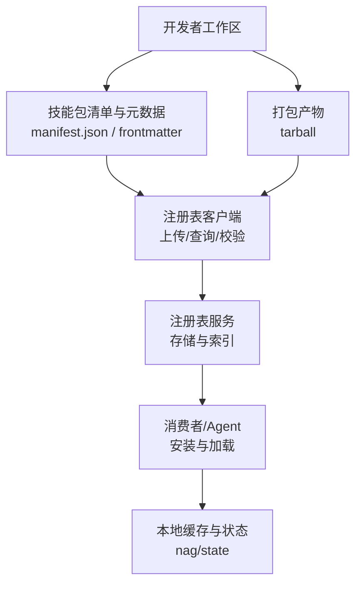
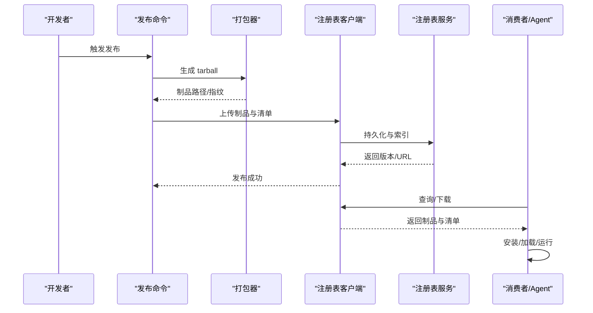
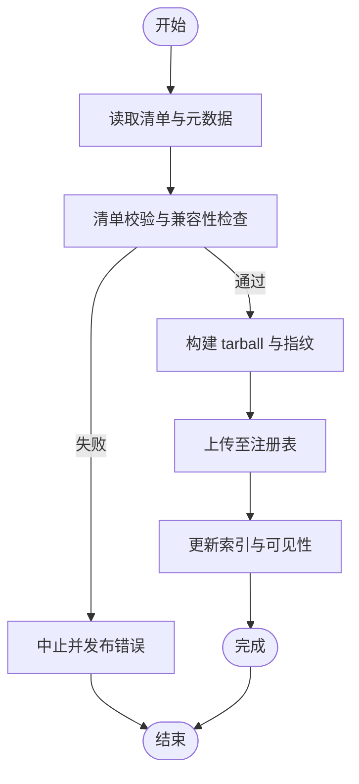
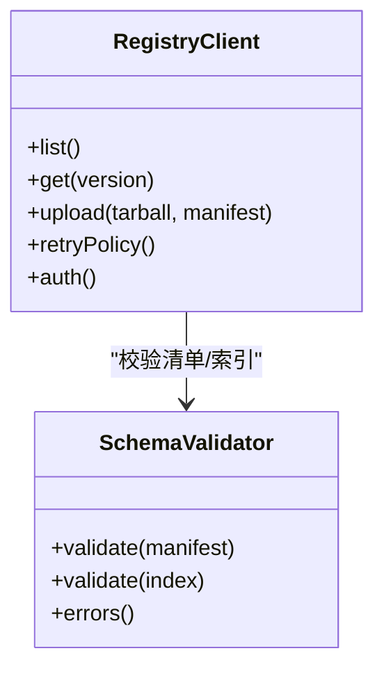
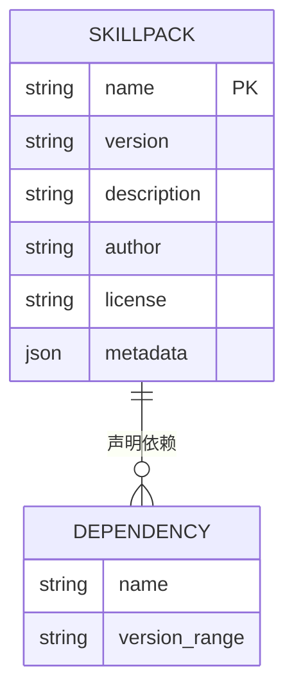
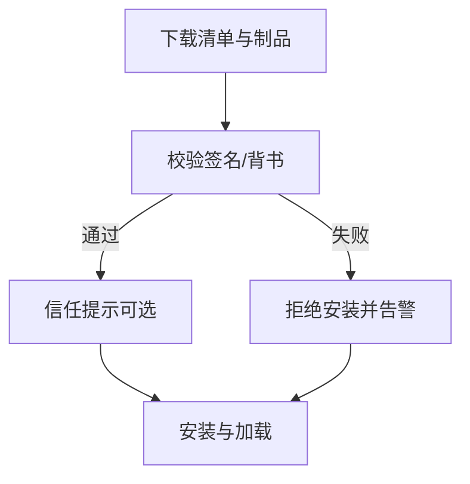
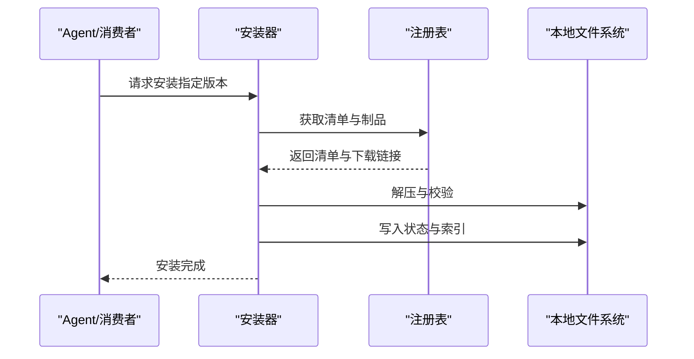
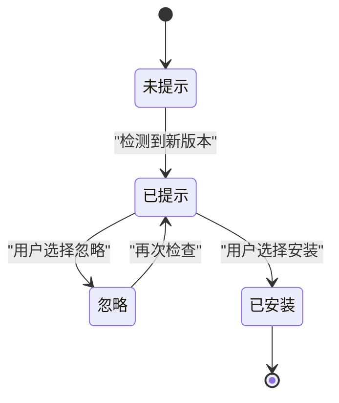
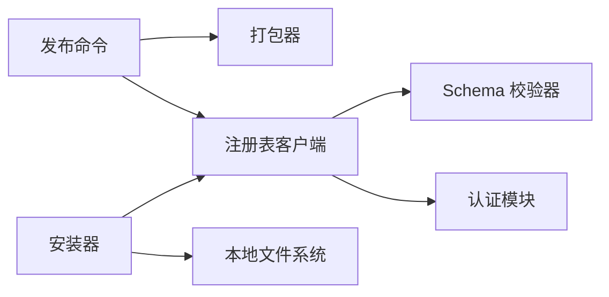

# 发布与分发

<cite>
**本文引用的文件**   
- [RELEASING.md](file://docs/RELEASING.md)
- [GBRAIN_SKILLPACK.md](file://docs/GBRAIN_SKILLPACK.md)
- [skillpack-anatomy.md](file://docs/skillpack-anatomy.md)
- [publish.ts](file://src/commands/publish.ts)
- [registry-client.test.ts](file://test/skillpack-registry-client.test.ts)
- [serve-skills-publish-nudge.test.ts](file://test/serve-skills-publish-nudge.test.ts)
- [skillpack-manifest-v1.test.ts](file://test/skillpack-manifest-v1.test.ts)
- [skillpack-tarball.test.ts](file://test/skillpack-tarball.test.ts)
- [skillpack-check.test.ts](file://test/skillpack-check.test.ts)
- [skillpack-install.test.ts](file://test/skillpack-install.test.ts)
- [skillpack-harvest-lint.test.ts](file://test/skillpack-harvest-lint.test.ts)
- [skillpack-scaffold.test.ts](file://test/skillpack-scaffold.test.ts)
- [skillpack-reference-pack-is-ten.ts](file://test/skillpack-reference-pack-is-ten.ts)
- [skillpack-reference-apply.test.ts](file://test/skillpack-reference-apply.test.ts)
- [skillpack-bootstrap-display.test.ts](file://test/skillpack-bootstrap-display.test.ts)
- [skillpack-frontmatter-sources.test.ts](file://test/skillpack-frontmatter-sources.test.ts)
- [skillpack-migrate-fence.test.ts](file://test/skillpack-migrate-fence.test.ts)
- [skillpack-rubric-doctor.test.ts](file://test/skillpack-rubric-doctor.test.ts)
- [skillpack-trust-prompt.test.ts](file://test/skillpack-trust-prompt.test.ts)
- [skillpack-endorse.test.ts](file://test/skillpack-endorse.test.ts)
- [skillpack-state.test.ts](file://test/skillpack-state.test.ts)
- [skillpack-remote-source.test.ts](file://test/skillpack-remote-source.test.ts)
- [skillpack-registry-schema.test.ts](file://test/skillpack-registry-schema.test.ts)
- [skillpack-changed-since-version.test.ts](file://test/skillpack-changed-since-version.test.ts)
- [skillpack-copy.test.ts](file://test/skillpack-copy.test.ts)
- [skillpack-init-brain-pack.test.ts](file://test/skillpack-init-brain-pack.test.ts)
- [skillpack-init-pack.test.ts](file://test/skillpack-init-pack.test.ts)
- [skillpack-scaffold-third-party.test.ts](file://test/skillpack-scaffold-third-party.test.ts)
- [skillpack-harvest.test.ts](file://test/skillpack-harvest.test.ts)
- [skillpack-brain-resident-locate.test.ts](file://test/skillpack-brain-resident-locate.test.ts)
- [skillpack-nag-state.test.ts](file://test/skillpack-nag-state.test.ts)
- [skillpack-manifest-v041_2.test.ts](file://test/schema-pack-manifest-v041_2.test.ts)
- [schema-pack-registry-reload.test.ts](file://test/schema-pack-registry-reload.test.ts)
- [schema-pack-registry.test.ts](file://test/schema-pack-registry.test.ts)
- [schema-pack-load-active.serial.test.ts](file://test/schema-pack-load-active.serial.test.ts)
- [schema-pack-sync.test.ts](file://test/schema-pack-sync.test.ts)
- [schema-pack-best-effort.test.ts](file://test/schema-pack-best-effort.test.ts)
- [schema-pack-infer-type-and-subtype.test.ts](file://test/schema-pack-infer-type-and-subtype.test.ts)
- [schema-pack-lint-rules.test.ts](file://test/schema-pack-lint-rules.test.ts)
- [schema-pack-mutate-audit.test.ts](file://test/schema-pack-mutate-audit.test.ts)
- [schema-pack-mutate.test.ts](file://test/schema-pack-mutate.test.ts)
- [schema-pack-pack-lock.test.ts](file://test/schema-pack-pack-lock.test.ts)
- [schema-pack-page-to-alias.test.ts](file://test/schema-pack-page-to-alias.test.ts)
- [schema-pack-query-cache-invalidator.test.ts](file://test/schema-pack-query-cache-invalidator.test.ts)
- [schema-pack-retype.test.ts](file://test/schema-pack-retype.test.ts)
- [schema-pack-rewrite-links-batch.test.ts](file://test/schema-pack-rewrite-links-batch.test.ts)
- [schema-pack-stats.test.ts](file://test/schema-pack-stats.test.ts)
- [schema-pack-trust-boundary.test.ts](file://test/schema-pack-trust-boundary.test.ts)
- [schema-pack-unify-types-handler.test.ts](file://test/schema-pack-unify-types-handler.test.ts)
- [schema-verify.test.ts](file://test/schema-verify.test.ts)
- [skill-catalog-security.test.ts](file://test/skill-catalog-security.test.ts)
- [skill-catalog-transports.test.ts](file://test/skill-catalog-transports.test.ts)
- [skill-catalog.test.ts](file://test/skill-catalog.test.ts)
- [skill-manifest.test.ts](file://test/skill-manifest.test.ts)
- [skill-trigger-index.test.ts](file://test/skill-trigger-index.test.ts)
- [skillify-check.test.ts](file://test/skillify-check.test.ts)
- [skillify-scaffold.test.ts](file://test/skillify-scaffold.test.ts)
- [skillpack-apply-hunks.test.ts](file://test/skillpack-apply-hunks.test.ts)
- [skillpack-reference.test.ts](file://test/skillpack-reference.test.ts)
- [skillpack-registry-client.test.ts](file://test/skillpack-registry-client.test.ts)
- [skillpack-registry-schema.test.ts](file://test/skillpack-registry-schema.test.ts)
- [skillpack-remote-source.test.ts](file://test/skillpack-remote-source.test.ts)
- [skillpack-tarball.test.ts](file://test/skillpack-tarball.test.ts)
- [skillpack-check.test.ts](file://test/skillpack-check.test.ts)
- [skillpack-install.test.ts](file://test/skillpack-install.test.ts)
- [skillpack-harvest-lint.test.ts](file://test/skillpack-harvest-lint.test.ts)
- [skillpack-scaffold.test.ts](file://test/skillpack-scaffold.test.ts)
- [skillpack-reference-pack-is-ten.ts](file://test/skillpack-reference-pack-is-ten.ts)
- [skillpack-reference-apply.test.ts](file://test/skillpack-reference-apply.test.ts)
- [skillpack-bootstrap-display.test.ts](file://test/skillpack-bootstrap-display.test.ts)
- [skillpack-frontmatter-sources.test.ts](file://test/skillpack-frontmatter-sources.test.ts)
- [skillpack-migrate-fence.test.ts](file://test/skillpack-migrate-fence.test.ts)
- [skillpack-rubric-doctor.test.ts](file://test/skillpack-rubric-doctor.test.ts)
- [skillpack-trust-prompt.test.ts](file://test/skillpack-trust-prompt.test.ts)
- [skillpack-endorse.test.ts](file://test/skillpack-endorse.test.ts)
- [skillpack-state.test.ts](file://test/skillpack-state.test.ts)
- [skillpack-remote-source.test.ts](file://test/skillpack-remote-source.test.ts)
- [skillpack-registry-schema.test.ts](file://test/skillpack-registry-schema.test.ts)
- [skillpack-changed-since-version.test.ts](file://test/skillpack-changed-since-version.test.ts)
- [skillpack-copy.test.ts](file://test/skillpack-copy.test.ts)
- [skillpack-init-brain-pack.test.ts](file://test/skillpack-init-brain-pack.test.ts)
- [skillpack-init-pack.test.ts](file://test/skillpack-init-pack.test.ts)
- [skillpack-scaffold-third-party.test.ts](file://test/skillpack-scaffold-third-party.test.ts)
- [skillpack-harvest.test.ts](file://test/skillpack-harvest.test.ts)
- [skillpack-brain-resident-locate.test.ts](file://test/skillpack-brain-resident-locate.test.ts)
- [skillpack-nag-state.test.ts](file://test/skillpack-nag-state.test.ts)
</cite>

## 目录
1. [简介](#简介)
2. [项目结构](#项目结构)
3. [核心组件](#核心组件)
4. [架构总览](#架构总览)
5. [详细组件分析](#详细组件分析)
6. [依赖关系分析](#依赖关系分析)
7. [性能考虑](#性能考虑)
8. [故障排查指南](#故障排查指南)
9. [结论](#结论)
10. [附录](#附录)

## 简介
本指南面向技能包（Skillpack）的发布者与维护者，覆盖从打包、版本管理到注册表上传、访问控制、私有仓库配置、团队共享、依赖声明与兼容性、安全与签名验证、自动化流水线、监控与回滚的全流程最佳实践。文档以仓库内现有实现为依据，结合测试用例与规范文档进行系统化说明，帮助读者建立可复现、可审计、可扩展的发布与分发体系。

## 项目结构
围绕“发布与分发”的关键位置如下：
- 规范与指南：技能包格式、解剖结构与发布流程说明
- 命令层：CLI 发布命令入口
- 客户端与注册表：注册表客户端、Schema 校验、远程源解析
- 制品与打包：Tarball 构建与校验
- 质量与安全：检查、信任提示、背书、安全策略
- 安装与加载：安装、Harvest、Scaffold、引用应用等
- 示例与参考：参考技能包与端到端样例

图表来源
- [publish.ts:1-200](file://src/commands/publish.ts#L1-L200)
- [skillpack-registry-client.test.ts:1-200](file://test/skillpack-registry-client.test.ts#L1-L200)
- [skillpack-tarball.test.ts:1-200](file://test/skillpack-tarball.test.ts#L1-L200)
- [skillpack-state.test.ts:1-200](file://test/skillpack-state.test.ts#L1-L200)

章节来源
- [GBRAIN_SKILLPACK.md:1-200](file://docs/GBRAIN_SKILLPACK.md#L1-L200)
- [skillpack-anatomy.md:1-200](file://docs/skillpack-anatomy.md#L1-L200)
- [RELEASING.md:1-200](file://docs/RELEASING.md#L1-L200)

## 核心组件
- 发布命令与流程
  - CLI 发布命令负责读取清单、执行前置检查、生成制品并调用注册表客户端完成上传与索引。
  - 关键路径：[publish.ts](file://src/commands/publish.ts)
- 注册表客户端与 Schema
  - 提供注册表交互能力，包含认证、分页、重试、错误分类；对清单与索引进行 Schema 校验。
  - 关键路径：[skillpack-registry-client.test.ts](file://test/skillpack-registry-client.test.ts)、[skillpack-registry-schema.test.ts](file://test/skillpack-registry-schema.test.ts)
- 制品打包与校验
  - Tarball 构建、完整性校验、内容白名单与大小限制。
  - 关键路径：[skillpack-tarball.test.ts](file://test/skillpack-tarball.test.ts)
- 清单与版本
  - 清单 v1/v0.41.x 兼容、变更检测、前后向兼容策略。
  - 关键路径：[skillpack-manifest-v1.test.ts](file://test/skillpack-manifest-v1.test.ts)、[schema-pack-manifest-v041_2.test.ts](file://test/schema-pack-manifest-v041_2.test.ts)、[skillpack-changed-since-version.test.ts](file://test/skillpack-changed-since-version.test.ts)
- 质量与安全
  - 检查器、信任提示、背书机制、安全策略与传输安全。
  - 关键路径：[skillpack-check.test.ts](file://test/skillpack-check.test.ts)、[skillpack-trust-prompt.test.ts](file://test/skillpack-trust-prompt.test.ts)、[skillpack-endorse.test.ts](file://test/skillpack-endorse.test.ts)、[skill-catalog-security.test.ts](file://test/skill-catalog-security.test.ts)、[skill-catalog-transports.test.ts](file://test/skill-catalog-transports.test.ts)
- 安装与加载
  - 安装、Harvest 收集、Scaffold 初始化、引用应用、脑驻留定位等。
  - 关键路径：[skillpack-install.test.ts](file://test/skillpack-install.test.ts)、[skillpack-harvest-lint.test.ts](file://test/skillpack-harvest-lint.test.ts)、[skillpack-scaffold.test.ts](file://test/skillpack-scaffold.test.ts)、[skillpack-reference-apply.test.ts](file://test/skillpack-reference-apply.test.ts)、[skillpack-brain-resident-locate.test.ts](file://test/skillpack-brain-resident-locate.test.ts)
- 状态与提示
  - 本地 nag/state 记录、升级提示与服务端 nudge。
  - 关键路径：[skillpack-nag-state.test.ts](file://test/skillpack-nag-state.test.ts)、[serve-skills-publish-nudge.test.ts](file://test/serve-skills-publish-nudge.test.ts)

章节来源
- [publish.ts:1-200](file://src/commands/publish.ts#L1-L200)
- [skillpack-registry-client.test.ts:1-200](file://test/skillpack-registry-client.test.ts#L1-L200)
- [skillpack-registry-schema.test.ts:1-200](file://test/skillpack-registry-schema.test.ts#L1-L200)
- [skillpack-tarball.test.ts:1-200](file://test/skillpack-tarball.test.ts#L1-L200)
- [skillpack-manifest-v1.test.ts:1-200](file://test/skillpack-manifest-v1.test.ts#L1-L200)
- [schema-pack-manifest-v041_2.test.ts:1-200](file://test/schema-pack-manifest-v041_2.test.ts#L1-L200)
- [skillpack-changed-since-version.test.ts:1-200](file://test/skillpack-changed-since-version.test.ts#L1-L200)
- [skillpack-check.test.ts:1-200](file://test/skillpack-check.test.ts#L1-L200)
- [skillpack-trust-prompt.test.ts:1-200](file://test/skillpack-trust-prompt.test.ts#L1-L200)
- [skillpack-endorse.test.ts:1-200](file://test/skillpack-endorse.test.ts#L1-L200)
- [skill-catalog-security.test.ts:1-200](file://test/skill-catalog-security.test.ts#L1-L200)
- [skill-catalog-transports.test.ts:1-200](file://test/skill-catalog-transports.test.ts#L1-L200)
- [skillpack-install.test.ts:1-200](file://test/skillpack-install.test.ts#L1-L200)
- [skillpack-harvest-lint.test.ts:1-200](file://test/skillpack-harvest-lint.test.ts#L1-L200)
- [skillpack-scaffold.test.ts:1-200](file://test/skillpack-scaffold.test.ts#L1-L200)
- [skillpack-reference-apply.test.ts:1-200](file://test/skillpack-reference-apply.test.ts#L1-L200)
- [skillpack-brain-resident-locate.test.ts:1-200](file://test/skillpack-brain-resident-locate.test.ts#L1-L200)
- [skillpack-nag-state.test.ts:1-200](file://test/skillpack-nag-state.test.ts#L1-L200)
- [serve-skills-publish-nudge.test.ts:1-200](file://test/serve-skills-publish-nudge.test.ts#L1-L200)

## 架构总览
下图展示了从开发到消费端的完整链路：清单与源码 -> 打包 -> 注册表 -> 安装与加载 -> 运行期状态与提示。

图表来源
- [publish.ts:1-200](file://src/commands/publish.ts#L1-L200)
- [skillpack-registry-client.test.ts:1-200](file://test/skillpack-registry-client.test.ts#L1-L200)
- [skillpack-tarball.test.ts:1-200](file://test/skillpack-tarball.test.ts#L1-L200)

## 详细组件分析

### 发布命令与打包流程
- 职责边界
  - 读取清单与元数据，执行检查与校验
  - 生成 tarball 制品，计算指纹
  - 调用注册表客户端上传，处理幂等与重试
- 关键步骤
  - 清单校验与兼容性检查
  - 资源白名单与体积限制
  - 上传分片与断点续传（如服务端支持）
  - 发布后索引更新与可见性控制
- 相关实现与测试
  - 发布命令入口与流程编排：[publish.ts](file://src/commands/publish.ts)
  - Tarball 构建与校验：[skillpack-tarball.test.ts](file://test/skillpack-tarball.test.ts)
  - 清单 v1 与 v0.41.x 兼容：[skillpack-manifest-v1.test.ts](file://test/skillpack-manifest-v1.test.ts)、[schema-pack-manifest-v041_2.test.ts](file://test/schema-pack-manifest-v041_2.test.ts)
  - 变更检测与增量发布：[skillpack-changed-since-version.test.ts](file://test/skillpack-changed-since-version.test.ts)

图表来源
- [publish.ts:1-200](file://src/commands/publish.ts#L1-L200)
- [skillpack-tarball.test.ts:1-200](file://test/skillpack-tarball.test.ts#L1-L200)
- [skillpack-manifest-v1.test.ts:1-200](file://test/skillpack-manifest-v1.test.ts#L1-L200)
- [schema-pack-manifest-v041_2.test.ts:1-200](file://test/schema-pack-manifest-v041_2.test.ts#L1-L200)
- [skillpack-changed-since-version.test.ts:1-200](file://test/skillpack-changed-since-version.test.ts#L1-L200)

章节来源
- [publish.ts:1-200](file://src/commands/publish.ts#L1-L200)
- [skillpack-tarball.test.ts:1-200](file://test/skillpack-tarball.test.ts#L1-L200)
- [skillpack-manifest-v1.test.ts:1-200](file://test/skillpack-manifest-v1.test.ts#L1-L200)
- [schema-pack-manifest-v041_2.test.ts:1-200](file://test/schema-pack-manifest-v041_2.test.ts#L1-L200)
- [skillpack-changed-since-version.test.ts:1-200](file://test/skillpack-changed-since-version.test.ts#L1-L200)

### 注册表客户端与 Schema 校验
- 功能要点
  - 认证与令牌管理、权限范围控制
  - 列表、查询、下载、上传接口封装
  - 清单与索引的 Schema 校验，错误分类与重试策略
- 使用建议
  - 为不同环境配置独立域名与凭据
  - 开启最小权限原则的访问令牌
  - 对网络异常进行指数退避重试
- 相关实现与测试
  - 客户端行为与错误处理：[skillpack-registry-client.test.ts](file://test/skillpack-registry-client.test.ts)
  - Schema 校验规则与边界条件：[skillpack-registry-schema.test.ts](file://test/skillpack-registry-schema.test.ts)

图表来源
- [skillpack-registry-client.test.ts:1-200](file://test/skillpack-registry-client.test.ts#L1-L200)
- [skillpack-registry-schema.test.ts:1-200](file://test/skillpack-registry-schema.test.ts#L1-L200)

章节来源
- [skillpack-registry-client.test.ts:1-200](file://test/skillpack-registry-client.test.ts#L1-L200)
- [skillpack-registry-schema.test.ts:1-200](file://test/skillpack-registry-schema.test.ts#L1-L200)

### 清单与版本管理
- 清单结构
  - 名称、版本、描述、作者、许可证、依赖、入口、资源白名单、元数据等
- 版本策略
  - 语义化版本（主/次/补丁），向后兼容与破坏性变更标记
  - 变更检测用于增量发布与回滚决策
- 兼容性与迁移
  - 多版本清单兼容（v1 与 v0.41.x）
  - 迁移钩子与 Fence 迁移
- 相关实现与测试
  - 清单 v1 与 v0.41.x：[skillpack-manifest-v1.test.ts](file://test/skillpack-manifest-v1.test.ts)、[schema-pack-manifest-v041_2.test.ts](file://test/schema-pack-manifest-v041_2.test.ts)
  - 变更检测：[skillpack-changed-since-version.test.ts](file://test/skillpack-changed-since-version.test.ts)
  - Fence 迁移：[skillpack-migrate-fence.test.ts](file://test/skillpack-migrate-fence.test.ts)

图表来源
- [skillpack-manifest-v1.test.ts:1-200](file://test/skillpack-manifest-v1.test.ts#L1-L200)
- [schema-pack-manifest-v041_2.test.ts:1-200](file://test/schema-pack-manifest-v041_2.test.ts#L1-L200)
- [skillpack-changed-since-version.test.ts:1-200](file://test/skillpack-changed-since-version.test.ts#L1-L200)
- [skillpack-migrate-fence.test.ts:1-200](file://test/skillpack-migrate-fence.test.ts#L1-L200)

章节来源
- [skillpack-manifest-v1.test.ts:1-200](file://test/skillpack-manifest-v1.test.ts#L1-L200)
- [schema-pack-manifest-v041_2.test.ts:1-200](file://test/schema-pack-manifest-v041_2.test.ts#L1-L200)
- [skillpack-changed-since-version.test.ts:1-200](file://test/skillpack-changed-since-version.test.ts#L1-L200)
- [skillpack-migrate-fence.test.ts:1-200](file://test/skillpack-migrate-fence.test.ts#L1-L200)

### 安全、签名与信任链
- 安全检查
  - 清单与内容白名单、体积限制、危险模式拦截
  - 传输安全（HTTPS/TLS）、证书校验
- 签名与背书
  - 可选签名与校验流程
  - 背书（endorsement）机制用于组织内可信来源
- 信任提示
  - 首次安装或未知来源时的交互式确认
- 相关实现与测试
  - 检查器：[skillpack-check.test.ts](file://test/skillpack-check.test.ts)
  - 传输安全：[skill-catalog-transports.test.ts](file://test/skill-catalog-transports.test.ts)
  - 安全策略：[skill-catalog-security.test.ts](file://test/skill-catalog-security.test.ts)
  - 信任提示：[skillpack-trust-prompt.test.ts](file://test/skillpack-trust-prompt.test.ts)
  - 背书：[skillpack-endorse.test.ts](file://test/skillpack-endorse.test.ts)

图表来源
- [skillpack-check.test.ts:1-200](file://test/skillpack-check.test.ts#L1-L200)
- [skill-catalog-transports.test.ts:1-200](file://test/skill-catalog-transports.test.ts#L1-L200)
- [skill-catalog-security.test.ts:1-200](file://test/skill-catalog-security.test.ts#L1-L200)
- [skillpack-trust-prompt.test.ts:1-200](file://test/skillpack-trust-prompt.test.ts#L1-L200)
- [skillpack-endorse.test.ts:1-200](file://test/skillpack-endorse.test.ts#L1-L200)

章节来源
- [skillpack-check.test.ts:1-200](file://test/skillpack-check.test.ts#L1-L200)
- [skill-catalog-transports.test.ts:1-200](file://test/skill-catalog-transports.test.ts#L1-L200)
- [skill-catalog-security.test.ts:1-200](file://test/skill-catalog-security.test.ts#L1-L200)
- [skillpack-trust-prompt.test.ts:1-200](file://test/skillpack-trust-prompt.test.ts#L1-L200)
- [skillpack-endorse.test.ts:1-200](file://test/skillpack-endorse.test.ts#L1-L200)

### 安装、Harvest 与 Scaffold
- 安装流程
  - 解析清单、拉取制品、解压与校验、写入本地状态
- Harvest 收集
  - 扫描与整理技能资源，生成索引与元数据
- Scaffold 初始化
  - 基于模板快速创建新技能包骨架
- 引用应用与脑驻留
  - 引用解析与应用、脑驻留定位与生命周期
- 相关实现与测试
  - 安装：[skillpack-install.test.ts](file://test/skillpack-install.test.ts)
  - Harvest 与 Lint：[skillpack-harvest-lint.test.ts](file://test/skillpack-harvest-lint.test.ts)、[skillpack-harvest.test.ts](file://test/skillpack-harvest.test.ts)
  - Scaffold：[skillpack-scaffold.test.ts](file://test/skillpack-scaffold.test.ts)、[skillpack-scaffold-third-party.test.ts](file://test/skillpack-scaffold-third-party.test.ts)
  - 引用应用：[skillpack-reference-apply.test.ts](file://test/skillpack-reference-apply.test.ts)
  - 脑驻留定位：[skillpack-brain-resident-locate.test.ts](file://test/skillpack-brain-resident-locate.test.ts)

图表来源
- [skillpack-install.test.ts:1-200](file://test/skillpack-install.test.ts#L1-L200)
- [skillpack-harvest-lint.test.ts:1-200](file://test/skillpack-harvest-lint.test.ts#L1-L200)
- [skillpack-harvest.test.ts:1-200](file://test/skillpack-harvest.test.ts#L1-L200)
- [skillpack-scaffold.test.ts:1-200](file://test/skillpack-scaffold.test.ts#L1-L200)
- [skillpack-reference-apply.test.ts:1-200](file://test/skillpack-reference-apply.test.ts#L1-L200)
- [skillpack-brain-resident-locate.test.ts:1-200](file://test/skillpack-brain-resident-locate.test.ts#L1-L200)

章节来源
- [skillpack-install.test.ts:1-200](file://test/skillpack-install.test.ts#L1-L200)
- [skillpack-harvest-lint.test.ts:1-200](file://test/skillpack-harvest-lint.test.ts#L1-L200)
- [skillpack-harvest.test.ts:1-200](file://test/skillpack-harvest.test.ts#L1-L200)
- [skillpack-scaffold.test.ts:1-200](file://test/skillpack-scaffold.test.ts#L1-L200)
- [skillpack-scaffold-third-party.test.ts:1-200](file://test/skillpack-scaffold-third-party.test.ts#L1-L200)
- [skillpack-reference-apply.test.ts:1-200](file://test/skillpack-reference-apply.test.ts#L1-L200)
- [skillpack-brain-resident-locate.test.ts:1-200](file://test/skillpack-brain-resident-locate.test.ts#L1-L200)

### 状态管理与发布提示
- 本地状态
  - nag/state 记录用户提示与升级状态，避免重复打扰
- 服务端 Nudge
  - 服务端推送发布提示，引导用户关注新版本
- 相关实现与测试
  - 本地状态：[skillpack-nag-state.test.ts](file://test/skillpack-nag-state.test.ts)
  - 服务端 Nudge：[serve-skills-publish-nudge.test.ts](file://test/serve-skills-publish-nudge.test.ts)

图表来源
- [skillpack-nag-state.test.ts:1-200](file://test/skillpack-nag-state.test.ts#L1-L200)
- [serve-skills-publish-nudge.test.ts:1-200](file://test/serve-skills-publish-nudge.test.ts#L1-L200)

章节来源
- [skillpack-nag-state.test.ts:1-200](file://test/skillpack-nag-state.test.ts#L1-L200)
- [serve-skills-publish-nudge.test.ts:1-200](file://test/serve-skills-publish-nudge.test.ts#L1-L200)

### 清单与 Schema 生态（扩展）
- 清单与类型统一
  - 类型推断与统一、规则 Lint、互操作与一致性
- 注册表重载与同步
  - 热重载、增量同步、一致性保障
- 相关实现与测试
  - 清单与类型：[schema-pack-infer-type-and-subtype.test.ts](file://test/schema-pack-infer-type-and-subtype.test.ts)、[schema-pack-lint-rules.test.ts](file://test/schema-pack-lint-rules.test.ts)、[schema-pack-unify-types-handler.test.ts](file://test/schema-pack-unify-types-handler.test.ts)
  - 注册表重载与同步：[schema-pack-registry-reload.test.ts](file://test/schema-pack-registry-reload.test.ts)、[schema-pack-sync.test.ts](file://test/schema-pack-sync.test.ts)
  - 其他：[schema-pack-load-active.serial.test.ts](file://test/schema-pack-load-active.serial.test.ts)、[schema-pack-best-effort.test.ts](file://test/schema-pack-best-effort.test.ts)、[schema-pack-mutate-audit.test.ts](file://test/schema-pack-mutate-audit.test.ts)、[schema-pack-mutate.test.ts](file://test/schema-pack-mutate-audit.test.ts)、[schema-pack-pack-lock.test.ts](file://test/schema-pack-pack-lock.test.ts)、[schema-pack-page-to-alias.test.ts](file://test/schema-pack-page-to-alias.test.ts)、[schema-pack-query-cache-invalidator.test.ts](file://test/schema-pack-query-cache-invalidator.test.ts)、[schema-pack-retype.test.ts](file://test/schema-pack-retype.test.ts)、[schema-pack-rewrite-links-batch.test.ts](file://test/schema-pack-rewrite-links-batch.test.ts)、[schema-pack-stats.test.ts](file://test/schema-pack-stats.test.ts)、[schema-pack-trust-boundary.test.ts](file://test/schema-pack-trust-boundary.test.ts)、[schema-verify.test.ts](file://test/schema-verify.test.ts)

章节来源
- [schema-pack-infer-type-and-subtype.test.ts:1-200](file://test/schema-pack-infer-type-and-subtype.test.ts#L1-L200)
- [schema-pack-lint-rules.test.ts:1-200](file://test/schema-pack-lint-rules.test.ts#L1-L200)
- [schema-pack-unify-types-handler.test.ts:1-200](file://test/schema-pack-unify-types-handler.test.ts#L1-L200)
- [schema-pack-registry-reload.test.ts:1-200](file://test/schema-pack-registry-reload.test.ts#L1-L200)
- [schema-pack-sync.test.ts:1-200](file://test/schema-pack-sync.test.ts#L1-L200)
- [schema-pack-load-active.serial.test.ts:1-200](file://test/schema-pack-load-active.serial.test.ts#L1-L200)
- [schema-pack-best-effort.test.ts:1-200](file://test/schema-pack-best-effort.test.ts#L1-L200)
- [schema-pack-mutate-audit.test.ts:1-200](file://test/schema-pack-mutate-audit.test.ts#L1-L200)
- [schema-pack-mutate.test.ts:1-200](file://test/schema-pack-mutate.test.ts#L1-L200)
- [schema-pack-pack-lock.test.ts:1-200](file://test/schema-pack-pack-pack-lock.test.ts#L1-L200)
- [schema-pack-page-to-alias.test.ts:1-200](file://test/schema-pack-page-to-alias.test.ts#L1-L200)
- [schema-pack-query-cache-invalidator.test.ts:1-200](file://test/schema-pack-query-cache-invalidator.test.ts#L1-L200)
- [schema-pack-retype.test.ts:1-200](file://test/schema-pack-retype.test.ts#L1-L200)
- [schema-pack-rewrite-links-batch.test.ts:1-200](file://test/schema-pack-rewrite-links-batch.test.ts#L1-L200)
- [schema-pack-stats.test.ts:1-200](file://test/schema-pack-stats.test.ts#L1-L200)
- [schema-pack-trust-boundary.test.ts:1-200](file://test/schema-pack-trust-boundary.test.ts#L1-L200)
- [schema-verify.test.ts:1-200](file://test/schema-verify.test.ts#L1-L200)

## 依赖关系分析
- 组件耦合
  - 发布命令依赖打包器与注册表客户端
  - 注册表客户端依赖 Schema 校验器与认证模块
  - 安装器依赖注册表客户端与本地文件系统
- 外部依赖
  - 注册表服务（HTTP/REST 或专用协议）
  - 对象存储（制品持久化）
  - 密钥管理服务（签名与背书）
- 潜在循环依赖
  - 通过分层与接口抽象避免命令层直接依赖底层存储
- 接口契约
  - 清单与索引的 Schema 作为稳定契约
  - 注册表 API 的版本化与兼容性保证

图表来源
- [publish.ts:1-200](file://src/commands/publish.ts#L1-L200)
- [skillpack-registry-client.test.ts:1-200](file://test/skillpack-registry-client.test.ts#L1-L200)
- [skillpack-registry-schema.test.ts:1-200](file://test/skillpack-registry-schema.test.ts#L1-L200)
- [skillpack-install.test.ts:1-200](file://test/skillpack-install.test.ts#L1-L200)

章节来源
- [publish.ts:1-200](file://src/commands/publish.ts#L1-L200)
- [skillpack-registry-client.test.ts:1-200](file://test/skillpack-registry-client.test.ts#L1-L200)
- [skillpack-registry-schema.test.ts:1-200](file://test/skillpack-registry-schema.test.ts#L1-L200)
- [skillpack-install.test.ts:1-200](file://test/skillpack-install.test.ts#L1-L200)

## 性能考虑
- 打包阶段
  - 并行压缩与去重，限制最大体积，跳过无关文件
- 上传阶段
  - 分片上传、断点续传、并发度调优
- 安装阶段
  - 增量下载与缓存命中，懒加载与按需解压
- 注册表侧
  - CDN 加速、对象存储分层、索引缓存与预取

## 故障排查指南
- 常见问题
  - 清单校验失败：检查字段类型、必填项与兼容范围
  - 上传失败：检查网络、令牌权限与配额
  - 安装失败：检查签名/背书、信任提示与本地状态
- 诊断手段
  - 启用详细日志与错误堆栈
  - 使用清单与 Schema 校验工具进行离线验证
  - 对比变更检测报告定位破坏性变更
- 相关实现与测试
  - 清单与 Schema 校验：[skillpack-registry-schema.test.ts](file://test/skillpack-registry-schema.test.ts)
  - 安装与状态：[skillpack-install.test.ts](file://test/skillpack-install.test.ts)、[skillpack-nag-state.test.ts](file://test/skillpack-nag-state.test.ts)
  - 安全与传输：[skill-catalog-security.test.ts](file://test/skill-catalog-security.test.ts)、[skill-catalog-transports.test.ts](file://test/skill-catalog-transports.test.ts)

章节来源
- [skillpack-registry-schema.test.ts:1-200](file://test/skillpack-registry-schema.test.ts#L1-L200)
- [skillpack-install.test.ts:1-200](file://test/skillpack-install.test.ts#L1-L200)
- [skillpack-nag-state.test.ts:1-200](file://test/skillpack-nag-state.test.ts#L1-L200)
- [skill-catalog-security.test.ts:1-200](file://test/skill-catalog-security.test.ts#L1-L200)
- [skill-catalog-transports.test.ts:1-200](file://test/skill-catalog-transports.test.ts#L1-L200)

## 结论
通过规范的清单与 Schema、严格的打包与校验、健壮的注册表客户端与安装器、完善的安全与信任机制，以及完善的测试与监控，可以构建出高可靠、可演进的技能包发布与分发体系。建议在团队中推广最小权限、签名背书、灰度发布与回滚策略，确保生产环境的稳定性与安全性。

## 附录
- 规范与指南
  - 技能包规范与解剖：[GBRAIN_SKILLPACK.md](file://docs/GBRAIN_SKILLPACK.md)、[skillpack-anatomy.md](file://docs/skillpack-anatomy.md)
  - 发布流程说明：[RELEASING.md](file://docs/RELEASING.md)
- 示例与参考
  - 参考技能包与端到端样例：[examples/skillpack-reference](file://examples/skillpack-reference)