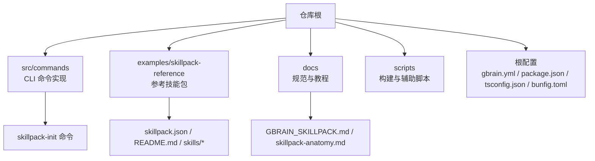
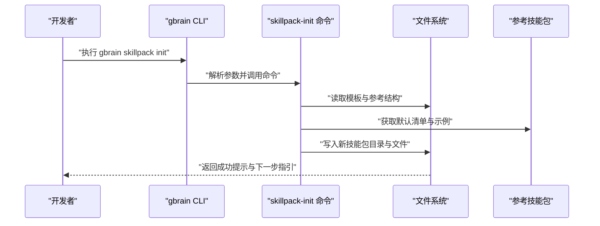
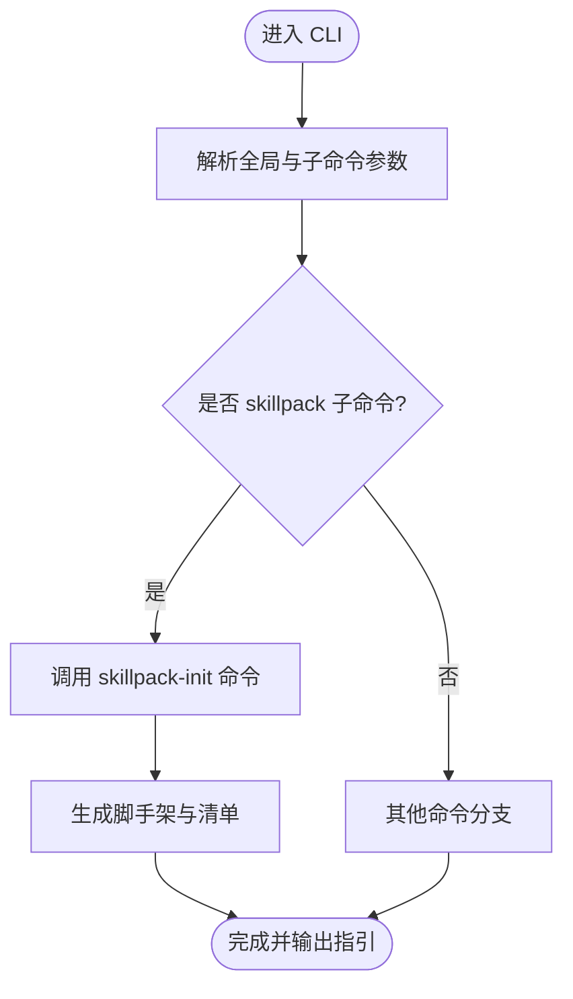
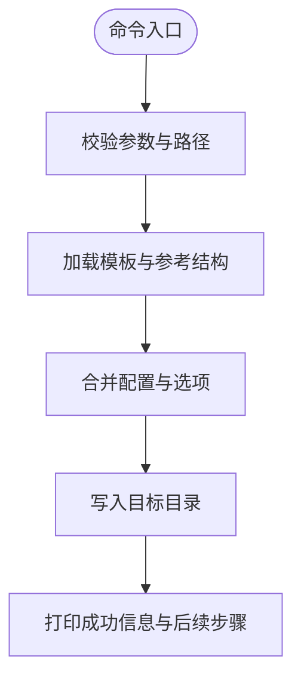
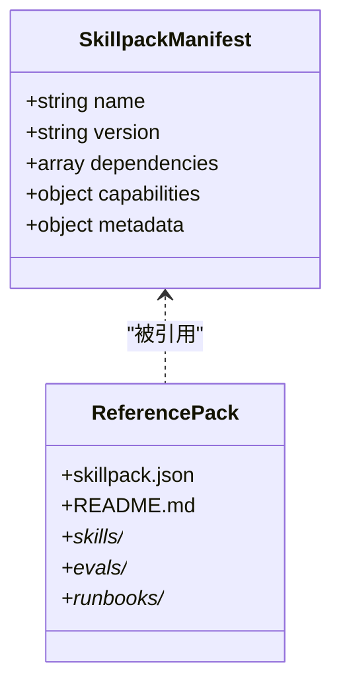
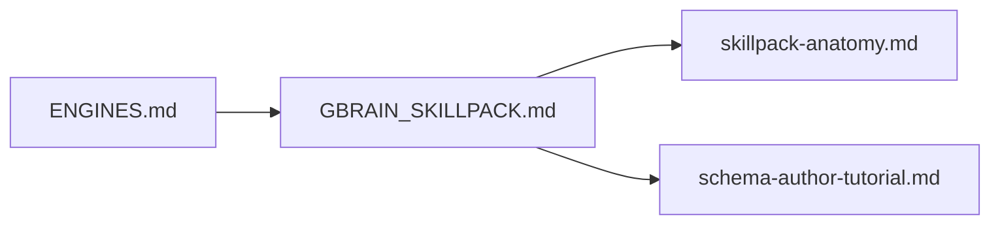
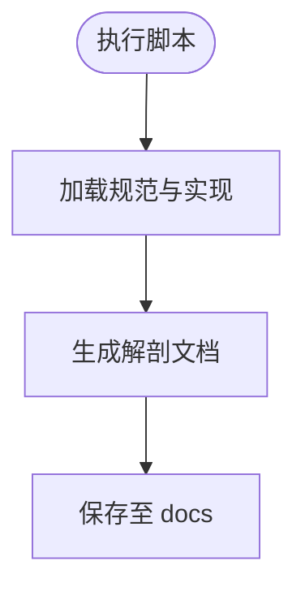
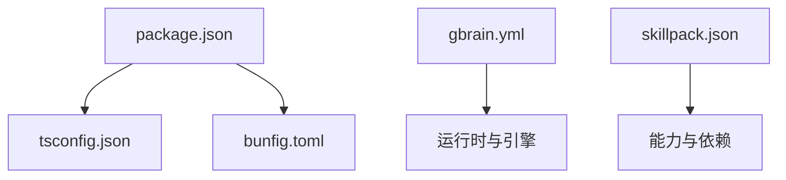

# 开发工作流程

<cite>
**本文引用的文件**   
- [README.md](file://README.md)
- [INSTALL.md](file://docs/INSTALL.md)
- [GBRAIN_SKILLPACK.md](file://docs/GBRAIN_SKILLPACK.md)
- [skillpack-anatomy.md](file://docs/skillpack-anatomy.md)
- [schema-author-tutorial.md](file://docs/schema-author-tutorial.md)
- [ENGINES.md](file://docs/ENGINES.md)
- [gbrain.yml](file://gbrain.yml)
- [package.json](file://package.json)
- [tsconfig.json](file://tsconfig.json)
- [bunfig.toml](file://bunfig.toml)
- [src/cli.ts](file://src/cli.ts)
- [src/commands/skillpack-init.ts](file://src/commands/skillpack-init.ts)
- [examples/skillpack-reference/skillpack.json](file://examples/skillpack-reference/skillpack.json)
- [examples/skillpack-reference/README.md](file://examples/skillpack-reference/README.md)
- [skills/_AGENT_README.md](file://skills/_AGENT_README.md)
- [scripts/build-skillpack-anatomy.ts](file://scripts/build-skillpack-anatomy.ts)
</cite>

## 目录
1. [简介](#简介)
2. [项目结构](#项目结构)
3. [核心组件](#核心组件)
4. [架构总览](#架构总览)
5. [详细组件分析](#详细组件分析)
6. [依赖分析](#依赖分析)
7. [性能考虑](#性能考虑)
8. [故障排查指南](#故障排查指南)
9. [结论](#结论)
10. [附录](#附录)

## 简介
本指南面向希望基于 gbrain 构建“技能包（Skillpack）”的开发者，提供从环境准备、脚手架生成、文档与配置编写、业务逻辑实现到测试与发布的完整工作流。内容覆盖：
- 使用 gbrain skillpack init 命令创建标准脚手架
- 编写 SKILL.md 描述能力、输入输出与约束
- 组织代码结构与模块划分策略
- 配置 skillpack.json 与相关环境变量
- 渐进式示例：从简单文本处理到复杂多模态技能包
- 内置工具与 API 的使用建议
- IDE 集成与调试技巧

## 项目结构
仓库采用“核心引擎 + 命令 + 技能包示例 + 文档”的分层组织方式：
- src/commands：CLI 子命令实现，包含 skillpack 初始化等
- examples/skillpack-reference：官方参考技能包，展示标准结构与约定
- docs：权威文档，包括技能包规范、解剖说明、教程与最佳实践
- scripts：构建与辅助脚本，如生成技能包解剖文档
- 根级配置文件：gbrain.yml、package.json、tsconfig.json、bunfig.toml 等

图表来源
- [src/commands/skillpack-init.ts](file://src/commands/skillpack-init.ts)
- [examples/skillpack-reference/skillpack.json](file://examples/skillpack-reference/skillpack.json)
- [examples/skillpack-reference/README.md](file://examples/skillpack-reference/README.md)
- [docs/GBRAIN_SKILLPACK.md](file://docs/GBRAIN_SKILLPACK.md)
- [docs/skillpack-anatomy.md](file://docs/skillpack-anatomy.md)

章节来源
- [README.md](file://README.md)
- [docs/INSTALL.md](file://docs/INSTALL.md)
- [docs/GBRAIN_SKILLPACK.md](file://docs/GBRAIN_SKILLPACK.md)
- [docs/skillpack-anatomy.md](file://docs/skillpack-anatomy.md)
- [examples/skillpack-reference/skillpack.json](file://examples/skillpack-reference/skillpack.json)
- [examples/skillpack-reference/README.md](file://examples/skillpack-reference/README.md)
- [gbrain.yml](file://gbrain.yml)
- [package.json](file://package.json)
- [tsconfig.json](file://tsconfig.json)
- [bunfig.toml](file://bunfig.toml)

## 核心组件
- CLI 入口与命令分发：负责解析命令行参数并路由到具体命令实现
- skillpack-init 命令：根据模板生成标准技能包脚手架，包含必要清单与示例文件
- 参考技能包：提供完整的结构样板，便于对照实现
- 文档与规范：定义技能包元数据、能力声明、输入输出契约与约束
- 构建与辅助脚本：用于生成文档或校验结构一致性

章节来源
- [src/cli.ts](file://src/cli.ts)
- [src/commands/skillpack-init.ts](file://src/commands/skillpack-init.ts)
- [examples/skillpack-reference/skillpack.json](file://examples/skillpack-reference/skillpack.json)
- [docs/GBRAIN_SKILLPACK.md](file://docs/GBRAIN_SKILLPACK.md)
- [docs/skillpack-anatomy.md](file://docs/skillpack-anatomy.md)

## 架构总览
下图展示了从 CLI 调用到技能包生成的关键流程，以及参考技能包的组成关系。

图表来源
- [src/cli.ts](file://src/cli.ts)
- [src/commands/skillpack-init.ts](file://src/commands/skillpack-init.ts)
- [examples/skillpack-reference/skillpack.json](file://examples/skillpack-reference/skillpack.json)

## 详细组件分析

### 组件A：CLI 与命令分发
- 职责：统一入口、参数解析、命令注册与分发
- 关键点：
  - 将 gbrain skillpack init 映射到具体命令实现
  - 支持常见选项（目标路径、模板选择等）
  - 错误码与用户提示标准化

图表来源
- [src/cli.ts](file://src/cli.ts)
- [src/commands/skillpack-init.ts](file://src/commands/skillpack-init.ts)

章节来源
- [src/cli.ts](file://src/cli.ts)
- [src/commands/skillpack-init.ts](file://src/commands/skillpack-init.ts)

### 组件B：skillpack-init 命令
- 职责：依据模板与参考结构生成标准技能包骨架
- 生成产物通常包括：
  - 清单文件（如 skillpack.json）
  - 能力描述文件（SKILL.md）
  - 示例实现与测试占位
  - 必要的 .gitignore 与 README
- 行为要点：
  - 校验目标路径与权限
  - 合并默认配置与可选参数
  - 输出下一步操作建议（编辑清单、编写 SKILL.md、运行本地验证）

图表来源
- [src/commands/skillpack-init.ts](file://src/commands/skillpack-init.ts)
- [examples/skillpack-reference/skillpack.json](file://examples/skillpack-reference/skillpack.json)

章节来源
- [src/commands/skillpack-init.ts](file://src/commands/skillpack-init.ts)
- [examples/skillpack-reference/skillpack.json](file://examples/skillpack-reference/skillpack.json)

### 组件C：参考技能包与清单
- 参考技能包提供了标准目录与文件约定，便于快速上手
- 清单文件（skillpack.json）定义技能包元数据、版本、依赖与能力入口
- README 提供使用说明与示例

图表来源
- [examples/skillpack-reference/skillpack.json](file://examples/skillpack-reference/skillpack.json)
- [examples/skillpack-reference/README.md](file://examples/skillpack-reference/README.md)

章节来源
- [examples/skillpack-reference/skillpack.json](file://examples/skillpack-reference/skillpack.json)
- [examples/skillpack-reference/README.md](file://examples/skillpack-reference/README.md)

### 组件D：文档与规范
- GBRAIN_SKILLPACK.md：定义技能包规范、清单字段、能力声明与契约
- skillpack-anatomy.md：解释技能包各组成部分的职责与关系
- schema-author-tutorial.md：指导如何编写与验证模式定义
- ENGINES.md：说明引擎与运行时特性，有助于理解技能包执行上下文

图表来源
- [docs/GBRAIN_SKILLPACK.md](file://docs/GBRAIN_SKILLPACK.md)
- [docs/skillpack-anatomy.md](file://docs/skillpack-anatomy.md)
- [docs/schema-author-tutorial.md](file://docs/schema-author-tutorial.md)
- [docs/ENGINES.md](file://docs/ENGINES.md)

章节来源
- [docs/GBRAIN_SKILLPACK.md](file://docs/GBRAIN_SKILLPACK.md)
- [docs/skillpack-anatomy.md](file://docs/skillpack-anatomy.md)
- [docs/schema-author-tutorial.md](file://docs/schema-author-tutorial.md)
- [docs/ENGINES.md](file://docs/ENGINES.md)

### 组件E：构建与辅助脚本
- build-skillpack-anatomy.ts：用于生成或更新技能包解剖文档，确保文档与实现一致

图表来源
- [scripts/build-skillpack-anatomy.ts](file://scripts/build-skillpack-anatomy.ts)

章节来源
- [scripts/build-skillpack-anatomy.ts](file://scripts/build-skillpack-anatomy.ts)

## 依赖分析
- 运行时与语言：TypeScript/Node/Bun（由 tsconfig.json 与 bunfig.toml 指示）
- 包管理：package.json 定义依赖与脚本
- 全局配置：gbrain.yml 提供平台级设置（如引擎、存储、认证等）
- 技能包依赖：在 skillpack.json 中声明外部依赖与能力入口

图表来源
- [package.json](file://package.json)
- [tsconfig.json](file://tsconfig.json)
- [bunfig.toml](file://bunfig.toml)
- [gbrain.yml](file://gbrain.yml)
- [examples/skillpack-reference/skillpack.json](file://examples/skillpack-reference/skillpack.json)

章节来源
- [package.json](file://package.json)
- [tsconfig.json](file://tsconfig.json)
- [bunfig.toml](file://bunfig.toml)
- [gbrain.yml](file://gbrain.yml)
- [examples/skillpack-reference/skillpack.json](file://examples/skillpack-reference/skillpack.json)

## 性能考虑
- 合理拆分能力：将大任务拆分为多个小能力，降低单次执行成本
- 缓存与去重：对重复计算结果进行缓存，避免冗余调用
- 批处理与并发控制：对批量数据处理时控制并发度，避免资源争用
- 模型与嵌入：选择合适的模型与维度，平衡质量与成本
- 监控与度量：记录关键指标（耗时、失败率、成本），持续优化

[本节为通用指导，不直接分析具体文件]

## 故障排查指南
- 初始化失败：检查目标路径权限、模板加载与合并逻辑
- 清单校验错误：对照 GBRAIN_SKILLPACK.md 与参考清单字段
- 能力未生效：确认能力入口与依赖声明正确，检查运行时日志
- 多模态异常：验证输入类型与解码器可用性，检查模型端点与配额
- 调试建议：启用详细日志、逐步缩小范围、使用参考技能包作为基线对比

章节来源
- [docs/GBRAIN_SKILLPACK.md](file://docs/GBRAIN_SKILLPACK.md)
- [examples/skillpack-reference/skillpack.json](file://examples/skillpack-reference/skillpack.json)
- [skills/_AGENT_README.md](file://skills/_AGENT_README.md)

## 结论
通过遵循本指南，你可以高效地从零开始构建一个符合规范的 gbrain 技能包。建议以参考技能包为起点，结合文档规范逐步完善能力描述、清单配置与实现细节；同时利用内置工具与脚本提升效率，并通过测试与评估保障质量。

[本节为总结性内容，不直接分析具体文件]

## 附录

### 开发环境与工具链
- Node.js 与 TypeScript：按 tsconfig.json 配置编译与类型检查
- Bun 运行时：参考 bunfig.toml 进行运行期优化
- 包管理：使用 package.json 中的脚本进行安装、构建与测试
- 全局配置：gbrain.yml 用于平台级设置（引擎、存储、认证等）

章节来源
- [tsconfig.json](file://tsconfig.json)
- [bunfig.toml](file://bunfig.toml)
- [package.json](file://package.json)
- [gbrain.yml](file://gbrain.yml)

### 渐进式开发示例
- 简单文本处理技能包：
  - 使用 gbrain skillpack init 生成脚手架
  - 在 SKILL.md 中描述文本处理能力与输入输出
  - 在 skills 目录下实现最小可用逻辑
  - 通过参考清单与文档校验配置
- 复杂多模态技能包：
  - 扩展清单以声明多模态能力与依赖
  - 引入图像/音频解码与模型调用
  - 增加评估用例与回归测试
  - 使用 ENGINES.md 了解运行时特性与限制

章节来源
- [docs/GBRAIN_SKILLPACK.md](file://docs/GBRAIN_SKILLPACK.md)
- [docs/skillpack-anatomy.md](file://docs/skillpack-anatomy.md)
- [docs/ENGINES.md](file://docs/ENGINES.md)
- [examples/skillpack-reference/skillpack.json](file://examples/skillpack-reference/skillpack.json)

### 代码组织与模块划分
- 按能力划分目录：每个能力独立目录，包含实现、测试与文档
- 清单驱动：以 skillpack.json 为中心，明确依赖与入口
- 文档先行：先写 SKILL.md 与模式定义，再实现逻辑
- 可测试性：为每个能力提供单元测试与集成测试

章节来源
- [examples/skillpack-reference/skillpack.json](file://examples/skillpack-reference/skillpack.json)
- [docs/skillpack-anatomy.md](file://docs/skillpack-anatomy.md)

### 内置工具与 API 使用建议
- 使用 CLI 命令进行初始化、校验与发布
- 参考脚本生成与维护文档，保持文档与实现同步
- 借助评估框架与基准用例，持续改进能力质量

章节来源
- [src/commands/skillpack-init.ts](file://src/commands/skillpack-init.ts)
- [scripts/build-skillpack-anatomy.ts](file://scripts/build-skillpack-anatomy.ts)
- [examples/skillpack-reference/README.md](file://examples/skillpack-reference/README.md)