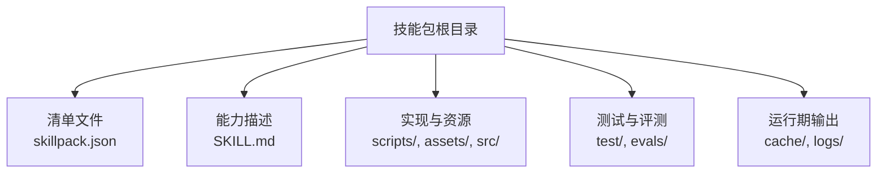
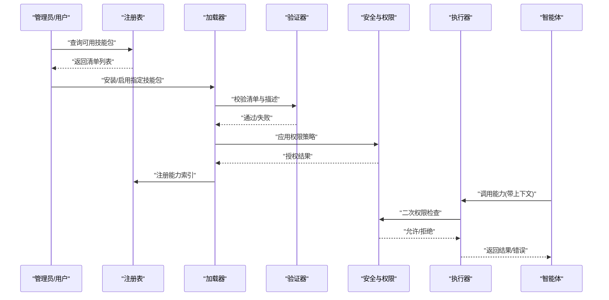
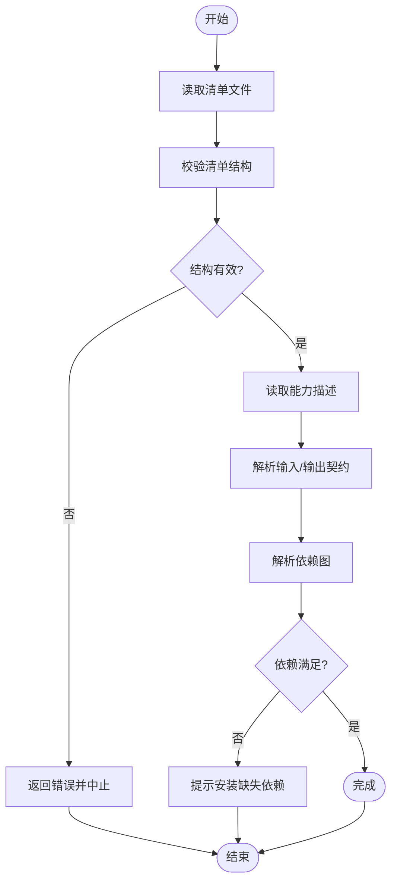
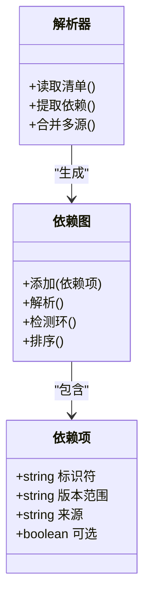
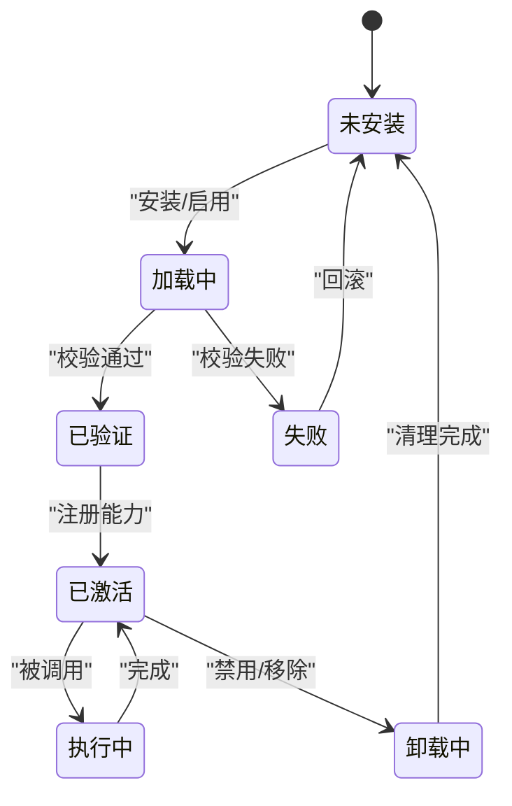
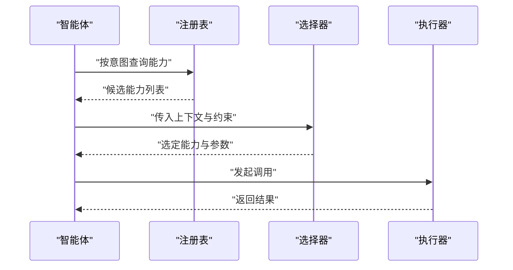
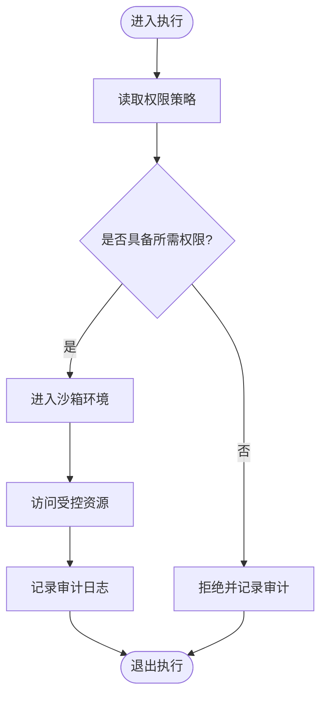
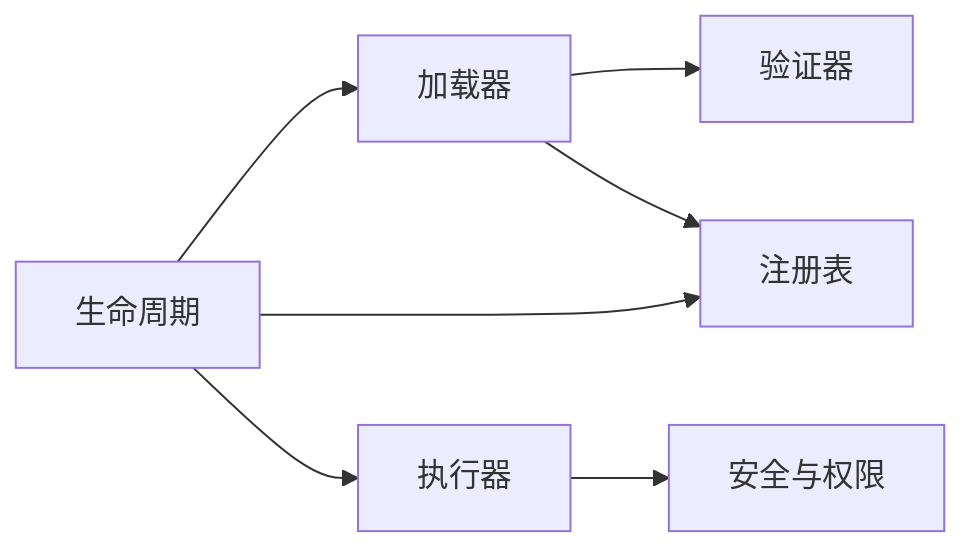

# 技能包基础概念

<cite>
**本文引用的文件**   
- [GBRAIN_SKILLPACK.md](file://docs/GBRAIN_SKILLPACK.md)
- [skillpack-anatomy.md](file://docs/skillpack-anatomy.md)
- [examples/skillpack-reference/skillpack.json](file://examples/skillpack-reference/skillpack.json)
- [skills/manifest.json](file://skills/manifest.json)
- [src/core/skillpack/index.ts](file://src/core/skillpack/index.ts)
- [src/core/skillpack/loader.ts](file://src/core/skillpack/loader.ts)
- [src/core/skillpack/validator.ts](file://src/core/skillpack/validator.ts)
- [src/core/skillpack/executor.ts](file://src/core/skillpack/executor.ts)
- [src/core/skillpack/unloader.ts](file://src/core/skillpack/unloader.ts)
- [src/core/skillpack/security.ts](file://src/core/skillpack/security.ts)
- [src/core/skillpack/registry.ts](file://src/core/skillpack/registry.ts)
- [src/core/skillpack/lifecycle.ts](file://src/core/skillpack/lifecycle.ts)
</cite>

## 目录
1. [简介](#简介)
2. [项目结构](#项目结构)
3. [核心组件](#核心组件)
4. [架构总览](#架构总览)
5. [详细组件分析](#详细组件分析)
6. [依赖分析](#依赖分析)
7. [性能考虑](#性能考虑)
8. [故障排查指南](#故障排查指南)
9. [结论](#结论)
10. [附录](#附录)

## 简介
本文件面向初学者与开发者，系统化阐述 GBrain 生态中的“技能包”（Skillpack）基础概念、设计理念与实现要点。内容涵盖：
- 技能包在 GBrain 中的作用与价值
- SKILL.md 文件格式规范、元数据定义与配置选项
- 目录组织原则、命名约定与依赖管理
- 生命周期：加载、验证、执行、卸载
- 与智能体的关系、权限模型与安全边界
- 常见问题与排障建议

## 项目结构
技能包是 GBrain 的可插拔能力单元，通常以仓库或目录形式存在，并通过清单与描述文件对外暴露能力。参考示例与文档中给出的结构，典型技能包包含：
- 清单文件：用于声明版本、入口、依赖、元数据等
- 描述文件：SKILL.md，用于人类可读的能力说明与参数契约
- 资源与脚本：实现逻辑、工具脚本、静态资源等
- 测试与评估：单元测试、集成测试、评测用例
- 运行期产物：缓存、日志、临时文件（由运行时管理）

图表来源
- [examples/skillpack-reference/skillpack.json](file://examples/skillpack-reference/skillpack.json)
- [docs/GBRAIN_SKILLPACK.md](file://docs/GBRAIN_SKILLPACK.md)
- [docs/skillpack-anatomy.md](file://docs/skillpack-anatomy.md)

章节来源
- [docs/GBRAIN_SKILLPACK.md](file://docs/GBRAIN_SKILLPACK.md)
- [docs/skillpack-anatomy.md](file://docs/skillpack-anatomy.md)
- [examples/skillpack-reference/skillpack.json](file://examples/skillpack-reference/skillpack.json)

## 核心组件
- 清单与注册表
  - 清单文件提供技能包的元数据、版本、入口点、依赖与发布渠道信息
  - 全局清单用于汇总已安装的技能包索引，便于发现与升级
- 描述文件（SKILL.md）
  - 定义能力的自然语言说明、输入输出契约、约束与注意事项
  - 作为智能体选择与编排的依据之一
- 加载器与验证器
  - 负责读取清单、校验格式与语义、解析依赖图
- 执行器
  - 将能力映射到具体可执行目标（脚本、函数、MCP 工具等），并注入上下文
- 安全与权限
  - 基于清单与策略的白名单、沙箱隔离、网络与文件系统访问控制
- 生命周期管理
  - 统一封装加载、验证、激活、执行、卸载与清理流程

章节来源
- [src/core/skillpack/index.ts](file://src/core/skillpack/index.ts)
- [src/core/skillpack/loader.ts](file://src/core/skillpack/loader.ts)
- [src/core/skillpack/validator.ts](file://src/core/skillpack/validator.ts)
- [src/core/skillpack/executor.ts](file://src/core/skillpack/executor.ts)
- [src/core/skillpack/security.ts](file://src/core/skillpack/security.ts)
- [src/core/skillpack/registry.ts](file://src/core/skillpack/registry.ts)
- [src/core/skillpack/lifecycle.ts](file://src/core/skillpack/lifecycle.ts)
- [skills/manifest.json](file://skills/manifest.json)

## 架构总览
下图展示了技能包从发现到执行的端到端流程，以及各模块之间的交互关系。

图表来源
- [src/core/skillpack/registry.ts](file://src/core/skillpack/registry.ts)
- [src/core/skillpack/loader.ts](file://src/core/skillpack/loader.ts)
- [src/core/skillpack/validator.ts](file://src/core/skillpack/validator.ts)
- [src/core/skillpack/security.ts](file://src/core/skillpack/security.ts)
- [src/core/skillpack/executor.ts](file://src/core/skillpack/executor.ts)

## 详细组件分析

### 清单与描述文件规范
- 清单文件（skillpack.json）
  - 关键字段包括：标识符、版本、名称、描述、入口点、依赖、许可证、作者、更新源等
  - 入口点指向可执行目标或能力路由
  - 依赖字段声明对其他技能包或外部资源的依赖关系
- 描述文件（SKILL.md）
  - 结构化描述能力用途、输入参数、输出格式、前置条件、副作用与限制
  - 为智能体提供选择与编排依据，也作为人类可读的技术文档

图表来源
- [examples/skillpack-reference/skillpack.json](file://examples/skillpack-reference/skillpack.json)
- [docs/GBRAIN_SKILLPACK.md](file://docs/GBRAIN_SKILLPACK.md)
- [docs/skillpack-anatomy.md](file://docs/skillpack-anatomy.md)

章节来源
- [docs/GBRAIN_SKILLPACK.md](file://docs/GBRAIN_SKILLPACK.md)
- [docs/skillpack-anatomy.md](file://docs/skillpack-anatomy.md)
- [examples/skillpack-reference/skillpack.json](file://examples/skillpack-reference/skillpack.json)

### 目录结构与命名约定
- 根目录
  - 清单文件位于根目录，便于自动发现
  - SKILL.md 位于根目录，作为能力主文档
- 实现与资源
  - scripts/：可执行脚本与工具
  - assets/：静态资源（模板、规则、字典等）
  - src/：源码（如使用编译型语言或前端工程）
- 测试与评测
  - test/：单元测试与集成测试
  - evals/：评测用例与基准
- 命名约定
  - 目录与文件采用小写加连字符风格
  - 版本号遵循语义化版本
  - 依赖标识符保持唯一且稳定

章节来源
- [docs/skillpack-anatomy.md](file://docs/skillpack-anatomy.md)

### 依赖管理机制
- 依赖类型
  - 内部依赖：其他技能包
  - 外部依赖：系统命令、网络服务、数据库等
- 解析与校验
  - 构建依赖图并进行环检测
  - 版本范围匹配与冲突解决
- 安装与更新
  - 拉取远程源、校验签名与完整性
  - 增量更新与回滚策略

图表来源
- [src/core/skillpack/loader.ts](file://src/core/skillpack/loader.ts)
- [src/core/skillpack/validator.ts](file://src/core/skillpack/validator.ts)

章节来源
- [src/core/skillpack/loader.ts](file://src/core/skillpack/loader.ts)
- [src/core/skillpack/validator.ts](file://src/core/skillpack/validator.ts)

### 生命周期：加载、验证、执行、卸载
- 加载
  - 扫描本地与远程清单，构建索引
  - 解析路径与入口点，准备执行环境
- 验证
  - 校验清单结构与必填字段
  - 校验能力契约与依赖满足性
- 执行
  - 根据调用上下文选择合适入口
  - 注入权限令牌与资源句柄
  - 捕获输出与错误，记录审计日志
- 卸载
  - 停止引用、释放资源、清理缓存
  - 更新注册表与索引

图表来源
- [src/core/skillpack/lifecycle.ts](file://src/core/skillpack/lifecycle.ts)
- [src/core/skillpack/registry.ts](file://src/core/skillpack/registry.ts)

章节来源
- [src/core/skillpack/lifecycle.ts](file://src/core/skillpack/lifecycle.ts)
- [src/core/skillpack/registry.ts](file://src/core/skillpack/registry.ts)

### 与智能体的关系
- 能力发现
  - 智能体通过注册表查询可用能力，结合意图进行匹配
- 编排与选择
  - 基于 SKILL.md 的契约与权重，智能体决定调用顺序与参数
- 上下文注入
  - 运行时向能力注入会话、身份、资源句柄等上下文
- 结果聚合
  - 多个技能包协作产出最终结果，支持重试与降级

图表来源
- [src/core/skillpack/registry.ts](file://src/core/skillpack/registry.ts)
- [src/core/skillpack/executor.ts](file://src/core/skillpack/executor.ts)

章节来源
- [src/core/skillpack/registry.ts](file://src/core/skillpack/registry.ts)
- [src/core/skillpack/executor.ts](file://src/core/skillpack/executor.ts)

### 权限模型与安全边界
- 最小权限原则
  - 默认拒绝，按需授予读写、网络、进程执行等权限
- 白名单与黑名单
  - 基于清单声明与策略配置，控制可访问的资源域
- 沙箱隔离
  - 进程级或容器级隔离，限制内存、CPU 与 I/O
- 审计与追踪
  - 记录调用链、资源访问与异常事件

图表来源
- [src/core/skillpack/security.ts](file://src/core/skillpack/security.ts)

章节来源
- [src/core/skillpack/security.ts](file://src/core/skillpack/security.ts)

### 全局清单与索引
- 全局清单（manifest.json）
  - 汇总已安装技能包的元数据，便于快速检索与批量操作
- 索引维护
  - 安装/卸载时同步更新索引
  - 支持离线模式下的本地索引

章节来源
- [skills/manifest.json](file://skills/manifest.json)

## 依赖分析
- 组件耦合
  - 加载器依赖验证器与注册表
  - 执行器依赖安全模块与上下文提供者
  - 生命周期模块协调各组件状态迁移
- 外部依赖
  - 文件系统、网络客户端、进程管理器、日志与指标采集

图表来源
- [src/core/skillpack/loader.ts](file://src/core/skillpack/loader.ts)
- [src/core/skillpack/validator.ts](file://src/core/skillpack/validator.ts)
- [src/core/skillpack/executor.ts](file://src/core/skillpack/executor.ts)
- [src/core/skillpack/security.ts](file://src/core/skillpack/security.ts)
- [src/core/skillpack/registry.ts](file://src/core/skillpack/registry.ts)
- [src/core/skillpack/lifecycle.ts](file://src/core/skillpack/lifecycle.ts)

章节来源
- [src/core/skillpack/index.ts](file://src/core/skillpack/index.ts)

## 性能考虑
- 清单与索引缓存
  - 对清单与依赖图进行持久化缓存，减少重复解析开销
- 并行加载与验证
  - 对无环依赖的子图进行并行处理，提升吞吐
- 懒加载与按需激活
  - 仅在实际调用时加载必要资源，降低启动成本
- 资源复用
  - 连接池、对象池与共享上下文，避免频繁创建销毁

[本节为通用指导，不直接分析具体文件]

## 故障排查指南
- 常见错误
  - 清单结构无效或缺失必填字段
  - 依赖版本冲突或未满足
  - 权限不足导致执行被拒
  - 网络或文件系统访问失败
- 定位方法
  - 查看注册表与索引一致性
  - 检查加载与验证阶段的日志
  - 确认安全策略与白名单配置
  - 复现最小用例并逐步缩小范围
- 恢复策略
  - 回滚到上一稳定版本
  - 清理缓存与临时文件后重试
  - 调整依赖版本范围或替换替代能力

章节来源
- [src/core/skillpack/validator.ts](file://src/core/skillpack/validator.ts)
- [src/core/skillpack/security.ts](file://src/core/skillpack/security.ts)
- [src/core/skillpack/lifecycle.ts](file://src/core/skillpack/lifecycle.ts)

## 结论
技能包为 GBrain 提供了模块化、可组合、可治理的能力扩展机制。通过清晰的清单与描述规范、严格的验证与安全边界、完善的生命周期管理与依赖治理，技能包能够在保证安全与稳定的前提下，灵活增强智能体的能力边界。建议在开发过程中遵循最小权限与契约优先原则，持续完善测试与评测体系，确保能力质量与可维护性。

## 附录
- 术语
  - 技能包：一组可被智能体调用的能力集合
  - 清单：描述技能包元数据与依赖的结构化文件
  - 描述：以自然语言与结构化片段描述能力契约的文件
  - 注册表：集中管理能力发现与索引的服务
  - 安全策略：控制资源访问与执行环境的规则集
- 最佳实践
  - 明确输入输出契约，避免隐式副作用
  - 使用语义化版本，谨慎变更破坏性接口
  - 提供详尽的测试与评测用例
  - 记录审计日志，便于问题追溯

[本节为概念性补充，不直接分析具体文件]