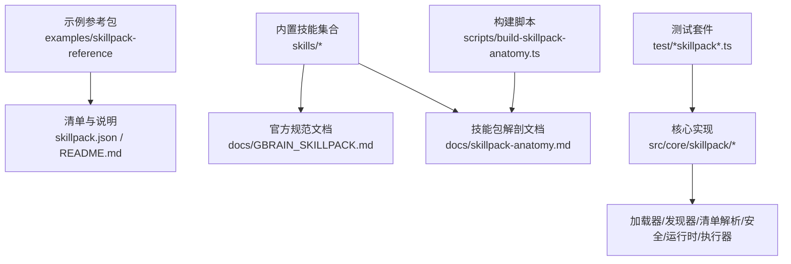
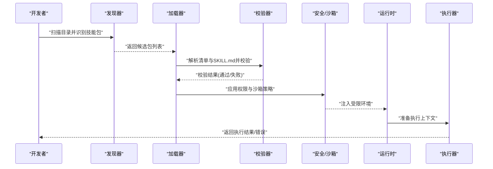

# 技能包开发指南

<cite>
**本文引用的文件**   
- [GBRAIN_SKILLPACK.md](file://docs/GBRAIN_SKILLPACK.md)
- [skillpack-anatomy.md](file://docs/skillpack-anatomy.md)
- [examples/skillpack-reference/skillpack.json](file://examples/skillpack-reference/skillpack.json)
- [examples/skillpack-reference/README.md](file://examples/skillpack-reference/README.md)
- [skills/_AGENT_README.md](file://skills/_AGENT_README.md)
- [scripts/build-skillpack-anatomy.ts](file://scripts/build-skillpack-anatomy.ts)
- [src/core/skillpack/index.ts](file://src/core/skillpack/index.ts)
- [src/core/skillpack/loader.ts](file://src/core/skillpack/loader.ts)
- [src/core/skillpack/manifest.ts](file://src/core/skillpack/manifest.ts)
- [src/core/skillpack/discovery.ts](file://src/core/skillpack/discovery.ts)
- [src/core/skillpack/security.ts](file://src/core/skillpack/security.ts)
- [src/core/skillpack/runtime.ts](file://src/core/skillpack/runtime.ts)
- [src/core/skillpack/executor.ts](file://src/core/skillpack/executor.ts)
- [src/core/skillpack/validation.ts](file://src/core/skillpack/validation.ts)
- [test/skillpack-manifest-v1.test.ts](file://test/skillpack-manifest-v1.test.ts)
- [test/skillpack-check.test.ts](file://test/skillpack-check.test.ts)
- [test/skillpack-harvest-lint.test.ts](file://test/skillpack-harvest-lint.test.ts)
- [test/skillpack-install.test.ts](file://test/skillpack-install.test.ts)
- [test/skillpack-bootstrap-display.test.ts](file://test/skillpack-bootstrap-display.test.ts)
- [test/skillpack-reference-pack-is-ten.ts](file://test/skillpack-reference-pack-is-ten.ts)
</cite>

## 目录
1. [简介](#简介)
2. [项目结构](#项目结构)
3. [核心组件](#核心组件)
4. [架构总览](#架构总览)
5. [详细组件分析](#详细组件分析)
6. [依赖关系分析](#依赖关系分析)
7. [性能考虑](#性能考虑)
8. [故障排查指南](#故障排查指南)
9. [结论](#结论)
10. [附录](#附录)

## 简介
本指南面向希望为系统构建“技能包”的开发者，系统性阐述技能包的目录组织、SKILL.md 文件格式与元数据定义、配置文件格式与依赖声明机制、执行环境与权限模型、安全沙箱实现，并提供从简单到复杂多模态技能包的逐步构建示例。同时覆盖调试技巧、日志输出、错误处理最佳实践、测试策略（单元与集成）、性能优化与内存管理建议。

## 项目结构
技能包在仓库中以“示例 + 内置 + 文档 + 工具 + 测试”的方式组织：
- 示例参考：examples/skillpack-reference 提供完整可运行的参考包，包含清单、说明、运行手册与测试样例。
- 内置技能：skills 目录下包含大量官方技能包，可作为学习模板。
- 规范文档：docs 下包含 GBRAIN_SKILLPACK.md 与 skillpack-anatomy.md，定义技能包结构与 SKILL.md 规范。
- 构建脚本：scripts/build-skillpack-anatomy.ts 用于生成或校验技能包解剖图与结构。
- 核心实现：src/core/skillpack 下包含加载、发现、清单解析、安全与运行时等模块。
- 测试用例：test 下包含清单版本、检查、安装、引导显示、参考包一致性等测试。

图示来源
- [examples/skillpack-reference/skillpack.json](file://examples/skillpack-reference/skillpack.json)
- [examples/skillpack-reference/README.md](file://examples/skillpack-reference/README.md)
- [docs/GBRAIN_SKILLPACK.md](file://docs/GBRAIN_SKILLPACK.md)
- [docs/skillpack-anatomy.md](file://docs/skillpack-anatomy.md)
- [scripts/build-skillpack-anatomy.ts](file://scripts/build-skillpack-anatomy.ts)
- [src/core/skillpack/index.ts](file://src/core/skillpack/index.ts)
- [src/core/skillpack/loader.ts](file://src/core/skillpack/loader.ts)
- [src/core/skillpack/manifest.ts](file://src/core/skillpack/manifest.ts)
- [src/core/skillpack/discovery.ts](file://src/core/skillpack/discovery.ts)
- [src/core/skillpack/security.ts](file://src/core/skillpack/security.ts)
- [src/core/skillpack/runtime.ts](file://src/core/skillpack/runtime.ts)
- [src/core/skillpack/executor.ts](file://src/core/skillpack/executor.ts)

章节来源
- [docs/GBRAIN_SKILLPACK.md](file://docs/GBRAIN_SKILLPACK.md)
- [docs/skillpack-anatomy.md](file://docs/skillpack-anatomy.md)
- [examples/skillpack-reference/skillpack.json](file://examples/skillpack-reference/skillpack.json)
- [examples/skillpack-reference/README.md](file://examples/skillpack-reference/README.md)
- [scripts/build-skillpack-anatomy.ts](file://scripts/build-skillpack-anatomy.ts)
- [src/core/skillpack/index.ts](file://src/core/skillpack/index.ts)
- [src/core/skillpack/loader.ts](file://src/core/skillpack/loader.ts)
- [src/core/skillpack/manifest.ts](file://src/core/skillpack/manifest.ts)
- [src/core/skillpack/discovery.ts](file://src/core/skillpack/discovery.ts)
- [src/core/skillpack/security.ts](file://src/core/skillpack/security.ts)
- [src/core/skillpack/runtime.ts](file://src/core/skillpack/runtime.ts)
- [src/core/skillpack/executor.ts](file://src/core/skillpack/executor.ts)

## 核心组件
- 清单与元数据
  - 清单文件：skillpack.json，描述技能包名称、版本、入口、能力、依赖、权限、资源等。
  - 技能说明：SKILL.md，定义技能行为、输入输出、触发条件、约束与安全要求。
- 加载与发现
  - 加载器负责读取并解析清单、验证字段、合并默认值。
  - 发现器扫描目录树，识别有效技能包根与子技能。
- 安全与沙箱
  - 权限模型基于清单声明与系统策略，限制网络、文件系统、进程调用等。
  - 沙箱隔离执行上下文，控制资源配额与超时。
- 运行时与执行器
  - 运行时提供环境注入、变量替换、事件总线、日志通道。
  - 执行器编排步骤、并发度、重试与回退策略。
- 校验与诊断
  - 校验器对清单与 SKILL.md 进行静态检查与兼容性断言。
  - 诊断工具输出结构化日志与指标，便于定位问题。

章节来源
- [src/core/skillpack/manifest.ts](file://src/core/skillpack/manifest.ts)
- [src/core/skillpack/loader.ts](file://src/core/skillpack/loader.ts)
- [src/core/skillpack/discovery.ts](file://src/core/skillpack/discovery.ts)
- [src/core/skillpack/security.ts](file://src/core/skillpack/security.ts)
- [src/core/skillpack/runtime.ts](file://src/core/skillpack/runtime.ts)
- [src/core/skillpack/executor.ts](file://src/core/skillpack/executor.ts)
- [src/core/skillpack/validation.ts](file://src/core/skillpack/validation.ts)

## 架构总览
下图展示技能包从发现、加载、校验到执行的端到端流程，以及安全与运行时组件的协作关系。

图示来源
- [src/core/skillpack/discovery.ts](file://src/core/skillpack/discovery.ts)
- [src/core/skillpack/loader.ts](file://src/core/skillpack/loader.ts)
- [src/core/skillpack/validation.ts](file://src/core/skillpack/validation.ts)
- [src/core/skillpack/security.ts](file://src/core/skillpack/security.ts)
- [src/core/skillpack/runtime.ts](file://src/core/skillpack/runtime.ts)
- [src/core/skillpack/executor.ts](file://src/core/skillpack/executor.ts)

## 详细组件分析

### 清单与元数据（skillpack.json）
- 关键字段
  - 标识与版本：name、version、description、license 等。
  - 入口与能力：entrypoint、capabilities、triggers、steps。
  - 依赖与资源：dependencies、assets、models、tools。
  - 权限与安全：permissions、sandbox、timeout、memory_limit。
  - 配置与扩展：config_schema、env、hooks。
- 校验规则
  - 必填字段、类型约束、枚举值、引用完整性。
  - 兼容性与弃用字段提示。
- 最佳实践
  - 明确最小权限原则，按需声明依赖。
  - 使用 config_schema 约束用户输入。
  - 为每个能力提供清晰的触发条件与输入输出契约。

章节来源
- [examples/skillpack-reference/skillpack.json](file://examples/skillpack-reference/skillpack.json)
- [src/core/skillpack/manifest.ts](file://src/core/skillpack/manifest.ts)
- [test/skillpack-manifest-v1.test.ts](file://test/skillpack-manifest-v1.test.ts)

### 技能说明（SKILL.md）
- 内容结构
  - 标题与摘要：简要描述技能用途与适用场景。
  - 触发条件：何时激活该技能（事件、模式、关键词）。
  - 输入输出：参数定义、数据类型、约束与示例。
  - 执行步骤：分阶段流程、分支逻辑、异常路径。
  - 安全与合规：访问范围、敏感数据处理、审计要求。
  - 依赖与外部服务：API、模型、工具链。
- 编写建议
  - 使用清晰的分节与表格描述输入输出。
  - 明确错误码与恢复策略。
  - 标注性能与资源影响。

章节来源
- [docs/GBRAIN_SKILLPACK.md](file://docs/GBRAIN_SKILLPACK.md)
- [docs/skillpack-anatomy.md](file://docs/skillpack-anatomy.md)
- [examples/skillpack-reference/README.md](file://examples/skillpack-reference/README.md)

### 目录结构规范
- 根级文件
  - skillpack.json：清单与元数据。
  - SKILL.md：技能说明。
  - README.md：使用说明与示例。
- 子目录约定
  - skills/：子技能或模块化能力。
  - runbooks/：操作手册与排障指南。
  - evals/：评估与基准测试。
  - test/：单元测试与集成测试。
  - assets/：静态资源与模板。
- 命名与可见性
  - 以 slug 形式命名，避免特殊字符。
  - 隐藏文件与目录不参与发现。

章节来源
- [examples/skillpack-reference/README.md](file://examples/skillpack-reference/README.md)
- [docs/skillpack-anatomy.md](file://docs/skillpack-anatomy.md)

### 配置文件格式与依赖声明
- 配置项
  - 全局配置：默认超时、并发度、重试策略。
  - 技能级配置：环境变量、密钥、模型选择。
  - 运行时配置：日志级别、指标开关、沙箱参数。
- 依赖声明
  - 内部依赖：同包内其他技能或共享模块。
  - 外部依赖：第三方工具、API、模型。
  - 版本约束：语义化版本、兼容矩阵。
- 合并与优先级
  - 默认值 < 包级配置 < 运行时配置 < 环境变量。

章节来源
- [src/core/skillpack/manifest.ts](file://src/core/skillpack/manifest.ts)
- [src/core/skillpack/loader.ts](file://src/core/skillpack/loader.ts)

### 执行环境、权限模型与安全沙箱
- 执行环境
  - 隔离容器或轻量沙箱，限制系统调用与网络访问。
  - 资源配额：CPU、内存、磁盘、时间。
- 权限模型
  - 基于清单声明的最小权限集。
  - 动态授权：按调用上下文授予临时权限。
- 安全沙箱
  - 白名单机制：允许的网络域名、文件系统路径、命令。
  - 审计与告警：记录关键操作与越权尝试。

章节来源
- [src/core/skillpack/security.ts](file://src/core/skillpack/security.ts)
- [src/core/skillpack/runtime.ts](file://src/core/skillpack/runtime.ts)

### 执行器与编排
- 编排策略
  - 顺序/并行执行、扇出/汇聚、超时与重试。
  - 幂等性与去重：避免重复执行与状态不一致。
- 错误处理
  - 分类与降级：区分可恢复与不可恢复错误。
  - 补偿与回滚：保证最终一致性。
- 观测性
  - 结构化日志、指标采集、追踪ID贯穿。

章节来源
- [src/core/skillpack/executor.ts](file://src/core/skillpack/executor.ts)
- [src/core/skillpack/runtime.ts](file://src/core/skillpack/runtime.ts)

### 开发示例：从简单到复杂多模态
- 简单文本技能
  - 目标：接收文本输入，执行规则处理，返回结构化结果。
  - 要点：定义触发条件、输入输出、基础权限。
- 带外部 API 的技能
  - 目标：调用外部服务获取数据，缓存与重试。
  - 要点：声明网络权限、超时与重试策略、错误码映射。
- 多模态技能
  - 目标：处理文本、图像、音频等多模态输入，融合推理。
  - 要点：声明模型与工具依赖、资源配额、异步流水线。
- 参考包对照
  - 使用 examples/skillpack-reference 作为蓝本，逐步添加能力与复杂度。

章节来源
- [examples/skillpack-reference/README.md](file://examples/skillpack-reference/README.md)
- [examples/skillpack-reference/skillpack.json](file://examples/skillpack-reference/skillpack.json)

### 调试技巧、日志输出与错误处理最佳实践
- 调试技巧
  - 启用详细日志与追踪 ID，定位跨步骤调用链。
  - 使用沙箱外模拟外部依赖，快速复现问题。
- 日志输出
  - 结构化 JSON 日志，包含时间戳、级别、上下文、指标。
  - 脱敏敏感信息，遵循隐私策略。
- 错误处理
  - 统一错误码与消息，提供可操作的修复建议。
  - 分级重试与熔断，防止雪崩效应。

章节来源
- [src/core/skillpack/runtime.ts](file://src/core/skillpack/runtime.ts)
- [src/core/skillpack/executor.ts](file://src/core/skillpack/executor.ts)

### 测试策略：单元测试与集成测试
- 单元测试
  - 清单解析与校验：覆盖边界与非法输入。
  - 权限与沙箱：验证最小权限与白名单生效。
  - 执行器编排：顺序/并行、超时、重试、回滚。
- 集成测试
  - 端到端流程：从发现、加载到执行的全链路。
  - 外部依赖：使用测试夹具与 Mock 服务。
- 参考测试
  - 清单版本、检查、安装、引导显示、参考包一致性。

章节来源
- [test/skillpack-manifest-v1.test.ts](file://test/skillpack-manifest-v1.test.ts)
- [test/skillpack-check.test.ts](file://test/skillpack-check.test.ts)
- [test/skillpack-harvest-lint.test.ts](file://test/skillpack-harvest-lint.test.ts)
- [test/skillpack-install.test.ts](file://test/skillpack-install.test.ts)
- [test/skillpack-bootstrap-display.test.ts](file://test/skillpack-bootstrap-display.test.ts)
- [test/skillpack-reference-pack-is-ten.ts](file://test/skillpack-reference-pack-is-ten.ts)

## 依赖关系分析
- 组件耦合
  - 加载器依赖清单解析与发现器；校验器独立于执行器。
  - 安全与运行时紧密协作，执行器消费运行时提供的上下文。
- 直接依赖
  - discovery → loader → manifest → validation → security → runtime → executor。
- 潜在循环
  - 确保运行时不反向依赖执行器，避免循环调用。
- 外部依赖
  - 网络、文件系统、模型与工具的访问需经安全层过滤。

图示来源
- [src/core/skillpack/discovery.ts](file://src/core/skillpack/discovery.ts)
- [src/core/skillpack/loader.ts](file://src/core/skillpack/loader.ts)
- [src/core/skillpack/manifest.ts](file://src/core/skillpack/manifest.ts)
- [src/core/skillpack/validation.ts](file://src/core/skillpack/validation.ts)
- [src/core/skillpack/security.ts](file://src/core/skillpack/security.ts)
- [src/core/skillpack/runtime.ts](file://src/core/skillpack/runtime.ts)
- [src/core/skillpack/executor.ts](file://src/core/skillpack/executor.ts)

章节来源
- [src/core/skillpack/index.ts](file://src/core/skillpack/index.ts)
- [src/core/skillpack/discovery.ts](file://src/core/skillpack/discovery.ts)
- [src/core/skillpack/loader.ts](file://src/core/skillpack/loader.ts)
- [src/core/skillpack/manifest.ts](file://src/core/skillpack/manifest.ts)
- [src/core/skillpack/validation.ts](file://src/core/skillpack/validation.ts)
- [src/core/skillpack/security.ts](file://src/core/skillpack/security.ts)
- [src/core/skillpack/runtime.ts](file://src/core/skillpack/runtime.ts)
- [src/core/skillpack/executor.ts](file://src/core/skillpack/executor.ts)

## 性能考虑
- 并发与批处理
  - 合理设置并发度，避免资源争用；对 I/O 密集任务采用批处理。
- 缓存与去重
  - 对频繁查询的外部结果进行缓存；对幂等操作进行去重。
- 内存管理
  - 流式处理大对象，避免一次性加载；及时释放句柄与连接。
- 超时与限流
  - 为外部调用设置超时与限流，防止慢依赖拖垮整体。
- 指标与观测
  - 采集关键指标（延迟、吞吐、错误率），结合日志与追踪进行分析。

[本节为通用指导，无需具体文件来源]

## 故障排查指南
- 常见问题
  - 清单校验失败：检查必填字段、类型与枚举值。
  - 权限不足：确认权限声明与实际访问一致。
  - 执行超时：调整超时阈值或优化外部依赖响应。
- 诊断步骤
  - 启用详细日志与追踪 ID，定位失败步骤。
  - 使用沙箱外模拟外部依赖，隔离问题域。
  - 运行检查与引导显示测试，验证包健康状态。
- 参考测试
  - 清单版本、检查、安装、引导显示、参考包一致性。

章节来源
- [test/skillpack-check.test.ts](file://test/skillpack-check.test.ts)
- [test/skillpack-bootstrap-display.test.ts](file://test/skillpack-bootstrap-display.test.ts)
- [test/skillpack-install.test.ts](file://test/skillpack-install.test.ts)
- [test/skillpack-manifest-v1.test.ts](file://test/skillpack-manifest-v1.test.ts)

## 结论
通过遵循清单与 SKILL.md 规范、采用最小权限与安全沙箱、完善执行编排与观测性，并结合系统的测试策略与性能优化建议，可以高效构建稳定、可扩展且安全的技能包。建议以参考包为起点，逐步增加复杂度，并在每个阶段进行充分验证与回归测试。

[本节为总结性内容，无需具体文件来源]

## 附录
- 相关文档
  - 技能包解剖与结构：docs/skillpack-anatomy.md
  - 官方规范：docs/GBRAIN_SKILLPACK.md
  - 内置技能参考：skills/_AGENT_README.md
- 构建与生成
  - 构建脚本：scripts/build-skillpack-anatomy.ts

章节来源
- [docs/skillpack-anatomy.md](file://docs/skillpack-anatomy.md)
- [docs/GBRAIN_SKILLPACK.md](file://docs/GBRAIN_SKILLPACK.md)
- [skills/_AGENT_README.md](file://skills/_AGENT_README.md)
- [scripts/build-skillpack-anatomy.ts](file://scripts/build-skillpack-anatomy.ts)