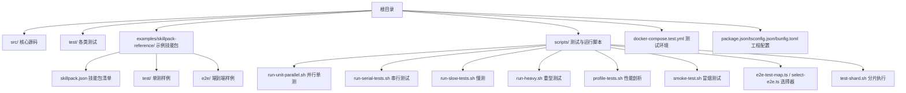
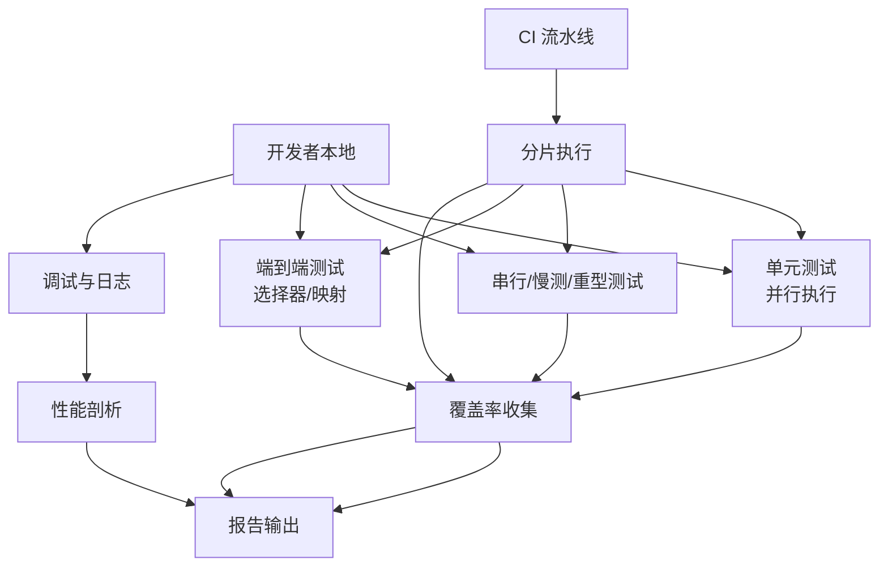
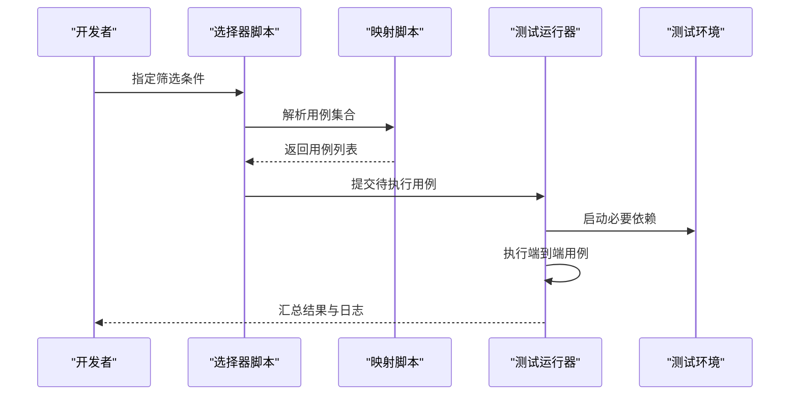
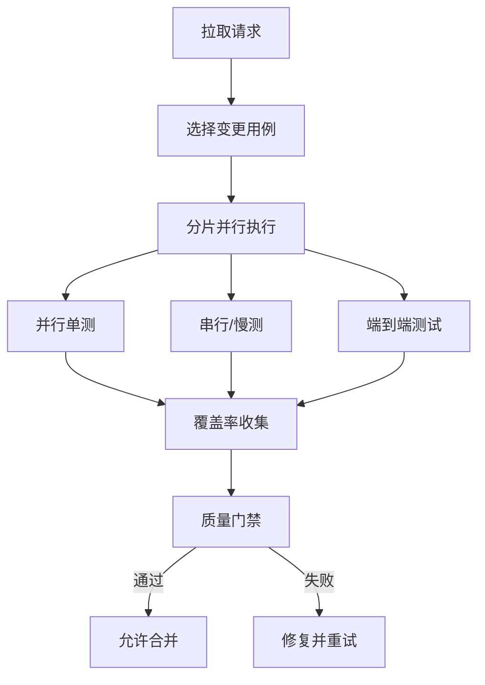
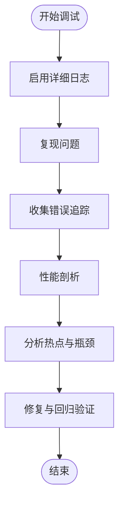
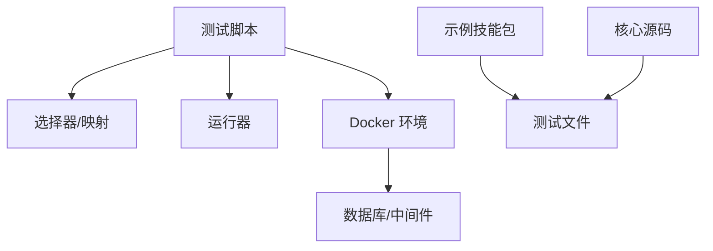

# 测试与调试

<cite>
**本文引用的文件**
- [README.md](file://README.md)
- [CONTRIBUTING.md](file://CONTRIBUTING.md)
- [docs/TESTING.md](file://docs/TESTING.md)
- [scripts/run-unit-parallel.sh](file://scripts/run-unit-parallel.sh)
- [scripts/run-serial-tests.sh](file://scripts/run-serial-tests.sh)
- [scripts/run-slow-tests.sh](file://scripts/run-slow-tests.sh)
- [scripts/run-heavy.sh](file://scripts/run-heavy.sh)
- [scripts/profile-tests.sh](file://scripts/profile-tests.sh)
- [scripts/smoke-test.sh](file://scripts/smoke-test.sh)
- [scripts/e2e-test-map.ts](file://scripts/e2e-test-map.ts)
- [scripts/select-e2e.ts](file://scripts/select-e2e.ts)
- [scripts/test-shard.sh](file://scripts/test-shard.sh)
- [scripts/ci-local.sh](file://scripts/ci-local.sh)
- [docker-compose.test.yml](file://docker-compose.test.yml)
- [package.json](file://package.json)
- [bunfig.toml](file://bunfig.toml)
- [tsconfig.json](file://tsconfig.json)
- [examples/skillpack-reference/README.md](file://examples/skillpack-reference/README.md)
- [examples/skillpack-reference/skillpack.json](file://examples/skillpack-reference/skillpack.json)
- [examples/skillpack-reference/test/index.test.ts](file://examples/skillpack-reference/test/index.test.ts)
- [examples/skillpack-reference/e2e/example.e2e.test.ts](file://examples/skillpack-reference/e2e/example.e2e.test.ts)
- [skills/testing/README.md](file://skills/testing/README.md)
</cite>

## 目录
1. [简介](#简介)
2. [项目结构](#项目结构)
3. [核心组件](#核心组件)
4. [架构总览](#架构总览)
5. [详细组件分析](#详细组件分析)
6. [依赖分析](#依赖分析)
7. [性能考虑](#性能考虑)
8. [故障排查指南](#故障排查指南)
9. [结论](#结论)
10. [附录](#附录)

## 简介
本指南面向技能包（Skillpack）开发者，提供从单元测试、集成测试到端到端测试的完整策略与实践方法，涵盖测试框架使用、用例设计、断言技巧、外部依赖模拟、边界与异常场景覆盖、覆盖率要求与持续集成配置，以及调试技巧与常见问题诊断。文档基于仓库现有脚本、示例与规范整理而成，帮助团队快速建立稳定可靠的测试与调试体系。

## 项目结构
仓库围绕“核心源码 + 大量测试 + 示例技能包 + 测试与运行脚本”组织：
- 测试代码集中于 test/ 目录，按功能域划分；同时包含 e2e/ 子目录用于端到端场景。
- 示例技能包位于 examples/skillpack-reference/，包含 skillpack.json、test/ 与 e2e/ 等，可作为编写技能包测试的参考。
- 测试执行与编排由 scripts/ 下的 shell 与 TypeScript 脚本驱动，支持并行、串行、慢测、重型测试、分片与选择执行。
- 容器化测试环境通过 docker-compose.test.yml 管理。
- 构建与类型检查由 package.json 与 tsconfig.json 管理，运行时配置在 bunfig.toml。

**图表来源**
- [scripts/run-unit-parallel.sh](file://scripts/run-unit-parallel.sh)
- [scripts/run-serial-tests.sh](file://scripts/run-serial-tests.sh)
- [scripts/run-slow-tests.sh](file://scripts/run-slow-tests.sh)
- [scripts/run-heavy.sh](file://scripts/run-heavy.sh)
- [scripts/profile-tests.sh](file://scripts/profile-tests.sh)
- [scripts/smoke-test.sh](file://scripts/smoke-test.sh)
- [scripts/e2e-test-map.ts](file://scripts/e2e-test-map.ts)
- [scripts/select-e2e.ts](file://scripts/select-e2e.ts)
- [scripts/test-shard.sh](file://scripts/test-shard.sh)
- [docker-compose.test.yml](file://docker-compose.test.yml)
- [package.json](file://package.json)
- [tsconfig.json](file://tsconfig.json)
- [bunfig.toml](file://bunfig.toml)
- [examples/skillpack-reference/skillpack.json](file://examples/skillpack-reference/skillpack.json)
- [examples/skillpack-reference/test/index.test.ts](file://examples/skillpack-reference/test/index.test.ts)
- [examples/skillpack-reference/e2e/example.e2e.test.ts](file://examples/skillpack-reference/e2e/example.e2e.test.ts)

**章节来源**
- [README.md](file://README.md)
- [CONTRIBUTING.md](file://CONTRIBUTING.md)
- [docs/TESTING.md](file://docs/TESTING.md)
- [package.json](file://package.json)
- [tsconfig.json](file://tsconfig.json)
- [bunfig.toml](file://bunfig.toml)
- [docker-compose.test.yml](file://docker-compose.test.yml)
- [examples/skillpack-reference/README.md](file://examples/skillpack-reference/README.md)

## 核心组件
- 测试分类与入口
  - 单元测试：位于 test/ 下，按模块命名，便于定位与维护。
  - 集成测试：涉及数据库、外部服务或系统交互的用例，通常标记为串行或慢测。
  - 端到端测试：位于 test/e2e/ 与 examples/skillpack-reference/e2e/，验证真实工作流。
- 测试执行工具链
  - 并行/串行/慢测/重型测试脚本，分别适配不同资源与稳定性需求。
  - 分片与选择器脚本，支持 CI 并行化与按需执行。
  - 性能剖析脚本，辅助定位热点与瓶颈。
- 示例技能包
  - examples/skillpack-reference/ 提供最小可运行的技能包结构与测试样例，包括清单、单测与 e2e 用例。

**章节来源**
- [docs/TESTING.md](file://docs/TESTING.md)
- [scripts/run-unit-parallel.sh](file://scripts/run-unit-parallel.sh)
- [scripts/run-serial-tests.sh](file://scripts/run-serial-tests.sh)
- [scripts/run-slow-tests.sh](file://scripts/run-slow-tests.sh)
- [scripts/run-heavy.sh](file://scripts/run-heavy.sh)
- [scripts/profile-tests.sh](file://scripts/profile-tests.sh)
- [scripts/smoke-test.sh](file://scripts/smoke-test.sh)
- [scripts/e2e-test-map.ts](file://scripts/e2e-test-map.ts)
- [scripts/select-e2e.ts](file://scripts/select-e2e.ts)
- [scripts/test-shard.sh](file://scripts/test-shard.sh)
- [examples/skillpack-reference/README.md](file://examples/skillpack-reference/README.md)
- [examples/skillpack-reference/skillpack.json](file://examples/skillpack-reference/skillpack.json)
- [examples/skillpack-reference/test/index.test.ts](file://examples/skillpack-reference/test/index.test.ts)
- [examples/skillpack-reference/e2e/example.e2e.test.ts](file://examples/skillpack-reference/e2e/example.e2e.test.ts)

## 架构总览
下图展示技能包测试与调试的整体流程：从本地开发到 CI 流水线，涵盖单测、集成、端到端、性能剖析与覆盖率收集。

[此图为概念性流程图，不直接映射具体源文件]

## 详细组件分析

### 测试框架与用例组织
- 框架与配置
  - 工程使用 TypeScript 与 Bun 生态，配置文件包括 package.json、tsconfig.json、bunfig.toml。
  - 测试文件以 .test.ts 结尾，集中存放于 test/ 与示例技能包的 test/ 目录。
- 用例组织建议
  - 按功能域拆分目录，保持高内聚低耦合。
  - 对需要共享状态或顺序执行的用例，采用串行或专用分组。
  - 对外部依赖进行隔离，优先使用内存或轻量替代。

**章节来源**
- [package.json](file://package.json)
- [tsconfig.json](file://tsconfig.json)
- [bunfig.toml](file://bunfig.toml)
- [docs/TESTING.md](file://docs/TESTING.md)

### 单元测试策略与断言技巧
- 目标与范围
  - 覆盖核心逻辑、边界条件与错误分支。
  - 保证幂等与可重复执行，避免共享可变状态。
- 断言技巧
  - 明确输入输出契约，关注类型与结构一致性。
  - 对异步操作使用合适的等待与超时控制。
  - 对浮点与时间相关结果进行容差比较。
- 示例参考
  - 参考示例技能包中的单测文件，了解用例结构与断言风格。

**章节来源**
- [examples/skillpack-reference/test/index.test.ts](file://examples/skillpack-reference/test/index.test.ts)
- [docs/TESTING.md](file://docs/TESTING.md)

### 集成测试策略
- 适用场景
  - 涉及数据库、文件系统、网络调用或进程间通信的逻辑。
- 环境与数据
  - 使用独立数据库实例或内存数据库，确保隔离。
  - 准备稳定的 fixtures，必要时在测试前初始化。
- 执行方式
  - 通过串行或慢测脚本执行，避免并发导致的竞争条件。

**章节来源**
- [scripts/run-serial-tests.sh](file://scripts/run-serial-tests.sh)
- [scripts/run-slow-tests.sh](file://scripts/run-slow-tests.sh)
- [docker-compose.test.yml](file://docker-compose.test.yml)
- [docs/TESTING.md](file://docs/TESTING.md)

### 端到端测试策略
- 目标与范围
  - 验证用户视角的完整流程，包括安装、运行与产出。
- 选择与分片
  - 使用选择器与映射脚本按需执行特定用例，提升反馈速度。
  - 在 CI 中结合分片脚本实现并行化。
- 示例参考
  - 参考示例技能包的 e2e 用例，理解端到端场景的组织方式。

**图表来源**
- [scripts/select-e2e.ts](file://scripts/select-e2e.ts)
- [scripts/e2e-test-map.ts](file://scripts/e2e-test-map.ts)
- [examples/skillpack-reference/e2e/example.e2e.test.ts](file://examples/skillpack-reference/e2e/example.e2e.test.ts)

**章节来源**
- [scripts/select-e2e.ts](file://scripts/select-e2e.ts)
- [scripts/e2e-test-map.ts](file://scripts/e2e-test-map.ts)
- [examples/skillpack-reference/e2e/example.e2e.test.ts](file://examples/skillpack-reference/e2e/example.e2e.test.ts)
- [docs/TESTING.md](file://docs/TESTING.md)

### 外部依赖模拟与隔离
- 模拟策略
  - 使用内存或轻量替代替换数据库、缓存、消息队列等。
  - 对网络请求使用本地代理或静态响应。
- 生命周期管理
  - 在测试前后统一启动与清理依赖，避免泄漏。
- 参考实践
  - 参考示例技能包与测试脚本中对环境的准备与清理方式。

**章节来源**
- [examples/skillpack-reference/test/index.test.ts](file://examples/skillpack-reference/test/index.test.ts)
- [docker-compose.test.yml](file://docker-compose.test.yml)
- [docs/TESTING.md](file://docs/TESTING.md)

### 边界条件与异常场景
- 边界条件
  - 空输入、极大/极小值、缺失字段、重复键等。
- 异常场景
  - 网络超时、权限不足、资源耗尽、格式非法等。
- 验证要点
  - 确认错误码、错误信息与恢复路径符合预期。
  - 记录关键上下文以便复现与定位。

**章节来源**
- [docs/TESTING.md](file://docs/TESTING.md)

### 覆盖率要求与报告
- 覆盖率指标
  - 行覆盖率、分支覆盖率、函数覆盖率等。
- 收集与报告
  - 在并行与串行测试后统一收集并生成报告。
- 基线与门禁
  - 设定最低阈值，未达标时阻断合并。

**章节来源**
- [scripts/run-unit-parallel.sh](file://scripts/run-unit-parallel.sh)
- [scripts/run-serial-tests.sh](file://scripts/run-serial-tests.sh)
- [scripts/run-slow-tests.sh](file://scripts/run-slow-tests.sh)
- [docs/TESTING.md](file://docs/TESTING.md)

### 持续集成配置
- 本地与 CI 一致性
  - 使用 docker-compose.test.yml 拉起依赖，确保环境一致。
- 并行与分片
  - 在 CI 中使用分片脚本将用例集切分为多个任务并行执行。
- 选择与回归
  - 使用选择器仅执行变更相关的用例，缩短反馈周期。
- 冒烟与质量门
  - 在合并前执行冒烟测试与基础质量检查。

**图表来源**
- [scripts/select-e2e.ts](file://scripts/select-e2e.ts)
- [scripts/test-shard.sh](file://scripts/test-shard.sh)
- [scripts/run-unit-parallel.sh](file://scripts/run-unit-parallel.sh)
- [scripts/run-serial-tests.sh](file://scripts/run-serial-tests.sh)
- [scripts/run-slow-tests.sh](file://scripts/run-slow-tests.sh)
- [docker-compose.test.yml](file://docker-compose.test.yml)

**章节来源**
- [scripts/ci-local.sh](file://scripts/ci-local.sh)
- [scripts/test-shard.sh](file://scripts/test-shard.sh)
- [scripts/select-e2e.ts](file://scripts/select-e2e.ts)
- [docker-compose.test.yml](file://docker-compose.test.yml)
- [docs/TESTING.md](file://docs/TESTING.md)

### 调试技巧与工具
- 日志输出
  - 在关键路径添加结构化日志，包含上下文与追踪 ID。
  - 区分级别（debug/info/warn/error），避免泄露敏感信息。
- 错误追踪
  - 捕获并上报堆栈与上下文，便于回溯问题。
- 性能剖析
  - 使用性能剖析脚本定位热点与瓶颈，结合采样与火焰图分析。
- 常见调试命令
  - 使用冒烟测试快速验证基本链路。
  - 针对慢测与重型测试单独执行，减少干扰。

**图表来源**
- [scripts/profile-tests.sh](file://scripts/profile-tests.sh)
- [scripts/smoke-test.sh](file://scripts/smoke-test.sh)

**章节来源**
- [scripts/profile-tests.sh](file://scripts/profile-tests.sh)
- [scripts/smoke-test.sh](file://scripts/smoke-test.sh)
- [docs/TESTING.md](file://docs/TESTING.md)

### 示例技能包测试参考
- 清单与结构
  - 通过 skillpack.json 定义技能包元数据与依赖。
- 单测与端到端
  - test/ 与 e2e/ 目录提供最小可用样例，便于对照编写。
- 最佳实践
  - 保持用例小而精，聚焦单一职责。
  - 对不稳定依赖进行隔离与重试。

**章节来源**
- [examples/skillpack-reference/README.md](file://examples/skillpack-reference/README.md)
- [examples/skillpack-reference/skillpack.json](file://examples/skillpack-reference/skillpack.json)
- [examples/skillpack-reference/test/index.test.ts](file://examples/skillpack-reference/test/index.test.ts)
- [examples/skillpack-reference/e2e/example.e2e.test.ts](file://examples/skillpack-reference/e2e/example.e2e.test.ts)

### 技能包测试能力说明
- 官方测试能力
  - skills/testing/ 提供与测试相关的工具与说明，可用于增强技能包的可测试性与可观测性。

**章节来源**
- [skills/testing/README.md](file://skills/testing/README.md)

## 依赖分析
- 内部依赖
  - 测试脚本之间通过选择器与映射解耦，降低耦合度。
  - 示例技能包与核心测试相互独立，便于复用与扩展。
- 外部依赖
  - 通过 docker-compose.test.yml 管理数据库与中间件，确保环境一致性。
- 潜在风险
  - 共享状态与全局变量可能导致竞态条件，应尽量避免。
  - 外部服务不稳定会影响测试通过率，需做好隔离与重试。

**图表来源**
- [scripts/select-e2e.ts](file://scripts/select-e2e.ts)
- [scripts/e2e-test-map.ts](file://scripts/e2e-test-map.ts)
- [docker-compose.test.yml](file://docker-compose.test.yml)
- [examples/skillpack-reference/test/index.test.ts](file://examples/skillpack-reference/test/index.test.ts)
- [examples/skillpack-reference/e2e/example.e2e.test.ts](file://examples/skillpack-reference/e2e/example.e2e.test.ts)

**章节来源**
- [scripts/select-e2e.ts](file://scripts/select-e2e.ts)
- [scripts/e2e-test-map.ts](file://scripts/e2e-test-map.ts)
- [docker-compose.test.yml](file://docker-compose.test.yml)
- [examples/skillpack-reference/test/index.test.ts](file://examples/skillpack-reference/test/index.test.ts)
- [examples/skillpack-reference/e2e/example.e2e.test.ts](file://examples/skillpack-reference/e2e/example.e2e.test.ts)

## 性能考虑
- 并行与分片
  - 合理设置并行度，避免资源争用导致抖动。
  - 使用分片将大套件拆分为多任务，缩短整体耗时。
- 资源隔离
  - 为重型测试分配独立资源，避免影响其他任务。
- 剖析与优化
  - 定期运行性能剖析，识别热点与瓶颈，针对性优化。

**章节来源**
- [scripts/run-unit-parallel.sh](file://scripts/run-unit-parallel.sh)
- [scripts/test-shard.sh](file://scripts/test-shard.sh)
- [scripts/run-heavy.sh](file://scripts/run-heavy.sh)
- [scripts/profile-tests.sh](file://scripts/profile-tests.sh)

## 故障排查指南
- 常见问题
  - 测试不稳定：检查共享状态、随机种子与外部依赖可用性。
  - 超时失败：调整超时阈值或优化慢路径。
  - 覆盖率不达标：补充边界与异常用例。
- 定位步骤
  - 启用详细日志与错误追踪，复现问题并收集上下文。
  - 使用选择器缩小范围，逐步定位问题用例。
  - 运行性能剖析，识别热点与瓶颈。
- 解决建议
  - 隔离外部依赖，增加重试与退避策略。
  - 引入确定性数据与固定时钟，提高可重复性。
  - 完善断言与错误信息，提升可读性与可维护性。

**章节来源**
- [scripts/select-e2e.ts](file://scripts/select-e2e.ts)
- [scripts/profile-tests.sh](file://scripts/profile-tests.sh)
- [docs/TESTING.md](file://docs/TESTING.md)

## 结论
通过分层测试策略、完善的工具链与严格的 CI 门禁，可以显著提升技能包的质量与交付效率。建议团队遵循本指南的最佳实践，持续改进测试覆盖与调试能力，确保产品稳定可靠。

## 附录
- 常用命令与脚本
  - 并行单测、串行测试、慢测、重型测试、性能剖析、冒烟测试、分片执行、选择器与映射。
- 参考示例
  - 示例技能包的清单、单测与端到端用例，可作为模板与对照。

**章节来源**
- [scripts/run-unit-parallel.sh](file://scripts/run-unit-parallel.sh)
- [scripts/run-serial-tests.sh](file://scripts/run-serial-tests.sh)
- [scripts/run-slow-tests.sh](file://scripts/run-slow-tests.sh)
- [scripts/run-heavy.sh](file://scripts/run-heavy.sh)
- [scripts/profile-tests.sh](file://scripts/profile-tests.sh)
- [scripts/smoke-test.sh](file://scripts/smoke-test.sh)
- [scripts/test-shard.sh](file://scripts/test-shard.sh)
- [scripts/select-e2e.ts](file://scripts/select-e2e.ts)
- [scripts/e2e-test-map.ts](file://scripts/e2e-test-map.ts)
- [examples/skillpack-reference/README.md](file://examples/skillpack-reference/README.md)
- [examples/skillpack-reference/skillpack.json](file://examples/skillpack-reference/skillpack.json)
- [examples/skillpack-reference/test/index.test.ts](file://examples/skillpack-reference/test/index.test.ts)
- [examples/skillpack-reference/e2e/example.e2e.test.ts](file://examples/skillpack-reference/e2e/example.e2e.test.ts)