# 技能包生命周期管理

<cite>
**本文引用的文件**   
- [GBRAIN_SKILLPACK.md](file://docs/GBRAIN_SKILLPACK.md)
- [skillpack-anatomy.md](file://docs/skillpack-anatomy.md)
- [manifest.json](file://skills/manifest.json)
- [RESOLVER.md](file://skills/RESOLVER.md)
- [_AGENT_README.md](file://skills/_AGENT_README.md)
- [openclaw.plugin.json](file://openclaw.plugin.json)
- [cli.ts](file://src/cli.ts)
- [admin-embedded.ts](file://src/admin-embedded.ts)
- [version.ts](file://src/version.ts)
- [schema.sql](file://src/schema.sql)
</cite>

## 目录
1. [简介](#简介)
2. [项目结构](#项目结构)
3. [核心组件](#核心组件)
4. [架构总览](#架构总览)
5. [详细组件分析](#详细组件分析)
6. [依赖分析](#依赖分析)
7. [性能考虑](#性能考虑)
8. [故障排除指南](#故障排除指南)
9. [结论](#结论)
10. [附录](#附录)

## 简介
本文件系统性阐述“技能包”的完整生命周期管理，覆盖注册、加载、初始化、执行与卸载；版本管理与依赖解析算法及冲突解决策略；状态管理、持久化与恢复；热重载、动态更新与灰度发布；安全验证、权限检查与沙箱隔离；监控、诊断与排障；以及备份、迁移与清理操作。文档面向工程与非工程读者，力求以渐进方式呈现从概念到实现细节的全景视图。

## 项目结构
仓库围绕“技能包规范与示例 + 运行时入口 + 元数据与配置”组织：
- 文档层：定义技能包格式、解剖结构与使用指南
- 示例与清单：提供参考技能包与全局清单
- 运行时入口：CLI、嵌入式管理端、版本信息
- 存储模式：数据库模式定义（用于状态与元数据）

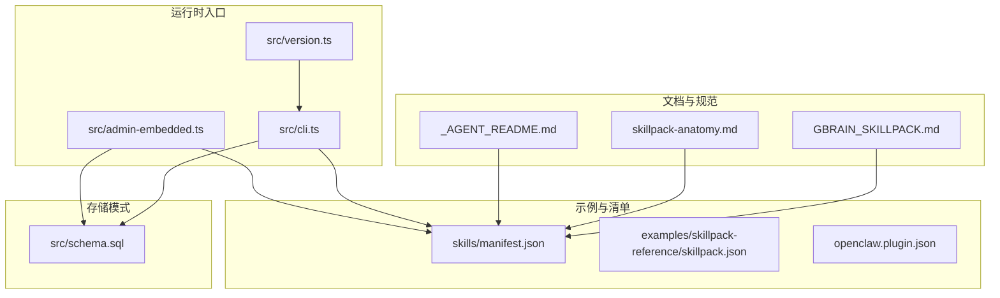

图表来源
- [GBRAIN_SKILLPACK.md:1-200](file://docs/GBRAIN_SKILLPACK.md#L1-L200)
- [skillpack-anatomy.md:1-200](file://docs/skillpack-anatomy.md#L1-L200)
- [manifest.json:1-200](file://skills/manifest.json#L1-L200)
- [cli.ts:1-200](file://src/cli.ts#L1-L200)
- [admin-embedded.ts:1-200](file://src/admin-embedded.ts#L1-L200)
- [version.ts:1-200](file://src/version.ts#L1-L200)
- [schema.sql:1-200](file://src/schema.sql#L1-L200)

章节来源
- [GBRAIN_SKILLPACK.md:1-200](file://docs/GBRAIN_SKILLPACK.md#L1-L200)
- [skillpack-anatomy.md:1-200](file://docs/skillpack-anatomy.md#L1-L200)
- [manifest.json:1-200](file://skills/manifest.json#L1-L200)
- [cli.ts:1-200](file://src/cli.ts#L1-L200)
- [admin-embedded.ts:1-200](file://src/admin-embedded.ts#L1-L200)
- [version.ts:1-200](file://src/version.ts#L1-L200)
- [schema.sql:1-200](file://src/schema.sql#L1-L200)

## 核心组件
- 技能包规范与解剖
  - 技能包清单（manifest）字段约定、能力声明、触发器、资源与元数据
  - 技能包解剖结构：目录组织、入口文件、配置文件、测试与运行手册
- 全局清单与插件描述
  - 全局清单聚合已安装/可用技能包
  - 插件描述文件用于外部生态集成
- 运行时入口
  - CLI：安装、启用、禁用、卸载、升级、查询等命令
  - 嵌入式管理端：Web/HTTP 接口暴露的管理能力
  - 版本信息：构建与运行时版本标识
- 存储模式
  - 持久化状态、元数据、索引与审计日志的表结构

章节来源
- [GBRAIN_SKILLPACK.md:1-200](file://docs/GBRAIN_SKILLPACK.md#L1-L200)
- [skillpack-anatomy.md:1-200](file://docs/skillpack-anatomy.md#L1-L200)
- [manifest.json:1-200](file://skills/manifest.json#L1-L200)
- [openclaw.plugin.json:1-200](file://openclaw.plugin.json#L1-L200)
- [cli.ts:1-200](file://src/cli.ts#L1-L200)
- [admin-embedded.ts:1-200](file://src/admin-embedded.ts#L1-L200)
- [version.ts:1-200](file://src/version.ts#L1-L200)
- [schema.sql:1-200](file://src/schema.sql#L1-L200)

## 架构总览
下图展示技能包在系统中的关键交互：清单解析、注册发现、加载初始化、执行调度、状态持久化与卸载回收。

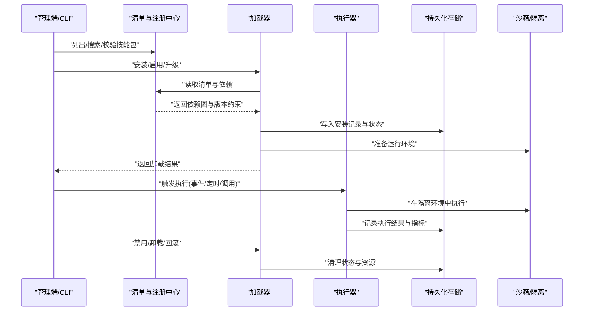

图表来源
- [cli.ts:1-200](file://src/cli.ts#L1-L200)
- [admin-embedded.ts:1-200](file://src/admin-embedded.ts#L1-L200)
- [manifest.json:1-200](file://skills/manifest.json#L1-L200)
- [schema.sql:1-200](file://src/schema.sql#L1-L200)

## 详细组件分析

### 技能包清单与解剖
- 清单字段
  - 标识与版本：唯一ID、语义化版本、兼容性矩阵
  - 能力与触发器：工具、事件、定时任务、MCP/HTTP 钩子
  - 依赖与范围：内部/外部依赖、版本区间、可选依赖
  - 资源与权限：文件系统访问、网络、密钥、环境变量
  - 元数据：作者、许可证、文档链接、变更日志
- 解剖结构
  - 根清单、入口脚本、能力实现、测试套件、运行手册
  - 多语言/多运行时适配说明

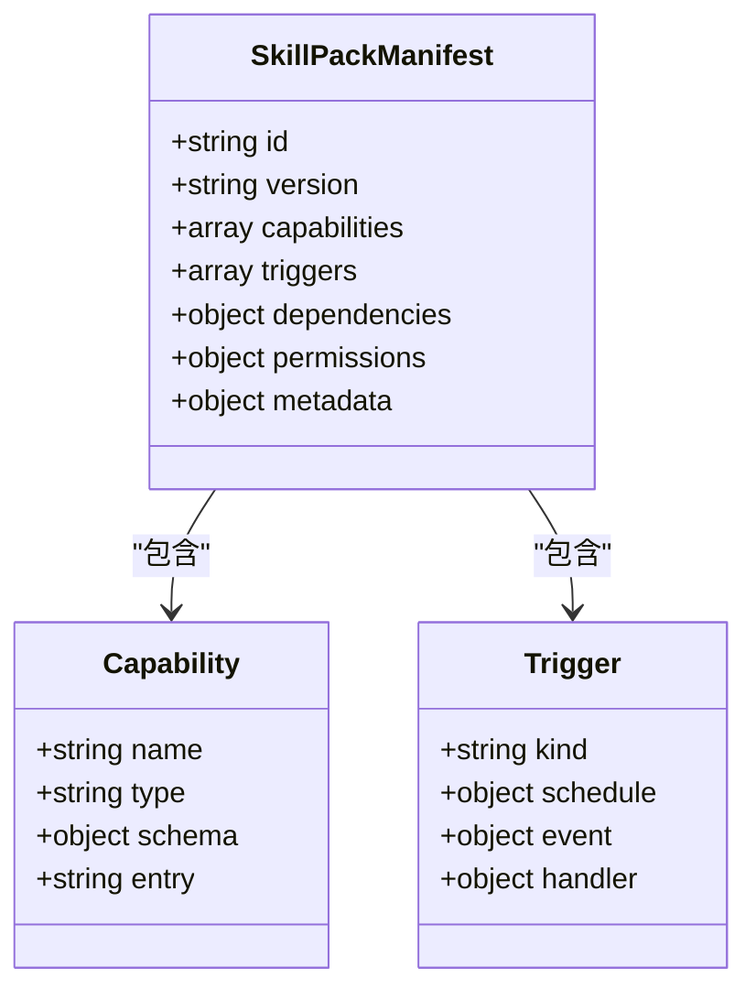

图表来源
- [GBRAIN_SKILLPACK.md:1-200](file://docs/GBRAIN_SKILLPACK.md#L1-L200)
- [skillpack-anatomy.md:1-200](file://docs/skillpack-anatomy.md#L1-L200)

章节来源
- [GBRAIN_SKILLPACK.md:1-200](file://docs/GBRAIN_SKILLPACK.md#L1-L200)
- [skillpack-anatomy.md:1-200](file://docs/skillpack-anatomy.md#L1-L200)

### 注册与发现
- 注册流程
  - 扫描本地/远程清单，去重与指纹校验
  - 将可用技能包登记至注册中心，建立索引
- 发现机制
  - 按标签、能力、触发器检索
  - 支持别名与命名空间

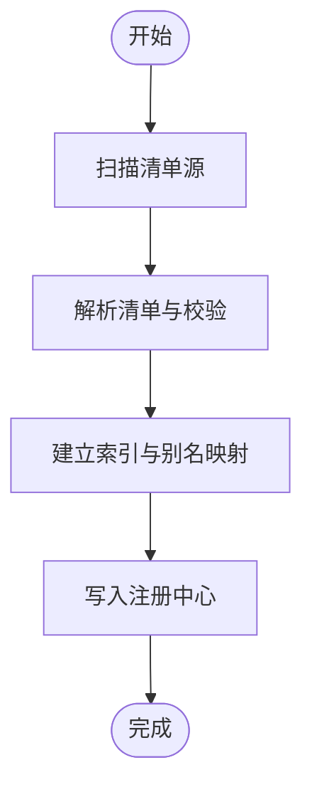

图表来源
- [manifest.json:1-200](file://skills/manifest.json#L1-L200)
- [cli.ts:1-200](file://src/cli.ts#L1-L200)

章节来源
- [manifest.json:1-200](file://skills/manifest.json#L1-L200)
- [cli.ts:1-200](file://src/cli.ts#L1-L200)

### 加载与初始化
- 加载步骤
  - 解析依赖图，进行拓扑排序
  - 校验版本兼容性与冲突
  - 下载/解压/缓存资源
  - 注入权限与环境变量
  - 初始化能力与触发器
- 初始化要点
  - 预编译/预热
  - 连接外部服务（鉴权、限流）
  - 注册回调与路由

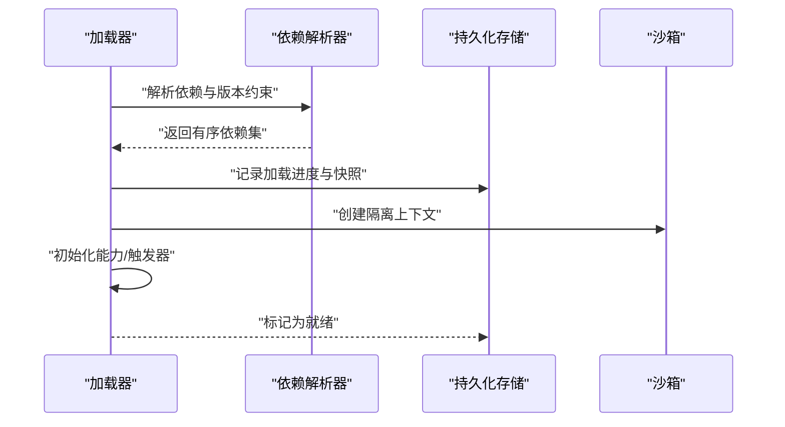

图表来源
- [cli.ts:1-200](file://src/cli.ts#L1-L200)
- [schema.sql:1-200](file://src/schema.sql#L1-L200)

章节来源
- [cli.ts:1-200](file://src/cli.ts#L1-L200)
- [schema.sql:1-200](file://src/schema.sql#L1-L200)

### 执行与调度
- 触发类型
  - 事件驱动、定时任务、HTTP/MCP 调用、用户指令
- 执行模型
  - 单实例串行或并发控制
  - 超时、重试、熔断与降级
  - 输出标准化与审计日志
- 编排与路由
  - 基于能力/标签的路由
  - 多技能协作与消息传递

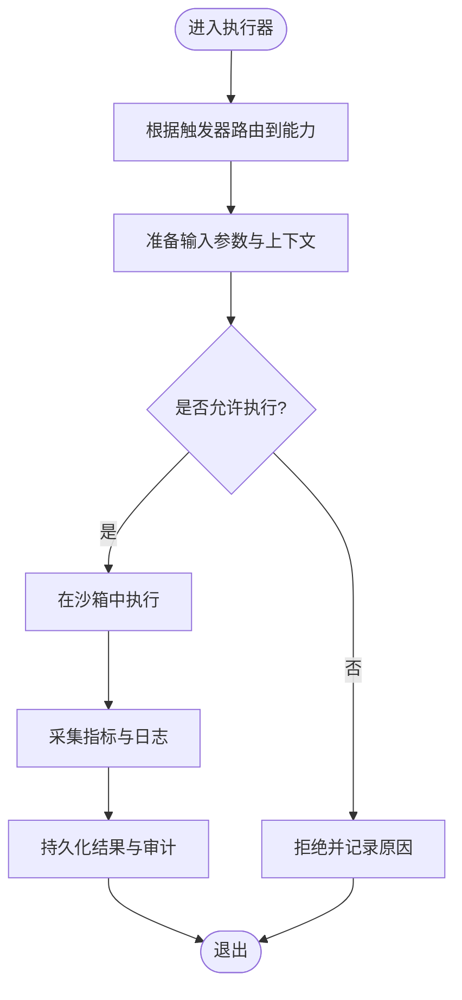

图表来源
- [cli.ts:1-200](file://src/cli.ts#L1-L200)
- [admin-embedded.ts:1-200](file://src/admin-embedded.ts#L1-L200)
- [schema.sql:1-200](file://src/schema.sql#L1-L200)

章节来源
- [cli.ts:1-200](file://src/cli.ts#L1-L200)
- [admin-embedded.ts:1-200](file://src/admin-embedded.ts#L1-L200)
- [schema.sql:1-200](file://src/schema.sql#L1-L200)

### 卸载与回收
- 卸载流程
  - 停止所有运行中的实例
  - 移除注册项与索引
  - 清理缓存与临时文件
  - 回滚关联状态与依赖
- 回收策略
  - 保留审计日志与必要元数据
  - 释放外部资源（连接、锁、队列）

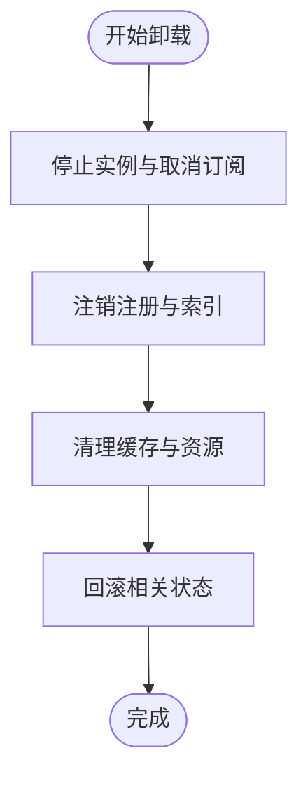

图表来源
- [cli.ts:1-200](file://src/cli.ts#L1-L200)
- [schema.sql:1-200](file://src/schema.sql#L1-L200)

章节来源
- [cli.ts:1-200](file://src/cli.ts#L1-L200)
- [schema.sql:1-200](file://src/schema.sql#L1-L200)

### 版本管理与依赖解析
- 版本策略
  - 语义化版本与兼容性矩阵
  - 最小/最大版本约束、主版本不兼容警告
- 依赖解析算法
  - 构建依赖图，检测环与缺失
  - 拓扑排序确定加载顺序
  - 冲突检测与协商策略（优先最新稳定版、可回退到兼容分支）
- 冲突解决
  - 同能力多版本共存时的路由选择
  - 强制锁定与白名单机制
  - 冲突告警与人工确认

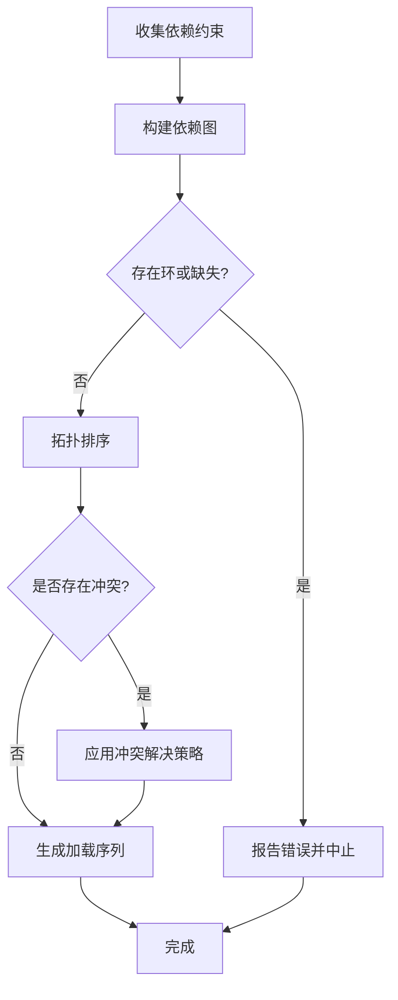

图表来源
- [RESOLVER.md:1-200](file://skills/RESOLVER.md#L1-L200)
- [cli.ts:1-200](file://src/cli.ts#L1-L200)

章节来源
- [RESOLVER.md:1-200](file://skills/RESOLVER.md#L1-L200)
- [cli.ts:1-200](file://src/cli.ts#L1-L200)

### 状态管理、持久化与恢复
- 状态机
  - 未安装/已安装/已启用/已禁用/加载中/就绪/运行中/异常/卸载中
- 持久化
  - 安装记录、版本快照、依赖关系、执行历史、审计日志
- 恢复机制
  - 启动时重建注册表与索引
  - 失败回滚与断点续载
  - 健康检查与自愈

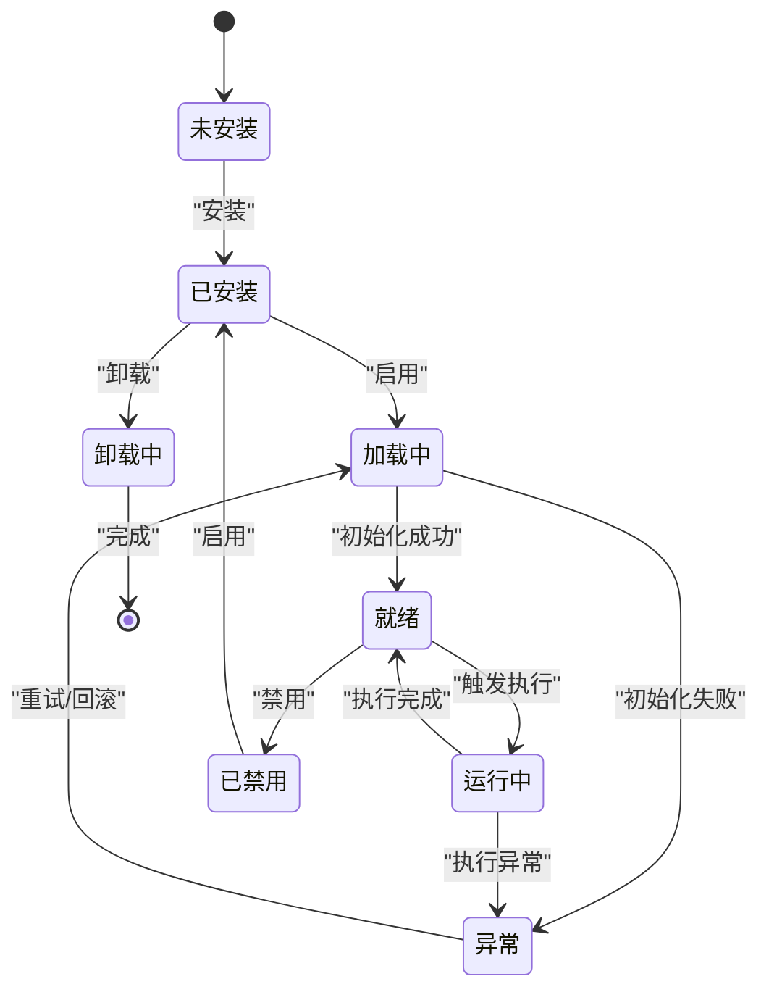

图表来源
- [schema.sql:1-200](file://src/schema.sql#L1-L200)
- [cli.ts:1-200](file://src/cli.ts#L1-L200)

章节来源
- [schema.sql:1-200](file://src/schema.sql#L1-L200)
- [cli.ts:1-200](file://src/cli.ts#L1-L200)

### 热重载、动态更新与灰度发布
- 热重载
  - 在不中断运行的情况下替换能力实现
  - 增量加载与原子切换
- 动态更新
  - 拉取新版本、差异校验、并行加载
  - 自动回滚与人工审批通道
- 灰度发布
  - 按租户/标签/权重分流
  - 逐步放量与指标观测
  - 快速切回与全量发布

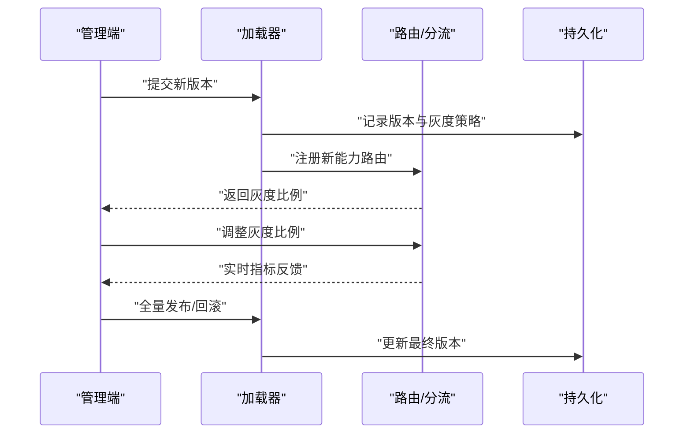

图表来源
- [cli.ts:1-200](file://src/cli.ts#L1-L200)
- [admin-embedded.ts:1-200](file://src/admin-embedded.ts#L1-L200)
- [schema.sql:1-200](file://src/schema.sql#L1-L200)

章节来源
- [cli.ts:1-200](file://src/cli.ts#L1-L200)
- [admin-embedded.ts:1-200](file://src/admin-embedded.ts#L1-L200)
- [schema.sql:1-200](file://src/schema.sql#L1-L200)

### 安全验证、权限检查与沙箱隔离
- 安全验证
  - 清单签名校验、完整性哈希、来源可信度
  - 敏感字段脱敏与白名单
- 权限检查
  - 能力级权限声明与最小授权原则
  - 运行时权限令牌与访问边界
- 沙箱隔离
  - 进程/线程隔离、内存与CPU限额
  - 文件系统与网络访问控制
  - 异常捕获与崩溃隔离

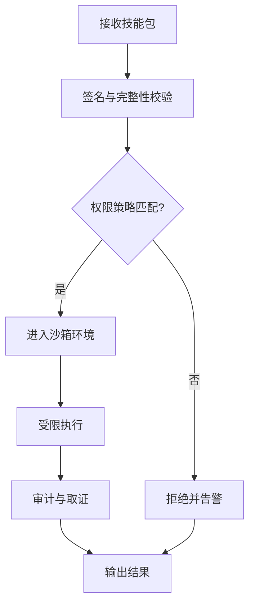

图表来源
- [cli.ts:1-200](file://src/cli.ts#L1-L200)
- [admin-embedded.ts:1-200](file://src/admin-embedded.ts#L1-L200)

章节来源
- [cli.ts:1-200](file://src/cli.ts#L1-L200)
- [admin-embedded.ts:1-200](file://src/admin-embedded.ts#L1-L200)

### 监控、诊断与故障排除
- 监控指标
  - 加载耗时、执行成功率、延迟分布、资源占用
  - 依赖解析失败率、冲突次数、回滚次数
- 诊断工具
  - 清单校验、依赖图可视化、冲突定位
  - 执行轨迹回放与快照对比
- 排障方法
  - 查看审计日志与错误码
  - 隔离复现与最小用例
  - 灰度回退与版本锁定

章节来源
- [cli.ts:1-200](file://src/cli.ts#L1-L200)
- [admin-embedded.ts:1-200](file://src/admin-embedded.ts#L1-L200)
- [schema.sql:1-200](file://src/schema.sql#L1-L200)

### 备份、迁移与清理
- 备份
  - 导出清单、状态、索引与审计日志
  - 打包技能包与依赖快照
- 迁移
  - 跨版本迁移脚本与兼容性检查
  - 增量同步与断点续传
- 清理
  - 清理无用版本与缓存
  - 归档与压缩旧数据

章节来源
- [cli.ts:1-200](file://src/cli.ts#L1-L200)
- [schema.sql:1-200](file://src/schema.sql#L1-L200)

## 依赖分析
- 组件耦合
  - CLI与管理端通过清单与注册中心交互
  - 加载器依赖解析器与存储
  - 执行器依赖沙箱与存储
- 外部依赖
  - 版本信息与构建产物
  - 插件描述文件用于生态集成

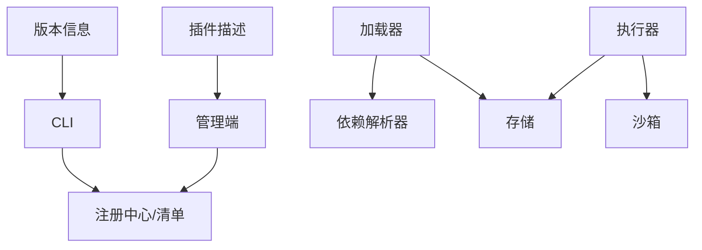

图表来源
- [cli.ts:1-200](file://src/cli.ts#L1-L200)
- [admin-embedded.ts:1-200](file://src/admin-embedded.ts#L1-L200)
- [version.ts:1-200](file://src/version.ts#L1-L200)
- [openclaw.plugin.json:1-200](file://openclaw.plugin.json#L1-L200)

章节来源
- [cli.ts:1-200](file://src/cli.ts#L1-L200)
- [admin-embedded.ts:1-200](file://src/admin-embedded.ts#L1-L200)
- [version.ts:1-200](file://src/version.ts#L1-L200)
- [openclaw.plugin.json:1-200](file://openclaw.plugin.json#L1-L200)

## 性能考虑
- 依赖解析优化
  - 缓存依赖图与解析结果
  - 增量更新与懒加载
- 加载与初始化
  - 并行加载非冲突模块
  - 预热与连接池复用
- 执行与调度
  - 批处理与流水线
  - 超时与限流保护
- 存储与索引
  - 读写分离与索引优化
  - 定期归档与压缩

[本节为通用指导，无需具体文件引用]

## 故障排除指南
- 常见问题
  - 依赖冲突与版本不兼容
  - 权限不足导致加载失败
  - 沙箱限制引发执行异常
- 排查步骤
  - 查看清单校验与依赖解析日志
  - 核对权限策略与白名单
  - 在沙箱内最小化复现
- 恢复建议
  - 回滚到上一稳定版本
  - 锁定冲突依赖版本
  - 重新初始化并重建索引

章节来源
- [cli.ts:1-200](file://src/cli.ts#L1-L200)
- [admin-embedded.ts:1-200](file://src/admin-embedded.ts#L1-L200)
- [schema.sql:1-200](file://src/schema.sql#L1-L200)

## 结论
本文件系统化梳理了技能包从注册到卸载的全生命周期，涵盖版本与依赖管理、状态与持久化、热重载与灰度发布、安全与隔离、监控与排障、备份迁移与清理。通过清晰的架构图与流程图，帮助读者快速理解系统设计与实践要点，并为后续扩展与维护提供依据。

[本节为总结性内容，无需具体文件引用]

## 附录
- 术语表
  - 技能包：一组可插拔的能力集合，含清单、实现与元数据
  - 清单：描述技能包结构、依赖与权限的元数据文件
  - 沙箱：受控的执行环境，限制资源与访问
- 参考路径
  - 清单与解剖：[GBRAIN_SKILLPACK.md](file://docs/GBRAIN_SKILLPACK.md)、[skillpack-anatomy.md](file://docs/skillpack-anatomy.md)
  - 示例清单：[manifest.json](file://skills/manifest.json)
  - 依赖解析：[RESOLVER.md](file://skills/RESOLVER.md)
  - 运行时入口：[cli.ts](file://src/cli.ts)、[admin-embedded.ts](file://src/admin-embedded.ts)
  - 版本信息：[version.ts](file://src/version.ts)
  - 存储模式：[schema.sql](file://src/schema.sql)
  - 插件描述：[openclaw.plugin.json](file://openclaw.plugin.json)

[本节为补充信息，无需具体文件引用]