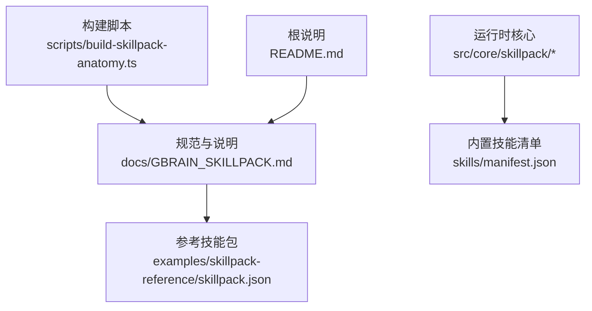
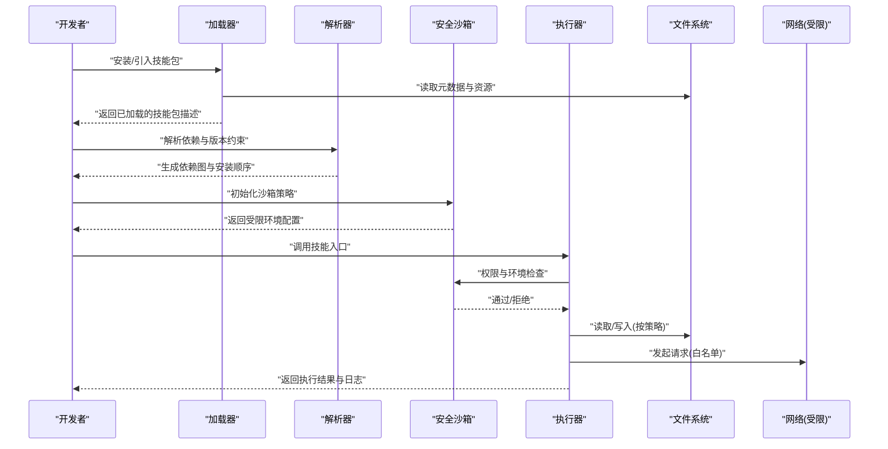
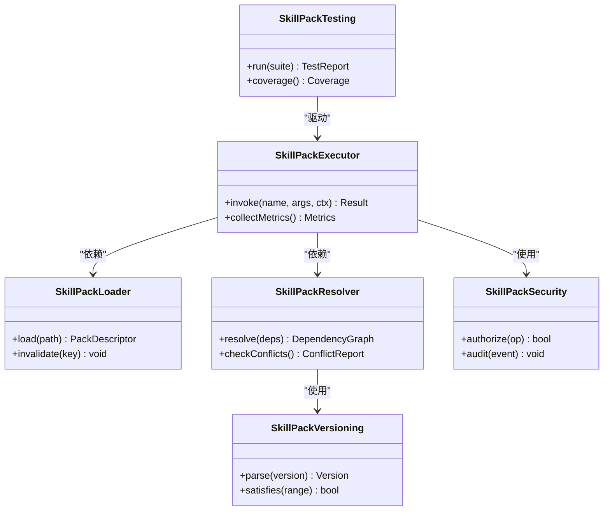
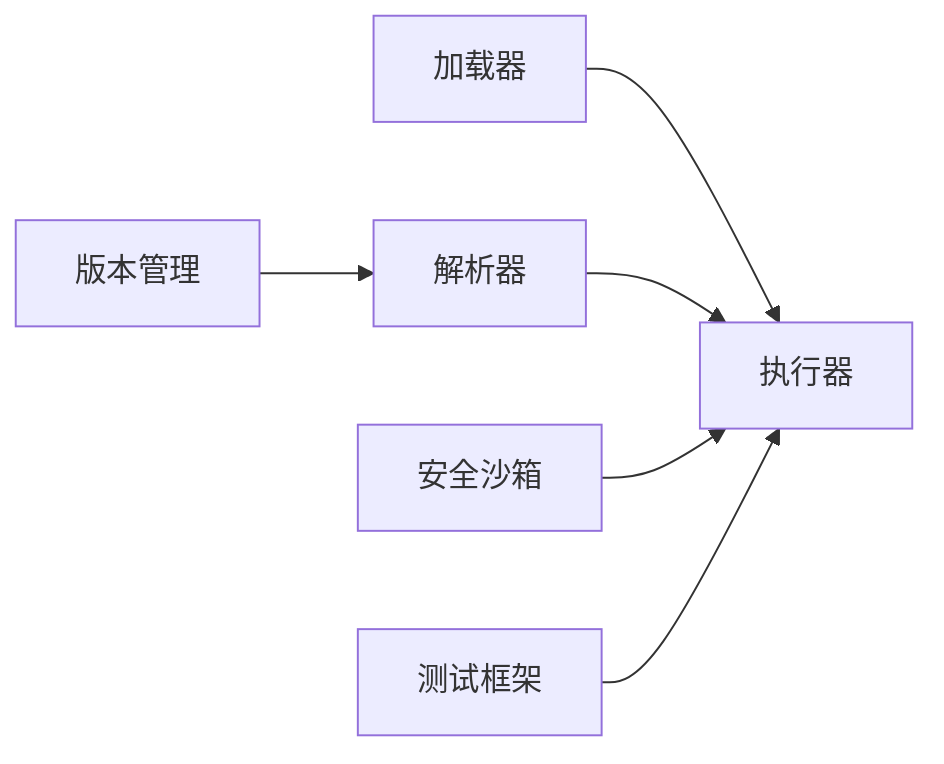

# 技能包生态系统

<cite>
**本文引用的文件**
- [README.md](file://README.md)
- [docs/GBRAIN_SKILLPACK.md](file://docs/GBRAIN_SKILLPACK.md)
- [docs/skillpack-anatomy.md](file://docs/skillpack-anatomy.md)
- [examples/skillpack-reference/skillpack.json](file://examples/skillpack-reference/skillpack.json)
- [skills/manifest.json](file://skills/manifest.json)
- [src/core/skillpack/index.ts](file://src/core/skillpack/index.ts)
- [src/core/skillpack/loader.ts](file://src/core/skillpack/loader.ts)
- [src/core/skillpack/resolver.ts](file://src/core/skillpack/resolver.ts)
- [src/core/skillpack/executor.ts](file://src/core/skillpack/executor.ts)
- [src/core/skillpack/security.ts](file://src/core/skillpack/security.ts)
- [src/core/skillpack/versioning.ts](file://src/core/skillpack/versioning.ts)
- [src/core/skillpack/testing.ts](file://src/core/skillpack/testing.ts)
- [scripts/build-skillpack-anatomy.ts](file://scripts/build-skillpack-anatomy.ts)
</cite>

## 目录
1. [简介](#简介)
2. [项目结构](#项目结构)
3. [核心组件](#核心组件)
4. [架构总览](#架构总览)
5. [详细组件分析](#详细组件分析)
6. [依赖关系分析](#依赖关系分析)
7. [性能考量](#性能考量)
8. [故障排查指南](#故障排查指南)
9. [结论](#结论)
10. [附录](#附录)

## 简介
本文件面向希望理解与扩展“技能包”生态的开发者与维护者，系统性阐述技能包的开发生命周期、规范定义、运行机制、内置能力、第三方集成与发布流程、版本管理与依赖解析、安全沙箱机制、测试策略与调试技巧、性能优化方法，以及完整的开发示例与最佳实践。文档以仓库中的规范文档与参考实现为依据，确保内容可追溯、可落地。

## 项目结构
围绕技能包生态的关键位置如下：
- 规范与说明：docs/GBRAIN_SKILLPACK.md、docs/skillpack-anatomy.md
- 参考实现与脚手架：examples/skillpack-reference（含 skillpack.json）
- 运行时核心：src/core/skillpack/*（加载、解析、执行、安全、版本、测试等）
- 内置技能清单：skills/manifest.json
- 构建脚本：scripts/build-skillpack-anatomy.ts

图示来源
- [docs/GBRAIN_SKILLPACK.md](file://docs/GBRAIN_SKILLPACK.md)
- [docs/skillpack-anatomy.md](file://docs/skillpack-anatomy.md)
- [examples/skillpack-reference/skillpack.json](file://examples/skillpack-reference/skillpack.json)
- [skills/manifest.json](file://skills/manifest.json)
- [scripts/build-skillpack-anatomy.ts](file://scripts/build-skillpack-anatomy.ts)
- [README.md](file://README.md)

章节来源
- [docs/GBRAIN_SKILLPACK.md](file://docs/GBRAIN_SKILLPACK.md)
- [docs/skillpack-anatomy.md](file://docs/skillpack-anatomy.md)
- [examples/skillpack-reference/skillpack.json](file://examples/skillpack-reference/skillpack.json)
- [skills/manifest.json](file://skills/manifest.json)
- [scripts/build-skillpack-anatomy.ts](file://scripts/build-skillpack-anatomy.ts)
- [README.md](file://README.md)

## 核心组件
本节聚焦技能包运行时的关键模块及其职责边界，帮助读者建立整体认知后再深入细节。

- 加载器（loader）：负责发现、读取与校验技能包元数据与资源，提供统一的加载接口。
- 解析器（resolver）：负责解析依赖声明、版本约束与冲突合并，输出可执行的依赖图。
- 执行器（executor）：负责在受控环境中调度技能逻辑，管理生命周期、上下文注入与结果回传。
- 安全沙箱（security）：负责权限控制、网络访问限制、文件系统隔离与资源配额。
- 版本管理（versioning）：负责语义化版本解析、兼容性与升级路径检查。
- 测试框架（testing）：提供断言、模拟与覆盖率采集，支持单元与集成测试。

章节来源
- [src/core/skillpack/loader.ts](file://src/core/skillpack/loader.ts)
- [src/core/skillpack/resolver.ts](file://src/core/skillpack/resolver.ts)
- [src/core/skillpack/executor.ts](file://src/core/skillpack/executor.ts)
- [src/core/skillpack/security.ts](file://src/core/skillpack/security.ts)
- [src/core/skillpack/versioning.ts](file://src/core/skillpack/versioning.ts)
- [src/core/skillpack/testing.ts](file://src/core/skillpack/testing.ts)

## 架构总览
下图展示从“技能包定义”到“受控执行”的整体流程，涵盖加载、解析、安全与执行阶段。

图示来源
- [src/core/skillpack/loader.ts](file://src/core/skillpack/loader.ts)
- [src/core/skillpack/resolver.ts](file://src/core/skillpack/resolver.ts)
- [src/core/skillpack/security.ts](file://src/core/skillpack/security.ts)
- [src/core/skillpack/executor.ts](file://src/core/skillpack/executor.ts)

## 详细组件分析

### 加载器（Loader）
- 职责
  - 发现技能包根目录与元数据文件
  - 校验必填字段与类型约束
  - 缓存已加载项以避免重复 IO
- 关键点
  - 对元数据做最小必要校验，失败时给出明确错误定位
  - 支持增量加载与热更新场景下的失效策略
- 典型输入/输出
  - 输入：技能包路径或包标识
  - 输出：标准化后的技能包描述对象

章节来源
- [src/core/skillpack/loader.ts](file://src/core/skillpack/loader.ts)

### 解析器（Resolver）
- 职责
  - 解析依赖声明与版本范围
  - 构建依赖图并检测环与冲突
  - 输出安装/加载顺序
- 关键点
  - 采用拓扑排序与冲突合并策略
  - 对不满足版本约束的依赖给出修复建议
- 典型输入/输出
  - 输入：多个技能包的依赖声明
  - 输出：线性化的依赖序列与兼容性报告

章节来源
- [src/core/skillpack/resolver.ts](file://src/core/skillpack/resolver.ts)

### 执行器（Executor）
- 职责
  - 在沙箱中加载并调用技能函数
  - 注入上下文（配置、凭据、时间等）
  - 收集指标与日志，处理异常与超时
- 关键点
  - 幂等与重试策略
  - 结构化日志与进度事件上报
- 典型输入/输出
  - 输入：技能名、参数、上下文
  - 输出：结果对象、副作用记录、诊断信息

章节来源
- [src/core/skillpack/executor.ts](file://src/core/skillpack/executor.ts)

### 安全沙箱（Security）
- 职责
  - 控制文件系统访问、网络请求、子进程与系统调用
  - 实施白名单与配额（CPU/内存/IO）
  - 审计敏感操作并阻断高风险行为
- 关键点
  - 默认拒绝原则，按需授权
  - 可插拔的策略提供者
- 典型输入/输出
  - 输入：策略配置与运行时上下文
  - 输出：受限 API 代理与审计日志

章节来源
- [src/core/skillpack/security.ts](file://src/core/skillpack/security.ts)

### 版本管理（Versioning）
- 职责
  - 解析语义化版本与范围表达式
  - 计算兼容性与升级路径
  - 提供向后兼容检查与弃用提示
- 关键点
  - 严格遵循语义化版本约定
  - 对破坏性变更进行显式标记
- 典型输入/输出
  - 输入：版本字符串与约束
  - 输出：解析结果与兼容性矩阵

章节来源
- [src/core/skillpack/versioning.ts](file://src/core/skillpack/versioning.ts)

### 测试框架（Testing）
- 职责
  - 提供断言库、模拟与桩
  - 支持单测与集成测试套件
  - 生成覆盖率与性能基准
- 关键点
  - 与沙箱集成，避免真实外部依赖
  - 可复现实验环境与种子数据
- 典型输入/输出
  - 输入：测试用例与夹具
  - 输出：测试结果、覆盖率报告与快照

章节来源
- [src/core/skillpack/testing.ts](file://src/core/skillpack/testing.ts)

### 类关系图（代码级）

图示来源
- [src/core/skillpack/loader.ts](file://src/core/skillpack/loader.ts)
- [src/core/skillpack/resolver.ts](file://src/core/skillpack/resolver.ts)
- [src/core/skillpack/executor.ts](file://src/core/skillpack/executor.ts)
- [src/core/skillpack/security.ts](file://src/core/skillpack/security.ts)
- [src/core/skillpack/versioning.ts](file://src/core/skillpack/versioning.ts)
- [src/core/skillpack/testing.ts](file://src/core/skillpack/testing.ts)

## 依赖关系分析
- 组件耦合
  - 执行器强依赖加载器、解析器与安全沙箱
  - 解析器依赖版本管理
  - 测试框架弱耦合执行器，便于替换为轻量驱动
- 外部依赖
  - 文件系统与网络访问由沙箱统一管控
  - 日志与指标通过执行器聚合上报
- 潜在风险
  - 循环依赖需在解析阶段拦截
  - 版本冲突需提前告警并提供降级方案

图示来源
- [src/core/skillpack/loader.ts](file://src/core/skillpack/loader.ts)
- [src/core/skillpack/resolver.ts](file://src/core/skillpack/resolver.ts)
- [src/core/skillpack/executor.ts](file://src/core/skillpack/executor.ts)
- [src/core/skillpack/security.ts](file://src/core/skillpack/security.ts)
- [src/core/skillpack/versioning.ts](file://src/core/skillpack/versioning.ts)
- [src/core/skillpack/testing.ts](file://src/core/skillpack/testing.ts)

章节来源
- [src/core/skillpack/loader.ts](file://src/core/skillpack/loader.ts)
- [src/core/skillpack/resolver.ts](file://src/core/skillpack/resolver.ts)
- [src/core/skillpack/executor.ts](file://src/core/skillpack/executor.ts)
- [src/core/skillpack/security.ts](file://src/core/skillpack/security.ts)
- [src/core/skillpack/versioning.ts](file://src/core/skillpack/versioning.ts)
- [src/core/skillpack/testing.ts](file://src/core/skillpack/testing.ts)

## 性能考量
- 加载与解析
  - 缓存已解析的元数据与依赖图，减少重复 IO 与 CPU 开销
  - 并行加载非冲突依赖，提升吞吐
- 执行与沙箱
  - 复用沙箱实例，避免频繁创建销毁
  - 限制并发度与资源配额，防止雪崩
- 测试与基准
  - 使用夹具与内存数据库，缩短 I/O 路径
  - 对热点路径添加基准测试与回归阈值

[本节为通用指导，无需特定文件引用]

## 故障排查指南
- 常见问题
  - 元数据缺失或格式错误：检查必填字段与类型约束
  - 依赖冲突或版本不满足：查看解析器的冲突报告与修复建议
  - 沙箱拒绝访问：核对白名单策略与权限模型
  - 执行超时或 OOM：调整配额与并发度，定位热点路径
- 定位手段
  - 启用结构化日志与审计事件
  - 使用测试框架的模拟与桩，隔离外部依赖
  - 结合版本管理工具验证兼容性与升级路径

章节来源
- [src/core/skillpack/security.ts](file://src/core/skillpack/security.ts)
- [src/core/skillpack/resolver.ts](file://src/core/skillpack/resolver.ts)
- [src/core/skillpack/executor.ts](file://src/core/skillpack/executor.ts)
- [src/core/skillpack/versioning.ts](file://src/core/skillpack/versioning.ts)

## 结论
技能包生态通过清晰的规范、严格的沙箱与完善的工具链，实现了高内聚、低耦合的可插拔能力体系。借助版本管理与依赖解析，系统在演进过程中保持稳定性；通过测试与性能优化，保障质量与效率。建议在新建或升级技能包时，严格遵循规范与最佳实践，充分利用内置工具与参考实现，降低集成成本与风险。

[本节为总结性内容，无需特定文件引用]

## 附录

### 技能包结构与元数据
- 结构组织
  - 根目录包含元数据文件与资源目录
  - 每个技能具备独立入口与配置文件
- 元数据定义
  - 必填字段包括名称、版本、入口、依赖与权限声明
  - 可选字段包括描述、作者、许可证与扩展点
- 参考样例
  - 参见参考技能包的元数据文件

章节来源
- [docs/GBRAIN_SKILLPACK.md](file://docs/GBRAIN_SKILLPACK.md)
- [docs/skillpack-anatomy.md](file://docs/skillpack-anatomy.md)
- [examples/skillpack-reference/skillpack.json](file://examples/skillpack-reference/skillpack.json)

### 内置技能包概览
- 清单与索引
  - 通过清单文件维护内置技能包集合
- 功能特性
  - 覆盖常见领域任务与基础设施能力
- 使用场景
  - 快速组合与编排，形成端到端工作流

章节来源
- [skills/manifest.json](file://skills/manifest.json)

### 第三方技能包集成与发布
- 集成步骤
  - 依据规范定义元数据与入口
  - 在本地完成测试与沙箱验证
  - 提交至仓库或注册中心，触发自动化流水线
- 发布流程
  - 版本号递增与变更日志
  - 自动化构建、签名与分发
  - 依赖扫描与安全审计

章节来源
- [docs/GBRAIN_SKILLPACK.md](file://docs/GBRAIN_SKILLPACK.md)
- [docs/skillpack-anatomy.md](file://docs/skillpack-anatomy.md)

### 版本管理与依赖解析
- 版本策略
  - 语义化版本与兼容性矩阵
  - 破坏性变更的显式标记与迁移指引
- 依赖解析
  - 冲突检测与自动修复建议
  - 安装顺序与拓扑排序

章节来源
- [src/core/skillpack/versioning.ts](file://src/core/skillpack/versioning.ts)
- [src/core/skillpack/resolver.ts](file://src/core/skillpack/resolver.ts)

### 安全沙箱机制
- 权限模型
  - 默认拒绝与白名单授权
  - 细粒度资源配额与审计
- 风险控制
  - 网络访问限制与域名白名单
  - 文件系统隔离与只读挂载

章节来源
- [src/core/skillpack/security.ts](file://src/core/skillpack/security.ts)

### 测试策略与调试技巧
- 测试分层
  - 单元测试：纯函数与内部逻辑
  - 集成测试：沙箱与外部依赖模拟
  - 端到端测试：完整工作流验证
- 调试技巧
  - 结构化日志与追踪 ID
  - 快照对比与差异可视化

章节来源
- [src/core/skillpack/testing.ts](file://src/core/skillpack/testing.ts)

### 开发示例与最佳实践
- 示例工程
  - 参考技能包提供最小可用模板与用例
- 最佳实践
  - 小步快跑、持续集成
  - 明确契约与错误码
  - 关注可观测性与可恢复性

章节来源
- [examples/skillpack-reference/skillpack.json](file://examples/skillpack-reference/skillpack.json)
- [scripts/build-skillpack-anatomy.ts](file://scripts/build-skillpack-anatomy.ts)