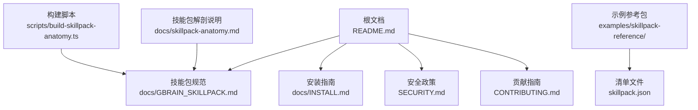
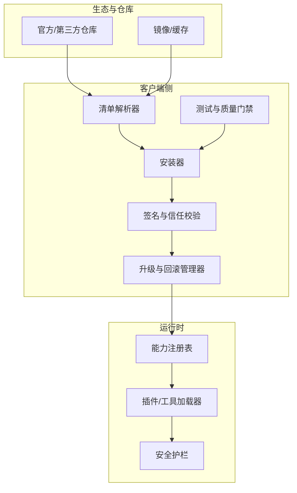
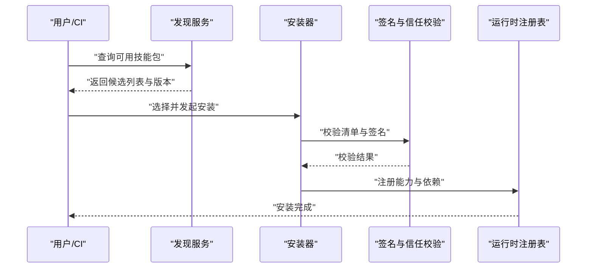
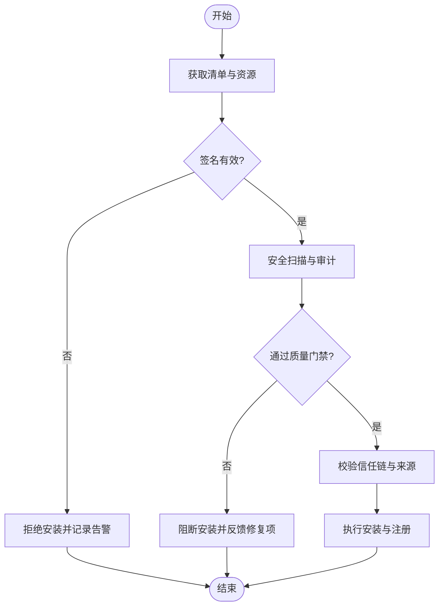
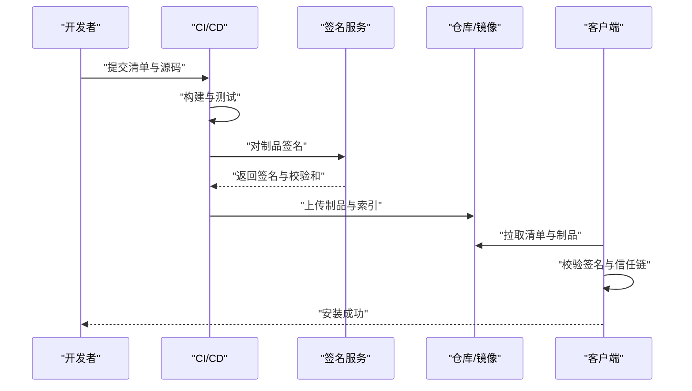
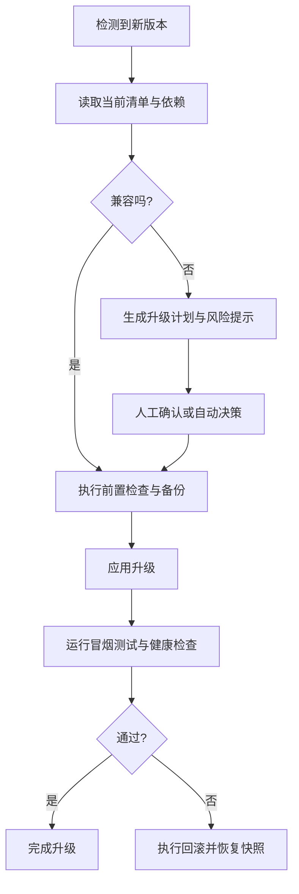
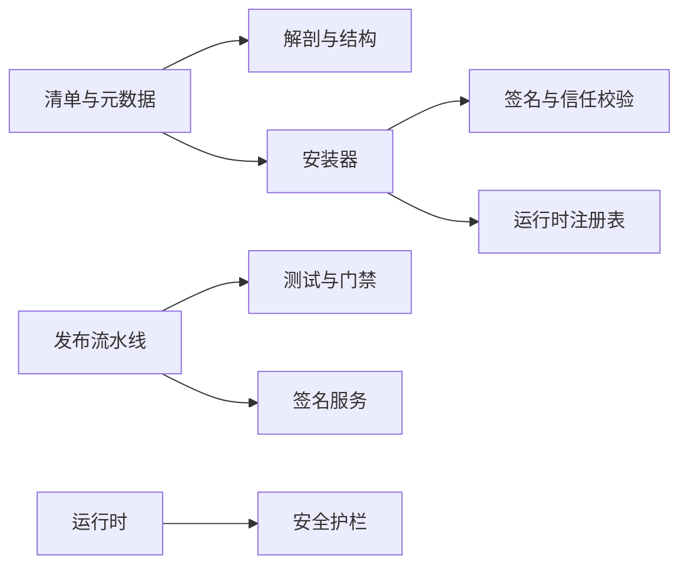

# 第三方技能包集成

<cite>
**本文引用的文件**
- [README.md](file://README.md)
- [CONTRIBUTING.md](file://CONTRIBUTING.md)
- [SECURITY.md](file://SECURITY.md)
- [AGENTS.md](file://AGENTS.md)
- [CLAUDE.md](file://CLAUDE.md)
- [INSTALL.md](file://docs/INSTALL.md)
- [GBRAIN_SKILLPACK.md](file://docs/GBRAIN_SKILLPACK.md)
- [skillpack-anatomy.md](file://docs/skillpack-anatomy.md)
- [RELEASING.md](file://docs/RELEASING.md)
- [TESTING.md](file://docs/TESTING.md)
- [guardrails.md](file://docs/guardrails.md)
- [examples/skillpack-reference/README.md](file://examples/skillpack-reference/README.md)
- [examples/skillpack-reference/skillpack.json](file://examples/skillpack-reference/skillpack.json)
- [skills/_AGENT_README.md](file://skills/_AGENT_README.md)
- [scripts/build-skillpack-anatomy.ts](file://scripts/build-skillpack-anatomy.ts)
</cite>

## 目录
1. [简介](#简介)
2. [项目结构](#项目结构)
3. [核心组件](#核心组件)
4. [架构总览](#架构总览)
5. [详细组件分析](#详细组件分析)
6. [依赖关系分析](#依赖关系分析)
7. [性能与可扩展性](#性能与可扩展性)
8. [故障排查指南](#故障排查指南)
9. [结论](#结论)
10. [附录](#附录)

## 简介
本指南面向希望集成第三方技能包的团队与个人，覆盖从发现、安装、配置到发布、升级、回滚的全生命周期流程；同时阐述仓库搭建与维护要求、签名验证与安全审计、信任链机制、兼容性检查与版本策略、开发规范与代码审查、社区协作流程以及许可证与知识产权注意事项。文档以仓库内现有文档与示例为依据，确保可操作与可追溯。

## 项目结构
围绕“第三方技能包”的主题，仓库中与技能包相关的核心位置包括：
- 文档层：技能包规范、解剖说明、安全护栏、测试与发布流程等
- 示例层：参考技能包结构与清单
- 脚本层：用于生成或校验技能包相关内容的构建脚本
- 根级文档：贡献、安全、代理使用等通用规范

图表来源
- [README.md](file://README.md)
- [docs/GBRAIN_SKILLPACK.md](file://docs/GBRAIN_SKILLPACK.md)
- [docs/INSTALL.md](file://docs/INSTALL.md)
- [SECURITY.md](file://SECURITY.md)
- [CONTRIBUTING.md](file://CONTRIBUTING.md)
- [examples/skillpack-reference/skillpack.json](file://examples/skillpack-reference/skillpack.json)
- [scripts/build-skillpack-anatomy.ts](file://scripts/build-skillpack-anatomy.ts)
- [docs/skillpack-anatomy.md](file://docs/skillpack-anatomy.md)

章节来源
- [README.md](file://README.md)
- [docs/GBRAIN_SKILLPACK.md](file://docs/GBRAIN_SKILLPACK.md)
- [docs/INSTALL.md](file://docs/INSTALL.md)
- [SECURITY.md](file://SECURITY.md)
- [CONTRIBUTING.md](file://CONTRIBUTING.md)
- [examples/skillpack-reference/README.md](file://examples/skillpack-reference/README.md)
- [examples/skillpack-reference/skillpack.json](file://examples/skillpack-reference/skillpack.json)
- [scripts/build-skillpack-anatomy.ts](file://scripts/build-skillpack-anatomy.ts)
- [docs/skillpack-anatomy.md](file://docs/skillpack-anatomy.md)

## 核心组件
- 技能包清单与元数据：通过清单文件描述技能包名称、版本、依赖、入口、权限与扩展点等关键信息，是发现、安装与升级的核心依据。
- 技能包解剖与结构：定义技能包内部目录组织、资源文件、配置文件与运行期契约，保证一致性与可维护性。
- 安装与发现：提供本地与远程发现路径、解析与加载流程，支持多源与优先级管理。
- 安全与信任：包含签名校验、来源可信度评估与最小权限原则，结合安全护栏进行运行时约束。
- 发布与分发：标准化打包、版本标记与发布渠道，配合自动化测试与质量门禁。
- 兼容性与升级：语义化版本、向后兼容策略、升级前置检查与回滚方案。
- 开发与协作：编码规范、代码审查、测试与文档同步更新、社区贡献流程。
- 许可证与知识产权：明确许可类型、第三方依赖声明与合规要求。

章节来源
- [docs/GBRAIN_SKILLPACK.md](file://docs/GBRAIN_SKILLPACK.md)
- [docs/skillpack-anatomy.md](file://docs/skillpack-anatomy.md)
- [docs/INSTALL.md](file://docs/INSTALL.md)
- [SECURITY.md](file://SECURITY.md)
- [docs/RELEASING.md](file://docs/RELEASING.md)
- [docs/TESTING.md](file://docs/TESTING.md)
- [CONTRIBUTING.md](file://CONTRIBUTING.md)

## 架构总览
以下图展示了第三方技能包在系统中的角色与交互边界：清单驱动的安装器负责发现与拉取；安全模块执行签名与信任链校验；运行时按清单注入能力并受护栏约束；发布流水线保障质量与一致性。

图表来源
- [docs/GBRAIN_SKILLPACK.md](file://docs/GBRAIN_SKILLPACK.md)
- [docs/INSTALL.md](file://docs/INSTALL.md)
- [SECURITY.md](file://SECURITY.md)
- [docs/RELEASING.md](file://docs/RELEASING.md)
- [docs/TESTING.md](file://docs/TESTING.md)

## 详细组件分析

### 技能包清单与元数据（manifest）
- 作用：作为技能包的唯一标识与契约，承载版本、依赖、入口、权限、扩展点、资源清单等。
- 关键点：
  - 版本字段需遵循语义化版本，便于升级与回滚判断。
  - 依赖声明应显式列出必要的外部能力与最低版本。
  - 权限与扩展点需最小化授权，避免过度暴露。
  - 资源与入口文件路径需与解剖结构保持一致。
- 建议：
  - 在清单变更时同步更新文档与测试用例。
  - 对破坏性变更采用主版本递增，并提供迁移指引。

章节来源
- [docs/GBRAIN_SKILLPACK.md](file://docs/GBRAIN_SKILLPACK.md)
- [docs/skillpack-anatomy.md](file://docs/skillpack-anatomy.md)
- [examples/skillpack-reference/skillpack.json](file://examples/skillpack-reference/skillpack.json)

### 技能包解剖与目录结构
- 目标：统一技能包的组织方式，降低集成成本与出错概率。
- 要点：
  - 顶层清单文件位于约定路径。
  - 源码、资源、配置、测试与文档分目录存放。
  - 入口文件与导出接口清晰稳定。
  - 构建产物与中间文件排除在版本控制之外。
- 建议：
  - 使用模板与脚手架快速初始化。
  - 为每个子功能提供独立的可测试单元。

章节来源
- [docs/skillpack-anatomy.md](file://docs/skillpack-anatomy.md)
- [scripts/build-skillpack-anatomy.ts](file://scripts/build-skillpack-anatomy.ts)

### 发现与安装流程
- 发现：
  - 支持本地目录与远程仓库两种来源。
  - 通过清单索引或搜索接口检索可用技能包。
  - 解析依赖树并计算冲突与兼容范围。
- 安装：
  - 下载与解压至工作区。
  - 校验清单完整性与签名有效性。
  - 写入安装状态与元数据，供后续升级与卸载使用。
- 配置：
  - 根据清单提示完成环境变量、密钥与外部服务接入。
  - 将能力注册到运行时，暴露给上层调用。

图表来源
- [docs/INSTALL.md](file://docs/INSTALL.md)
- [SECURITY.md](file://SECURITY.md)

章节来源
- [docs/INSTALL.md](file://docs/INSTALL.md)
- [SECURITY.md](file://SECURITY.md)

### 签名验证、安全审计与信任链
- 签名验证：
  - 对清单与关键资源进行数字签名，安装前强制校验。
  - 支持多签与时间戳，防止重放与篡改。
- 安全审计：
  - 静态扫描与依赖漏洞检测纳入发布前门禁。
  - 运行时启用安全护栏，限制敏感操作与网络访问。
- 信任链：
  - 建立发布者公钥库与信任锚。
  - 支持白名单与黑名单策略，动态更新信任状态。

图表来源
- [SECURITY.md](file://SECURITY.md)
- [docs/RELEASING.md](file://docs/RELEASING.md)
- [docs/guardrails.md](file://docs/guardrails.md)

章节来源
- [SECURITY.md](file://SECURITY.md)
- [docs/guardrails.md](file://docs/guardrails.md)
- [docs/RELEASING.md](file://docs/RELEASING.md)

### 打包、发布与分发标准流程
- 打包：
  - 基于清单与解剖结构生成可分发制品。
  - 附带签名与校验和文件。
- 发布：
  - 提交至仓库并打标签，触发自动化流水线。
  - 流水线执行测试、扫描与签名验证。
- 分发：
  - 推送至官方或第三方仓库，支持镜像与缓存。
  - 提供版本索引与变更日志。

图表来源
- [docs/RELEASING.md](file://docs/RELEASING.md)
- [docs/TESTING.md](file://docs/TESTING.md)
- [SECURITY.md](file://SECURITY.md)

章节来源
- [docs/RELEASING.md](file://docs/RELEASING.md)
- [docs/TESTING.md](file://docs/TESTING.md)
- [SECURITY.md](file://SECURITY.md)

### 兼容性检查、版本升级与回滚策略
- 兼容性检查：
  - 基于清单中的依赖与能力边界进行预检。
  - 对破坏性变更给出升级建议与迁移步骤。
- 版本升级：
  - 优先小版本增量升级，必要时引导主版本升级。
  - 升级前备份状态与快照，确保可恢复。
- 回滚策略：
  - 保留历史版本与清单，支持一键回滚。
  - 回滚后清理临时资源与无效引用。

图表来源
- [docs/GBRAIN_SKILLPACK.md](file://docs/GBRAIN_SKILLPACK.md)
- [docs/RELEASING.md](file://docs/RELEASING.md)

章节来源
- [docs/GBRAIN_SKILLPACK.md](file://docs/GBRAIN_SKILLPACK.md)
- [docs/RELEASING.md](file://docs/RELEASING.md)

### 开发规范、代码审查与质量保证
- 开发规范：
  - 遵循统一的命名、目录与注释约定。
  - 清单与解剖结构变更需同步更新文档与示例。
- 代码审查：
  - 所有变更需经同行评审，关注安全与兼容性。
  - 高风险变更需附加风险评估与回滚预案。
- 质量保证：
  - 单元测试、集成测试与端到端测试覆盖率达标。
  - 引入静态分析与安全扫描，失败则阻断合并。

章节来源
- [CONTRIBUTING.md](file://CONTRIBUTING.md)
- [docs/TESTING.md](file://docs/TESTING.md)
- [SECURITY.md](file://SECURITY.md)

### 社区贡献指南与协作工作流程
- 贡献入口：
  - Fork 仓库、创建分支、提交变更与 Pull Request。
  - 遵循 Issue 模板与 PR 模板，完善问题描述与复现步骤。
- 协作流程：
  - 定期评审与排期，保持沟通透明。
  - 重要变更需获得维护者批准后方可合并。
- 文档与示例：
  - 新增或修改能力时，同步更新文档与示例。
  - 示例需可运行且覆盖主要场景。

章节来源
- [CONTRIBUTING.md](file://CONTRIBUTING.md)
- [README.md](file://README.md)

### 许可证管理与知识产权注意事项
- 许可证选择：
  - 明确主仓库与第三方依赖的许可证类型。
  - 避免许可证冲突与传染性条款。
- 依赖声明：
  - 在清单或文档中列出关键第三方依赖及其许可证。
  - 定期更新依赖并处理已知漏洞。
- 合规要求：
  - 遵守开源协议与出口管制相关规定。
  - 对敏感能力进行脱敏与最小化披露。

章节来源
- [SECURITY.md](file://SECURITY.md)
- [CONTRIBUTING.md](file://CONTRIBUTING.md)

## 依赖关系分析
- 清单与解剖：清单驱动安装与加载，解剖保证结构一致。
- 安装与信任：安装器依赖签名与信任校验模块，确保安全落地。
- 发布与测试：发布流水线依赖测试与质量门禁，保障交付质量。
- 运行时与护栏：运行时加载能力并受安全护栏约束，降低风险面。

图表来源
- [docs/GBRAIN_SKILLPACK.md](file://docs/GBRAIN_SKILLPACK.md)
- [docs/skillpack-anatomy.md](file://docs/skillpack-anatomy.md)
- [docs/INSTALL.md](file://docs/INSTALL.md)
- [SECURITY.md](file://SECURITY.md)
- [docs/RELEASING.md](file://docs/RELEASING.md)
- [docs/TESTING.md](file://docs/TESTING.md)

## 性能与可扩展性
- 清单解析与依赖计算：
  - 采用增量解析与缓存策略，减少重复计算。
  - 对大型依赖树进行并行化与剪枝优化。
- 安装与加载：
  - 支持并发下载与解压，提升吞吐。
  - 懒加载与按需初始化，降低启动开销。
- 运行时约束：
  - 通过护栏限制资源使用与超时，避免雪崩。
  - 监控与指标上报，辅助容量规划与扩容。

[本节为通用指导，不直接分析具体文件]

## 故障排查指南
- 安装失败：
  - 检查清单完整性与签名有效性。
  - 查看安装日志与错误码，定位缺失依赖或权限不足。
- 升级异常：
  - 对比前后清单差异，确认破坏性变更。
  - 执行回滚并恢复快照，再逐步修复。
- 运行时错误：
  - 启用调试模式，收集上下文与堆栈。
  - 对照安全护栏规则，排查越权或资源超限。

章节来源
- [docs/INSTALL.md](file://docs/INSTALL.md)
- [SECURITY.md](file://SECURITY.md)
- [docs/RELEASING.md](file://docs/RELEASING.md)

## 结论
通过统一的清单与解剖规范、严格的签名与信任校验、标准化的发布与测试流程，以及完善的兼容性与回滚策略，第三方技能包可以在安全可控的前提下高效集成与演进。建议团队在贡献与协作中坚持高质量与合规要求，持续优化性能与可观测性，形成可持续的技能包生态。

## 附录
- 参考示例：
  - 参考技能包清单与说明，帮助快速上手。
- 代理与使用：
  - 了解代理如何加载与调用技能包能力。

章节来源
- [examples/skillpack-reference/README.md](file://examples/skillpack-reference/README.md)
- [examples/skillpack-reference/skillpack.json](file://examples/skillpack-reference/skillpack.json)
- [skills/_AGENT_README.md](file://skills/_AGENT_README.md)
- [AGENTS.md](file://AGENTS.md)
- [CLAUDE.md](file://CLAUDE.md)