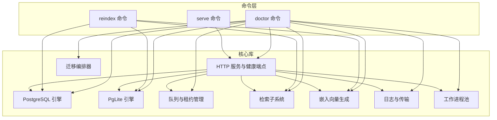
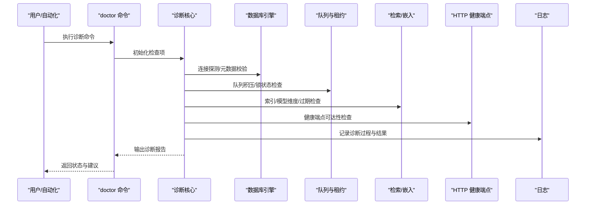
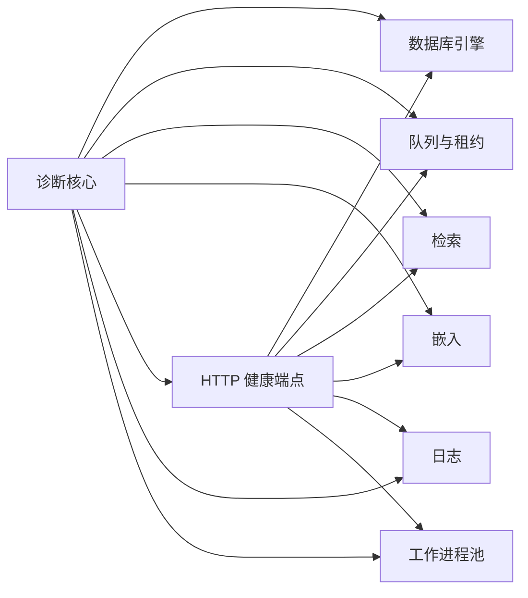
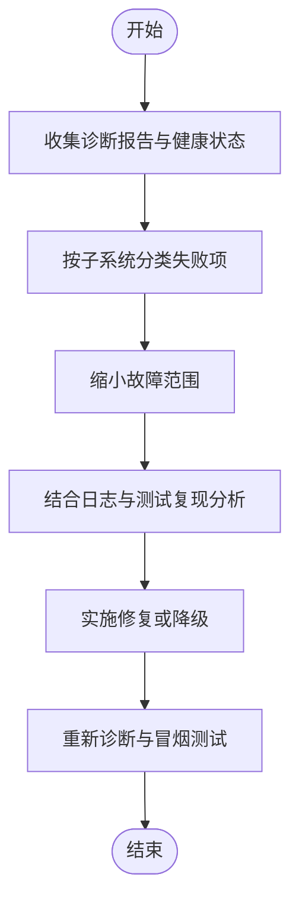

# 故障排除

<cite>
**本文引用的文件**   
- [README.md](file://README.md)
- [INSTALL.md](file://docs/INSTALL.md)
- [RELEASING.md](file://docs/RELEASING.md)
- [TESTING.md](file://docs/TESTING.md)
- [ENGINES.md](file://docs/ENGINES.md)
- [guardrails.md](file://docs/guardrails.md)
- [storage-tiering.md](file://docs/storage-tiering.md)
- [progress-events.md](file://docs/progress-events.md)
- [eval-bench.md](file://docs/eval-bench.md)
- [eval-capture.md](file://docs/eval-capture.md)
- [eval-takes-quality.md](file://docs/eval-takes-quality.md)
- [migrations/v0_21_0.ts](file://src/core/migrations/v0_21_0.ts)
- [commands/doctor.ts](file://src/commands/doctor.ts)
- [core/doctor/index.ts](file://src/core/doctor/index.ts)
- [core/doctor/checks.ts](file://src/core/doctor/checks.ts)
- [core/doctor/reporter.ts](file://src/core/doctor/reporter.ts)
- [core/doctor/cli.ts](file://src/core/doctor/cli.ts)
- [core/db/postgres-engine.ts](file://src/core/db/postgres-engine.ts)
- [core/db/pglite-engine.ts](file://src/core/db/pglite-engine.ts)
- [core/db/connection-manager.ts](file://src/core/db/connection-manager.ts)
- [core/supervisor/index.ts](file://src/core/supervisor/index.ts)
- [core/worker-pool/index.ts](file://src/core/worker-pool/index.ts)
- [core/queue/index.ts](file://src/core/queue/index.ts)
- [core/queue/lease-manager.ts](file://src/core/queue/lease-manager.ts)
- [core/search/index.ts](file://src/core/search/index.ts)
- [core/embedding/index.ts](file://src/core/embedding/index.ts)
- [core/http/server.ts](file://src/core/http/server.ts)
- [core/http/handlers/health.ts](file://src/core/http/handlers/health.ts)
- [core/http/handlers/status.ts](file://src/core/http/handlers/status.ts)
- [core/logging/logger.ts](file://src/core/logging/logger.ts)
- [core/logging/transport/file.ts](file://src/core/logging/transport/file.ts)
- [core/logging/transport/stdout.ts](file://src/core/logging/transport/stdout.ts)
- [scripts/smoke-test.sh](file://scripts/smoke-test.sh)
- [scripts/run-unit-parallel.sh](file://scripts/run-unit-parallel.sh)
- [scripts/profile-tests.sh](file://scripts/profile-tests.sh)
- [scripts/ci-local.sh](file://scripts/ci-local.sh)
- [test/doctor.test.ts](file://test/doctor.test.ts)
- [test/serve-http-health.test.ts](file://test/serve-http-health.test.ts)
- [test/postgres-engine.test.ts](file://test/postgres-engine.test.ts)
- [test/pglite-engine.test.ts](file://test/pglite-engine.test.ts)
- [test/queue-lock-retry.test.ts](file://test/queue-lock-retry.test.ts)
- [test/worker-pool.test.ts](file://test/worker-pool.test.ts)
- [test/process-watchdog.test.ts](file://test/process-watchdog.test.ts)
- [test/reindex.test.ts](file://test/reindex.test.ts)
- [test/embed-stale.serial.test.ts](file://test/embed-stale.serial.test.ts)
- [test/source-health.test.ts](file://test/source-health.test.ts)
- [test/doctor-worker-oom-loop.test.ts](file://test/doctor-worker-oom-loop.test.ts)
- [test/doctor-self-upgrade.test.ts](file://test/doctor-self-upgrade.test.ts)
- [test/doctor-remote.serial.test.ts](file://test/doctor-remote.serial.test.ts)
- [test/doctor-report-remote.serial.test.ts](file://test/doctor-report-remote.serial.test.ts)
</cite>

## 目录
1. [简介](#简介)
2. [项目结构](#项目结构)
3. [核心组件](#核心组件)
4. [架构总览](#架构总览)
5. [详细组件分析](#详细组件分析)
6. [依赖关系分析](#依赖关系分析)
7. [性能考虑](#性能考虑)
8. [故障排除指南](#故障排除指南)
9. [结论](#结论)
10. [附录](#附录)

## 简介
本指南面向运维、开发与平台工程师，提供系统化的故障定位与排障方法。内容覆盖常见问题识别、错误诊断、性能调优、健康检查工具使用与报告解读、监控指标分析与优化建议、典型故障案例与预防措施、日志分析方法、调试工具与远程诊断技巧，以及社区支持与问题反馈渠道。

## 项目结构
本项目采用“命令+核心库”的模块化组织方式：
- 命令层：提供 CLI 入口与对外能力（如 doctor、reindex、serve 等）
- 核心库：数据库引擎、队列与租约、搜索与嵌入、HTTP 服务、日志、工作进程池、迁移等
- 测试与脚本：单元测试、集成测试、冒烟测试、CI 脚本与性能基准
- 文档：安装、发布、测试、引擎说明、存储分层、进度事件、评估相关文档

图表来源
- [commands/doctor.ts](file://src/commands/doctor.ts)
- [core/doctor/index.ts](file://src/core/doctor/index.ts)
- [core/db/postgres-engine.ts](file://src/core/db/postgres-engine.ts)
- [core/db/pglite-engine.ts](file://src/core/db/pglite-engine.ts)
- [core/queue/index.ts](file://src/core/queue/index.ts)
- [core/search/index.ts](file://src/core/search/index.ts)
- [core/embedding/index.ts](file://src/core/embedding/index.ts)
- [core/http/server.ts](file://src/core/http/server.ts)
- [core/http/handlers/health.ts](file://src/core/http/handlers/health.ts)
- [core/logging/logger.ts](file://src/core/logging/logger.ts)
- [core/worker-pool/index.ts](file://src/core/worker-pool/index.ts)
- [src/core/migrations/v0_21_0.ts](file://src/core/migrations/v0_21_0.ts)

章节来源
- [README.md](file://README.md)
- [INSTALL.md](file://docs/INSTALL.md)
- [ENGINES.md](file://docs/ENGINES.md)
- [storage-tiering.md](file://docs/storage-tiering.md)
- [progress-events.md](file://docs/progress-events.md)

## 核心组件
- 健康检查与诊断（Doctor）
  - 负责运行多维度的健康检查项，汇总并输出诊断报告，支持本地与远程模式。
  - 关键实现路径参考：[core/doctor/index.ts](file://src/core/doctor/index.ts)、[core/doctor/checks.ts](file://src/core/doctor/checks.ts)、[core/doctor/reporter.ts](file://src/core/doctor/reporter.ts)、[core/doctor/cli.ts](file://src/core/doctor/cli.ts)、[commands/doctor.ts](file://src/commands/doctor.ts)。
- 数据库引擎（PostgreSQL/PgLite）
  - 提供连接管理、重连与自愈、锁机制、事务与并发控制。
  - 关键实现路径参考：[core/db/postgres-engine.ts](file://src/core/db/postgres-engine.ts)、[core/db/pglite-engine.ts](file://src/core/db/pglite-engine.ts)、[core/db/connection-manager.ts](file://src/core/db/connection-manager.ts)。
- 队列与租约（Queue & Lease）
  - 任务分发、重试、锁续期、死锁检测与恢复。
  - 关键实现路径参考：[core/queue/index.ts](file://src/core/queue/index.ts)、[core/queue/lease-manager.ts](file://src/core/queue/lease-manager.ts)。
- 检索与嵌入（Search & Embedding）
  - 全文检索、向量索引生命周期、模型维度校验、过期与回刷。
  - 关键实现路径参考：[core/search/index.ts](file://src/core/search/index.ts)、[core/embedding/index.ts](file://src/core/embedding/index.ts)。
- HTTP 服务与健康端点
  - 暴露健康检查、状态查询、CORS、代理信任等配置。
  - 关键实现路径参考：[core/http/server.ts](file://src/core/http/server.ts)、[core/http/handlers/health.ts](file://src/core/http/handlers/health.ts)、[core/http/handlers/status.ts](file://src/core/http/handlers/status.ts)。
- 日志与传输
  - 结构化日志、文件与标准输出传输、敏感信息脱敏。
  - 关键实现路径参考：[core/logging/logger.ts](file://src/core/logging/logger.ts)、[core/logging/transport/file.ts](file://src/core/logging/transport/file.ts)、[core/logging/transport/stdout.ts](file://src/core/logging/transport/stdout.ts)。
- 工作进程池与看门狗
  - 进程生命周期、OOM 保护、资源回收与重启策略。
  - 关键实现路径参考：[core/worker-pool/index.ts](file://src/core/worker-pool/index.ts)、[core/supervisor/index.ts](file://src/core/supervisor/index.ts)。
- 迁移编排器
  - 版本化迁移执行、幂等性与回滚策略。
  - 关键实现路径参考：[src/core/migrations/v0_21_0.ts](file://src/core/migrations/v0_21_0.ts)。

章节来源
- [core/doctor/index.ts](file://src/core/doctor/index.ts)
- [core/doctor/checks.ts](file://src/core/doctor/checks.ts)
- [core/doctor/reporter.ts](file://src/core/doctor/reporter.ts)
- [core/doctor/cli.ts](file://src/core/doctor/cli.ts)
- [commands/doctor.ts](file://src/commands/doctor.ts)
- [core/db/postgres-engine.ts](file://src/core/db/postgres-engine.ts)
- [core/db/pglite-engine.ts](file://src/core/db/pglite-engine.ts)
- [core/db/connection-manager.ts](file://src/core/db/connection-manager.ts)
- [core/queue/index.ts](file://src/core/queue/index.ts)
- [core/queue/lease-manager.ts](file://src/core/queue/lease-manager.ts)
- [core/search/index.ts](file://src/core/search/index.ts)
- [core/embedding/index.ts](file://src/core/embedding/index.ts)
- [core/http/server.ts](file://src/core/http/server.ts)
- [core/http/handlers/health.ts](file://src/core/http/handlers/health.ts)
- [core/http/handlers/status.ts](file://src/core/http/handlers/status.ts)
- [core/logging/logger.ts](file://src/core/logging/logger.ts)
- [core/logging/transport/file.ts](file://src/core/logging/transport/file.ts)
- [core/logging/transport/stdout.ts](file://src/core/logging/transport/stdout.ts)
- [core/worker-pool/index.ts](file://src/core/worker-pool/index.ts)
- [core/supervisor/index.ts](file://src/core/supervisor/index.ts)
- [src/core/migrations/v0_21_0.ts](file://src/core/migrations/v0_21_0.ts)

## 架构总览
下图展示了从 CLI 到核心子系统的调用链路与数据流，便于快速定位故障传播路径。

图表来源
- [commands/doctor.ts](file://src/commands/doctor.ts)
- [core/doctor/index.ts](file://src/core/doctor/index.ts)
- [core/db/postgres-engine.ts](file://src/core/db/postgres-engine.ts)
- [core/queue/index.ts](file://src/core/queue/index.ts)
- [core/search/index.ts](file://src/core/search/index.ts)
- [core/embedding/index.ts](file://src/core/embedding/index.ts)
- [core/http/handlers/health.ts](file://src/core/http/handlers/health.ts)
- [core/logging/logger.ts](file://src/core/logging/logger.ts)

## 详细组件分析

### 健康检查与诊断（Doctor）
- 功能要点
  - 多维度检查：数据库连通性、队列与租约、检索与嵌入、HTTP 健康端点、进程与工作进程池、迁移一致性等。
  - 报告输出：结构化摘要、失败项明细、修复建议与下一步操作指引。
  - 远程模式：支持在远端节点收集诊断信息并聚合报告。
- 关键流程
  - 初始化检查项 -> 逐项执行 -> 异常捕获与分类 -> 生成报告 -> 输出与持久化。
- 常见症状与根因
  - 数据库连接失败：网络/认证/权限/连接池耗尽。
  - 队列积压或锁竞争：消费者不足、长事务、锁未释放。
  - 检索/嵌入异常：模型维度不匹配、索引损坏、外部服务不可用。
  - HTTP 健康端点无响应：端口占用、反向代理配置错误、TLS 证书问题。
- 解决步骤
  - 使用诊断命令获取报告，按严重级别逐项处理。
  - 针对数据库：验证连接串、权限、防火墙、连接池参数。
  - 针对队列：检查消费者数量、重试策略、锁续期与超时。
  - 针对检索/嵌入：核对模型版本与维度、重建索引、检查外部服务配额与限流。
  - 针对 HTTP：检查监听地址、代理转发、证书与域名解析。
- 参考实现路径
  - [core/doctor/index.ts](file://src/core/doctor/index.ts)
  - [core/doctor/checks.ts](file://src/core/doctor/checks.ts)
  - [core/doctor/reporter.ts](file://src/core/doctor/reporter.ts)
  - [core/doctor/cli.ts](file://src/core/doctor/cli.ts)
  - [commands/doctor.ts](file://src/commands/doctor.ts)

章节来源
- [core/doctor/index.ts](file://src/core/doctor/index.ts)
- [core/doctor/checks.ts](file://src/core/doctor/checks.ts)
- [core/doctor/reporter.ts](file://src/core/doctor/reporter.ts)
- [core/doctor/cli.ts](file://src/core/doctor/cli.ts)
- [commands/doctor.ts](file://src/commands/doctor.ts)

### 数据库引擎（PostgreSQL/PgLite）
- 功能要点
  - 连接管理：自动重连、心跳、连接池、最大连接数限制。
  - 锁与事务：分布式锁、锁续期、死锁检测与自愈。
  - 迁移：版本化迁移、幂等执行、失败回滚。
- 常见症状与根因
  - 连接超时/拒绝：连接池耗尽、网络抖动、服务端限制。
  - 锁等待过长：长事务、未提交事务、锁竞争。
  - 迁移失败：版本不一致、DDL 冲突、权限不足。
- 解决步骤
  - 调整连接池参数、增加实例容量、优化慢查询。
  - 缩短事务、避免长时间持有锁、清理僵尸会话。
  - 对齐迁移版本、回滚至稳定版本后逐步升级。
- 参考实现路径
  - [core/db/postgres-engine.ts](file://src/core/db/postgres-engine.ts)
  - [core/db/pglite-engine.ts](file://src/core/db/pglite-engine.ts)
  - [core/db/connection-manager.ts](file://src/core/db/connection-manager.ts)
  - [src/core/migrations/v0_21_0.ts](file://src/core/migrations/v0_21_0.ts)

章节来源
- [core/db/postgres-engine.ts](file://src/core/db/postgres-engine.ts)
- [core/db/pglite-engine.ts](file://src/core/db/pglite-engine.ts)
- [core/db/connection-manager.ts](file://src/core/db/connection-manager.ts)
- [src/core/migrations/v0_21_0.ts](file://src/core/migrations/v0_21_0.ts)

### 队列与租约（Queue & Lease）
- 功能要点
  - 任务调度：批量消费、重试退避、死信队列。
  - 租约管理：锁续期、抢占与回收、拥塞控制。
- 常见症状与根因
  - 任务堆积：消费者不足、下游延迟、重试风暴。
  - 锁竞争：并发过高、锁粒度粗、业务逻辑阻塞。
- 解决步骤
  - 扩容消费者、调整批大小与并发度、优化重试策略。
  - 细化锁粒度、减少临界区、引入异步化与缓存。
- 参考实现路径
  - [core/queue/index.ts](file://src/core/queue/index.ts)
  - [core/queue/lease-manager.ts](file://src/core/queue/lease-manager.ts)

章节来源
- [core/queue/index.ts](file://src/core/queue/index.ts)
- [core/queue/lease-manager.ts](file://src/core/queue/lease-manager.ts)

### 检索与嵌入（Search & Embedding）
- 功能要点
  - 检索：全文索引、混合检索、相关性排序。
  - 嵌入：向量化、模型维度校验、过期与回刷。
- 常见症状与根因
  - 检索质量下降：索引陈旧、权重不合理、分词策略不当。
  - 嵌入失败：模型维度不匹配、外部服务限流/配额不足。
- 解决步骤
  - 触发增量/全量重建索引、校准权重、优化分词与过滤。
  - 核对模型版本与维度、提升配额、启用降级与缓存。
- 参考实现路径
  - [core/search/index.ts](file://src/core/search/index.ts)
  - [core/embedding/index.ts](file://src/core/embedding/index.ts)

章节来源
- [core/search/index.ts](file://src/core/search/index.ts)
- [core/embedding/index.ts](file://src/core/embedding/index.ts)

### HTTP 服务与健康端点
- 功能要点
  - 健康检查：存活探针、就绪探针、依赖健康聚合。
  - 状态查询：运行时快照、关键指标汇总。
  - 安全与代理：CORS、信任代理、HTTPS/TLS。
- 常见症状与根因
  - 健康端点返回失败：依赖不可用、资源不足、配置错误。
  - 代理转发异常：X-Forwarded-* 头缺失、证书不匹配。
- 解决步骤
  - 检查依赖健康状态、调整资源配额、修正代理与证书配置。
- 参考实现路径
  - [core/http/server.ts](file://src/core/http/server.ts)
  - [core/http/handlers/health.ts](file://src/core/http/handlers/health.ts)
  - [core/http/handlers/status.ts](file://src/core/http/handlers/status.ts)

章节来源
- [core/http/server.ts](file://src/core/http/server.ts)
- [core/http/handlers/health.ts](file://src/core/http/handlers/health.ts)
- [core/http/handlers/status.ts](file://src/core/http/handlers/status.ts)

### 日志与传输
- 功能要点
  - 结构化日志：统一格式、上下文注入、敏感信息脱敏。
  - 传输：文件落盘、标准输出、可观测性对接。
- 常见症状与根因
  - 日志缺失：传输通道异常、权限不足、磁盘空间不足。
  - 日志过大：轮转策略不当、采样率过低。
- 解决步骤
  - 检查传输目标可达性与权限、配置轮转与采样、清理历史日志。
- 参考实现路径
  - [core/logging/logger.ts](file://src/core/logging/logger.ts)
  - [core/logging/transport/file.ts](file://src/core/logging/transport/file.ts)
  - [core/logging/transport/stdout.ts](file://src/core/logging/transport/stdout.ts)

章节来源
- [core/logging/logger.ts](file://src/core/logging/logger.ts)
- [core/logging/transport/file.ts](file://src/core/logging/transport/file.ts)
- [core/logging/transport/stdout.ts](file://src/core/logging/transport/stdout.ts)

### 工作进程池与看门狗
- 功能要点
  - 进程管理：启动、停止、优雅退出、资源回收。
  - OOM 保护：内存阈值、自动重启、告警上报。
- 常见症状与根因
  - 进程频繁重启：内存泄漏、大对象分配、外部依赖不稳定。
  - 进程僵死：死锁、IO 阻塞、看门狗未触发。
- 解决步骤
  - 采集堆栈与内存快照、优化数据结构与算法、增强看门狗阈值与超时。
- 参考实现路径
  - [core/worker-pool/index.ts](file://src/core/worker-pool/index.ts)
  - [core/supervisor/index.ts](file://src/core/supervisor/index.ts)

章节来源
- [core/worker-pool/index.ts](file://src/core/worker-pool/index.ts)
- [core/supervisor/index.ts](file://src/core/supervisor/index.ts)

## 依赖关系分析
- 组件耦合
  - Doctor 对数据库、队列、检索/嵌入、HTTP、日志、工作进程池均有依赖。
  - HTTP 服务依赖所有核心子系统以聚合健康状态。
- 潜在环依赖
  - 通过命令层与核心库解耦，避免直接循环导入；若新增模块需遵循单向依赖原则。
- 外部依赖
  - 数据库驱动、向量模型服务、文件系统、操作系统信号与资源限制。

图表来源
- [core/doctor/index.ts](file://src/core/doctor/index.ts)
- [core/db/postgres-engine.ts](file://src/core/db/postgres-engine.ts)
- [core/queue/index.ts](file://src/core/queue/index.ts)
- [core/search/index.ts](file://src/core/search/index.ts)
- [core/embedding/index.ts](file://src/core/embedding/index.ts)
- [core/http/server.ts](file://src/core/http/server.ts)
- [core/logging/logger.ts](file://src/core/logging/logger.ts)
- [core/worker-pool/index.ts](file://src/core/worker-pool/index.ts)

## 性能考虑
- 数据库
  - 连接池与慢查询：监控连接使用率与慢查询日志，优化索引与 SQL。
  - 锁竞争：降低锁粒度、拆分事务、避免长事务。
- 队列
  - 吞吐与延迟：调整并发度、批大小、重试退避策略。
  - 背压与限流：防止下游过载导致雪崩。
- 检索与嵌入
  - 索引重建：选择低峰时段、分批重建、增量更新。
  - 模型维度与缓存：确保维度一致、启用结果缓存与降级。
- HTTP
  - 健康探针间隔与超时：合理设置以避免误判与抖动。
  - 代理与 TLS：减少握手开销、复用连接。
- 日志
  - 采样与轮转：控制体积、避免 I/O 瓶颈。
- 参考文档
  - [storage-tiering.md](file://docs/storage-tiering.md)
  - [progress-events.md](file://docs/progress-events.md)
  - [eval-bench.md](file://docs/eval-bench.md)

章节来源
- [storage-tiering.md](file://docs/storage-tiering.md)
- [progress-events.md](file://docs/progress-events.md)
- [eval-bench.md](file://docs/eval-bench.md)

## 故障排除指南

### 常见问题解答（FAQ）
- 如何快速判断系统是否健康？
  - 使用健康端点与诊断命令进行综合检查，关注失败项与严重级别。
- 数据库连接失败如何处理？
  - 检查连接串、权限、网络与连接池参数；查看诊断报告中的数据库检查项。
- 队列任务堆积怎么办？
  - 扩容消费者、调整并发与批大小、检查重试风暴与锁竞争。
- 检索质量下降或嵌入失败？
  - 核对模型版本与维度、重建索引、检查外部服务配额与限流。
- HTTP 健康端点无响应？
  - 检查监听地址、代理转发、证书与域名解析。

### 错误诊断流程
- 第一步：收集证据
  - 运行诊断命令，导出报告；抓取健康端点状态与关键指标。
- 第二步：定位范围
  - 根据报告分类（数据库、队列、检索/嵌入、HTTP、进程）缩小范围。
- 第三步：深入分析
  - 结合日志与测试用例复现，定位根因。
- 第四步：实施修复
  - 按建议步骤修复，必要时回滚或降级。
- 第五步：验证与回归
  - 重新运行诊断与冒烟测试，确认问题闭环。

### 健康检查工具使用方法
- 本地诊断
  - 执行诊断命令，观察输出与报告文件位置。
  - 关注数据库、队列、检索/嵌入、HTTP、进程与工作进程池的检查项。
- 远程诊断
  - 在远端节点执行诊断，将报告汇聚到集中位置进行分析。
- 报告解读
  - 严重级别：致命/警告/提示。
  - 失败项明细：原因、影响面、修复建议。
  - 下一步行动：优先处理致命项，逐步改善警告项。
- 参考实现路径
  - [core/doctor/index.ts](file://src/core/doctor/index.ts)
  - [core/doctor/checks.ts](file://src/core/doctor/checks.ts)
  - [core/doctor/reporter.ts](file://src/core/doctor/reporter.ts)
  - [core/doctor/cli.ts](file://src/core/doctor/cli.ts)
  - [commands/doctor.ts](file://src/commands/doctor.ts)

章节来源
- [core/doctor/index.ts](file://src/core/doctor/index.ts)
- [core/doctor/checks.ts](file://src/core/doctor/checks.ts)
- [core/doctor/reporter.ts](file://src/core/doctor/reporter.ts)
- [core/doctor/cli.ts](file://src/core/doctor/cli.ts)
- [commands/doctor.ts](file://src/commands/doctor.ts)

### 监控指标分析与优化建议
- 关键指标
  - 数据库：连接使用率、慢查询数量、锁等待时长。
  - 队列：积压数量、消费速率、重试次数、锁续期成功率。
  - 检索/嵌入：索引大小、构建耗时、模型维度一致性、外部服务延迟。
  - HTTP：健康端点成功率、请求延迟、错误率。
  - 进程：CPU/内存使用、重启次数、OOM 事件。
- 优化建议
  - 数据库：索引优化、连接池调优、事务拆分。
  - 队列：并发度与批大小调优、退避策略调整。
  - 检索/嵌入：模型缓存、增量重建、配额提升。
  - HTTP：代理优化、TLS 复用、探针间隔调整。
  - 进程：内存上限与阈值调整、看门狗策略优化。

### 典型故障案例与预防措施
- 案例一：数据库连接池耗尽
  - 现象：大量连接超时与拒绝。
  - 根因：连接池过小、慢查询导致连接长期占用。
  - 处理：增大连接池、优化慢查询、缩短事务。
  - 预防：监控连接使用率、设置告警阈值、定期审计慢查询。
- 案例二：队列锁竞争导致任务堆积
  - 现象：任务积压、锁续期失败。
  - 根因：锁粒度过粗、消费者不足。
  - 处理：细化锁粒度、扩容消费者、调整重试策略。
  - 预防：压测锁竞争场景、建立锁监控与告警。
- 案例三：嵌入模型维度不匹配
  - 现象：嵌入失败、检索质量下降。
  - 根因：模型版本升级后维度变化。
  - 处理：核对维度、重建索引、启用降级。
  - 预防：模型变更灰度、维度校验前置、回滚预案。
- 案例四：HTTP 健康端点无响应
  - 现象：探针失败、服务被摘除。
  - 根因：代理配置错误或证书问题。
  - 处理：修正代理头与证书、检查监听地址。
  - 预防：配置巡检、证书到期提醒、端到端健康演练。

### 日志分析方法
- 日志采集
  - 文件传输：检查文件路径、权限与磁盘空间。
  - 标准输出：接入容器日志系统或日志聚合平台。
- 日志筛选
  - 按时间窗口、错误级别、模块标签筛选。
  - 关联上下文 ID 追踪请求链路。
- 日志脱敏
  - 敏感字段自动脱敏，避免泄露。
- 参考实现路径
  - [core/logging/logger.ts](file://src/core/logging/logger.ts)
  - [core/logging/transport/file.ts](file://src/core/logging/transport/file.ts)
  - [core/logging/transport/stdout.ts](file://src/core/logging/transport/stdout.ts)

章节来源
- [core/logging/logger.ts](file://src/core/logging/logger.ts)
- [core/logging/transport/file.ts](file://src/core/logging/transport/file.ts)
- [core/logging/transport/stdout.ts](file://src/core/logging/transport/stdout.ts)

### 调试工具与远程诊断技巧
- 调试工具
  - 诊断命令：本地与远程模式，输出结构化报告。
  - 健康端点：实时健康与状态查询。
- 远程诊断
  - 在远端节点执行诊断，汇聚报告进行集中分析。
- 参考实现路径
  - [core/doctor/index.ts](file://src/core/doctor/index.ts)
  - [core/http/handlers/health.ts](file://src/core/http/handlers/health.ts)

章节来源
- [core/doctor/index.ts](file://src/core/doctor/index.ts)
- [core/http/handlers/health.ts](file://src/core/http/handlers/health.ts)

### 社区支持与问题反馈
- 问题反馈渠道
  - 仓库 Issue 模板与 Pull Request 模板。
  - 贡献指南与测试规范。
- 求助指南
  - 提供最小复现、环境信息、诊断报告与日志片段。
  - 参考测试与脚本进行自证与回归。
- 参考路径
  - [CONTRIBUTING.md](file://CONTRIBUTING.md)
  - [.github/ISSUE_TEMPLATE](file://.github/ISSUE_TEMPLATE)
  - [.github/PULL_REQUEST_TEMPLATE](file://.github/PULL_REQUEST_TEMPLATE)

章节来源
- [CONTRIBUTING.md](file://CONTRIBUTING.md)
- [.github/ISSUE_TEMPLATE](file://.github/ISSUE_TEMPLATE)
- [.github/PULL_REQUEST_TEMPLATE](file://.github/PULL_REQUEST_TEMPLATE)

## 结论
通过系统化的健康检查、日志分析与性能调优，结合诊断命令与远程诊断能力，能够快速定位与解决数据库、队列、检索/嵌入、HTTP 与服务进程等关键子系统的故障。建议在上线前完成基线指标与告警配置，持续进行压测与演练，确保问题早发现、早处置。

## 附录

### 常用命令与脚本
- 冒烟测试与基础验证
  - [scripts/smoke-test.sh](file://scripts/smoke-test.sh)
- 并行单元测试
  - [scripts/run-unit-parallel.sh](file://scripts/run-unit-parallel.sh)
- 性能测试与基准
  - [scripts/profile-tests.sh](file://scripts/profile-tests.sh)
  - [docs/eval-bench.md](file://docs/eval-bench.md)
- CI 本地执行
  - [scripts/ci-local.sh](file://scripts/ci-local.sh)

章节来源
- [scripts/smoke-test.sh](file://scripts/smoke-test.sh)
- [scripts/run-unit-parallel.sh](file://scripts/run-unit-parallel.sh)
- [scripts/profile-tests.sh](file://scripts/profile-tests.sh)
- [scripts/ci-local.sh](file://scripts/ci-local.sh)
- [docs/eval-bench.md](file://docs/eval-bench.md)

### 测试与验证参考
- 健康端点测试
  - [test/serve-http-health.test.ts](file://test/serve-http-health.test.ts)
- 数据库引擎测试
  - [test/postgres-engine.test.ts](file://test/postgres-engine.test.ts)
  - [test/pglite-engine.test.ts](file://test/pglite-engine.test.ts)
- 队列锁重试
  - [test/queue-lock-retry.test.ts](file://test/queue-lock-retry.test.ts)
- 工作进程池
  - [test/worker-pool.test.ts](file://test/worker-pool.test.ts)
- 进程看门狗
  - [test/process-watchdog.test.ts](file://test/process-watchdog.test.ts)
- 索引重建
  - [test/reindex.test.ts](file://test/reindex.test.ts)
- 嵌入过期
  - [test/embed-stale.serial.test.ts](file://test/embed-stale.serial.test.ts)
- 源健康
  - [test/source-health.test.ts](file://test/source-health.test.ts)
- 诊断相关
  - [test/doctor.test.ts](file://test/doctor.test.ts)
  - [test/doctor-worker-oom-loop.test.ts](file://test/doctor-worker-oom-loop.test.ts)
  - [test/doctor-self-upgrade.test.ts](file://test/doctor-self-upgrade.test.ts)
  - [test/doctor-remote.serial.test.ts](file://test/doctor-remote.serial.test.ts)
  - [test/doctor-report-remote.serial.test.ts](file://test/doctor-report-remote.serial.test.ts)

章节来源
- [test/serve-http-health.test.ts](file://test/serve-http-health.test.ts)
- [test/postgres-engine.test.ts](file://test/postgres-engine.test.ts)
- [test/pglite-engine.test.ts](file://test/pglite-engine.test.ts)
- [test/queue-lock-retry.test.ts](file://test/queue-lock-retry.test.ts)
- [test/worker-pool.test.ts](file://test/worker-pool.test.ts)
- [test/process-watchdog.test.ts](file://test/process-watchdog.test.ts)
- [test/reindex.test.ts](file://test/reindex.test.ts)
- [test/embed-stale.serial.test.ts](file://test/embed-stale.serial.test.ts)
- [test/source-health.test.ts](file://test/source-health.test.ts)
- [test/doctor.test.ts](file://test/doctor.test.ts)
- [test/doctor-worker-oom-loop.test.ts](file://test/doctor-worker-oom-loop.test.ts)
- [test/doctor-self-upgrade.test.ts](file://test/doctor-self-upgrade.test.ts)
- [test/doctor-remote.serial.test.ts](file://test/doctor-remote.serial.test.ts)
- [test/doctor-report-remote.serial.test.ts](file://test/doctor-report-remote.serial.test.ts)

### 安装与发布参考
- 安装指南
  - [INSTALL.md](file://docs/INSTALL.md)
- 发布流程
  - [RELEASING.md](file://docs/RELEASING.md)
- 测试规范
  - [TESTING.md](file://docs/TESTING.md)
- 引擎说明
  - [ENGINES.md](file://docs/ENGINES.md)
- 防护策略
  - [guardrails.md](file://docs/guardrails.md)
- 存储分层
  - [storage-tiering.md](file://docs/storage-tiering.md)
- 进度事件
  - [progress-events.md](file://docs/progress-events.md)
- 评估与质量
  - [eval-bench.md](file://docs/eval-bench.md)
  - [eval-capture.md](file://docs/eval-capture.md)
  - [eval-takes-quality.md](file://docs/eval-takes-quality.md)

章节来源
- [INSTALL.md](file://docs/INSTALL.md)
- [RELEASING.md](file://docs/RELEASING.md)
- [TESTING.md](file://docs/TESTING.md)
- [ENGINES.md](file://docs/ENGINES.md)
- [guardrails.md](file://docs/guardrails.md)
- [storage-tiering.md](file://docs/storage-tiering.md)
- [progress-events.md](file://docs/progress-events.md)
- [eval-bench.md](file://docs/eval-bench.md)
- [eval-capture.md](file://docs/eval-capture.md)
- [eval-takes-quality.md](file://docs/eval-takes-quality.md)