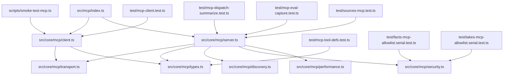
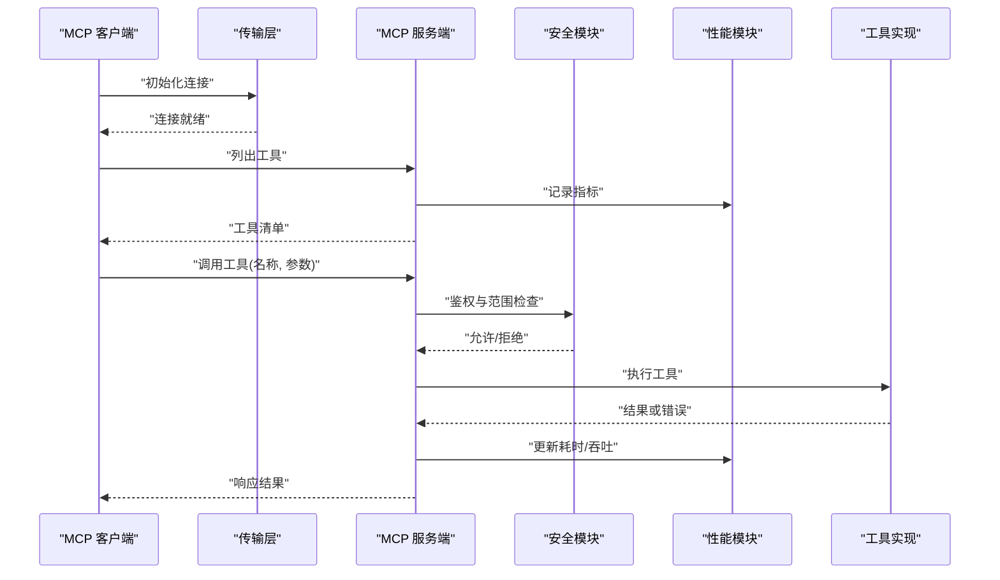
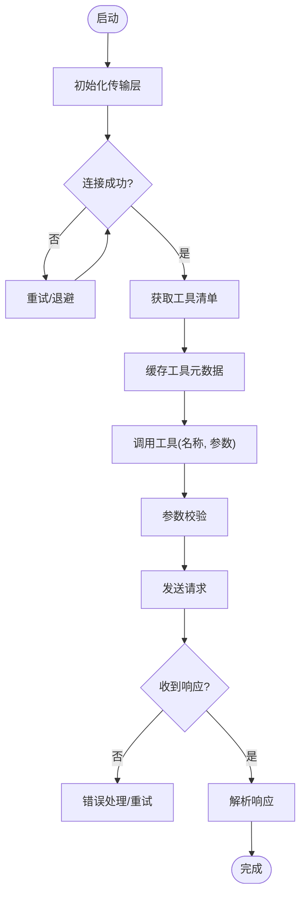
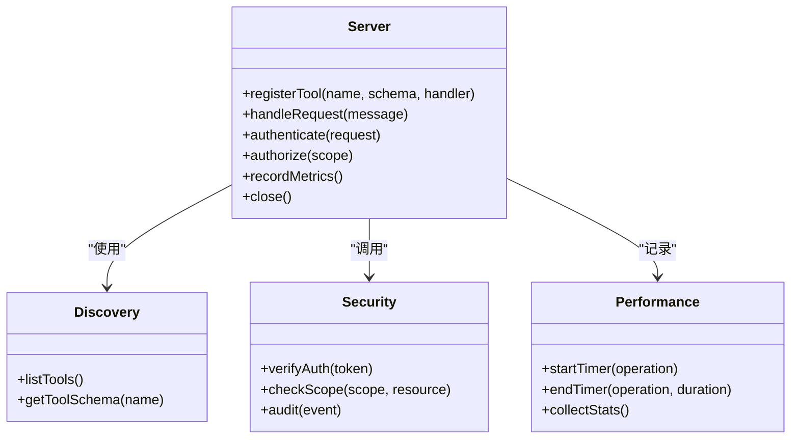
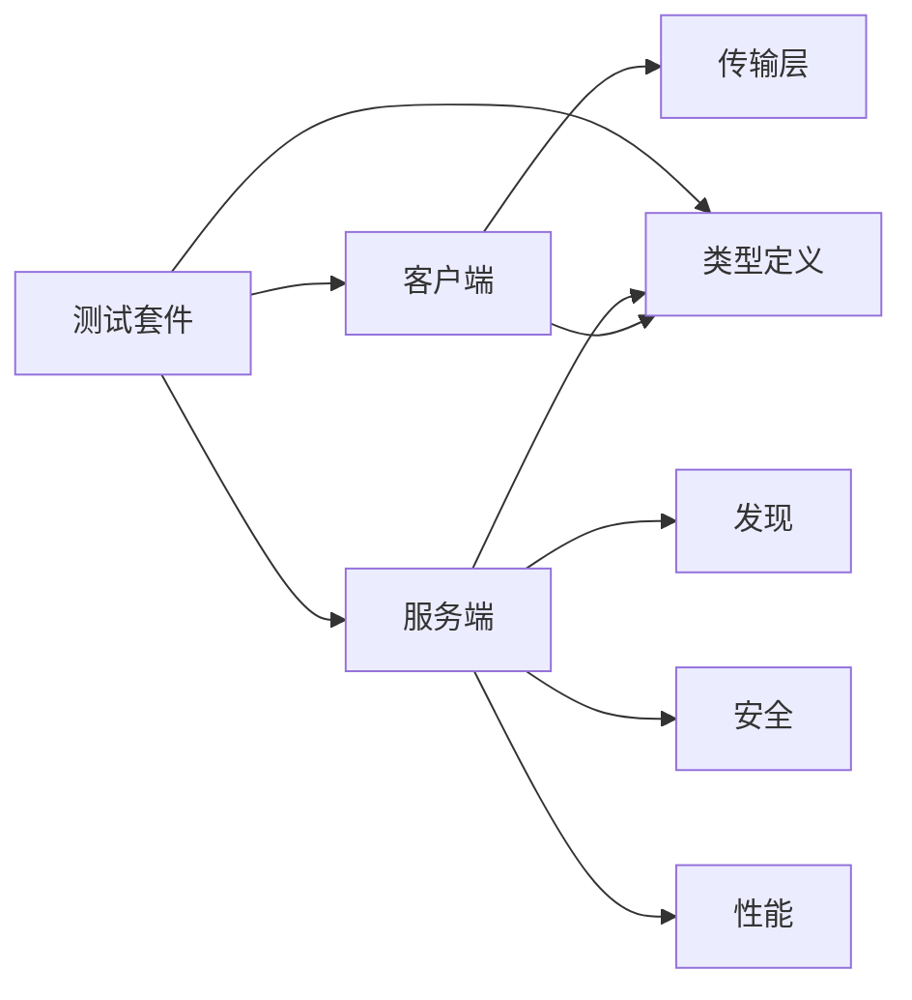

# MCP 协议

<cite>
**本文引用的文件**   
- [src/mcp/index.ts](file://src/mcp/index.ts)
- [src/core/mcp/client.ts](file://src/core/mcp/client.ts)
- [src/core/mcp/server.ts](file://src/core/mcp/server.ts)
- [src/core/mcp/transport.ts](file://src/core/mcp/transport.ts)
- [src/core/mcp/types.ts](file://src/core/mcp/types.ts)
- [src/core/mcp/discovery.ts](file://src/core/mcp/discovery.ts)
- [src/core/mcp/security.ts](file://src/core/mcp/security.ts)
- [src/core/mcp/performance.ts](file://src/core/mcp/performance.ts)
- [scripts/smoke-test-mcp.ts](file://scripts/smoke-test-mcp.ts)
- [test/mcp-client.test.ts](file://test/mcp-client.test.ts)
- [test/mcp-tool-defs.test.ts](file://test/mcp-tool-defs.test.ts)
- [test/mcp-dispatch-summarize.test.ts](file://test/mcp-dispatch-summarize.test.ts)
- [test/mcp-eval-capture.test.ts](file://test/mcp-eval-capture.test.ts)
- [test/sources-mcp.test.ts](file://test/sources-mcp.test.ts)
- [test/facts-mcp-allowlist.serial.test.ts](file://test/facts-mcp-allowlist.serial.test.ts)
- [test/takes-mcp-allowlist.serial.test.ts](file://test/takes-mcp-allowlist.serial.test.ts)
</cite>

## 目录
1. [简介](#简介)
2. [项目结构](#项目结构)
3. [核心组件](#核心组件)
4. [架构总览](#架构总览)
5. [详细组件分析](#详细组件分析)
6. [依赖关系分析](#依赖关系分析)
7. [性能考量](#性能考量)
8. [故障排查指南](#故障排查指南)
9. [结论](#结论)
10. [附录](#附录)

## 简介
本文件面向希望深入理解与实现 Model Context Protocol（MCP）的开发者，系统阐述该协议的通信模型、消息格式、工具定义规范、连接与会话管理、错误处理、工具分发与发现、客户端与服务端开发指南、安全与访问控制，以及性能优化与监控指标。文档基于仓库中 MCP 相关源码与测试用例进行归纳总结，确保内容与实际实现保持一致。

## 项目结构
仓库中与 MCP 相关的代码主要位于 src/core/mcp 目录，配套有脚本与测试：
- 协议核心：client、server、transport、types、discovery、security、performance 等模块
- 顶层入口：src/mcp/index.ts 暴露统一 API
- 集成与验证：scripts/smoke-test-mcp.ts 提供端到端冒烟测试
- 单元测试：test 目录下覆盖客户端、工具定义、调度汇总、评估捕获、来源集成、白名单等场景

图表来源
- [src/mcp/index.ts](file://src/mcp/index.ts)
- [src/core/mcp/client.ts](file://src/core/mcp/client.ts)
- [src/core/mcp/server.ts](file://src/core/mcp/server.ts)
- [src/core/mcp/transport.ts](file://src/core/mcp/transport.ts)
- [src/core/mcp/types.ts](file://src/core/mcp/types.ts)
- [src/core/mcp/discovery.ts](file://src/core/mcp/discovery.ts)
- [src/core/mcp/security.ts](file://src/core/mcp/security.ts)
- [src/core/mcp/performance.ts](file://src/core/mcp/performance.ts)
- [scripts/smoke-test-mcp.ts](file://scripts/smoke-test-mcp.ts)
- [test/mcp-client.test.ts](file://test/mcp-client.test.ts)
- [test/mcp-tool-defs.test.ts](file://test/mcp-tool-defs.test.ts)
- [test/mcp-dispatch-summarize.test.ts](file://test/mcp-dispatch-summarize.test.ts)
- [test/mcp-eval-capture.test.ts](file://test/mcp-eval-capture.test.ts)
- [test/sources-mcp.test.ts](file://test/sources-mcp.test.ts)
- [test/facts-mcp-allowlist.serial.test.ts](file://test/facts-mcp-allowlist.serial.test.ts)
- [test/takes-mcp-allowlist.serial.test.ts](file://test/takes-mcp-allowlist.serial.test.ts)

章节来源
- [src/mcp/index.ts](file://src/mcp/index.ts)
- [src/core/mcp/client.ts](file://src/core/mcp/client.ts)
- [src/core/mcp/server.ts](file://src/core/mcp/server.ts)
- [src/core/mcp/transport.ts](file://src/core/mcp/transport.ts)
- [src/core/mcp/types.ts](file://src/core/mcp/types.ts)
- [src/core/mcp/discovery.ts](file://src/core/mcp/discovery.ts)
- [src/core/mcp/security.ts](file://src/core/mcp/security.ts)
- [src/core/mcp/performance.ts](file://src/core/mcp/performance.ts)
- [scripts/smoke-test-mcp.ts](file://scripts/smoke-test-mcp.ts)
- [test/mcp-client.test.ts](file://test/mcp-client.test.ts)
- [test/mcp-tool-defs.test.ts](file://test/mcp-tool-defs.test.ts)
- [test/mcp-dispatch-summarize.test.ts](file://test/mcp-dispatch-summarize.test.ts)
- [test/mcp-eval-capture.test.ts](file://test/mcp-eval-capture.test.ts)
- [test/sources-mcp.test.ts](file://test/sources-mcp.test.ts)
- [test/facts-mcp-allowlist.serial.test.ts](file://test/facts-mcp-allowlist.serial.test.ts)
- [test/takes-mcp-allowlist.serial.test.ts](file://test/takes-mcp-allowlist.serial.test.ts)

## 核心组件
- 客户端（Client）：负责建立连接、发送请求、接收响应、管理会话上下文、重试与超时控制。
- 服务端（Server）：负责注册工具、路由调用、鉴权与审计、性能统计与限流。
- 传输层（Transport）：抽象底层通道（如 stdio、HTTP），屏蔽具体 IO 细节，保证消息序列化与反序列化一致性。
- 类型与消息（Types）：定义协议消息结构、工具定义、参数校验规则、返回格式与错误码。
- 发现（Discovery）：服务端的工具清单发现机制，支持动态注册与版本协商。
- 安全（Security）：认证、授权、范围限制、输入输出过滤与审计日志。
- 性能（Performance）：缓存、批处理、并发控制、指标采集与告警。

章节来源
- [src/core/mcp/client.ts](file://src/core/mcp/client.ts)
- [src/core/mcp/server.ts](file://src/core/mcp/server.ts)
- [src/core/mcp/transport.ts](file://src/core/mcp/transport.ts)
- [src/core/mcp/types.ts](file://src/core/mcp/types.ts)
- [src/core/mcp/discovery.ts](file://src/core/mcp/discovery.ts)
- [src/core/mcp/security.ts](file://src/core/mcp/security.ts)
- [src/core/mcp/performance.ts](file://src/core/mcp/performance.ts)

## 架构总览
MCP 采用“客户端-服务端”模型，通过传输层进行双向消息交换。服务端维护工具注册表，客户端在会话期间按需发现并调用工具。安全策略在服务端侧执行，性能指标贯穿全链路。

图表来源
- [src/core/mcp/client.ts](file://src/core/mcp/client.ts)
- [src/core/mcp/server.ts](file://src/core/mcp/server.ts)
- [src/core/mcp/transport.ts](file://src/core/mcp/transport.ts)
- [src/core/mcp/security.ts](file://src/core/mcp/security.ts)
- [src/core/mcp/performance.ts](file://src/core/mcp/performance.ts)

## 详细组件分析

### 客户端（Client）
- 职责：连接生命周期管理、请求-响应编排、会话状态维护、错误重试与超时。
- 关键流程：
  - 建立传输通道并握手
  - 获取工具清单并缓存
  - 构造请求消息并发送
  - 解析响应并处理错误
  - 会话结束清理资源

图表来源
- [src/core/mcp/client.ts](file://src/core/mcp/client.ts)
- [src/core/mcp/transport.ts](file://src/core/mcp/transport.ts)
- [src/core/mcp/types.ts](file://src/core/mcp/types.ts)

章节来源
- [src/core/mcp/client.ts](file://src/core/mcp/client.ts)
- [test/mcp-client.test.ts](file://test/mcp-client.test.ts)

### 服务端（Server）
- 职责：工具注册、路由分发、鉴权与审计、性能统计、错误上报。
- 关键流程：
  - 启动并监听传输通道
  - 注册工具与元数据
  - 接收请求并进行鉴权
  - 分发给对应工具实现
  - 收集指标并返回响应

图表来源
- [src/core/mcp/server.ts](file://src/core/mcp/server.ts)
- [src/core/mcp/discovery.ts](file://src/core/mcp/discovery.ts)
- [src/core/mcp/security.ts](file://src/core/mcp/security.ts)
- [src/core/mcp/performance.ts](file://src/core/mcp/performance.ts)

章节来源
- [src/core/mcp/server.ts](file://src/core/mcp/server.ts)
- [test/mcp-dispatch-summarize.test.ts](file://test/mcp-dispatch-summarize.test.ts)
- [test/mcp-eval-capture.test.ts](file://test/mcp-eval-capture.test.ts)
- [test/sources-mcp.test.ts](file://test/sources-mcp.test.ts)

### 传输层（Transport）
- 职责：抽象底层 IO，提供统一的 send/receive 接口；处理消息编解码、心跳保活、断线重连。
- 关键点：
  - 消息边界与完整性校验
  - 背压与流量控制
  - 多路复用（可选）

章节来源
- [src/core/mcp/transport.ts](file://src/core/mcp/transport.ts)

### 类型与消息（Types）
- 职责：定义协议消息结构、工具定义语法、参数校验规则、返回格式与错误码。
- 要点：
  - 工具定义包含名称、描述、参数 Schema、返回 Schema
  - 参数校验遵循严格模式，缺失必填字段应返回明确错误
  - 错误对象包含 code、message、details 等字段

章节来源
- [src/core/mcp/types.ts](file://src/core/mcp/types.ts)
- [test/mcp-tool-defs.test.ts](file://test/mcp-tool-defs.test.ts)

### 发现（Discovery）
- 职责：维护工具注册表，支持动态增删改查，提供版本协商能力。
- 关键点：
  - 工具清单的幂等查询
  - 变更通知与增量同步（可选）

章节来源
- [src/core/mcp/discovery.ts](file://src/core/mcp/discovery.ts)

### 安全（Security）
- 职责：认证、授权、范围限制、输入输出过滤、审计日志。
- 关键点：
  - 令牌校验与签名验证
  - 基于角色的访问控制（RBAC）与资源级范围
  - 敏感信息脱敏与审计事件持久化

章节来源
- [src/core/mcp/security.ts](file://src/core/mcp/security.ts)
- [test/facts-mcp-allowlist.serial.test.ts](file://test/facts-mcp-allowlist.serial.test.ts)
- [test/takes-mcp-allowlist.serial.test.ts](file://test/takes-mcp-allowlist.serial.test.ts)

### 性能（Performance）
- 职责：缓存、批处理、并发控制、指标采集与告警。
- 关键点：
  - 工具清单与热点结果缓存
  - 请求合并与批量执行
  - 延迟、吞吐、错误率等指标上报

章节来源
- [src/core/mcp/performance.ts](file://src/core/mcp/performance.ts)

## 依赖关系分析
- 客户端依赖传输层与类型定义，不直接耦合具体 IO 实现。
- 服务端依赖发现、安全与性能模块，形成松耦合的分层架构。
- 测试覆盖客户端行为、工具定义、调度汇总、评估捕获、来源集成与安全白名单。

图表来源
- [src/core/mcp/client.ts](file://src/core/mcp/client.ts)
- [src/core/mcp/server.ts](file://src/core/mcp/server.ts)
- [src/core/mcp/transport.ts](file://src/core/mcp/transport.ts)
- [src/core/mcp/types.ts](file://src/core/mcp/types.ts)
- [src/core/mcp/discovery.ts](file://src/core/mcp/discovery.ts)
- [src/core/mcp/security.ts](file://src/core/mcp/security.ts)
- [src/core/mcp/performance.ts](file://src/core/mcp/performance.ts)
- [test/mcp-client.test.ts](file://test/mcp-client.test.ts)
- [test/mcp-tool-defs.test.ts](file://test/mcp-tool-defs.test.ts)
- [test/mcp-dispatch-summarize.test.ts](file://test/mcp-dispatch-summarize.test.ts)
- [test/mcp-eval-capture.test.ts](file://test/mcp-eval-capture.test.ts)
- [test/sources-mcp.test.ts](file://test/sources-mcp.test.ts)

章节来源
- [src/core/mcp/client.ts](file://src/core/mcp/client.ts)
- [src/core/mcp/server.ts](file://src/core/mcp/server.ts)
- [src/core/mcp/transport.ts](file://src/core/mcp/transport.ts)
- [src/core/mcp/types.ts](file://src/core/mcp/types.ts)
- [src/core/mcp/discovery.ts](file://src/core/mcp/discovery.ts)
- [src/core/mcp/security.ts](file://src/core/mcp/security.ts)
- [src/core/mcp/performance.ts](file://src/core/mcp/performance.ts)
- [test/mcp-client.test.ts](file://test/mcp-client.test.ts)
- [test/mcp-tool-defs.test.ts](file://test/mcp-tool-defs.test.ts)
- [test/mcp-dispatch-summarize.test.ts](file://test/mcp-dispatch-summarize.test.ts)
- [test/mcp-eval-capture.test.ts](file://test/mcp-eval-capture.test.ts)
- [test/sources-mcp.test.ts](file://test/sources-mcp.test.ts)

## 性能考量
- 缓存策略：对工具清单与高频结果进行短期缓存，减少重复计算与网络开销。
- 批处理与合并：将多个小请求合并为批量操作，降低上下文切换与序列化成本。
- 并发控制：限制最大并发度，避免资源耗尽；对慢工具实施隔离与熔断。
- 指标与监控：采集延迟分布、吞吐、错误率、队列长度等指标，设置阈值告警。
- 背压与限流：在传输层实现背压，防止下游过载；按租户或工具维度限流。

[本节为通用指导，无需特定文件引用]

## 故障排查指南
- 连接问题：检查传输层初始化、握手失败原因、心跳超时与重连策略。
- 工具未找到：确认工具注册是否成功、清单缓存是否过期、命名空间是否一致。
- 参数校验失败：核对工具定义的参数 Schema，定位缺失或类型不匹配字段。
- 鉴权失败：检查令牌有效性、角色权限与资源范围，查看审计日志。
- 性能退化：观察指标异常点，定位热点工具与瓶颈环节，调整缓存与并发配置。

章节来源
- [test/mcp-client.test.ts](file://test/mcp-client.test.ts)
- [test/mcp-tool-defs.test.ts](file://test/mcp-tool-defs.test.ts)
- [test/mcp-dispatch-summarize.test.ts](file://test/mcp-dispatch-summarize.test.ts)
- [test/mcp-eval-capture.test.ts](file://test/mcp-eval-capture.test.ts)
- [test/sources-mcp.test.ts](file://test/sources-mcp.test.ts)
- [test/facts-mcp-allowlist.serial.test.ts](file://test/facts-mcp-allowlist.serial.test.ts)
- [test/takes-mcp-allowlist.serial.test.ts](file://test/takes-mcp-allowlist.serial.test.ts)

## 结论
MCP 通过清晰的客户端-服务端分层、可插拔的传输层与严格的类型定义，实现了稳定高效的工具调用生态。结合完善的安全与性能模块，可在复杂环境中提供可靠的工具发现、鉴权与执行能力。建议在生产环境启用全面的指标采集与审计，持续优化缓存与并发策略，保障高可用与低延迟。

[本节为总结性内容，无需特定文件引用]

## 附录

### 开发指南与集成示例
- 客户端 SDK 使用：
  - 初始化传输层并建立连接
  - 获取工具清单并缓存
  - 调用工具并处理响应与错误
  - 参考路径：[src/core/mcp/client.ts](file://src/core/mcp/client.ts)、[test/mcp-client.test.ts](file://test/mcp-client.test.ts)
- 服务端 SDK 使用：
  - 注册工具与处理器
  - 配置鉴权与范围策略
  - 开启性能统计与审计
  - 参考路径：[src/core/mcp/server.ts](file://src/core/mcp/server.ts)、[test/mcp-dispatch-summarize.test.ts](file://test/mcp-dispatch-summarize.test.ts)
- 端到端冒烟测试：
  - 参考路径：[scripts/smoke-test-mcp.ts](file://scripts/smoke-test-mcp.ts)

章节来源
- [src/core/mcp/client.ts](file://src/core/mcp/client.ts)
- [src/core/mcp/server.ts](file://src/core/mcp/server.ts)
- [scripts/smoke-test-mcp.ts](file://scripts/smoke-test-mcp.ts)
- [test/mcp-client.test.ts](file://test/mcp-client.test.ts)
- [test/mcp-dispatch-summarize.test.ts](file://test/mcp-dispatch-summarize.test.ts)