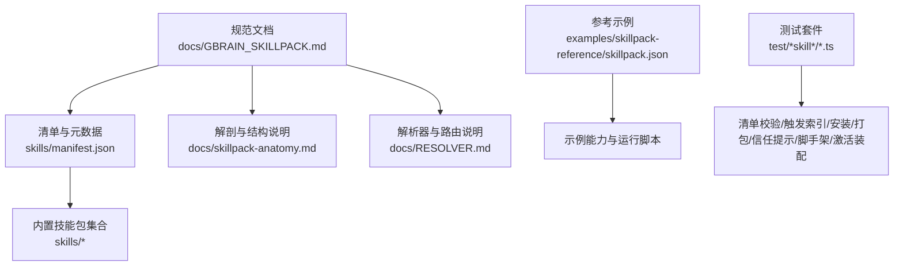
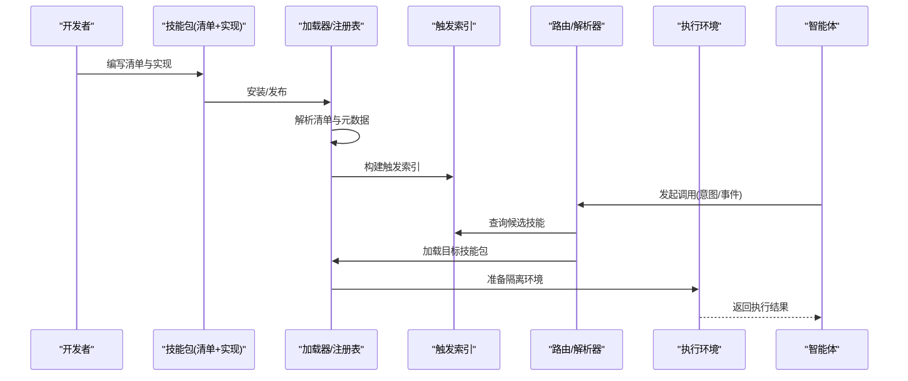
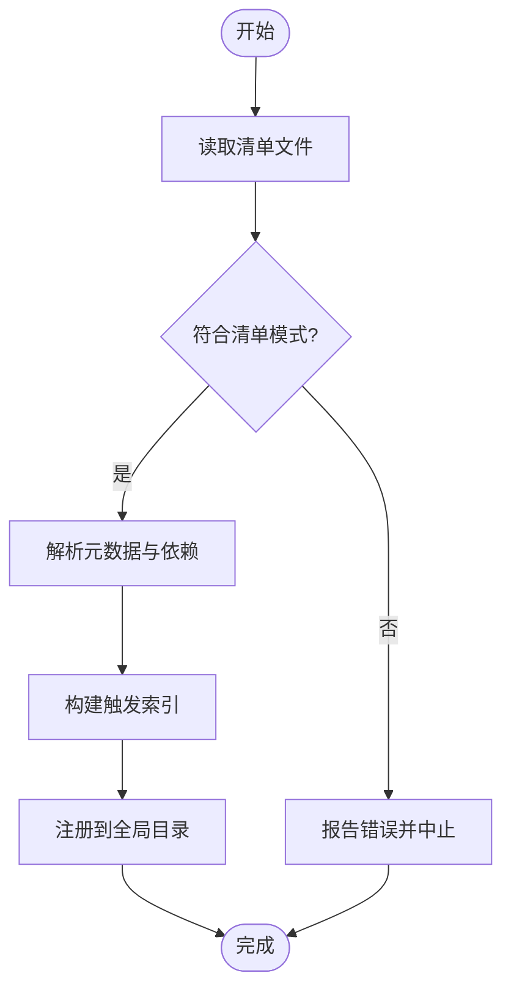
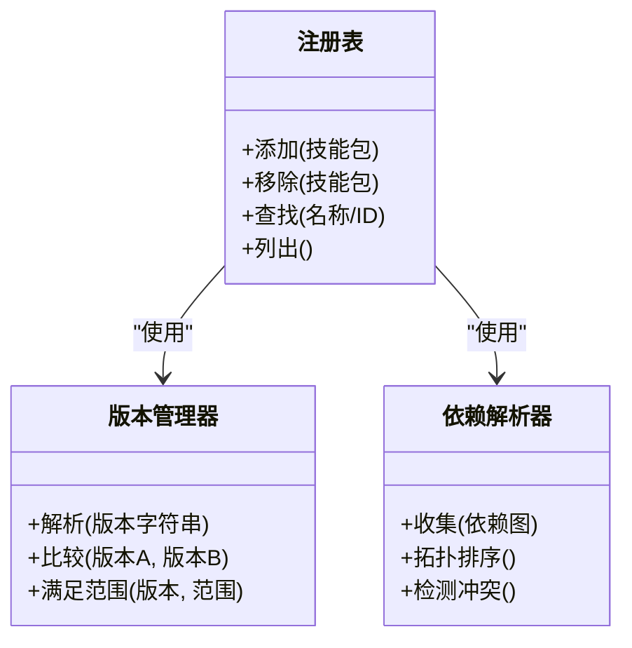
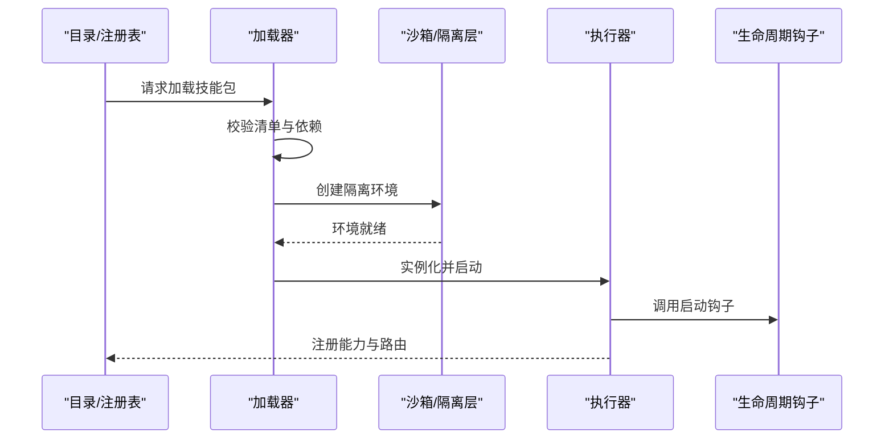
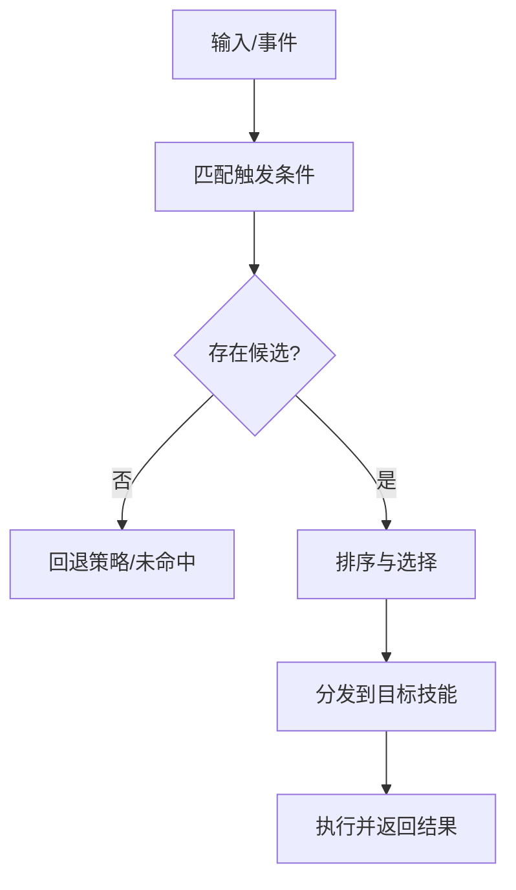
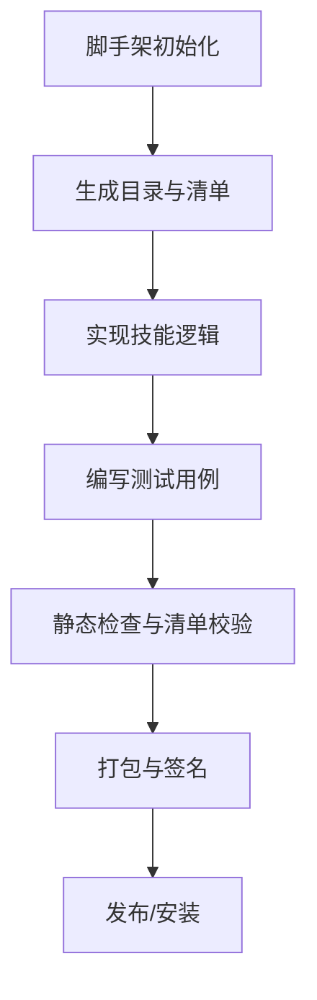
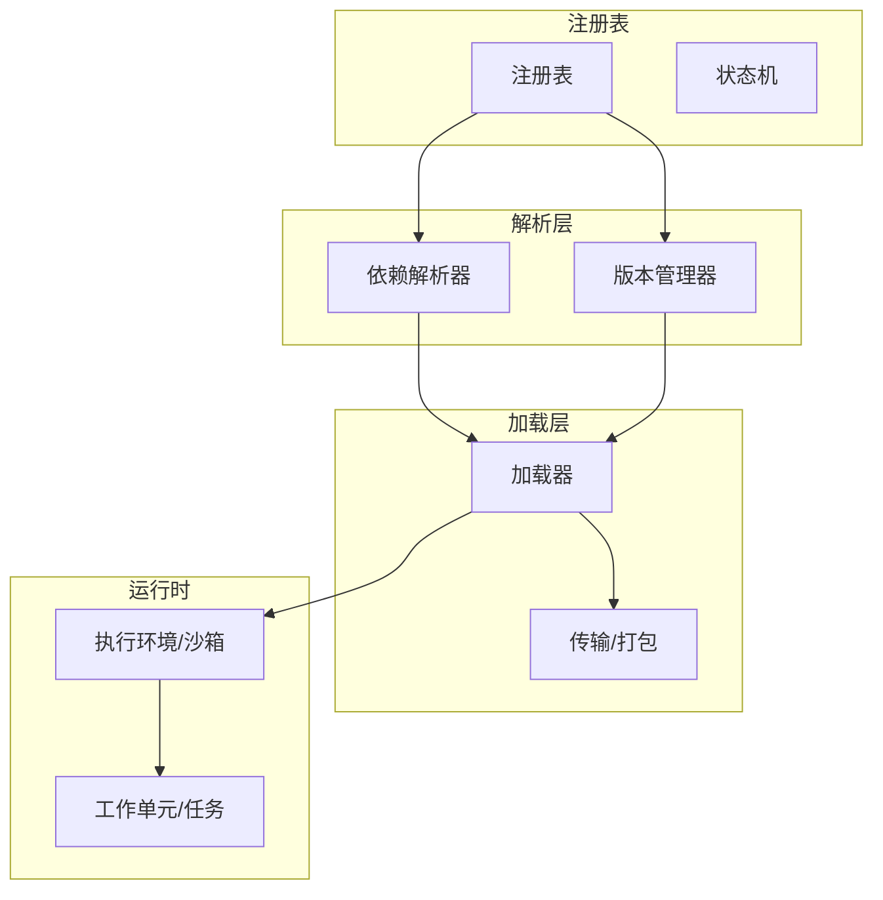

# 技能包体系

<cite>
**本文引用的文件**   
- [GBRAIN_SKILLPACK.md](file://docs/GBRAIN_SKILLPACK.md)
- [skillpack-anatomy.md](file://docs/skillpack-anatomy.md)
- [manifest.json](file://skills/manifest.json)
- [skillpack.json](file://examples/skillpack-reference/skillpack.json)
- [RESOLVER.md](file://skills/RESOLVER.md)
- [_AGENT_README.md](file://skills/_AGENT_README.md)
- [plugin-loader.test.ts](file://test/plugin-loader.test.ts)
- [skill-manifest.test.ts](file://test/skill-manifest.test.ts)
- [skill-trigger-index.test.ts](file://test/skill-trigger-index.test.ts)
- [skill-catalog.test.ts](file://test/skill-catalog.test.ts)
- [skill-catalog-security.test.ts](file://test/skill-catalog-security.test.ts)
- [skill-catalog-transports.test.ts](file://test/skill-catalog-transports.test.ts)
- [skillpack-install.test.ts](file://test/skillpack-install.test.ts)
- [skillpack-manifest-v1.test.ts](file://test/skillpack-manifest-v1.test.ts)
- [skillpack-scaffold.test.ts](file://test/skillpack-scaffold.test.ts)
- [skillpack-harvest-lint.test.ts](file://test/skillpack-harvest-lint.test.ts)
- [skillpack-check.test.ts](file://test/skillpack-check.test.ts)
- [skillpack-state.test.ts](file://test/skillpack-state.test.ts)
- [skillpack-tarball.test.ts](file://test/skillpack-tarball.test.ts)
- [skillpack-trust-prompt.test.ts](file://test/skillpack-trust-prompt.test.ts)
- [skillify-check.test.ts](file://test/skillify-check.test.ts)
- [skillify-scaffold.test.ts](file://test/skillify-scaffold.test.ts)
- [active-pack-wiring.test.ts](file://test/active-pack-wiring.test.ts)
- [schema-pack-loader.test.ts](file://test/schema-pack-loader.test.ts)
- [schema-pack-registry.test.ts](file://test/schema-pack-registry.test.ts)
- [schema-pack-load-active.serial.test.ts](file://test/schema-pack-load-active.serial.test.ts)
</cite>

## 目录
1. [简介](#简介)
2. [项目结构](#项目结构)
3. [核心组件](#核心组件)
4. [架构总览](#架构总览)
5. [详细组件分析](#详细组件分析)
6. [依赖关系分析](#依赖关系分析)
7. [性能考虑](#性能考虑)
8. [故障排查指南](#故障排查指南)
9. [结论](#结论)
10. [附录](#附录)

## 简介
本文件系统性阐述 GBrain 的“技能包”体系，覆盖其架构与设计原理、清单与元数据规范、注册与版本管理、依赖解析、加载流程、执行环境与隔离机制、与智能体的绑定与路由规则，以及开发指南、内置示例与自定义创建过程、安全与性能优化和部署策略。文档以仓库中的规范文档与测试用例为依据，确保内容可追溯、可验证。

## 项目结构
技能包相关的关键位置包括：
- 规范与说明文档：位于 docs 目录下的 GBRAIN_SKILLPACK.md、skillpack-anatomy.md、RESOLVER.md 等
- 内置技能包集合：位于 skills 目录，包含多个功能域的技能包及全局 manifest.json
- 参考示例：examples/skillpack-reference 提供最小可用示例与 e2e/evals/runbooks/test 等配套资源
- 行为验证：大量测试用例覆盖清单校验、触发索引、安装、打包、信任提示、脚手架生成、激活装配等

图表来源
- [GBRAIN_SKILLPACK.md](file://docs/GBRAIN_SKILLPACK.md)
- [skillpack-anatomy.md](file://docs/skillpack-anatomy.md)
- [manifest.json](file://skills/manifest.json)
- [RESOLVER.md](file://docs/RESOLVER.md)
- [skillpack.json](file://examples/skillpack-reference/skillpack.json)
- [plugin-loader.test.ts](file://test/plugin-loader.test.ts)
- [skill-manifest.test.ts](file://test/skill-manifest.test.ts)
- [skill-trigger-index.test.ts](file://test/skill-trigger-index.test.ts)
- [skill-catalog.test.ts](file://test/skill-catalog.test.ts)
- [skill-catalog-security.test.ts](file://test/skill-catalog-security.test.ts)
- [skill-catalog-transports.test.ts](file://test/skill-catalog-transports.test.ts)
- [skillpack-install.test.ts](file://test/skillpack-install.test.ts)
- [skillpack-manifest-v1.test.ts](file://test/skillpack-manifest-v1.test.ts)
- [skillpack-scaffold.test.ts](file://test/skillpack-scaffold.test.ts)
- [skillpack-harvest-lint.test.ts](file://test/skillpack-harvest-lint.test.ts)
- [skillpack-check.test.ts](file://test/skillpack-check.test.ts)
- [skillpack-state.test.ts](file://test/skillpack-state.test.ts)
- [skillpack-tarball.test.ts](file://test/skillpack-tarball.test.ts)
- [skillpack-trust-prompt.test.ts](file://test/skillpack-trust-prompt.test.ts)
- [skillify-check.test.ts](file://test/skillify-check.test.ts)
- [skillify-scaffold.test.ts](file://test/skillify-scaffold.test.ts)
- [active-pack-wiring.test.ts](file://test/active-pack-wiring.test.ts)
- [schema-pack-loader.test.ts](file://test/schema-pack-loader.test.ts)
- [schema-pack-registry.test.ts](file://test/schema-pack-registry.test.ts)
- [schema-pack-load-active.serial.test.ts](file://test/schema-pack-load-active.serial.test.ts)

章节来源
- [GBRAIN_SKILLPACK.md](file://docs/GBRAIN_SKILLPACK.md)
- [skillpack-anatomy.md](file://docs/skillpack-anatomy.md)
- [manifest.json](file://skills/manifest.json)
- [RESOLVER.md](file://docs/RESOLVER.md)
- [skillpack.json](file://examples/skillpack-reference/skillpack.json)

## 核心组件
- 清单与元数据
  - 每个技能包通过清单文件声明名称、版本、描述、入口、触发条件、依赖、权限与安全策略等元数据。
  - 全局 manifest.json 汇总已安装或内置技能包的索引信息，便于快速发现与路由。
- 解析器与路由
  - 解析器负责将用户意图或事件映射到具体技能包与技能项，支持多策略匹配与优先级排序。
- 生命周期与状态
  - 安装、启用、禁用、升级、卸载等状态转换由状态机驱动，并持久化记录变更历史。
- 安全与信任
  - 第三方技能包在首次使用前需进行信任提示与确认，限制敏感操作范围。
- 传输与打包
  - 支持本地目录、压缩包等多种来源；提供校验、签名与完整性检查。
- 脚手架与工具链
  - 提供初始化、检查、采集（harvest）、脚手架生成等 CLI 命令，降低开发门槛。

章节来源
- [GBRAIN_SKILLPACK.md](file://docs/GBRAIN_SKILLPACK.md)
- [skillpack-anatomy.md](file://docs/skillpack-anatomy.md)
- [manifest.json](file://skills/manifest.json)
- [RESOLVER.md](file://docs/RESOLVER.md)
- [skillpack.json](file://examples/skillpack-reference/skillpack.json)

## 架构总览
下图展示从清单到运行时调用的整体链路：清单解析、注册表构建、触发索引、路由匹配、环境准备与执行、结果回传。

图表来源
- [GBRAIN_SKILLPACK.md](file://docs/GBRAIN_SKILLPACK.md)
- [skillpack-anatomy.md](file://docs/skillpack-anatomy.md)
- [RESOLVER.md](file://docs/RESOLVER.md)
- [plugin-loader.test.ts](file://test/plugin-loader.test.ts)
- [skill-manifest.test.ts](file://test/skill-manifest.test.ts)
- [skill-trigger-index.test.ts](file://test/skill-trigger-index.test.ts)
- [skill-catalog.test.ts](file://test/skill-catalog.test.ts)
- [skill-catalog-security.test.ts](file://test/skill-catalog-security.test.ts)
- [skill-catalog-transports.test.ts](file://test/skill-catalog-transports.test.ts)
- [skillpack-install.test.ts](file://test/skillpack-install.test.ts)
- [skillpack-manifest-v1.test.ts](file://test/skillpack-manifest-v1.test.ts)
- [skillpack-scaffold.test.ts](file://test/skillpack-scaffold.test.ts)
- [skillpack-harvest-lint.test.ts](file://test/skillpack-harvest-lint.test.ts)
- [skillpack-check.test.ts](file://test/skillpack-check.test.ts)
- [skillpack-state.test.ts](file://test/skillpack-state.test.ts)
- [skillpack-tarball.test.ts](file://test/skillpack-tarball.test.ts)
- [skillpack-trust-prompt.test.ts](file://test/skillpack-trust-prompt.test.ts)
- [skillify-check.test.ts](file://test/skillify-check.test.ts)
- [skillify-scaffold.test.ts](file://test/skillify-scaffold.test.ts)
- [active-pack-wiring.test.ts](file://test/active-pack-wiring.test.ts)
- [schema-pack-loader.test.ts](file://test/schema-pack-loader.test.ts)
- [schema-pack-registry.test.ts](file://test/schema-pack-registry.test.ts)
- [schema-pack-load-active.serial.test.ts](file://test/schema-pack-load-active.serial.test.ts)

## 详细组件分析

### 清单与元数据规范
- 清单文件命名与位置
  - 典型为 skillpack.json，位于技能包根目录；全局索引为 skills/manifest.json。
- 关键字段
  - 标识与版本：名称、唯一 ID、语义化版本、兼容性矩阵
  - 元信息：标题、描述、作者、许可证、图标、文档链接
  - 入口与类型：主入口模块、技能类型（如工具、工作流、钩子）
  - 触发与路由：事件类型、关键词、正则、上下文约束、作用域
  - 依赖与约束：对其它技能包、系统能力、外部服务的依赖与版本范围
  - 权限与安全：所需权限、网络访问、文件系统访问、沙箱策略
  - 配置与参数：默认配置、环境变量、密钥注入方式
  - 扩展点：对外暴露的 API、回调、消息协议
- 校验与演进
  - 清单格式校验、向后兼容检查、迁移指引与废弃字段处理
  - 版本升级路径与破坏性变更策略

图表来源
- [GBRAIN_SKILLPACK.md](file://docs/GBRAIN_SKILLPACK.md)
- [skillpack-anatomy.md](file://docs/skillpack-anatomy.md)
- [manifest.json](file://skills/manifest.json)
- [skillpack.json](file://examples/skillpack-reference/skillpack.json)
- [skill-manifest.test.ts](file://test/skill-manifest.test.ts)
- [skillpack-manifest-v1.test.ts](file://test/skillpack-manifest-v1.test.ts)

章节来源
- [GBRAIN_SKILLPACK.md](file://docs/GBRAIN_SKILLPACK.md)
- [skillpack-anatomy.md](file://docs/skillpack-anatomy.md)
- [manifest.json](file://skills/manifest.json)
- [skillpack.json](file://examples/skillpack-reference/skillpack.json)
- [skill-manifest.test.ts](file://test/skill-manifest.test.ts)
- [skillpack-manifest-v1.test.ts](file://test/skillpack-manifest-v1.test.ts)

### 注册机制、版本管理与依赖解析
- 注册机制
  - 安装时解析清单并写入全局目录；支持热重载与增量更新。
- 版本管理
  - 采用语义化版本；支持锁定版本、自动升级与降级回滚。
- 依赖解析
  - 基于依赖图进行拓扑排序与冲突检测；支持可选依赖与条件依赖。
- 冲突与合并
  - 同名能力冲突时的优先级策略与覆盖规则；多来源合并策略。

图表来源
- [GBRAIN_SKILLPACK.md](file://docs/GBRAIN_SKILLPACK.md)
- [skillpack-anatomy.md](file://docs/skillpack-anatomy.md)
- [RESOLVER.md](file://docs/RESOLVER.md)
- [plugin-loader.test.ts](file://test/plugin-loader.test.ts)
- [skillpack-install.test.ts](file://test/skillpack-install.test.ts)
- [skillpack-state.test.ts](file://test/skillpack-state.test.ts)

章节来源
- [GBRAIN_SKILLPACK.md](file://docs/GBRAIN_SKILLPACK.md)
- [skillpack-anatomy.md](file://docs/skillpack-anatomy.md)
- [RESOLVER.md](file://docs/RESOLVER.md)
- [plugin-loader.test.ts](file://test/plugin-loader.test.ts)
- [skillpack-install.test.ts](file://test/skillpack-install.test.ts)
- [skillpack-state.test.ts](file://test/skillpack-state.test.ts)

### 加载流程、执行环境与隔离机制
- 加载流程
  - 发现清单 -> 校验 -> 解析依赖 -> 按需下载/解压 -> 注册 -> 预热缓存。
- 执行环境
  - 进程级或线程级隔离；受限的系统调用白名单；内存与 CPU 配额。
- 安全边界
  - 沙箱策略、网络访问控制、文件系统只读挂载、临时目录隔离。
- 生命周期钩子
  - 启动/停止、健康检查、优雅关闭、日志与指标上报。

图表来源
- [GBRAIN_SKILLPACK.md](file://docs/GBRAIN_SKILLPACK.md)
- [skillpack-anatomy.md](file://docs/skillpack-anatomy.md)
- [plugin-loader.test.ts](file://test/plugin-loader.test.ts)
- [skill-catalog-security.test.ts](file://test/skill-catalog-security.test.ts)
- [skillpack-tarball.test.ts](file://test/skillpack-tarball.test.ts)

章节来源
- [GBRAIN_SKILLPACK.md](file://docs/GBRAIN_SKILLPACK.md)
- [skillpack-anatomy.md](file://docs/skillpack-anatomy.md)
- [plugin-loader.test.ts](file://test/plugin-loader.test.ts)
- [skill-catalog-security.test.ts](file://test/skill-catalog-security.test.ts)
- [skillpack-tarball.test.ts](file://test/skillpack-tarball.test.ts)

### 与智能体的绑定关系、触发条件与路由规则
- 绑定关系
  - 技能包可绑定到特定智能体或角色，限定可见性与权限范围。
- 触发条件
  - 基于事件类型、关键词、正则表达式、上下文变量与时间窗口。
- 路由规则
  - 多候选匹配时按权重、最近使用、成功率与评分排序；支持灰度与分流。

图表来源
- [RESOLVER.md](file://docs/RESOLVER.md)
- [skill-trigger-index.test.ts](file://test/skill-trigger-index.test.ts)
- [active-pack-wiring.test.ts](file://test/active-pack-wiring.test.ts)

章节来源
- [RESOLVER.md](file://docs/RESOLVER.md)
- [skill-trigger-index.test.ts](file://test/skill-trigger-index.test.ts)
- [active-pack-wiring.test.ts](file://test/active-pack-wiring.test.ts)

### 开发指南：目录结构、接口规范与测试方法
- 目录结构建议
  - 根清单文件、src 源码、tests 测试、runbooks 运行手册、evals 评估集、e2e 端到端用例。
- 接口规范
  - 输入输出契约、错误码约定、幂等性与重试策略、超时与限流。
- 测试方法
  - 单元测试、集成测试、冒烟测试、回归测试与基准测试；模拟外部依赖与网络。
- 脚手架与工具
  - 使用脚手架初始化模板；使用 check/harvest/lint 等命令辅助质量保障。

图表来源
- [skillpack-scaffold.test.ts](file://test/skillpack-scaffold.test.ts)
- [skillify-scaffold.test.ts](file://test/skillify-scaffold.test.ts)
- [skillify-check.test.ts](file://test/skillify-check.test.ts)
- [skillpack-harvest-lint.test.ts](file://test/skillpack-harvest-lint.test.ts)
- [skillpack-check.test.ts](file://test/skillpack-check.test.ts)

章节来源
- [skillpack-scaffold.test.ts](file://test/skillpack-scaffold.test.ts)
- [skillify-scaffold.test.ts](file://test/skillify-scaffold.test.ts)
- [skillify-check.test.ts](file://test/skillify-check.test.ts)
- [skillpack-harvest-lint.test.ts](file://test/skillpack-harvest-lint.test.ts)
- [skillpack-check.test.ts](file://test/skillpack-check.test.ts)

### 内置技能包使用示例与自定义创建
- 内置示例
  - examples/skillpack-reference 提供完整的最小可用示例，含清单、运行脚本与测试。
- 自定义创建
  - 使用脚手架生成基础结构；根据业务需求补充实现与测试；通过安装与信任流程启用。

章节来源
- [skillpack.json](file://examples/skillpack-reference/skillpack.json)
- [skillpack-scaffold.test.ts](file://test/skillpack-scaffold.test.ts)
- [skillpack-install.test.ts](file://test/skillpack-install.test.ts)
- [skillpack-trust-prompt.test.ts](file://test/skillpack-trust-prompt.test.ts)

### 安全考虑
- 信任提示与授权
  - 首次使用第三方技能包需显式确认；支持细粒度权限控制。
- 传输与完整性
  - 支持压缩与校验；可结合签名与哈希验证。
- 执行隔离
  - 沙箱策略、资源限额、网络与文件系统访问控制。
- 审计与可观测性
  - 操作日志、错误追踪、指标上报与告警。

章节来源
- [skill-catalog-security.test.ts](file://test/skill-catalog-security.test.ts)
- [skillpack-trust-prompt.test.ts](file://test/skillpack-trust-prompt.test.ts)
- [skillpack-tarball.test.ts](file://test/skillpack-tarball.test.ts)

### 性能优化
- 索引与缓存
  - 触发索引预构建、热点能力缓存、惰性加载。
- 并发与批处理
  - 并行解析与加载、批量依赖解析、异步执行与背压控制。
- 资源治理
  - 内存与 CPU 配额、超时与熔断、优雅降级。

章节来源
- [skill-trigger-index.test.ts](file://test/skill-trigger-index.test.ts)
- [plugin-loader.test.ts](file://test/plugin-loader.test.ts)
- [skill-catalog.test.ts](file://test/skill-catalog.test.ts)

### 部署策略
- 本地与远程源
  - 支持本地目录、压缩包、远程仓库与私有源；统一安装接口。
- 版本与回滚
  - 锁定版本、灰度发布、一键回滚与一致性校验。
- 运维与监控
  - 健康检查、指标导出、日志聚合与告警联动。

章节来源
- [skillpack-install.test.ts](file://test/skillpack-install.test.ts)
- [skillpack-state.test.ts](file://test/skillpack-state.test.ts)
- [skill-catalog-transports.test.ts](file://test/skill-catalog-transports.test.ts)

## 依赖关系分析
技能包之间通过依赖图组织，解析器负责拓扑排序与冲突检测；注册表维护当前活跃集合；加载器负责按需装载与生命周期管理。

图表来源
- [GBRAIN_SKILLPACK.md](file://docs/GBRAIN_SKILLPACK.md)
- [skillpack-anatomy.md](file://docs/skillpack-anatomy.md)
- [RESOLVER.md](file://docs/RESOLVER.md)
- [plugin-loader.test.ts](file://test/plugin-loader.test.ts)
- [skillpack-install.test.ts](file://test/skillpack-install.test.ts)
- [skillpack-state.test.ts](file://test/skillpack-state.test.ts)
- [skillpack-tarball.test.ts](file://test/skillpack-tarball.test.ts)

章节来源
- [GBRAIN_SKILLPACK.md](file://docs/GBRAIN_SKILLPACK.md)
- [skillpack-anatomy.md](file://docs/skillpack-anatomy.md)
- [RESOLVER.md](file://docs/RESOLVER.md)
- [plugin-loader.test.ts](file://test/plugin-loader.test.ts)
- [skillpack-install.test.ts](file://test/skillpack-install.test.ts)
- [skillpack-state.test.ts](file://test/skillpack-state.test.ts)
- [skillpack-tarball.test.ts](file://test/skillpack-tarball.test.ts)

## 性能考虑
- 减少重复解析：清单与依赖缓存、增量更新
- 缩短冷启动：预构建索引、懒加载与按需实例化
- 控制资源占用：并发上限、超时与熔断、内存回收
- 提升吞吐：批处理、流水线与异步编排

[本节为通用指导，不直接分析具体文件]

## 故障排查指南
- 常见问题定位
  - 清单校验失败：检查字段类型、必填项与版本范围
  - 依赖冲突：查看冲突详情与解决建议
  - 触发未命中：核对触发条件与上下文变量
  - 执行异常：查看沙箱日志与权限拒绝原因
- 诊断工具
  - 清单检查、采集与 lint、状态查看与导出、信任提示记录
- 恢复策略
  - 回滚到稳定版本、禁用问题技能包、清理缓存并重载

章节来源
- [skillpack-check.test.ts](file://test/skillpack-check.test.ts)
- [skillpack-harvest-lint.test.ts](file://test/skillpack-harvest-lint.test.ts)
- [skillpack-state.test.ts](file://test/skillpack-state.test.ts)
- [skillpack-trust-prompt.test.ts](file://test/skillpack-trust-prompt.test.ts)

## 结论
GBrain 技能包体系以清晰的清单与元数据为核心，配合完善的注册、版本与依赖解析机制，实现了高内聚、低耦合的可插拔能力扩展。通过严格的加载流程、执行隔离与安全策略，保障了系统的稳定性与安全性。配套的脚手架、测试与工具链显著降低了开发与运维成本，使团队能够快速交付高质量技能包。

[本节为总结性内容，不直接分析具体文件]

## 附录
- 术语
  - 技能包：一组可被智能体调用的能力集合，包含清单与实现
  - 触发索引：将事件/意图映射到候选技能的索引结构
  - 注册表：维护已安装与活跃技能包的目录
  - 沙箱：隔离执行环境的抽象
- 参考
  - 规范文档：GBRAIN_SKILLPACK.md、skillpack-anatomy.md、RESOLVER.md
  - 示例：examples/skillpack-reference
  - 测试：test 目录下与 skill 相关的测试文件

[本节为补充信息，不直接分析具体文件]