# 数据流架构

<cite>
**本文引用的文件**   
- [README.md](file://README.md)
- [DESIGN.md](file://DESIGN.md)
- [src/schema.sql](file://src/schema.sql)
- [gbrain.yml](file://gbrain.yml)
- [package.json](file://package.json)
- [tsconfig.json](file://tsconfig.json)
- [docs/architecture/overview.md](file://docs/architecture/overview.md)
- [docs/storage-tiering.md](file://docs/storage-tiering.md)
- [docs/progress-events.md](file://docs/progress-events.md)
- [docs/guardrails.md](file://docs/guardrails.md)
- [docs/eval/eval-bench.md](file://docs/eval/eval-bench.md)
- [scripts/build-pglite-snapshot.ts](file://scripts/build-pglite-snapshot.ts)
- [src/core/engine.ts](file://src/core/engine.ts)
- [src/core/sync.ts](file://src/core/sync.ts)
- [src/core/facts-engine.ts](file://src/core/facts-engine.ts)
- [src/core/queue.ts](file://src/core/queue.ts)
- [src/core/worker-supervisor.ts](file://src/core/worker-supervisor.ts)
- [src/core/storage.ts](file://src/core/storage.ts)
- [src/core/search.ts](file://src/core/search.ts)
- [src/core/embedding-service.ts](file://src/core/embedding-service.ts)
- [src/core/migrations/orchestrator.ts](file://src/core/migrations/orchestrator.ts)
- [src/commands/sync-all.ts](file://src/commands/sync-all.ts)
- [src/commands/import-file.ts](file://src/commands/import-file.ts)
- [src/commands/reindex.ts](file://src/commands/reindex.ts)
- [skills/cron-scheduler/index.ts](file://skills/cron-scheduler/index.ts)
- [skills/ingest/index.ts](file://skills/ingest/index.ts)
- [skills/enrich/index.ts](file://skills/enrich/index.ts)
- [skills/publish/index.ts](file://skills/publish/index.ts)
- [skills/query/index.ts](file://skills/query/index.ts)
</cite>

## 目录
1. [简介](#简介)
2. [项目结构](#项目结构)
3. [核心组件](#核心组件)
4. [架构总览](#架构总览)
5. [详细组件分析](#详细组件分析)
6. [依赖关系分析](#依赖关系分析)
7. [性能考量](#性能考量)
8. [故障排查指南](#故障排查指南)
9. [结论](#结论)
10. [附录](#附录)

## 简介
本文件面向 GBrain 的数据流架构与处理管道，系统性阐述从数据摄取、转换清洗、增强、存储到检索的完整生命周期；解释批处理与实时处理的混合架构，包括任务调度、队列管理与并发控制；说明一致性保证、事务与回滚机制；提供监控、调试与性能分析方法；展示不同数据源的处理模式与适配器实现；并给出备份、恢复与灾难恢复策略。文档以仓库现有设计与实现为依据，辅以可视化图示帮助读者快速建立整体认知。

## 项目结构
GBrain 采用“核心引擎 + 技能（Skills）+ 命令（Commands）+ 文档与脚本”的分层组织方式：
- 核心引擎位于 src/core，负责同步、事实抽取、索引、嵌入、存储、搜索、迁移编排等关键能力。
- 命令位于 src/commands，暴露 CLI 入口，驱动批量或交互式流程。
- 技能位于 skills，封装可复用的数据处理阶段（如摄取、增强、发布、查询）。
- 文档 docs 包含架构设计、存储分层、进度事件、安全护栏等专题说明。
- 脚本 scripts 提供构建、快照、测试与运维工具。
- 配置与元信息在 gbrain.yml、package.json、tsconfig.json 中定义。

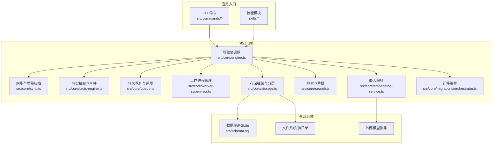

图表来源
- [src/core/engine.ts](file://src/core/engine.ts)
- [src/core/sync.ts](file://src/core/sync.ts)
- [src/core/facts-engine.ts](file://src/core/facts-engine.ts)
- [src/core/queue.ts](file://src/core/queue.ts)
- [src/core/worker-supervisor.ts](file://src/core/worker-supervisor.ts)
- [src/core/storage.ts](file://src/core/storage.ts)
- [src/core/search.ts](file://src/core/search.ts)
- [src/core/embedding-service.ts](file://src/core/embedding-service.ts)
- [src/core/migrations/orchestrator.ts](file://src/core/migrations/orchestrator.ts)
- [src/schema.sql](file://src/schema.sql)

章节来源
- [README.md](file://README.md)
- [DESIGN.md](file://DESIGN.md)
- [gbrain.yml](file://gbrain.yml)
- [package.json](file://package.json)
- [tsconfig.json](file://tsconfig.json)

## 核心组件
- 引擎协调器：统一编排摄取、抽取、索引、嵌入、发布与查询等阶段，维护全局状态与生命周期钩子。
- 同步与增量扫描：对多数据源进行差异发现、变更检测与增量拉取，支持断点续传与幂等写入。
- 事实抽取与合并：将非结构化内容解析为结构化事实，执行去重、冲突检测与版本化合并。
- 任务队列与并发：基于优先级、速率限制与重试策略的任务调度，保障吞吐与稳定性。
- 工作进程管理：隔离执行单元，支持进程级重启、资源回收与看门狗监控。
- 存储抽象与分层：统一读写接口，结合冷热分层与压缩策略优化成本与延迟。
- 检索与重排：全文检索、向量检索与混合排序，支持范围过滤与结果裁剪。
- 嵌入服务：调用外部模型生成向量，管理批大小、超时与失败重试。
- 迁移编排：按版本顺序执行数据库与索引迁移，支持回滚与校验。

章节来源
- [src/core/engine.ts](file://src/core/engine.ts)
- [src/core/sync.ts](file://src/core/sync.ts)
- [src/core/facts-engine.ts](file://src/core/facts-engine.ts)
- [src/core/queue.ts](file://src/core/queue.ts)
- [src/core/worker-supervisor.ts](file://src/core/worker-supervisor.ts)
- [src/core/storage.ts](file://src/core/storage.ts)
- [src/core/search.ts](file://src/core/search.ts)
- [src/core/embedding-service.ts](file://src/core/embedding-service.ts)
- [src/core/migrations/orchestrator.ts](file://src/core/migrations/orchestrator.ts)

## 架构总览
下图展示了端到端数据流：从数据源进入，经摄取、清洗、增强、索引与检索，贯穿批处理与实时通道，并通过队列与工作进程实现并发与弹性伸缩。

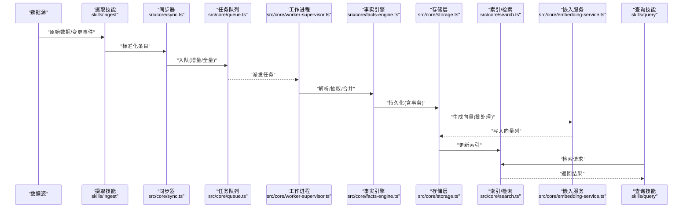

图表来源
- [skills/ingest/index.ts](file://skills/ingest/index.ts)
- [src/core/sync.ts](file://src/core/sync.ts)
- [src/core/queue.ts](file://src/core/queue.ts)
- [src/core/worker-supervisor.ts](file://src/core/worker-supervisor.ts)
- [src/core/facts-engine.ts](file://src/core/facts-engine.ts)
- [src/core/storage.ts](file://src/core/storage.ts)
- [src/core/search.ts](file://src/core/search.ts)
- [src/core/embedding-service.ts](file://src/core/embedding-service.ts)
- [skills/query/index.ts](file://skills/query/index.ts)

## 详细组件分析

### 摄取与适配（多源接入）
- 目标：对接多种数据源（文件、Webhook、消息总线、API），完成格式归一化、鉴权、限流与错误分类。
- 关键点：
  - 适配器抽象：每个数据源实现统一的读取接口，输出标准化条目。
  - 增量策略：基于时间戳、版本号或哈希指纹识别变更。
  - 容错与重试：网络抖动、临时不可用时的指数退避与最大重试次数。
  - 审计与溯源：记录来源、时间、版本与操作者，便于追踪与合规。

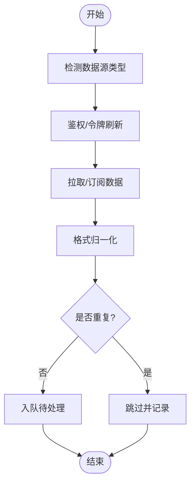

图表来源
- [skills/ingest/index.ts](file://skills/ingest/index.ts)
- [src/core/sync.ts](file://src/core/sync.ts)

章节来源
- [skills/ingest/index.ts](file://skills/ingest/index.ts)
- [src/core/sync.ts](file://src/core/sync.ts)

### 同步与增量扫描
- 目标：对本地脑目录与远程源进行差异比对，生成最小变更集，避免全量重建。
- 关键点：
  - 变更发现：基于文件时间戳、内容哈希与元数据对比。
  - 幂等写入：相同输入产生相同输出，支持断点续跑。
  - 锁与并发：按源粒度加锁，防止并发冲突。
  - 回滚与补偿：失败时回写检查点，确保一致性。

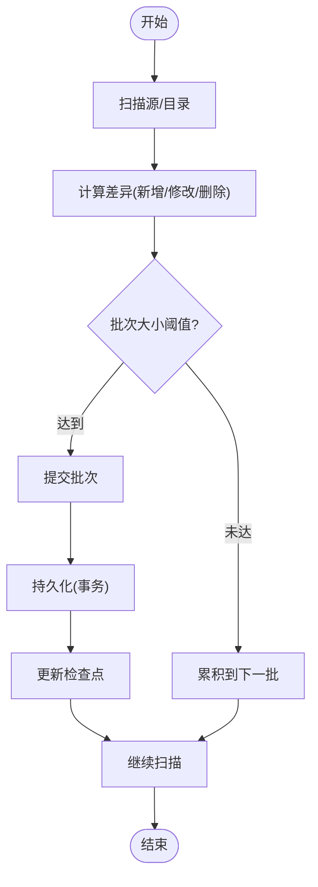

图表来源
- [src/core/sync.ts](file://src/core/sync.ts)

章节来源
- [src/core/sync.ts](file://src/core/sync.ts)

### 任务调度、队列与并发控制
- 目标：统一管理高内聚、低耦合的任务，平衡吞吐与资源占用。
- 关键点：
  - 优先级与权重：按业务重要性分配执行顺序。
  - 速率限制：按源或全局限速，保护下游服务。
  - 重试与死信：失败重试、退避策略与死信队列归档。
  - 并发上限：按 CPU/内存/IO 动态调整并行度。

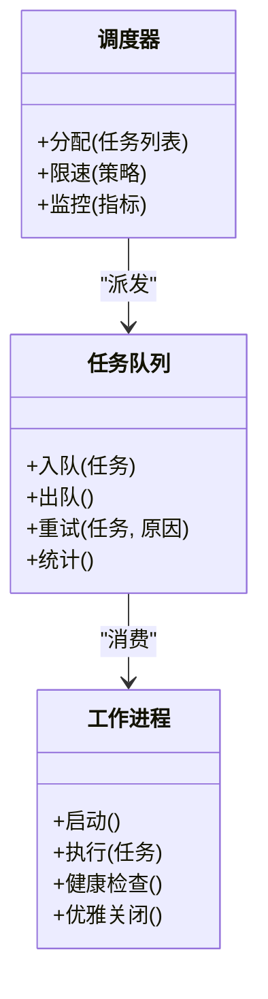

图表来源
- [src/core/queue.ts](file://src/core/queue.ts)
- [src/core/worker-supervisor.ts](file://src/core/worker-supervisor.ts)

章节来源
- [src/core/queue.ts](file://src/core/queue.ts)
- [src/core/worker-supervisor.ts](file://src/core/worker-supervisor.ts)

### 事实抽取、清洗与增强
- 目标：将原始内容转化为高质量的结构化事实，并进行去重、冲突解决与上下文增强。
- 关键点：
  - 解析器：针对文本、表格、代码、多媒体等不同形态的解析策略。
  - 抽取规则：基于模板、启发式或模型辅助的实体/关系抽取。
  - 冲突检测：同义、矛盾与覆盖关系的判定与合并策略。
  - 增强：补充标签、摘要、关联图谱与引用链。

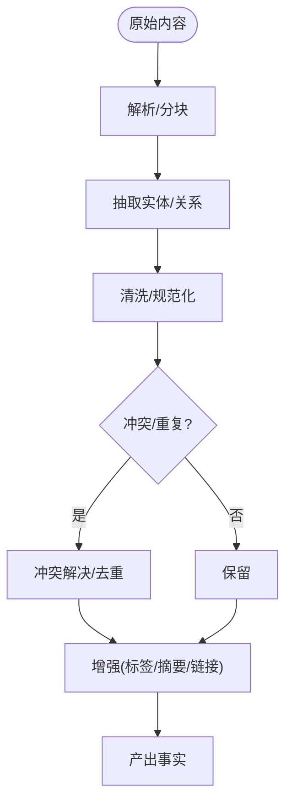

图表来源
- [src/core/facts-engine.ts](file://src/core/facts-engine.ts)

章节来源
- [src/core/facts-engine.ts](file://src/core/facts-engine.ts)

### 存储分层与事务一致性
- 目标：提供高性能、低成本、可扩展的存储后端，保证强一致或最终一致语义。
- 关键点：
  - 分层存储：热数据（内存/SSD）、温数据（对象存储）、冷数据（归档）。
  - 事务与回滚：原子写入、检查点与补偿日志，确保失败可恢复。
  - 版本化：事实与索引的版本号，支持回溯与比较。
  - 压缩与编码：减少体积，提升 I/O 效率。

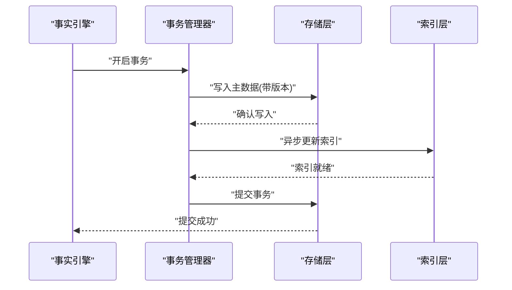

图表来源
- [src/core/storage.ts](file://src/core/storage.ts)
- [src/core/facts-engine.ts](file://src/core/facts-engine.ts)

章节来源
- [src/core/storage.ts](file://src/core/storage.ts)
- [src/core/facts-engine.ts](file://src/core/facts-engine.ts)

### 嵌入与索引
- 目标：将文本/多模态内容向量化，构建高效检索索引。
- 关键点：
  - 批处理：按维度与批大小聚合，降低模型调用开销。
  - 重试与降级：失败重试、模型切换与缓存命中。
  - 索引更新：增量更新与定期重建相结合。
  - 混合检索：关键词与向量融合排序。

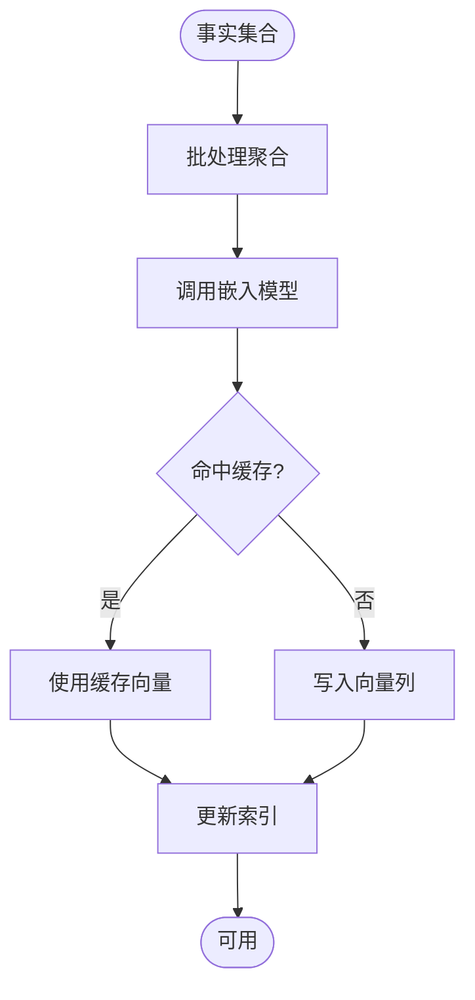

图表来源
- [src/core/embedding-service.ts](file://src/core/embedding-service.ts)
- [src/core/search.ts](file://src/core/search.ts)

章节来源
- [src/core/embedding-service.ts](file://src/core/embedding-service.ts)
- [src/core/search.ts](file://src/core/search.ts)

### 检索与查询
- 目标：提供低延迟、高相关性的检索能力，支持过滤、分页与重排。
- 关键点：
  - 混合排序：BM25 与向量相似度加权融合。
  - 范围过滤：按时间、来源、标签等条件筛选。
  - 结果裁剪：按需返回摘要、片段与引用。
  - 缓存：热点查询缓存与失效策略。

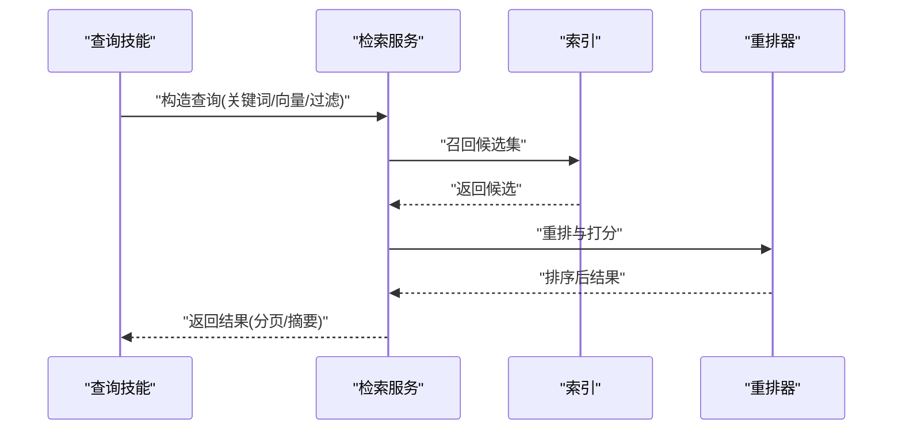

图表来源
- [src/core/search.ts](file://src/core/search.ts)
- [skills/query/index.ts](file://skills/query/index.ts)

章节来源
- [src/core/search.ts](file://src/core/search.ts)
- [skills/query/index.ts](file://skills/query/index.ts)

### 批处理与实时处理混合架构
- 批处理：定时全量/增量同步、大规模嵌入与索引重建，强调吞吐与成本优化。
- 实时处理：事件驱动的增量摄取与近实时更新，强调低延迟与高可用。
- 统一编排：通过调度器与队列将两类任务纳入同一流水线，共享存储与索引。

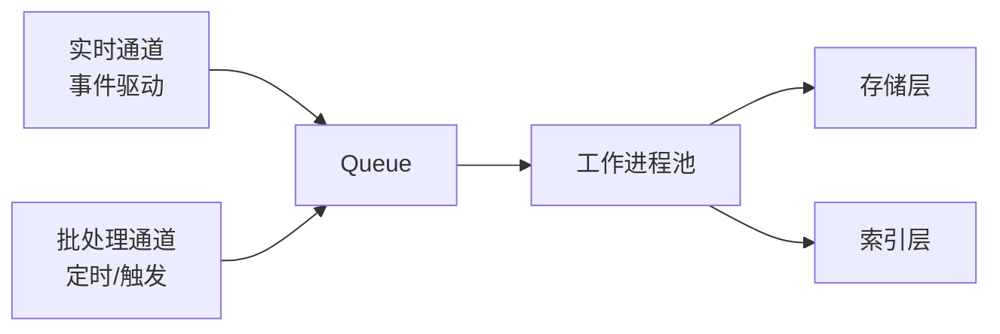

图表来源
- [src/core/queue.ts](file://src/core/queue.ts)
- [src/core/worker-supervisor.ts](file://src/core/worker-supervisor.ts)
- [src/core/storage.ts](file://src/core/storage.ts)
- [src/core/search.ts](file://src/core/search.ts)

章节来源
- [src/core/queue.ts](file://src/core/queue.ts)
- [src/core/worker-supervisor.ts](file://src/core/worker-supervisor.ts)
- [src/core/storage.ts](file://src/core/storage.ts)
- [src/core/search.ts](file://src/core/search.ts)

### 任务调度与定时任务
- 目标：管理周期性任务（如夜间重建、健康检查、清理过期数据）。
- 关键点：
  - 调度器：支持 cron 表达式与一次性任务。
  - 幂等执行：重复触发不产生副作用。
  - 告警与审计：失败告警与执行日志留存。

章节来源
- [skills/cron-scheduler/index.ts](file://skills/cron-scheduler/index.ts)

### 数据迁移与版本演进
- 目标：安全地推进数据库与索引结构变更，支持回滚与校验。
- 关键点：
  - 版本化迁移：按顺序执行，记录已应用版本。
  - 预检与回滚：失败自动回滚或提示人工干预。
  - 兼容性：新旧版本共存期的兼容逻辑。

章节来源
- [src/core/migrations/orchestrator.ts](file://src/core/migrations/orchestrator.ts)

### 命令行与集成入口
- 目标：提供便捷的操作入口，驱动同步、导入、重建等流程。
- 关键点：
  - 同步全部：触发全量/增量同步。
  - 导入文件：单文件或目录导入。
  - 重建索引：按需重建特定索引。

章节来源
- [src/commands/sync-all.ts](file://src/commands/sync-all.ts)
- [src/commands/import-file.ts](file://src/commands/import-file.ts)
- [src/commands/reindex.ts](file://src/commands/reindex.ts)

## 依赖关系分析
- 内部依赖：
  - 引擎协调器依赖同步、事实、队列、存储、搜索、嵌入与迁移编排。
  - 技能模块通过命令或 API 调用引擎能力，形成松耦合扩展点。
- 外部依赖：
  - 数据库/PGLite：持久化与事务。
  - 外部模型服务：嵌入与可选的增强推理。
  - 文件系统：脑目录与中间产物。

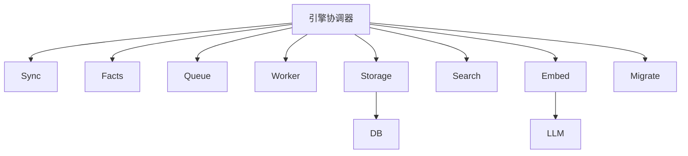

图表来源
- [src/core/engine.ts](file://src/core/engine.ts)
- [src/core/sync.ts](file://src/core/sync.ts)
- [src/core/facts-engine.ts](file://src/core/facts-engine.ts)
- [src/core/queue.ts](file://src/core/queue.ts)
- [src/core/worker-supervisor.ts](file://src/core/worker-supervisor.ts)
- [src/core/storage.ts](file://src/core/storage.ts)
- [src/core/search.ts](file://src/core/search.ts)
- [src/core/embedding-service.ts](file://src/core/embedding-service.ts)
- [src/core/migrations/orchestrator.ts](file://src/core/migrations/orchestrator.ts)
- [src/schema.sql](file://src/schema.sql)

章节来源
- [src/core/engine.ts](file://src/core/engine.ts)
- [src/schema.sql](file://src/schema.sql)

## 性能考量
- 批处理优化：
  - 增大嵌入批大小以降低模型调用开销。
  - 合并小写入，减少事务与索引更新频率。
- 并发控制：
  - 根据 CPU/内存/IO 动态调整并行度，避免过载。
  - 按源限速，保护下游服务与配额。
- 存储分层：
  - 热路径走内存/SSD，冷路径归档至对象存储。
  - 压缩与编码减少 I/O 压力。
- 检索优化：
  - 混合排序参数调优，平衡相关性与时延。
  - 热点查询缓存与失效策略。
- 监控与度量：
  - 采集吞吐、延迟、错误率与资源利用率。
  - 设置阈值告警与自动化扩容。

[本节为通用指导，无需具体文件引用]

## 故障排查指南
- 常见问题定位：
  - 摄取失败：检查鉴权、网络连通性与限流策略。
  - 抽取异常：查看解析器日志与抽取规则匹配情况。
  - 索引不一致：核对检查点与事务提交状态。
  - 嵌入失败：观察模型服务响应与重试计数。
- 诊断工具：
  - 进度事件：跟踪各阶段完成度与耗时。
  - 评估基准：运行基准用例验证质量与性能。
  - 快照与回放：利用 PGLite 快照进行问题复现。
- 恢复策略：
  - 回滚迁移：按版本回退并重新执行。
  - 重建索引：选择性重建受影响索引。
  - 备份恢复：从最近快照恢复数据与索引。

章节来源
- [docs/progress-events.md](file://docs/progress-events.md)
- [docs/eval/eval-bench.md](file://docs/eval/eval-bench.md)
- [scripts/build-pglite-snapshot.ts](file://scripts/build-pglite-snapshot.ts)
- [src/core/migrations/orchestrator.ts](file://src/core/migrations/orchestrator.ts)

## 结论
GBrain 的数据流架构以“摄取—抽取—增强—存储—检索”为主线，通过队列与工作进程实现批处理与实时处理的统一编排。借助存储分层、事务与检查点、迁移编排与监控评估，系统在吞吐、成本与可靠性之间取得良好平衡。建议在生产环境中持续优化批大小与并发度，完善告警与自愈机制，并定期演练备份与恢复流程，以确保数据流的稳定与可观测。

[本节为总结性内容，无需具体文件引用]

## 附录
- 安全与护栏：
  - 输入校验、敏感信息脱敏与访问控制。
- 存储分层策略：
  - 冷热数据划分、压缩与归档策略。
- 参考文档：
  - 架构概览、评估基准与安装升级指南。

章节来源
- [docs/guardrails.md](file://docs/guardrails.md)
- [docs/storage-tiering.md](file://docs/storage-tiering.md)
- [docs/architecture/overview.md](file://docs/architecture/overview.md)
- [docs/eval/eval-bench.md](file://docs/eval/eval-bench.md)
- [README.md](file://README.md)
- [DESIGN.md](file://DESIGN.md)