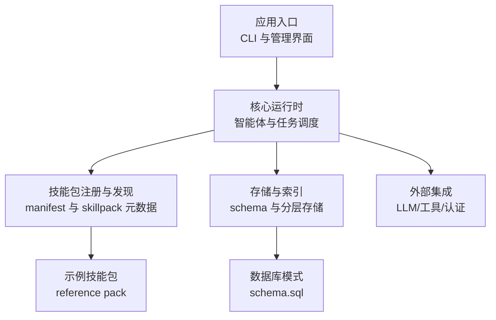
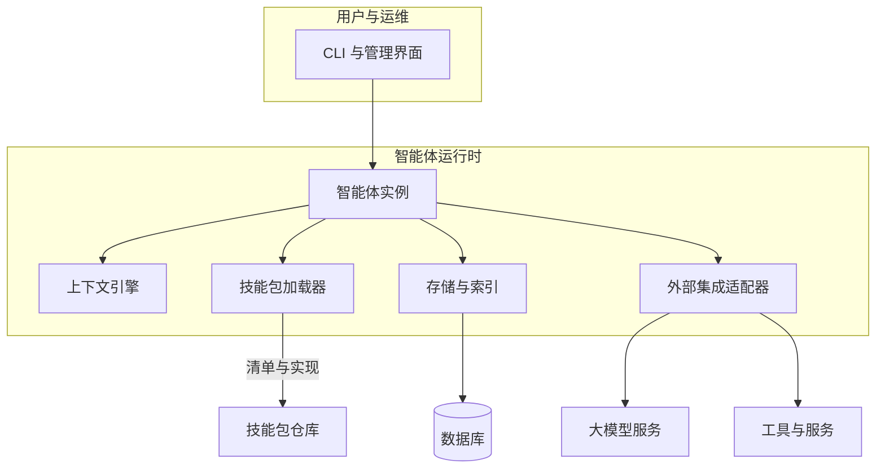
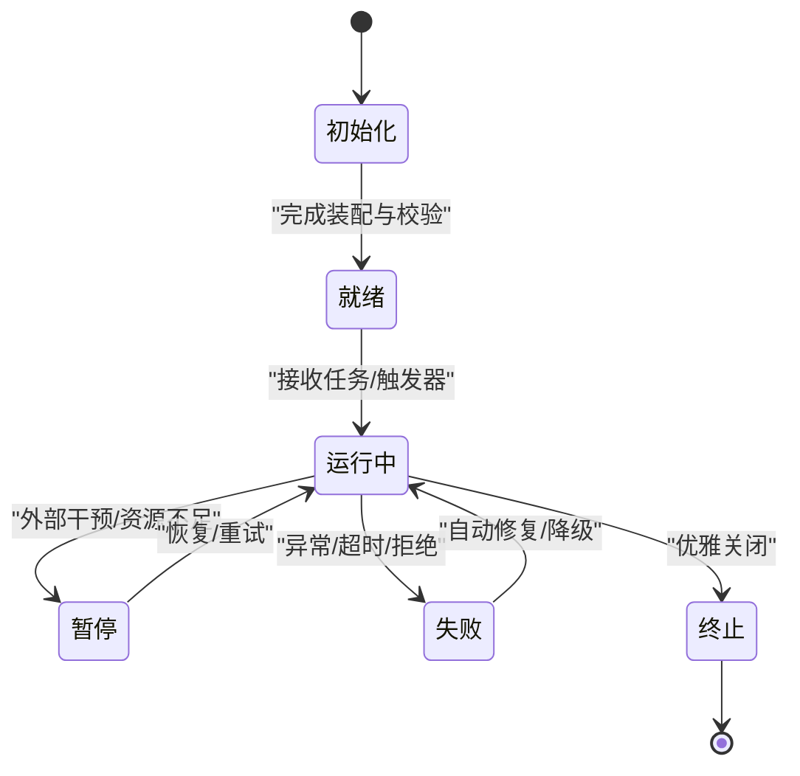
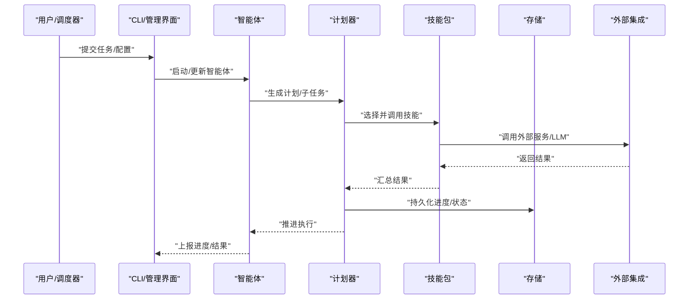
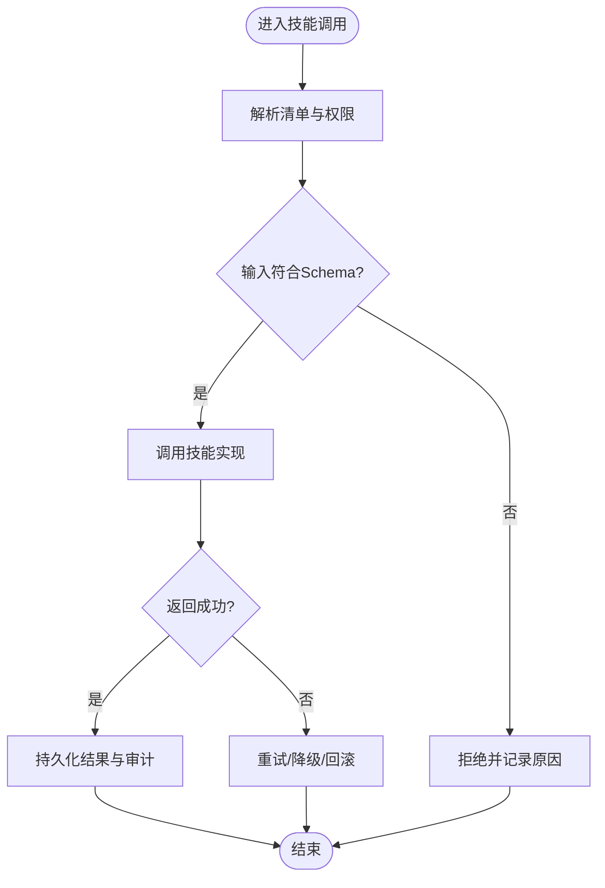
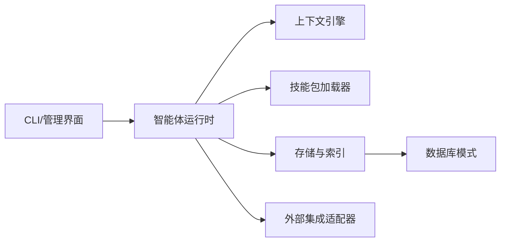

# 智能体系统

<cite>
**本文引用的文件**   
- [README.md](file://README.md)
- [DESIGN.md](file://DESIGN.md)
- [AGENTS.md](file://AGENTS.md)
- [CLAUDE.md](file://CLAUDE.md)
- [gbrain.yml](file://gbrain.yml)
- [package.json](file://package.json)
- [src/cli.ts](file://src/cli.ts)
- [src/admin-embedded.ts](file://src/admin-embedded.ts)
- [src/openclaw-context-engine.ts](file://src/openclaw-context-engine.ts)
- [src/version.ts](file://src/version.ts)
- [src/schema.sql](file://src/schema.sql)
- [skills/manifest.json](file://skills/manifest.json)
- [examples/skillpack-reference/skillpack.json](file://examples/skillpack-reference/skillpack.json)
- [docs/GBRAIN_SKILLPACK.md](file://docs/GBRAIN_SKILLPACK.md)
- [docs/GBRAIN_RECOMMENDED_SCHEMA.md](file://docs/GBRAIN_RECOMMENDED_SCHEMA.md)
- [docs/guardrails.md](file://docs/guardrails.md)
- [docs/progress-events.md](file://docs/progress-events.md)
- [docs/storage-tiering.md](file://docs/storage-tiering.md)
- [docs/architecture/agent-lifecycle.md](file://docs/architecture/agent-lifecycle.md)
- [docs/architecture/agent-execution-model.md](file://docs/architecture/agent-execution-model.md)
- [docs/architecture/agent-skillpack-interaction.md](file://docs/architecture/agent-skillpack-interaction.md)
- [docs/architecture/agent-concurrency-load-balancing.md](file://docs/architecture/agent-concurrency-load-balancing.md)
- [docs/architecture/agent-fault-recovery.md](file://docs/architecture/agent-fault-recovery.md)
- [docs/architecture/agent-monitoring-debugging.md](file://docs/architecture/agent-monitoring-debugging.md)
- [docs/architecture/agent-resource-management.md](file://docs/architecture/agent-resource-management.md)
- [docs/architecture/agent-state-transitions.md](file://docs/architecture/agent-state-transitions.md)
- [docs/architecture/agent-config-and-params.md](file://docs/architecture/agent-config-and-params.md)
- [docs/architecture/agent-security-permissions.md](file://docs/architecture/agent-security-permissions.md)
- [docs/architecture/agent-integration-points.md](file://docs/architecture/agent-integration-points.md)
</cite>

## 目录
1. [简介](#简介)
2. [项目结构](#项目结构)
3. [核心组件](#核心组件)
4. [架构总览](#架构总览)
5. [详细组件分析](#详细组件分析)
6. [依赖关系分析](#依赖关系分析)
7. [性能考量](#性能考量)
8. [故障排查指南](#故障排查指南)
9. [结论](#结论)
10. [附录](#附录)

## 简介
本文件面向 GBrain 智能体系统的读者，系统化阐述智能体的定义、生命周期管理、状态转换与执行模型；说明配置方式、参数传递、错误处理与资源管理；解释智能体与技能包的交互协议、数据格式与权限控制；并提供创建、配置与管理智能体的实践路径。同时覆盖并发执行、负载均衡、故障恢复机制，以及监控、调试与性能优化的最佳实践。

## 项目结构
仓库采用“核心源码 + 文档 + 示例 + 测试”的分层组织方式：
- 核心源码位于 src/，包含 CLI 入口、嵌入式管理界面、上下文引擎、版本信息与数据库模式等。
- 文档集中于 docs/，涵盖架构设计、使用指南、集成方案与运维规范。
- 技能包与参考实现位于 skills/ 与 examples/skillpack-reference/。
- 测试用例位于 test/，覆盖功能、集成与回归场景。

图表来源
- [src/cli.ts:1-200](file://src/cli.ts#L1-200)
- [src/admin-embedded.ts:1-200](file://src/admin-embedded.ts#L1-200)
- [src/openclaw-context-engine.ts:1-200](file://src/openclaw-context-engine.ts#L1-200)
- [src/schema.sql:1-200](file://src/schema.sql#L1-200)
- [skills/manifest.json:1-200](file://skills/manifest.json#L1-200)
- [examples/skillpack-reference/skillpack.json:1-200](file://examples/skillpack-reference/skillpack.json#L1-200)

章节来源
- [README.md:1-200](file://README.md#L1-L200)
- [DESIGN.md:1-200](file://DESIGN.md#L1-L200)
- [AGENTS.md:1-200](file://AGENTS.md#L1-L200)
- [CLAUDE.md:1-200](file://CLAUDE.md#L1-L200)
- [gbrain.yml:1-200](file://gbrain.yml#L1-L200)
- [package.json:1-200](file://package.json#L1-L200)
- [src/cli.ts:1-200](file://src/cli.ts#L1-L200)
- [src/admin-embedded.ts:1-200](file://src/admin-embedded.ts#L1-L200)
- [src/openclaw-context-engine.ts:1-200](file://src/openclaw-context-engine.ts#L1-L200)
- [src/version.ts:1-200](file://src/version.ts#L1-L200)
- [src/schema.sql:1-200](file://src/schema.sql#L1-L200)
- [skills/manifest.json:1-200](file://skills/manifest.json#L1-L200)
- [examples/skillpack-reference/skillpack.json:1-200](file://examples/skillpack-reference/skillpack.json#L1-L200)

## 核心组件
- 智能体（Agent）：具备目标、策略与能力的自治单元，通过技能包扩展能力边界。
- 技能包（Skillpack）：封装可复用的能力集合，提供声明式清单与实现。
- 上下文引擎：为智能体提供运行期上下文注入、检索与记忆。
- 存储与索引：持久化智能体状态、事件与知识，支持分层存储与检索优化。
- 管理与 CLI：提供安装、部署、监控与调试能力。

章节来源
- [AGENTS.md:1-200](file://AGENTS.md#L1-L200)
- [docs/GBRAIN_SKILLPACK.md:1-200](file://docs/GBRAIN_SKILLPACK.md#L1-L200)
- [src/openclaw-context-engine.ts:1-200](file://src/openclaw-context-engine.ts#L1-L200)
- [docs/storage-tiering.md:1-200](file://docs/storage-tiering.md#L1-L200)
- [src/cli.ts:1-200](file://src/cli.ts#L1-L200)

## 架构总览
下图展示智能体在系统中的位置与关键交互面：CLI/管理界面驱动智能体生命周期；上下文引擎支撑决策与记忆；技能包提供能力；存储与索引保障状态与知识；外部集成提供 LLM 与工具调用。

图表来源
- [src/cli.ts:1-200](file://src/cli.ts#L1-L200)
- [src/admin-embedded.ts:1-200](file://src/admin-embedded.ts#L1-L200)
- [src/openclaw-context-engine.ts:1-200](file://src/openclaw-context-engine.ts#L1-L200)
- [skills/manifest.json:1-200](file://skills/manifest.json#L1-L200)
- [src/schema.sql:1-200](file://src/schema.sql#L1-L200)

## 详细组件分析

### 智能体定义与能力模型
- 定义要素：身份标识、目标与约束、策略与计划、能力清单（来自技能包）、上下文窗口与记忆。
- 能力模型：以技能包为粒度进行能力装配，支持动态发现与热更新。
- 安全边界：基于权限与信任域对能力访问进行限制。

章节来源
- [AGENTS.md:1-200](file://AGENTS.md#L1-L200)
- [docs/GBRAIN_SKILLPACK.md:1-200](file://docs/GBRAIN_SKILLPACK.md#L1-L200)
- [docs/architecture/agent-security-permissions.md:1-200](file://docs/architecture/agent-security-permissions.md#L1-L200)

### 生命周期管理与状态转换
- 阶段划分：初始化、就绪、运行中、暂停、失败、终止。
- 触发条件：由 CLI/管理界面或内部调度器驱动状态迁移。
- 一致性保证：状态变更伴随审计日志与持久化。

图表来源
- [docs/architecture/agent-lifecycle.md:1-200](file://docs/architecture/agent-lifecycle.md#L1-L200)
- [docs/architecture/agent-state-transitions.md:1-200](file://docs/architecture/agent-state-transitions.md#L1-L200)

章节来源
- [docs/architecture/agent-lifecycle.md:1-200](file://docs/architecture/agent-lifecycle.md#L1-L200)
- [docs/architecture/agent-state-transitions.md:1-200](file://docs/architecture/agent-state-transitions.md#L1-L200)

### 执行模型与并发控制
- 执行模型：事件驱动的任务编排，结合计划与反思循环。
- 并发策略：按任务类型与资源配额进行并行度控制，避免过载。
- 负载均衡：在多实例间按负载指标分发任务，提升吞吐与稳定性。

图表来源
- [src/cli.ts:1-200](file://src/cli.ts#L1-L200)
- [src/admin-embedded.ts:1-200](file://src/admin-embedded.ts#L1-L200)
- [src/openclaw-context-engine.ts:1-200](file://src/openclaw-context-engine.ts#L1-L200)
- [skills/manifest.json:1-200](file://skills/manifest.json#L1-L200)
- [src/schema.sql:1-200](file://src/schema.sql#L1-L200)

章节来源
- [docs/architecture/agent-execution-model.md:1-200](file://docs/architecture/agent-execution-model.md#L1-L200)
- [docs/architecture/agent-concurrency-load-balancing.md:1-200](file://docs/architecture/agent-concurrency-load-balancing.md#L1-L200)

### 配置方式与参数传递
- 配置文件：集中式 YAML/JSON 配置，定义全局与智能体级参数。
- 参数传递：通过上下文注入与任务载荷传递，确保幂等与安全。
- 环境变量：敏感信息与环境差异通过环境变量注入。

章节来源
- [gbrain.yml:1-200](file://gbrain.yml#L1-L200)
- [docs/architecture/agent-config-and-params.md:1-200](file://docs/architecture/agent-config-and-params.md#L1-L200)

### 错误处理与资源管理
- 错误分类：网络/鉴权/超时/业务异常，分别采取重试、熔断、降级策略。
- 资源回收：显式释放连接、句柄与内存，防止泄漏。
- 限流与预算：对 LLM 与外部 API 调用进行速率与成本预算控制。

章节来源
- [docs/architecture/agent-fault-recovery.md:1-200](file://docs/architecture/agent-fault-recovery.md#L1-L200)
- [docs/architecture/agent-resource-management.md:1-200](file://docs/architecture/agent-resource-management.md#L1-L200)

### 与技能包的交互模式
- 调用协议：基于清单描述的能力接口，统一请求/响应格式。
- 数据格式：结构化 JSON Schema 校验，确保兼容性与可演进性。
- 权限控制：最小权限原则，按作用域与信任域授权。

图表来源
- [docs/GBRAIN_SKILLPACK.md:1-200](file://docs/GBRAIN_SKILLPACK.md#L1-L200)
- [examples/skillpack-reference/skillpack.json:1-200](file://examples/skillpack-reference/skillpack.json#L1-L200)
- [docs/architecture/agent-skillpack-interaction.md:1-200](file://docs/architecture/agent-skillpack-interaction.md#L1-L200)

章节来源
- [docs/GBRAIN_SKILLPACK.md:1-200](file://docs/GBRAIN_SKILLPACK.md#L1-L200)
- [examples/skillpack-reference/skillpack.json:1-200](file://examples/skillpack-reference/skillpack.json#L1-L200)
- [docs/architecture/agent-skillpack-interaction.md:1-200](file://docs/architecture/agent-skillpack-interaction.md#L1-L200)

### 监控、调试与性能优化
- 监控：进度事件、健康检查与指标采集。
- 调试：结构化日志、追踪 ID 与回放能力。
- 优化：缓存、批处理、异步流水线与分层存储。

章节来源
- [docs/progress-events.md:1-200](file://docs/progress-events.md#L1-L200)
- [docs/architecture/agent-monitoring-debugging.md:1-200](file://docs/architecture/agent-monitoring-debugging.md#L1-L200)
- [docs/storage-tiering.md:1-200](file://docs/storage-tiering.md#L1-L200)

### 具体实践：创建、配置与管理智能体
- 创建智能体：通过 CLI 或管理界面定义目标、策略与技能包。
- 配置参数：在配置文件中设置全局与智能体级参数，注入环境变量。
- 管理操作：启停、重启、升级、查看状态与日志。

章节来源
- [src/cli.ts:1-200](file://src/cli.ts#L1-L200)
- [src/admin-embedded.ts:1-200](file://src/admin-embedded.ts#L1-L200)
- [gbrain.yml:1-200](file://gbrain.yml#L1-L200)

## 依赖关系分析
- 直接依赖：CLI/管理界面依赖智能体运行时；智能体运行时依赖上下文引擎、技能包加载器与存储。
- 间接依赖：存储依赖数据库模式；外部集成依赖 LLM 与工具服务。
- 潜在耦合：技能包清单与实现需保持向后兼容；配置与参数传递需遵循约定。

图表来源
- [src/cli.ts:1-200](file://src/cli.ts#L1-L200)
- [src/admin-embedded.ts:1-200](file://src/admin-embedded.ts#L1-L200)
- [src/openclaw-context-engine.ts:1-200](file://src/openclaw-context-engine.ts#L1-L200)
- [src/schema.sql:1-200](file://src/schema.sql#L1-L200)

章节来源
- [src/cli.ts:1-200](file://src/cli.ts#L1-L200)
- [src/admin-embedded.ts:1-200](file://src/admin-embedded.ts#L1-L200)
- [src/openclaw-context-engine.ts:1-200](file://src/openclaw-context-engine.ts#L1-L200)
- [src/schema.sql:1-200](file://src/schema.sql#L1-L200)

## 性能考量
- 并发与吞吐：合理设置并行度与队列长度，避免资源争用。
- 延迟与吞吐平衡：批处理与异步流水线降低尾延迟。
- 存储分层：热点数据驻留高速存储，冷数据下沉低成本存储。
- 外部调用优化：缓存、去重与退避策略减少重复与抖动。

## 故障排查指南
- 常见问题：连接失败、鉴权错误、超时与配额超限。
- 定位方法：查看进度事件与审计日志，结合追踪 ID 定位链路。
- 恢复策略：自动重试、降级与隔离故障节点，必要时人工介入。

章节来源
- [docs/progress-events.md:1-200](file://docs/progress-events.md#L1-L200)
- [docs/architecture/agent-monitoring-debugging.md:1-200](file://docs/architecture/agent-monitoring-debugging.md#L1-L200)
- [docs/architecture/agent-fault-recovery.md:1-200](file://docs/architecture/agent-fault-recovery.md#L1-L200)

## 结论
GBrain 智能体系统以“智能体 + 技能包 + 上下文引擎 + 存储与索引”为核心，提供完整的生命周期管理、执行模型与运维能力。通过清晰的配置与权限控制、稳健的错误处理与资源管理、以及完善的监控与调试手段，可在复杂环境中稳定高效地运行。

## 附录
- 推荐的数据模式与字段约定，可参考推荐 schema 文档。
- 安全与护栏策略，包括内容过滤与行为约束。

章节来源
- [docs/GBRAIN_RECOMMENDED_SCHEMA.md:1-200](file://docs/GBRAIN_RECOMMENDED_SCHEMA.md#L1-L200)
- [docs/guardrails.md:1-200](file://docs/guardrails.md#L1-L200)