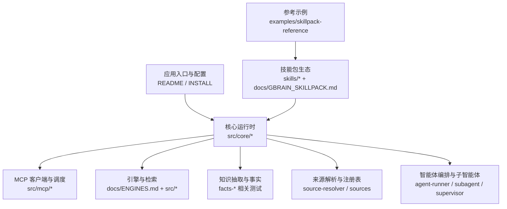
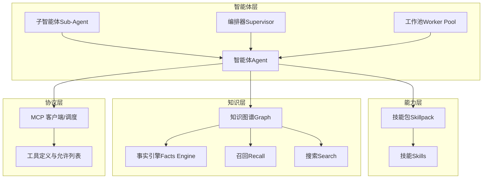
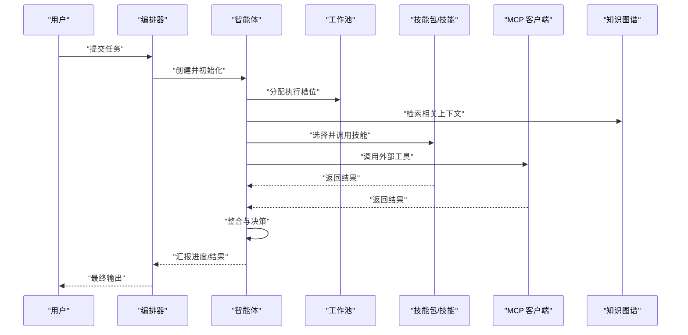
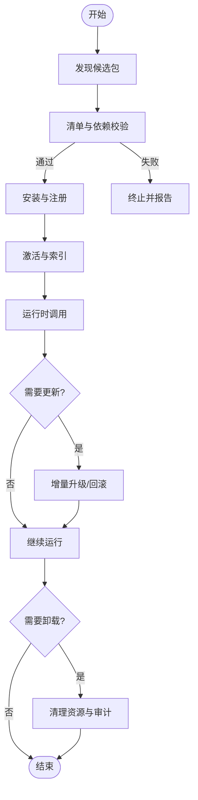
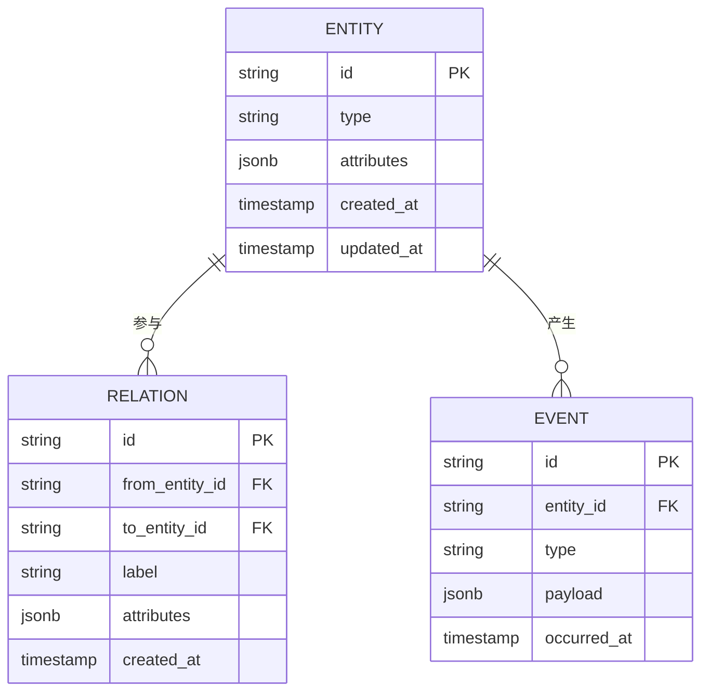
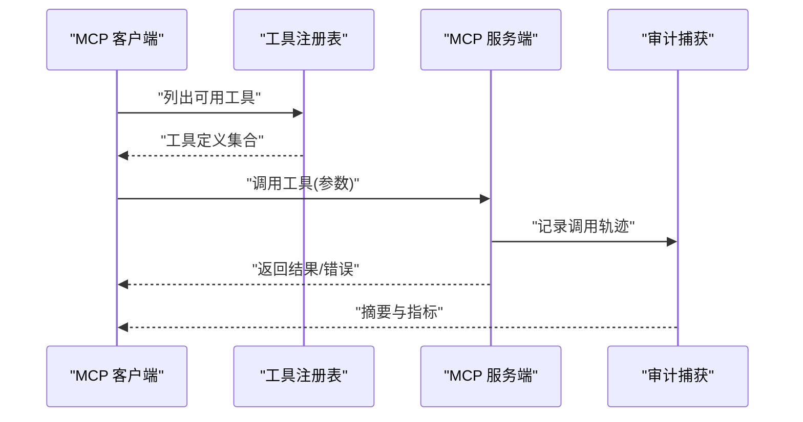
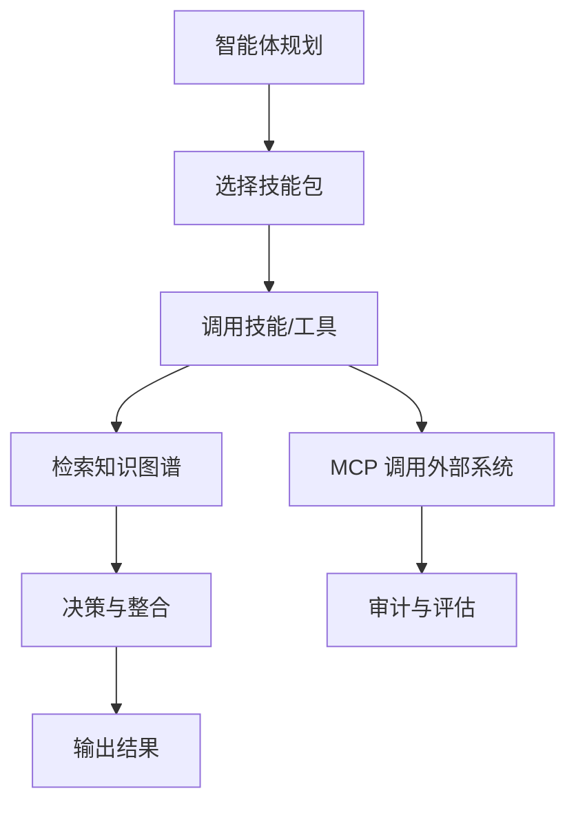
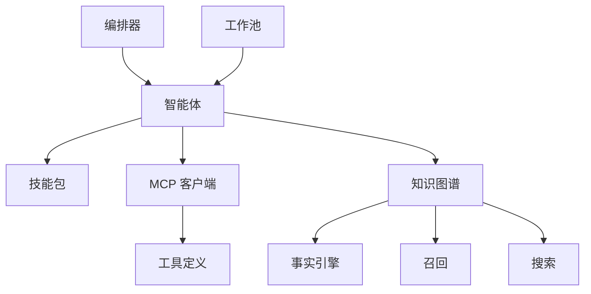

# 核心概念

<cite>
**本文引用的文件**   
- [README.md](file://README.md)
- [DESIGN.md](file://DESIGN.md)
- [AGENTS.md](file://AGENTS.md)
- [CLAUDE.md](file://CLAUDE.md)
- [INSTALL.md](file://docs/INSTALL.md)
- [GBRAIN_SKILLPACK.md](file://docs/GBRAIN_SKILLPACK.md)
- [skillpack-anatomy.md](file://docs/skillpack-anatomy.md)
- [ENGINES.md](file://docs/ENGINES.md)
- [mcp-overview.md](file://docs/mcp/mcp-overview.md)
- [mcp-client.ts](file://src/mcp/mcp-client.ts)
- [mcp-dispatch-summarize.test.ts](file://test/mcp-dispatch-summarize.test.ts)
- [mcp-client.test.ts](file://test/mcp-client.test.ts)
- [mcp-tool-defs.test.ts](file://test/mcp-tool-defs.test.ts)
- [mcp-eval-capture.test.ts](file://test/mcp-eval-capture.test.ts)
- [schema.sql](file://src/schema.sql)
- [brain-resolver.test.ts](file://test/brain-resolver.test.ts)
- [source-resolver.test.ts](file://test/source-resolver.test.ts)
- [sources.test.ts](file://test/sources.test.ts)
- [facts-engine.test.ts](file://test/facts-engine.test.ts)
- [recall.test.ts](file://test/recall.test.ts)
- [search.test.ts](file://test/search.test.ts)
- [engine-factory.test.ts](file://test/engine-factory.test.ts)
- [agent-runner.test.ts](file://test/agent-runner.test.ts)
- [subagent-handler.test.ts](file://test/subagent-handler.test.ts)
- [supervisor.test.ts](file://test/supervisor.test.ts)
- [worker-pool.test.ts](file://test/worker-pool.test.ts)
</cite>

## 目录
1. [简介](#简介)
2. [项目结构](#项目结构)
3. [核心组件](#核心组件)
4. [架构总览](#架构总览)
5. [详细组件分析](#详细组件分析)
6. [依赖关系分析](#依赖关系分析)
7. [性能考量](#性能考量)
8. [故障排查指南](#故障排查指南)
9. [结论](#结论)
10. [附录](#附录)

## 简介
本文件聚焦 GBrain 的核心概念体系，围绕智能体（Agent）、技能包（Skillpack）、知识图谱、MCP 协议等关键概念进行系统化阐述。内容覆盖定义、作用域、生命周期与管理方式，解释概念之间的交互模式与数据流转路径，并通过“代码片段路径”的方式指向仓库中的实现与测试用例，帮助初学者快速上手，同时为高级用户提供足够的技术深度与设计权衡说明。

## 项目结构
GBrain 采用分层与模块化组织：
- 顶层文档与规范：README、DESIGN、安装与使用指南、领域设计文档
- 核心源码：src 下包含命令、核心运行时、MCP 客户端、类型与数据库 schema
- 技能生态：skills 目录提供大量内置技能包；examples/skillpack-reference 提供参考实现
- 评估与测试：evals 与 test 目录覆盖功能、集成与回归测试
- 工具与脚本：scripts 用于构建、校验、发布与质量门禁

图表来源
- [README.md](file://README.md)
- [INSTALL.md](file://docs/INSTALL.md)
- [ENGINES.md](file://docs/ENGINES.md)
- [GBRAIN_SKILLPACK.md](file://docs/GBRAIN_SKILLPACK.md)

章节来源
- [README.md](file://README.md)
- [INSTALL.md](file://docs/INSTALL.md)
- [ENGINES.md](file://docs/ENGINES.md)
- [GBRAIN_SKILLPACK.md](file://docs/GBRAIN_SKILLPACK.md)

## 核心组件
本节对四大核心概念给出统一视角的定义、作用域、生命周期与管理方式，并概述其相互关系。

- 智能体（Agent）
  - 定义：以目标为导向的自主执行单元，负责规划、调用工具与技能、协调子智能体、管理上下文与记忆。
  - 作用域：通常绑定到特定任务或会话，可跨进程/工作线程运行，具备隔离的执行环境。
  - 生命周期：创建→初始化（加载配置、能力、权限）→执行（计划/推理/行动）→收尾（持久化状态、审计日志）。
  - 管理方式：由编排器（如 supervisor）与工作池（worker pool）统一管理，支持并发、限流、重试与资源回收。

- 技能包（Skillpack）
  - 定义：一组可组合的技能（Skills）及其元数据、清单、安全策略与依赖声明的打包单元。
  - 作用域：按包名与版本隔离，可在多脑（Brain）间复用，支持本地与远程注册中心。
  - 生命周期：发现→校验→安装→激活→更新→卸载。
  - 管理方式：通过清单与注册表进行版本控制与依赖解析，结合安全白名单与沙箱约束。

- 知识图谱（Knowledge Graph）
  - 定义：以实体、属性、关系与事件为核心的结构化知识表示，支撑检索、推理与一致性维护。
  - 作用域：面向领域建模，支持分片、层级与可见性控制。
  - 生命周期：采集→清洗→抽取→融合→索引→查询→演化。
  - 管理方式：通过 schema 与迁移机制演进，配合事实引擎与召回服务保证一致性与时效性。

- MCP 协议（Model Context Protocol）
  - 定义：模型与外部系统交互的标准通信协议，提供工具定义、调用与结果回传的统一接口。
  - 作用域：跨进程/跨语言边界，强调安全与可观测性。
  - 生命周期：注册→发现→调用→鉴权→执行→审计。
  - 管理方式：通过工具定义、允许列表与审计捕获保障可控扩展。

章节来源
- [AGENTS.md](file://AGENTS.md)
- [CLAUDE.md](file://CLAUDE.md)
- [GBRAIN_SKILLPACK.md](file://docs/GBRAIN_SKILLPACK.md)
- [mcp-overview.md](file://docs/mcp/mcp-overview.md)

## 架构总览
下图展示 GBrain 在概念层面的整体架构：智能体作为编排中枢，通过技能包获取能力，借助知识图谱进行检索与推理，并使用 MCP 协议与外部系统进行安全交互。

图表来源
- [agent-runner.test.ts](file://test/agent-runner.test.ts)
- [subagent-handler.test.ts](file://test/subagent-handler.test.ts)
- [supervisor.test.ts](file://test/supervisor.test.ts)
- [worker-pool.test.ts](file://test/worker-pool.test.ts)
- [GBRAIN_SKILLPACK.md](file://docs/GBRAIN_SKILLPACK.md)
- [facts-engine.test.ts](file://test/facts-engine.test.ts)
- [recall.test.ts](file://test/recall.test.ts)
- [search.test.ts](file://test/search.test.ts)
- [mcp-client.ts](file://src/mcp/mcp-client.ts)
- [mcp-tool-defs.test.ts](file://test/mcp-tool-defs.test.ts)

## 详细组件分析

### 智能体（Agent）
- 角色与职责
  - 任务规划与分解：将高层目标拆解为可执行的步骤序列。
  - 能力编排：选择并调用合适的技能包与工具。
  - 上下文管理：维护对话历史、短期记忆与长期记忆访问。
  - 错误恢复：处理超时、失败重试与降级策略。
- 作用域与隔离
  - 每个智能体拥有独立上下文与作用域，避免状态泄漏。
  - 子智能体用于并行与隔离执行复杂子任务。
- 生命周期
  - 启动：加载配置、初始化引擎与权限。
  - 运行：循环执行计划、调用工具、更新状态。
  - 结束：持久化结果、释放资源、生成审计记录。
- 管理与编排
  - 由编排器负责任务分发、资源配额与监控。
  - 工作池提供并发与背压控制。

图表来源
- [agent-runner.test.ts](file://test/agent-runner.test.ts)
- [subagent-handler.test.ts](file://test/subagent-handler.test.ts)
- [supervisor.test.ts](file://test/supervisor.test.ts)
- [worker-pool.test.ts](file://test/worker-pool.test.ts)
- [mcp-client.ts](file://src/mcp/mcp-client.ts)
- [facts-engine.test.ts](file://test/facts-engine.test.ts)

章节来源
- [agent-runner.test.ts](file://test/agent-runner.test.ts)
- [subagent-handler.test.ts](file://test/subagent-handler.test.ts)
- [supervisor.test.ts](file://test/supervisor.test.ts)
- [worker-pool.test.ts](file://test/worker-pool.test.ts)

### 技能包（Skillpack）
- 定义与组成
  - 清单（manifest）：描述包名、版本、依赖、权限与安全策略。
  - 技能（Skills）：具体可执行的能力单元，含输入输出契约与错误语义。
  - 元数据与规则：包括用途说明、适用场景、前置条件与后置条件。
- 作用域与版本
  - 按包名与版本隔离，支持多脑共享与灰度升级。
  - 依赖解析确保兼容性与最小权限原则。
- 生命周期
  - 发现：从本地或注册中心扫描可用包。
  - 校验：清单验证、依赖检查、安全策略评估。
  - 安装：拉取、解压、注册到运行期。
  - 激活：加载能力、建立索引、暴露接口。
  - 更新：增量升级、回滚与兼容性检查。
  - 卸载：清理资源、解除引用、审计归档。
- 管理方式
  - 注册中心与清单驱动，支持白名单与沙箱约束。
  - 通过测试套件与评估流程保障质量。

图表来源
- [GBRAIN_SKILLPACK.md](file://docs/GBRAIN_SKILLPACK.md)
- [skillpack-anatomy.md](file://docs/skillpack-anatomy.md)

章节来源
- [GBRAIN_SKILLPACK.md](file://docs/GBRAIN_SKILLPACK.md)
- [skillpack-anatomy.md](file://docs/skillpack-anatomy.md)

### 知识图谱（Knowledge Graph）
- 结构与建模
  - 实体、属性、关系与事件构成基本图节点与边。
  - Schema 驱动的类型系统与约束，确保数据质量与一致性。
- 数据流
  - 采集：从来源（Sources）读取原始数据。
  - 清洗与抽取：标准化、去重、实体识别与关系抽取。
  - 融合与索引：合并冲突、建立向量与全文索引。
  - 查询与召回：基于意图与上下文进行混合检索。
- 生命周期
  - 初始化：Schema 引导、迁移与种子数据导入。
  - 运行：增量同步、变更传播与失效缓存。
  - 维护：健康检查、修复与重建。
- 管理方式
  - 通过迁移与版本控制演进 schema。
  - 事实引擎与召回服务协同保证时效性与准确性。

图表来源
- [schema.sql](file://src/schema.sql)
- [facts-engine.test.ts](file://test/facts-engine.test.ts)
- [recall.test.ts](file://test/recall.test.ts)
- [search.test.ts](file://test/search.test.ts)

章节来源
- [schema.sql](file://src/schema.sql)
- [facts-engine.test.ts](file://test/facts-engine.test.ts)
- [recall.test.ts](file://test/recall.test.ts)
- [search.test.ts](file://test/search.test.ts)

### MCP 协议（Model Context Protocol）
- 角色与职责
  - 定义工具接口：参数、返回值、错误码与副作用说明。
  - 提供调用通道：跨进程/跨语言的标准化通信。
  - 安全与审计：允许列表、鉴权与操作日志。
- 生命周期
  - 注册：工具定义与服务端注册。
  - 发现：客户端动态发现可用工具。
  - 调用：请求-响应式调用，支持异步与流式。
  - 审计：捕获调用轨迹与结果摘要。
- 管理方式
  - 通过工具定义与测试用例保障契约稳定。
  - 评估捕获用于质量回溯与回归检测。

图表来源
- [mcp-client.ts](file://src/mcp/mcp-client.ts)
- [mcp-tool-defs.test.ts](file://test/mcp-tool-defs.test.ts)
- [mcp-dispatch-summarize.test.ts](file://test/mcp-dispatch-summarize.test.ts)
- [mcp-eval-capture.test.ts](file://test/mcp-eval-capture.test.ts)

章节来源
- [mcp-client.ts](file://src/mcp/mcp-client.ts)
- [mcp-tool-defs.test.ts](file://test/mcp-tool-defs.test.ts)
- [mcp-dispatch-summarize.test.ts](file://test/mcp-dispatch-summarize.test.ts)
- [mcp-eval-capture.test.ts](file://test/mcp-eval-capture.test.ts)

### 概念之间的关系与交互模式
- 智能体如何调用技能包
  - 智能体根据任务意图选择合适技能包，解析清单与权限后执行。
  - 通过工作池并发调用，结合超时与重试策略提升鲁棒性。
- 知识如何在系统中流转
  - 来源数据经抽取与融合进入知识图谱，随后被召回与搜索服务索引。
  - 智能体在规划阶段检索相关知识，形成上下文注入，提高决策质量。
- MCP 在交互中的作用
  - 作为智能体与外部系统的桥梁，提供统一工具接口与审计能力。
  - 通过允许列表与评估捕获保障安全与可观测性。

图表来源
- [agent-runner.test.ts](file://test/agent-runner.test.ts)
- [GBRAIN_SKILLPACK.md](file://docs/GBRAIN_SKILLPACK.md)
- [facts-engine.test.ts](file://test/facts-engine.test.ts)
- [mcp-client.ts](file://src/mcp/mcp-client.ts)

## 依赖关系分析
- 组件耦合与内聚
  - 智能体与编排器高内聚，通过明确接口降低耦合。
  - 技能包与运行时通过清单与契约解耦，便于替换与升级。
  - 知识图谱与检索服务通过 schema 与索引契约协作。
  - MCP 客户端与工具定义保持松耦合，支持热插拔。
- 直接与间接依赖
  - 智能体依赖技能包、知识图谱与 MCP 客户端。
  - 编排器与工作池为智能体提供基础设施。
  - 知识图谱依赖事实引擎、召回与搜索服务。
- 潜在循环依赖
  - 通过分层与接口抽象避免循环，必要时引入事件总线或消息队列。
- 外部依赖与集成点
  - 注册中心、存储后端与外部系统通过 MCP 与适配器接入。
- 接口契约与实现细节
  - 清单与工具定义作为契约，测试用例保障稳定性。

图表来源
- [agent-runner.test.ts](file://test/agent-runner.test.ts)
- [supervisor.test.ts](file://test/supervisor.test.ts)
- [worker-pool.test.ts](file://test/worker-pool.test.ts)
- [GBRAIN_SKILLPACK.md](file://docs/GBRAIN_SKILLPACK.md)
- [mcp-client.ts](file://src/mcp/mcp-client.ts)
- [facts-engine.test.ts](file://test/facts-engine.test.ts)
- [recall.test.ts](file://test/recall.test.ts)
- [search.test.ts](file://test/search.test.ts)

章节来源
- [agent-runner.test.ts](file://test/agent-runner.test.ts)
- [supervisor.test.ts](file://test/supervisor.test.ts)
- [worker-pool.test.ts](file://test/worker-pool.test.ts)
- [GBRAIN_SKILLPACK.md](file://docs/GBRAIN_SKILLPACK.md)
- [mcp-client.ts](file://src/mcp/mcp-client.ts)
- [facts-engine.test.ts](file://test/facts-engine.test.ts)
- [recall.test.ts](file://test/recall.test.ts)
- [search.test.ts](file://test/search.test.ts)

## 性能考量
- 并发与背压
  - 工作池限制并发度，避免资源耗尽；编排器进行任务排队与优先级调度。
- 缓存与索引
  - 知识图谱的向量与全文索引加速召回与搜索；合理设置失效策略。
- 批处理与批量写入
  - 事实抽取与写入采用批处理减少 IO 开销。
- 超时与重试
  - 对外部调用设置超时与指数退避，避免雪崩效应。
- 资源隔离与配额
  - 智能体与子智能体隔离执行环境，防止相互干扰。

[本节为通用指导，不直接分析具体文件]

## 故障排查指南
- 常见问题定位
  - 智能体卡死：检查工作池占用、锁竞争与超时配置。
  - 技能包异常：核对清单版本、依赖与权限白名单。
  - 知识不一致：查看事实引擎日志、召回命中率与索引健康。
  - MCP 调用失败：检查工具定义、允许列表与审计捕获。
- 调试与观测
  - 启用审计捕获与评估回放，定位调用链路与错误根因。
  - 使用健康检查与诊断命令观察系统状态。

章节来源
- [mcp-eval-capture.test.ts](file://test/mcp-eval-capture.test.ts)
- [mcp-dispatch-summarize.test.ts](file://test/mcp-dispatch-summarize.test.ts)
- [facts-engine.test.ts](file://test/facts-engine.test.ts)
- [recall.test.ts](file://test/recall.test.ts)
- [search.test.ts](file://test/search.test.ts)

## 结论
GBrain 的核心概念体系以智能体为编排中枢，通过技能包扩展能力，依托知识图谱增强理解与推理，并以 MCP 协议实现安全可控的外部交互。各组件通过清晰的契约与分层设计实现高内聚低耦合，具备良好的可扩展性与可观测性。遵循本文档的概念与管理方式，可有效提升系统的稳定性与可维护性。

[本节为总结性内容，不直接分析具体文件]

## 附录
- 设计与规范参考
  - 总体设计：DESIGN.md
  - 智能体实践：AGENTS.md、CLAUDE.md
  - 安装与入门：INSTALL.md
  - 引擎与检索：ENGINES.md
  - 技能包规范：GBRAIN_SKILLPACK.md、skillpack-anatomy.md
  - MCP 概览：docs/mcp/mcp-overview.md

章节来源
- [DESIGN.md](file://DESIGN.md)
- [AGENTS.md](file://AGENTS.md)
- [CLAUDE.md](file://CLAUDE.md)
- [INSTALL.md](file://docs/INSTALL.md)
- [ENGINES.md](file://docs/ENGINES.md)
- [GBRAIN_SKILLPACK.md](file://docs/GBRAIN_SKILLPACK.md)
- [skillpack-anatomy.md](file://docs/skillpack-anatomy.md)
- [mcp-overview.md](file://docs/mcp/mcp-overview.md)