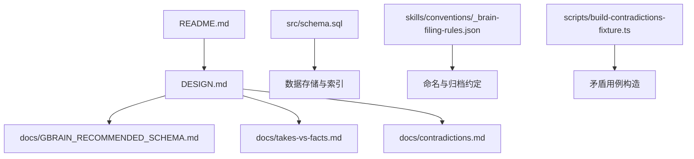
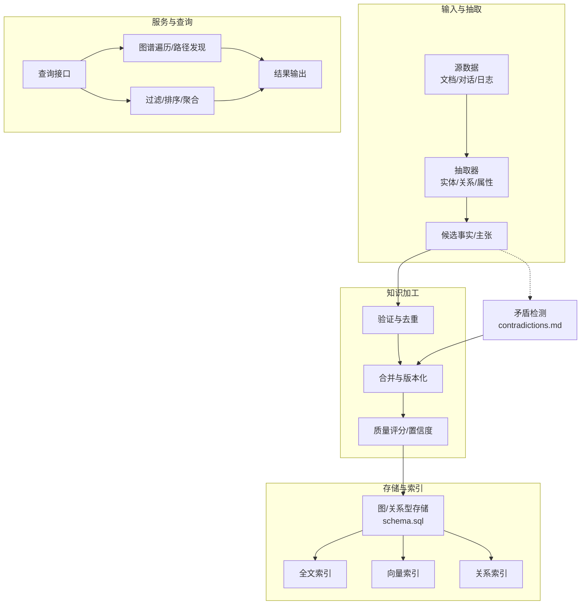
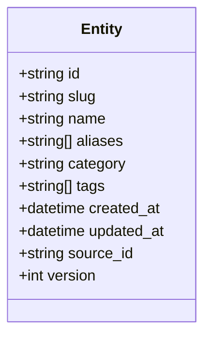
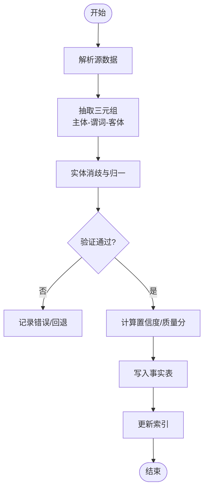
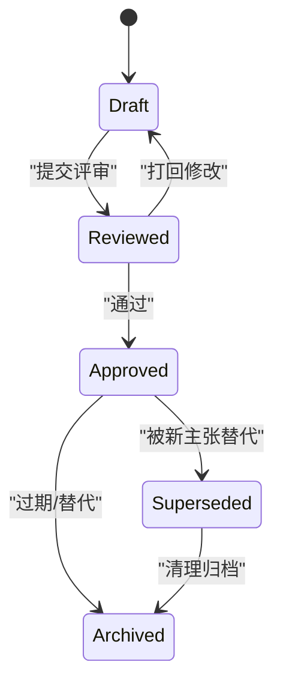
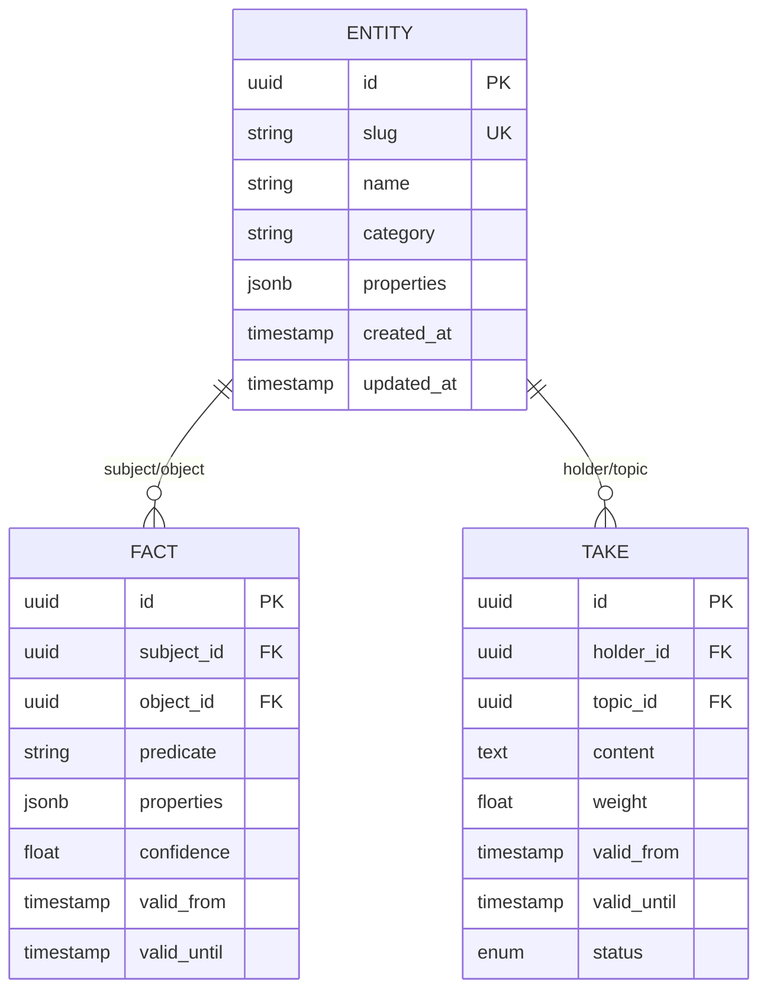
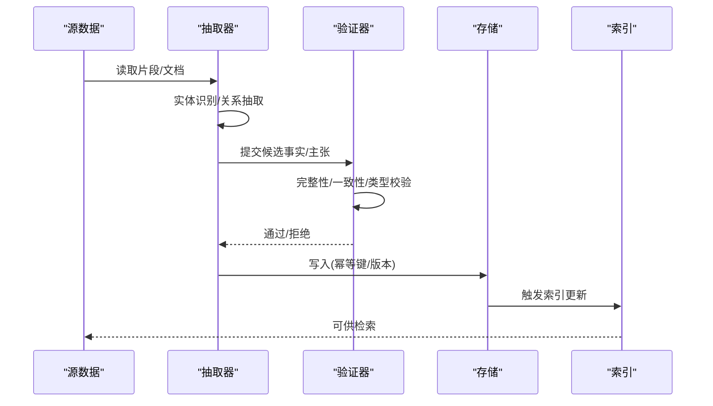
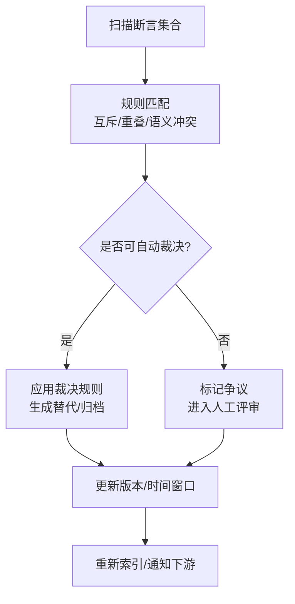
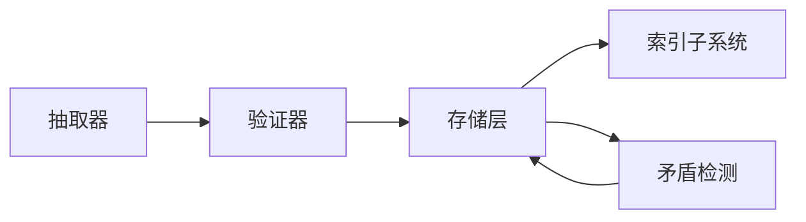

# 知识模型

<cite>
**本文引用的文件**   
- [README.md](file://README.md)
- [DESIGN.md](file://DESIGN.md)
- [docs/GBRAIN_RECOMMENDED_SCHEMA.md](file://docs/GBRAIN_RECOMMENDED_SCHEMA.md)
- [docs/takes-vs-facts.md](file://docs/takes-vs-facts.md)
- [docs/contradictions.md](file://docs/contradictions.md)
- [src/schema.sql](file://src/schema.sql)
- [skills/conventions/_brain-filing-rules.json](file://skills/conventions/_brain-filing-rules.json)
- [scripts/build-contradictions-fixture.ts](file://scripts/build-contradictions-fixture.ts)
</cite>

## 目录
1. [引言](#引言)
2. [项目结构](#项目结构)
3. [核心组件](#核心组件)
4. [架构总览](#架构总览)
5. [详细组件分析](#详细组件分析)
6. [依赖分析](#依赖分析)
7. [性能考虑](#性能考虑)
8. [故障排查指南](#故障排查指南)
9. [结论](#结论)
10. [附录](#附录)

## 引言
本文件系统性阐述 GBrain 的知识模型设计理念与数据结构，围绕实体（Entity）、事实（Fact）、主张（Take）等核心概念展开，解释知识图谱的构建过程、抽取算法、验证规则与一致性保证机制，并说明存储格式、索引策略与查询接口。同时提供建模最佳实践（类型设计、命名规范、版本管理）、可视化与分析方法，以及质量评估、冲突检测与修复策略。

## 项目结构
GBrain 仓库采用“文档驱动 + 代码实现”的组织方式：
- 顶层 README 与 DESIGN 提供总体设计与目标
- docs 下集中沉淀知识模型、模式约定、矛盾处理、迁移与评测等专题文档
- src 包含数据库 schema 与核心实现
- skills/conventions 提供脑内归档与命名约定
- scripts 包含用于生成测试数据与校验的工具脚本

图表来源
- [README.md](file://README.md)
- [DESIGN.md](file://DESIGN.md)
- [docs/GBRAIN_RECOMMENDED_SCHEMA.md](file://docs/GBRAIN_RECOMMENDED_SCHEMA.md)
- [docs/takes-vs-facts.md](file://docs/takes-vs-facts.md)
- [docs/contradictions.md](file://docs/contradictions.md)
- [src/schema.sql](file://src/schema.sql)
- [skills/conventions/_brain-filing-rules.json](file://skills/conventions/_brain-filing-rules.json)
- [scripts/build-contradictions-fixture.ts](file://scripts/build-contradictions-fixture.ts)

章节来源
- [README.md](file://README.md)
- [DESIGN.md](file://DESIGN.md)

## 核心组件
本节聚焦知识模型的三大基石：实体、事实与主张，并给出它们在知识图谱中的角色与关系。

- 实体（Entity）
  - 代表现实世界或系统中的可识别对象，如人、组织、产品、事件、概念等
  - 具备稳定标识（ID/Slug）与基础属性（名称、别名、描述、分类等）
  - 作为知识图谱的节点，承载边关系的起点与终点

- 事实（Fact）
  - 对实体之间或实体属性的断言性陈述，强调客观性与可验证性
  - 通常具有时间窗口、来源、置信度等元信息
  - 在图中表现为带属性的有向边或三元组（主体-谓词-客体）

- 主张（Take）
  - 表达观点、判断或建议，带有更强的主观性与时效性
  - 支持权重、有效期、持有者、证据链等元数据
  - 可与事实共存，但语义上更偏向“待验证”或“可争议”

三者关系要点：
- 实体是节点；事实与主张是边或节点上的标注化断言
- 事实倾向于“可证伪”，主张倾向于“可辩论”
- 同一主题可能同时存在多条事实与多条主张，需通过版本、时间与来源进行区分

章节来源
- [docs/GBRAIN_RECOMMENDED_SCHEMA.md](file://docs/GBRAIN_RECOMMENDED_SCHEMA.md)
- [docs/takes-vs-facts.md](file://docs/takes-vs-facts.md)

## 架构总览
下图展示知识模型在系统内的整体位置与交互：上游抽取器产出候选事实/主张，经校验与合并后写入持久层；下游检索与推理基于图结构与索引返回结果。

图表来源
- [src/schema.sql](file://src/schema.sql)
- [docs/contradictions.md](file://docs/contradictions.md)

## 详细组件分析

### 实体（Entity）建模
- 节点类型
  - 通用实体：Person、Organization、Product、Event、Concept 等
  - 领域实体：根据业务域扩展的类型族
- 关键属性
  - 标识：id/slug（唯一、稳定）
  - 名称与别名：name、aliases（便于模糊匹配与归一）
  - 分类与标签：category、tags（用于过滤与聚合）
  - 元数据：created_at、updated_at、source_id、version
- 关系约束
  - 实体间关系由事实/主张定义，实体本身不直接耦合具体关系
  - 支持软删除与历史版本

图表来源
- [docs/GBRAIN_RECOMMENDED_SCHEMA.md](file://docs/GBRAIN_RECOMMENDED_SCHEMA.md)

章节来源
- [docs/GBRAIN_RECOMMENDED_SCHEMA.md](file://docs/GBRAIN_RECOMMENDED_SCHEMA.md)

### 事实（Fact）建模
- 结构要点
  - 主体（subject_id）、客体（object_id）、关系/谓词（predicate）
  - 属性（properties）：时间范围、置信度、证据、来源
  - 版本与生命周期：valid_from、valid_until、status
- 抽取流程
  - 从文本/结构化数据中识别三元组
  - 标准化实体引用（slug 解析/消歧）
  - 应用验证规则（必填字段、类型约束、时间合理性）
- 存储与索引
  - 以边表或三元组表存储，建立 subject/predicate/object 索引
  - 全文索引覆盖 properties 与摘要
  - 向量索引用于语义相似度检索

图表来源
- [docs/GBRAIN_RECOMMENDED_SCHEMA.md](file://docs/GBRAIN_RECOMMENDED_SCHEMA.md)

章节来源
- [docs/GBRAIN_RECOMMENDED_SCHEMA.md](file://docs/GBRAIN_RECOMMENDED_SCHEMA.md)

### 主张（Take）建模
- 结构要点
  - 持有者（holder_id）、主题（topic_id）、内容（content）
  - 权重（weight）、有效期（valid_from/valid_until）、证据（evidence_ids）
  - 状态（draft/reviewed/approved/archived）
- 与事实的区别
  - 事实强调“是什么”，主张强调“应该怎样/认为如何”
  - 主张允许更多主观元数据（立场、依据、影响面）
- 生命周期
  - 创建 → 评审 → 生效 → 过期/归档
  - 支持撤销与替代（superseded_by）

图表来源
- [docs/takes-vs-facts.md](file://docs/takes-vs-facts.md)

章节来源
- [docs/takes-vs-facts.md](file://docs/takes-vs-facts.md)

### 知识图谱构建过程
- 节点类型
  - 实体节点：按类型族划分，统一 slug 与别名映射
  - 断言节点：事实/主张作为边或标注化的断言节点
- 边关系
  - 预定义谓词集（如 belongs_to、located_in、part_of、related_to）
  - 动态谓词：通过 schema 扩展，保持向后兼容
- 属性定义
  - 全局属性：时间戳、来源、版本
  - 局部属性：随谓词/类型变化的键值对

图表来源
- [docs/GBRAIN_RECOMMENDED_SCHEMA.md](file://docs/GBRAIN_RECOMMENDED_SCHEMA.md)

章节来源
- [docs/GBRAIN_RECOMMENDED_SCHEMA.md](file://docs/GBRAIN_RECOMMENDED_SCHEMA.md)

### 抽取算法与验证规则
- 抽取算法
  - 规则+模型混合：正则/模板 + 轻量 NER/RE 模型
  - 上下文增强：利用前后文窗口与段落级特征
  - 增量抽取：基于变更检测与时间窗口的增量更新
- 验证规则
  - 完整性：主体/客体/谓词非空
  - 一致性：时间窗口合法、实体存在且已消歧
  - 类型约束：属性类型与枚举值校验
  - 去重：指纹（fingerprint）与相似度阈值
- 一致性保证
  - 事务写入与幂等键
  - 版本化与快照（snapshot）
  - 冲突检测与自动/人工裁决

图表来源
- [docs/GBRAIN_RECOMMENDED_SCHEMA.md](file://docs/GBRAIN_RECOMMENDED_SCHEMA.md)

章节来源
- [docs/GBRAIN_RECOMMENDED_SCHEMA.md](file://docs/GBRAIN_RECOMMENDED_SCHEMA.md)

### 存储格式、索引策略与查询接口
- 存储格式
  - 关系型表：实体、事实、主张、来源、版本等
  - JSONB 属性：灵活扩展，配合检查约束与函数索引
- 索引策略
  - 全文索引：对文本内容与摘要
  - 向量索引：对嵌入向量，支持语义检索
  - 关系索引：subject/predicate/object 组合索引
  - 时间索引：valid_from/valid_until 范围查询优化
- 查询接口
  - 图谱遍历：邻接/多跳/路径发现
  - 过滤与排序：按类型、时间、置信度、权重
  - 聚合统计：实体度数、关系分布、趋势分析

章节来源
- [src/schema.sql](file://src/schema.sql)
- [docs/GBRAIN_RECOMMENDED_SCHEMA.md](file://docs/GBRAIN_RECOMMENDED_SCHEMA.md)

### 建模最佳实践
- 类型设计
  - 优先使用稳定、可复用的类型族；避免过度细分
  - 为每个类型定义最小必要属性集与可选扩展点
- 命名规范
  - slug 使用小写连字符分隔，避免特殊字符
  - 别名规范化：大小写折叠、同义词映射
- 版本管理
  - 所有断言携带版本与时间窗口
  - 变更遵循不可变追加原则，保留历史快照
- 归档与权限
  - 遵循脑内归档规则，确保可追溯与可审计

章节来源
- [skills/conventions/_brain-filing-rules.json](file://skills/conventions/_brain-filing-rules.json)
- [docs/GBRAIN_RECOMMENDED_SCHEMA.md](file://docs/GBRAIN_RECOMMENDED_SCHEMA.md)

### 可视化方法与工具
- 图谱可视化
  - 节点按类型着色，边按谓词样式绘制
  - 支持时间轴滑动与置信度/权重渐变
- 分析工具
  - 中心性分析：度数、介数、接近中心性
  - 社区发现：基于模块度的聚类
  - 趋势分析：时间窗口内的关系增长/衰减

[本节为概念性说明，无需源码对应]

### 知识质量评估、冲突检测与修复策略
- 质量评估
  - 维度：完整性、准确性、时效性、可溯源性
  - 指标：置信度、证据密度、重复率、缺失率
- 冲突检测
  - 规则冲突：相同主体/客体/谓词下的互斥断言
  - 时序冲突：时间窗口重叠且内容不一致
  - 语义冲突：基于相似度与逻辑规则的判定
- 修复策略
  - 自动修复：优先级裁决（来源可信度、时间新鲜度）
  - 人工介入：争议标记、评审工作流
  - 替代与归档：新版本替代旧版本，旧版归档保留

图表来源
- [docs/contradictions.md](file://docs/contradictions.md)
- [scripts/build-contradictions-fixture.ts](file://scripts/build-contradictions-fixture.ts)

章节来源
- [docs/contradictions.md](file://docs/contradictions.md)
- [scripts/build-contradictions-fixture.ts](file://scripts/build-contradictions-fixture.ts)

## 依赖分析
- 组件耦合
  - 抽取器依赖验证器与存储接口
  - 存储层依赖索引子系统
  - 矛盾检测依赖事实/主张的版本与时间窗口
- 外部依赖
  - 全文检索引擎（如内置或集成）
  - 向量数据库或向量索引插件
  - 任务队列与调度器（用于批量抽取与重建索引）

图表来源
- [src/schema.sql](file://src/schema.sql)
- [docs/contradictions.md](file://docs/contradictions.md)

章节来源
- [src/schema.sql](file://src/schema.sql)
- [docs/contradictions.md](file://docs/contradictions.md)

## 性能考虑
- 抽取阶段
  - 批处理与并行化：按源分片并行抽取
  - 增量更新：仅处理变更片段，降低全量成本
- 存储与索引
  - 分区与分片：按时间/来源分区，提升范围查询性能
  - 索引选择性：为主谓宾组合与高频过滤字段建复合索引
  - 向量索引调优：维度降维、量化与定期重建
- 查询优化
  - 缓存热点查询结果
  - 分页与游标：避免大结果集一次性加载
  - 预聚合：常用统计指标物化视图

[本节为通用指导，无需源码对应]

## 故障排查指南
- 常见问题
  - 实体消歧失败：检查别名映射与 slug 规范化
  - 事实写入失败：核对幂等键与事务隔离级别
  - 索引不同步：确认索引重建任务与延迟
  - 矛盾未检出：审查冲突规则与时间窗口边界
- 定位步骤
  - 查看来源与版本：确认数据血缘
  - 回放抽取日志：定位异常片段
  - 运行矛盾检测脚本：生成问题清单
  - 逐步禁用索引：确认是否为索引问题

章节来源
- [docs/contradictions.md](file://docs/contradictions.md)
- [scripts/build-contradictions-fixture.ts](file://scripts/build-contradictions-fixture.ts)

## 结论
GBrain 的知识模型以实体为核心，事实与主张为两翼，形成可演进、可验证、可追溯的知识体系。通过严格的抽取与验证、完善的版本与时间窗口管理、多维索引与查询能力，以及系统的矛盾检测与修复机制，支撑高质量的知识图谱构建与应用。

## 附录
- 术语对照
  - 实体（Entity）：知识图谱中的基本节点
  - 事实（Fact）：客观断言，强调可验证性
  - 主张（Take）：主观判断，强调可辩论性
- 参考文档
  - 推荐模式与字段约定
  - 事实与主张的差异与协作
  - 矛盾检测与修复流程

章节来源
- [docs/GBRAIN_RECOMMENDED_SCHEMA.md](file://docs/GBRAIN_RECOMMENDED_SCHEMA.md)
- [docs/takes-vs-facts.md](file://docs/takes-vs-facts.md)
- [docs/contradictions.md](file://docs/contradictions.md)