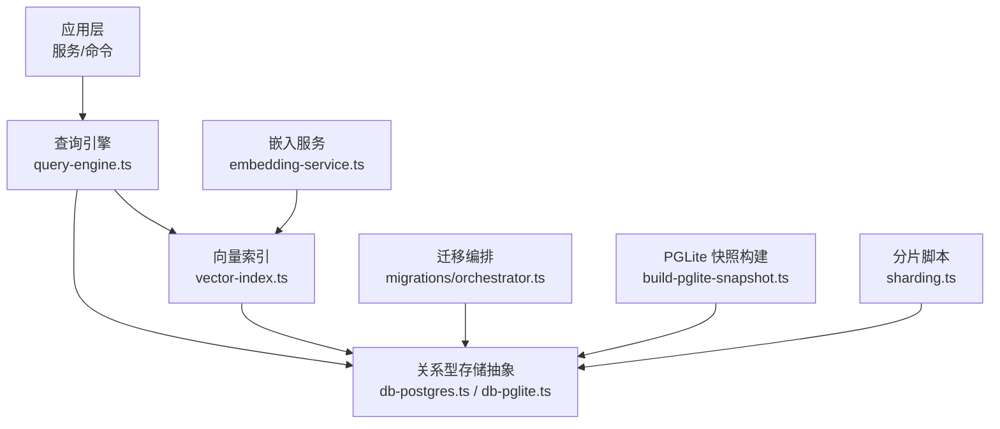
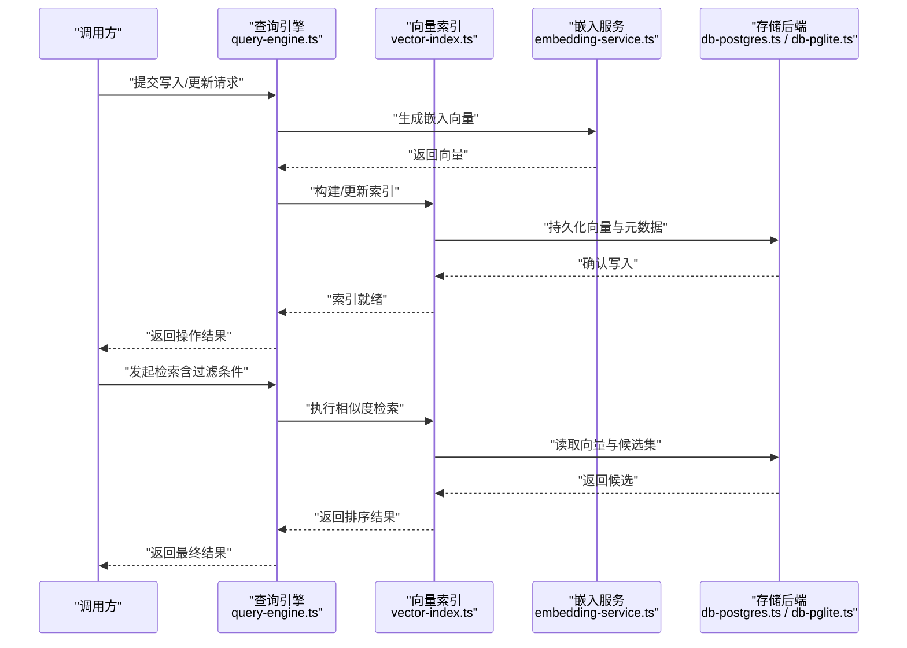
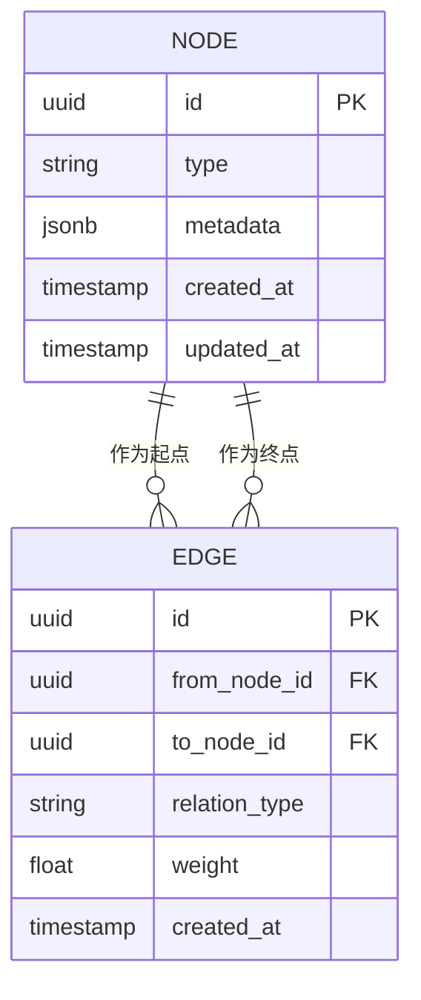
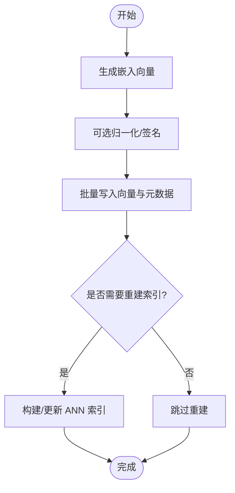
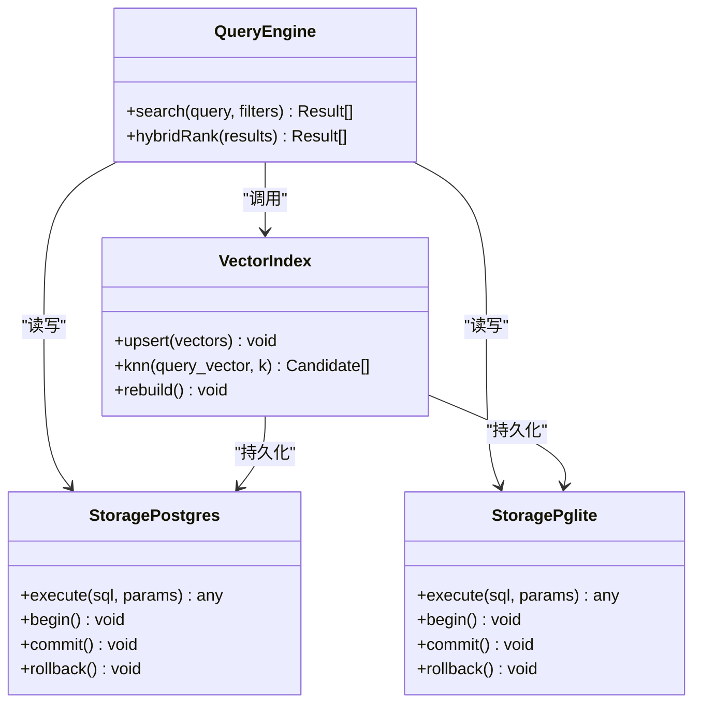
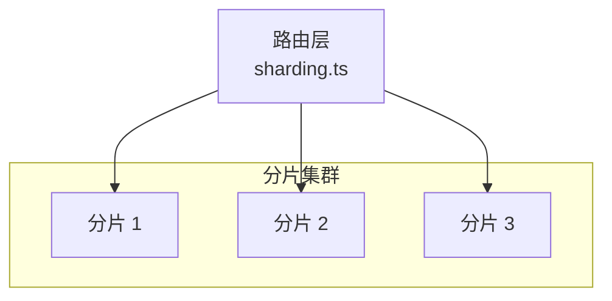
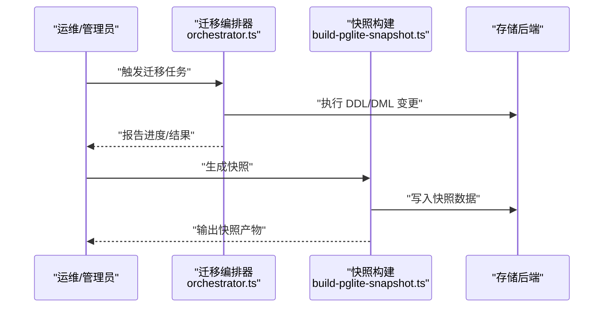
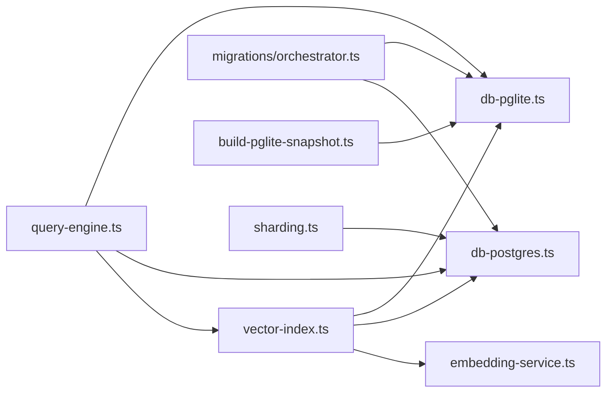

# 图谱存储与索引

<cite>
**本文引用的文件**   
- [src/schema.sql](file://src/schema.sql)
- [docs/GBRAIN_RECOMMENDED_SCHEMA.md](file://docs/GBRAIN_RECOMMENDED_SCHEMA.md)
- [docs/embedding-migrations.md](file://docs/embedding-migrations.md)
- [docs/storage-tiering.md](file://docs/storage-tiering.md)
- [src/core/vector-index.ts](file://src/core/vector-index.ts)
- [src/core/embedding-service.ts](file://src/core/embedding-service.ts)
- [src/core/query-engine.ts](file://src/core/query-engine.ts)
- [src/core/db-postgres.ts](file://src/core/db-postgres.ts)
- [src/core/db-pglite.ts](file://src/core/db-pglite.ts)
- [src/core/migrations/orchestrator.ts](file://src/core/migrations/orchestrator.ts)
- [scripts/build-pglite-snapshot.ts](file://scripts/build-pglite-snapshot.ts)
- [scripts/sharding.ts](file://scripts/sharding.ts)
</cite>

## 目录
1. [简介](#简介)
2. [项目结构](#项目结构)
3. [核心组件](#核心组件)
4. [架构总览](#架构总览)
5. [详细组件分析](#详细组件分析)
6. [依赖关系分析](#依赖关系分析)
7. [性能考虑](#性能考虑)
8. [故障排查指南](#故障排查指南)
9. [结论](#结论)
10. [附录](#附录)

## 简介
本文件面向“图谱存储与索引系统”，围绕知识图谱的数据模型、向量索引的构建与维护、数据库模式设计与查询优化、分布式存储支持与一致性保证、索引配置调优与监控、以及备份恢复与迁移策略进行系统化说明。文档以仓库中的核心实现与文档为依据，提供从概念到代码映射的完整视图，帮助读者快速理解并高效使用该系统。

## 项目结构
与图谱存储与索引相关的核心位置包括：
- 数据模式与推荐模式定义：schema.sql、GBRAIN_RECOMMENDED_SCHEMA.md
- 向量嵌入与迁移：embedding-migrations.md
- 存储分层与多引擎：storage-tiering.md、db-postgres.ts、db-pglite.ts
- 向量索引与检索：vector-index.ts、query-engine.ts
- 迁移编排与快照构建：migrations/orchestrator.ts、build-pglite-snapshot.ts
- 分片与路由脚本：sharding.ts

图表来源
- [src/core/query-engine.ts](file://src/core/query-engine.ts)
- [src/core/vector-index.ts](file://src/core/vector-index.ts)
- [src/core/db-postgres.ts](file://src/core/db-postgres.ts)
- [src/core/db-pglite.ts](file://src/core/db-pglite.ts)
- [src/core/embedding-service.ts](file://src/core/embedding-service.ts)
- [src/core/migrations/orchestrator.ts](file://src/core/migrations/orchestrator.ts)
- [scripts/build-pglite-snapshot.ts](file://scripts/build-pglite-snapshot.ts)
- [scripts/sharding.ts](file://scripts/sharding.ts)

章节来源
- [src/schema.sql](file://src/schema.sql)
- [docs/GBRAIN_RECOMMENDED_SCHEMA.md](file://docs/GBRAIN_RECOMMENDED_SCHEMA.md)
- [docs/embedding-migrations.md](file://docs/embedding-migrations.md)
- [docs/storage-tiering.md](file://docs/storage-tiering.md)
- [src/core/vector-index.ts](file://src/core/vector-index.ts)
- [src/core/embedding-service.ts](file://src/core/embedding-service.ts)
- [src/core/query-engine.ts](file://src/core/query-engine.ts)
- [src/core/db-postgres.ts](file://src/core/db-postgres.ts)
- [src/core/db-pglite.ts](file://src/core/db-pglite.ts)
- [src/core/migrations/orchestrator.ts](file://src/core/migrations/orchestrator.ts)
- [scripts/build-pglite-snapshot.ts](file://scripts/build-pglite-snapshot.ts)
- [scripts/sharding.ts](file://scripts/sharding.ts)

## 核心组件
- 数据模型与约束
  - 节点、边、属性在关系型模式中通过表与列定义，并通过外键、唯一性、检查约束等保障完整性。
  - 推荐模式文档提供了面向不同场景的建模建议与字段约定。
- 向量索引
  - 负责将文本或模态内容转换为嵌入向量，持久化至向量列或专用索引结构，并提供相似度检索。
- 查询引擎
  - 统一组合结构化过滤与向量相似度检索，支持混合排序与结果合并。
- 存储后端
  - 提供 Postgres 与 PGLite 两种后端，屏蔽差异，向上层暴露一致的接口。
- 迁移与快照
  - 迁移编排器驱动 schema 演进；PGLite 快照用于快速初始化与分发。
- 分片与路由
  - 基于分片脚本对数据进行水平切分与路由，支撑扩展性与隔离。

章节来源
- [src/schema.sql](file://src/schema.sql)
- [docs/GBRAIN_RECOMMENDED_SCHEMA.md](file://docs/GBRAIN_RECOMMENDED_SCHEMA.md)
- [src/core/vector-index.ts](file://src/core/vector-index.ts)
- [src/core/query-engine.ts](file://src/core/query-engine.ts)
- [src/core/db-postgres.ts](file://src/core/db-postgres.ts)
- [src/core/db-pglite.ts](file://src/core/db-pglite.ts)
- [src/core/migrations/orchestrator.ts](file://src/core/migrations/orchestrator.ts)
- [scripts/build-pglite-snapshot.ts](file://scripts/build-pglite-snapshot.ts)
- [scripts/sharding.ts](file://scripts/sharding.ts)

## 架构总览
下图展示了从写入到检索的关键路径，涵盖嵌入生成、索引构建、持久化与查询流程。

图表来源
- [src/core/query-engine.ts](file://src/core/query-engine.ts)
- [src/core/vector-index.ts](file://src/core/vector-index.ts)
- [src/core/embedding-service.ts](file://src/core/embedding-service.ts)
- [src/core/db-postgres.ts](file://src/core/db-postgres.ts)
- [src/core/db-pglite.ts](file://src/core/db-pglite.ts)

## 详细组件分析

### 数据模型设计（节点、边、属性）
- 节点与边
  - 节点表承载实体标识、类型、可见性、时间戳等基础信息；边表记录源节点、目标节点、关系类型与权重等。
  - 典型约束包括主键、外键、唯一性（如命名空间+标识）、非空校验与范围检查。
- 属性与扩展
  - 属性通常以 JSONB 或规范化子表形式存储，兼顾灵活性与可查询性。
  - 推荐模式文档给出字段命名、枚举值与索引策略建议。
- 版本与审计
  - 通过版本号、签名或时间戳实现增量演进与冲突检测；审计字段便于追踪变更来源。

图表来源
- [src/schema.sql](file://src/schema.sql)
- [docs/GBRAIN_RECOMMENDED_SCHEMA.md](file://docs/GBRAIN_RECOMMENDED_SCHEMA.md)

章节来源
- [src/schema.sql](file://src/schema.sql)
- [docs/GBRAIN_RECOMMENDED_SCHEMA.md](file://docs/GBRAIN_RECOMMENDED_SCHEMA.md)

### 向量索引的构建与维护
- 嵌入生成
  - 由嵌入服务根据输入内容与模型配置生成固定维度的向量，必要时进行归一化与签名校验。
- 索引构建
  - 向量索引模块负责将向量写入底层存储，并在支持的情况下创建近似最近邻（ANN）索引结构。
- 维护机制
  - 增量更新：按批次写入新向量并重建局部索引。
  - 全量重建：在模型升级或维度变更后触发。
  - 清理与去重：依据业务键或指纹避免重复条目。

图表来源
- [src/core/vector-index.ts](file://src/core/vector-index.ts)
- [src/core/embedding-service.ts](file://src/core/embedding-service.ts)
- [src/core/db-postgres.ts](file://src/core/db-postgres.ts)
- [src/core/db-pglite.ts](file://src/core/db-pglite.ts)

章节来源
- [src/core/vector-index.ts](file://src/core/vector-index.ts)
- [src/core/embedding-service.ts](file://src/core/embedding-service.ts)
- [docs/embedding-migrations.md](file://docs/embedding-migrations.md)

### 数据库模式设计与查询优化
- 模式要点
  - 为高频过滤字段建立 B-tree 索引；对向量列启用向量索引（如 HNSW/IVF 等，取决于后端能力）。
  - 使用部分索引与覆盖索引减少扫描成本。
- 查询优化
  - 先结构化过滤再向量检索，缩小候选集。
  - 混合排序：结合关键词匹配、时间衰减、权重等综合打分。
  - 分页与游标：避免深分页带来的性能退化。
- 存储分层
  - 热/温/冷分层策略，将热点数据驻留高性能介质，历史数据归档至低成本存储。

图表来源
- [src/core/query-engine.ts](file://src/core/query-engine.ts)
- [src/core/vector-index.ts](file://src/core/vector-index.ts)
- [src/core/db-postgres.ts](file://src/core/db-postgres.ts)
- [src/core/db-pglite.ts](file://src/core/db-pglite.ts)
- [docs/storage-tiering.md](file://docs/storage-tiering.md)

章节来源
- [src/core/query-engine.ts](file://src/core/query-engine.ts)
- [src/core/vector-index.ts](file://src/core/vector-index.ts)
- [src/core/db-postgres.ts](file://src/core/db-postgres.ts)
- [src/core/db-pglite.ts](file://src/core/db-pglite.ts)
- [docs/storage-tiering.md](file://docs/storage-tiering.md)

### 分布式存储支持与一致性保证
- 分片与路由
  - 通过分片脚本对数据进行水平切分，按 key 哈希路由到对应分片，提升吞吐与可扩展性。
- 一致性
  - 单分片内采用事务保证原子性；跨分片操作需引入两阶段提交或补偿事务。
  - 读一致性与写一致性可通过副本同步与超时重试策略调节。
- 可用性
  - 主备切换、自动故障转移与锁选举机制确保高可用。

图表来源
- [scripts/sharding.ts](file://scripts/sharding.ts)

章节来源
- [scripts/sharding.ts](file://scripts/sharding.ts)

### 索引配置调优指南
- 关键参数
  - 向量维度、距离度量、索引类型（HNSW/IVF）、M/efConstruction/efSearch 等。
  - 批大小、并发度、重建阈值与回退策略。
- 调优步骤
  - 基准测试：在不同规模数据集上评估召回率与延迟。
  - 参数搜索：网格或贝叶斯优化寻找最优配置。
  - 在线观察：结合监控指标持续微调。
- 回滚与降级
  - 保留旧索引版本，失败时快速回滚；必要时降级为精确检索。

章节来源
- [src/core/vector-index.ts](file://src/core/vector-index.ts)
- [docs/embedding-migrations.md](file://docs/embedding-migrations.md)

### 性能监控方法
- 指标采集
  - 写入吞吐、索引构建耗时、KNN 查询延迟与 QPS、内存占用、磁盘 I/O。
- 观测手段
  - 日志埋点、分布式追踪、数据库慢查询日志与 EXPLAIN 计划分析。
- 告警规则
  - 针对 P95/P99 延迟、错误率、索引碎片率设置阈值告警。

章节来源
- [src/core/query-engine.ts](file://src/core/query-engine.ts)
- [src/core/vector-index.ts](file://src/core/vector-index.ts)

### 数据备份、恢复与迁移策略
- 备份
  - 逻辑备份（导出 SQL/JSON）与物理快照结合；PGLite 可使用快照构建工具快速复制。
- 恢复
  - 按环境分层恢复，校验完整性后再上线；支持断点续传与幂等导入。
- 迁移
  - 迁移编排器驱动 schema 与索引演进，支持灰度发布与回滚。
  - 嵌入维度或模型变更时，执行向后兼容的迁移任务与回填。

图表来源
- [src/core/migrations/orchestrator.ts](file://src/core/migrations/orchestrator.ts)
- [scripts/build-pglite-snapshot.ts](file://scripts/build-pglite-snapshot.ts)
- [src/core/db-postgres.ts](file://src/core/db-postgres.ts)
- [src/core/db-pglite.ts](file://src/core/db-pglite.ts)

章节来源
- [src/core/migrations/orchestrator.ts](file://src/core/migrations/orchestrator.ts)
- [scripts/build-pglite-snapshot.ts](file://scripts/build-pglite-snapshot.ts)
- [docs/embedding-migrations.md](file://docs/embedding-migrations.md)

## 依赖关系分析
- 组件耦合
  - 查询引擎依赖向量索引与存储后端；向量索引依赖嵌入服务与存储后端。
  - 迁移编排器与存储后端直接交互，独立于上层业务。
- 外部依赖
  - 向量检索库、数据库驱动、嵌入模型 API。
- 潜在循环
  - 当前分层清晰，未见明显循环依赖；保持单向依赖有助于解耦与测试。

图表来源
- [src/core/query-engine.ts](file://src/core/query-engine.ts)
- [src/core/vector-index.ts](file://src/core/vector-index.ts)
- [src/core/embedding-service.ts](file://src/core/embedding-service.ts)
- [src/core/db-postgres.ts](file://src/core/db-postgres.ts)
- [src/core/db-pglite.ts](file://src/core/db-pglite.ts)
- [src/core/migrations/orchestrator.ts](file://src/core/migrations/orchestrator.ts)
- [scripts/build-pglite-snapshot.ts](file://scripts/build-pglite-snapshot.ts)
- [scripts/sharding.ts](file://scripts/sharding.ts)

章节来源
- [src/core/query-engine.ts](file://src/core/query-engine.ts)
- [src/core/vector-index.ts](file://src/core/vector-index.ts)
- [src/core/db-postgres.ts](file://src/core/db-postgres.ts)
- [src/core/db-pglite.ts](file://src/core/db-pglite.ts)
- [src/core/migrations/orchestrator.ts](file://src/core/migrations/orchestrator.ts)
- [scripts/build-pglite-snapshot.ts](file://scripts/build-pglite-snapshot.ts)
- [scripts/sharding.ts](file://scripts/sharding.ts)

## 性能考虑
- 写入侧
  - 批量写入与异步索引构建降低主路径延迟。
  - 合理设置批大小与并发度，避免数据库连接池耗尽。
- 读取侧
  - 结构化预过滤显著减少 KNN 候选集。
  - 调整 efSearch/M 等参数平衡延迟与召回。
- 存储侧
  - 利用分区表与冷热分层减少热点压力。
  - 定期 VACUUM/ANALYZE 与索引重建维持统计信息与访问效率。

[本节为通用指导，不直接分析具体文件]

## 故障排查指南
- 常见问题
  - 向量维度不一致导致检索失败：检查嵌入模型与迁移记录。
  - 索引构建缓慢：评估批大小、索引参数与硬件资源。
  - 查询超时：定位慢查询计划，增加必要索引或调整过滤条件。
- 诊断步骤
  - 查看迁移与快照日志，确认状态机推进。
  - 使用 EXPLAIN 分析执行计划，关注索引选择与扫描方式。
  - 对比不同环境的索引参数与数据分布差异。

章节来源
- [docs/embedding-migrations.md](file://docs/embedding-migrations.md)
- [src/core/migrations/orchestrator.ts](file://src/core/migrations/orchestrator.ts)
- [src/core/query-engine.ts](file://src/core/query-engine.ts)

## 结论
本系统以关系型模式为基础，结合向量索引与查询引擎，形成结构化与语义化融合的检索能力。通过存储后端抽象、迁移编排与快照机制，系统在可移植性与可演进性方面具备良好支撑。配合分片与分层策略，可在大规模场景下获得稳定性能与高可用性。建议在生产环境中持续进行参数调优与监控告警建设，确保长期稳健运行。

## 附录
- 术语
  - 节点：图中的实体对象。
  - 边：节点之间的关系。
  - 嵌入向量：将文本或模态内容映射为数值向量的表示。
  - ANN：近似最近邻检索。
- 参考
  - 推荐模式与最佳实践参见推荐模式文档。
  - 嵌入迁移与兼容性参见嵌入迁移文档。
  - 存储分层策略参见存储分层文档。