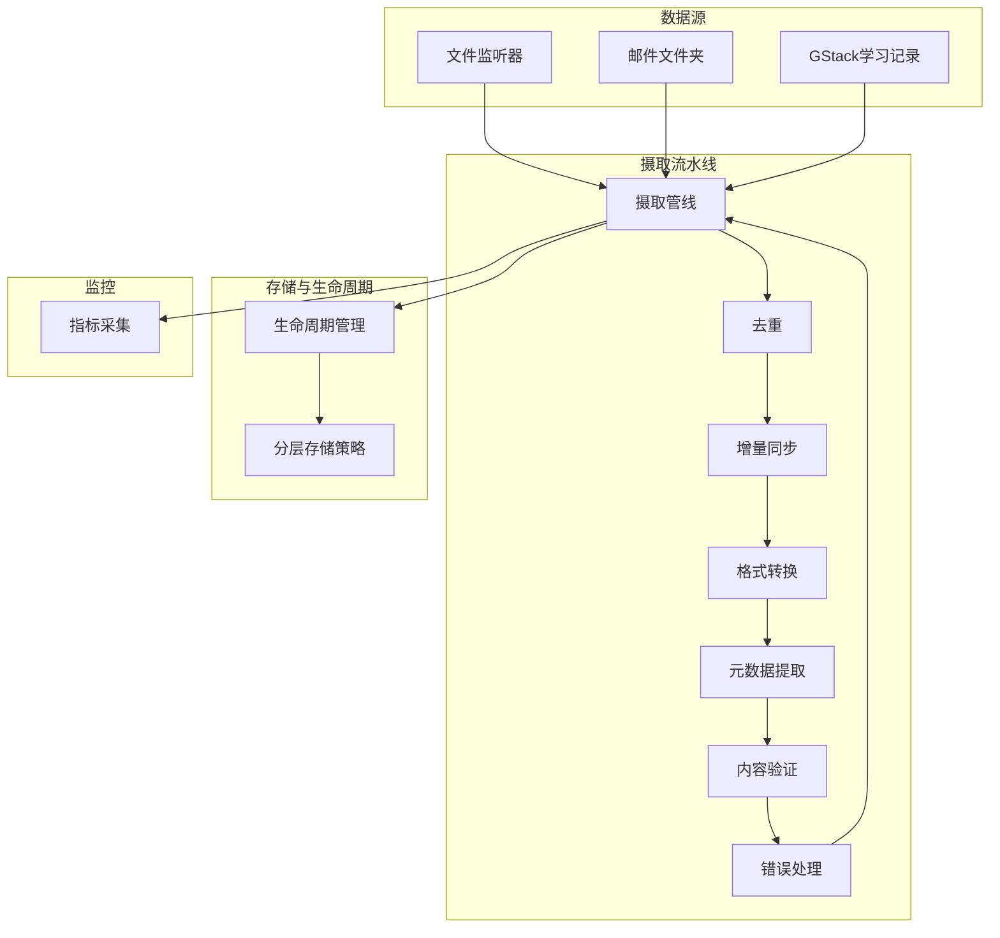
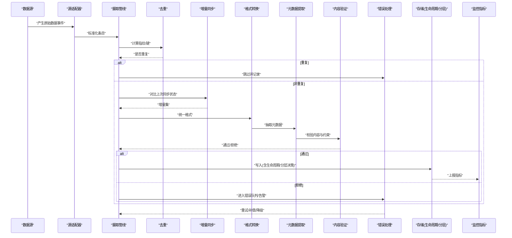
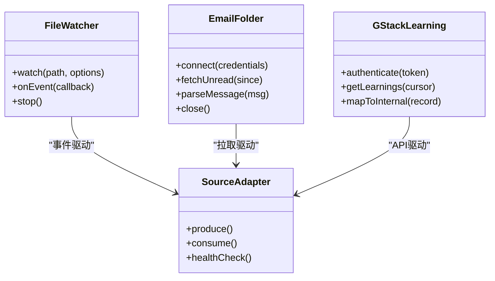
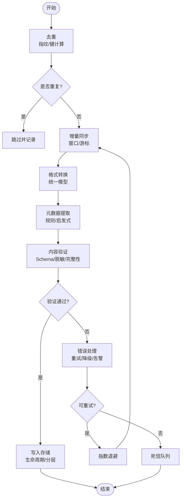
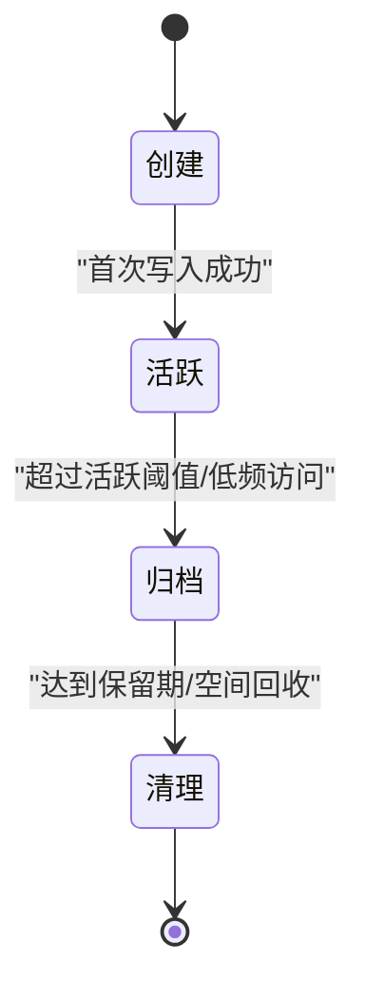
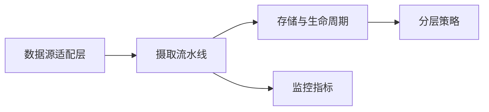

# 数据摄取与处理

<cite>
**本文引用的文件**   
- [README.md](file://README.md)
- [gbrain.yml](file://gbrain.yml)
- [src/core/sources/index.ts](file://src/core/sources/index.ts)
- [src/core/sources/file-watcher.ts](file://src/core/sources/file-watcher.ts)
- [src/core/sources/email-folder.ts](file://src/core/sources/email-folder.ts)
- [src/core/sources/gstack-learning.ts](file://src/core/sources/gstack-learning.ts)
- [src/core/ingestion/pipeline.ts](file://src/core/ingestion/pipeline.ts)
- [src/core/ingestion/dedup.ts](file://src/core/ingestion/dedup.ts)
- [src/core/ingestion/incremental-sync.ts](file://src/core/ingestion/incremental-sync.ts)
- [src/core/ingestion/validation.ts](file://src/core/ingestion/validation.ts)
- [src/core/ingestion/metadata-extractor.ts](file://src/core/ingestion/metadata-extractor.ts)
- [src/core/ingestion/format-converter.ts](file://src/core/ingestion/format-converter.ts)
- [src/core/ingestion/error-handler.ts](file://src/core/ingestion/error-handler.ts)
- [src/core/storage/lifecycle-manager.ts](file://src/core/storage/lifecycle-manager.ts)
- [src/core/storage/tiering-strategy.ts](file://src/core/storage/tiering-strategy.ts)
- [src/core/monitoring/metrics.ts](file://src/core/monitoring/metrics.ts)
- [recipes/email-to-brain.md](file://recipes/email-to-brain.md)
</cite>

## 目录
1. [简介](#简介)
2. [项目结构](#项目结构)
3. [核心组件](#核心组件)
4. [架构总览](#架构总览)
5. [详细组件分析](#详细组件分析)
6. [依赖关系分析](#依赖关系分析)
7. [性能考虑](#性能考虑)
8. [故障排除指南](#故障排除指南)
9. [结论](#结论)
10. [附录](#附录)

## 简介
本文件面向“数据摄取与处理系统”，聚焦多源数据摄取的统一架构与实现，包括：
- 多源数据接入：文件系统监听、邮件文件夹、GStack学习记录等
- 数据处理流水线：去重、增量同步、格式转换、元数据提取、内容验证
- 错误处理与重试策略
- 配置扩展：如何新增数据源类型
- 性能优化、监控指标与可观测性
- 数据生命周期管理与存储分层策略

该文档以代码仓库中的实际模块为依据，提供从高层到代码级的可视化说明，帮助读者快速理解并扩展系统能力。

## 项目结构
数据摄取与处理相关代码主要分布在以下目录：
- src/core/sources：数据源适配器（文件监听、邮件、GStack学习）
- src/core/ingestion：摄取流水线（去重、增量、校验、转换、元数据）
- src/core/storage：生命周期与分层存储
- src/core/monitoring：指标与可观测性
- recipes：示例集成方案（如邮件到脑库）
- gbrain.yml：全局配置入口

图表来源
- [src/core/sources/file-watcher.ts](file://src/core/sources/file-watcher.ts)
- [src/core/sources/email-folder.ts](file://src/core/sources/email-folder.ts)
- [src/core/sources/gstack-learning.ts](file://src/core/sources/gstack-learning.ts)
- [src/core/ingestion/pipeline.ts](file://src/core/ingestion/pipeline.ts)
- [src/core/ingestion/dedup.ts](file://src/core/ingestion/dedup.ts)
- [src/core/ingestion/incremental-sync.ts](file://src/core/ingestion/incremental-sync.ts)
- [src/core/ingestion/format-converter.ts](file://src/core/ingestion/format-converter.ts)
- [src/core/ingestion/metadata-extractor.ts](file://src/core/ingestion/metadata-extractor.ts)
- [src/core/ingestion/validation.ts](file://src/core/ingestion/validation.ts)
- [src/core/ingestion/error-handler.ts](file://src/core/ingestion/error-handler.ts)
- [src/core/storage/lifecycle-manager.ts](file://src/core/storage/lifecycle-manager.ts)
- [src/core/storage/tiering-strategy.ts](file://src/core/storage/tiering-strategy.ts)
- [src/core/monitoring/metrics.ts](file://src/core/monitoring/metrics.ts)

章节来源
- [README.md](file://README.md)
- [gbrain.yml](file://gbrain.yml)

## 核心组件
- 数据源适配层
  - 文件监听器：基于文件系统事件或周期性扫描，发现新增/变更文件，产出标准化条目
  - 邮件文件夹：连接邮箱服务，拉取新邮件与附件，解析主题、正文、发件人、时间戳等
  - GStack学习记录：对接外部学习平台接口，获取学习轨迹、笔记、测验结果等结构化数据
- 摄取流水线
  - 去重：基于内容指纹与来源标识进行幂等写入
  - 增量同步：基于时间戳、版本号或差异标记，仅处理变更部分
  - 格式转换：将不同输入格式转换为内部统一模型
  - 元数据提取：抽取标题、作者、标签、时间、来源域等
  - 内容验证：Schema校验、长度限制、敏感信息过滤、完整性检查
  - 错误处理：分类、重试、降级、告警与审计日志
- 存储与生命周期
  - 生命周期管理：创建、活跃、归档、清理的自动流转
  - 分层存储策略：热/温/冷分层，按访问频率与时效性选择存储介质
- 监控与可观测性
  - 指标采集：吞吐、延迟、失败率、队列积压、存储占用等

章节来源
- [src/core/sources/index.ts](file://src/core/sources/index.ts)
- [src/core/ingestion/pipeline.ts](file://src/core/ingestion/pipeline.ts)
- [src/core/storage/lifecycle-manager.ts](file://src/core/storage/lifecycle-manager.ts)
- [src/core/storage/tiering-strategy.ts](file://src/core/storage/tiering-strategy.ts)
- [src/core/monitoring/metrics.ts](file://src/core/monitoring/metrics.ts)

## 架构总览
下图展示从数据源到存储的端到端流程，以及关键处理阶段与错误恢复路径。

图表来源
- [src/core/sources/file-watcher.ts](file://src/core/sources/file-watcher.ts)
- [src/core/sources/email-folder.ts](file://src/core/sources/email-folder.ts)
- [src/core/sources/gstack-learning.ts](file://src/core/sources/gstack-learning.ts)
- [src/core/ingestion/pipeline.ts](file://src/core/ingestion/pipeline.ts)
- [src/core/ingestion/dedup.ts](file://src/core/ingestion/dedup.ts)
- [src/core/ingestion/incremental-sync.ts](file://src/core/ingestion/incremental-sync.ts)
- [src/core/ingestion/format-converter.ts](file://src/core/ingestion/format-converter.ts)
- [src/core/ingestion/metadata-extractor.ts](file://src/core/ingestion/metadata-extractor.ts)
- [src/core/ingestion/validation.ts](file://src/core/ingestion/validation.ts)
- [src/core/ingestion/error-handler.ts](file://src/core/ingestion/error-handler.ts)
- [src/core/storage/lifecycle-manager.ts](file://src/core/storage/lifecycle-manager.ts)
- [src/core/storage/tiering-strategy.ts](file://src/core/storage/tiering-strategy.ts)
- [src/core/monitoring/metrics.ts](file://src/core/monitoring/metrics.ts)

## 详细组件分析

### 数据源适配层
- 文件监听器
  - 职责：监听目录变化或周期扫描，识别新增/修改/删除事件，生成标准化条目
  - 关键点：事件去抖、批量合并、异常隔离、断点续扫
- 邮件文件夹
  - 职责：连接邮箱协议，拉取未读/增量邮件，解析头部与附件，映射为内部模型
  - 关键点：认证与限流、分页拉取、附件大小限制、编码处理
- GStack学习记录
  - 职责：调用外部API获取学习记录，聚合用户行为与知识资产
  - 关键点：鉴权、分页/游标、幂等键、字段映射与清洗

图表来源
- [src/core/sources/file-watcher.ts](file://src/core/sources/file-watcher.ts)
- [src/core/sources/email-folder.ts](file://src/core/sources/email-folder.ts)
- [src/core/sources/gstack-learning.ts](file://src/core/sources/gstack-learning.ts)
- [src/core/sources/index.ts](file://src/core/sources/index.ts)

章节来源
- [src/core/sources/file-watcher.ts](file://src/core/sources/file-watcher.ts)
- [src/core/sources/email-folder.ts](file://src/core/sources/email-folder.ts)
- [src/core/sources/gstack-learning.ts](file://src/core/sources/gstack-learning.ts)
- [src/core/sources/index.ts](file://src/core/sources/index.ts)

### 摄取流水线
- 去重算法
  - 设计要点：内容指纹（哈希）、来源ID+唯一键、软冲突检测、幂等写入
  - 复杂度：O(1) 指纹计算；索引查找近似O(1)；批量去重线性复杂度
- 增量同步机制
  - 设计要点：基于时间戳/版本号的增量窗口、游标持久化、断点恢复
  - 一致性：最终一致，允许短暂重复由去重层兜底
- 格式转换
  - 设计要点：多输入到统一中间表示，插件化转换器，向后兼容
- 元数据提取
  - 设计要点：规则+启发式，支持自定义提取器，容错与回退
- 内容验证
  - 设计要点：Schema校验、长度/字符集限制、PII脱敏、完整性校验
- 错误处理
  - 设计要点：错误分类（网络/解析/业务）、指数退避重试、死信队列、告警与审计

图表来源
- [src/core/ingestion/dedup.ts](file://src/core/ingestion/dedup.ts)
- [src/core/ingestion/incremental-sync.ts](file://src/core/ingestion/incremental-sync.ts)
- [src/core/ingestion/format-converter.ts](file://src/core/ingestion/format-converter.ts)
- [src/core/ingestion/metadata-extractor.ts](file://src/core/ingestion/metadata-extractor.ts)
- [src/core/ingestion/validation.ts](file://src/core/ingestion/validation.ts)
- [src/core/ingestion/error-handler.ts](file://src/core/ingestion/error-handler.ts)
- [src/core/ingestion/pipeline.ts](file://src/core/ingestion/pipeline.ts)

章节来源
- [src/core/ingestion/pipeline.ts](file://src/core/ingestion/pipeline.ts)
- [src/core/ingestion/dedup.ts](file://src/core/ingestion/dedup.ts)
- [src/core/ingestion/incremental-sync.ts](file://src/core/ingestion/incremental-sync.ts)
- [src/core/ingestion/format-converter.ts](file://src/core/ingestion/format-converter.ts)
- [src/core/ingestion/metadata-extractor.ts](file://src/core/ingestion/metadata-extractor.ts)
- [src/core/ingestion/validation.ts](file://src/core/ingestion/validation.ts)
- [src/core/ingestion/error-handler.ts](file://src/core/ingestion/error-handler.ts)

### 存储与生命周期
- 生命周期管理
  - 阶段：创建→活跃→归档→清理
  - 触发条件：时间阈值、访问频率、容量水位、合规要求
- 分层存储策略
  - 热层：低延迟、高吞吐，适合近期高频访问
  - 温层：成本平衡，适合中等访问频率
  - 冷层：低成本、高延迟，适合长期归档与合规留存

图表来源
- [src/core/storage/lifecycle-manager.ts](file://src/core/storage/lifecycle-manager.ts)
- [src/core/storage/tiering-strategy.ts](file://src/core/storage/tiering-strategy.ts)

章节来源
- [src/core/storage/lifecycle-manager.ts](file://src/core/storage/lifecycle-manager.ts)
- [src/core/storage/tiering-strategy.ts](file://src/core/storage/tiering-strategy.ts)

### 监控与可观测性
- 指标维度
  - 摄取吞吐：条/秒、批次大小
  - 延迟：端到端P50/P95/P99
  - 失败率：各阶段错误占比
  - 资源使用：CPU/内存/IO/存储占用
  - 队列状态：积压、消费速率、重试次数
- 告警与审计
  - 阈值告警、死信队列监控、审计日志追踪

章节来源
- [src/core/monitoring/metrics.ts](file://src/core/monitoring/metrics.ts)

## 依赖关系分析
- 耦合与内聚
  - 数据源与流水线松耦合：通过标准化条目接口交互
  - 流水线阶段模块化：每阶段独立可替换，便于测试与演进
- 外部依赖
  - 文件系统、邮件协议、外部API
  - 存储后端（热/温/冷层）
- 潜在循环依赖
  - 通过接口抽象与事件总线避免直接循环引用

图表来源
- [src/core/sources/index.ts](file://src/core/sources/index.ts)
- [src/core/ingestion/pipeline.ts](file://src/core/ingestion/pipeline.ts)
- [src/core/storage/lifecycle-manager.ts](file://src/core/storage/lifecycle-manager.ts)
- [src/core/storage/tiering-strategy.ts](file://src/core/storage/tiering-strategy.ts)
- [src/core/monitoring/metrics.ts](file://src/core/monitoring/metrics.ts)

章节来源
- [src/core/sources/index.ts](file://src/core/sources/index.ts)
- [src/core/ingestion/pipeline.ts](file://src/core/ingestion/pipeline.ts)
- [src/core/storage/lifecycle-manager.ts](file://src/core/storage/lifecycle-manager.ts)
- [src/core/storage/tiering-strategy.ts](file://src/core/storage/tiering-strategy.ts)
- [src/core/monitoring/metrics.ts](file://src/core/monitoring/metrics.ts)

## 性能考虑
- 批处理与并发
  - 批量读取与写入，合理设置并发度，避免背压
- 去重与索引
  - 使用高效哈希与索引结构，减少全表扫描
- 增量窗口
  - 缩小增量范围，结合游标与时间分区
- 缓存与预热
  - 热点元数据与配置缓存，缩短首查延迟
- I/O与序列化
  - 压缩传输、异步落盘、零拷贝优化
- 资源配额
  - CPU/内存/IO配额控制，防止单源独占资源

[本节为通用指导，不直接分析具体文件]

## 故障排除指南
- 常见问题定位
  - 数据源连接失败：检查认证、网络连通性与限流策略
  - 增量同步停滞：核对游标持久化与时间窗口边界
  - 去重误判：确认指纹算法与键空间唯一性
  - 格式转换异常：查看转换器版本兼容与输入Schema
  - 内容验证失败：审查Schema定义与脱敏规则
  - 错误重试风暴：调整退避参数与最大重试次数
- 诊断手段
  - 启用审计日志与链路追踪
  - 观察指标面板：吞吐、延迟、失败率、队列积压
  - 导出死信队列样本进行离线分析

章节来源
- [src/core/ingestion/error-handler.ts](file://src/core/ingestion/error-handler.ts)
- [src/core/monitoring/metrics.ts](file://src/core/monitoring/metrics.ts)

## 结论
本系统通过标准化的数据源适配与模块化摄取流水线，实现了多源数据的可靠摄入与高质量治理。去重与增量同步保障幂等与效率，格式转换与元数据提取提升可用性，内容验证与错误处理确保稳健性。配合生命周期管理与分层存储，系统在成本与性能之间取得平衡。完善的监控与可观测性为运维与排障提供了有力支撑。

[本节为总结性内容，不直接分析具体文件]

## 附录

### 配置示例：添加新的数据源类型
- 在数据源注册表中声明新适配器
- 在摄取管线中注册对应的转换器与校验器
- 在配置文件中添加新源的连接参数与策略
- 在监控中为新源增加指标维度

参考路径
- [src/core/sources/index.ts](file://src/core/sources/index.ts)
- [src/core/ingestion/pipeline.ts](file://src/core/ingestion/pipeline.ts)
- [gbrain.yml](file://gbrain.yml)

### 示例集成：邮件到脑库
- 端到端流程：邮件拉取→解析→转换→入库→归档
- 注意事项：附件大小限制、编码处理、权限与隐私

参考路径
- [recipes/email-to-brain.md](file://recipes/email-to-brain.md)