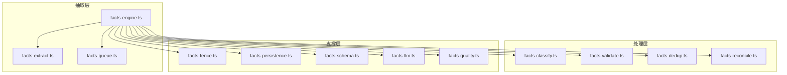
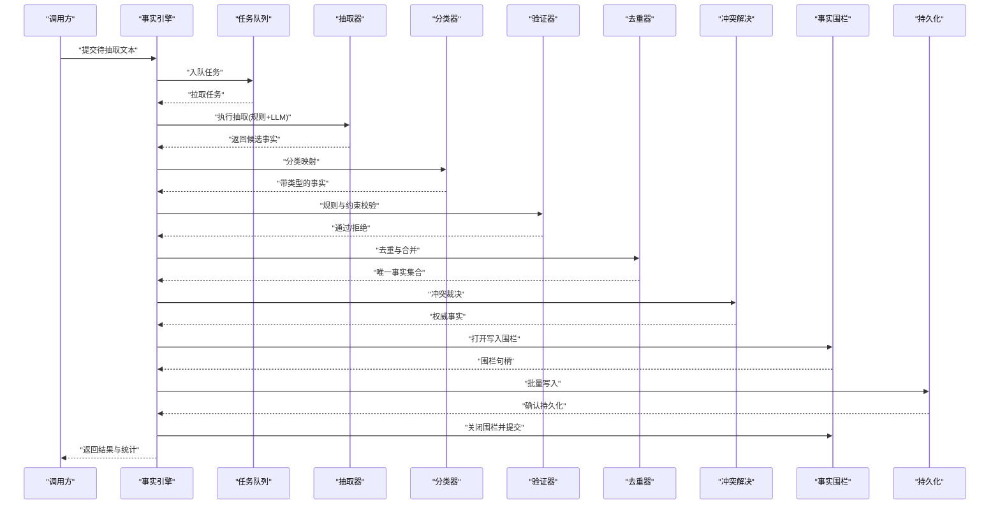
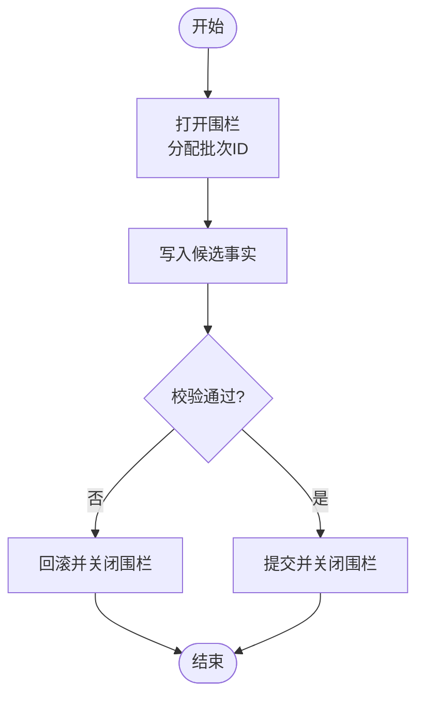
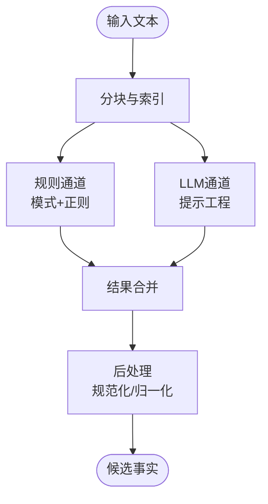
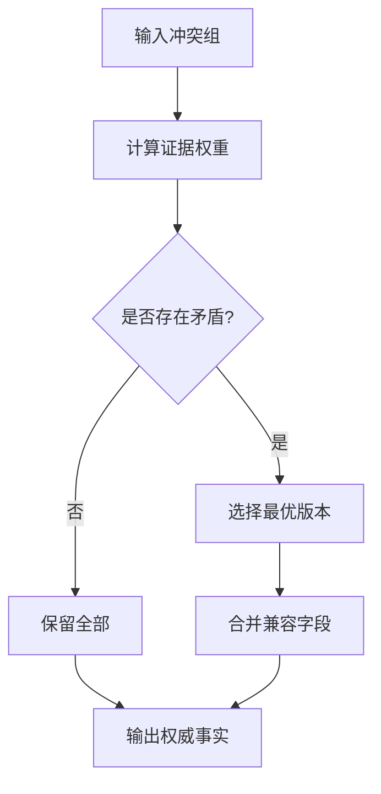
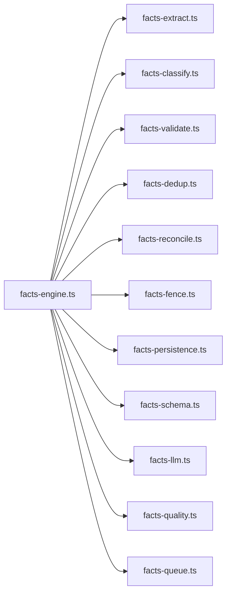

# 事实抽取引擎

<cite>
**本文引用的文件**   
- [src/core/facts-engine.ts](file://src/core/facts-engine.ts)
- [src/core/facts-fence.ts](file://src/core/facts-fence.ts)
- [src/core/facts-extract.ts](file://src/core/facts-extract.ts)
- [src/core/facts-classify.ts](file://src/core/facts-classify.ts)
- [src/core/facts-validate.ts](file://src/core/facts-validate.ts)
- [src/core/facts-dedup.ts](file://src/core/facts-dedup.ts)
- [src/core/facts-reconcile.ts](file://src/core/facts-reconcile.ts)
- [src/core/facts-quality.ts](file://src/core/facts-quality.ts)
- [src/core/facts-persistence.ts](file://src/core/facts-persistence.ts)
- [src/core/facts-schema.ts](file://src/core/facts-schema.ts)
- [src/core/facts-llm.ts](file://src/core/facts-llm.ts)
- [src/core/facts-queue.ts](file://src/core/facts-queue.ts)
- [test/facts-engine.test.ts](file://test/facts-engine.test.ts)
- [test/facts-fence.test.ts](file://test/facts-fence.test.ts)
- [test/facts-extract.test.ts](file://test/facts-extract.test.ts)
- [test/facts-classify.test.ts](file://test/facts-classify.test.ts)
- [test/facts-dedup.test.ts](file://test/facts-dedup.test.ts)
- [test/facts-reconcile-protect-cli.test.ts](file://test/facts-reconcile-protect-cli.test.ts)
- [test/facts-quality.test.ts](file://test/facts-quality.test.ts)
- [test/facts-persistence.test.ts](file://test/facts-persistence.test.ts)
</cite>

## 目录
1. [简介](#简介)
2. [项目结构](#项目结构)
3. [核心组件](#核心组件)
4. [架构总览](#架构总览)
5. [详细组件分析](#详细组件分析)
6. [依赖关系分析](#依赖关系分析)
7. [性能与内存优化](#性能与内存优化)
8. [故障排查指南](#故障排查指南)
9. [结论](#结论)
10. [附录：自定义提取器开发指南](#附录自定义提取器开发指南)

## 简介
本文件面向“事实抽取引擎”的开发者与维护者，系统性阐述从非结构化文本中抽取、识别、分类、验证并持久化结构化事实的完整流程。文档覆盖以下关键主题：
- 事实识别、分类与验证机制
- 事实围栏（facts fence）的工作原理与数据持久化策略
- 质量评估标准、去重机制与冲突解决策略
- 自定义事实提取器的开发方法（模式定义、正则表达式配置、LLM辅助提取）
- 性能优化技巧与内存管理最佳实践

## 项目结构
事实抽取引擎位于 src/core 下，围绕“抽取—分类—验证—去重—冲突解决—持久化”的主链路组织模块；测试用例集中于 test/ 对应子集，用于保障各阶段行为正确性与稳定性。

图表来源
- [src/core/facts-engine.ts](file://src/core/facts-engine.ts)
- [src/core/facts-extract.ts](file://src/core/facts-extract.ts)
- [src/core/facts-classify.ts](file://src/core/facts-classify.ts)
- [src/core/facts-validate.ts](file://src/core/facts-validate.ts)
- [src/core/facts-dedup.ts](file://src/core/facts-dedup.ts)
- [src/core/facts-reconcile.ts](file://src/core/facts-reconcile.ts)
- [src/core/facts-fence.ts](file://src/core/facts-fence.ts)
- [src/core/facts-persistence.ts](file://src/core/facts-persistence.ts)
- [src/core/facts-schema.ts](file://src/core/facts-schema.ts)
- [src/core/facts-llm.ts](file://src/core/facts-llm.ts)
- [src/core/facts-quality.ts](file://src/core/facts-quality.ts)
- [src/core/facts-queue.ts](file://src/core/facts-queue.ts)

章节来源
- [src/core/facts-engine.ts](file://src/core/facts-engine.ts)
- [src/core/facts-fence.ts](file://src/core/facts-fence.ts)
- [src/core/facts-extract.ts](file://src/core/facts-extract.ts)
- [src/core/facts-classify.ts](file://src/core/facts-classify.ts)
- [src/core/facts-validate.ts](file://src/core/facts-validate.ts)
- [src/core/facts-dedup.ts](file://src/core/facts-dedup.ts)
- [src/core/facts-reconcile.ts](file://src/core/facts-reconcile.ts)
- [src/core/facts-quality.ts](file://src/core/facts-quality.ts)
- [src/core/facts-persistence.ts](file://src/core/facts-persistence.ts)
- [src/core/facts-schema.ts](file://src/core/facts-schema.ts)
- [src/core/facts-llm.ts](file://src/core/facts-llm.ts)
- [src/core/facts-queue.ts](file://src/core/facts-queue.ts)

## 核心组件
- 事实引擎（facts-engine）：编排抽取流水线，协调队列、围栏、分类、验证、去重、冲突解决与持久化等阶段。
- 事实围栏（facts-fence）：维护事实写入边界与一致性窗口，确保在并发或重试场景下的幂等与可见性控制。
- 抽取器（facts-extract）：基于规则、模式与 LLM 的混合抽取管线，产出候选事实。
- 分类器（facts-classify）：将候选事实映射到预定义类型体系，支持扩展与回退策略。
- 验证器（facts-validate）：对事实进行格式、约束与业务规则校验。
- 去重器（facts-dedup）：基于指纹与相似度计算实现近重复检测与合并。
- 冲突解决（facts-reconcile）：在多源或多版本事实间进行裁决，生成最终权威事实。
- 持久化（facts-persistence）：负责事实落库、索引更新与事务边界。
- 质量评估（facts-quality）：提供召回率、精确率、F1 等指标与抽样审计能力。
- 模式与 LLM（facts-schema, facts-llm）：定义抽取模式与调用大模型进行增强抽取与推理。
- 队列（facts-queue）：异步任务调度与背压控制。

章节来源
- [src/core/facts-engine.ts](file://src/core/facts-engine.ts)
- [src/core/facts-fence.ts](file://src/core/facts-fence.ts)
- [src/core/facts-extract.ts](file://src/core/facts-extract.ts)
- [src/core/facts-classify.ts](file://src/core/facts-classify.ts)
- [src/core/facts-validate.ts](file://src/core/facts-validate.ts)
- [src/core/facts-dedup.ts](file://src/core/facts-dedup.ts)
- [src/core/facts-reconcile.ts](file://src/core/facts-reconcile.ts)
- [src/core/facts-quality.ts](file://src/core/facts-quality.ts)
- [src/core/facts-persistence.ts](file://src/core/facts-persistence.ts)
- [src/core/facts-schema.ts](file://src/core/facts-schema.ts)
- [src/core/facts-llm.ts](file://src/core/facts-llm.ts)
- [src/core/facts-queue.ts](file://src/core/facts-queue.ts)

## 架构总览
下图展示了端到端的事实抽取主流程，包括入口编排、围栏保护、多阶段处理与持久化落盘。

图表来源
- [src/core/facts-engine.ts](file://src/core/facts-engine.ts)
- [src/core/facts-fence.ts](file://src/core/facts-fence.ts)
- [src/core/facts-extract.ts](file://src/core/facts-extract.ts)
- [src/core/facts-classify.ts](file://src/core/facts-classify.ts)
- [src/core/facts-validate.ts](file://src/core/facts-validate.ts)
- [src/core/facts-dedup.ts](file://src/core/facts-dedup.ts)
- [src/core/facts-reconcile.ts](file://src/core/facts-reconcile.ts)
- [src/core/facts-persistence.ts](file://src/core/facts-persistence.ts)
- [src/core/facts-queue.ts](file://src/core/facts-queue.ts)

## 详细组件分析

### 事实引擎（facts-engine）
职责与流程
- 编排抽取流水线：按顺序驱动抽取、分类、验证、去重、冲突解决与持久化。
- 资源与并发控制：结合队列与围栏，限制并发度与批大小，避免下游过载。
- 可观测性：记录阶段耗时、吞吐、错误分布与质量指标。

关键设计点
- 阶段幂等：每阶段输出具备稳定标识，便于重试与断点续跑。
- 失败隔离：单条失败不阻塞整批，采用降级与补偿策略。
- 可扩展钩子：允许注入自定义分类器、验证器与冲突解决策略。

章节来源
- [src/core/facts-engine.ts](file://src/core/facts-engine.ts)
- [test/facts-engine.test.ts](file://test/facts-engine.test.ts)

### 事实围栏（facts-fence）
工作原理
- 写入边界：为一次原子写入操作建立围栏，保证同一批次内的事实具有统一的可见窗口。
- 幂等与防抖：基于批次 ID 与时间戳防止重复写入与乱序提交。
- 一致性快照：在围栏内读取到的事实集合保持一致，避免中间态污染查询。

数据结构与状态
- 围栏句柄：包含批次号、创建时间、超时与状态机（开启/进行中/已提交/已回滚）。
- 元数据缓存：在围栏生命周期内缓存相关索引键，减少重复计算。

图表来源
- [src/core/facts-fence.ts](file://src/core/facts-fence.ts)

章节来源
- [src/core/facts-fence.ts](file://src/core/facts-fence.ts)
- [test/facts-fence.test.ts](file://test/facts-fence.test.ts)

### 抽取器（facts-extract）
功能概述
- 规则抽取：基于模式与正则表达式匹配实体、关系与属性。
- LLM 辅助：在复杂语义场景下调用大模型进行抽取与补全。
- 增量抽取：利用变更检测与指纹，仅处理新增或修改片段。

算法要点
- 多通道并行：规则通道与 LLM 通道并行执行，结果合并后进入后续阶段。
- 上下文注入：根据领域知识注入提示词与示例，提升准确率。
- 容错与回退：LLM 不可用时自动回退至规则抽取。

图表来源
- [src/core/facts-extract.ts](file://src/core/facts-extract.ts)
- [src/core/facts-llm.ts](file://src/core/facts-llm.ts)

章节来源
- [src/core/facts-extract.ts](file://src/core/facts-extract.ts)
- [src/core/facts-llm.ts](file://src/core/facts-llm.ts)
- [test/facts-extract.test.ts](file://test/facts-extract.test.ts)

### 分类器（facts-classify）
目标
- 将候选事实映射到预定义类型体系，支持层级结构与别名。
- 提供置信度评分与不确定性标记，供下游决策使用。

策略
- 字典与规则优先：快速命中常见类型。
- 向量检索与最近邻：对长尾类型进行近似匹配。
- 回退策略：无法确定时标记为“未知”，交由人工或更高级模型判定。

章节来源
- [src/core/facts-classify.ts](file://src/core/facts-classify.ts)
- [test/facts-classify.test.ts](file://test/facts-classify.test.ts)

### 验证器（facts-validate）
校验维度
- 语法与格式：字段类型、必填项、枚举值、范围约束。
- 业务规则：跨字段一致性、时序逻辑、引用完整性。
- 外部约束：与权威数据源的比对与签名校验。

错误分级
- 致命错误：直接丢弃事实。
- 警告：保留但标记低可信度，进入人工复核队列。

章节来源
- [src/core/facts-validate.ts](file://src/core/facts-validate.ts)

### 去重器（facts-dedup）
去重策略
- 精确去重：基于标准化后的指纹（如哈希）消除完全重复。
- 近似去重：基于编辑距离、Jaccard 或嵌入相似度进行近重复检测。
- 合并策略：对高度相似事实进行字段级融合，保留证据链。

复杂度与优化
- 分桶与局部搜索：按类型或时间窗分桶，降低全局比较成本。
- 布隆过滤器：快速排除明显不同项，减少昂贵相似度计算。

章节来源
- [src/core/facts-dedup.ts](file://src/core/facts-dedup.ts)
- [test/facts-dedup.test.ts](file://test/facts-dedup.test.ts)

### 冲突解决（facts-reconcile）
冲突类型
- 同义冲突：表述不同但语义一致。
- 矛盾冲突：同一实体在同一时间点的互斥断言。
- 时效冲突：新旧版本事实的时间先后关系。

裁决原则
- 权威性：优先采用高可信度来源或权威数据源。
- 时效性：较新事实通常优于旧事实，除非有更强证据。
- 证据强度：综合置信度、来源信誉与交叉验证结果。

图表来源
- [src/core/facts-reconcile.ts](file://src/core/facts-reconcile.ts)

章节来源
- [src/core/facts-reconcile.ts](file://src/core/facts-reconcile.ts)
- [test/facts-reconcile-protect-cli.test.ts](file://test/facts-reconcile-protect-cli.test.ts)

### 持久化（facts-persistence）
存储策略
- 批量写入：以批次为单位提交，提高吞吐并降低锁竞争。
- 事务边界：与围栏配合，确保提交原子性。
- 索引更新：在写入成功后更新倒排与向量索引，保证查询一致性。

可靠性
- 幂等写入：基于唯一键与版本号避免重复插入。
- 失败重试：指数退避与死信队列，保障最终一致性。

章节来源
- [src/core/facts-persistence.ts](file://src/core/facts-persistence.ts)
- [test/facts-persistence.test.ts](file://test/facts-persistence.test.ts)

### 质量评估（facts-quality）
评估指标
- 精确率、召回率、F1：衡量抽取与分类整体效果。
- 冲突解决成功率：裁决后事实的一致性与可解释性。
- 延迟与吞吐：端到端时延与每秒处理量。

方法与工具
- 抽样审计：随机抽取样本进行人工标注与对比。
- 回归测试：固定基准数据集，监控指标波动。

章节来源
- [src/core/facts-quality.ts](file://src/core/facts-quality.ts)
- [test/facts-quality.test.ts](file://test/facts-quality.test.ts)

### 模式与 LLM（facts-schema, facts-llm）
模式定义
- 类型体系：实体、关系、属性的命名空间与约束。
- 抽取模板：描述如何从文本片段中提取字段与关联。

LLM 集成
- 提示工程：动态构建提示词，注入领域知识与示例。
- 流式处理：分块请求与结果拼接，降低延迟与内存占用。
- 安全与合规：敏感信息脱敏与访问控制。

章节来源
- [src/core/facts-schema.ts](file://src/core/facts-schema.ts)
- [src/core/facts-llm.ts](file://src/core/facts-llm.ts)

### 队列（facts-queue）
特性
- 优先级与分区：按来源或类型分区，支持优先级调度。
- 背压控制：当消费者慢于生产者时，自动限流与缓冲。
- 可观测性：队列长度、消费速率与积压告警。

章节来源
- [src/core/facts-queue.ts](file://src/core/facts-queue.ts)

## 依赖关系分析
事实引擎作为中心编排者，依赖多个子系统完成端到端流程。下图展示主要依赖方向与耦合关系。

图表来源
- [src/core/facts-engine.ts](file://src/core/facts-engine.ts)
- [src/core/facts-extract.ts](file://src/core/facts-extract.ts)
- [src/core/facts-classify.ts](file://src/core/facts-classify.ts)
- [src/core/facts-validate.ts](file://src/core/facts-validate.ts)
- [src/core/facts-dedup.ts](file://src/core/facts-dedup.ts)
- [src/core/facts-reconcile.ts](file://src/core/facts-reconcile.ts)
- [src/core/facts-fence.ts](file://src/core/facts-fence.ts)
- [src/core/facts-persistence.ts](file://src/core/facts-persistence.ts)
- [src/core/facts-schema.ts](file://src/core/facts-schema.ts)
- [src/core/facts-llm.ts](file://src/core/facts-llm.ts)
- [src/core/facts-quality.ts](file://src/core/facts-quality.ts)
- [src/core/facts-queue.ts](file://src/core/facts-queue.ts)

章节来源
- [src/core/facts-engine.ts](file://src/core/facts-engine.ts)

## 性能与内存优化
- 批处理与分页：增大批大小以降低 I/O 次数，同时控制单批内存上限。
- 分桶与局部计算：在去重与冲突解决中使用分桶策略，减少全局比较。
- 惰性加载与流式处理：按需加载大块数据，避免一次性驻留内存。
- 缓存热点键：对频繁访问的分类字典与模式缓存，减少重复计算。
- 连接池与复用：数据库与 LLM 客户端复用连接，降低握手开销。
- 背压与限流：在队列与消费者之间设置阈值，防止雪崩。
- 监控与自适应：根据吞吐与延迟动态调整并发度与批大小。

[本节为通用指导，无需特定文件来源]

## 故障排查指南
常见问题与定位步骤
- 抽取失败率高：检查规则覆盖率与 LLM 提示词有效性，查看日志中的错误码与上下文片段。
- 分类不准确：核对类型体系与别名映射，增加训练样本或调整相似度阈值。
- 去重误删：审查指纹生成与相似度阈值，必要时放宽条件并引入人工复核。
- 冲突未解决：检查裁决规则与证据权重，确认来源权威性与时效性。
- 持久化异常：确认事务边界与幂等键，检查索引更新是否成功。
- 围栏不一致：验证批次 ID 与时间戳，确保重试不会导致重复提交。

参考测试用例
- 引擎端到端流程与异常路径
- 围栏开启/提交/回滚状态机
- 抽取器规则与 LLM 通道组合
- 分类器回退与置信度
- 去重与合并策略
- 冲突解决保护命令
- 质量评估指标与回归
- 持久化幂等与重试

章节来源
- [test/facts-engine.test.ts](file://test/facts-engine.test.ts)
- [test/facts-fence.test.ts](file://test/facts-fence.test.ts)
- [test/facts-extract.test.ts](file://test/facts-extract.test.ts)
- [test/facts-classify.test.ts](file://test/facts-classify.test.ts)
- [test/facts-dedup.test.ts](file://test/facts-dedup.test.ts)
- [test/facts-reconcile-protect-cli.test.ts](file://test/facts-reconcile-protect-cli.test.ts)
- [test/facts-quality.test.ts](file://test/facts-quality.test.ts)
- [test/facts-persistence.test.ts](file://test/facts-persistence.test.ts)

## 结论
事实抽取引擎通过模块化设计与严格的围栏与持久化策略，实现了从非结构化文本到高质量结构化事实的稳定转化。借助规则与 LLM 的互补优势、完善的去重与冲突解决机制，以及可观测的质量评估体系，系统能够在大规模与高并发场景下保持高吞吐与高准确性。建议在生产环境中持续监控关键指标，并根据业务反馈迭代模式与策略。

[本节为总结性内容，无需特定文件来源]

## 附录：自定义提取器开发指南

### 模式定义
- 定义类型体系：明确实体、关系与属性的命名空间、约束与默认值。
- 编写抽取模板：描述字段来源、上下文窗口与关联规则。
- 注册与热重载：支持运行时更新模式，无需重启服务。

章节来源
- [src/core/facts-schema.ts](file://src/core/facts-schema.ts)

### 正则表达式配置
- 模式库组织：按领域与用途分组，提供注释与示例。
- 性能优化：避免回溯爆炸，使用原子组与非捕获组。
- 测试覆盖：为每个重要模式编写单元测试，覆盖边界与异常输入。

章节来源
- [src/core/facts-extract.ts](file://src/core/facts-extract.ts)

### LLM 辅助提取
- 提示工程：动态注入领域知识、示例与约束，减少幻觉。
- 流式与分块：将长文本切分为合理片段，降低延迟与内存占用。
- 回退与降级：在 LLM 不可用或超时情况下，自动切换至规则抽取。

章节来源
- [src/core/facts-llm.ts](file://src/core/facts-llm.ts)
- [src/core/facts-extract.ts](file://src/core/facts-extract.ts)

### 开发与集成步骤
- 实现接口：遵循抽取器接口契约，返回标准化的候选事实。
- 注册管道：在引擎中注册自定义抽取器，指定优先级与触发条件。
- 本地验证：使用测试套件与基准数据集进行回归验证。
- 灰度发布：逐步放量并监控质量指标，及时回滚问题版本。

章节来源
- [src/core/facts-engine.ts](file://src/core/facts-engine.ts)
- [test/facts-extract.test.ts](file://test/facts-extract.test.ts)